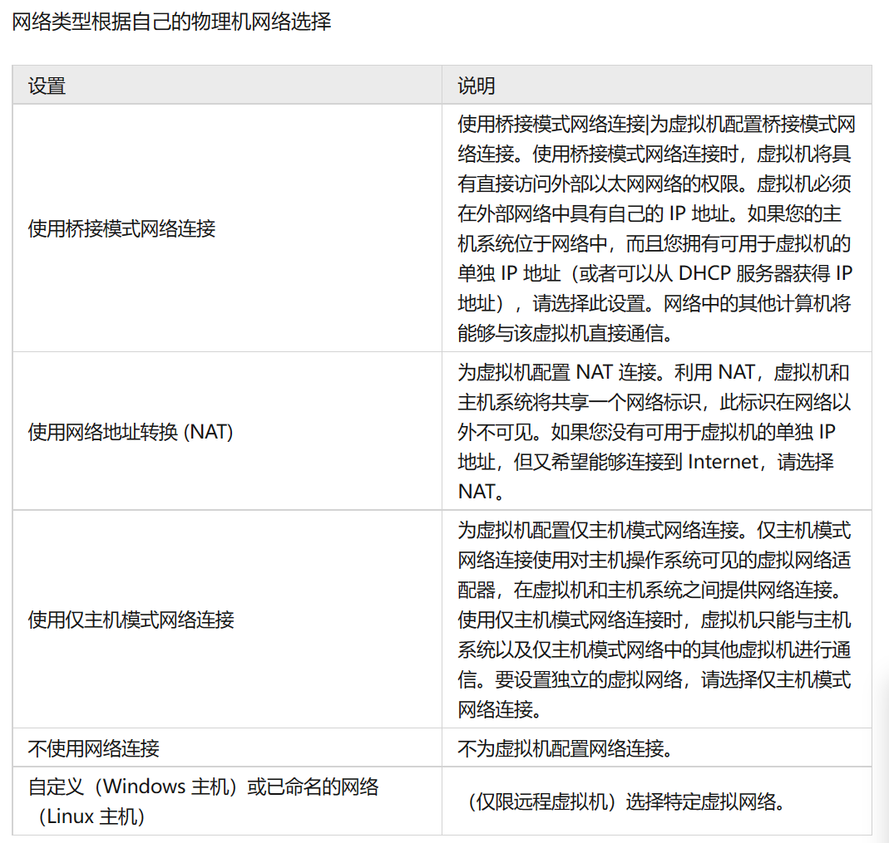
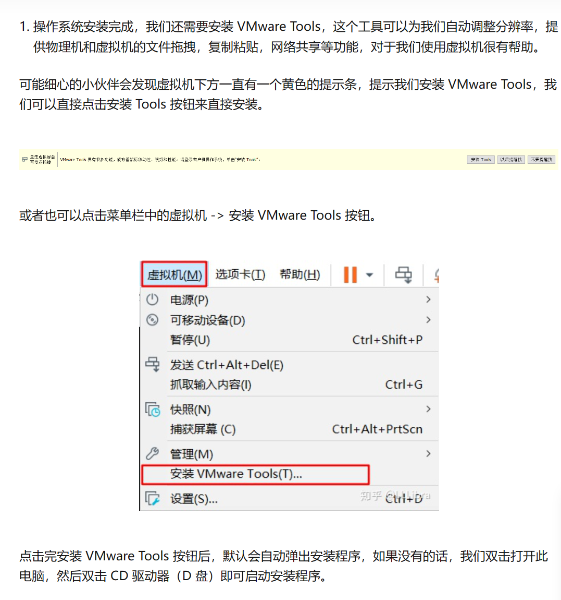

# VMware

## 概念介绍

### 虚拟机

指通过软件模拟的具有完整硬件系统功能的、运行在一个完全隔离环境中的完整计算机系统。在实体计算机中能够完成的工作在虚拟机中都能够实现。在计算机中创建虚拟机时，需要将实体机的部分硬盘和内存容量作为虚拟机的硬盘和内存容量。每个虚拟机都有独立的CMOS、硬盘和操作系统，可以像使用实体机一样对虚拟机进行操作

### 虚拟系统

虚拟系统，也常被称为影子系统，是一种计算机软件，可以在现有的操作系统上虚拟出一个相同的环境，并在该虚拟环境中运行应用程序，而所有访问与改变系统的活动将会被限制在该环境下，意即虚拟系统与实体系统是隔离的，虚拟系统中的活动不会造成实体系统的改变。虚拟系统和虚拟机功能相似但不完全相同，虚拟系统和虚拟机的不同在于：虚拟系统不会降低电脑的性能，启动虚拟系统不需要像启动windows系统那样耗费时间，运行程序更加方便快捷；虚拟系统只能模拟和现有操作系统相同的环境，而虚拟机则可以模拟出其他种类的操作系统；而且虚拟机需要模拟底层的硬件指令，所以在应用程序运行速度上比虚拟系统慢得多

### 虚拟化技术

虚拟机技术是虚拟化技术的一种，所谓虚拟化技术就是将事物从一种形式转变成另一种形式，最常用的虚拟化技术有操作系统中内存的虚拟化，实际运行时用户需要的内存空间可能远远大于物理机器的内存大小，利用内存的虚拟化技术，用户可以将一部分硬盘虚拟化为内存，而这对用户是透明的。又如，可以利用虚拟专用网技术（VPN）在公共网络中虚拟化一条安全，稳定的“隧道”，用户感觉像是使用私有网络一样

#### CPU的虚拟化技术

可以单CPU模拟多CPU并行，允许一个平台同时运行多个操作系统，并且应用程序都可以在相互独立的空间内运行而互不影响，从而显著提高计算机的工作效率

#### 多任务处理

是指用户可以在同一时间内运行多个应用程序,每个应用程序被称作一个任务.Linux、windows就是支持多任务的操作系统,比起单任务系统它的功能增强了许多

#### 超线程技术

它可使处理器中的1颗内核如2颗内核那样在操作系统中发挥作用。这样一来，操作系统可使用的执行资源扩大了一倍，大幅提高了系统的整体性能

## 原理

### CPU的虚拟化技术

虚拟化技术与多任务以及超线程技术是完全不同的。多任务是指在一个操作系统中多个程序同时并行运行，而在虚拟化技术中，则可以同时运行多个操作系统，而且每一个操作系统中都有多个程序运行，每一个操作系统都运行在一个虚拟的CPU或者是虚拟主机上；而超线程技术只是单CPU模拟双CPU来平衡程序运行性能，这两个模拟出来的CPU是不能分离的，只能协同工作。

### 多任务处理

多任务操作系统使用某种任务调度策略允许两个或更多进程并发共享一个处理器时，事实上处理器在某一时刻只会给一件任务提供服务。因为任务调度机制保证不同任务之间的切换速度十分迅速，因此给人多个任务同时运行的错觉。多任务系统中有3个功能单位：任务、进程和线程

### 超线程技术

超线程技术的原理很简单，以前的单核心处理器，在同一时间内只可以处理一项工作 (线程，Thread)，如果要处理一项以上的工作时，以前的单核心处理器是不可行的，所以英特尔就开发了超线程技术，以一个单核心的处理器，去模拟出双核心的环境，但这并非能够把处理器的效能提升双倍，原因在于实体的核心始终只有一个，而效能有约百分之二十至三十增长。

## 虚拟机的作用

1. 绝对安全，虚拟机不会影响物理机
2. 便携性，虚拟机的系统都是文件形式，可以打包发送给别人，自己也可以使用别人的包安装
3. 可逆性，虚拟机系统在物理机上就是文件，并且快照功能也可以更便捷的恢复虚拟机，在此基础上虚拟机可以不考虑安全，可以随意捣鼓。

## VMware Workstation虚拟机配置

1. cpu虚拟机的内核数一般为物理机的一半，物理机的cpu内核可以在设备管理器中查看

2. 内存4GB即可

3. 硬盘存储在单个文件，不分配所有磁盘空间，磁盘空间看实际情况给

4. 网络模式一般默认即可。下面是具体细节.

   

5. 安装VM tools

   

## VMware Workstation虚拟机使用

- 快捷键：CTRL+G（鼠标定向虚拟机），CTRL+ALT（鼠标定向物理机）
- 文件传输：安装VM tools后，物理机和虚拟机之间文件传输，只需要拖动文件即可
- 挂起：虚拟机不必要关机，可以使用更方便的挂起功能，挂起不会消耗物理机的算力和内存，并且挂起可以保存进度，方便下次使用
- 快照：可以通过快照功能来保存虚拟机当前状态，在日后需要回到此状态时可以载入。类似与游戏的存档和读档。此功能可以用来测试病毒等来防止虚拟机受到不可逆的影响。

## 其他

1. 虚拟机不推荐用来打游戏，虽然有游戏模式，但实测玩Minecraft开个原版卡的不行（虚拟机配置已经忘了，但挺高，系统WIN10）。
2. 推荐用虚拟机来学习操作系统，学Linux什么的都可以，或者把虚拟机配置成远程机来练习组网，也可以用来远程配置数据库等等，用途还是蛮多的。

> 1. 2022/12/27
> 2. 2024/8/6