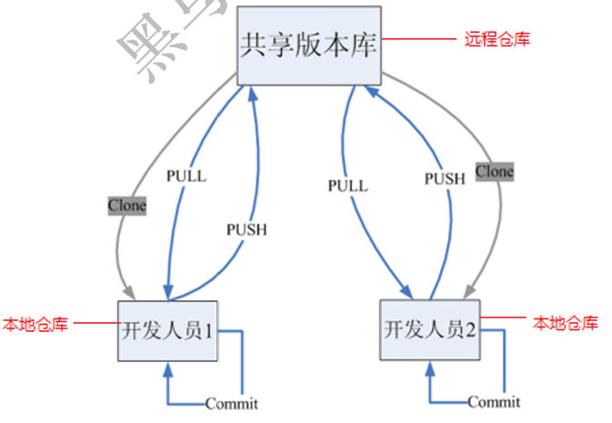
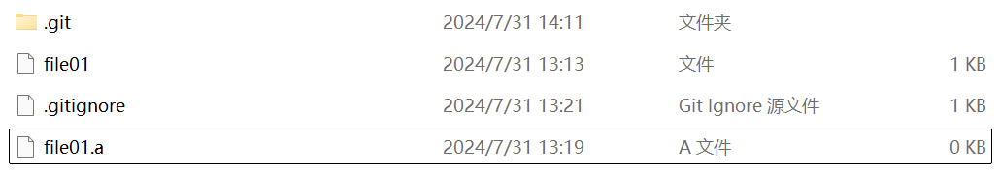
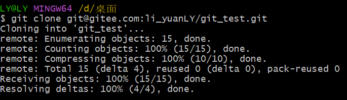
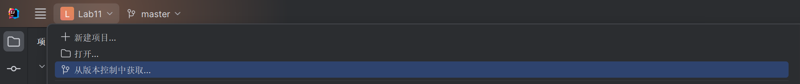
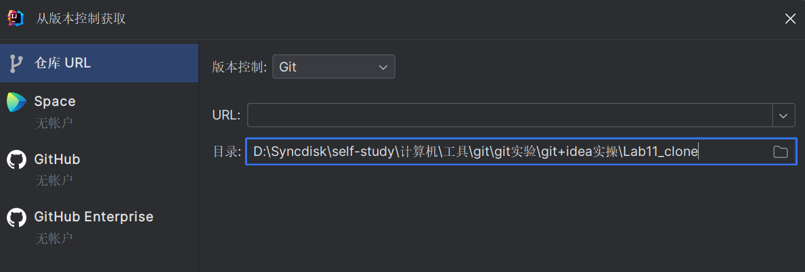

# Git分布式版本控制工具

## 概述

### 开发中的实际场景

- 场景一：备份：小明负责的模块就要完成了，就在即将Release之前的一瞬间，电脑突然蓝屏，硬盘光荣牺牲！几个月来的努力付之东流
- 场景二：代码还原：这个项目中需要一个很复杂的功能，老王摸索了一个星期终于有眉目了，可是这被改得面目全非的代码已经回不到从前了。什么地方能买到哆啦A梦的时光机啊？ 
- 场景三：协同开发：小刚和小强先后从文件服务器上下载了同一个文件：Analysis.java。小刚在Analysis.java 文件中的第30行声明了一个方法，叫count()，先保存到了文件服务器上；小强在Analysis.java文件中的第50行声明了一个方法，叫sum()，也随后保存到了文件服务器上，于是，count()方法就只存在于小刚的记忆中了
- 场景四：追溯问题代码的编写人和编写时间：老王是另一位项目经理，每次因为项目进度挨骂之后，他都不知道该扣哪个程序员的工资！就拿这次来说吧，有个Bug调试了30多个小时才知道是因为相关属性没有在应用初始化时赋值！可是二胖、王东、刘流和正经牛都不承认是自己干的！

### 版本控制器的方式

#### 集中式版本控制工具

集中式版本控制工具，版本库是集中存放在中央服务器的，team里每个人work时从中央服务器下载代码，是必须联网才能工作，局域网或互联网。个人修改后然后提交到中央版本库。举例：SVN和CVS


#### 分布式版本控制工具

分布式版本控制系统没有“中央服务器”，每个人的电脑上都是一个完整的版本库，这样工作的时候，无需要联网了，因为版本库就在你自己的电脑上。多人协作只需要各自的修改推送给对方，就能互相看到对方的修改了。举例：Git

Git是分布式的，Git不需要有中心服务器，我们每台电脑拥有的东西都是一样的。我们使用Git并且有个中心服务器，仅仅是为了方便交换大家的修改，但是这个服务器的地位和我们每个人的PC是一样的。我们可以把它当做一个开发者的pc就可以就是为了大家代码容易交流不关机用的。没有它大家一样可以工作，只不过“交换”修改不方便而已。

git是一个开源的分布式版本控制系统，可以有效、高速地处理从很小到非常大的项目版本管理。Git是Linus Torvalds 为了帮助管理 Linux 内核开发而开发的一个开放源码的版本控制软件。

同生活中的许多伟大事物一样，Git 诞生于一个极富纷争大举创新的年代。Linux 内核开源项目有着为数众多的参与者。 绝大多数的 Linux 内核维护工作都花在了提交补丁和保存归档的繁琐事务上（1991－2002年间）。 到 2002 年，整个项目组开始启用一个专有的分布式版本控制系统 BitKeeper 来管理和维护代码。

到了 2005 年，开发 BitKeeper 的商业公司同 Linux 内核开源社区的合作关系结束，他们收回了 Linux 内核社区免费使用 BitKeeper 的权力。 这就迫使 Linux 开源社区（特别是 Linux 的缔造者 Linus Torvalds）基于使用 BitKeeper 时的经验教训，开发出自己的版本系统。 他们对新的系统制订了若干目标：

- 速度
- 简单的设计
- 对非线性开发模式的强力支持（允许成千上万个并行开发的分支）
- 完全分布式
- 有能力高效管理类似 Linux 内核一样的超大规模项目（速度和数据量）



## Git工作流程图


命令如下：

1. clone（克隆）: 从远程仓库中克隆代码到本地仓库
2. checkout （检出）:从本地仓库中检出一个仓库分支然后进行修订
3. add（添加）: 在提交前先将代码提交到暂存区
4. commit（提交）: 提交到本地仓库。本地仓库中保存修改的各个历史版本
5. fetch (抓取) ： 从远程库，抓取到本地仓库，不进行任何的合并动作，一般操作比较少。
6. pull (拉取) ： 从远程库拉到本地库，自动进行合并(merge)，然后放到到工作区，相当于fetch+merge
 7. push（推送） : 修改完成后，需要和团队成员共享代码时，将代码推送到远程仓库

## Git安装与配置

本教程里的git命令例子都是在Git Bash中演示的，会用到一些基本的linux命令，在此为大家提前列举：

- ls/ll 查看当前目录
- cat 查看文件内容
- touch 创建文件
- vi vi编辑器（使用vi编辑器是为了方便展示效果，学员可以记事本、editPlus、notPad++等其它编辑器）

### Git环境配置

#### 下载与安装

下载地址：  https://git-scm.com/download

双击下载的安装文件来安装Git。安装完成后在电脑桌面（也可以是其他目录）点击右键，如果能够看 到如下两个菜单则说明Git安装成功


备注：

- Git GUI：Git提供的图形界面工具
- Git Bash：Git提供的命令行工具

当安装Git后首先要做的事情是设置用户名称和email地址。这是非常重要的，因为每次Git提交都会使用该用户信息

#### 基本配置

1. 打开Git Bash

2. 设置用户信息

   ```cmd
   git config --global user.name "itcast"
   
   git config --global user.email "hello@itcast.cn"
   ```

> ```cmd
> #查看配置信息
> git config --global user.name
> 
> git config --global user.email
> ```

#### 为常用指令配置别名（可选） 

有些常用的指令参数非常多，每次都要输入好多参数，我们可以使用别名。

1. 打开C盘的用户目录，创建`.bashrc`文件

   > 部分windows系统不允许用户创建点号开头的文件，可以打开gitBash，执行 `touch ~/.bashrc`
   >
   > 

2. 在 `.bashrc` 文件中输入如下内容

   ```cmd
   #用于输出git提交日志
   alias git-log='git log --pretty=oneline --all --graph --abbrev-commit'
   #用于输出当前目录所有文件及基本信息
   alias ll='ls -al'
   ```

3. 打开gitBash，执行 `source ~/.bashrc`

#### 解决GitBash乱码问题

1. 打开GitBash执行下面命令

   ```cmd
   git config --global core.quotepath false
   ```

2.  ${git_home}/etc/bash.bashrc 文件最后加入下面两行

   ```cmd
   export LANG="zh_CN.UTF-8"
   export LC_ALL="zh_CN.UTF-8"
   ```

   > ${git_home}指的是git安装路径

### 初始化本地仓库

要使用Git对我们的代码进行版本控制，首先需要获得本地仓库

1. 在电脑的任意位置创建一个空目录（例如test）作为我们的本地Git仓库
2. 进入这个目录中，点击右键打开Git bash窗口
3. 执行命令`git init`
4. 如果创建成功后可在文件夹下看到隐藏的.git目录。


## Git操作与指令

### 基础操作指令

Git工作目录下对于文件的修改(增加、删除、更新)会存在几个状态，这些修改的状态会随着我们执行Git 的命令而发生变化。


本章节主要讲解如何使用命令来控制这些状态之间的转换： 

1. git add (工作区 --> 暂存区)
2. git commit (暂存区 --> 本地仓库)

#### 添加工作区到暂存区(add) 

作用：添加工作区一个或多个文件的修改到暂存区

命令形式：`git add 单个文件名|通配符`

> 将当前目录所有修改加入暂存区：`git add .`

#### 查看修改的状态(status) 

作用：查看(当前)的修改的状态（暂存区、工作区）

命令形式：`git status`

#### 提交暂存区到本地仓库(commit) 

作用：提交暂存区内容到本地仓库的当前分支

命令形式：`git commit -m '注释内容'`。

#### 查看提交日志(log) 

作用:查看提交记录

命令形式：`git log [option]`

options：

- --all 显示所有分支
- --pretty=oneline 将提交信息显示为一行
- --abbrev-commit 使得输出的commitId更简短
- --graph 以图的形式显示

> 在为常用指令配置别名` git-log`就包含了这些参数，所以后续可以直接使用指令` git-log`，效果等同于`git log --pretty=oneline --all --graph --abbrev-commit`。使用这种方式输出日志的效果更好。

> 在工作树创建文件add到index后再提交的过程，以及log的使用
>
> 

#### 版本回退 

作用：版本切换

命令形式：`git reset --hard commitID`

- commitID 可以使用`git-log` 或 `git log`指令查看

> 在工作树修改文件add到index后再提交的过程，以及版本回退的使用，回退后原先的提交以及修改都会清除
>
> 

如何查看已经删除的记录？`git reflog`，这个指令可以看到已经删除的提交记录(历史记录)

> 使用git reflog查看历史记录，然后将版本再次回退到初始状态
>
> 

#### 添加文件至忽略列表 

一般我们总会有些文件无需纳入Git 的管理，也不希望它们总出现在未跟踪文件列表。 通常都是些自动生成的文件，比如日志文件，或者编译过程中创建的临时文件等。 在这种情况下，我们可以在工作目录中创建一个名为 .gitignore 的文件（文件名称固定），列出要忽略的文件模式。下面是一些规则示例：

```cmd
# 以.a结尾的文件
*.a
# but do track lib.a, even though you're ignoring .a files above
!lib.a
# only ignore the TODO file in the current directory, not subdir/TODO
/TODO
# ignore all files in the build/ directory
build/
# ignore doc/notes.txt, but not doc/server/arch.txt
doc/*.txt
# ignore all .pdf files in the doc/ directory
doc/**/*.pdf
```

>  .gitignore的使用
>
> 

#### 练习：基础操作

```cmd
#####################仓库初始化######################
# 创建目录（git_test01）并在目录下打开gitbash
略
# 初始化git仓库
git init
#####################创建文件并提交#####################
# 目录下创建文件 file01.txt
略
# 将修改加入暂存区
git add .
# 将修改提交到本地仓库，提交记录内容为：commit 001
git commit -m 'commit 001'
# 查看日志
git log
####################修改文件并提交######################
# 修改file01的内容为：count=1
略
# 将修改加入暂存区
git add .
# # 将修改提交到本地仓库，提交记录内容为：update file01
git commit --m 'update file01'
# 查看日志
git log
# 以精简的方式显示提交记录
git-log
####################将最后一次修改还原##################
# 查看提交记录
git-log
# 找到倒数第2次提交的commitID
略
# 版本回退
git reset commitID --hard
```

### 分支

几乎所有的版本控制系统都以某种形式支持分支。 使用分支意味着你可以把你的工作从开发主线上分离开来进行重大的Bug修改、开发新的功能，以免影响开发主线。

#### 查看本地分支 

命令：`git branch`

#### 创建本地分支 

命令：`git branch 分支名`

#### 切换分支(checkout) 

命令：`git checkout 分支名`

> 创建一个dev01分支，并且切换到此分支。
>
> 这里的HEAD指工作区所在的分支，工作区只能为一个分支服务，只能同时修改一个分支，这个分支也叫当前分支
>
> 
>
> 随后我们在master(主分支)上创建文件master file，然后查看和切换分支做对比
>
> 
>
> 切换到主分支时的文件目录
>
> 
>
> 切换到dev01分支时的文件目录
>
> 
>
> 

我们还可以直接切换到一个不存在的分支（创建并切换）

命令：`git checkout -b 分支名`

> 这个命令比切换使用的多，相当于创建+切换分支
>
> 

#### 删除分支 

不能删除当前分支，只能删除其他分支

- `git branch -d 分支名称` 删除分支时，需要做各种检查
- `git branch -D 分支名称` 不做任何检查，强制删除

> 删除分支dev02
>
> 
>
> 当分支上有提交且没有合并到主分支时，选择删除分支会出现无法删除的情况，这是以防误删除因为分支上的提交并没有合并到主分支。而这个时候想要强制删除此分支就需要用到`git branch -D 分支名称`

#### 合并分支(merge) 

一个分支上的提交可以合并到另一个分支

命令：`git merge 分支名称`

> 在dev01分支上创建file02文件，然后跳转到master去合并dev01分支（master通常规定为主分支），最后查看合并结果
>
> 
>
> 未合并前
>
> 
>
> 合并后
>
> 

#### 解决冲突 

当两个分支上对文件的修改可能会存在冲突，例如同时修改了同一个文件的同一行，这时就需要手动解决冲突，解决冲突步骤如下：

1. 处理文件中冲突的地方。打开冲突文件对内容进行修改。
2. 将解决完冲突的文件加入暂存区(add)
3. 提交到仓库(commit)

冲突部分的内容处理如下所示：


#### 开发中分支使用原则与流程 

几乎所有的版本控制系统都以某种形式支持分支。 使用分支意味着你可以把你的工作从开发主线上分离开来进行重大的Bug修改、开发新的功能，以免影响开发主线。

在开发中，一般有如下分支使用原则与流程：

- master （生产） 分支：线上(发布)分支，主分支，中小规模项目作为线上运行的应用对应的分支；
- develop（开发）分支：是从master创建的分支，一般作为开发部门的主要开发分支，如果没有其他并行开发不同期上线要求，都可以在此版本进行开发，阶段开发完成后，需要是合并到master分支，准备上线。
- feature/xxxx分支：从develop创建的分支，一般是同期并行开发，但不同期上线时创建的分支，分支上的研发任务完成后合并到develop分支。
- hotfix/xxxx分支：从master派生的分支，一般作为线上bug修复使用，修复完成后需要合并到master、test、develop分支。

还有一些其他分支，在此不再详述，例如test分支（用于代码测试）、pre分支（预上线分支）等等。

在开发流程中，是在develop分支上创建分支，比如开发一个新功能，就在上面创建一个分支feature/xxx1，开发完成后就会把这个分支合并到develop。当要发布新版本时，会把develop分支的代码合并到master上，并创建一个release/xxxx分支用来标注这是一个版本。hotfix/xxxx分支用于修复bug，当要合并此分支时，不仅要合并到master上，还要同步合并到develop上。master和develop分支一般不删，而其他分支合并完后可以删除


#### 练习：分支操作

```cmd
###########################创建并切换到dev01分支，在dev01分支提交
# [master]创建分支dev01
git branch dev01
# [master]切换到dev01
git checkout dev01
# [dev01]创建文件file02.txt
略
# [dev01]将修改加入暂存区并提交到仓库,提交记录内容为：add file02 on dev
git add .
git commit -m 'add file02 on dev'
# [dev01]以精简的方式显示提交记录
git-log
###########################切换到master分支，将dev01合并到master分支
# [dev01]切换到master分支
git checkout master
# [master]合并dev01到master分支
git merge dev01
# [master]以精简的方式显示提交记录
git-log
# [master]查看文件变化(目录下也出现了file02.txt)
略
##########################删除dev01分支
# [master]删除dev01分支
git branch -d dev01
# [master]以精简的方式显示提交记录
git-log
```

#### 补充：快进模式

当主分支和其他分支都有修改时，那么就会出现如下所示的图例


但如果主线没有修改而分支出现了修改，图例就会变成这样。


这是由于主线并没有修改，而分支上拥有主线的所有提交，因此直线涵盖了主线。所以当主线合并此支线时，会直接让主线等同于此支线，这就是快进模式。


### Git远程仓库

#### 常用的托管服务[远程仓库]

前面我们已经知道了Git中存在两种类型的仓库，即本地仓库和远程仓库。那么我们如何搭建Git远程仓库呢？我们可以借助互联网上提供的一些代码托管服务来实现，其中比较常用的有GitHub、码云、GitLab等。

- gitHub（ 地址：https://github.com/ ）是一个面向开源及私有软件项目的托管平台，因为只支持Git 作为唯一的版本库格式进行托管，故名gitHub
- 码云（地址： https://gitee.com/ ）是国内的一个代码托管平台，由于服务器在国内，所以相比于GitHub，码云速度会更快
- GitLab （地址： https://about.gitlab.com/ ）是一个用于仓库管理系统的开源项目，使用Git作为代码管理工具，并在此基础上搭建起来的web服务,一般用于在企业、学校等内部网络搭建git私服。

> 课程使用码云作为托管平台，但实际肯定要用github，所以码云仅用作初学熟悉

#### 注册码云

要想使用码云的相关服务，需要注册账号（地址：  https://gitee.com/signup ）

#### 创建远程仓库


> 不需要初始化，因为已经有本地仓库了，只是将本地仓库上传到远程仓库

仓库创建完成后可以看到仓库地址，如下图所示:


#### 配置SSH公钥

这里要先讲如何操作，再讲解一下SSH是什么。

1. 在客户端查看有无密钥：`cd ~/.ssh`

   

2. （如果没有）生成SSH密钥：`ssh-keygen -t rsa`，然后在命令行输入，一直回车，直到出现下图的内容：

   

   > 如果密钥已经存在，则自动覆盖，所以如果有了不要再生成！

3. 获取ssh key公钥内容：`cat ~/.ssh/id_rsa.pub`

   

4. 将公钥添加到Gitee的密钥中

   

   > 注意如果在仓库使用此公钥只有读功能，如果需要读写功能需要再个人公钥那里添加

5. 验证是否配置成功：`ssh -T git@gitee.com`

   这里如果第一次连接这个服务器，会出现是否连接，输入yes即可。

   

接下来讲一下原理。

SSH（安全外壳协议），通过 SSH 进行连接时，使用本地计算机上的私钥文件进行身份验证。SSH登录安全性由非对称加密保证，产生密钥时，一次产生两个密钥，一个公钥，一个私钥，在git中一般命名为id_rsa.pub, id_rsa。

那么如何使用生成的一个私钥一个公钥进行验证呢？

- 本地生成一个密钥对，其中公钥放到远程主机，私钥保存在本地
- 当本地主机需要登录远程主机时，本地主机向远程主机发送一个登录请求，远程收到消息后，随机生成一个字符串并用公钥加密，发回给本地。本地拿到该字符串，用存放在本地的私钥进行解密，再次发送到远程，远程比对该解密后的字符串与源字符串是否等同，如果等同则认证成功。

重点来了：**一定要知道ssh key的配置是针对每台主机的！**，比如我在某台主机上操作git和我的远程仓库，想要push时不输入账号密码，走ssh协议，就需要配置ssh key，放上去的key是**当前主机的ssh公钥**。那么如果我换了一台其他主机，想要实现无密登录，也就需要重新配置。

下面解释一些问题：

1. 为什么要配？配了才能实现push代码的时候不需要反复输入自己的github账号密码，更方便
2. 每使用一台主机都要配？是的，每使用一台新主机进行git远程操作，想要实现无密，都需要配置。并不是说每个账号配一次就够了，而是每一台主机都需要配。
3. 配了为啥就不用密码了？因为配置的时候是把当前主机的公钥放到了你的github账号下，相当于当前主机和你的账号做了一个关联，你在这台主机上已经登录了你的账号，此时此刻github认为是该账号主人在操作这台主机，在配置ssh后就信任该主机了。所以下次在使用git的时候即使没有登录github，也能直接从本地push代码到远程了。当然这里不要混淆了，你不能随意push你的代码到任何仓库，你只能push到你自己的仓库或者其他你有权限的仓库！

> 这也是密钥加密的工作原理，大致如下：
>
> 1. **密钥生成**：
>    - 接收方生成一对密钥：一个公钥和一个私钥。
>    - 公钥是公开的，可以自由分发给任何人。
>    - 私钥是保密的，只能由接收方自己持有。
> 2. **加密过程**：
>    - 发送方获取接收方的公钥。
>    - 发送方使用接收方的公钥对需要发送的信息进行加密。
>    - 加密后的信息称为密文。
> 3. **传输**：
>    - 发送方将密文发送给接收方。
> 4. **解密过程**：
>    - 接收方收到密文后，使用自己的私钥对密文进行解密。
>    - 解密后的信息称为明文，即原始信息。
>
> 私钥和公钥的显著区别就是：私钥是私密的，公钥是公开的。
>
> 注意数字签名和上面的工作原理是反的，准确来说发送者持有密钥用于对原始信息进行加密，然后将原始信息和加密的原始信息一并给接收方，如果接收方拿到加密信息使用公钥解密发现和原始信息匹配，则可以确定消息未被篡改且确实来自发送方。

#### 操作远程仓库

此操作是先初始化本地库，然后与已创建的远程库进行对接

1. 添加远程仓库：`git remote add <远端名称> <仓库路径>`

   - 远端名称，即远程仓库的名称，一般默认使用origin

   - 仓库路径，从远端服务器获取此URL

     

   - 例如：`git remote add origin git@gitee.com:li_yuanLY/git_test.git`

   

2. 查看远程仓库：`git remote`

   

3. 推送到远程仓库：`git push [-f] [--set-upstream] [远端名称] [本地分支名][:远端分支名]`

   - `-f`：表示强制覆盖，即当远程仓库和本地仓库存在文件冲突，输入-f可以强制对远程仓库的冲突文件进行覆盖。如果没有-f，则只添加文件而不覆盖文件

   - `--set-upstream 远端名称`：推送到远端的同时并且建立起和远端分支的绑定关系，如推送master分支且将本地master分支绑定远程master分支`git push --set-upstream origin master`

     > 如果当前分支已经和远端分支绑定，则可以省略分支名和远端名，`git push` 将当前分支推送到已绑定的远端分支。

   - `[本地分支名][:远端分支名]`：如果远程分支名和本地分支名称相同，可以只写本地分支。例如推送master分支`git push origin master:master`可简写成：`git push origin master`

   

4. 查看远程仓库

   

#### 查看分支和远程仓库绑定关系

命令：`git branch -vv`


#### 从远程仓库克隆

如果已经有一个远端仓库，我们可以直接clone到本地。

命令：`git clone <仓库路径> [本地目录]`

- 本地目录可以省略，会自动生成一个目录

在码云上复制地址


进行克隆



可以发现克隆的和原始仓库没有区别（左边新仓库右边原始仓库）


#### 从远程仓库中抓取和拉取

远程分支和本地的分支一样，我们可以进行merge操作，只是需要先把远端仓库里的更新都下载到本地，再进行操作。

抓取：`git fetch [remote name] [branch name]`

- 抓取指令就是将远程仓库里的分支更新都抓取到本地，但不会和本地仓库对应的分支进行合并，如果不指定远端名称和分支名，则抓取所有分支。
- remote name：远端名称，一般固定为origin
- branch name：分支名，指远端要抓取的分支

> 在原始仓库这个本地仓库进行一次提交并推送到远程仓库
>
> 
>
> 在另一个仓库将远程提交的代码抓取到本地仓库
>
> 
>
> 但是可以看到抓取过来的远程分支并没有和对应的本地分支合并，因此我们需要手动merge，这个时候两个本地仓库就会都一样了（左边是新仓库）
>
> 
>
> 但这样做太麻烦，因此下面的拉取命令可以一并解决

拉取：`git pull [remote name] [branch name]`

- 拉取指令就是将远程仓库里的分支更新都抓取到本地，并自动进行合并，等同于fetch+merge，如果不指定远端名称和分支名，则抓取所有并更新当前分支。

> 在新仓库将远程提交的代码拉取到本地仓库，效果和上图一致
>
> 

#### 解决合并冲突

在一段时间，A、B用户修改了同一个文件，且修改了同一行位置的代码，此时会发生合并冲突。A用户在本地修改代码后优先推送到远程仓库，此时B用户在本地修订代码，提交到本地仓库后，也需要推送到远程仓库，此时B用户晚于A用户，故需要先拉取远程仓库的提交，经过合并后才能推送到远端分支,如下图所示。


在B用户拉取代码时，因为A、B用户同一段时间修改了同一个文件的相同位置代码，故会发生合并冲突。远程分支也是分支，所以合并时冲突的解决方式也和解决本地分支冲突相同。

> 在原始仓库将file01文件里的内容进行更新，然后提交到远程仓库
>
> 
>
> 对新仓库也进行同样的操作，先修改file01，然后提交，但发现远程仓库已有更新
>
> 
>
> 因此只能先拉取，这里将拉取拆成fetch+marge方便观看。可以发现fetch后的分支和本地分支产生冲突的情景一模一样，这也是示例中的示例图最开始的情况。
>
> 
>
> 这时我们进行拉取合并分支(pull有合并功能，没有更新的情况下相当于空fetch+merge)，提示file01文件出现冲突，打开文件发现冲突和本地冲突时的表现一模一样，而解决方法也一样，把冲突的地方删掉就行，这里我们删除远程，修改文件为`upload 02`
>
> 
>
> 修改后提交到远程仓库
>
> 
>
> 最后原始仓库也进行拉取，冲突解决完成

#### 练习：远程仓库操作

```cmd
##########################1-将本地仓库推送到远程仓库
# 完成4.1、4.2、4.3、4.4的操作
略
# [git_test01]添加远程仓库
git remote add origin  git@gitee.com/**/**.git
# [git_test01]将master分支推送到远程仓库,并与远程仓库的master分支绑定关联关系
git push --set-upstream origin master
###########################2-将远程仓库克隆到本地
# 将远程仓库克隆到本地git_test02目录下
git clone git@gitee.com/**/**.git  git_test02
# [git_test02]以精简的方式显示提交记录
git-log
###########################3-将本地修改推送到远程仓库
# [git_test01]创建文件file03.txt
略
# [git_test01]将修改加入暂存区并提交到仓库,提交记录内容为：add file03
git add .
git commit -m 'add file03'
# [git_test01]将master分支的修改推送到远程仓库
git push origin master
###########################4-将远程仓库的修改更新到本地
# [git_test02]将远程仓库修改再拉取到本地
git pull
# 以精简的方式显示提交记录
git-log
# 查看文件变化(目录下也出现了file03.txt)
略
```

## 在Idea中使用Git

上边的所有操作都仅仅是使用Git，而在实际开发中，肯定是离不开代码的，因此下面的操作都是开发环境中会遇到的

### 在Idea中配置Git

安装好IntelliJ IDEA后，idea会自动找到git的位置，如果没找到需要手动配置下Git的路径。选择File→Settings打开设置窗口，找到Version Control下的git选项：


### 在Idea中操作Git

场景：本地已经有一个项目，但是并不是git项目，我们需要将这个放到码云的仓库里，和其他开发人员继续一起协作开发。

#### 创建项目远程仓库


#### 初始化本地仓库


#### 提交到本地仓库


#### 设置远程仓库


#### 推送到远程仓库


#### 克隆远程仓库到本地





#### 解决冲突

1. 在本地仓库一提交推送修改好的代码

   

2. 在本地仓库二提交推送修改好的代码，发现冲突

   

   

3. 选择合并后，如果出现合并冲突，可以点击合并选项快速合并，也可以关闭此窗口自己进行手动解决

   

   自动合并

   

   手动合并

   

4. 解决后推送即可

#### 创建分支

对节点右键选择创建分支，即可在对应地点创建


### 场景分析

基于我们后面的实战模式，我们做一个综合练习

当前的开发环境如下，我们每个人都对这个项目已经开发一段时间，接下来我们要切换成团队开发模式。

也就是我们由一个团队来完成这个项目实战的内容。团队有组长和若干组员组成（组长就是开发中的项目经理）。

所有操作都在idea中完成。

练习场景如下：

1. 由组长，基于本项目创建本地仓库；创建远程仓库，推送项目到远程仓库。

   

2. 每一位组员从远程仓库克隆项目到idea中,这样每位同学在自己电脑上就有了一个工作副本，可以正式的开始开发了。我们模拟两个组员(组员A、组员B)，克隆两个工作区。

   

3. 组员A修改工作区,提交到本地仓库，再推送到远程仓库。组员B可以直接从远程仓库获取最新的代码。

   

4. 组员A和组员B修改了同一个文件的同一行，提交到本地没有问题，但是推送到远程仓库时，后一个推送操作就会失败。

   解决方法：需要先获取远程仓库的代码到本地仓库，编辑冲突，提交并推送代码。

   

### 几条铁令

1. 切换分支前先提交本地的修改
2. 代码及时提交，提交过了就不会丢
3. 遇到任何问题都不要删除文件提交目录

### 命令行控制

如果不想使用idea的图形化界面，用回命令行也是可以的，如下。


这样你的控制台就会变成gitbash了，可以像以前一样直接用指令控制git。

## Git实战

### 为什么使用Git

1. 多数企业都选择GIT作为代码管理的工具。
2. 项目实战需要，项目实战阶段是团队作战，需要使用git进行代码管理。
3. 与copy代码相比，使用GIT更有优势

|      | 代码获取                     | 代码使用                                                     | 存储空间 |
| ---- | ---------------------------- | ------------------------------------------------------------ | -------- |
| GIT  | 更新后只需要执行git pull即可 | 1. 无需每次导入。<br/>2. 可以看到每个功能实现步骤的代码细节。<br/>3. 有提交记录，方便查看对照 | 节省空间 |
| 拷贝 | 更新后每次都要copy           | 1. 每次使用都需要用idea来导入，使用极不方便。<br/>2. 拿到的代码是一个项自，包含了每次改动后的代码总和，不容易分清现在代码和过去代码的关系。<br/>3. 代码在不同项自中，所有需要打开多个IDEA进行代码参考。 | 浪费空间 |

### 分支模型示例

这里是一个代码授课的分支模型。

课前： 

- 老师：每次课前都会给学生共享1个book/xx分支（推送到远程仓库）。这是本次课要实现的代码分支，和讲义的代码完全一致。里面的代码提交记录，详细描述了每一次对代码修改的细节。（即标准示例代码的提交分支）
- 学生：将代码fetch拉取到本地（不要合并，因为这是示例代码）

课上：

- 学生：创建一个本次课的开发分支，格式：dev/xx。从上一次课的实现代码上创建本次课的代码，例如： 第1天，就从book/00创建一个开发分支dev/01（book/00是我们项目的初始代码分支）；第2天，就从book/01创建一个开发分支dev/02；第10天，就从book/09创建一个开发分支dev/10。


> 2024/8/6
