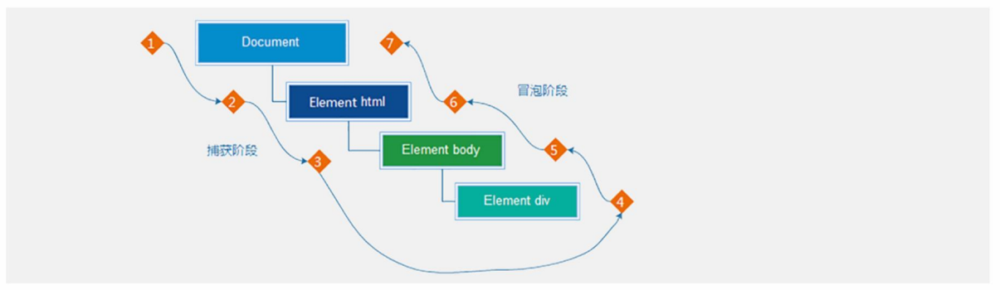

# web API

API作用：使用 JS 去操作 html 和浏览器

API分类：DOM (文档对象模型)、BOM（浏览器对象模型）

## DOM概念

DOM（Document Object Model）是将整个 HTML 文档的每一个标签元素视为一个对象，这个对象下包含了许多的属性和方法，通过操作这些属性或者调用这些方法实现对 HTML 的动态更新，为实现网页特效以及用户交互提供技术支撑。

简言之 DOM 是用来动态修改 HTML 的，其目的是开发网页特效及用户交互。

DOM作用：开发网页内容特效和实现用户交互

### DOM 树

DOM树是描述网页内容关系的名词，指将 HTML 文档以树状结构直观的表现出来，我们称之为文档树或 DOM 树，它将HTML文档以树状结构直观的表达

作用：文档树直观的体现了标签与标签之间的关系


#### DOM 节点说明

节点是文档树的组成部分，**每一个节点都是一个 DOM 对象**，主要分为元素节点、属性节点、文本节点等。

1. 【元素节点】其实就是 HTML 标签，如上图中 `head`、`div`、`body` 等都属于元素节点。
2. 【属性节点】是指 HTML 标签中的属性，如上图中 `a` 标签的 `href` 属性、`div` 标签的 `class` 属性。
3. 【文本节点】是指 HTML 标签的文字内容，如 `title` 标签中的文字。
4. 【根节点】特指 `html` 标签。
5.  其它...

### DOM 对象

DOM的核心思想：把网页内容当做对象来处理，即任何标签都当作对象

DOM对象：浏览器根据html标签的生成JS对象(dom对象)，所有的标签属性都可以在这个对象上面找到，修改对象的属性会自动映射到标签身上

```javascript
//获取div对象(在html里是标签，js里叫对象，并且是dom对象)
const div = document.querySelector('div')
//打印div对象
console.dir(div)
```

> 最大的DOM对象 - document对象：DOM里提供的一个对象，指整个网页，网页所有内容都在document里面。所以它提供的属性和方法都是用来访问和操作网页内容的，如document.write()

## DOM对象获取和操作

### 获取DOM对象

#### 根据CSS选择器来获取DOM对象 (重点)

##### 选择匹配的第一个元素

语法：`document.querySelector('css选择器')`

含义：document指选中整个页面，因为标签都在页面里。querySelector叫查询选择器，选择匹配的第一个元素

参数:包含一个或多个(如父级形式)有效的CSS选择器，字符串格式

返回值：CSS选择器匹配的第一个元素,一个HTMLElement对象。如果没有匹配到，则返回null。

```html
<style>
    .box {
        width: 200px;
        height: 200px;
    }
</style>
<body>
    <div class="box">123</div>
    <div class="box">abc</div>
    <script>
        const box = document.querySelector('.box')//获取匹配的第一个元素，这里使用的是类选择器
        console.log(box);//打印box对象，这里的对象是第一个div
    </script>
</body>
```

##### 选择匹配的多个元素

语法：`document.querySelectorAll('css选择器')`

参数:包含一个或多个(如父级形式)有效的CSS选择器，字符串格式

返回值：CSS选择器匹配的NodeList对象集合，即一个伪数组，是有长度有索引号的数组，但是没有 pop() push() 等数组方法，想要得到里面的每一个对象，则需要遍历（for）的方式获得。

注意：哪怕只有一个元素，通过querySelectAll() 获取过来的也是一个伪数组，里面只有一个元素而已

```html
<body>
    <ul>
        <li>1</li>
        <li>2</li>
        <li>3</li>
    </ul>
    <script>
        const lis = document.querySelectorAll('ul li')//获取ul li里的所有li，这里使用的是后代选择器
        console.log(lis);

        //打印querySelectorAll获取的伪数组里的每个dom对象
        const liss = document.querySelectorAll('ul li')
        for (let i = 0; i < liss.length; i++) {
            console.log(liss[i]);
        }
    </script>
</body>
```

#### 其他获取DOM元素方法（了解）

下面都是些过时的方法：

- getElementById，根据id获取一个元素

```javascript
 document.getElementById('nav')
```

- getElementsByTagName，根据标签获取一类元素，获取页面所有div

```javascript
document.getElementsByTagName('nav')
```

- getElementsByClassName，根据类名获取元素，获取页面所有类名为w的

```javascript
document.getElementsByClassName('nav')
```

### 操作DOM对象

#### 操作元素内容

DOM对象都是根据标签生成的，所以操作标签，本质上就是操作DOM对象。而操作对象就需要用到 . 操作符。因此想要修改标签元素的里面的内容，则可以使用如下几种方式：

1. 对象.innerText 
2. 对象.innerHTML

##### 元素.innerText 属性

它可以将文本内容添加或更新到任意的标签位置，但它只显示纯文本，不解析标签。

```html
<body>
    <div class="box1">文字内容</div>
    <script>
        const box1 = document.querySelector('.box1')//获取元素
        box1.innerText = '我是盒子'//修改文字内容，使用 对象.innerText。这里可以理解为获得box1对象里的innerText属性，该属性存放的是标签里的文字内容
        console.log(box1.innerText);//我是盒子
        box1.innerText = '<strong>我是盒子</strong>'//文字并不会加粗，标签未被解析
    </script>
</body>
```

##### 元素.innerHTML 属性

它可以将文本内容添加或更新到任意的标签位置，不同的是它会解析标签，多标签建议使用模板字符。

```html
<body>
    <div class="box2">文字内容</div>
    <script>
        const box2 = document.querySelector('.box2')//获取元素
        box2.innerHTML = '<strong>我是盒子</strong>'//修改文字内容，使用 对象.innerHTML。文字加粗，标签被解析
    </script>
</body>
```

#### 操作元素属性

##### 操作元素标签属性

可以通过 JS 设置或修改标签元素属性，比如通过src更换图片。最常见的属性比如： href、title、src。
语法：`对象.属性 = 值 `

```html
<body>
    
    <script>
        const img = document.querySelector('img')
        img.src = './images/2.webp'
        img.title = 'pink老师的艺术照'
    </script>
</body>
```

###### 操作表单元素属性

表单很多情况，也需要修改属性，比如点击眼睛，可以看到密码，本质是把表单类型转换为文本框

正常的有属性有取值的表单属性跟其他的标签属性没有任何区别

获取:`DOM对象.属性名`

设置:`DOM对象.属性名= 新值`

~~~html
<body>
    <input type="text" value="电脑">
    <script>
        const uname = document.querySelector('input')//获取元素
        console.log(uname.value);//获取值(不能使用innerHTML，它可以获得普通元素的内容，而表单的内容在value里，比较特殊)
        uname.type = 'password'//设置值，类型变为密码框
    </script>
</body>
~~~

表单属性中添加就有效果,移除就没有效果,一律使用布尔值表示 如果为true 代表添加了该属性 如果是false 代表移除了该属性

比如： disabled、checked、selecte

~~~html
<body>
    <input type="checkbox" name="" id="checkbox">
    <button>按钮</button>
    <script>
        const ipt = document.querySelector('#checkbox')//获取元素
        console.log(ipt.checked);//false，没有该属性值
        ipt.checked = true//设置拥有复选框('true'也可以，因为他会进行隐式转换，字符串有值就为真，但不提倡这种写法)

        const btn = document.querySelector('button')//获取元素
        btn.disabled = true//按钮不可点击
    </script>
</body>
~~~

##### 操作元素样式属性

可以通过 JS 设置或修改标签元素的样式属性，比如通过轮播图小圆点自动更换颜色样式，点击按钮可以滚动图片，这是通过transform实现的等等。

###### 通过 style 属性操作CSS

语法：`对象.style.样式属性 = 值`

注意： 

1. 修改样式通过style属性引出 

2. 如果属性有-连接符，需要转换为小驼峰命名法 
2. 赋值的时候，需要的时候不要忘记加css单位

```html
<style>
    .box1 {
        width: 200px;
        height: 200px;
        background-color: pink;
    }
</style>
<body>
    <div class="box1"></div>
    <script>
        const box1 = document.querySelector('.box1')//获取元素
        box1.style.width = '300px'//对象.style.样式属性 = 值
        box1.style.border = '2px solid lightpink'
        box1.style.borderTop = '2px solid red'//当出现css属性中有-，可以采取小驼峰命名法来调用属性
        box1.style.backgroundColor = 'hotpink'
    </script>
</body>
```

###### 操作类名 (className) 操作CSS（常用）

如果修改的样式比较多，直接通过style属性修改比较繁琐，我们可以通过借助于css类名的形式。

语法：`元素.className = 'active'`

注意： 

1. 由于class是关键字, 所以使用className去代替 
2. className是使用新值换旧值, 也就是添加类名后只能有一个className类，原先类名被覆盖

```html
<style>
    i {
        display: block;
    }
    .bg {
        background: #000;
    }
</style>
<body>
    <p></p>
    <i class="bg"></i>
    <script>
        const p = document.querySelector('p')//获取元素
        p.className = 'box2'//添加类名

        const i = document.querySelector('i')
        i.className = 'box2 bg'//如果还想要原先的类名，则需要重新添加
    </script>
</body>
```

###### 通过 classList 操作类控制CSS
为了解决className 容易覆盖以前的类名，我们可以通过classList方式追加和删除类名，他不会影响原先的类名

语法：

1. 追加一个类：`元素.classList.add('类名') `
2. 删除一个类：`元素.classList.remove('类名') `
3. 切换(有此类删除，没此类追加)一个类：`元素.classList.toggle('类名')`

> classList的使用场景：tab栏切换，选中的tab有一个独有的类，如果要选择其他的tab，那么就要先remove删除原来的tab，再add添加新的tab。思路就是先干掉所有人包括自己，再添加新的类

```html
<style>
    del {
        display: block;
    }
    .box2 {
        width: 300px;
        height: 300px;
        background-color: skyblue;
        margin: 100px auto;
        padding: 10px;
        border: 1px solid #000;
    }
</style>
<body>
    <del class="box2"></del>
    <script>
        const del = document.querySelector('del')//获取元素
        del.classList.add('bg')//添加bg类
        del.classList.remove('box2')//删除box2类
        del.classList.toggle('box2')//切换box2类，因为刚刚删除了box2类，因此这里的效果为追加box2类
    </script>
</body>
```

**classList.contains() 检测类名**

```html
<style>
    .a {
        width: 50px;
        height: 50px;
        background-color: pink;
    }
</style>
<body>
    <div class="a"></div>
    <script>
        const div = document.querySelector('div')
        // classList.contains() 看看有没有包含某个类，如果有则返回true，么有则返回false
        console.log(div.classList.contains('a'));//true
        console.log(div.classList.contains('b'));//false
    </script>
</body>
```

##### 自定义属性

标准属性: 标签天生自带的属性 比如class id title等, 可以直接使用点语法操作比如： disabled、checked、selected

自定义属性：

- 在html5中推出来了专门的data-自定义属性  

- 在标签上一律以data-开头

- 在DOM对象上一律以dataset(data - 自定义属性，set - 集合)对象方式获取

- 无论一个元素写了多少data- ，它都会被装在dataset对象中

~~~html
<body>
    <div data-id="1" data-spm="不道">1</div>
    <div data-id="2">2</div>
    <div data-id="3">3</div>
    <div data-id="4">4</div>
    <div data-id="5">5</div>
    <script>
        const one = document.querySelector('div')//获取元素
        console.log(one.dataset.id);//1
        console.log(one.dataset.spm);//不道
    </script>
</body>
~~~

## DOM事件

事件是在编程时系统内发生的动作或者发生的事情。**一旦行为或状态发生改变，便立即调用一个函数。**

例如：用户使用【鼠标点击】网页中的一个按钮、用户使用【鼠标拖拽】网页中的一张图片

###  事件监听

就是让程序检测是否有事件产生，一旦有事件触发，就立即调用一个函数做出响应，也称为 绑定事件 或者 注册事件。比如鼠标经过显示下拉菜单，比如点击可以播放轮播图等等。

结合 DOM 使用事件时，需要为 DOM 对象添加事件监听，等待事件发生（触发）时，便立即调用一个函数。

`addEventListener` 是 DOM 对象专门用来添加事件监听的方法，它的两个参数分别为【事件类型】和【事件回调】。

语法：`元素对象.addEventListener('事件类型',要执行的函数)`

```html
<body>
    <button>按钮</button>
    <script>
        const btn = document.querySelector('button')
        btn.addEventListener('click', function () {
            alert('点击成功')
        })
        // 注意： 1. 事件类型要加引号 2. 函数是点击之后再去执行，每次点击都会执行一次
    </script>
</body>
```

完成事件监听分成4个步骤：

1. 获取 DOM 元素
2. 通过 `addEventListener` 方法为 DOM 节点添加事件监听
3. 等待事件触发，如用户点击了某个按钮时便会触发 `click` 事件类型
4. 事件触发后，相对应的回调函数会被执行

>  大白话描述：所谓的事件无非就是找个机会（事件触发）调用一个函数（回调函数）。

事件监听三要素：

- 事件源(元素对象)： 哪个dom元素被事件触发了，即要获取的dom元素 (谁被触发了)
- 事件类型： 用什么方式触发，比如鼠标单击 click、鼠标经过 mouseover 等 (用什么方式触发，点击还是鼠标经过等)
- 事件调用的函数： 要做什么事（要做什么事情）

#### 事件类型

【事件类型】决定了事件被触发的方式，如 `click` 代表鼠标单击，`dblclick` 代表鼠标双击。

##### 鼠标事件

使用鼠标触发

###### click 鼠标点击

`click` 译成中文是【点击】的意思，它的含义是监听（等着）用户鼠标的单击操作，

```html
<body>
    <button>按钮</button>
    <script>
        const btn = document.querySelector('button')
        btn.addEventListener('click', function () {
            alert('点击成功')
        })
    </script>
</body>
```

###### mouseenter 鼠标经过

```html
<style>
    div {
        width: 200px;
        height: 200px;
        background-color: pink;
    }
</style>
<body>
    <div></div>
    <script>
        const div = document.querySelector('div')
        div.addEventListener('mouseenter', function () {
            console.log('鼠标经过');
        })
    </script>
</body>
```

###### mouseleave 鼠标离开

```html
<style>
    div {
        width: 200px;
        height: 200px;
        background-color: pink;
    }
</style>
<body>
    <div></div>
    <script>
        const div = document.querySelector('div')
        div.addEventListener('mouseleave', function () {
            console.log('鼠标离开');
        })
    </script>
</body>
```

##### 焦点事件

表单获得光标

###### focus 获得焦点

```html
<body>
    <input type="text" class="focus">
    <script>
        const focus = document.querySelector('.focus')
        focus.addEventListener('focus', function () {
            console.log('焦点触发');
        })
    </script>
</body>
```

###### blur 失去焦点

```html
<body>
    <input type="text" class="focus">
    <script>
        const focus = document.querySelector('.focus')
        focus.addEventListener('blur', function () {
            console.log('焦点失去');
        })
    </script>
</body>
```

###### change 变化焦点

```html
<body>
    <input type="text">
    <script>
        const input = document.querySelector('input')
        input.addEventListener('change', function () {
            console.log(1);
        })
        //当里面的值没有变化时，得到焦点和失去焦点都不会进行执行事件。当值变化后，得到焦点或失去焦点则会执行事件
        //现在的表单效果都是change，blur触发过于频繁
    </script>
</body>
```

##### 键盘事件

键盘触发

###### keydown 键盘按下触发

```html
<body>
    <input type="text" class="keydown">
    <script>
        const keydown = document.querySelector('.keydown')
        keydown.addEventListener('keydown', function () {
            console.log('键盘按下');
        })
    </script>
</body>
```

###### keyup 键盘抬起触发

```html
<body>
    <input type="text" class="keydown">
    <script>
        const keydown = document.querySelector('.keydown')
        keydown.addEventListener('keyup', function () {
            console.log('键盘抬起');
        })
    </script>
</body>
```

##### 文本事件

表单输入触发

###### input 用户输入事件

```html
<body>
    <input type="text" class="input">
    <script>
        const input = document.querySelector('.input')
        input.addEventListener('input', function () {
            console.log(input.value);//获得用户输入信息
        })
    </script>
</body>
```

#### 事件对象

事件对象是个对象，这个对象里有事件触发时的相关信息。例如：鼠标点击事件中，事件对象就存了鼠标点在哪个位置等信息

使用场景：可以判断用户按下哪个键，比如按下回车键可以发布新闻；可以判断鼠标点击了哪个元素，从而做相应的操作

**获取事件对象**

语法：`元素.addEventListener('click', function (e) { })`

在事件监听里的回调函数的第一个参数就是事件对象(唯独事件监听里是这样，第一个参数默认是事件对象)，一般命名为event、ev、e

```html
<body>
    <button>点击</button>
    <script>
        const btn = document.querySelector('button')
        btn.addEventListener('click', function (e) {
            console.log(e);//事件对象，打开可以看到很多事属性和方法
        })
    </script>
</body>
```

**事件对象常用属性：**

- type：获取当前的事件类型
- clientX/clientY：获取光标相对于浏览器可见窗口左上角的位置
- offsetX/offsetY：获取光标相对于当前DOM元素左上角的位置
- key：用户按下的键盘键的值

```html
<body>
    <input type="text">
    <script>
        const input = document.querySelector('input')
        input.addEventListener('keyup', function (e) {
            console.log(e.key);//获得键盘键弹起时，弹起的哪个键的值
            if (e.key === 'Enter') {
                console.log('按了回车键');//按了回车键触发
            }
        })
    </script>
</body>
```

#### 回调函数

如果将函数 A 做为参数传递给函数 B 时，我们称函数 A 为回调函数。回调函数本质还是函数，只不过把它当成参数使用，使用匿名函数做为回调函数比较常见。

简单理解： 当一个函数当做参数来传递给另外一个函数的时候，这个函数就是回调函数。

```html
<body>
    <button>123</button>
    <script>
        function fn() {
            console.log('我是回调函数');
        }
        //fn做为参数传递给了setInterval，fn就是回调函数。且每隔一段事件使用一次回调函数
        setInterval(fn, 1000)

        const btn = document.querySelector('button')
        btn.addEventListener('click', function () {
            //匿名函数做为参数传递给了addEventListener，匿名函数就是回调函数。且每次点击使用一次回调函数
            console.log('我也是回调函数');
        })
    </script>
</body>
```

结论：

1. 回调函数本质还是函数，只不过把它当成参数使用
2. 使用匿名函数做为回调函数比较常见

##### C语言和JS回调函数的不同

c语言回调函数解释：

- 百度百科：回调函数就是一个通过函数指针调用的函数。如果你把函数的指针（地址）作为参数传递给另一个函数，当这个指针被用来调用其所指向的函数时，我们就说这是回调函数。
- 维基百科：把一段可执行的代码像参数传递那样传给其他代码，而这段代码会在某个时刻被调用执行，这就叫做回调。如果代码立即被执行就称为同步回调，如果在之后晚点的某个时间再执行，则称之为异步回调。
- Stack Overflow：函数 F1 调用函数 F2 的时候，函数 F1 通过参数给 函数 F2 传递了另外一个函数 F3 的指针，在函数 F2 执行的过程中，函数F2 调用了函数 F3，这个动作就叫做回调（Callback），而先被当做指针传入、后面又被回调的函数 F3 就是回调函数。

js回调函数解释：

- w3c：回调 (callback) 是作为参数传递给另一个函数的函数，这种技术允许函数调用另一个函数，回调函数可以在另一个函数完成后运行
- freeCodeCamp：被传递给另一个函数作为参数的函数叫作回调函数。

总结:

c语言的回调函数解释和js的回调函数解释相反，即c语言回调函数是通过函数指针来进行调用的函数；js回调函数是作为参数传递给另一个函数的函数。

### 环境对象 this

环境对象指的是函数内部特殊的变量 `this` ，它代表着当前函数运行时所处的环境，即`this`存放着环境对象

作用：弄清楚this的指向，可以让我们代码更简洁

```html
<body>
    <button>点击</button>
    <script>
        function fn() {
            //每个函数里面都有this环境对象，可以发现this指向的是window，即普通函数里，this指向window
            console.log(this);
        }
        // 直接调用函数的语法，其实是 window.函数，调用者是window，整个浏览器，所以 this 指向 window
        window.fn()

        // 函数的调用方式不同，this 指代的对象也不同，【谁调用， this 就是谁】 是判断 this 指向的粗略规则，即this指向函数调用者
        const btn = document.querySelector('button')
        btn.addEventListener('click', function () {
            //是函数就有this，这里this指向的是button，即this指向的是函数的调用者，谁调用了这个函数他就指向谁。button调用了函数，那么this就指向button
            console.log(this);
            //点击按钮后变红色
            // btn.style.color = 'red'
            this.style.color = 'red'
        })
    </script>
</body>
```

结论：

1. `this` 本质上是一个变量，数据类型为对象
2. 函数的调用方式不同 `this` 变量的值也不同
3. 【谁调用 `this` 就是谁】是判断 `this` 值的粗略规则
4. 函数直接调用时实际上 `window.sayHi()` 所以 `this` 的值为 `window`

### 事件流

事件流指的是事件完整执行过程中的流动路径

说明：假设页面里有个div，当触发事件时，会经历两个阶段，分别是捕获阶段、冒泡阶段

简单来说：捕获阶段是 从父到子 冒泡阶段是从子到父，二者顺序相反



实际工作都是使用事件冒泡为主，很少用捕获

#### 事件捕获(很少使用)

事件捕获概念：从DOM的根元素开始去执行对应的事件 (从外到里)

代码：`DOM.addEventListener(事件类型,事件处理函数,是否使用捕获机制)`

说明：

- addEventListener第三个参数传入 true 代表是捕获阶段触发
- 若是用 L0 事件监听(on事件方式)，则只有冒泡阶段，没有捕获

```html
<style>
    .father {
        width: 400px;
        height: 400px;
        background-color: pink;
    }
    .son {
        width: 200px;
        height: 200px;
        background-color: purple;
    }
</style>
<body>
    <div class="father">
        <div class="son"></div>
    </div>
    <script>
        const fa = document.querySelector('.father')
        const son = document.querySelector('.son')
        document.addEventListener('click', function () {
        alert('我是爷爷')
        }, true)
        fa.addEventListener('click', function () {
        alert('我是爸爸')
        }, true)
        son.addEventListener('click', function () {
        alert('我是儿子')
        }, true)
        //可以看到点击儿子盒子后，依次弹出我是爷爷，我是爸爸，我是儿子。事件是往下流的，事件依次执行，这就是事件流的捕获
    </script>
</body>
```

#### 事件冒泡

事件冒泡概念: 当一个元素的事件被触发时，同样的事件将会在该元素的所有祖先元素中依次被触发。这一过程被称为事件冒泡。

简单理解：当一个元素触发事件后，会依次向上调用所有父级元素的同名事件(同类型事件)

代码：`DOM.addEventListener(事件类型,事件处理函数,是否使用捕获机制)`

说明：第三个参数传入false代表冒泡阶段触发，默认就是false

```html
<style>
    .father {
        width: 400px;
        height: 400px;
        background-color: pink;
    }
    .son {
        width: 200px;
        height: 200px;
        background-color: purple;
    }
</style>
<body>
    <div class="father">
        <div class="son"></div>
    </div>
    <script>
        const fa = document.querySelector('.father')
        const son = document.querySelector('.son')
        document.addEventListener('click', function () {
        alert('我是爷爷')
        })
        fa.addEventListener('click', function () {
        alert('我是爸爸')
        })
        son.addEventListener('click', function () {
        alert('我是儿子')
        })
        //可以看到点击儿子盒子后，依次弹出我是儿子，我是爸爸，我是爷爷。事件是往上流的，事件依次执行，这就是事件流的冒泡
    </script>
</body>
```

##### 鼠标经过事件的区别

mouseover 和 mouseout 会有冒泡效果

mouseenter 和 mouseleave 没有冒泡效果 (推荐)

```html
<style>
    .dad1 {
        width: 400px;
        height: 400px;
        background-color: pink;
    }
    .baby1 {
        width: 200px;
        height: 200px;
        background-color: purple;
    }
    .dad2 {
        width: 400px;
        height: 400px;
        background-color: pink;
    }
    .baby2 {
        width: 200px;
        height: 200px;
        background-color: purple;
    }
</style>
<body>
    <div class="dad1">
        <div class="baby1"></div>
    </div>
    <div class="dad2">
        <div class="baby2"></div>
    </div>
    <script>
        const dad1 = document.querySelector('.dad1')
        const baby1 = document.querySelector('.baby1')
        dad1.addEventListener('mouseover', function () {
            console.log('鼠标经过');
        })
        dad1.addEventListener('mouseout', function () {
            console.log('鼠标离开');
        })
        //可以发现，鼠标从外面移到子盒子的过程中，分别打印了鼠标经过、鼠标离开、鼠标经过。
        //流程：外面移到父盒子：鼠标经过。父盒子移到子盒子：鼠标离开。父盒子移到子盒子，子盒子虽然没有鼠标经过事件，但鼠标经过的动作会冒泡向上传递，传递到父盒子上：鼠标经过

        const dad2 = document.querySelector('.dad2')
        const baby2 = document.querySelector('.baby2')
        dad2.addEventListener('mouseenter', function () {
            console.log('鼠标经过');
        })
        dad2.addEventListener('mouseleave', function () {
            console.log('鼠标离开');
        })
        //鼠标从外面移到子盒子的过程中，只有一次鼠标经过，无论在父盒子内部怎么移动都是。
    </script>
</body>
```

#### 阻止冒泡或捕获

问题：我们某些情况下需要阻止默认行为的发生，比如 阻止 链接的跳转，表单域跳转。因为默认就有冒泡模式的存在，所以容易导致事件影响到父级元素

需求：阻止冒泡是指阻断事件的流动，保证事件只在当前元素被执行，而不再去影响到其对应的祖先元素。

语法：`事件对象.stopPropagation()`

注意：此方法可以阻断事件流动传播，不光在冒泡阶段有效，捕获阶段也有效

```html
<style>
    .father {
        width: 400px;
        height: 400px;
        background-color: pink;
    }
    .son {
        width: 200px;
        height: 200px;
        background-color: purple;
    }
</style>
<body>
    <div class="father">
        <div class="son"></div>
    </div>
    <script>
        const fa = document.querySelector('.father')
        const son = document.querySelector('.son')
        document.addEventListener('click', function () {
            alert('我是爷爷')
        })
        fa.addEventListener('click', function () {
            alert('我是爸爸')
        })
        son.addEventListener('click', function (e) {
            alert('我是儿子')
            //阻止冒泡
            e.stopPropagation()
        })
    </script>
</body>
```

> 事件流只会在父子元素具有相同事件类型时才会产生影响

##### preventDefault()方法 - 阻止默认行为的发生

我们某些情况下需要阻止默认行为的发生，比如阻止连接的跳转，表单域的跳转

语法：`e.preventDefault()`

```html
<body>
    <form action="http://www.itcast.cn">
        <input type="submit" value="免费注册">
    </form>
    <a href="http://www.baidu.com">百度</a>
    <script>
        const form = document.querySelector('form')
        form.addEventListener('submit', function (e) {
            // 阻止表单域默认行为-提交 
            e.preventDefault()
            //只有所有表单填写完毕，阻止默认行为解除，表单域才能提交
        })

        const a = document.querySelector('a')
        a.addEventListener('click', function (e) {
            //阻止链接默认跳转
            e.preventDefault()
        })
    </script>
</body>
```

### 解绑事件

#### L0事件方式解绑

on事件方式(L0事件方式)要解绑，直接使用null覆盖事件就可以实现事件的解绑

语法：`元素.on事件类型 = null`

```html
<body>
    <button>点击</button>
    <script>
        const btn = document.querySelector('button')
        btn.onclick = function () {
            alert('点击了')
            // L0事件移除解绑
            btn.onclick = null
        }
    </script>
</body>
```

#### L2事件方式解绑

语法：`removeEventListener(事件类型, 事件处理函数, [获取捕获或者冒泡阶段])`

> []包括的项目表示可以省略

```html
<body>
    <button>点击</button>
    <script>
        const btn = document.querySelector('button')
        function fn() {
            alert('点击了')
        }
        btn.addEventListener('click', fn)
        //L2对事件进行解绑
        btn.removeEventListener('click', fn)
        //注意：匿名函数无法被解绑
    </script>
</body>
```

#### 两种注册事件的区别

##### 传统on注册（L0）

- 同一个对象,后面注册的事件会覆盖前面注册(同一个事件)
- 直接使用null覆盖偶就可以实现事件的解绑
- 都是冒泡阶段执行的

##### 事件监听注册（L2）

- 语法: `addEventListener(事件类型, 事件处理函数, 是否使用捕获)`
- 后面注册的事件不会覆盖前面注册的事件(同一个事件)
- 可以通过第三个参数去确定是在冒泡或者捕获阶段执行
- 必须使用`removeEventListener(事件类型, 事件处理函数, 获取捕获或者冒泡阶段)`进行解绑
- 匿名函数无法被解绑

事件监听版本：

- DOM L0：`事件源.on事件 = function() { }`   如：`btn.onclick = function () { }`
- DOM L2：`事件源.addEventListener(事件， 事件处理函数)`

>  区别：on方式会被覆盖，addEventListener方式可绑定多次，不会覆盖之前绑定的事件，拥有事件更多特性，推荐使用

发展史：

- DOM L0 ：是 DOM 的发展的第一个版本； L：level
- DOM L1：DOM级别1 于1998年10月1日成为W3C推荐标准
- DOM L2：使用addEventListener注册事件
- DOM L3： DOM3级事件模块在DOM2级事件的基础上重新定义了这些事件，也添加了一些新事件类型

### 事件委托

事件委托是利用事件流的特征解决一些开发需求的知识技巧

优点：减少注册次数，可以提高程序性能

原理：事件委托其实是利用事件冒泡的特点。给父元素注册事件，当我们触发子元素的时候，会冒泡到父元素身上，从而触发父元素的事件

实现：`事件对象.target.tagName` 可以获得真正触发事件的元素

```html
<body>
    <ul>
        <li>第1个孩子</li>
        <li>第2个孩子</li>
        <li>第3个孩子</li>
        <li>第4个孩子</li>
        <li>第5个孩子</li>
        <p>我不要变色</p>
    </ul>
    <script>
        const ul = document.querySelector('ul')
        ul.addEventListener('click', function (e) {
            //e.target是我们点击的对象
            //e.target.style.color = 'red'
            //但这样有一个缺点，因为点击p也变色了

            //e.target.tagName可以获得真正触发事件的元素。e.target是点击的对象，e.target.tagName是点击对象的名字
            //当点击的对象是LI的时候，点击的对象才会变颜色
            if (e.target.tagName === 'LI') {
                e.target.style.color = 'red'
            }
        })
        //按照事件委托的方式，委托给父级，事件写到父级身上。当点击某个li时，li会因为事件冒泡将点击传递给ul，ul绑定了点击事件，由此父级的事件触发，而父级事件的触发可以通过e.target.tagName来确认点击的子元素，实现点击哪个li触发哪个li的效果
    </script>
</body>
```

### 其他事件类型

#### 页面加载事件

加载外部资源（如图片、外联CSS和JavaScript等）加载完毕时触发的事件

用途：有些时候需要等页面资源全部处理完了再做一些事情，而且一些老代码喜欢把 script 写在 head 中，这时候直接找 dom 元素会找不到

##### load 等待全加载

监听页面所有资源加载完毕：给 window 添加 load 事件

~~~html
<body>
    <script>
        //等待页面所有资源加载完毕，就回去执行回调函数
        window.addEventListener('load', function () {
            const btn = document.querySelector('button')
            btn.addEventListener('click', function () {
                alert(1)
            })
        })
        //这样就算button写在script下面，也不会出问题

        // 注意：不光可以监听整个页面资源加载完毕，也可以针对某个资源绑定load事件
        img.addEventListener('load', function () {
            //如果图片较大，可以等图片加载完毕，再去执行里面的代码
        })
        //外联的css，js等也可以绑定load事件
    </script>
    <button>按钮</button>
    
</body>
~~~

##### DOMContentLoaded 等待HTML文档完全加载

当初始的 HTML 文档被完全加载和解析完成之后，DOMContentLoaded 事件被触发，而无需等待样式表、图像等完全加载。比load加载的要更少，但也更快

监听页面DOM加载完毕：给 document 添加 DOMContentLoaded 事件

```html
<body>
    <script>
        //等待HTML文档加载完毕，执行回调函数 
        document.addEventListener('DOMContentLoaded', function () {
            //执行的操作
        })
    </script>
</body>
```

#### 页面滚动事件

滚动条在滚动的时候持续触发的事件

用途：很多网页需要检测用户把页面滚动到某个区域后做一些处理， 比如固定导航栏，比如返回顶部

##### scroll 监听滚动

监听整个页面滚动：给 window 或 document 添加 scroll 事件，window更常见

监听某个元素的内部滚动直接给某个元素加即可

```javascript
window.addEventListener('scroll', function () {
    // console.log('我滚了');
})
```

#### 页面尺寸事件

##### resize 监听窗口尺寸改变

会在窗口尺寸改变的时候触发事件：resize

~~~javascript
window.addEventListener('resize', function () {
    // console.log(1);
})
//很像媒体查询，实际上在css没有媒体查询前，都是用js的resize的
~~~

#### M端事件 

移动端也有自己独特的地方。比如触屏事件。触屏事件 touch（也称触摸事件），Android 和 IOS 都有。

touch 对象代表一个触摸点。触摸点可能是一根手指，也可能是一根触摸笔。触屏事件可响应用户手指（或触控笔）对屏幕或者触控板操作。

常见的触屏事件如下：

| 触屏touch事件 | 说明                            |
| ------------- | ------------------------------- |
| touchstart    | 手指触摸到一个 DOM 元素时触发   |
| touchmove     | 手指在一个 DOM 元素上滑动时触发 |
| touchend      | 手指从一个 DOM 元素上移开时触发 |

```html
<style>
    div {
        width: 300px;
        height: 300px;
        background-color: pink;
    }
</style>
<body>
    <div></div>
    <script>
        //触摸
        const div = document.querySelector('div')
        div.addEventListener('touchstart', function () {
            console.log('开始摸');
        })
        //离开
        div.addEventListener('touchend', function () {
            console.log('离开');
        })
        //移动
        div.addEventListener('touchmove', function () {
            console.log('一直摸');
        })
    </script>
</body>
```

## DOM 对象的属性和方法

### 元素尺寸与位置

使用场景：前面的页面滚动多少距离产生什么效果，都是我们自己算的，但其实最好是页面滚动到某个元素，就可以做某些事。

简单说，就是通过js的方式，得到元素在页面中的位置。这样我们可以实现页面滚动到这个位置，就可以做某些操作，省去计算的步骤

#### 尺寸 - 以resize事件为主

##### clientWidth和clientHeigh属性 获取元素宽高

获取宽高：clientWidth和clientHeigh

他们获取元素的可见部分宽高（盒子的内容+内边距，不包含边框，margin，滚动条等）

```html
<style>
    div {
        display: inline-block;
        /* width: 200px; */
        height: 200px;
        background-color: pink;
        padding: 10px;
        border: 20px solid red;
    }
</style>
<body>
    <div>12311111111111111111111111111111111</div>
    <script>
        const div = document.querySelector('div')
        console.log(div.clientWidth)//检测盒子宽度，当盒子是被内容撑大的就可以通过它来检测盒子宽度，注意不包含边框和外边距

        //检测屏幕宽度
        window.addEventListener('resize', function () {
            let w = document.documentElement.clientWidth
            console.log(w);
        })
    </script>
</body>
```


##### offsetWidth和offsetHeight属性 获取元素宽高

获取宽高：offsetWidth和offsetHeight

获取元素的自身宽高、包含元素自身设置的宽高、padding、border(clientWidth和clientHeigh不包含border，这是他们的不同)

注意: 获取出来的是数值,方便计算。并且获取的是可视宽高, 如果盒子是隐藏的,获取的结果是0

后面还有很多各种各样的获得元素尺寸方式，记住他们区别就行了

#### 位置 - 以scroll事件为主

##### scrollLeft和scrollTop属性 获取滚动位置

开发中，我们经常检测页面滚动的距离，比如页面滚动100像素，就可以显示一个元素，或者固定一个元素

说明：

1. scrollTop获取往上滚出去看不到的距离，scrollLeft获取元素内容往左滚出去看不到的距离。
2. 这两个值可以读取，也可以赋值。
3. 尽量在scroll事件里面获取被卷去的距离

获取html根元素的写法：`document.documentElement`

检测页面滚动的头部距离（被卷去的头部）：`document.documentElement.scrollTop`

注意：scrollLeft和scrollTop得到的是数字型，并且不带单位

```html
<style>
    body {
        padding-top: 100px;
        height: 3000px;
    }
    .box1 {
        margin: 100px;
        overflow: scroll;
        width: 200px;
        height: 200px;
        border: 1px solid #000;
    }
    .box2 {
        display: none;
        margin: 100px;
        overflow: scroll;
        width: 200px;
        height: 200px;
        border: 1px solid #000;
    }
</style>
<body>
    <div class="box1">
        阿巴阿巴阿巴阿巴阿巴阿巴
        阿巴阿巴阿巴阿巴阿巴阿巴
        阿巴阿巴阿巴阿巴阿巴阿巴
        阿巴阿巴阿巴阿巴阿巴阿巴
        阿巴阿巴阿巴阿巴阿巴阿巴
        阿巴阿巴阿巴阿巴阿巴阿巴
        阿巴阿巴阿巴阿巴阿巴阿巴
        阿巴阿巴阿巴阿巴阿巴阿巴
        阿巴阿巴阿巴阿巴阿巴阿巴

    </div>
    <div class="box2">
        阿巴阿巴阿巴阿巴阿巴阿巴
        阿巴阿巴阿巴阿巴阿巴阿巴
        阿巴阿巴阿巴阿巴阿巴阿巴
        阿巴阿巴阿巴阿巴阿巴阿巴
        阿巴阿巴阿巴阿巴阿巴阿巴
        阿巴阿巴阿巴阿巴阿巴阿巴
        阿巴阿巴阿巴阿巴阿巴阿巴
        阿巴阿巴阿巴阿巴阿巴阿巴
    </div>
    <script>
        const box1 = document.querySelector('.box1')
        box1.addEventListener('scroll', function () {
            // console.log(box1.scrollTop)//获取box1中的滚动视口的上边沿距离滚动页面上边沿的距离
        })

        //想知道页面滚动了多少像素
        window.addEventListener('scroll', function () {
            // document.documentElement HTML文档返回对象为HTML元素
            console.log(document.documentElement.scrollTop);//获得页面滚动的像素
        })

        //通过页面滚动来显示隐藏盒子
        const box2 = document.querySelector('.box2')
        window.addEventListener('scroll', function () {
            const n = document.documentElement.scrollTop
            if (n >= 100) {
                box2.style.display = 'block'
            }
            else {
                box2.style.display = 'none'
            }
        })
    </script>
</body>
```


##### scrollTo()方法 滚动到指定的坐标

`scrollTo()` 方法可把内容滚动到指定的坐标

语法：`元素.scrollTo(x, y)`

如果只是将页面移动到某个位置，那么`scrollTop`也可以做到，因此了解即可

```javascript
window.scrollTo(0, 800)//页面跳转距顶部800px的距离位置
```

##### offsetLeft和offsetTop属性 获取元素位置

获取位置：offsetLeft和offsetTop

获取元素距离自己定位父级元素的左、上距离

注意：offsetLeft和offsetTop是只读属性，并且获取距离基于定位的父级元素，父级元素没有定位就不算

```html
<style>
    div {
        position: relative;
        width: 200px;
        height: 200px;
        background-color: pink;
        margin: 100px;
    }
    p {
        width: 100px;
        height: 100px;
        background-color: purple;
        margin: 50px;
    }
</style>
<body>
    <div>
        <p></p>
    </div>
    <script>
        const div = document.querySelector('div')
        const p = document.querySelector('p')
        console.log(div.offsetLeft);//108 ，即盒子顶部距离页面顶部108px
        console.log(p.offsetLeft);//50，div加了定位，p的父级以div为准
    </script>
</body>
```


##### element.getBoundingClientRect()方法 获取位置

获取位置：element.getBoundingClientRect()

此方法返回的是一个对象，包含元素的大小及其相对于视口的位置

```javascript
console.log(div.getBoundingClientRect());
```

#### 元素尺寸与位置属性总结

| 属性                      | 作用                                     | 说明                                                     |
| ------------------------- | ---------------------------------------- | -------------------------------------------------------- |
| scrollLeft和scrollTop     | 被卷去的头部和左侧                       | 配合页面滚动来用，可读写                                 |
| clientWidth和clientHeight | 获得元素宽度和高度                       | 不包含border,margin，滚动条 用于js获取元素大小，只读属性 |
| offsetWidth和offsetHeight | 获得元素宽度和高度                       | 包含border、padding，滚动条等，只读                      |
| offsetLeft和offsetTop     | 获取元素距离自己定位父级元素的左、上距离 | 获取元素位置的时候使用，只读属性                         |

## DOM 节点

DOM节点：DOM树里每一个内容都称之为节点

回顾之前 DOM 的操作都是针对元素节点的属性或文本的，除此之外也有专门针对元素节点本身的操作，如插入、复制、删除、替换等。

### 查找节点

查找节点是通过节点关系来实现的

节点关系：针对的找亲戚返回的都是对象

#### 父节点

父节点查找：`子元素.parentNode`

返回最近一级的父节点，找不到返回为null

```html
<body>
    <div class="grandfather">
        <div class="dad">
            <div class="baby">x</div>
        </div>
    </div>
    <script>
        const baby = document.querySelector('.baby')
        console.log(baby.parentNode);//返回dad盒子的dom对象
        console.log(baby.parentNode.parentNode);//返回grandfather盒子的dom对象
    </script>
</body>
```

#### 子节点

子节点查找：

- `父元素.childNodes` 获得所有子节点、包括文本节点（空格、换行）、注释节点等
- `父元素.children` 用于只获得所有是元素节点的子节点。返回的是一个伪数组(和querySelectorAll一样)

> 常用第二种，第一种可不记

```html
<body>
    <ul>
        <li>1</li>
        <li>2</li>
        <li>3</li>
        <li>4</li>
        <li>5</li>
    </ul>
    <script>
        const ul = document.querySelector('ul')
        console.log(ul.children);//得到一个伪数组，选择的是亲儿子
    </script>
</body>
```

#### 兄弟节点

兄弟关系查找：

- 下一个兄弟节点：`nextElementSibling` 属性
- 上一个兄弟节点：`previousElementSibling` 属性

```html
<body>
    <ul>
        <li>1</li>
        <li>2</li>
        <li>3</li>
        <li>4</li>
        <li>5</li>
    </ul>
    <script>
        const li2 = document.querySelector('ul li:nth-child(2)')
        console.log(li2.previousElementSibling);//1
        console.log(li2.nextElementSibling);//3 
    </script>
</body>
```

### 增加节点

很多情况下，我们需要在页面中增加元素，比如，点击发布按钮，可以新增一条信息

一般情况下，我们新增节点，按照如下操作：

1. 创造节点：创建一个新的节点 
2. 追加节点：把创建的新的节点放入到指定的元素内部

#### 创建节点

即创造出一个新的网页元素，再添加到网页内，一般先创建节点，然后追加节点

创建元素节点方法：`document.createElement('标签名')`

```javascript
const div = document.createElement('div')//创建节点
```

#### 追加节点

要想在界面看到，还得把创建节点插入到某个父元素中

插入到父元素的最后一个子元素：`父元素.appendChild(要插入的元素)`

```javascript
const div = document.createElement('div')//创建节点
//给body追加子元素div
document.body.appendChild(div)//追加节点
```

插入到父元素中某个子元素的前面：`父元素.insertBefore(要插入的元素,在哪个元素前面)`

```html
<body>
    <ul>
        <li>我是li1</li>
    </ul>
    <script>
        // 插入到父元素中某个子元素的前面：父元素.insertBefore(要插入的元素,在哪个元素前面)
        const ul = document.querySelector('ul')
        const li = document.createElement('li')
        li.innerHTML = '我是li0'
        ul.insertBefore(li, ul.children[0])//将li插入到第一个li前面，这里使用ul.children获取第几个子节点元素
    </script>
</body>
```

#### 克隆节点

特殊情况下，我们新增节点，可以按照如下进行特殊操作：复制一个原有的节点，把复制的节点放入到指定的元素内部

克隆节点：`元素.cloneNode(布尔值)`

cloneNode会克隆出一个跟原标签一样的元素，括号内传入布尔值。若为true，则代表克隆时会包含后代节点一起克隆；若为false，则代表克隆时不包含后代节点。默认为false

```html
<body>
    <ol>
        <li>1</li>
        <li>2</li>
        <li>3</li>
    </ol>
    <script>
        const ol = document.querySelector('ol')
        // const li1 = ol.children[0].cloneNode(true) //克隆节点，此处克隆的是ol中第一个li元素
        // ol.appendChild(li1)//对ol追加节点
        ol.appendChild(ol.children[0].cloneNode(true))//上面两步合成一步完成
    </script>
</body>
```

### 删除节点

若一个节点在页面中已不需要时，可以删除它，在 JavaScript 原生DOM操作中，要删除元素**必须通过父元素删除**。

语法：`父元素.removeChild(要删除的元素)`

>  注：如果不存在父子关系则删除不成功

>  删除节点和隐藏节点（display:none）是有区别的： 隐藏节点还是存在的，但是删除节点则从html中不见了

```html
<body>
    <ul>
        <li>没用了</li>
    </ul>
    <script>
        const ul = document.querySelector('ul')
        ul.removeChild(ul.children[0])//删除ul里的第一个li
    </script>
</body>
```

## BOM

BOM(Browser Object Model) 是浏览器对象模型

 ### BOM对象


#### window对象 

- window对象是BOM的核心对象，它表示的是浏览器的实例。

- window对象是一个全局对象，也可以说是JavaScript中的顶级对象，也就是说BOM对象包含DOM对象
- 像document、alert()、console.log()这些都是window的属性，基本BOM的属性和方法都是window的
- 所有通过var定义在全局作用域中的变量、函数都会变成window对象的属性和方法
- window对象下的属性和方法调用的时候可以省略window，比如调用函数

```javascript
console.log(document === window.document);//true，即我们平时写的document都是一个省略写法

//声明的函数，或者var声明的全局变量，都是挂载在window函数上的
function fn() {
    console.log(1);
}
window.fn()
var num = 10
console.log(window.num);
```

#### location对象

location 的数据类型是对象，它拆分并保存了 URL 地址的各个组成部分

```javascript
console.log(window.location);//打印location对象
console.log(location);//window可以省略
```

下面是location常用属性和方法

##### href 属性

href 属性用于获取完整的URL地址，经常用href利用js的方法去跳转页面

```javascript
console.log(location.href);//打印当前的URL地址
location.href = 'http://www.bilibili.com' //自动跳转到b站
```

##### search 属性

search 属性获取地址中携带的参数，即符号?后面的部分，用于获取表单的相关信息

```html
<body>
    <form action="">
        <input type="text" name="uname">
        <input type="password" name="pwd">
        <button>提交</button>
    </form>
    <script>
        document.querySelector('form button').addEventListener('click', function () {
            console.log(location.search);
        })
    </script>
</body>
```

##### hash 属性

hash 属性获取地址中的啥希值，符号#后面部分

```html
<body>
    <a href="#/my">我的</a>
    <a href="#/download">下载</a>
    <a href="#/friend">关注</a>
    <script>
        document.querySelector('a').addEventListener('click', function () {
            console.log(location.hash);
        })
        // 后期vue路由的铺垫，经常用于不刷新页面，显示不同页面，比如 网易云音乐
    </script>
</body>
```

##### reload() 方法

reload 方法用来刷新当前页面，传入参数true时表示强制刷新

```html
<body>
    <button class="reload">刷新</button>
    <script>
        const reload = document.querySelector('.reload')
        reload.addEventListener('click', function () {
            //普通刷新
            // location.reload()
            //强制刷新，更强力的刷新，在页面中是 CTRL+F5
            location.reload(true)
        })
    </script>
</body>
```

#### navigator对象

navigator的数据类型是对象，该对象下记录了浏览器自身的相关信息

常用属性和方法：通过 userAgent 检测浏览器的版本及平台

##### userAgent

```javascript
// 检测 userAgent（浏览器信息），用于设备跳转页面。这是一个立即执行函数
!(function () {
    const userAgent = navigator.userAgent
    // 验证是否为Android或iPhone
    const android = userAgent.match(/(Android);?[\s\/]+([\d.]+)?/)
    const iphone = userAgent.match(/(iPhone\sOS)\s([\d_]+)/)
    // 如果是Android或iPhone，则跳转至移动站点
    if (android || iphone) {
        location.href = 'http://m.itcast.cn'
    }
})()
//这段代码就用于电商平台检测用户使用设备，然后进行对应的页面跳转，选择跳转到电脑端或者手机端
//立即执行函数两种写法：1. (function() {})();   2. !function(){}()  这里的!号可以是任何表达式，如+，~等
```

#### histroy对象

history 的数据类型是对象，主要管理历史记录， 该对象与浏览器地址栏的操作相对应，如前进、后退、历史记录等

常用属性和方法：

| history对象方法 | 作用                                                    |
| --------------- | ------------------------------------------------------- |
| back()          | 可以后退功能                                            |
| forward()       | 前进功能                                                |
| go(参数)        | 前进后退功能 参数如果是1前进1个页面如果是-1 后退1个页面 |

```html
<body>
    <button>后退</button>
    <a href="http://www.bilibili.com">b</a>
    <button>前进</button>
    <script>
        const back = document.querySelector('button:first-child')
        const forward = back.nextElementSibling //节点操作，获得下一个节点
        back.addEventListener('click', function () {
            //后退一步
            // history.back()
            history.go(-1)
        })
        forward.addEventListener('click', function () {
            //前进一步 
            // history.forward()
            history.go(1)
        })
    </script>
</body>
```

> history 对象一般在实际开发中比较少用，但是会在一些 OA 办公系统中

### 本地存储

随着互联网的快速发展，基于网页的应用越来越普遍，同时也变的越来越复杂，为了满足各种各样的需求，会经常性在本地存储大量的数据，HTML5规范提出了相关解决方案。

1. 数据存储在用户浏览器中
2. 设置、读取方便、甚至页面刷新不丢失数据
3. 容量较大，sessionStorage和localStorage约 5M 左右

常见的使用场景：https://todomvc.com/examples/vanilla-es6/ 页面刷新数据不丢失

#### localStorage

作用: 可以将数据永久存储在本地(用户的电脑), 除非手动删除，否则关闭页面也会存在

特性：

1. 可以多窗口（页面）共享（同一浏览器可以共享）
2.  以键值对(key, value)的形式存储使用

语法:

- 存储数据：`localStorage.setItem(key, value)`
- 获取数据：`localStorage.getItem(key)`
- 删除数据：`localStorage.removeItem(key)`

```javascript
//存储一个数据，pink老师
localStorage.setItem('uname', 'pink老师')
//获取数据，记得加引号
console.log(localStorage.getItem('uname'));
//改动数据
localStorage.setItem('uname', 'red老师')
console.log(localStorage.getItem('uname'));
//删除数据，本地数据如果不手动删除会一直存在
localStorage.removeItem('uname')

//存储一个数据，18
localStorage.setItem('age', 18)
console.log(localStorage.getItem('age'));
//可以发现，18是字符串类型的，也就是说本地存储只能存放字符串类型的，其他类型会被转换为字符串类型
```

#### sessionStorage

特性：

1.  生命周期为关闭浏览器窗口(也就是关闭浏览器自动清空数据)   
2.  在同一个窗口(页面)下数据可以共享 

3.  以键值对的形式存储使用    
3.  用法跟localStorage 基本相同

语法:

- 存储数据：sessionStorage.setItem(key, value)
- 获取数据：sessionStorage.getItem(key)
- 删除数据：sessionStorage.removeItem(key)

> sessionStorage了解就行，localStorage是最常用的

#### 存储复杂数据类型

本地只能存储字符串,无法存储复杂数据类型(数组和对象)

```javascript
const obj = {
    uname: 'pink老师',
    age: 18,
    gender: '女'
}
// 本地存储存储复杂数据类型，无法直接使用
localStorage.setItem('obj', obj)
console.log(localStorage.getItem('obj'));//[object Object] ,因为本地存储只能存储字符串类型，无法存储对象
```

##### 对象转化为JSON字符串

解决：需要将复杂数据类型转换成JSON字符串,再存储到本地

语法：`JSON.stringify(复杂数据类型)`

```javascript
const obj = {
    uname: 'pink老师',
    age: 18,
    gender: '女'
}
localStorage.setItem('obj', JSON.stringify(obj))//在存之前，会先执行JSON.stringify(obj)，这样对象会被转换成json字符串，然后再存储
console.log(localStorage.getItem('obj'));//{"uname":"pink老师","age":18,"gender":"女"}。依旧是字符串，但已经能看到对象的值了
```

JSON对象：这种数据里属性和值由双引号括起来的形式，就叫JSON对象

##### JSON字符串转化为对象

语法：`JSON.parse()`

```javascript
const obj = {
    uname: 'pink老师',
    age: 18,
    gender: '女'
}
localStorage.setItem('obj', JSON.stringify(obj))
console.log(localStorage.getItem('obj'));

console.log(JSON.parse(localStorage.getItem('obj')));//这里使用localStorage.getItem()获得存储的JSON字符串，再把它转换成对象
```

### 定时器

定时器完整写法是window.定时器，一般省略window

#### 间歇函数

网页中经常会需要一种功能：每隔一段时间需要自动执行一段代码，不需要我们手动去触发，例如：网页中的倒计时。

`setInterval` 是 JavaScript 中内置的函数，它的作用是间隔固定的时间自动重复执行另一个函数(回调函数)，间歇函数属于定时器函数。

开启定时器：`setInterval(函数(匿名函数)或函数名(有名函数),间隔时间)`

关闭定时器：`clearInterval(定时器序号)`

说明：每隔一次间隔时间调用一次函数，间隔时间单位是毫秒ms

注意： 

1. 函数名字不需要加括号 
2. 定时器返回的是一个id数字型，用于区分不同的计时器，每个定时器序号都不一样   

```javascript
//使用匿名函数
let m = setInterval(function () {
    console.log('三秒执行一次');
}, 3000)

//不使用匿名函数
function fn() {
    console.log('一秒执行一次');
}
let n = setInterval(fn, 1000)//注意如果是使用非匿名函数，不需要小括号，因为fn()是调用函数，这里并不是。
console.log(n);//2，代表这个计时器序号是2

//关闭定时器
//一般不会刚创建就停止，而是满足一定条件再停止
clearInterval(n)//关闭序号为n的定时器

//再次开启定时器
n = setInterval(fn, 1000)//解释了为什么序号不用const进行声明，因为再次开启定时器会重新赋值，因此要用let
```

#### 延迟函数

JavaScript 内置的一个用来让代码延迟执行的函数，叫 setTimeout

setTimeout 仅仅只执行一次，所以可以理解为就是把一段代码延迟执行

语法：`setTimeout(回调函数,等待的毫秒数)`

```javascript
setTimeout(function () {
    console.log('时间到了');
}, 2000)
```

清除延时函数：`clearTimeout(定时器序号)`

>注意点
>
>1. 延时函数需要等待,所以后面的代码先执行
>2. 返回值是一个正整数，表示定时器的编号

两种定时器执行次数的对比：

- 延时函数: 执行一次
- 间歇函数:每隔一段时间就执行一次,除非手动清除

## 其他(非API)

### JS 执行机制

JavaScript 语言的一大特点就是单线程，也就是说，同一个时间只能做一件事。这是因为 Javascript 这门脚本语言诞生的使命所致——JavaScript 是为处理页面中用户的交互，以及操作DOM 而诞生的。比如我们对某个 DOM 元素进行添加和删除操作，不能同时进行。 应该先进行添加，之后再删除。

单线程就意味着，所有任务需要排队，前一个任务结束，才会执行后一个任务。这样所导致的问题是：如果 JS 执行的时间过长，这样就会造成页面的渲染不连贯，导致页面渲染加载阻塞的感觉。

为了解决这个问题，利用多核 CPU 的计算能力，HTML5 提出 Web Worker 标准，允许 JavaScript 脚本创建多个线程。于是，JS 中出现了同步和异步。他们的本质区别： 这条流水线上各个流程的执行顺序不同。

#### 同步

前一个任务结束后再执行后一个任务，程序的执行顺序与任务的排列顺序是一致的、同步的。比如做饭的同步做法：我们要烧水煮饭，等水开了（10分钟之后），再去切菜，炒菜。

同步任务：同步任务都在主线程上执行，形成一个执行栈。

#### 异步

你在做一件事情时，因为这件事情会花费很长时间，在做这件事的同时，你还可以去处理其他事情。比如做饭的异步做法，我们在烧水的同时，利用这10分钟，去切菜，炒菜。

异步任务：JS 的异步是通过回调函数实现的。

一般而言，异步任务有以下三种类型:

1. 普通事件，如 click、resize 等
2. 资源加载，如 load、error 等
3. 定时器，包括 setInterval、setTimeout 等

异步任务相关添加到任务队列中（任务队列也称为消息队列）。


#### JS 执行机制

1. 先执行执行栈中的同步任务。(主车道)
2. 把异步任务放入任务队列中。(应急车道)
3. 一旦执行栈中的所有同步任务执行完毕，系统就会按次序读取任务队列中的异步任务，于是被读取的异步任务结束等待状态，进入执行栈，开始执行。(这个过程也叫事件循环)


由于主线程不断的重复获得任务、执行任务、再获取任务、再执行，所以这种机制被称为事件循环(event loop)

```javascript
console.log(1);
setTimeout(function () {
    console.log(2);
}, 0)
console.log(3);
//这是一个典型的例子，打印为1，3，2
```


### 正则表达式

#### 介绍

正则表达式（Regular Expression）是用于匹配字符串中字符组合的模式。在 JavaScript中，正则表达式也是对象。

正则表达式通常用来查找、替换那些符合正则表达式的文本，许多语言都支持正则表达式

例：在人群中找出【戴帽子和眼镜的男人】

戴帽子、戴眼镜、男人都是描述信息，通过这些信息能够在人群中查找到确定的某个人，那么这些用于查找的描述信息编写一个模式，对应到计算机中就是所谓的正则表达式。

正则表达式在 JavaScript中的使用场景：

- 例如验证表单：用户名表单只能输入英文字母、数字或者下划线， 昵称输入框中可以输入中文(匹配)
- 比如用户名: /^[a-z0-9_-]{3,16}$/
- 过滤掉页面内容中的一些敏感词(替换)，或从字符串中获取我们想要的特定部分(提取)等

#### 语法

我们想要查找是否有戴眼镜的人，怎么做：1. 定义规则：戴眼镜的     2. 根据规则去查找：找到则返回

正则同样道理，我们分为两步：

1. 定义规则
2. 是否匹配

##### 定义规则

JavaScript 中定义正则表达式的语法有两种，我们先学习其中比较简单的方法：

定义正则表达式语法：`const 变量名 = /表达式/`

其中 `/ /` 是正则表达式字面量

##### 匹配规则

###### test()方法

test()方法，用于判断是否有符合规则的字符串，返回的是布尔值

语法：`regObj.test(被检测的字符串)`

如果正则表达式与指定的字符串匹配 ，返回true，否则false

###### exec()方法

exec()方法，用于检索(查找)符合规则的字符串，找到返回数组

语法：`regObj.exec(被检测的字符串)`

如果匹配成功，exec()方法返回一个数组，里面包含匹配的信息。否则返回null

```javascript
// 查找下面文本中是否包含字符串 '前端'
let str = 'IT培训，前端开发培训，web前端培训，软件测试培训，产品经理培训'

//定义规则
const reg = /前端/
//是否匹配
console.log(reg.test(str));//true
//检测匹配
console.log(reg.exec(str))//返回一个数组
```

#### 元字符

1. **普通字符:**

- 大多数的字符仅能够描述它们本身，这些字符称作普通字符，例如所有的字母和数字。
- 普通字符只能够匹配字符串中与它们相同的字符。    
- 比如，规定用户只能输入英文26个英文字母，普通字符的话  /[abcdefghijklmnopqrstuvwxyz]/

2. **元字符(特殊字符）**

- 是一些具有特殊含义的字符，可以极大提高了灵活性和强大的匹配功能。
- 比如，规定用户只能输入英文26个英文字母，换成元字符写法： /[a-z]/  

>  参考文档：
> MDN：https://developer.mozilla.org/zh-CN/docs/Web/JavaScript/Guide/Regular_Expressions
> 正则测试工具: http://tool.oschina.net/regex

为了方便记忆和学习，我们对众多的元字符进行了分类：

- 边界符（表示位置，开头和结尾，必须用什么开头，用什么结尾）
- 量词 （表示重复次数）
- 字符类 （比如 \d 表示 0~9）

##### 边界符

正则表达式中的边界符（位置符）用来提示字符所处的位置，主要有两个字符

| 边界符 | 说明                                   |
| ------ | -------------------------------------- |
| ^      | 表示匹配首行的文本(以谁开始)，用在开头 |
| $      | 表示匹配行尾的文本(以谁结束)，用在结尾 |


如果 ^ 和 $ 在一起，表示必须是精确匹配

```javascript
console.log(/哈/.test('哈'));//true
console.log(/哈/.test('哈哈'));//true
console.log(/哈/.test('啊哈'));//true
console.log('1---------------------');

//^，表示字符串开头必须是要匹配的字符
console.log(/^哈/.test('哈'));//true
console.log(/^哈/.test('哈哈'));//true
console.log(/^哈/.test('啊哈'));//false
console.log('2---------------------');

//$，表示字符串结尾必须是要匹配的字符
console.log(/哈$/.test('哈'));//true
console.log(/哈$/.test('哈哈'));//true
console.log(/哈$/.test('啊哈'));//true
console.log(/哈$/.test('啊哈啊'));//false
console.log('3---------------------');

// ^和$在一起，表示精确匹配，要求字符串内容完全等于规则
console.log(/^哈$/.test('哈'));//true(唯一情况)
console.log(/^哈$/.test('哈哈'));//false
console.log(/^哈$/.test('啊哈'));//false
console.log('4---------------------');
```

##### 量词

量词用来设定某个模式出现的次数

| 量词  | 说明             |
| ----- | ---------------- |
| *     | 重复零次或更多次 |
| +     | 重复一次或更多次 |
| ?     | 重复零次或一次   |
| {n}   | 重复n次          |
| {n,}  | 重复n次或更多次  |
| {n,m} | 重复n到m次       |

注意： 逗号左右两侧千万不要出现空格

```javascript
//起手式，由于下面的量词都是使用此边界符，因此代表了字符串里必须全是哈或为空才有可能为true
console.log(/^哈$/.test('哈'));//true
console.log('5---------------------');

//量词*类似 >=0 次。这里的规则是字符串只能为空或全是哈，并且允许有>=0个哈
console.log(/^哈*$/.test(''));//true
console.log(/^哈*$/.test('哈'));//true
console.log(/^哈*$/.test('哈哈'));//true
console.log(/^哈*$/.test('二哈很傻'));//false
console.log(/^哈*$/.test('哈很傻'));//false
console.log(/^哈*$/.test('哈很哈'));//false
console.log('6---------------------');

//量词+类似 >=1 次。这里的规则是字符串只能全是哈，并且允许有>=1个哈
console.log(/^哈+$/.test(''));//false
console.log(/^哈+$/.test('哈'));//true
console.log(/^哈+$/.test('哈哈'));//true
console.log(/^哈+$/.test('二哈很傻'));//false
console.log(/^哈+$/.test('哈很傻'));//false
console.log(/^哈+$/.test('哈很哈'));//false
console.log('7---------------------');

//量词?类似 0||1 次。这里的规则是字符串只能为空或只有一个哈
console.log(/^哈?$/.test(''));//true
console.log(/^哈?$/.test('哈'));//true
console.log(/^哈?$/.test('哈哈'));//false
console.log(/^哈?$/.test('二哈很傻'));//false
console.log(/^哈?$/.test('哈很傻'));//false
console.log(/^哈?$/.test('哈很哈'));//false
console.log('8---------------------');

//量词{n}写几，就必须出现几次。这里的规则是哈必须且只能重复四次
console.log(/^哈{4}$/.test('哈'));//false
console.log(/^哈{4}$/.test('哈哈'));//false
console.log(/^哈{4}$/.test('哈哈哈'));//false
console.log(/^哈{4}$/.test('哈哈哈哈'));//true
console.log(/^哈{4}$/.test('哈哈哈哈哈'));//false
console.log('9---------------------');

//量词{n,}类似 >=n 次。这里的规则是哈必须大于等于四次
console.log(/^哈{4,}$/.test('哈'));//false
console.log(/^哈{4,}$/.test('哈哈'));//false
console.log(/^哈{4,}$/.test('哈哈哈'));//false
console.log(/^哈{4,}$/.test('哈哈哈哈'));//true
console.log(/^哈{4,}$/.test('哈哈哈哈哈'));//true
console.log('10---------------------');

//量词{n,m}类似 >=n && <=m 次。这里的规则是哈必须大于等于四次且小于六次
console.log(/^哈{4,6}$/.test('哈'));//false
console.log(/^哈{4,6}$/.test('哈哈'));//false
console.log(/^哈{4,6}$/.test('哈哈哈'));//false
console.log(/^哈{4,6}$/.test('哈哈哈哈'));//true
console.log(/^哈{4,6}$/.test('哈哈哈哈哈'));//true
console.log(/^哈{4,6}$/.test('哈哈哈哈哈哈'));//true
console.log(/^哈{4,6}$/.test('哈哈哈哈哈哈哈'));//false
console.log('11---------------------');
```

##### 字符类

###### [] 匹配字符集合

字符类 [] 只选在[]中的其中一个或多个字符。如字符类 [abc] 只选abc其中一个或多个，不能出现别的字符，符合条件返回true。

```javascript
//字符类 [abc] 只选abc其中一个.这里的添加精确匹配的规则是字符串只能有abc其中一个字符，并且不能出现别的字符
console.log(/^[abc]$/.test('a'));//true
console.log(/^[abc]$/.test('b'));//true
console.log(/^[abc]$/.test('c'));//true
console.log(/^[abc]$/.test('av'));//false，精确匹配只允许出现abc
console.log(/^[abc]$/.test('ab'));//false，因为有其中两个字符   
console.log(/^[abc]{2}$/.test('ab'));//true，因为使用量词设置了它只能有其中两个字符   
console.log('12---------------------');
```

###### [] 里面加上 - 连字符

使用连字符 - 表示一个范围

比如：

- [a-z] 表示 a 到 z 26个英文字母都可以
- [a-zA-Z] 表示大小写都可以
- [0-9] 表示 0~9 的数字都可

```javascript
//字符类 [a-z] 只选a~z其中一个.这里的规则是字符串只能有a~z其中一个字符，并且不能出现别的字符
console.log(/^[a-z]$/.test('a'));//true
console.log(/^[a-z]$/.test('A'));//false，大写字符也算作别的字符
console.log(/^[A-Z]$/.test('A'));//true
console.log(/^[0-9]$/.test(2));//true
console.log(/^[a-zA-Z0-9]$/.test(2));//true   
console.log(/^[a-zA-Z0-9]$/.test('a'));//true   
console.log(/^[a-zA-Z0-9]$/.test('A'));//true   
console.log('13---------------------');
//腾讯QQ号，全数字，从10000开始。[1-9]表示第一位是1~9，[0-9]{4,}表示后四位或更多为0~9的数字：/^[1-9][0-9]{4,}$/
```

###### [] 里面加上 ^ 取反符号

顾名思义，就是匹配除[]内的字符

比如：\[^a-z] 匹配除了小写字母以外的字符

注意要写到中括号里

```javascript
//这里的规则只能非a~z的一个字符
console.log(/^[^a-z]$/.test('A'));//true   
console.log(/^[^a-z]$/.test('AB'));//false，因为有除外的两个字符   
console.log('14---------------------');
```

###### . 匹配除换行符(ENTER)之外的任何单个字符

```javascript
console.log(/^.$/.test('A'));//true   
console.log(/^.$/.test('AA'));//false，因为有两个字符  
console.log(/^.$/.test('\n'));//false 
console.log('15---------------------');
```

#### 预定类

预定义指的是某些常见模式的简写方式。

| 预定类 | 说明                                                        |
| ------ | ----------------------------------------------------------- |
| \d     | 匹配0-9之间的任一数字，相当于[0-9]                          |
| \D     | 匹配所有0-9以外的字符，相当于\[^0-9]                        |
| \w     | 匹配任意的字母、数字和下划线，相当于[A-Za-z0-9_]            |
| \W     | 除所有字母、数字和下划线以外的字符，相当于\[^A-Za-z0-9_]    |
| \s     | 匹配空格 (包括换行符、制表符、空格符等)，相等于[\t\r\n\v\f] |
| \S     | 匹配非空格的字符，相当于 \[^\t\r\n\v\f                      |

日期格式：`/^\d{4}-\d{1,2}-\d{1,2}/ ` 。如2022-12-25

#### 修饰符

修饰符约束正则执行的某些细节行为，如是否区分大小写、是否支持多行匹配等

语法：`/表达式/修饰符`

i 是单词 ignore 的缩写，正则匹配时字母不区分大小写

g 是单词 global 的缩写，匹配所有满足正则表达式的结果

```javascript
console.log(/^java$/.test('java'));//true   
console.log(/^java$/.test('JAVA'));//false   
console.log(/^java$/i.test('java'));//true  
console.log(/^java$/i.test('JAVA'));//true，匹配时不区分大小写 
```

#### replace 属性

语法：`字符串.replace(/正则表达式/,'替换的文本')`

类似vs的快捷键 <kbd>ctrl</kbd> + <kbd>h</kbd>

```javascript
const str = 'java是一门编程语言，学完JAVA工资很高'
const re1 = str.replace(/java/i, '前端')//这种替换只能替换第一个
console.log(re1);

const re2 = str.replace(/java/ig, '前端')//使用全局查找，进行全部替换，gi和ig都行
console.log(re2);
```

### 日期对象

用来表示时间的对象，存放了时间

作用：可以得到当前系统时间

#### 实例化

ECMAScript 中内置了获取系统时间的对象 Date，使用 Date 时与之前学习的内置对象 console 和 Math 不同，它需要借助 new 关键字才能使用。

在代码中使用 new 关键字进行操作时，一般将这个操作称为实例化

获得当前时间：`const date = new Date()`

获得指定时间：`const date = new Date('指定时间')`

```javascript
//获得当前时间
const date = new Date()//以2023 5 29 22:22:58举例
console.log(date);//Mon May 29 2023 22:22:58 GMT+0800 (中国标准时间)

//获得指定时间
const date1 = new Date('2022-5-1 08:30:00')
console.log(date1);//Sun May 01 2022 08:30:00 GMT+0800 (中国标准时间)
```

#### 日期对象方法

使用场景：因为日期对象返回的数据我们不能直接使用，所以需要转换为实际开发中常用的格式

| 方法          | 作用       | 说明                                                         |
| ------------- | ---------- | ------------------------------------------------------------ |
| getFullYear() | 获得年份   | 获取四位年份                                                 |
| getMonth()    | 获得月份-1 | 取值为 0 ~ 11(注意是0~11，因此获取真正的月份要+1)            |
| getDate()     | 获取天份   | 不同月份取值范围不相同                                       |
| getDay()      | 获取星期   | 取值为 0 ~ 6(注意是0~6，其中0是星期天，因为国外把星期天看为每周第一天) |
| getHours()    | 获取小时   | 取值为 0 ~ 23                                                |
| getMinutes()  | 获取分钟   | 取值为 0 ~ 59                                                |
| getSeconds()  | 获取秒     | 取值为 0                                                     |

方法示例:

```javascript
//以2023 5 29 22:22:58举例
const date2 = new Date()
//使用方法，获得年份
console.log(date.getFullYear());//2023
//获得月份
console.log(date.getMonth() + 1);//5
//获得天份
console.log(date.getDate());//29
//获取星期  
console.log(date.getDay());//1
//获得小时
console.log(date.getHours());//22
//获得分钟
console.log(date.getMinutes());//22
//获得秒
console.log(date.getSeconds());//58

//星期转换
const arr = ['星期天', '星期一', '星期二', '星期三', '星期四', '星期五', '星期六']
console.log(arr[new Date().getDay()]);//星期一
```

##### 快速写出时间的方法

```html
<style>
    div {
        width: 300px;
        height: 40px;
        border: 1px solid pink;
        text-align: center;
        line-height: 40px;
    }
</style>
<body>
    <div></div>
    <div></div>
    <div></div>

    <script>
        const div1 = document.querySelector('div:nth-child(1)')
        const div2 = document.querySelector('div:nth-child(2)')
        const div3 = document.querySelector('div:nth-child(3)')
        //获取时间对象
        const date = new Date()
        //不想使用字符串拼接时，直接写出时间的写法
        div1.innerHTML = date.toLocaleString()      //2023/4/18 17:29:50
        div2.innerHTML = date.toLocaleDateString()  //2023/4/18
        div3.innerHTML = date.toLocaleTimeString()  //17:30:03
        //计时器
        setInterval(function () {
            const date = new Date()
            div1.innerHTML = date.toLocaleString()
            div2.innerHTML = date.toLocaleDateString()
            div3.innerHTML = date.toLocaleTimeString()
        }, 1000)

    </script>
</body>
```

#### 时间戳

使用场景： 如果计算倒计时效果，前面方法无法直接计算(因为时间的直接计算比较麻烦)，需要借助于时间戳完成

时间戳是指1970年01月01日00时00分00秒起至现在的毫秒数，它是一种特殊的计量时间的方式。时间戳指定时间是唯一的

##### 时间戳计算时间的算法

- 将来的时间戳 - 现在的时间戳 = 剩余时间毫秒数
- 剩余时间毫秒数 转换为 剩余时间的 年月日时分秒 就是 倒计时时间
- 比如 将来时间戳 2000ms - 现在时间戳 1000ms = 1000ms
- 1000ms 转换为就是 0小时0分1秒

##### 三种方式获取时间戳

###### getTime()

```javascript
const data3 = new Date()
console.log(date.getTime());
```

###### +new Date()

本质是字符型转换成数字型，转换后就是时间戳(重点获取方式)

```javascript
console.log(+new Date());

//获得指定时间的时间戳
console.log(+new Date('2022-4-1 18:30:00'));
```

###### Date.now()

无需实例化，但是只能得到当前的时间戳，而前面两种可以返回指定时间的时间戳

```javascript
console.log(Date.now());
```

### JS插件

插件: 就是别人写好的一些代码,我们只需要复制对应的代码,就可以直接实现对应的效果

学习插件的基本过程(拿swiper举例)：

- 熟悉官网,了解这个插件可以完成什么需求 https://www.swiper.com.cn/
- 看在线演示,找到符合自己需求的demo https://www.swiper.com.cn/demo/index.html
- 查看基本使用流程 https://www.swiper.com.cn/usage/index.html
- 查看APi文档,去配置自己的插件 https://www.swiper.com.cn/api/index.html

#### swiper 制作轮播图

```html
<!DOCTYPE html>
<html lang="en">

<head>
    <meta charset="UTF-8">
    <meta http-equiv="X-UA-Compatible" content="IE=edge">
    <meta name="viewport" content="width=device-width, initial-scale=1.0">
    <title>Document</title>
    <link rel="stylesheet" href="./swiper/swiper-bundle.min.css">
    <style>
        .box {
            width: 800px;
            height: 300px;
            background-color: pink;
            margin: 100px auto;
        }

        html,
        body {
            position: relative;
            height: 100%;
        }

        body {
            background: #eee;
            font-family: Helvetica Neue, Helvetica, Arial, sans-serif;
            font-size: 14px;
            color: #000;
            margin: 0;
            padding: 0;
        }

        .swiper {
            width: 100%;
            height: 100%;
        }

        .swiper-slide {
            text-align: center;
            font-size: 18px;
            background: #fff;

            /* Center slide text vertically */
            display: -webkit-box;
            display: -ms-flexbox;
            display: -webkit-flex;
            display: flex;
            -webkit-box-pack: center;
            -ms-flex-pack: center;
            -webkit-justify-content: center;
            justify-content: center;
            -webkit-box-align: center;
            -ms-flex-align: center;
            -webkit-align-items: center;
            align-items: center;
        }

        .swiper-slide img {
            display: block;
            width: 100%;
            height: 100%;
            object-fit: cover;
        }
    </style>
</head>

<body>
    <div class="box">
        <div class="swiper mySwiper">
            <div class="swiper-wrapper">
                <div class="swiper-slide">Slide 1</div>
                <div class="swiper-slide">Slide 2</div>
                <div class="swiper-slide">Slide 3</div>
                <div class="swiper-slide">Slide 4</div>
                <div class="swiper-slide">Slide 5</div>
                <div class="swiper-slide">Slide 6</div>
                <div class="swiper-slide">Slide 7</div>
                <div class="swiper-slide">Slide 8</div>
                <div class="swiper-slide">Slide 9</div>
            </div>
            <div class="swiper-pagination"></div>
        </div>
    </div>
    <script src="./swiper/swiper-bundle.min.js"></script>
    <script>
        var swiper = new Swiper(".mySwiper", {
            //显示小圆点
            pagination: {
                el: ".swiper-pagination",
            },
            //自动播放
            autoplay: {
                delay: 1000,//1秒切换一次
                disableOnInteraction: false,//鼠标点击，触摸之后，自动播放
            },
            //可以键盘控制
            keyboard: {
                enabled: true,
                onlyInViewport: true,
            },
        });
    </script>
</body>

</html>
```

> 注意: 多个swiper同时使用的时候, 类名需要注意区分
