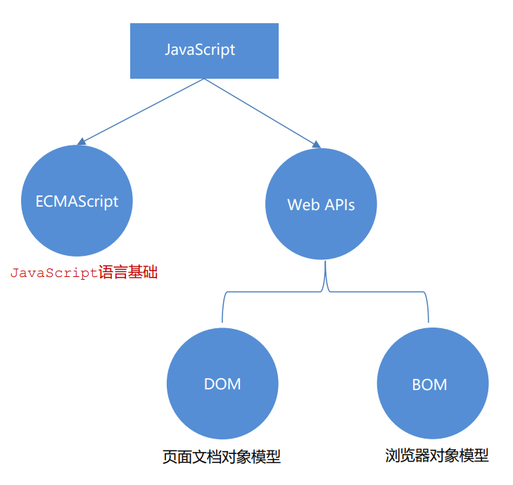

# JavaScript 初阶

## JavaScript 介绍

### JavaScript是什么

JavaScript是一种运行在客户端（浏览器）的编程语言，实现人机交互效果，我们之前学的html+css并不是编程语言，而是标记语言。

### JavaScript能做什么

网页特效 (监听用户的一些行为让网页作出对应的反馈)。表单验证 (针对表单数据的合法性进行判断)。数据交互 (获取后台的数据, 渲染到前端)。服务端编程 (node.js)。等等

### JavaScript组成

严格意义上讲，我们在 JavaScript 阶段学习的知识绝大部分属于 ECMAScript 的知识体系，ECMAScript 简称 ES 它提供了一套语言标准规范，如变量、数据类型、表达式、语句、函数等语法规则都是由 ECMAScript 规定的。浏览器将 ECMAScript 大部分的规范加以实现，并且在此基础上又扩展一些实用的功能，这些被扩展出来的内容我们称为 Web APIs。

ECMAScript 运行在浏览器中然后再结合 Web APIs 才是真正的 JavaScript，Web APIs 的核心是 DOM 和 BOM。

ECMAScript 规范在不断的更新中，存在多个不同的版本，早期的版本号采用数字顺序编号如 ECMAScript3、ECMAScript5，后来由于更新速度较快便采用年份做为版本号，如 ECMAScript2017、ECMAScript2018 这种格式，ECMAScript6 是 2015 年发布的，常叫做 EMCAScript2015。

整体说：javascript可以分为ECMAScript(javascript基础) + Web APIs(浏览器扩展)，Web APIs可以分为DOM(文档对象模型) + BOM(浏览器对象模型)。

- ECMAScript:
  - 规定了js基础语法核心知识。
  - 比如：变量、分支语句、循环语句、对象等等


- Web APIs :
  - DOM   文档对象模型， 定义了一套操作HTML文档的API
  - BOM   浏览器对象模型，定义了一套操作浏览器窗口的API



### 引入方式

JavaScript 程序不能独立运行，它需要被嵌入 HTML 中，然后浏览器才能执行 JavaScript 代码。通过 `script` 标签将 JavaScript 代码引入到 HTML 中，有两种方式：

#### 内部形式

通过 `script` 标签包裹 JavaScript 代码

```html
<!DOCTYPE html>
<html lang="en">
<head>
  <meta charset="UTF-8">
  <title>JavaScript 基础 - 引入方式</title>
</head>
<body>
  <!-- 内联形式：通过 script 标签包裹 JavaScript 代码 -->
  <script>
    alert('嗨，欢迎来传智播学习前端技术！')
  </script>
</body>
</html>
```

#### 外部形式

一般将 JavaScript 代码写在独立的以 .js 结尾的文件中，然后通过 `script` 标签的 `src` 属性引入

```javascript
// demo.js
document.write('嗨，欢迎来传智播学习前端技术！')
```

```html
<!DOCTYPE html>
<html lang="en">
<head>
  <meta charset="UTF-8">
  <title>JavaScript 基础 - 引入方式</title>
</head>
<body>
  <!-- 外部形式：通过 script 的 src 属性引入独立的 .js 文件 -->
  <script src="demo.js"></script>
</body>
</html>
```

#### 行内形式

```html
<!DOCTYPE html>
<html lang="en">
<head>
  <meta charset="UTF-8">
  <title>JavaScript 基础 - 引入方式</title>
</head>
<body>
   <!-- 行内js书写 -->
   <button onclick="alert('逗你玩')">点击我月薪过万</button>
</body>
</html>
```

###  注释

通过注释可以屏蔽代码被执行或者添加备注信息，JavaScript 支持两种形式注释语法：
||  单行注释  |  块注释  |
|  ----  | ----  | ----  |
|符号| //  | /**/ |
|作用| //右边这一行的代码会被忽略   | 在/* 和 */ 之间的所有内容都会被忽略 |
|快捷键| <kbd>ctrl</kbd> + <kbd>/</kbd> | <kbd>shift</kbd> + <kbd>alt</kbd> +  <kbd>A</kbd> |

### 结束符

在 JavaScript 中 `;` 代表一段代码的结束，多数情况下可以省略 `;` 。浏览器(JavaScript 引擎) 可以自动推断语句的结束位置

现状：在实际开发中，越来越多的人主张书写 JavaScript 代码时省略结束符。

约定：为了风格统一，结束符要么每句都写，要么每句都不写（按照团队要求）

### 输入和输出

输出和输入也可理解为人和计算机的交互，用户通过键盘、鼠标等向计算机输入信息，计算机处理后再展示结果给用户，这便是一次输入和输出的过程。

#### 输出

语法1：`document.write('要输出的内容')`。文档输出。作用：向body内输出内容。注意：如果输出的内容写的是标签，也会被解析成网页元素

语法2：`alert('要弹出的内容')`。注意。作用：页面弹出警告对话框。

语法3：`console.log('控制台打印')`。控制台日志。作用：控制台输出语法，程序员调试使用(在页面进行调试，打开控制台即可看到)

####  输入

输入语法：`prompt('请输入您的姓名')`。提示。作用：显示一个对话框，对话框中包含一条文字信息，用来提示用户输入文字

### 断点调试

**作用：**学习时可以帮助更好的理解代码运行，工作时可以更快找到bug

浏览器打开调试界面

1. 按F12打开开发者工具
2. 点到源代码一栏 （ sources ）
3. 选择代码文件

**断点：**在某句代码上加的标记就叫断点，当程序执行到这句有标记的代码时会暂停下来

## 变量

变量是计算机中用来存储数据的“容器”，就是一个装东西的盒子。它可以让计算机变得有记忆，通俗的理解变量就是使用【某个符号】来代表【某个具体的数值】（数据）

### 声明

要想使用变量，首先需要创建变量（也称为声明变量或者定义变量）

语法： `关键字 变量名`

声明变量由两部分构成：声明关键字、变量名（标识）。关键字是系统提供的专门用来声明（定义）变量的词语，是 JavaScript 中内置的一些英文词汇（单词或缩写），它们代表某些特定的含义。如 `let` 的含义是声明变量的，看到 `let`  后就可想到这行代码的意思是在声明变量，如 `let age` 。`let` 和 `var` 都是 JavaScript 中的声明变量的关键字，推荐使用 `let` 声明变量。

```javascript
//声明一个变量，叫age
let age
```

#### let与var的区别

在较旧的JavaScript，使用关键字 `var` 来声明变量 ，而不是 `let`。`var` 现在开发中一般不再使用它，只是我们可能再老版程序中看到它。`let` 为了解决 `var` 的一些问题。

`var` 声明的缺陷:

1. 可以先使用 在声明 (不合理)。
2. `var` 声明过的变量可以重复声明(不合理)。
3. 会有变量提升变成全局变量、没有块级作用域等等

大部分情况使用 `let` 和 `var` 区别不大，但是 `let` 相较 `var` 更严谨，因此推荐使用 `let`，以后声明变量我们统一使用 `let`。

### 赋值

声明（定义）变量相当于创造了一个空的“容器”，通过赋值向这个容器中添加数据。

```javascript
//变量声明
let age

// 赋值，将 18 这个数据存入了 age 这个“容器”中
age = 18

// 也可以声明和赋值同时进行，这种操作也称为变量初始化。
let str = 'hello world!'

//声明赋值多个变量：语法：多个变量中间用逗号隔开。 
let a = 5, b = 4
```

### 变量名命名

规则：必须遵守，不遵守报错。规范：建议，不遵守不会报错，但不符合业内通识。

#### 规则

1. JavaScript 内部已占用于单词（关键字或保留字[^关键字和保留字]）不允许使用(例如：`let`、`var`、`if`、`for`等)。
2. 只能用下划线、字母、数字、$组成，且数字不能开头。
3. 字母严格区分大小写，如 Age 和 age 是不同的变量

#### 规范

1. 尽量保证变量具有一定的语义，见字知义
2. 遵守小驼峰命名法(多个单词组成时，不用_隔开，除了第一个单词首字母小写，后面单词首字母都大写。例：userName)(如果是大驼峰是UserName)

## 常量

概念：使用 `const` 声明的变量称为“常量”。

使用场景：当某个变量永远不会改变的时候，就可以使用 `const` 来声明，而不是 `let`。

命名规范：和变量一致

~~~javascript
const PI = 3.14
~~~

>注意： 常量不允许重新赋值,声明的时候必须赋值（初始化）

### 关键字的区别

变量声明有三个 var let 和 const。var 是老派写法，问题很多，可以淘汰掉。
建议： const 优先，尽量使用const，原因是const语义化更好。
建议数组和对象使用 const 来声明(更加安全)
如果基本数据类型的值或者引用类型的地址发生变化的时候，需要用let。比如 一个变量进行加减运算，比如 for循环中的 i++
如果你还在纠结，那么我建议：有了变量先给const，如果发现它后面是要被修改的，再改为let 

#### const与let用法

可以用const的情况，他们的值没有变。
```javascript
const num1 = +prompt('第一个数')
const num2 = +prompt('第二个数')
alert(`两者相加的结果是：${num1 + num2}`)
```

不可以用const，因为变量重新赋值。

```javascript
let num = 1
num = num + 1
console.log(num);//2
```

### const声明引用数据类型

对于引用数据类型，const声明的变量，里面存的不是值，不是值，不是值，是引用数据类型的地址。


```javascript
//这里的arr变量存的其实是地址，因为引用数据类型的数据是存放在堆上的，arr是存放在栈上的地址，因此对数组进行增删改查，都不会报错，因为const修饰的是地址，只要地址不变就不会报错
const arr = [1, 2, 3]
arr.push(4)
console.log(arr);

//而这样写会产生报错，原因是[1,2,4]是不同的引用数据类型，相当于arr的值被改为[1,2,4]的地址，这对于const是不允许的
arr = [1, 2, 4]

//可以这样理解：只要栈中的值发生了改变，就不能所以const声明
```

#### 修改const声明的引用数据类型

```javascript
//const声明数组
const names = []

//错误的修改方法，改变了变量名地址
// names = [1,2,3] 

//正确的方法，通过地址改变数组值
names[0] = 1
names[0] = 2
names[0] = 3
```

```javascript
//const声明对象
const obj = {}

//错误的修改方式，改变了变量名地址
// obj = {
//     uname:'pink老师'
// }

//正确的方法，通过地址改变对象的属性
obj.uname = 'pink老师'
```

## 数据类型

计算机世界中的万事万物都是数据。计算机程序可以处理大量的数据，因此需要给数据分类。

JS 数据类型整体分为两大类:

1. 基本数据类型

   - 数字类型

    - 字符串类型
    - 布尔型
    - undifined
    - null

2. 引用数据类型

   - 数组
   - 对象

基本数据类型又叫做简单类型或者值类型，引用类型又叫做复杂类型。

> 注意：JS是弱数据类型语言(c语言属于强数据类型)，变量到底属于哪种类型，只有赋值之后，我们才能确认(也就是看=右边才知道它属于什么数据类型)

### 数字类型

即我们数学中学习到的数字，可以是整数、小数、正数、负数，以及一个特殊的数字类型：NaN

```javascript
let num = 18//数字类型

//NaN(not a number) 代表一个计算错误。它是一个不正确的或者一个未定义的数学操作所得到的结果。NaN 是粘性的，任何对 NaN 的操作都会返回 NaN
//NaN也是数字类型
console.log('老师' - 2)//NaN
console.log(NaN + 2)//NaN
```

### 字符串类型

通过单引号（`''`） 、双引号（`""`）或反引号包裹的数据都叫字符串，单引号和双引号没有本质上的区别，推荐使用单引号（因为html标签属性，css属性给值都可能会用到双引号，因此js用单引号便于区分）

```javascript
let str = 'pink'
let str1 = "pink"
let str2 = `pink`//反引号是键盘1旁边的位置
let tel = '12345678910'//内容是数字的字符串类型
let str3 = ''//空字符串

console.log(11)//打印数字类型11
console.log('11')//打印字符串类型11
console.log(str)//打印变量里的内容，内容是字符串类型pink
console.log('str')//打印字符串类型str
```

> 注意事项：
> 1. 无论单引号或是双引号必须成对使用
> 2. 单引号/双引号可以互相嵌套，但是不以自已嵌套自已
> 3. 必要时可以使用转义符 `\`，输出单引号或双引号
> 	```javascript
> 	console.log('pink老师讲课非常有"激情"');
> 	console.log("pink老师讲课非常有'激情'");
> 	console.log('pink老师讲课非常有\'激情\'');
> 	```

#### 字符串拼接

使用 `+` 运算符，可以实现字符串的拼接。
口诀：数字相加，字符相连。

```javascript
console.log(1 + 1);//2
console.log('pink' + '老师');//pink老师
let uname = '刘德华'
let song = '忘情水'
document.write(uname + song)//刘德华忘情水

//在+表达式中，只要其中有一个加数是字符串类型，那加号作用就是拼接
let age = 19
document.write('我今年' + 19)//我今年19
document.write('我今年' + age)//我今年19
document.write('我今年' + age + '岁了')
```

#### 模板字符串

在没有它之前，要拼接变量比较麻烦。使用模板字符串拼接字符串会更简单。

使用场景：拼接字符串和变量。

语法:

1. 内容用``` `(反引号)括起来。

2. 内容拼接变量时，用 `${ }` 包住变量

```javascript
let age = 18
document.write(`俺今年${age}岁了`)
```

### 布尔类型

表示肯定或否定时在计算机中对应的是布尔类型数据，它有两个固定的值 `true` 和 `false`，表示肯定的数据用 `true`，表示否定的数据用 `false`。

```javascript
let isCool = true//true和false是布尔型字面量
console.log(isCool);//true
console.log(3 > 4);//false
```

### undefined

未定义是比较特殊的类型，只有一个值 `undefined`，只声明变量，不赋值的情况下，变量的默认值为 `undefined`，一般很少为某个变量赋值为 `undefined`。

> 这是弱数据类型的特点，声明无法确定类型，只有赋值可以。

```javascript
let num
console.log(num);//undefined
```

**注：JavaScript 中变量的值决定了变量的数据类型。**

### null

JavaScript 中的 `null` 仅仅是一个代表“无”、“空”或“值未知”的特殊值.

`null` 开发中的使用场景：官方解释：把 `null` 作为尚未创建的对象。即以后有个变量里面确定要存放的是一个对象，但是对象还没创建好，可以先给个`null`

```javascript
let odj = null
console.log(obj)//null

//null 和 undefined 区别：undefined 表示没有赋值，null 表示赋值了，但是内容为空
console.log(undefined + 1)//NaN 
console.log(null + 1);//1
```

> 扩展：null属于基本数据类型，可为什么控制台检测null类型，返回的是object呢？
> ```javascript
> console.log(typeof null);//object
> ```
> 这是一个历史遗留问题。在 JavaScript 最初的实现中，JavaScript 值由类型标记和值表示。对象的类型标记为 0。`null` 被表示为 NULL 指针（在大多数平台上为 0x00）。所以`null` 的类型标记为 0，因此 `typeof` 返回值为 `object` 。
>
> 这通常被认为是一个错误，但我们不得不接受它。

### 检测数据类型

#### 控制台输出语句检测

控制台语句经常用于测试结果来使用：可以看出数字型和布尔型颜色为紫色，字符串为白色，`null` 和 `undefined`为灰色（不同浏览器颜色可能会不同）。

```javascript
let age = 18
let uname = '刘德华'
let flag = false
let buy
let dog = null
console.log(age);//紫色
console.log(uname);//白色
console.log(flag);//紫色
console.log(buy);//灰色
console.log(dog);//灰色
```

#### typeof关键字检测

语法形式:

1. 作为运算符(常用写法)：`typeof x` 
2. 函数形式：`typeof(x)`

```javascript
let age = 18
let uname = '刘德华'
let flag = false
let buy
let dog = null
console.log(typeof age);//number
console.log(typeof uname);//string
console.log(typeof flag);//boolean
console.log(typeof buy);//undefined
console.log(typeof dog);//object
```

### 类型转换

JavaScript是弱数据类型，JavaScript也不知道变量到底属于哪种数据类型，只有赋值了才清楚。而使用表单、`prompt` 等获取过来的数据默认都是字符串类型的，如果你是想实现数字相加，此时就不能直接进行加法运算。

此时就需要转换变量的数据类型。通俗来说，就是把一种数据类型的变量转换成我们需要的数据类型。

#### 隐式转换

某些运算符被执行时，系统内部自动将数据类型进行转换，这种转换称为隐式转换。

规则:
1. +号两边只要有一个是字符串，都会把另外一个类型转成字符串(包括`undefined`)。

2. 除了+以外的算术运算符，比如 - * / 等都会把数据转成数字类型(包括`null`和`undefined`)

3. `null` 经过数字转换之后会变为 0

  ```javascript
  console.log(null + 3);//3
  ```

4. `undefined` 经过数字转换之后会变为 NaN

  ```javascript
  console.log(undefined - 2);//NaN
  ```

缺点：转换类型不明确，靠经验才能总结。

> 小技巧:
> 1. +号作为正号在其他类型前，解析时可转换成数字型。
> 2. 任何数据和字符串相加结果都是字符串
> ```javascript
console.log(1 + 1);
console.log('1' + 1);//字符11，隐式转换1，字符 + 数字 -> 字符
console.log('1' - 1);//数字0，隐式转换2，字符 - 数字 -> 数字
console.log(+'123');//数字123，小技巧1，字符 -> 数字
let a = +'123'//数字123，小技巧1，字符 -> 数字
let num2 = +prompt('输入年薪')//数字输入值，小技巧1，字符 -> 数字
> ```

#### 显式转换

编写程序时过度依靠系统内部的隐式转换是不严禁的，因为隐式转换规律并不清晰，大多是靠经验总结的规律。为了避免因隐式转换带来的问题，通常根逻辑需要对数据进行显示转换。

##### 数字类型转换

数字类型的显式转换有下列三种。

###### Number()

语法：`Number(数据)`

通过 `Number` 显示转换成数值类型，如果字符串内容里有非数字，转换失败时结果为 `NaN`（Not a Number）即不是一个数字。`NaN` 也是number类型的数据，代表非数字。

```javascript
let str = '123'
console.log(Number(str));//数字123，字符 -> 数字
console.log(Number('pink'));//NaN
let num1 = prompt('输入年薪')
console.log(Number(num1));//数字num1的值，字符 -> 数字
```

###### parseInt()

语法：`parseInt(数据)`

提取在一串数据开头的整数部分，并且转换为数字类型。`parseInt` 和 `parseFloat` 的应用场景多为操作css属性值时使用

```javascript
console.log(parseInt('12px'));//数字12，字符 -> 数字
console.log(parseInt('12.94px'));//数字12，字符 -> 数字，parseInt只保留整数部分，并不四舍五入，相当于截断
console.log(parseInt('abc12.94px'));//NaN，parseInt无法提取数据中间的数字，只能提取处于开头的数字
```

###### parseFloat()

语法：`parseFloat(数据)`

功能和 `parseInt` 相似，不同的是它可以保留小数

```javascript
console.log(parseFloat('12px'));//数字12，字符 -> 数字
console.log(parseFloat('12.94px'));//12.94，字符 -> 数字，parseFloat可以保留小数部分
console.log(parseFloat('abc12.94px'));//NaN
```

##### Boolean类型转换

''、0、undefined、null、false、NaN 转换为布尔值后都是false, 其余则为 true

```javascript
console.log(Boolean(''));//false
console.log(Boolean(undefined));//false
console.log(Boolean(null));//false
console.log(Boolean(false));//false
console.log(Boolean(NaN));//false
console.log(null == undefined);//true，因为他们两个的值一样(都是0)。但null === undefined是false，因为二者类型不等
if (null) {
    console.log(11);//不输出，因为null转换为布尔型是false
}
```

### 堆栈空间分配区别


栈（操作系统）：由操作系统自动分配和释放。用于存放函数的参数值、局部变量的值等。其操作方式类似于数据结构中的栈。简单数据类型存放到栈里面。


堆（操作系统）：存储复杂类型(对象)，一般由程序员分配释放，若程序员不释放，由垃圾回收机制回收。引用数据类型存放到堆里面


> 这段描述和c的堆和栈基本不错。只不过JS类型分配堆栈时是自动分配的，而c则是不分配默认都在栈区存放数据 

```javascript
let num = 10
let num2 = num
num = 20
console.log(num2);//10，因为num2里赋值后，未再次赋新修改过的值

let obj1 = {
    age: 18
}
let obj2 = obj1
obj1.age = 20
console.log(obj2);//20，因为obj类型会在栈中存放指向自己数据的地址，而obj的对象名就是地址，obj2 = obj1相当于赋予了obj1地址，因此obj1里数据一改动，obj2的数据就会被改动
```

## 运算符

### 算术运算符

数字是用来计算的，比如：乘法 * 、除法 / 、加法 + 、减法 - 等等，所以经常和算术运算符一起。

算术运算符：也叫数学运算符，主要包括加、减、乘、除、取余（求模）等

| 运算符 | 作用                                                 |
| ------ | ---------------------------------------------------- |
| +      | 求和                                                 |
| -      | 求差                                                 |
| *      | 求积                                                 |
| /      | 求商                                                 |
| **%**  | 取模（取余数），开发中经常用于作为某个数字是否被整除 |

> 注意：在计算失败时，显示的结果是 NaN （not a number）

```javascript
// 算术运算符
console.log(1 + 2 * 3 / 2) //  4 
let num = 10
console.log(num + 10)  // 20
console.log(num + num)  // 20

// 取模(取余数)  使用场景：  用来判断某个数是否能够被整除
console.log(4 % 2) //  0  
console.log(6 % 3) //  0
console.log(5 % 3) //  2
console.log(3 % 5) //  3

// 注意事项 : 如果我们计算失败，则返回的结果是 NaN (not a number)
console.log('pink老师' - 2)
console.log('pink老师' * 2)
console.log('pink老师' + 2)   // pink老师2
```

### 赋值运算符

对变量进行赋值的运算符

| 运算符 | 作用                                                   |
| ------ | ------------------------------------------------------ |
| =      | 赋值，将等号右边的值赋予给左边, 要求左边必须是一个容器 |
| +=     | 加法赋值                                               |
| -+     | 减法赋值                                               |
| *=     | 乘法赋值                                               |
| /=     | 除法赋值                                               |
| %=     | 取余赋值                                               |

```javascript
let num = 1
num = num + 1

//上述代码简化后
num += 1//此效果等同于上方效果，其他赋值运算符也一样
```

### 一元运算符

众多的 JavaScript 的运算符可以根据所需表达式的个数，分为一元运算符、二元运算符、三元运算符。一元运算符即操作一个操作数，二元运算符操作两个操作数，以此类推。

```javascript
let num = -1//这里的 - 就是一元运算符
```

#### 自增/自减运算符

| 符号 | 作用 | 说明                                                         |
| ---- | ---- | ------------------------------------------------------------ |
| ++   | 自增 | 让变量的值 +1。前置自增：++i，先++后使用。后置自增：i++，先使用后++ |
| --   | 自减 | 让变量的值 -1。前置自减：--i，先--后使用。后置自减：i--，先使用后-- |

1. ++在前和++在后在单独使用时二者并没有差别，而且一般开发中我们都是独立使用
2. ++在后（后缀式）我们会使用更多

> 注意：只有变量能够使用自增和自减运算符

使用场景：经常用于计数器。 比如进行10次操作，用它来计算进行了多少次了。自增和自减运算符都是一元运算符


```javascript
let i = 1
console.log(++i + 1);//3，流程：前置++先对i++后i=2，然后进行运算答案为3
console.log(i++ + 1);//2，流程：后置++先进行运算答案是2，然后i++后i=2
console.log(i++ + ++i + i);//7，流程：从左到右计算，i后置++因此第一个i为1，然后i++后i=2，之后的前置++ i=3，最后再加3，因此是1+3+3=7
```

### 比较运算符

使用场景：比较两个数据大小、是否相等，根据比较结果返回一个布尔值（true / false）

| 运算符 | 作用                                   |
| ------ | -------------------------------------- |
| >      | 左边是否大于右边                       |
| <      | 左边是否小于右边                       |
| >=     | 左边是否大于或等于右边                 |
| <=     | 左边是否小于或等于右边                 |
| ===    | 左右两边是否`类型`和`值`都相等（重点） |
| ==     | 左右两边`值`是否相等                   |
| !=     | 左右值不相等                           |
| !==    | 左右两边是否不全等                     |

比较结果为boolean类型，即只会得到 true 或 false

等号对比：`=` 是赋值，`==` 是判断，`===` 是全等。开发中判断是否相等，强烈推荐使用 `===`。

```javascript
console.log(3 > 5);//false
console.log(3 >= 3);//true
console.log(2 == 2);//true
console.log(2 == '2');//true，比较运算符有隐式转换，他会把其他类型转换为数字类型后进行比较
console.log(2 === '2');//false，=== 在 == 的基础上还会比较类型是否相等，即双=判断值，而三=还会判断类型，他不会进行隐式转换
console.log(undefined == null);//true，但如果===就会false
console.log(2 !== '2');//false，!==判断的是数据类型级别的，这里可以类比c，==和!=是一对，那么===和!==就是一对

//NaN不等于任何值，包括它本身，涉及到"NaN“ 都是false
console.log(NaN === NaN);//false，NaN不等于任何类型，包括自己

//字符串比较，是比较的字符对应的ASCII码
//规则：从左往右依次比较，如果第一位一样再比较第二位，以此类推
console.log('a' < 'b');//true，a的ASCII是97，b是98，97<98，因此true
console.log('aa' < 'ab');//true，字符串是依次从左到右进行字符的逐个比较的，类似c里的strcmp函数
console.log('aa' < 'aac');//true
```

> 注意：
> 尽量不要比较小数，因为小数有精度问题
> 不同类型之间比较会发生隐式转换，最终会把数据隐式转换转成number类型再比较
> 在开发中，如果进行准确的比较我们更喜欢 === 或者 !==

### 逻辑运算符

使用场景：可以把多个布尔值放到一起运算，最终返回一个布尔值

| 符号 | 名称   | 日常读法 | 特点                       | 口诀           |
| ---- | ------ | -------- | -------------------------- | -------------- |
| &&   | 逻辑与 | 并且     | 符号两边有一个假的结果为假 | 一假则假       |
| \|\| | 逻辑或 | 或者     | 符号两边有一个真的结果为真 | 一真则真       |
| !    | 逻辑非 | 取反     | true变false  false变true   | 真变假，假变真 |

| A     | B     | A && B | A \|\| B | !A    |
| ----- | ----- | ------ | -------- | ----- |
| false | false | false  | false    | true  |
| false | true  | false  | true     | true  |
| true  | false | false  | true     | false |
| true  | true  | true   | true     | false |

```javascript
//逻辑与 - 一假则假，二元操作符
console.log(true && true);//true
console.log(true && false);//false
console.log(3 < 5 && 3 > 2);//true
console.log(3 < 5 && 3 < 2);//false

//逻辑或 - 一真则真，二元操作符
console.log(true || true);//true
console.log(true || false);//true
console.log(false || false);//false

//逻辑非，一元操作符
console.log(!true);//false
console.log(!false);//true
```

#### 逻辑中断

短路：只存在于 && 和 || 中，当满足一定条件会让右边代码不执行

| 符号     | 短路条件  |
| ----- | ----- |
| && | 左边为false就短路 |
| \|\| | 左边为true就短路 |

产生原因：通过左边能得到整个式子的结果，因此没必要再判断右边

```javascript
function fn(x, y/*不写x=0,y=0。而是写下面的式子*/) {
    x = x || 0//不赋值或为0时，x = 0
    y = y || 0//不赋值或为0时，y = 0
    console.log(x + y);
}
fn(1, 2)//3
fn()//0

let age = 18
console.log(false && age++);//false，age++不执行
console.log(true || age++);//true，age++不执行
console.log(age);//18
```

##### 运算结果

无论 && 还是 || ，运算结果都是最后被执行的表达式值，一般用在变量赋值

```javascript
console.log(11 && 22);//22，逻辑与两边都为真时，返回最右边的值
console.log(undefined || 0);//0，逻辑或两边都为假时，返回最右边的值
console.log(undefined && 0);//undefined，逻辑与两边都为假时，返回最左边的值(逻辑中断)
console.log(11 || 22);//11，逻辑或两边都为真时，返回最左边的值(逻辑中断)
```

### 运算符优先级

同时使用多个运算符编写程序时，会按着某种顺序先后执行，我们称为优先级。

JavaScript中优先级越高越先被执行，优先级相同时以书从左向右执行。

| 优先级 | 运算符     | 符号(若有顺序则会说明) |
| ------ | ---------- | ------------- |
| 1      | 小括号     | ()            |
| 2      | 一元运算符 | ++ -- !       |
| 3      | 算数运算符 | 先* / % 后+ - |
| 4      | 关系运算符 | \> >= < <=    |
| 5      | 相等运算符 | == != === !== |
| 6      | 逻辑运算符 | 先\! 然后&& 最后\|\|  |
| 7      | 赋值运算符 | = |
| 8      | 逗号运算符 | , |

## 语句

### 表达式和语句

#### 表达式

表达式是可以被求值的代码，JavaScript 引擎会将其计算出一个结果

```javascript
x = 7; 3 + 4; num++//这些都是表达式
```

#### 语句

语句是一段可以执行的代码，比如：`prompt()`可以弹出一个输入框，还有if语句，for循环语句等等

```javascript
alert(); //一段语句
```

二者区别:

- 表达式：因为表达式可被求值，所以它可以写在赋值语句的右侧。
- 语句：语句不一定有值，比如alert()，for和break等语句就不能被用于赋值，他只是进行某些操作

某些情况，也可以把表达式理解为表达式语句，因为它是在计算结果，但不是必须的成分(例如continue语句，他可能不计算结果)

> 程序三大流程控制语句：
>
> - 以前我们写的代码，写几句就从上往下执行几句，这种叫顺序结构。
> - 有的时候要根据条件选择执行代码，这种就叫分支结构。
> - 当某段代码被重复执行，就叫循环结构。
>
> 

### 分支语句

分支语句可以根据条件判定真假，来选择性的执行想要的代码

分支语句包含：

1. if分支语句（重点）
2. 三元运算符
3. switch语句

#### if 语句

if语句有三种使用：单分支、双分支、多分支

##### if 单分支语句

语法：

~~~javascript
if(条件表达式) {
  // 满足条件要执行的语句
}
~~~

注意：

- 小括号内的条件结果是布尔值，为 true 时，进入大括号里执行代码；为false，则不执行大括号里面代码
- 小括号内的结果若不是布尔类型时，会发生类型转换为布尔值，类似Boolean()
- 如果大括号只有一个语句，大括号可以省略，但不提倡这么做

~~~javascript
if (2) {//非0，布尔类型true，执行
    console.log('执行语句');
}

if (3 > 5) {//3>5，转化为布尔型false，不执行语句
    console.log('执行语句');
}

if ('') {//对于字符串来说，只有空字符串为假，其他都为真，因此这里不执行语句
    console.log('执行语句');
}

if ('') console.log('执行语句');//只有一个语句的话，if还可以这样写，但并不提倡
~~~

##### if 双分支语句

如果有两个条件的时候，可以使用 if else 双分支语句

语法：

~~~javascript
if (条件) {
    满足条件的代码
}
else {
    不满足条件的代码
}
~~~

##### if 多分支语句

使用场景： 适合于有多个条件的时候

~~~javascript
if (条件1) {
    代码1
}
else if (条件2) {
    代码2
}
else if (条件3) {
    代码3
}
else {
    代码n
}
//先判断条件1，若满足条件1就执行代码1，其他不执行。若不满足则向下判断条件2，满足条件2执行代码2，其他不执行，依次类推。若以上条件都不满足，执行else里的代码n
~~~

#### 三元运算符（三元表达式）

使用场景： 需要双分支if判断并且要执行的操作语句较为简单，可以使用三元表达式(即三元运算符一般用于做表达式来取值)

语法：

~~~javascript
条件 ? 满足条件执行的代码 : 不满足条件执行的代码
~~~

例如：

~~~javascript
console.log(3 > 5 ? 3 : 5);//判断3>5，真为3，假为5
3 < 5 ? alert("真的") : alert("假的")//判断3<5，真弹出真的，假弹出假的
let sum = 3 < 5 ? 3 : 5//判断3<5，真sum赋值3，假sum赋值5
~~~

#### switch语句（了解）

使用场景： 适合于有多个条件的时候，也属于分支语句，大部分情况下和 if多分支语句 功能相同

释义：找到跟小括号里数据全等的case值，并执行里面对应的代码，若数据和值没有全等(===)的则执行default里的代码。

注意：

1. switch case语句一般用于等值判断, if适合于区间判断
2. switch case一般需要配合break关键字使用 没有break会造成case穿透
3. if 多分支语句开发要比switch更重要，使用也更多

语法：

```javascript
switch (表达式) {
  case 值1:
    代码1
    break
  case 值2:
    代码2
    break
  ...
  default:
    代码n
    break
}
```

例如：

~~~javascript
switch (1) {
    case 1:
        console.log('你选择的是1');
        break
    case 2:
        console.log('你选择的是2');
        break
    default:
        console.log('你选择的是其他');
        break//最后一个break可加可不加
}
~~~

> **if 多分支语句和 switch的区别：**
>
> - switch…case语句通常处理case为比较**确定值**的情况，而if…else…语句更加灵活，通常用于**范围判断**(大于，等于某个范围)。
> - switch 语句进行判断后直接执行到程序的语句，效率更高，而if…else语句有几种判断条件，就得判断多少次
> - switch 一定要注意 必须是 ===  全等，一定注意 数据类型，同时注意break否则会有穿透效果
> - 结论：
>   - 当分支比较少时，if…else语句执行效率高。
>   - 当分支比较多时，switch语句执行效率高，而且结构更清晰。
>

### 循环语句

#### while循环

循环：重复执行一些操作，while 在…. 期间，所以while循环就是在满足条件期间，重复执行某些代码

语法：

~~~javascript
while (循环条件){
    要重复执行的代码//循环体
}
~~~

while大括号里代码执行完毕后不会跳出，而是继续回到小括号里判断条件是否满足，若满足则再次执行大括号里的代码，然后再回到小括号判断条件，直到括号内条件不满足后跳出循环。

循环三要素：

1.初始值 （经常用变量）

2.终止条件（没有终止条件，循环会一直执行，造成死循环）

3.变量的变化量（用自增或者自减）

循环的本质就是以某个变量为起始值，然后不断产生变化量，慢慢靠近终止条件的过程。while循环需要具备三要素

例如：

~~~javascript
 let i = 1//变量起始值
 while (i <= 3/*终止条件*/) {
     document.write('我会循环三次<br>')
     i++//变量变化量
 }
~~~

#### for 循环

for 循环好处：把声明起始值、循环条件、变化值写到一起，让人一目了然，它是最常使用的循环形式

语法：

```javascript
for(变量起始值;终止条件;变量变化量){
    //循环体
}
```

例子：

```javascript
for (let i = 1; i <= 3; i++) {
    document.write('月薪过万')
}
```

##### for 循环嵌套

一个循环里再套一个循环，一般用在for循环里。

记住，外层循环循环一次，里层循环循环全部

```javascript
for (外部声明记录循环次数的变量; 循环条件; 变化值) {
    for (内部声明记录循环次数的变量; 循环条件; 变化值) {
        //循环体
    }
}
```

###### 倒三角

~~~javascript
// 外层打印几行
for (let i = 1; i <= 5; i++) {
    // 里层打印几个星星
    for (let j = 1; j <= i; j++) {
        document.write('★')
    }
    document.write('<br>')
}
~~~

###### 九九乘法表

样式css

~~~css
span {
    display: inline-block;
    width: 100px;
    padding: 5px 10px;
    border: 1px solid pink;
    margin: 2px;
    border-radius: 5px;
    box-shadow: 2px 2px 2px rgba(255, 192, 203, .4);
    background-color: rgba(255, 192, 203, .1);
    text-align: center;
    color: hotpink;
}
~~~

javascript 

~~~javascript
 // 外层打印几行
for (let i = 1; i <= 9; i++) {
    // 里层打印几个星星
    for (let j = 1; j <= i; j++) {
        // 只需要吧 ★ 换成  1 x 1 = 1   
        document.write(`
		<div> ${j} x ${i} = ${j * i} </div>
     `)
    }
    document.write('<br>')
}
~~~

#### 中止循环

`break`   中止整个循环，一般用于结果已经得到, 后续的循环不需要的时候可以使用（提高效率）  

`continue`  中止本次循环，一般用于排除或者跳过某一个选项的时候

~~~javascript
//break使用
let a = 1
while (a <= 5) {
    if (i === 3) {
        break   //直接退出循环
    }
    console.log(`我要吃${a}个包子`);
    i++
}

//continue使用
while (a <= 5) {
    i++
    if (i === 3) {
        continue  //结束本次循环(即下面语句不再执行)，从头开始新的循环
    }
    console.log(`我要吃${a}个包子`);
}
~~~

#### 无限循环

1.while(true) 来构造“无限”循环，需要使用break退出循环。（常用）

2.for(;;) 也可以来构造“无限”循环，同样需要使用break退出循环。

## 数组

### 基本使用

**数组：**(Array)是一种可以按顺序保存数据的数据类型

**使用场景：**如果有多个数据可以用数组保存起来，然后放到一个变量中，管理非常方便

**语法**:

- `let 数组名 = [数据1,数据2,数据3,...,数据n]`
- `let arr = new Array(数据1,数据2,...,数据n)`

> 第二种语法是使用new Array构造函数声明，属于JS高阶的知识，了解即可，不推荐使用

数组是按顺序保存，所以每个数据都有自己的编号，计算机中的编号从0开始，所以小明的编号为0，小刚编号为1，以此类推
在数组中，数据的编号也叫索引或下标。数组可以存储任意类型的数。[]是数组的字面量。

**取值语法**：`数组名[下标]`

```javascript
 names[0]//小明
```

通过下标取数据，取出来是什么类型的，就根据这种类型特点来访问。

**一些术语**:

- 元素：数组中保存的每个数据都叫数组元素
- 下标：数组中数据的编号
- 长度：数组中数据的个数，通过数组的length属性获得

#### for循环遍历数组

用循环把数组中每个元素都访问到,一般会用for循环遍历

```javascript
for (let i = 0; i < names.length; i++) {
    names[i]
}
```

### 操作数组

#### 增 - 数组添加新的数据

##### arr.push() (重点)

arr.push()用于将一个或多个元素添加到数组的末尾。参数为要增加的元素，返回值是该数组的新长度，(push - 推，即推元素进去)

语法：`arr.push(元素1,...,元素n)`

例子：

```javascript
let arr1 = ['pink', 'hotpink']
let a = arr1.push('deeppink', 'lightpink')//新增元素'deeppink'和'lightpink'，下标为2和3
console.log(arr1);//['pink', 'hotpink', 'deeppink', 'lightpink']
console.log(a);//返回值为元素个数(数组长度，在js中数组长度和元素个数等价)，4
```

##### arr.unshift()

arr.unshift()用于将一个或多个元素添加到数组的开头。参数是要增加的元素，返回值是该数组的新长度。

语法：`arr.unshift(元素1,...,元素n)`

例子：

```javascript
let arr2 = ['pink', 'hotpink']
let b = arr2.unshift('deeppink', 'lightpink')//新增元素'deeppink'和'lightpink'，下标为0和1
console.log(arr2);//['deeppink', 'lightpink', 'pink', 'hotpink']
console.log(a);//4
```

#### 删 - 删除数组中数据

##### arr.pop()

arr.pop()用于从数组中删除最后一个元素。无参数，返回值是该元素的值

例子：

```javascript
let arr3 = ['red', 'green']
arr3.pop()
console.log(arr3);//['red']
```

##### arr.shift()

arr.shift()用于从数组中删除第一个元素。无参数，返回值是该元素的值

例子：

```javascript
let arr4 = ['red', 'green']
arr4.shift()
console.log(arr4);//['green']
```

##### arr.splice()

arr.splice()用于删除指定元素。两个参数，第一个是起始位置(即要修改的元素下标)，第二个是要删除元素个数，如果不写此参数则默认从指定的起始位置删除到最后。

语法：`arr5.splice(start, deleteCount)`

例子：

```javascript
let arr5 = ['red', 'blue', 'green']
arr5.splice(1, 1)//从下标为一的元素开始删除，删除一个
console.log(arr5);//['red', 'green']
```

#### 改 - 元素重新赋值

语法：`arr[i] = 值`

例子：

```javascript
let arr6 = []
arr6[0] = 1
arr6[1] = 5
console.log(arr6);//[1,5]，不再是undifine

//改还可以在原来的数据上进行追加数据
let arr7 = ['pink', 'red', 'green']
for (let i = 0; i < arr7.length; i++) {
    arr7[i] += '老师'
}
console.log(arr7);//['pink老师', 'red老师', 'green老师']
```

#### 查 - 访问数组数据

语法：`arr[i]`

例子：

```javascript
let arr7 = ['pink', 'red', 'green']
console.log(arr7[2]);

//如果要访问整个数组的数据，直接用数组名就行了
console.log(arr7);
```

### 数据单元值类型

数组做为数据的集合，它的单元值可以是任意数据类型

```javascript
  // a) 数组单元值的类型为字符类型
  let list = ['HTML', 'CSS', 'JavaScript']
  // b) 数组单元值的类型为数值类型
  let scores = [78, 84, 70, 62, 75]
  // c) 混合多种类型
  let mixin = [true, 1, false, 'hello']
```

### arr.length - 数组长度属性

重申一次，数组在 JavaScript 中并不是新的数据类型，它属于对象类型。(详细见js高阶构造函数)

```javascript
  // 定义一个数组
  let arr = ['html', 'css', 'javascript']
  // 数组对应着一个 length 属性，它的含义是获取数组的长度
  console.log(arr.length) // 3
```

### arr.sort() - 冒泡排序

冒泡排序是一种简单的排序算法。它重复地走访过要排序的数列，一次比较两个元素，如果他们的顺序错误就把他们交换过来。走访数列的工作是重复地进行直到没有再需要交换，也就是说该数列已经排序完成。这个算法的名字由来是因为越小的元素会经由交换慢慢“浮”到数列的顶端。

比如数组 [2,3,1,4,5] 经过排序成为了 [1,2,3,4,5] 或者 [5,4,3,2,1]

```javascript
//arr.sort()方法可以排序，无参数
let arr = [4, 2, 3, 5, 1]

//升序写法
arr.sort()
console.log(arr);
//或者
let arr1 = [4, 2, 3, 5, 1]
arr1.sort(function (a, b) {
    return a - b
})
console.log(arr1);

//降序写法
arr1.sort(function (a, b) {
    return b - a
})
console.log(arr1);
```

## 函数

函数，function，是被设计为执行特定任务的代码块。函数可以把具有相同或相似逻辑的代码“包裹”起来，通过函数调用执行这些被“包裹”的代码逻辑，这么做的优势是有利于精简代码方便复用。

比如我们前面使用的 alert() 、 prompt() 和 console.log() 都是一些 js 函数，只不过已经封装好了，我们可以直接使用。

### 函数使用

#### 函数的声明（定义）

函数的声明语法:

```javascript
function 函数名() {
    函数体
}
```

例子：

```javascript
function sayHi() {
    document.write('hai')
}
```

> 函数名命名规范：和变量命名基本一致。尽量小驼峰式命名法。前缀应该为动词命名。常用动词约定

#### 函数的调用

声明（定义）的函数必须调用才会真正被执行，使用 `()` 调用函数。

函数的调用语法：`函数名()`

```javascript
sayHi()//调用sayHi函数
```

> 我们曾经使用的 alert() , parseInt() 这种名字后面跟小括号的本质都是函数的调用

#### 函数体

函数体是函数的构成部分，它负责将相同或相似代码“包裹”起来，直到函数调用时函数体内的代码才会被执行。函数的功能代码都要写在函数体当中。

#### 函数调试

在函数调用处设置断点，然后按F11可进入被调用的函数进行调试，F10是不进入函数的调试

#### 函数细节补充

- 两个相同的函数定义，后面的函数会覆盖前面的函数
- 在Javascript中，实参的个数和形参的个数可以不一致(尽量不要这样)
- 如果形参多与实参，那么多余的形参(后部分，且没有对形参进行默认赋值)会自动赋值undefined(了解即可)
- 如果实参多于形参，那么多余的实参(后部分)会被忽略(函数内部有一个arguments, 里面装着所有的实参)

###  参数

#### 函数传参

通过向函数传递参数，可以让函数更加灵活多变，参数可以理解成是一个变量。

有参函数：

```javascript
function 函数名(参数列表) {
    函数体
}
```

参数列表：传入数据列表。声明这个函数需要传入几个数据。多个数据用逗号隔开

```javascript
function getSquare(num1/*单个参数*/) {
    document.write(num1 * num1)
}

function getSum(num1, num2/*多个参数*/) {
    document.write(num1 + num2)
}
```

调用语法：`函数名(传递的参数列表)`

调用函数时，需要传入几个数据就写几个，用逗号隔开

#### 形参和实参

形参：声明函数时写在函数名右边小括号里的叫形参（形式上的参数）

实参：调用函数时写在函数名右边小括号里的叫实参（实际上的参数）

形参可以理解为是在这个函数内声明的变量(比如 num1 = 10)，并且只在函数内有效(局部变量生命周期)。实参可以理解为是给这个在函数里声明的变量赋值。开发中尽量保持形参和实参个数一致

>  我们曾经使用过的 alert('打印'), parseInt('11'), Number('11') 本质上都是函数调用的传参

##### 参数默认值

形参可以看做变量，但是如果一个变量不给值，默认是undefined，因此如果有参数函数不给参数，那么此函数的结果就是错误的

因此我们可以改进下，当用户不输入实参，可以给形参默认值，如默认为0, 这样程序更严谨，可以如下操作

```javascript
function sum(x = 0, y = 0) {
    document.write(x + y)
}
sum()//0，不再是NaN
sun(1, 2)//3
//说明：这个默认值只会在缺少实参参数传递时才会被执行，所以有参数会优先执行传递过来的实参, 如果没有在使用默认值
```

总结：

1. 声明函数时为形参赋值即为参数的默认值
2. 如果参数未自定义默认值时，参数的默认值为 `undefined`
3. 调用函数时没有传入对应实参时，参数的默认值被当做实参传入

### 返回值

返回值函数：当调用某个函数，这个函数会返回一个结果出来，这就是有返回值的函数。我们要根据需求，来设定需不需要返回值。

```javascript
let result = +prompt('输入年龄')//这里的prompt就是有返回值函数
alert('我没有返回值')//这个没有返回值
```

当函数需要返回数据出去时，用return关键字。

语法：`return 数据`

```javascript
function getSum(x = 0, y = 0) {
    return x + y
}
let num = getSum(10, 30)
document.write(num)
```

细节:

1. 在函数体中使用return关键字能将内部的执行结果交给函数外部使用
2. 如果函数没有返回值，或者写了return但没有结果(即只写了一个return)，这种情况的函数默认返回值为undefined
3. return后面的代码不会再被执行，会立即结束当前函数

#### return返回多个数据

```javascript
function getMaxMin(a = 0, b = 0) {
    let max = a > b ? a : b
    let min = a < b ? a : b
    return [max, min]//返回值是一个数组，里面存放多个数据
}
let arr = getMaxMin(10, 20)
console.log(`最大值是：${arr[0]}`);
console.log(`最小值是：${arr[1]}`);
```

### 作用域

通常来说，一段程序代码中所用到的名字并不总是有效和可用的，而限定这个名字的可用性的代码范围就是这个名字的作用域。

作用域的使用提高了程序逻辑的局部性，增强了程序的可靠性，减少了名字冲突。

#### 全局作用域

作用于所有代码执行的环境(整个 script 标签内部)或者一个独立的 js 文件

#### 局部作用域

作用于函数内的代码环境，就是局部作用域。 因为跟函数有关系，所以也称为函数作用域。

#### 全局变量与局部变量

在JavaScript中，根据作用域的不同，变量可以分为：

- 全局变量 - 函数外部let的变量。全局变量在任何区域都可以访问和修改。
- 局部变量 - 函数内部let的变量。局部变量只能在当前函数内部访问和修改。

变量有一个坑，特殊情况：如果函数内部变量没有声明，直接赋值，也当全局变量看，但是强烈不推荐这样使用。除了函数形参，函数内部的形参可以看做是局部变量。

变量的访问原则：

1. 只要是代码，就至少有一个作用域。
2. 写在函数内部的局部作用域，如果函数中还有函数，那么在这个作用域中就又可以诞生一个作用域。
3. 访问原则：就近原则，在能够访问到的情况下先局部，局部没有在找全局。
4. 作用域链：采取就近原则的方式来查找变量最终的值。

### 具名函数和匿名函数

区别：具名函数声明后，可以作用全局，函数调用可以在任何位置。匿名函数只能在声明后使用，因为他是变量名使用。

#### 具名函数

声明：`function fn() {}`
调用：`fn()`

#### 匿名函数

没有名字的函数, 无法直接使用。

声明：`function() {}`

调用方式：

1. 函数表达式
2. 立即执行函数

##### 函数表达式

将匿名函数赋值给一个变量，并且通过变量名称进行调用，我们将这个称为函数表达式

语法：

```javascript
let fn = function() {
    函数体
}
fn()//调用
```

例子：

~~~javascript
let fn = function (x, y) {
    console.log(x + y);
}
fn(1, 2);//3，这种使用方法其实感觉还是有名字，即把函数名换成变量名而已
//使用场景：后期 web API 会使用
//匿名函数的形参和实参使用方式跟具名函数一致
~~~

##### 立即执行函数

不经调用可以立即执行的函数，避免全局变量之间的污染(常用)

语法一：`(function () { })();`

最外层有两个括号，第一个包住了匿名函数的声明部分(防止被分开解析)，第二个则是调用匿名函数，这个方式其实就是函数表达式用法的无变量版本。

~~~javascript
(function (x, y) {
    console.log(x + y)
})(1, 2);//3
~~~

语法二：`(function () { }()); `

最外层括号防止分开解析，而里面则和语法1一样，只不过函数声明部分不再害怕分开解析，因此不用加括号了

```javascript
(function (x, y) {
    console.log(x + y)
}(1, 2));//3
```

语法三：`!function(){}()` 这里的!号可以是任何表达式，如+，~等，此方法了解即可

注意： 立即执行函数后要用;隔开，要不然会报错。(除了第三种)

> 立即执行函数也可以用于具名函数：如`(function fn() { })();` 或 `(function  fn() { }());`

## 对象

### 基本使用

对象（object）：JavaScript里的一种数据类型。可以理解为是一种无序的数据集合(数组是有序的数据集合)，用来描述某个事物。

例如描述一个人，人有姓名、年龄、性别等信息、还有吃饭睡觉打代码等功能。如果用多个变量保存则比较分散，用对象保存较统一。

```javascript
let obj = {
    uname: 'pink老师',
    age: 18,
    gender: '女'
}
```

静态特征(姓名, 年龄, 身高, 性别, 爱好) => 可以使用数字, 字符串, 数组, 布尔类型等表示

动态行为(点名, 唱, 跳, rap) => 使用函数表示

#### 对象声明

- 语法一(提倡)：`let 对象名 = {}`
- 语法二：`let 对象名 = new Object()`

`{} `是对象字面量

```javascript
let person = {}//声明一个person的对象
```

#### 属性和方法

对象由属性和方法组成。

- 属性：信息或叫特征（名词）。 比如 手机尺寸、颜色、重量等…
- 方法：功能或叫行为（动词）。 比如 手机打电话、发短信、玩游戏…

```javascript
let 对象名 = {
    属性名: 属性值,
    方法名: 函数
}
```

##### 属性

数据描述性的信息称为属性，如人的姓名、身高、年龄、性别等，一般是名词性的。

1.  属性都是成对出现的，包括属性名和值，它们之间使用 : 分隔，
2.  多个属性之间使用 , 分隔
3.  属性就是依附在对象上的变量（对象外面是变量，对象里是属性）
4.  属性名可以使用 "" 或 ''，一般情况下不使用，除非名称遇到特殊符号如空格、中横线等

```javascript
let book = {
    name: '母猪护理'//一个属性
}
```

##### 方法
数据行为性的信息称为方法，如跑步、唱歌等，一般是动词性的，其本质是函数。

1.  方法是由方法名和函数两部分构成，它们之间使用 : 分隔
2.  多个属性之间使用 , 分隔
3.  方法是依附在对象中的函数
4.  方法名可以使用 "" 或 ''，一般情况下省略，除非名称遇到特殊符号如空格、中横线等

方法调用：`对象名.方法名()`

声明对象，并添加了若干方法后，可以使用 . 调用对象中函数，我们称之为方法调用。也可以添加形参和实参。

```javascript
let ren = {
    uname: '刘德华',
    song: function () {//一个方法
        console.log('冰雨');
    },
    age: function (x, y) {
        console.log(x + y);
    }
}
//方法调用
obj.song()//冰雨
//这种使用的形式和我们之前的document.write()，console.log()一样，他们其实都是方法调用，并且是传参的调用
obj.age(1, 2)//3，方法调用的传参
```

### 操作对象

对象本质是无序的数据集合, 操作数据无非就是 增 删 改 查

#### 增 - 对象添加新的数据

语法：`对象名(未有对象).属性 = 新值`

```javascript
let person = {
    uname: 'pink老师',
    age: 18,
    gender: '女'
}

person.hobby = '足球'
console.log(person);//{uname: 'pink老师', age: 18, gender: '女', hobby: '足球'}
```

#### 删 - 删除对象中属性（了解）

语法：`delete 对象名.属性`

```javascript
let person = {
    uname: 'pink老师',
    age: 18,
    gender: '女',
    hobby: '足球'
}

delete person.hobby
console.log(person);//{uname: 'pink老师', age: 18, gender: '女'}
```

#### 改 - 重新赋值

改和增语法一样，判断标准就是对象有没有这个属性，没有就是新增，有就是改

语法：`对象名(已有对象).属性 = 新值`

```javascript
let person = {
    uname: 'pink老师',
    age: 18,
    gender: '女'
}

person.gender = '男'
console.log(person.gender);//男
```

#### 查 - 查询对象

声明对象并添加了若干属性后，我们可以使用 . 获得对象中属性对应的值，我们称之为属性访问。简单理解就是获得对象里面的属性。

语法：`对象名.属性`

```javascript
let person = {
    uname: 'pink老师',
    age: 18,
    gender: '女'
}

console.log(person.age);//18

//查询整个对象的数据
console.log(person);//{uname: 'pink老师', age: 18, gender: '男'}
```

##### 查的另外一种写法(常用)

对于属性名里含特殊符号如 - 等的属性，.操作符就不能用了。因此我们要采取：对象['属性']的方式(内部''防止-被解析为减号，单引号和双引号都可以)。

语法：`对象名['属性名']`	

```javascript
let book = {
    'goods-name': '母猪护理'//属性名有-要用''括起来
}
// console.log(book.goods - name);//这里不行，因为-会被解析为减号
console.log(book['goods-name']);//母猪护理
```

### for in 遍历对象

无法用for遍历对象的原因：

1. 对象没有像数组一样的length属性, 所以无法确定长度
2. 对象里面是无序的键(:全面的，即属性名或方法名)值(:后面的，即属性值或方法值)对, 没有规律.不像数组里面有规律的下标，无法使用索引号

#### for in

for in语法中的 k(也可以是其他任何变量名，但k常用，是key的简写，意义为键)是一个变量, 在循环的过程中依次代表对象的属性名。由于 k 是变量, 所以必须使用 [ ] 语法解析，.操作符会把k看作属性名

**一定记住： k 是获得对象的属性名，对象名[k] 是获得属性值**

```javascript
//for in遍历对象
let obj = {
    uname: 'pink老师',
    age: 18,
    gender: '女',
}
for (let k in obj) {
    console.log(k);//依次打印 'uname' 'age' 'gender'，得到的是对象的属性名，也是字符类型
    //console.log(obj.k);//依次打印 undefined，不能用这种写法，因为这里的obj.k被直接解析为调用obj里的属性名k
    //并且就算能成功把k当变量解析，替换后也是obj.'uname'，对字符引起来的对象名用这样的写法是不对的
    console.log(obj[k]);//依次打印 pink 18 女，这才是正确写法，[]正好可以调用字符类型的属性名，也能解析变量名
}

//for in遍历数组
console.log('-----分界线-----');
let arr = ['pink', 'red', 'blue']
for (let k in arr) {
    console.log(k);//依次打印 '0' '1' '2'，得到的是数组下标的索引号，但数据类型是字符型
    console.log(arr[k]);//依次打印 pink red blue
}
//一般不使用这种方式来遍历数组、此方式主要是用来遍历对象，因为k得到的索引号是字符型

//for，for in遍历数组对象
console.log('-----分界线-----');
let students = [
    { name: '小明', age: 18, gender: '男', hometown: '河北省' },
    { name: '小红', age: 19, gender: '女', hometown: '河南省' },
    { name: '小刚', age: 17, gender: '男', hometown: '山西省' },
    { name: '小丽', age: 18, gender: '女', hometown: '山东省' }
]
for (let i = 0; i < students.length; i++) {
    // for (let k in students[i]) {
    //     console.log(students[i][k]);
    // }
    //一般开发写法如下
    console.log(students[i].name);
    console.log(students[i].age);
    console.log(students[i].gender);
    console.log(students[i].hometown);
}
```

### 内置对象

JavaScript内部提供的对象，包含各种属性和方法给开发者调用，如：`document.write()`，`console.log()`。

#### 内置对象-Math

介绍：Math对象是JavaScript提供的一个“数学”对象，它提供了一系列做数学运算的方法。

##### 方法

- Math.random，生成 0 到 1 间的随机数

```javascript
// 0 ~ 1 之间的随机数, 包含 0 不包含 1
Math.random()
```

- Math.ceil，数字向上取整

```javascript
// 舍弃小数部分，整数部分加1
Math.ceil(3.4)
console.log(Math.ceil(1.1));//2，因为向上取整，即小数点看做1
```

- Math.floor，数字向下取整

```javascript
// 舍弃小数部分，整数部分不变
Math.floor(4.68)
console.log(Math.floor(1.9));//1，因为向下取整，即去掉小数点
```

- Math.round，四舍五入取整

```javascript
// 取整，四舍五入原则
Math.round(5.46539)
Math.round(4.849)
console.log(Math.round(1.4));//1，round - 四舍五入
console.log(Math.round(-1.4));//-1
console.log(Math.round(-1.5));//-1，因为四舍五入是针对正方向数轴来说的
```

- Math.max，在一组数中找出最大的

```javascript
// 找出最大值
Math.max(10, 21, 7, 24, 13)
```

- Math.min，在一组数中找出最小的

```javascript
// 找出最小值
Math.min(24, 18, 6, 19, 21)
```

- Math.pow，幂方法

```javascript
// 求某个数的多少次方
Math.pow(4, 2) // 求 4 的 2 次方
Math.pow(2, 3) // 求 2 的 3 次方
```

- Math.sqrt，平方根

```javascript
// 求某数的平方根
Math.sqrt(16)
```

##### 属性

- Math.PI，获取圆周率

```javascript
// 圆周率
console.log(Math.PI);
```

例子:

```javascript
console.log(Math.PI);//PI - 圆周率
```

##### 生成随机数

```javascript
//生成任意范围随机数
//Math.random() 随机数函数，返回一个0 - 1之间，并且包括0但不包括1的随机小数 [0, 1）
console.log(Math.random());//一个[0, 1)之间的随机值
console.log(Math.floor(Math.random() * 11));//生成0-10的随机整数，这里Math.random()范围[0, 1)，然后*11变成[0, 11)，然后Math.floor向下取整，范围变为[0, 10]的整数
console.log(Math.floor(Math.random() * 3));//生成0-2的随机整数，这里Math.random()范围[0, 1)，然后*3变成[0, 3)，然后Math.floor向下取整，范围变为[0, 2]的整数
console.log(Math.floor(Math.random() * (5 + 1)) + 5);//生成5-10的随机整数，这里Math.random()范围[0, 1)，然后*6变成[0, 6)，然后+5变成[5, 11)，然后Math.floor向下取整，范围变为[5, 10]的整数
//console.log(Math.floor(Math.random() * (M - N + 1)) + N);//生成N-M之间的随机整数

//随机抽取数组中的一个元素
let arr = ['red', 'green', 'blue']
let random = Math.floor(Math.random() * arr.length)
console.log(arr[random]);

//声明一个生成N-M之间的随机整数的函数
function getRandom(N, M) {
    return (Math.floor(Math.random() * (M - N + 1)) + N)
}
console.log(getRandom(4, 8));//生成4-8的随机数
```

数学对象提供了比较多的方法，这里不要求强记，通过演示数学对象的使用，加深对对象的理解。

## 补充

### 部分术语

| 术语         | 解释                                                       | 举例                                              |
| ------------ | ---------------------------------------------------------- | ------------------------------------------------- |
| 关键字       | 在JavaScript中有特殊意义的词汇                             | let、var、function、if、else、switch、case、break |
| 保留字       | 在目前的JavaScript中没意义，但未来可能会具有特殊意义的词汇 | int、short、long、char                            |
| 标识(标识符) | 变量名、函数名的另一种叫法                                 | 无                                                |
| 表达式       | 能产生值的代码，一般配合运算符出现                         | 10 + 3、age >= 18                                 |
| 语句         | 一段可执行的代码                                           | if()、for()                                       |


[^关键字和保留字]:所谓关键字是指 JavaScript 内部使用的词语，如 `let` 和`var`，保留字是指 JavaScript 内部目前没有使用的词语，但是将来可能会使用词语。

