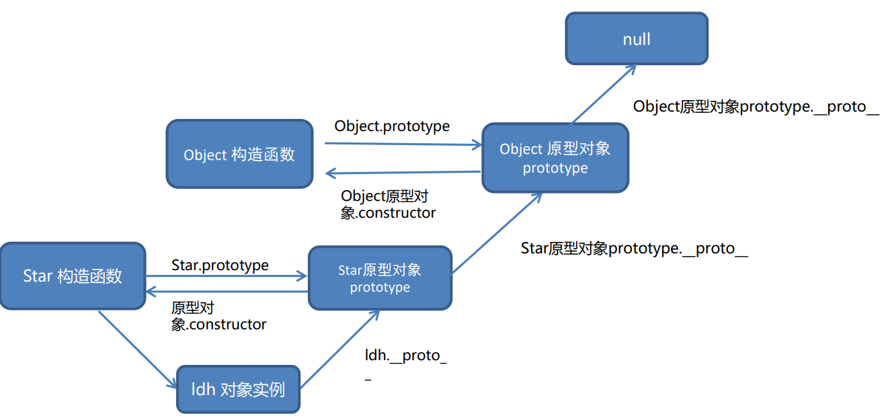

# JavaScript 进阶

## 作用域

作用域（scope）规定了变量能够被访问的“范围”，离开了这个“范围”变量便不能被访问，作用域分为全局作用域和局部作用域。

### 局部作用域

局部作用域分为函数作用域和块作用域。

#### 函数作用域

在函数内部声明的变量只能在函数内部被访问，外部无法直接访问。

```javascript
// 声明 counter 函数
function counter(x, y) {
  // 函数内部声明的变量
  const s = x + y
  console.log(s) // 18
}
// 使用 counter 函数
counter(10, 8)
// 访问变量 s
console.log(s)// 报错
```

总结：

1. 函数内部声明的变量，在函数外部无法被访问javas
2. 函数的参数也是函数内部的局部变量
3. 不同函数内部声明的变量无法互相访问
4. 函数执行完毕后，函数内部的变量实际被清空了

#### 块作用域

在 JavaScript 中使用 `{}` 包裹的代码称为代码块，代码块内部声明的变量外部将【有可能】无法被访问。

```javascript
for (var j = 1; j <= 3; j++) {
    //块作用域
    console.log(j);//1 2 3
}
console.log(j);//4，var没有块级作用域

for (let i = 1; i <= 3; i++) {
    //块作用域
    console.log(i);//1 2 3 
}
console.log(i);//i is not defined，出现报错

//由于()也是块级作用域的一部分，因此不同代码块之间的i不会影响，可以重新定义使用i
for (let i = 1; i <= 3; i++) {
    //块作用域
}
```

总结：

1. let 声明的变量会产生块作用域，const 声明的常量也会产生块作用域
2. var 不会产生块作用域
3. 不同代码块之间的变量无法互相访问
4. 推荐使用 let 或 const
5. 语句或函数的()也是{}的一部分，也处于块作用域之中

### 全局作用域

`<script>` 标签和 `.js` 文件的【最外层】就是所谓的全局作用域，在此声明的变量在函数内部也可以被访问。全局作用域中声明的变量，任何其它作用域都可以被访问。

```html
<script>
  // 此处是全局
  
  function sayHi() {
    // 此处为局部
  }

  // 此处为全局
</script>
```

总结：

1. 为 `window` 对象动态添加的属性默认也是全局的，不推荐！
2. 函数中未使用任何关键字声明的变量为全局变量，不推荐！！！
3. 尽可能少的声明全局变量，防止全局变量被污染

JavaScript 中的作用域是程序被执行时的底层机制，了解这一机制有助于规范代码书写习惯，避免因作用域导致的语法错误。

### 作用域链

作用域链本质上是底层的变量查找机制。在函数被执行时，会优先查找当前函数作用域中查找变量。如果当前作用域查找不到则会依次逐级查找父级作用域直到全局作用域

```javascript
//全局作用域
let a = 0
//局部作用域
function f() {
    let a = 1
    //局部作用域
    function g() {
        let a = 2
        console.log(a);
    }
    g()//调用g
    console.log(a);
}
f()//调用f
//输出为：2 1。先调用f后再调用g时输出自己作用域的a；最后的控制台又打印自己所在的作用域的a。注意父级作用域无法访问子级作用域，因此就算f所在作用域没有定义a，也不会进入g的作用域去找a
```

总结：

1. 嵌套关系的作用域串联起来形成了作用域链

2. 相同作用域链中按着从小到大的规则查找变量

3. 子作用域能够访问父作用域，父级作用域无法访问子级作用域

### JS垃圾回收机制

垃圾回收机制(Garbage Collection) 简称 GC，JS中内存的分配和回收都是自动完成的，内存在不使用的时候会被垃圾回收器自动回收。正因为垃圾回收器的存在，许多人认为JS不用太关心内存管理的问题。

但如果不了解JS的内存管理机制，我们同样非常容易成内存泄漏（内存无法被回收）的情况

内存泄漏：程序中分配的内存由于某种原因程序未释放或无法释放叫做内存泄漏

   #### 内存的生命周期

JS环境中分配的内存, 一般有如下生命周期：

   1. 内存分配：当我们声明变量、函数、对象的时候，系统会自动为他们分配内存
   2. 内存使用：即读写内存，也就是使用变量、函数等
   3. 内存回收：使用完毕，由垃圾回收自动回收器不再使用的内存
   4. 说明：全局变量一般不会回收(关闭页面回收)；一般情况下局部变量的值, 不用了, 会被自动回收掉

   #### 算法说明

堆栈空间分配区别：

   1. 栈（操作系统）: 由操作系统自动分配释放函数的参数值、局部变量等，基本数据类型放到栈里面。
   2. 堆（操作系统）: 一般由程序员分配释放，若程序员不释放，由垃圾回收机制回收。复杂数据类型放到堆里面。

下面介绍两种常见的浏览器垃圾回收算法: 引用计数法 和 标记清除法

   ##### 引用计数(基本不再使用)

IE采用的引用计数算法, 定义“内存不再使用”，就是看一个对象是否有指向它的引用，没有引用了就回收对象

算法：

   1. 跟踪记录被引用的次数
   2. 如果被引用了一次，那么就记录次数1, 多次引用会累加++
   3. 如果减少一个引用就减1--
   4. 如果引用次数是0 ，则释放内存

   ```javascript
   const arr = [1, 2, 3, 4]//复杂数据类型存放到堆里面，同时变量名arr存放指向它的地址，被引用次数为1
   arr = null//arr置空，引用次数为0，释放此复杂数据类型的内存，js引用计数算法释放堆的内存就采用这种方式
   
   // 由上面可以看出，引用计数算法是个简单有效的算法。但它却存在一个致命的问题：嵌套引用（循环引用）
   function fn() {
       let o1 = {}//o1计数1
       let o2 = {}//o2计数1
       o1.a = o2//o1内部引用了o2，o2计数2
       o2.a = o1//o2内部引用了o1，o1计数2
       return '引用计数无法回收'//函数结束，变量回收，但因为o1和o2相互引用，二者计数都为1，无法回收
   }
   fn()
   ```

如果两个对象相互引用，尽管他们已不再使用，垃圾回收器不会进行回收，导致内存泄露。因为他们的引用次数永远不会是0。这样的相互引用如果说很大量的存在就会导致大量的内存泄露

   ##### 标记清除法

现代的浏览器已经不再使用引用计数算法了。现代浏览器通用的大多是基于标记清除算法的某些改进算法，总体思想都是一致的。

核心：

   1. 标记清除算法将“不再使用的对象”定义为“无法达到的对象”。
   2. 就是从根部（在JS中就是全局对象）出发定时扫描内存中的对象。 凡是能从根部到达的对象，都是还需要使用的。
   3. 那些无法由根部出发触及到的对象被标记为不再使用，稍后进行回收。

比如上面的引用计数法无法处理的代码，使用标记清除法会发现o1和o2在根部已经访问不到，所以自动清除


### 闭包

概念：一个函数对周围状态的引用捆绑在一起，内层函数中访问到其外层函数的作用域

简单理解：闭包 = 内层函数 + 外层函数的变量 先看个简单的代码

```javascript
//闭包简单写法
function outer() {
    const a = 1
    function f() {
        console.log(a);
    }
    f()
}
outer()
```

f()是内层函数，且内层函数用到了外层函数的变量，二者捆绑在了一起，这就产生了闭包(只有内外层不是闭包，还要使用外层函数的变量)，外层函数就像打包一样把他们全部包在一起，所以叫闭包，并且外层函数的变量在外层函数的外面是无法使用的，闭包就像一个独立的个体。

在打印控制台设置断点后，可以在调试->源代码->作用域中看到三个作用域，分别是本地(局部)，关闭(闭包)，全局。

闭包作用：封闭数据，提供操作，外部可以访问使用函数内部的变量

```javascript
// 闭包常用写法
function outer1() {
    let a = 10
    function fn() {
        console.log(a);
    }
    return fn
}
const fun = outer1()// outer() === fn === function fn() {} === const fun
fun()//调用函数
//外部函数获取了内部函数的某个值(变量，函数等)，这是闭包的常用用法。这里实现了外部函数fun使用了outer函数内部的变量与函数
```

闭包应用：实现数据的私有

```javascript
// 比如，我们要做个统计函数调用次数，函数调用一次，就++
let i = 0
function fn() {
    i++
    console.log(`函数被调用了${i}次`);
}
fn()//函数被调用了1次
//这样写有一个缺点，i是全局变量，容易被修改。可以把它修改为闭包形式

function count() {
    let j = 0
    function fn() {
        j++
        console.log(`函数被调用了${j}次`);
    }
    return fn
}
j = 1000//外部无法修改闭包中的值
const fun1 = count()//const fun1 === fn
fun1()//函数被调用了1次
//闭包形式统计函数调用次数，外部无法修改值，让fun1 === count的返回值 === fn
//以后调用fun1都会调用fn并且j不会重新赋值为0(并没有调用count)，也不会回收(因为根部可以到达，fun1使用fn，fn使用j)
```

闭包可能会引起内存泄漏的问题，因为闭包返回一个函数，此函数会一直在全局作用域里使用，全局作用域只会在关闭浏览器销毁，因此函数里的局部变量不会被回收。

### 变量提升

变量提升是 JavaScript 中比较“奇怪”的现象，它允许在变量声明之前即被访问（仅存在于var声明变量），是js的缺陷

原理：在代码执行之前，先去检测当前作用域下所有var声明的变量，并把他们提升到当前作用域的最前面。注意：只提升声明，不提升赋值

```javascript
// 书写的代码
// console.log(num + '件');//undefined件
// var num = 10

// 效果实际如下
var num//把所有var声明变量提升到当前作用域最前面，且只提升声明，不提升值
console.log(num + '件');//undefined件
num = 10
```

```javascript
// 书写的代码
// function fn() {
// console.log(a);
// var a = 10
// }
// fn()

//实际如下，局部作用域出现变量提升
function fn() {
    var a
    console.log(a);
    a = 10
}
fn()
```

注意：
1. 变量在未声明即被访问时会报语法错误
2. 变量在声明之前即被访问，变量的值为 `undefined`
3. `let` 声明的变量不存在变量提升，推荐使用 `let`
4. 变量提升出现在相同作用域当中
5. 实际开发中推荐先声明再访问变量

> 说明：JS初学者经常花很多时间才能习惯变量提升，还经常出现一些意想不到的bug，正因为如此，ES6 引入了块级作用域，用let 或者 const声明变量，让代码写法更加规范和人性化。

## 函数

### 函数提升

函数提升与变量提升比较类似，是指函数在声明之前即可被调用。函数提升会把所有函数声明提升到当前作用域的最前面。注意：只提升函数声明，不提升函数调用

```javascript
// 书写的代码
// fn()
// function fn() {
// console.log('函数提升');
// }

//实际如下
function fn() {
    console.log('函数提升');
}
fn()//函数提升
```

函数提升不提升赋值，只提升声明，因此函数表达式的函数提升效果如下

```javascript
// 书写的代码
// fun()
// var fun = function () {
// console.log('函数表达式');
// }

//实际如下
var fun
fun()//报错，fun is not a function
fun = function () {
    console.log('函数表达式');
}
```

总结：

1. 函数提升能够使函数的声明调用更灵活
2. 函数表达式不存在提升的现象。因此函数表达式必须先声明和赋值，后调用，否则报错
3. 函数提升出现在相同作用域当中

### 函数参数

#### 动态参数

`arguments` 动态参数，只存在于函数里面。是函数内部内置的伪数组变量，它包含了调用函数时传入的所有实参

```javascript
function getSum() {
    console.log(arguments);//可以发现这个伪数组里面有2,3,4。即[2,3,4]
    let sum = 0
    for (let i = 0; i < arguments.length; i++) {
        sum += arguments[i]
    }
    console.log(sum);
}
getSum(2, 3, 4)//9

getSum(1, 2, 3, 4, 2, 2, 3, 4)//21
```

总结：
1. `arguments` 是一个伪数组，只存在于函数中
2. `arguments` 的作用是动态获取函数的实参
3. 可以通过for循环依次得到传递过来的实参

#### 剩余参数

剩余参数允许我们将一个不定数量的参数表示为一个数组。它只存在于函数里面

```javascript
function getsum(a, b, ...arr) {
    console.log(arr);//一个真数组，里面存放了传过来的多余的实参参数
    let sum = 0
    for (let i = 0; i < arr.length; i++) {
        sum += arr[i]
    }
    console.log(sum);
}
getsum(2, 3)
getsum(2, 3, 4)
```

说明：
1. ...是语法符号，置于最末函数形参之前，用于获取多余的实参(如上述例子，函数参数表示至少有两个参数，剩下的作为剩余参数)
2. 借助 ...获取的剩余实参，是个真数组，可以使用操作数组的方法

开发中，还是提倡多使用剩余参数。

##### 数组的展开运算符

展开运算符(…), 可以将一个数组进行展开

```javascript
const arr = [1, 2, 3]

// 展开运算符，可以展开数组
console.log(...arr);//1 2 3
// 其实这里的 ...arr === 1,2,3 。打印时没有逗号
```

展开运算符不会修改原数组

典型运用场景： 求数组最大值(最小值)、合并数组等

```javascript
//求数组最大值
console.log(Math.max(1, 2, 3))//求几个数的最大值
console.log(Math.max(...arr))//3
console.log(Math.min(...arr))//1

//合并数组
const arr1 = [2, 3, 4]
const arr2 = [...arr, ...arr1]
console.log(arr2);//[1, 2, 3, 2, 3, 4]
```

展开运算符和剩余参数区别：

- 剩余参数：函数参数使用，得到真数组
- 展开运算符：数组中使用，数组展开

### 箭头函数

目的：引入箭头函数的目的是为了更简短的函数写法并且不绑定this，箭头函数的语法比函数表达式更简洁

使用场景：箭头函数更适用于那些本来需要匿名函数的地方

#### 语法

箭头函数的写法十分灵活，因此有多种情况下的多种写法，如下

```javascript
//语法1：基本写法
//函数表达式    
const fn = function (x) {
    console.log(x);
}
//箭头函数
const fn1 = (x) => {
    console.log(x);
}
fn(0)
fn1(1)

// 语法2：只有一个参数可以省略小括号
const fn2 = x => {
    console.log(x);
}
fn2(2)

// 语法3：如果函数体只有一行代码，可以写到一行上，并且无需写 return 直接返回值
const fn3 = x => console.log(x);
fn3(3)
const fn4 = x => x + x//直接化简掉return的写法
console.log(fn4(4));

// 语法4：箭头函数加括号的函数体返回对象字面量表达式(因为两个{}会冲突，所以换成())
// 正常写法
function fn5(uname) {
    return { name: uname }
}
console.log(fn5('刘德华'))
// 箭头函数
const fn6 = (uname) => ({ name: uname })
console.log(fn6('刘德华'))
// 更加简化(属性名和值相同时可以写为一个)
const fn7 = (uname) => ({ uname })
console.log(fn7('刘德华'))
```

总结：

1. 箭头函数属于表达式函数，因此不存在函数提升
2. 箭头函数只有一个参数时可以省略圆括号()
3. 箭头函数函数体只有一行代码时可以省略花括号 { }，并自动做为返回值被返回
4. 加括号的函数体返回对象字面量表达式

#### 箭头函数参数

普通函数有`arguments`动态参数。箭头函数没有 `arguments` 动态参数，但是有剩余参数`...arr`

~~~javascript
//利用箭头函数求和
const getSum = (...arr) => {
    let sum = 0
    for (let i = 0; i < arr.length; i++) {
        sum += arr[i]
    }
    return sum
}
console.log(getSum(2, 3, 4));//9
~~~

#### 箭头函数 this

在箭头函数出现之前，每一个新函数根据它是被如何调用的来定义这个函数的this值，非常令人讨厌。

**箭头函数不会创建自己的this, 它只会从自己的作用域链的上一层沿用this(箭头函数没有this，所以不用考虑所在作用域)。**

在开发中【使用箭头函数前需要考虑函数中 this 的值】，事件回调函数使用箭头函数时，this 为全局的 window，因此DOM事件回调函数为了简便，还是不太推荐使用箭头函数

~~~javascript
//普通函数this指向：谁调用这个函数，this就指向谁
console.log(this);//window
//普通函数
function fn8() {
    console.log(this);
}
fn8()//window，因为window.fn()
//对象方法(普通函数)
const obj = {
    name: 'andy',
    sayHi: function () {
        console.log(this);//this指向obj
    }
}
obj.sayHi()//obj

//箭头函数的this：指向上一层作用域的this
const fn9 = () => {
    console.log(this);
}
fn9()//window，这里并不是因为window.fn，而是箭头函数里的this会查找自己上一层作用域的this，此处上一层作用域是script(全局)，它的this指向的调用者是window
//对象方法的箭头函数this
const obj1 = {
    uname: 'pink老登',
    sayHi: () => {
        console.log(this);
    }
}
obj1.sayHi//window，函数上一级作用域是obj，有this，window调用obj
//更难的对象
const obj2 = {
    uname: 'pink老师',
    sayHi: function () {
        let i = 10
        const count = () => {
            console.log(this);
        }
        count()
    }
}
obj2.sayHi//obj2,因为箭头函数沿着上一层作用域找this，而普通函数有this，因此指向普通函数的调用者obj
~~~

## 解构赋值

解构赋值是一种快速为变量赋值的简洁语法，本质上仍然是为变量赋值，分为数组解构、对象解构两大类型。

### 数组解构

数组解构是将数组的单元值快速批量赋值给一系列变量的简洁语法。用于批量声明变量，右侧数组的单元值将被赋值给左侧的变量。变量的顺序对应数组单元值的位置依次进行赋值操作

基本语法：`声明 [变量名] = [数组元素]`

```javascript
// 不使用数组解构
// const arr = [100, 60, 80]
// const max = arr[0]
// const min = arr[1]
// const avg = arr[2]
// 上边一个个赋值太麻烦，使用数组解构
const [max, min, avg] = [100, 60, 80]
console.log(max);//100

// 典型应用：交互2个变量
let a = 1
let b = 2;//这里的;是必须加的，否则会报错
[b, a] = [a, b]
console.log(a, b)//2 1
```

说明：

1. 赋值运算符 `=` 左侧的 `[]` 用于批量声明变量，右侧数组的单元值将被赋值给左侧的变量
2. 变量的顺序对应数组单元值的位置依次进行赋值操作
3. 变量的数量大于单元值数量时，多余的变量将被赋值为  `undefined`
4. 变量的数量小于单元值数量时，可以通过 `...` 获取剩余单元值，但只能置于最末位
5. 允许初始化变量的默认值，且只有单元值为 `undefined` 时默认值才会生效

```javascript
// 变量多单元值少的情况：变量的数量大于单元值数量时，多余的变量将被赋值为 undefined
const [c, d, e, f] = [1, 2, 3]
console.log(c, d, e, f);//1 2 3 undefined，相当于第四个变量进行声明但未赋值，所以是undefined未定义

// 变量少单元值多的情况：
const [g, h] = [1, 2, 3]
console.log(g, h);//1 2，数组第三个元素不算入

// 利用剩余参数解决变量少单元值多的情况：剩余参数返回的还是一个数组
const [i, j, ...k] = [1, 2, 3, 4]
console.log(i, j);//1 2
console.log(k);//[3, 4]

// 防止有undefined传递单元值的情况，可以设置默认值：允许初始化变量的默认值，且只有单元值为 undefined 时默认值才会生效
const [l = 0, m = 0] = [1]
console.log(l, m);//1 0
//很像函数的实参和形参的关系，可以参考记录

// 按需导入，忽略某些返回值：
const [n, o, , p] = [1, 2, 3, 4]
console.log(n, o, p);//1 2 4

// 支持多维数组的结构：
const arr = [1, 2, [3, 4]]//二维数组演示
console.log(arr[0]);//1
console.log(arr[1]);//2
console.log(arr[2]);//[3, 4]
console.log(arr[2][0]);//3
const [q, r, [s, t], u] = [1, 2, [3, 4], [5, 6]]//多维数组的结构
console.log(q);//1
console.log(r);//2
console.log(s);//3
console.log(t);//4
console.log(u);//[5, 6] 
```

#### js 前面必须加分号情况

1. 立即执行函数：(function t() { })();
2. 数组解构(数组结构只是常见的分号错误，正常数组特殊场景使用也会分号错误)：;[b, a] = [a, b]或 在上一行加;

```javascript
console.log('老登');//如果这里不加;，就会报错，因为正常写法都是将[1,2,3]存到一个arr里，使用arr。而这种陌生的方法会被js理解成console.log('老登')[1, 2, 3]，就会报错
[1, 2, 3].map(function (item) {
    console.log(item)
})
```

### 对象解构

对象解构是将对象属性和方法快速批量赋值给一系列变量的简洁语法。用于批量声明变量，右侧对象的属性值将被赋值给左侧的变量

基本语法：`声明 {变量} = {属性:属性值}`

```javascript
//不使用对象解构
// const obj = {
// uname: 'pink老登',//其实对象里的属性也是变量，只不过在对象里叫做属性，在外面叫变量
// age: 18
// }
// const uname = obj.uname
// const age = obj.age
// 对象解构，下面一行代码等于上面代码
const { uname, agee } = { uname: 'pink老登', age: 18 }
console.log(uname);//pink老登
console.log(agee);//undefine，变量和属性名字不一致
```

说明：

1. 对象属性的值只能赋值给与属性名相同的变量
2. 注意解构的变量名不要和外面的变量名冲突，否则报错
3. 如果有变量名和属性名字不一致，那么该变量值为undefine

~~~javascript
// 给新的变量名赋值的方法：可以从一个对象中提取变量并同时修改新的变量名。冒号表示“旧变量名：新变量名”
const { uname: username } = { uname: 'pink老登' }
console.log(username);//pink老登，uname变量成功改名为username，即username存放着uname属性的属性值

// 数组对象解构
const pig = [
    {
        uname1: '佩奇',
        age: 18
    }
]
const [{ uname1, age }] = pig
console.log(uname1);//佩奇
console.log(age);//18

// 多级对象解构
const pig1 = {
    name: '佩奇',
    family: {
        mother: '猪妈妈',
        father: '猪爸爸',
        sister: '乔治'
    },
    age: 6
}
//由于mother, father, sister等在对象嵌套时可能在多个对象中都存在，所以需要知道是哪个对象的属性
const { name, family: { mother, father, sister } } = pig1
console.log(name, mother, father, sister);//佩奇 猪妈妈 猪爸爸 乔治

// 多级数组对象解构
const pig2 = [{
    name2: '佩奇',
    family: {
        mother2: '猪妈妈',
        father2: '猪爸爸',
        sister2: '乔治'
    },
    age2: 6
}]
const [{ name2, family: { mother2, father2, sister2 } }] = pig2
console.log(name, mother, father, sister);//佩奇 猪妈妈 猪爸爸 乔治
~~~

> 注意：对象解构和数组解构中的变量赋值是有区别的，对象解构的变量可以无序摆放(因为属性名和变量名总保持一致)，而数组解构的变量必须按顺序摆放

## 深入对象

创建对象三种方式：

1. 利用对象字面量创建对象(推荐使用)

```javascript
const o = {	
    name: '佩奇'
}
```

2. 利用 new Object 创建对象(了解)

```javascript
const ob = new Object({ uname: 'pink' })
console.log(ob);
```

3. 利用构造函数创建对象

### 构造函数

构造函数是专门用于创建对象的函数，是一种特殊的函数，主要用来快速创建多个类似的对象。如果一个函数使用 `new` 关键字调用，那么这个函数就是构造函数。

使用场景：常规的 {...} 语法允许创建一个对象。比如我们创建了佩奇的对象，继续创建乔治的对象还需要重新写一遍，此时可以通过构造函数来快速创建多个类似的对象。

构造函数在技术上是常规函数。不过有两个约定：
1. 它们的命名以大写字母开头。
2. 它们只能由 "new" 操作符来执行。new 关键字调用函数的行为被称为实例化

```javascript
//创建一个猪的构造函数
function Pig(uname, age) {
    //谁调用，this指向谁。这里this就指代空对象，即{}.uname = uname
    this.uname = uname
    this.age = age
}

//调用构造函数，需要加new
const pepa1 = new Pig('佩奇', 6)//创建对象，两个实参
const pepa2 = { uname: '佩奇', age: 6 }//正常创建对象的方式
console.log(pepa1);//{uname: '佩奇', age: 6}
console.log(pepa2);//{uname: '佩奇', age: 6}
```

> 实践中为了从视觉上区分构造函数和普通函数，习惯将构造函数的首字母大写。

#### 实例化

1. 使用 new 关键字调用函数的行为被称为实例化，即使用构造函数通过new生成一个实实在在的对象的意思
2. 实例化构造函数时没有参数时可以省略()，但不提倡
3. 构造函数内部无需写return，默认自动返回新创建的对象
4. 构造函数内部的 return 返回的值无效，所以不要写return
5. new Object()  new Date() 也是实例化构造函数

##### 实例化执行过程

1. 创建新的空对象：只要使用了new Goods()，会立即创建一个空对象
2. 构造函数this指向新对象：即this指向新创建的空对象
3. 执行构造函数代码，修改this，添加新的属性：如果new Goods()有参数，则函数从上到下依次执行，用this指向给空对象进行添加属性的操作(使用语法：对象名.属性名 = 属性值)
4. 返回新对象：返回这个新对象

#### 构造函数成员

##### 实例成员

实例成员：通过构造函数创建的对象称为实例对象，实例对象中的属性和方法称为实例成员(包含实例属性和实例方法)。

说明：
1. 给构造函数传入参数，可以创建结构相同但值不同的对象

2. 构造函数创建的实例对象彼此独立互不影响。

```javascript
//给构造函数传入参数，可以创建结构相同但值不同的对象
function Pig1(name) {
    this.name = name
}
//二者结构一样，但值不一样，是不同的两个对象
const peiqi = new Pig1('佩奇')
const qiaozhi = new Pig1('乔治')
console.log(peiqi);// {name: '佩奇'}
console.log(qiaozhi);//{name: '乔治'}

//构造函数创建的实例对象彼此独立互不影响。
peiqi.name = '小猪佩奇'//给peiqi添加属性，qiaozhi并不会受到影响
console.log(peiqi);//{name: '小猪佩奇'}
console.log(qiaozhi);//{name: '乔治'}
```

>  构造函数内部 `this` 实际上就是实例对象，为其动态添加的属性和方法即为实例成员

##### 静态成员

在 JavaScript 中底层函数本质上也是对象类型，因此允许直接为函数动态添加属性或方法，构造函数的属性和方法被称为静态成员(包含静态属性和静态方法)。

说明：
1. 静态成员只能构造函数来访问

2. 静态方法中的this指向构造函数

静态成员的使用：如Data.now()  Math.PI  Math.random() 


```javascript
function Pig2(name) {
    this.name = name//在这里创建的不是静态属性
}
Pig2.eyes = 2 //静态属性
console.log(Pig2.eyes);//2，使用静态属性(Math.PI原理)
Pig2.sayHi = function () {//静态方法
    console.log(this);
}
Pig2.sayHi()//Pig2构造函数，使用静态方法sayHi() (和Data.now()和Math.random()同理)
```

总结：

1. 静态成员指的是添加到构造函数本身的属性和方法
2. 一般公共特征的属性或方法静态成员设置为静态成员
3. 静态成员方法中的 `this` 指向构造函数本身

#### 内置构造函数

在 JavaScript 内置了一些构造函数，绝大部的数据处理都是基于这些构造函数实现的，JavaScript 基础阶段学习的 `Date` 就是内置的构造函数。

在 JavaScript 中**最主要**的数据类型有 6 种：

- 基本数据类型：字符串、数值、布尔、undefined、null
- 引用类型：对象

但是，我们会发现有些特殊情况：

```javascript
const str1 = 'pink'
console.log(str.length);//4，按照道理，str身为简单数据类型，是没有属性方法的，但这里可以使用属性
```

之所以具有对象特征的原因是字符串、数值、布尔类型数据是 JavaScript 底层使用 Object 构造函数“包装”来的，被称为包装类型。

字符串、数值、布尔等基本类型也都有专门的构造函数，用于创建对应类型的数据。这些我们称为包装类型。即把简单数据类型包装成复杂数据类型。

```javascript
const str2 = new String('pink')//const str1 = 'pink'的js底层原理，其实是使用一个构造函数将简单数据类型包装成了一个对象(引用数据类型)
```

- 引用类型：Object，Array，RegExp，Date 等
- 包装类型：String，Number，Boolean 等

JS中几乎所有的数据都可以基于构成函数创建。

##### 引用类型 - Object

`Object` 是内置的构造函数，用于创建普通对象。推荐使用字面量方式声明对象，而不是 Object 构造函数。

下面是三个常用的静态方法（静态方法就是只有构造函数Object可以调用的）

###### Object.keys()

作用：`Object.keys()` 静态方法获取对象中所有属性（键）

语法：`Object.keys(对象)`

```javascript
const o = { uname: 'pink', age: 18 }
console.log(Object.keys(o));//['uname', 'age']，获得对象的所有键，并且返回一个数组
// 注意： 返回的是一个数组。不要写成o.keys()，o是实例对象，是没有keys属性的。静态方法只有构造函数才有
```

###### Object.values()

作用：`Object.values()` 静态方法获取对象中所有属性值

语法：`Object.values(对象)`

```javascript
console.log(Object.values(o));//['pink', 18]
// 注意： 返回的是一个数组
```

###### Object.assign()

作用：`Object. assign()` 静态方法可以给源对象追加新对象

语法：`Object.assign(源对象, 新对象)`

```javascript
const o = { uname: 'pink', age: 18 }
const oo = {}
Object.assign(oo, o)//源对象放第一个，新对象放第二个
console.log(oo);//{uname: 'pink', age: 18}

// 使用：经常使用的场景是给对象添加属性
Object.assign(o, { gender: '女' })//将新对象追加到旧对象里面
console.log(o);//{uname: 'pink', age: 18, gender: '女'}
```

总结：

1. 推荐使用字面量方式声明对象，而不是 `Object` 构造函数
2. `Object.assign` 静态方法创建新的对象
3. `Object.keys` 静态方法获取对象中所有属性
4. `Object.values` 表态方法获取对象中所有属性值

##### 引用类型 - Array

`Array` 是内置的构造函数，用于创建数组。创建数组建议使用字面量创建，不用 Array构造函数创建。

###### map()

作用：`map()` 迭代数组，类似forEach

说明：map() 可以处理数据，返回新数组，返回的是处理之后的数组元素，将要使用的新数组

语法：如下。ele是数组元素，index是数组索引号

```javascript
const arr = ['pink', 'red', 'blue']
const newArr = arr.map(function (ele, index) {
    console.log(ele);//ele得到数组元素'pink', 'red', 'blue'
    console.log(index);//index得到索引号0 1 2
    return ele + '老师'
})
console.log(newArr);//['pink老师', 'red老师', 'blue老师']
```

map也称为映射。映射是个术语，指两个元素之间存在相互“对应”的关系。map的映射指原数组和新数组的每个元素都存在一一对应的关系。map重点在于有返回值，forEach没有返回值。

###### join()

作用：join() 方法用于把数组中的所有元素转换一个字符串

语法：console.log(arr.join(''))

参数：数组元素是通过参数里面指定的分隔符进行分隔的。

```javascript
// 括号内为空则默认用逗号分隔
console.log(arr.join());//pink,red,blue
// 括号内为空字符串则元素连接，没有分隔
console.log(arr.join(''));//pinkredblue
// 括号内为|(字符类型)则用|分隔
console.log(arr.join('|'));//pink|red|blue
```

> map和join搭配使用可以渲染页面：map用于将已被转换为数组对象的本地存储数据进行处理，将数据写入到模板字符串的标签中；join则是把存放模板字符串的数组转换为一整个字符串，然后导入到页面对应元素中就完成了渲染。
>
> ```javascript
> //一个很经典的渲染业务
> 
> //读取本地存储的复杂数据类型，本地存储没有数据则用空数组代替，这里使用了逻辑中断
> const arr = JSON.parse(localStorage.getItem('data')) || []
> console.log(arr);
> //将读取到的数据使用map和join方法进行渲染
> const tbody = document.querySelector('tbody')
> function render() {
>   //map遍历数组，返回对应的tr数组
>   const trArr = arr.map(function (ele, index) {
>     //切记这里的`必须和return同一行，否则return返回就是空
>     //每次重新渲染，自定义属性都会重新排列，并且自定义属性等于元素下标，元素的排列顺序和删除都不会出现bug
>     return `
>     <tr>
>       <td>${ele.stuId}</td>
>       <td>${ele.uname}</td>
>       <td>${ele.age}</td>
>       <td>${ele.gender}</td>
>       <td>${ele.salary}</td>
>       <td>${ele.city}</td>
>       <td>
>         <a href="javascript:" data-id="${index}">删除</a>
>       </td>
>     </tr> 
>     `
>   })
>   //使用join把数组转换为字符串
>   //把生成的字符串追加给tbody
>   tbody.innerHTML = trArr.join('')
> }
> render()
> ```

###### forEach()

`forEach()` 方法用于调用数组的每个元素，并将元素传递给回调函数。它和map的语法十分相似。

主要使用场景： 遍历数组的每个元素和数组对象

语法：`被遍历的数组.forEach(function(当前数组元素,当前元素索引号) {函数体})`

参数中的当前数组元素是必须要写的， 索引号可选

```javascript
const arr = ['red', 'green', 'pink']
arr.forEach(function (item, index) {
    console.log(item);//数组元素 red green pink
    console.log(index);//索引号 0 1 2
})
```

功能和语法基本和map一致，不同的是它不返回新数组，没有返回值。forEach 就是遍历 加强版的for循环，适用于遍历数组对象。

###### filter()

`filter()` 方法创建一个新的数组，新数组中的元素是通过检查指定数组中符合条件的所有元素。

主要使用场景： 筛选数组符合条件的元素，并返回筛选之后元素的新数组

语法：`被遍历的数组.filter(function(currentvalue,index) {return 筛选条件})`

```javascript
const arr = [10, 20, 30]
const newArr = arr.filter(function (item, index) {
    console.log(item);
    console.log(index);
    //筛选数组中大于等于20的元素
    return item >= 20
})
console.log(newArr);

//使用箭头函数简化
const newArr1 = arr.filter(item => item >= 20)
console.log(newArr1);   
```

###### reduce()

作用：`reduce()` 返回函数累计处理的结果，经常用于求和等

语法：`数组.reduce(function (上一次值,当前值) { }, 起始值)`

参数：起始值可以省略，如果有起始值，则把初始值累加到里面

```javascript
const arr = [1, 5, 8]
const total1 = arr.reduce(function (prev, current) {
    return prev + current
}, 10)
console.log(total1);//24，即数组里所有值相加后再加上初始值

//使用箭头函数简化
const total2 = arr.reduce((prev, current) => prev + current, 10)
console.log(total2);//24
```

reduce执行过程：

- 如果没有起始值，则上一次值以数组的第一个数组元素的值
- 每一次循环，把返回值给做为下一次循环的上一次值
- 如果有起始值，则起始值做为上一次值

```javascript
//没有初始值
const total3 = arr.reduce(function (prev, current) {
    return prev + current
})
console.log(total3);//14，由于没有初始值，因此数组的第一个元素(此处为1)作为初始值
// 即第一次循环：上一次值为1，当前值为5，返回值为6
// 第二次循环：上一次值(上次的返回值)为6，当前值为8，返回值为14

//有初始值
const total4 = arr.reduce(function (prev, current) {
    return prev + current
}, 10)
console.log(total4);//24，起始值作为上一次值
// 即第一次循环：上一次值为10，当前值为1，返回值为11
// 第二次循环：上一次值(上次的返回值)为11，当前值为5，返回值为16
// 第三次循环：上一次值(上次的返回值)为16，当前值为8，返回值为24
```


###### 成员总结

1. 实例方法 `forEach()` 用于遍历数组，替代 `for` 循环 (重点)
2. 实例方法 `filter()` 过滤数组单元值，生成新数组(重点)
3. 实例方法 `map()` 迭代原数组，生成新数组(重点)
4. 实例方法 `reduce()` 返回函数累计处理的结果，经常用于求和等(重点)
5. 实例方法 `join()` 数组元素拼接为字符串，返回字符串(重点)
6. 实例方法  `find()`  查找元素， 返回符合测试条件的第一个数组元素值，如果没有符合条件的则返回 undefined(重点)
	```javascript
   const arr = [{ name: '小米', price: 1999 }, { name: '华为', price: 3999 }]//find方法典型使用场景
   //找小米这个对象，并且返回这个对象
   // const re = arr.find(function (item) {
   // return item.name === '小米'
   // })
   const re = arr.find(item => item.name === '小米')//箭头函数写法，查找条件是元素(对象)里的属性，但返回值依旧是数组元素，即对象
   console.log(re);//{name: '小米', price: 1999}，返回的是数组的元素
   //find也可以被filter代替，他们二者较为相似，不过使用场景还是有所区别，find适合上述场景，filter适合数字条件的筛选中。二者返回值也不同
	```
7. 实例方法`every()` 检测数组所有元素是否都符合指定条件，如果**所有元素**都通过检测返回 true，否则返回 false(重点)
	```javascript
    const arr1 = [10, 20, 30]
    const flag = arr1.every(item => item >= 10)//当数组元素全部大于等于10时，返回true
    console.log(flag);//true
	```
8. 实例方法`some()` 检测数组中的元素是否满足指定条件   **如果数组中有**元素满足条件返回 true，否则返回 false

9. 实例方法 `concat()`  合并两个数组，返回生成新数组

10. 实例方法 `sort()` 对原数组单元值排序

11. 实例方法 `splice()` 删除或替换原数组单元

12. 实例方法 `reverse()` 反转数组

13. 实例方法 `findIndex()`  查找元素的索引值

14. 静态方法 `Array.from() `伪数组转换为真数组

	```javascript
	const lis = document.querySelectorAll('ul li')
	console.log(lis);//[li, li, li]，只不过是一个伪数组
	// lis.pop()//报错，因为伪数组没有真数组的一些常用方法
	
	const liss = Array.from(lis)
	console.log(liss);//[li, li, li]，但这次是真数组
	liss.pop()//删除数组的最后一个元素
	console.log(liss);//[li, li]
	```


##### 包装类型 - String

`String` 是内置的构造函数，用于创建字符串。

```javascript
// 使用构造函数创建字符串
let str = new String('hello world!');

// 字面量创建字符串
let str2 = '你好，世界！';

// 检测是否属于同一个构造函数
console.log(str.constructor === str2.constructor); // true
console.log(str instanceof String); // false
```

###### trim()

trim() 方法用于去除字符串两侧的空格，如果字符串里只有空格，也可以清除后变为空字符串

```html
<body>
    <textarea name="" id="" cols="30" rows="10"></textarea>
    <script>
        const str = '          im a teacher  '
        console.log(str.trim())  // 去除字符串左右的空格
        //trim实现文本框评论功能
        const tx = document.querySelector('textarea')
        tx.addEventListener('keyup', function (e) {
            if (e.key === 'Enter') {
                if (tx.value.trim() !== '') {
                    //输出评论
                    console.log(tx.value.trim());
                }
                //清空文本域
                tx.value = ''
            }
        })
    </script>
</body>
```

###### 成员总结

1. 实例属性 `length` 用来获取字符串的度长(重点)
2. 实例方法 `split('分隔符')` 用来将字符串拆分成数组(重点)，和join方法相反

  ```javascript
  const str1 = 'pink,red'
  const arr1 = str1.split(',')//将,作为分隔符进行拆分
  console.log(arr1);//['pink', 'red']
  
  const str2 = '2022-4-8'
  const arr2 = str2.split('-')
  console.log(arr2);//['2022', '4', '8']
  ```

3. 实例方法 `substring（需要截取的第一个字符的索引[,结束的索引号]）` 用于字符串截取(重点)

  ```javascript
  const str3 = '今天又要做核酸'
  console.log(str3.substring(5));//核酸。如果省略结束的索引号，默认取到最后所有字符
  console.log(str3.substring(5, 6));//核。结束的索引号不包含在想要截取的部分
  ```

4. 实例方法 `startsWith(检测字符串[, 检测位置索引号])` 检测是否以某字符开头(重点)

  ```javascript
  const str4 = 'pink老登上课中'
  console.log(str4.startsWith('pink'));//true，因为字符串以pink开头
  console.log(str4.startsWith('ink'));//false
  ```

5. 实例方法 `includes(搜索的字符串[, 检测位置索引号])` 判断一个字符串是否包含在另一个字符串中，根据情况返回 true 或 false(重点)

  ```javascript
  const str5 = '我是pink老师'
  console.log(str5.includes('pink'));//true，字符串中包含pink
  console.log(str5.includes('pink',3));//flase，从i开始检索，查不到pink
  ```

6. 实例方法 `toUpperCase` 用于将字母转换成大写
7. 实例方法 `toLowerCase` 用于将就转换成小写
8. 实例方法 `indexOf`  检测是否包含某字符
9. 实例方法 `endsWith` 检测是否以某字符结尾
10. 实例方法 `replace` 用于替换字符串，支持正则匹配
11. 实例方法 `match` 用于查找字符串，支持正则匹配
12. 实例方法 `trim` 用于去除字符串两侧的空格，主要用于文本框评论功能
13. 实例方法 `toString()` 用于将其他简单类型转换为字符类型(String()可以直接实现)

```javascript
const num = 10
console.log(String(num));
console.log(num.toString());
```

>  注：String 也可以当做普通函数使用，这时它的作用是强制转换成字符串数据类型。

##### 包装类型 - Number

`Number` 是内置的构造函数，用于创建数值。

```javascript
// 使用构造函数创建数值
let x = new Number('10')
let y = new Number(5)

// 字面量创建数值
let z = 20
```

###### toFixed()

`toFixed()` 设置保留小数位的长度

注意：`toFixed()` 会把数数字转换为字符串类型

```javascript
const num1 = 10.456
const num2 = 10.654
console.log(num1.toFixed(), num2.toFixed());//10 11。不写参数默认截取整数，并且四舍五入
console.log(num1.toFixed(2), num2.toFixed(2));//10.46 10.65。保留两位小数，并且四舍五入
const num3 = 10
console.log(num3.toFixed(2));//10.00。整数也可以保留小数位数
```

## 面向对象

### 编程思想

js是面向函数编程，是面向过程更多一些，属于面向过程语言，但也可以面向对象

#### 面向过程编程

面向过程就是分析出解决问题所需要的步骤，然后用函数把这些步骤一步一步实现，使用的时候再一个一个的依次调用就可以了。

举个栗子：蛋炒饭：先炒饭，再炒蛋，再放蔬菜，出锅


面向过程，就是按照我们分析好了的步骤，按照步骤解决问题。

#### 面向对象编程

面向对象是把事务分解成为一个个对象，然后由对象之间分工与合作。面向对象是以对象功能来划分问题，而不是步骤。在面向对象程序开发思想中，每一个对象都是功能中心，具有明确分工。

举个栗子：盖浇饭：几个人做好米饭，番茄鸡蛋，回锅肉，土豆丝，要做哪种盖浇饭直接二者组合就行了


企业就是一个典型的面向对象，有各种部门，具有不同功能，部门之间的组合完成一项工作。

面向对象编程具有灵活、代码可复用、容易维护和开发的优点，更适合多人合作的大型软件项目。

面向对象的特性：

- 封装性


- 继承性
- 多态性

> js，python既可以面向对象也可以面向过程，java只能面向对象，c只能面向过程

##### 特性说明


图片描述：马路上一个环卫工开着一个改装过的拖拉机，拖拉机主体被改为一个可以旋转的轴，轴的周围均匀的插满了扫把，实现了旋转轴进行扫地的功能

- 继承性：继承了拖拉机的接口，实现了扫地的接口，不需要再研发拖拉机的功能
- 封装性：无需知道如何运作，直接开动即可
- 多态性：有多个状态。比如平时扫地，天热当风扇
- 重用性：没用额外动力，重复利用了拖拉机发动机的能量
- 多线程：多个扫把同时工作
- 低耦合：扫把可以换成拖把而无须改动，或者说扫把坏了换成新扫把不会有影响
- 组件编程：每个配件都是可单独利用的工具
- 适配器模式：无需造发动机，继承自拖拉机，只取动力方法
- 代码托管：无需管理垃圾，直接扫到路边即可

#### 面向过程和面向对象的对比

面向过程编程：

- 优点：性能比面向对象高，适合跟硬件联系很紧密的东西，例如单片机就采用的面向过程编程。
- 缺点：没有面向对象易维护、易复用、易扩展

面向对象编程：

- 优点：易维护、易复用、易扩展，由于面向对象有封装、继承、多态性的特性，可以设计出低耦合的系统，使系统更加灵活、更加易于维护
- 缺点：性能比面向过程低

> 生活离不开蛋炒饭，也离不开盖浇饭，选择不同而已，只不过前端不同于其他语言，面向过程更多

### 构造函数实现封装

对比以下通过面向对象的构造函数实现的封装：

```javascript
// 构造函数，公共的属性和方法封装到Person构造函数里面了
function Person() {
    // 初始化名字  
    this.name = '佚名'
    // 设置名字
    this.setName = function (name) {
        this.name = name
    }
    // 读取名字
    this.getName = () => {
        console.log(this.name)
    }
}
// 实例对象，获得了构造函数中封装的所有逻辑
let p1 = new Person()
console.log(p1.name)//佚名
p1.setName('小明')
console.log(p1.name)//小明
```

封装是面向对象思想中比较重要的一部分，js面向对象可以通过构造函数实现封装。

同样的将变量和函数组合到了一起并能通过 this 实现数据的共享，所不同的是借助构造函数创建出来的实例对象之间是彼此不影响的。

>总结：
>
>1. 构造函数体现了面向对象的封装特性
>2. 构造函数实例创建的对象彼此独立、互不影响

### 原型对象 prototype 属性

前面我们学过的构造函数方法很好用，但是 存在浪费内存的问题。

```javascript
function Star(uname, age) {
    this.uname = name
    this.age = age
    this.sing = function () {
        console.log('唱歌');
    }
}
const ldh = new Star('刘德华', 55)
const zxy = new Star('张学友', 58)

console.log(ldh.sing === zxy.sing);//false
```

可以发现两个函数不一样，这是因为每用构造函数创建一次实例对象，都会从新开辟空间，将里面的成员重新创建一遍。这里创建两个对象就创建了两个方法，出现了浪费内存的问题。

我们希望所有的对象使用同一个函数，而不是创建多个同样的函数(即对象里的属性可以不同，但方法要相同并共用)，这样就比较节省内存，那么我们就要用到原型对象了。

构造函数中，通过原型(或称原型对象)分配的函数是所有对象所共享的。

- JavaScript 规定，每一个构造函数都有一个 prototype 属性，指向另一个对象，所以我们也称为原型对象(即 构造函数.prototype)
- 这个对象可以挂载函数，对象实例化不会多次创建原型上函数，节约内存
- 我们可以把那些不变的方法，直接定义在 prototype 对象上，这样所有对象的实例就可以共享这些方法。

```javascript
function Star(uname, age) {
    this.uname = name
    this.age = age
}
console.log(Star.prototype);//原型

//将需要挂载的函数挂在原型身上
Star.prototype.sing = function () {
    console.log('唱歌')
}

const ldh = new Star('刘德华', 55)
const zxy = new Star('张学友', 58)
console.log(ldh.sing === zxy.sing);//true
//这里变成了true，说明了无论实例化多少个对象，他们调用sing方法只有一个
```

简而言之：一个构造函数的原型对象是所有对象共享的（前提是使用该构造函数new的）

总结：公共的属性写到构造函数里面，公共的方法写到原型对象里面


>  JavaScript 中对象的工作机制：当访问对象的属性或方法时，先在当前实例对象是查找，然后再去原型对象查找，并且原型对象被所有实例共享。

#### this指向

构造函数和原型对象中的this 都指向 实例化的对象

```javascript
//构造函数和原型对象的this指向问题
let that1
let that2

function Starr(uname) {
    that1 = this//用that把this保存下来
    this.uname = uname
}

Starr.prototype.sing = function () {
    that2 = this
    console.log('唱歌');
}

const liudh = new Starr('刘德华')
console.log(that1 === liudh);//true，构造函数里的this指向刘德华，指向被创建的实例对象
liudh.sing()//调用函数，执行里面的代码
console.log(that2 === liudh);//true，this指向函数调用者，即原型对象里面的函数this指向调用的实例对象
```

#### constructor 属性

每个原型对象里面都有个constructor属性（constructor 构造函数）

作用：该属性指向该原型对象的构造函数， 简单理解，就是构造函数里有一个prototype属性(原型)，prototype里有constructor属性指向构造函数。

```javascript
function Star() { }
const ldh = new Star()
console.log(Star.prototype)//展开原型对象，可以发现里面有一个constructor属性。并且可以看到它指向了Star构造函数
console.log(Star.prototype.constructor === Star)//true
```

使用场景：如果有多个对象的方法，我们可以给原型对象采取对象形式赋值。但是这样就会覆盖构造函数原型对象原来的内容，这样修改后的原型对象 constructor 就不再指向当前构造函数了。此时，我们可以在修改后的原型对象中，添加一个 constructor 指向原来的构造函数。这是constructor的实际作用。


```javascript
//多个方法依次追加
function Star1() { }
Star1.prototype.sing = function() {
console.log('唱歌');
}
Star1.prototype.dance = function() {
console.log('跳舞');
}
console.log(Star1.prototype);//在原先的原型上追加两个方法，不会影响原先的方法

//多个方法同时赋值
function Star2() { }
Star2.prototype = {
    sing: function () {
        console.log('唱歌');
    },
    dance: function () {
        console.log('跳舞');
    }
}
console.log(Star2.prototype);//可以发现此时的原型链上虽然有自己设置的两个方法，但constructor消失了，这样就不知道是哪个构造函数的原型了
console.log(Star2.prototype.constructor);//找不到这个属性

//多个方法同时赋值并带上constructor
function Star3() { }
Star3.prototype = {
    //重新指回创造这个原型对象的构造函数，这就是 constructor的作用
    constructor: Star3,
    sing: function () {
        console.log('唱歌');
    },
    dance: function () {
        console.log('跳舞');
    }
}
console.log(Star3.prototype);//包含了constructor，可以重新指回这个构造函数了
```

#### 对象原型 \_\_proto\_\_ 属性

对象都会有一个属性 \_\_proto\_\_ 指向构造函数的 prototype 原型对象，之所以我们对象可以使用构造函数 prototype 原型对象的属性和方法，就是因为对象有 \_\_proto\_\_ 原型的存在。注意：

- \_\_proto\_\_ 是JS非标准属性，即不是js的写法
- [[prototype]]和\_\_proto\_\_意义相同，用来表明当前实例对象指向哪个原型对象prototype
- \_\_proto\_\_只读，不能改
- \_\_proto\_\_对象原型里面也有一个 constructor属性，指向创建该实例对象的构造函数


```javascript
function Star() { }
const ldh = new Star()
console.log(ldh);//可以发现里面有一个[[Prototype]]属性，这就是__proto__指向的原型对象
console.log(ldh.__proto__ === Star.prototype);//true，对象原型__proto__指向，该构造函数的prototype原型对象
console.log(ldh.__proto__.constructor === Star);//true，对象原型里面有constructor属性，指向创建该实例对象的构造函数
```

#### 原型继承

继承是面向对象编程的另一个特征，通过继承进一步提升代码封装的程度，JavaScript 中大多是借助原型对象实现继承的特性。

龙生龙、凤生凤、老鼠的儿子会打洞描述的正是继承的含义。

```javascript
//女人 构造函数
function Woman() {
this.eays = 2
this.head = 1
}
const red = new Woman()
console.log(red);//{eays: 2, head: 1}

//男人 构造函数
function Man() {
this.eays = 2
this.head = 1
}
const pink = new Man()
console.log(pink);//{eays: 2, head: 1}
```

可以发现无论是男人还是女人都是人，可以对他们的公共部分再次进行抽取

```javascript
//抽取，公共的部分放到原型上
const Person = {
    eays: 2,
    head: 1
}
// 女人 构造函数，要继承Person
function Woman() { }
//Woman 通过原型来继承Person
Woman.prototype = Person
// 指回原来的构造函数，重新定义constructor
Woman.prototype.constructor = Woman

const red = new Woman()
console.log(red);//空，但里面有[[Prototype]]属性，即指向了原型对象，而原型对象存放着公共部分，所以此处实例对象是通过对象原型访问公共部分的


// 男人 构造函数，要继承Person
function Man() { }
//Man 通过原型来继承Person
Man.prototype = Person
// 指回原来的构造函数，重新定义constructor
Man.prototype.constructor = Man

const pink = new Man()
console.log(pink);
```

这种通过原型的方式进行继承，就叫原型继承
  1. 封装 - 抽取公共部分：把男人和女人公共的部分抽取出来放到人类里面
  2. 继承 - 让男人和女人都能继承人类的一些属性和方法

把男人女人公共的属性和方法抽取出来 People， 然后赋值给Man和Woman的原型对象，可以共享这些属性和方法。**注意让constructor指回Man和Woman构造函数。**

```javascript
const Person = {
    eays: 2,
    head: 1
}
function Woman() { }
function Man() { }
Woman.prototype = Person
Woman.prototype.constructor = Woman
Man.prototype = Person
Man.prototype.constructor = Man
const red = new Woman()
const pink = new Man()

//一个问题
//给女人添加一个方法 生孩子
Woman.prototype.baby = function () {
    console.log('宝宝');
}
console.log(red)
console.log(pink)//可以发现，给女人的原型对象添加了baby方法，男人的原型对象竟然也拥有了，这是因为他们二者的原型对象都继承至Person
// 男人和女人都同时使用了同一个对象Person，根据引用类型的特点，他们指向同一个对象，修改一个就会都影响

// 解决：
// 需求：男人和女人不能使用同一个对象，但是不同对象里面包含相同的属性和方法
// 答案：构造函数。new 每次都会创建一个新的对象，包含相同的属性和方法
function Person1() {
    this.eyes = 2
    this.head = 1
}
function Woman1() { }
Woman1.prototype = new Person1()//创建一个实例对象
Woman1.prototype.constructor = Woman1
Woman1.prototype.baby = function () {
    console.log('宝宝');
}
function Man1() { }
Man1.prototype = new Person1()//创建一个实例对象
Man1.prototype.constructor = Man1

const red1 = new Woman1()
const pink1 = new Man1()
console.log(red1)
console.log(pink1)
//这样给女人添加属性和方法，都不会影响男人
//父构造函数(父类)：Person   子构造函数(子类)：Wonam和Man
//子类的原型 = new 父类
```

思路：真正做这个案例，我们的思路应该是先考虑大的，后考虑小的

1. 人类共有的属性和方法有那些，然后做个构造函数，进行封装，一般公共属性写到构造函数内部，公共方法，挂载到构造函数原型身上。
2. 男人继承人类的属性和方法，之后创建自己独有的属性和方法
3. 女人同理

#### 原型链

基于原型对象的继承使得不同构造函数的原型对象关联在一起，并且这种关联的关系是一种链状的结构，我们将原型对象的链状结构关系称为原型链。

```javascript
function Person() { }
const ldh = new Person()

// 对象都有__proto__，它用于指向某个原型对象
console.log(Person.prototype.__proto__ === Object.prototype);//true，此处构造函数的原型对象的对象原型指向Object的原型对象
console.log(Object.prototype.__proto__);//null，Object是最大的了，所有对象都归属于Object
```

下图为构造函数，实例对象，原型等等之间的关系



下面的简图则是原型链，可以参照上图参考

```
                                                                              null
                                                                                ↑
                                                                      Object 原型对象 prototype
                                                                                ↑
      ↑------------------------------------------------------------------------↓↑
      ↑                                                                        ↓↑
实例对象 ldh                                                           Star 原型对象 prototype
```

原型链 - 一个查找规则：

① 当访问一个对象的属性（包括方法）时，首先查找这个对象自身有没有该属性。

② 如果没有就查找它的原型（也就是 __proto__指向的 prototype 原型对象）

③ 如果还没有就查找原型对象的原型（Object的原型对象）

④ 依此类推一直找到 Object 为止（null）

⑤ __proto__对象原型的意义就在于为对象成员查找机制提供一个方向，或者说一条路线

⑥ 可以使用 instanceof 运算符用于检测构造函数的 prototype 属性是否出现在某个实例对象的原型链上

##### instanceof 运算符

```javascript
console.log(ldh instanceof Person)//true，Person的 prototype 属性出现在ldh的原型链上
console.log(ldh instanceof Object)//true
console.log(ldh instanceof Array)//false，ldh不是数组，ldh原型链上没有Array的 prototype 属性
console.log([1, 2, 3] instanceof Array)//true
console.log(Array instanceof Object)//true，数组是对象，因为一切皆对象
console.log([1, 2, 3] instanceof Object)//true，一切皆对象
```

## 高阶技巧

### 对象拷贝

开发中我们经常需要复制一个对象。如果直接用赋值会有下面问题：

```javascript
const obj = {
    uname: 'pink',
    age: 18
}
const o = obj

console.log(o);//{uname: 'pink', age: 18}
o.age = 20
console.log(o);//{uname: 'pink', age: 20}
console.log(obj);//{uname: 'pink', age: 20}
```

出现这样的问题我们已经很容易理解了，是因为直接赋值引用数据类型的变量赋值赋的是地址，二者指向同一个引用数据

#### 浅拷贝

浅拷贝和深拷贝只是针对引用类型的拷贝

浅拷贝：简单数据类型拷贝值，引用数据类型拷贝地址

常见方法：

1. 拷贝对象：`Object.assgin()` 或者 展开运算符 `{...obj}` 拷贝对象
2. 拷贝数组：`Array.prototype.concat()` 或者 `[...arr]`

```javascript
const obj1 = {
    uname: 'pink',
    age: 18
}

//浅拷贝：展开运算符
const o1 = { ...obj1 }//进行浅拷贝

//浅拷贝：Object.assgin()
const o2 = {}
Object.assign(o2, obj1)

//浅拷贝引用数据类型的问题
const obj2 = {
    uname: 'pink',
    age: 18,
    family: {
        baby: '小pink'
    }
}
const o3 = { ...obj2 }
o3.age = 20
o3.family.baby = '老pink'
console.log(o3);//{uname: 'pink', age: 20}，baby值为老pink
console.log(obj2);//{uname: 'pink', age: 18}，但baby值为老pink，对象里的引用数据类型并没有被拷贝，而是共用
```

>如果是简单数据类型拷贝值，引用数据类型拷贝的是地址 (简单理解： 如果是单层对象，没问题，如果有多层就有问题)
>
>

#### 深拷贝

深拷贝：引用数据类型拷贝的是对象，不是地址

常见方法：

1. 通过递归实现深拷贝
2. `lodash`js库里的`cloneDeep()`方法
3. 通过`JSON.stringify()`实现

##### 递归实现深拷贝

函数递归：如果一个函数在内部可以调用其本身，那么这个函数就是递归函数

简单理解: 函数内部自己调用自己, 这个函数就是递归函数

递归函数的作用和循环效果类似，由于递归很容易发生“栈溢出”错误（stack overflow），所以必须要加退出条件 return。

```javascript
let i = 1
//一个递归函数
function fn() {
    console.log(`这是第${i}次`);
    if (i >= 6) {
        return
    }
    i++
    fn()
}
fn()
```

```javascript
// 通过递归函数实现浅拷贝
const obj1 = {
    uname: 'pink',
    age: 18,
    hobby: ['乒乓球', '足球']
}
const o1 = {}

//拷贝函数
function shallowCopy(newObj, oldObj) {
    for (let k in oldObj) {
        //k是属性名，oldObj[k]是属性值
        newObj[k] = oldObj[k]//把oldObj的属性值赋值给新的newObj
    }
}
shallowCopy(o1, obj1)//o1为新对象，obj1为旧对象

console.log(o1);//{uname: 'pink', age: 18}
o1.age = 20
console.log(obj1);//{uname: 'pink', age: 18}，旧对象没有影响，拷贝成功。
o1.hobby[0] = '篮球'
console.log(obj1);//发现旧对象的数组被修改，因此写的这个函数本质是浅拷贝，不是深拷贝
```

~~~javascript
//通过递归函数实现深拷贝
const obj = {
    uname: 'pink',
    age: 18,
    hobby: ['乒乓球', '足球'],
    family: {
        baby: '小pink'
    }
}
const o = {}

// 拷贝函数
function deepCopy(newObj, oldObj) {
    // debugger //在此处进行断点调试(代码形式书写)
    for (let k in oldObj) {
        // 处理数组的问题  一定先写数组 在写 对象 不能颠倒
        if (oldObj[k] instanceof Array) {
            newObj[k] = []
            //  newObj[k] 接收 []  hobby
            //  oldObj[k]   ['乒乓球', '足球']
            deepCopy(newObj[k], oldObj[k])
        } else if (oldObj[k] instanceof Object) {
            newObj[k] = {}
            deepCopy(newObj[k], oldObj[k])
        }
        else {
            // k 属性名 uname age    oldObj[k]  属性值  18
            // newObj[k] === o.uname  给新对象添加属性
            newObj[k] = oldObj[k]
        }
    }
}
deepCopy(o, obj) // 函数调用  两个参数 o 新对象  obj 旧对象

console.log(o)
o.age = 20
o.hobby[0] = '篮球'
o.family.baby = '老pink'
console.log(obj)
console.log([1, 23] instanceof Object)
~~~

##### js库lodash里面cloneDeep内部实现了深拷贝

~~~html
<!-- 引用loadsh -->
<script src="./lodash.min.js"></script>
<script>
    const obj = {
        uname: 'pink',
        age: 18,
        hobby: ['乒乓球', '足球'],
        family: {
            baby: '小pink'
        }
    }
    // js库lodash里面cloneDeep内部实现了深拷贝
    const o2 = _.cloneDeep(obj)
</script>
~~~

##### 通过JSON.stringify()实现

~~~javascript
const obj = {
    uname: 'pink',
    age: 18,
    hobby: ['乒乓球', '足球'],
    family: {
        baby: '小pink'
    }
}
// 把对象转换为JSON字符串，再把JSON字符串转换为对象
const o = JSON.parse(JSON.stringify(obj))
~~~

注意：这种方式无法拷贝undefined值和函数

### 异常处理

#### throw 抛异常

异常处理是指预估代码执行过程中可能发生的错误，然后最大程度的避免错误的发生导致整个程序无法继续运行

```javascript
function fn(x, y) {
    if (!x || !y) {
        // throw '没有参数传递进来'
        throw new Error('没有参数传递进来')
    }
    return x + y
}
console.log(fn());
```

总结：

1. `throw` 抛出异常信息，程序也会终止执行
2. `throw` 后面跟的是错误提示信息
3. `Error` 对象配合 `throw` 使用，能够设置更详细的错误信息

#### try ... catch 捕获错误信息

我们可以通过try / catch 捕获错误信息（浏览器提供的错误信息） try 试试 catch 拦住 finally 最后

```javascript
function fn() {
    try {
        //可能出现错误的代码，要写到try里面
        const p = document.querySelector('.p')
        p.style.color = 'red'
    } catch (err) {
        // 拦截错误，提示浏览器提供的错误信息，但不中断程序的执行
        console.log(err.message);
        // 需要加return中断程序
        // return
        // 或者也可以和throw配合使用
        throw new Error('选择器错误')
    }
    finally {
        //不管你的程序对不对，一定会执行的代码，哪怕return或throw也会执行这里面的代码
        alert('弹出')
    }
}
fn()
```

总结：

1. try...catch 用于捕获错误信息
2. 将预估可能发生错误的代码写在 try 代码段中
3. 如果 try 代码段中出现错误后，会执行 catch 代码段，并截获到错误信息
4. finally 不管是否有错误，都会执行

#### debugger

在此处进行断点调试，当代码过长时可以直接使用此代码来找到要调试的地方

```javascript
function sum(x, y) {
    debugger
    return x + y
}
sum(1, 1)
```

### 处理this

`this` 是 JavaScript 最具“魅惑”的知识点，不同的应用场合 `this` 的取值可能会有意想不到的结果，在此我们对以往学习过的关于【 `this` 默认的取值】情况进行归纳和总结。

#### this指向 - 普通函数

普通函数的调用方式决定了 this 的值，即【谁调用 this 的值指向谁】

```html
<body>
    <button>按钮</button>
    <script>
        window.console.log(this);//window

        function fn() {
            console.log(this);//window
        }
        window.fn()

        window.setTimeout(function () {
            console.log(this);//window  
        }, 1000)

        document.querySelector('button').addEventListener('click', function () {
            console.log(this);//Dom对象 - button
        })
        
        const obj = {
            sayHi: function () {
                console.log(this);//obj
            }
        }
        obj.sayHi()
    </script>
</body>
```

注： 普通函数没有明确调用者时 `this` 值为 `window`，严格模式下没有调用者时 `this` 的值为 `undefined`。(严格模式了解即可)

##### 改变普通函数中this指向

JavaScript 中还允许指定函数中 this 的指向，有 3 个方法可以动态指定普通函数中 this 的指向：

- `call()`
- `apply()`
- `bind()`

###### call() –了解

使用 call 方法调用函数，同时指定被调用函数中 this 的值

语法：`函数名.call(thisArg, arg1, arg2, ...)`

- thisArg：在 fun 函数运行时指定的 this 值
- arg1，arg2：传递的其他参数
- 返回值就是函数的返回值，因为它就是调用函数

```javascript
const obj1 = {
    uname: 'pink'
}
function fn1(x, y) {
    console.log(this);//没改动之前指向window，使用fn.call后指向被改变的指向
}

//调用函数并改变this指向
fn1.call(obj1, 1, 2)//把this指向改为obj，后面相当于此函数的实参
```

总结：

1. `call` 方法能够在调用函数的同时指定 `this` 的值
2. 使用 `call` 方法调用函数时，第1个参数为 `this` 指定的值
3. `call` 方法的其余参数会依次自动传入函数做为函数的参数

###### apply - 理解

使用 apply 方法调用函数，同时指定被调用函数中 this 的值

语法：`函数名.apply(thisArg, [argsArray])`

- thisArg：在fun函数运行时指定的 this 值
- argsArray：传递的值，必须包含在数组里面
- 返回值就是函数的返回值，因为它就是调用函数

```javascript
const obj2 = {
    age: 18
}
function fn2(x, y) {
    console.log(this);//没改动之前指向window，使用fn.apply后指向被改变的指向
    console.log(x + y);
}

//调用函数并改变this指向
fn2.apply(obj2, [1, 2])//apply和call的区别是，apply传递实参是以数组的形式传递的
```

因此 apply 主要跟数组有关系，比如使用 Math.max() 求数组的最大值

使用场景：求数组最大值

```javascript
// const max = Math.max(1, 2, 3)//使用Math.max()，正常调用传参是一个个的数，不能传数组(虽然可以进行解构来解决，或者使用展开运算符)
// console.log(Math.max(...arr));//利用展开运算符
const max = Math.max.apply(Math, [1, 2, 3])//使用apply，可以直接传数组进去，解构都不需要。传参如果不想修改指向，可以写null也可以
console.log(max);
```

总结：

1. `apply` 方法能够在调用函数的同时指定 `this` 的值
2. 使用 `apply` 方法调用函数时，第1个参数为 `this` 指定的值
3. `apply` 方法第2个参数为数组，数组的单元值依次自动传入函数做为函数的参数

###### bind() - 重点

bind() 方法不会调用函数。但是能改变函数内部this 指向

语法：`函数名.bind(thisArg, arg1, arg2, ...)`

- thisArg：在 fun 函数运行时指定的 this 值
- arg1，arg2：传递的其他参数
- 返回由指定的 this 值和初始化参数改造的 原函数拷贝(新函数)

因此当我们只是想改变 this 指向，并且不想调用这个函数的时候，可以使用 bind，比如改变定时器内部的this指向.

```html
<body>
    <button>发送短信</button>
    <script>
        const obj3 = {
            age: 18
        }
        function fn3() {
            console.log(this);
        }
        //bind 不会调用函数，但能改变this指向，放到返回的新函数里面
        const fun = fn3.bind(obj3)//bind返回值是一个函数，但这个函数里面的this是更改过的指向
        fun()//{age: 18}

        //需求，有一个按钮，点击里面就禁用，2秒钟后开启
        const btn = document.querySelector('button')
        btn.addEventListener('click', function () {
            this.disabled = true//禁用按钮
            setTimeout(function () {
                this.disabled = false//这里this、指向的不是按钮，而是window，因此会出问题。这里改为箭头函数或者不用this就能解决
            }.bind(/*btn*/this), 2000)//此函数后面使用bind，把this指向修改为btn。也可以改为this，即函数里的this指向函数外的this，就像箭头函数一样
        })
    </script>
</body>
```

注：`bind` 方法创建新的函数，与原函数的唯一的变化是改变了 `this` 的值。

###### call apply bind 总结

相同点：都可以改变函数内部的this指向。

区别点:

- call 和 apply 会调用函数, 并且改变函数内部this指向.
- call 和 apply 传递的参数不一样, call 传递参数 aru1, aru2..形式 apply 必须数组形式[arg]
- bind 不会调用函数, 可以改变函数内部this指向.

主要应用场景:

- call 调用函数并且可以传递参数
- apply 经常跟数组有关系.比如借助于数学对象实现数组最大值最小值
- bind 不调用函数, 但是还想改变this指向.比如改变定时器内部的this指向。

#### this指向 - 箭头函数

**箭头函数**中的 `this` 与普通函数完全不同，也不受调用方式的影响，事实上箭头函数中并不存在 `this` ！箭头函数中访问的 `this` 不过是箭头函数所在作用域的 `this` 变量。

1. 箭头函数会默认帮我们绑定外层 this 的值，所以在箭头函数中 this 的值和外层的 this 是一样的
2. 箭头函数中的this引用的就是最近作用域中的this
3. 向外层作用域中，一层一层查找this，直到有this的定义(只有普通函数有this，其他的this都指向上一层作用域的this)

注意情况1：在开发中【使用箭头函数前需要考虑函数中 `this` 的值】，**事件回调函数**使用箭头函数时，`this` 为全局的 `window`，因此DOM事件回调函数不推荐使用箭头函数。

注意情况2：同样由于箭头函数 this 的原因，基于原型的面向对象也不推荐采用箭头函数。

总结：
1. 箭头函数内不存在this，沿用上一级的
2. 箭头函数不适用构造函数，原型函数，dom事件函数等等
3. 箭头函数适用需要使用上层this的地方
4. 使用正确的话，它会在很多地方带来方便，后面我们会大量使用慢慢体会

### 性能优化

#### 防抖

防抖（debounce），就是指触发事件后在 n 秒内函数只能执行一次，如果在 n 秒内又触发了事件，则会重新计算函数执行时间

举个栗子：王者荣耀回城，只要被打断需要重新来

使用场景：搜索框搜索输入，只需要用户最后一次输入完，在发送请求。还有手机号，邮箱的输入检测


实现方式：

##### lodash 提供防抖

语法： `_.debounce(执行函数, 等待时间)`

```html
<!-- 要求： 鼠标在盒子上移动，鼠标停止之后，500ms后里面的数字就会变化+1 -->
<style>
    .box {
        width: 500px;
        height: 500px;
        background-color: #bfa;
        font-size: 36px;
    }
</style>
<body>
    <div class="box"></div>
    <script src="../lodash.min.js"></script>
    <script>
        const box = document.querySelector('.box')
        let i = 1
        function mouseMove() {
            box.innerHTML = i++
        }

        //添加事件
        //利用lodash库实现防抖 - 500毫秒后+1
        box.addEventListener('mousemove', _.debounce(mouseMove, 500))//当鼠标在盒子上滑动后停止等待500毫秒，mouseMove函数执行
    </script>
</body>
```

##### 手写防抖函数

手写防抖函数，核心是setTimeout定时器来实现。

```javascript
//声明定时器变量：每次事件触发的时候都要先判断是否有定时器，如果有先清除以前的定时器；如果没有定时器，则开启定时器，存入到定时器变量里面。定时器里面写函数调用
function debounce(fn, t) {
    let timeId
    return function () {
        // 如果有定时器就清除
        if (timeId) clearTimeout(timeId)
        // 开启定时器 200
        timeId = setTimeout(function () {
            fn()
        }, t)
    }
}
const box1 = document.querySelector('.box1')
box1.addEventListener('mousemove', debounce(mouseMove1, 200))

// 鼠标移动函数
let i = 1  // 让这个变量++
function mouseMove1() {
    box1.innerHTML = ++i
}
```

#### 节流

节流（throttle），就是指单位时间内，频繁触发事件，但只执行一次

举例：王者荣耀技能冷却，期间无法继续释放技能

使用场景：高频事件：如鼠标移动mousemove、页面尺寸缩放resize、滚动条滚动scroll等等


实现方式：

##### lodash 提供节流

语法：` _.throttle(执行函数, 执行时间)`

```html
<!-- 要求： 鼠标在盒子上移动，鼠标停止之后，500ms后里面的数字就会变化+1 -->
<style>
    .box {
        width: 500px;
        height: 500px;
        background-color: #ccc;
        color: #fff;
        text-align: center;
        font-size: 100px;
    }
</style>
<body>
    <div class="box"></div>
    <script src="../lodash.min.js"></script>
    <script>
        const box = document.querySelector('.box')
        let i = 1
        function mouseMove() {
            box.innerHTML = i++
        }

        //添加事件
        //利用lodash库实现节流 - 500毫秒后+1
        box.addEventListener('mousemove', _.throttle(mouseMove, 500))//当鼠标在盒子上滑动后等待500毫秒，mouseMove函数执行，500毫秒内不会调用此函数
    </script>
</body>
```

##### 手写节流函数

手写防抖函数，核心是setTimeout定时器来实现

```javascript
//声明定时器变量：每次事件触发的时候都要先判断是否有定时器，如果有先清除以前的定时器；如果没有定时器，则开启定时器，存入到定时器变量里面。定时器里面写函数调用
function throttle(fn, t) {
    // 起始时间
    let startTime = 0
    return function () {
        // 得到当前的时间
        let now = Date.now()
        // 判断如果大于等于 500 采取调用函数
        if (now - startTime >= t) {
            // 调用函数
            fn()
            // 起始的时间 = 现在的时间   写在调用函数的下面 
            startTime = now
        }
    }
}
const box2 = document.querySelector('.box2')
box2.addEventListener('mousemove', throttle(mouseMove2, 200))

// 鼠标移动函数
let j = 1  // 让这个变量++
function mouseMove2() {
    box2.innerHTML = ++j
}
```

#### 总结

防抖是你一直触发，我等你不触发了，过段时间再执行。

节流是，你一直触发你的，但是我不管(看不见)你再次触发，我自己的执行完再说。

| 性能优化 | 说明                                     | 使用场景                                                     |
| -------- | ---------------------------------------- | ------------------------------------------------------------ |
| 防抖     | 单位时间内，频繁触发事件，只执行最后一次 | 搜索框搜索输入、手机号、邮箱验证输入检测                     |
| 节流     | 单位时间内，频繁触发事件，只执行一次     | 高频事件:鼠标移动 mousemove、页面尺寸缩放 resize.滚动条滚动scroll 等等 |

# 后记

JS笔记是刚学markdown后书写的，因此笔记的撰写可能不是很好。

学习流程是：JS基础->API->JS进阶

> 1. 2023/5/30
> 2. 2024/8/7
