# JAVA WEB 基础

## JavaWeb整体介绍 

什么是Javaweb？

Web：全球广域网，也称为万维网(www），能够通过浏览器访问的网站 

JavaWeb：是用Java技术来解决相关web互联网领域的技术栈，即使用java来开发网站


> 可以非常开心的发现，我们的H5C3JS以及MySQL数据库都已经学过了并且是精学，带笔记代码听过全套课程，可能有点忘但复习一下就能快速回想起来。所以这部分内容在此笔记里就直接跳过了，只记没有学过的东西即JavaWeb的课程。

## HTML5+CSS3+JS

跳过，去看其他笔记。

## 数据库

此章主要讲解JAVA WEB数据库方面

### MySQL

已学习直接跳过

### JDBC

> 这部分内容在JavaSE有涉及，可惜SE学的不精没看课，所以现在看课重学一遍。

在开发中我们使用的是java语言，那么势必要通过java语言操作数据库中的数据。这就是接下来要学习的JDBC。JDBC就是使用Java语言操作关系型数据库的一套API。全称：( Java DataBase Connectivity ) Java 数据库连接


我们开发的同一套Java代码是无法操作不同的关系型数据库，因为每一个关系型数据库的底层实现细节都不一样。如果这样，问题就很大了，在公司中可以在开发阶段使用的是MySQL数据库，而上线时公司最终选用oracle数据库，我们就需要对代码进行大批量修改，这显然并不是我们想看到的。我们要做到的是同一套Java代码操作不同的关系型数据库，而此时sun公司就指定了一套标准接口（JDBC），JDBC中定义了所有操作关系型数据库的规则。众所周知接口是无法直接使用的，我们需要使用接口的实现类，而这套实现类（称之为：驱动）就由各自的数据库厂商给出。

JDBC本质：

* 官方（sun公司）定义的一套操作所有关系型数据库的规则，即接口
* 各个数据库厂商去实现这套接口，提供数据库驱动jar包
* 我们可以使用这套接口（JDBC）编程，真正执行的代码是驱动jar包中的实现类

JDBC好处：

* 各数据库厂商使用相同的接口，Java代码不需要针对不同数据库分别开发
* 可随时替换底层数据库，访问数据库的Java代码基本不变

以后编写操作数据库的代码只需要面向JDBC（接口），操作哪儿个关系型数据库就需要导入该数据库的驱动包，如需要操作MySQL数据库，就需要再项目中导入MySQL数据库的驱动包。如下图就是MySQL驱动包


#### 快速入门

先来看看通过Java操作数据库的流程


第一步：编写Java代码

第二步：Java代码将SQL发送到MySQL服务端

第三步：MySQL服务端接收到SQL语句并执行该SQL语句

第四步：将SQL语句执行的结果返回给Java代码

##### 使用步骤

* 创建工程，导入驱动jar包

  

  将mysql的驱动包放在模块下的lib目录（随意命名）下，并将该jar包添加为库文件

  

  在添加为库文件的时候，有如下三个选项

  * Global Library  ： 全局有效
  * Project Library :   项目有效
  * Module Library ： 模块有效

  

* 注册驱动

  ```sql
  Class.forName("com.mysql.jdbc.Driver");
  ```

* 获取连接

  ```sql
  Connection conn = DriverManager.getConnection(url, username, password);
  ```

  Java代码需要发送SQL给MySQL服务端，就需要先建立连接

* 定义SQL语句

  ```sql
  String sql =  “update…” ;
  ```

* 获取执行SQL对象

  执行SQL语句需要SQL执行对象，而这个执行对象就是Statement对象

  ```sql
  Statement stmt = conn.createStatement();
  ```

* 执行SQL

  ```sql
  stmt.executeUpdate(sql);  
  ```

* 处理返回结果

* 释放资源

> 具体代码如下：
>
> ```java
> /**
>  * JDBC快速入门
>  */
> public class JDBCDemo {
> 
>     public static void main(String[] args) throws Exception {
>         //1. 注册驱动
>         //Class.forName("com.mysql.jdbc.Driver");
>         //2. 获取连接
>         String url = "jdbc:mysql://127.0.0.1:3306/db1";
>         String username = "root";
>         String password = "1234";
>         Connection conn = DriverManager.getConnection(url, username, password);
>         //3. 定义sql
>         String sql = "update account set money = 2000 where id = 1";
>         //4. 获取执行sql的对象 Statement
>         Statement stmt = conn.createStatement();
>         //5. 执行sql
>         int count = stmt.executeUpdate(sql);//受影响的行数
>         //6. 处理结果
>         System.out.println(count);
>         //7. 释放资源
>         stmt.close();
>         conn.close();
>     }
> }
> ```

#### API详解

##### DriverManager

DriverManager（驱动管理类）作用：

###### 注册驱动


registerDriver方法是用于注册驱动的，但是我们之前做的入门案例并不是这样写的。而是如下实现

```sql
Class.forName("com.mysql.jdbc.Driver");
```

我们查询MySQL提供的Driver类，看它是如何实现的，源码如下：


在该类中的静态代码块中已经执行了 `DriverManager` 对象的 `registerDriver()` 方法进行驱动的注册了，那么我们只需要加载 `Driver` 类，该静态代码块就会执行。而 `Class.forName("com.mysql.jdbc.Driver");` 就可以加载 `Driver` 类。

> 提示：
>
> * MySQL 5之后的驱动包，可以省略注册驱动的步骤
> * 自动加载jar包中META-INF/services/java.sql.Driver文件中的驱动类

###### 获取数据库连接


参数说明：

* url ： 连接路径

  > 语法：jdbc:mysql://ip地址(域名):端口号/数据库名称?参数键值对1&参数键值对2…
  >
  > 示例：jdbc:mysql://127.0.0.1:3306/db1
  >
  > 细节：
  >
  > * 如果连接的是本机mysql服务器，并且mysql服务默认端口是3306，则url可以简写为：jdbc:mysql:///数据库名称?参数键值对
  >
  > * 配置 useSSL=false 参数，禁用安全连接方式，解决警告提示

* user ：用户名

* password ：密码

##### Connection

Connection（数据库连接对象）作用：

###### 获取执行 SQL 的对象

* 普通执行SQL对象

  ```sql
  Statement createStatement()
  ```

  入门案例中就是通过该方法获取的执行对象。

* 预编译SQL的执行SQL对象：防止SQL注入

  ```sql
  PreparedStatement  prepareStatement(sql)
  ```

  通过这种方式获取的 `PreparedStatement` SQL语句执行对象是我们一会重点要进行讲解的，它可以防止SQL注入。

* 执行存储过程的对象

  ```sql
  CallableStatement prepareCall(sql)
  ```

  通过这种方式获取的 `CallableStatement` 执行对象是用来执行存储过程的，而存储过程在MySQL中不常用，所以这个我们将不进行讲解。

###### 管理事务

* 先回顾一下MySQL事务管理的操作：

  * 开启事务 ： BEGIN; 或者 START TRANSACTION;
  * 提交事务 ： COMMIT;
  * 回滚事务 ： ROLLBACK;

  > MySQL默认是自动提交事务

  接下来学习JDBC事务管理的方法。Connection几口中定义了3个对应的方法：

  * 开启事务

    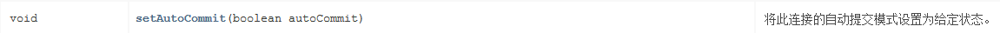

    参与autoCommit 表示是否自动提交事务，true表示自动提交事务，false表示手动提交事务。而开启事务需要将该参数设为为false。

  * 提交事务

    

  * 回滚事务

    

  具体代码实现如下：

  ```sql
  /**
   * JDBC API 详解：Connection
   */
  public class JDBCDemo3_Connection {
  
      public static void main(String[] args) throws Exception {
          //1. 注册驱动
          //Class.forName("com.mysql.jdbc.Driver");
          //2. 获取连接：如果连接的是本机mysql并且端口是默认的 3306 可以简化书写
          String url = "jdbc:mysql:///db1?useSSL=false";
          String username = "root";
          String password = "1234";
          Connection conn = DriverManager.getConnection(url, username, password);
          //3. 定义sql
          String sql1 = "update account set money = 3000 where id = 1";
          String sql2 = "update account set money = 3000 where id = 2";
          //4. 获取执行sql的对象 Statement
          Statement stmt = conn.createStatement();
  
          try {
              // ============开启事务==========
              conn.setAutoCommit(false);
              //5. 执行sql
              int count1 = stmt.executeUpdate(sql1);//受影响的行数
              //6. 处理结果
              System.out.println(count1);
              int i = 3/0;
              //5. 执行sql
              int count2 = stmt.executeUpdate(sql2);//受影响的行数
              //6. 处理结果
              System.out.println(count2);
  
              // ============提交事务==========
              //程序运行到此处，说明没有出现任何问题，则需求提交事务
              conn.commit();
          } catch (Exception e) {
              // ============回滚事务==========
              //程序在出现异常时会执行到这个地方，此时就需要回滚事务
              conn.rollback();
              e.printStackTrace();
          }
  
          //7. 释放资源
          stmt.close();
          conn.close();
      }
  }
  ```


##### Statement

Statement对象的作用就是用来执行SQL语句。而针对不同类型的SQL语句使用的方法也不一样。

###### 执行DDL、DML语句


> 代码实现：执行DML语句：
>
> ```java
> /**
>   * 执行DML语句
>   * @throws Exception
>   */
> @Test
> public void testDML() throws  Exception {
>     //1. 注册驱动
>     //Class.forName("com.mysql.jdbc.Driver");
>     //2. 获取连接：如果连接的是本机mysql并且端口是默认的 3306 可以简化书写
>     String url = "jdbc:mysql:///db1?useSSL=false";
>     String username = "root";
>     String password = "1234";
>     Connection conn = DriverManager.getConnection(url, username, password);
>     //3. 定义sql
>     String sql = "update account set money = 3000 where id = 1";
>     //4. 获取执行sql的对象 Statement
>     Statement stmt = conn.createStatement();
>     //5. 执行sql
>     int count = stmt.executeUpdate(sql);//执行完DML语句，受影响的行数
>     //6. 处理结果
>     //System.out.println(count);
>     if(count > 0){
>         System.out.println("修改成功~");
>     }else{
>         System.out.println("修改失败~");
>     }
>     //7. 释放资源
>     stmt.close();
>     conn.close();
> }
> ```

###### 执行DQL语句


该方法涉及到了 `ResultSet` 对象，而这个对象我们还没有学习，一会再重点讲解。

> 代码实现：执行DDL语句：
>
> ```java
> /**
>   * 执行DDL语句
>   * @throws Exception
>   */
> @Test
> public void testDDL() throws  Exception {
>     //1. 注册驱动
>     //Class.forName("com.mysql.jdbc.Driver");
>     //2. 获取连接：如果连接的是本机mysql并且端口是默认的 3306 可以简化书写
>     String url = "jdbc:mysql:///db1?useSSL=false";
>     String username = "root";
>     String password = "1234";
>     Connection conn = DriverManager.getConnection(url, username, password);
>     //3. 定义sql
>     String sql = "drop database db2";
>     //4. 获取执行sql的对象 Statement
>     Statement stmt = conn.createStatement();
>     //5. 执行sql
>     int count = stmt.executeUpdate(sql);//执行完DDL语句，可能是0
>     //6. 处理结果
>     System.out.println(count);
> 
>     //7. 释放资源
>     stmt.close();
>     conn.close();
> }
> ```
>
> 以后开发很少使用java代码操作DDL语句

##### ResultSet

###### 封装了SQL查询语句

ResultSet（结果集对象）作用：封装了SQL查询语句的结果。

而执行了DQL语句后就会返回该对象，对应执行DQL语句的方法如下：

```sql
ResultSet  executeQuery(sql)：执行DQL 语句，返回 ResultSet 对象
```

那么我们就需要从 `ResultSet` 对象中获取我们想要的数据。`ResultSet` 对象提供了操作查询结果数据的方法，如下：

> boolean  next()
>
> * 将光标从当前位置向前移动一行 
> * 判断当前行是否为有效行
>
> 方法返回值说明：
>
> * true  ： 有效航，当前行有数据
> * false ： 无效行，当前行没有数据

> xxx  getXxx(参数)：获取数据
>
> * xxx : 数据类型；如： int getInt(参数) ；String getString(参数)
> * 参数
>   * int类型的参数：列的编号，从1开始
>   * String类型的参数： 列的名称 

如下图为执行SQL语句后的结果


一开始光标指定于第一行前，如图所示红色箭头指向于表头行。当我们调用了 `next()` 方法后，光标就下移到第一行数据，并且方法返回true，此时就可以通过 `getInt("id")` 获取当前行id字段的值，也可以通过 `getString("name")` 获取当前行name字段的值。如果想获取下一行的数据，继续调用 `next()`  方法，以此类推。

代码实现：

```java
/**
  * 执行DQL
  * @throws Exception
  */
@Test
public void testResultSet() throws  Exception {
    //1. 注册驱动
    //Class.forName("com.mysql.jdbc.Driver");
    //2. 获取连接：如果连接的是本机mysql并且端口是默认的 3306 可以简化书写
    String url = "jdbc:mysql:///db1?useSSL=false";
    String username = "root";
    String password = "1234";
    Connection conn = DriverManager.getConnection(url, username, password);
    //3. 定义sql
    String sql = "select * from account";
    //4. 获取statement对象
    Statement stmt = conn.createStatement();
    //5. 执行sql
    ResultSet rs = stmt.executeQuery(sql);
    //6. 处理结果， 遍历rs中的所有数据
    /* // 6.1 光标向下移动一行，并且判断当前行是否有数据
        while (rs.next()){
            //6.2 获取数据  getXxx()
            int id = rs.getInt(1);
            String name = rs.getString(2);
            double money = rs.getDouble(3);

            System.out.println(id);
            System.out.println(name);
            System.out.println(money);

            System.out.println("--------------");

        }*/
    // 6.1 光标向下移动一行，并且判断当前行是否有数据
    while (rs.next()){
        //6.2 获取数据  getXxx()
        int id = rs.getInt("id");
        String name = rs.getString("name");
        double money = rs.getDouble("money");

        System.out.println(id);
        System.out.println(name);
        System.out.println(money);

        System.out.println("--------------");
    }

    //7. 释放资源
    rs.close();
    stmt.close();
    conn.close();
}
```

###### 案例

* 需求：查询account账户表数据，封装为Account对象中，并且存储到ArrayList集合中

  

* 代码实现

  ```java
  /**
    * 查询account账户表数据，封装为Account对象中，并且存储到ArrayList集合中
    * 1. 定义实体类Account
    * 2. 查询数据，封装到Account对象中
    * 3. 将Account对象存入ArrayList集合中
    */
  @Test
  public void testResultSet2() throws  Exception {
      //1. 注册驱动
      //Class.forName("com.mysql.jdbc.Driver");
      //2. 获取连接：如果连接的是本机mysql并且端口是默认的 3306 可以简化书写
      String url = "jdbc:mysql:///db1?useSSL=false";
      String username = "root";
      String password = "1234";
      Connection conn = DriverManager.getConnection(url, username, password);
  
      //3. 定义sql
      String sql = "select * from account";
  
      //4. 获取statement对象
      Statement stmt = conn.createStatement();
  
      //5. 执行sql
      ResultSet rs = stmt.executeQuery(sql);
  
      // 创建集合
      List<Account> list = new ArrayList<>();
     
      // 6.1 光标向下移动一行，并且判断当前行是否有数据
      while (rs.next()){
          Account account = new Account();
  
          //6.2 获取数据  getXxx()
          int id = rs.getInt("id");
          String name = rs.getString("name");
          double money = rs.getDouble("money");
  
          //赋值
          account.setId(id);
          account.setName(name);
          account.setMoney(money);
  
          // 存入集合
          list.add(account);
      }
  
      System.out.println(list);
  
      //7. 释放资源
      rs.close();
      stmt.close();
      conn.close();
  }
  ```

##### PreparedStatement

PreparedStatement作用：预编译SQL语句并执行：预防SQL注入问题

对上面的作用中SQL注入问题大家肯定不理解。那我们先对SQL注入进行说明.

###### SQL注入介绍

SQL注入是通过操作输入来修改事先定义好的SQL语句，用以达到执行代码对服务器进行攻击的方法。

在今天资料下的 `day03-JDBC\资料\2. sql注入演示` 中修改 `application.properties` 文件中的用户名和密码，文件内容如下：

```properties
spring.datasource.driver-class-name=com.mysql.cj.jdbc.Driver
spring.datasource.url=jdbc:mysql://localhost:3306/test?useSSL=false&useUnicode=true&characterEncoding=UTF-8
spring.datasource.username=root
spring.datasource.password=1234
```

在MySQL中创建名为 `test` 的数据库

```sql
create database test;
```

在命令提示符中运行今天资料下的 `day03-JDBC\资料\2. sql注入演示\sql.jar` 这个jar包。


此时我们就能在数据库中看到user表

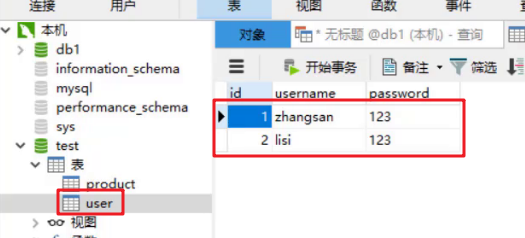

接下来在浏览器的地址栏输入 `localhost:8080/login.html` 就能看到如下页面

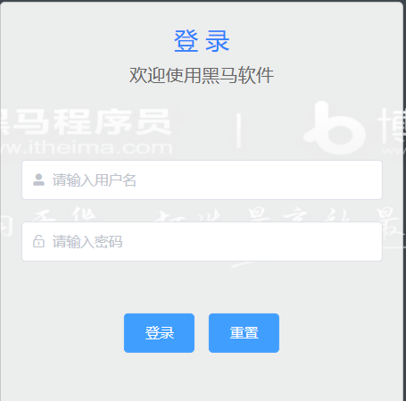

我们就可以在如上图中输入用户名和密码进行登陆。用户名和密码输入正确就登陆成功，跳转到首页。用户名和密码输入错误则给出错误提示，如下图


但是我可以通过输入一些特殊的字符登陆到首页。

用户名随意写，密码写成 `' or '1' ='1`


这就是SQL注入漏洞，也是很危险的。当然现在市面上的系统都不会存在这种问题了，所以大家也不要尝试用这种方式去试其他的系统。

那么该如何解决呢？这里就可以将SQL执行对象 `Statement` 换成 `PreparedStatement` 对象。

###### 代码模拟SQL注入问题

```java
@Test
public void testLogin() throws  Exception {
    //2. 获取连接：如果连接的是本机mysql并且端口是默认的 3306 可以简化书写
    String url = "jdbc:mysql:///db1?useSSL=false";
    String username = "root";
    String password = "1234";
    Connection conn = DriverManager.getConnection(url, username, password);

    // 接收用户输入 用户名和密码
    String name = "sjdljfld";
    String pwd = "' or '1' = '1";
    String sql = "select * from tb_user where username = '"+name+"' and password = '"+pwd+"'";
    // 获取stmt对象
    Statement stmt = conn.createStatement();
    // 执行sql
    ResultSet rs = stmt.executeQuery(sql);
    // 判断登录是否成功
    if(rs.next()){
        System.out.println("登录成功~");
    }else{
        System.out.println("登录失败~");
    }

    //7. 释放资源
    rs.close();
    stmt.close();
    conn.close();
}
```

上面代码是将用户名和密码拼接到sql语句中，拼接后的sql语句如下

```sql
select * from tb_user where username = 'sjdljfld' and password = ''or '1' = '1'
```

从上面语句可以看出条件 `username = 'sjdljfld' and password = ''` 不管是否满足，而 `or` 后面的 `'1' = '1'` 是始终满足的，最终条件是成立的，就可以正常的进行登陆了。

接下来我们来学习PreparedStatement对象.

###### PreparedStatement概述

PreparedStatement作用：预编译SQL语句并执行：预防SQL注入问题

* 获取 PreparedStatement 对象

  ```java
  // SQL语句中的参数值，使用？占位符替代
  String sql = "select * from user where username = ? and password = ?";
  // 通过Connection对象获取，并传入对应的sql语句
  PreparedStatement pstmt = conn.prepareStatement(sql);
  ```

* 设置参数值

  上面的sql语句中参数使用 ? 进行占位，在之前之前肯定要设置这些 ?  的值。

  > PreparedStatement对象：setXxx(参数1，参数2)：给 ? 赋值
  >
  > * Xxx：数据类型 ； 如 setInt (参数1，参数2)
  >
  > * 参数：
  >
  >   * 参数1： ？的位置编号，从1 开始
  >
  >   * 参数2： ？的值

* 执行SQL语句

  > executeUpdate();  执行DDL语句和DML语句
  >
  > executeQuery();  执行DQL语句
  >
  > 注意：调用这两个方法时不需要传递SQL语句，因为获取SQL语句执行对象时已经对SQL语句进行预编译了。

###### 使用PreparedStatement改进

```java
 @Test
public void testPreparedStatement() throws  Exception {
    //2. 获取连接：如果连接的是本机mysql并且端口是默认的 3306 可以简化书写
    String url = "jdbc:mysql:///db1?useSSL=false";
    String username = "root";
    String password = "1234";
    Connection conn = DriverManager.getConnection(url, username, password);

    // 接收用户输入 用户名和密码
    String name = "zhangsan";
    String pwd = "' or '1' = '1";

    // 定义sql
    String sql = "select * from tb_user where username = ? and password = ?";
    // 获取pstmt对象
    PreparedStatement pstmt = conn.prepareStatement(sql);
    // 设置？的值
    pstmt.setString(1,name);
    pstmt.setString(2,pwd);
    // 执行sql
    ResultSet rs = pstmt.executeQuery();
    // 判断登录是否成功
    if(rs.next()){
        System.out.println("登录成功~");
    }else{
        System.out.println("登录失败~");
    }
    //7. 释放资源
    rs.close();
    pstmt.close();
    conn.close();
}
```

执行上面语句就可以发现不会出现SQL注入漏洞问题了。那么PreparedStatement又是如何解决的呢？它是将特殊字符进行了转义，转义的SQL如下：

```sql
select * from tb_user where username = 'sjdljfld' and password = '\'or \'1\' = \'1'
```

###### PreparedStatement原理

PreparedStatement 好处：

- 预编译SQL，性能更高
- 防止SQL注入：将敏感字符进行转义


Java代码操作数据库流程如图所示：

* 将sql语句发送到MySQL服务器端

* MySQL服务端会对sql语句进行如下操作

  * 检查SQL语句：检查SQL语句的语法是否正确。

  * 编译SQL语句。将SQL语句编译成可执行的函数。

    > 检查SQL和编译SQL花费的时间比执行SQL的时间还要长。如果我们只是重新设置参数，那么检查SQL语句和编译SQL语句将不需要重复执行。这样就提高了性能。

  * 执行SQL语句

接下来我们通过查询日志来看一下原理。

* 开启预编译功能

  在代码中编写url时需要加上以下参数。而我们之前根本就没有开启预编译功能，只是解决了SQL注入漏洞。

  ```sql
  useServerPrepStmts=true
  ```

* 配置MySQL执行日志（重启mysql服务后生效）

  在mysql配置文件（my.ini）中添加如下配置

  ```
  log-output=FILE
  general-log=1
  general_log_file="D:\mysql.log"
  slow-query-log=1
  slow_query_log_file="D:\mysql_slow.log"
  long_query_time=2
  ```

* java测试代码如下：

  ```java
   /**
     * PreparedStatement原理
     * @throws Exception
     */
  @Test
  public void testPreparedStatement2() throws  Exception {
  
      //2. 获取连接：如果连接的是本机mysql并且端口是默认的 3306 可以简化书写
      // useServerPrepStmts=true 参数开启预编译功能
      String url = "jdbc:mysql:///db1?useSSL=false&useServerPrepStmts=true";
      String username = "root";
      String password = "1234";
      Connection conn = DriverManager.getConnection(url, username, password);
  
      // 接收用户输入 用户名和密码
      String name = "zhangsan";
      String pwd = "' or '1' = '1";
  
      // 定义sql
      String sql = "select * from tb_user where username = ? and password = ?";
  
      // 获取pstmt对象
      PreparedStatement pstmt = conn.prepareStatement(sql);
  
      Thread.sleep(10000);
      // 设置？的值
      pstmt.setString(1,name);
      pstmt.setString(2,pwd);
      ResultSet rs = null;
      // 执行sql
      rs = pstmt.executeQuery();
  
      // 设置？的值
      pstmt.setString(1,"aaa");
      pstmt.setString(2,"bbb");
      // 执行sql
      rs = pstmt.executeQuery();
  
      // 判断登录是否成功
      if(rs.next()){
          System.out.println("登录成功~");
      }else{
          System.out.println("登录失败~");
      }
  
      //7. 释放资源
      rs.close();
      pstmt.close();
      conn.close();
  }
  ```

* 执行SQL语句，查看 `D:\mysql.log` 日志如下:

  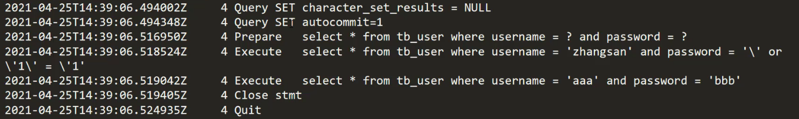

  上图中第三行中的 `Prepare` 是对SQL语句进行预编译。第四行和第五行是执行了两次SQL语句，而第二次执行前并没有对SQL进行预编译。

> 总结：
>
> * 在获取PreparedStatement对象时，将sql语句发送给mysql服务器进行检查，编译（这些步骤很耗时）
> * 执行时就不用再进行这些步骤了，速度更快
> * 如果sql模板一样，则只需要进行一次检查、编译

### 数据库连接池

#### 数据库连接池简介

* 数据库连接池是个容器，负责分配、管理数据库连接(Connection)

* 它允许应用程序重复使用一个现有的数据库连接，而不是再重新建立一个；

* 释放空闲时间超过最大空闲时间的数据库连接来避免因为没有释放数据库连接而引起的数据库连接遗漏
* 好处
  * 资源重用
  * 提升系统响应速度
  * 避免数据库连接遗漏

之前我们代码中使用连接是没有使用都创建一个Connection对象，使用完毕就会将其销毁。这样重复创建销毁的过程是特别耗费计算机的性能的及消耗时间的。而数据库使用了数据库连接池后，就能达到Connection对象的复用，如下图


连接池是在一开始就创建好了一些连接（Connection）对象存储起来。用户需要连接数据库时，不需要自己创建连接，而只需要从连接池中获取一个连接进行使用，使用完毕后再将连接对象归还给连接池；这样就可以起到资源重用，也节省了频繁创建连接销毁连接所花费的时间，从而提升了系统响应的速度。

#### 数据库连接池实现

* 标准接口：DataSource

  官方(SUN) 提供的数据库连接池标准接口，由第三方组织实现此接口。该接口提供了获取连接的功能：

  ```java
  Connection getConnection()
  ```

  那么以后就不需要通过 `DriverManager` 对象获取 `Connection` 对象，而是通过连接池（DataSource）获取 `Connection` 对象。

* 常见的数据库连接池

  * DBCP
  * C3P0
  * Druid

  我们现在使用更多的是Druid，它的性能比其他两个会好一些。

* Druid（德鲁伊）

  * Druid连接池是阿里巴巴开源的数据库连接池项目 

  * 功能强大，性能优秀，是Java语言最好的数据库连接池之一

#### Driud使用

* 导入jar包 druid-1.1.12.jar
* 定义配置文件
* 加载配置文件
* 获取数据库连接池对象
* 获取连接

现在通过代码实现，首先需要先将druid的jar包放到项目下的lib下并添加为库文件


项目结构如下：


编写配置文件如下：

```properties
driverClassName=com.mysql.jdbc.Driver
url=jdbc:mysql:///db1?useSSL=false&useServerPrepStmts=true
username=root
password=1234
# 初始化连接数量
initialSize=5
# 最大连接数
maxActive=10
# 最大等待时间
maxWait=3000
```

使用druid的代码如下：

```java
/**
 * Druid数据库连接池演示
 */
public class DruidDemo {

    public static void main(String[] args) throws Exception {
        //1.导入jar包
        //2.定义配置文件
        //3. 加载配置文件
        Properties prop = new Properties();
        prop.load(new FileInputStream("jdbc-demo/src/druid.properties"));
        //4. 获取连接池对象
        DataSource dataSource = DruidDataSourceFactory.createDataSource(prop);

        //5. 获取数据库连接 Connection
        Connection connection = dataSource.getConnection();
        System.out.println(connection); //获取到了连接后就可以继续做其他操作了

        //System.out.println(System.getProperty("user.dir"));
    }
}
```

### JDBC练习

#### 需求

完成商品品牌数据的增删改查操作

* 查询：查询所有数据
* 添加：添加品牌
* 修改：根据id修改
* 删除：根据id删除

#### 案例实现

##### 环境准备

* 数据库表 `tb_brand`

  ```sql
  -- 删除tb_brand表
  drop table if exists tb_brand;
  -- 创建tb_brand表
  create table tb_brand (
      -- id 主键
      id int primary key auto_increment,
      -- 品牌名称
      brand_name varchar(20),
      -- 企业名称
      company_name varchar(20),
      -- 排序字段
      ordered int,
      -- 描述信息
      description varchar(100),
      -- 状态：0：禁用  1：启用
      status int
  );
  -- 添加数据
  insert into tb_brand (brand_name, company_name, ordered, description, status)
  values ('三只松鼠', '三只松鼠股份有限公司', 5, '好吃不上火', 0),
         ('华为', '华为技术有限公司', 100, '华为致力于把数字世界带入每个人、每个家庭、每个组织，构建万物互联的智能世界', 1),
         ('小米', '小米科技有限公司', 50, 'are you ok', 1);
  ```

* 在pojo包下实体类 Brand

  ```java
  /**
   * 品牌
   * alt + 鼠标左键：整列编辑
   * 在实体类中，基本数据类型建议使用其对应的包装类型
   */
  public class Brand {
      // id 主键
      private Integer id;
      // 品牌名称
      private String brandName;
      // 企业名称
      private String companyName;
      // 排序字段
      private Integer ordered;
      // 描述信息
      private String description;
      // 状态：0：禁用  1：启用
      private Integer status;
  
      public Integer getId() {
          return id;
      }
  
      public void setId(Integer id) {
          this.id = id;
      }
  
      public String getBrandName() {
          return brandName;
      }
  
      public void setBrandName(String brandName) {
          this.brandName = brandName;
      }
  
      public String getCompanyName() {
          return companyName;
      }
  
      public void setCompanyName(String companyName) {
          this.companyName = companyName;
      }
  
      public Integer getOrdered() {
          return ordered;
      }
  
      public void setOrdered(Integer ordered) {
          this.ordered = ordered;
      }
  
      public String getDescription() {
          return description;
      }
  
      public void setDescription(String description) {
          this.description = description;
      }
  
      public Integer getStatus() {
          return status;
      }
  
      public void setStatus(Integer status) {
          this.status = status;
      }
  
      @Override
      public String toString() {
          return "Brand{" +
                  "id=" + id +
                  ", brandName='" + brandName + '\'' +
                  ", companyName='" + companyName + '\'' +
                  ", ordered=" + ordered +
                  ", description='" + description + '\'' +
                  ", status=" + status +
                  '}';
      }
  }
  ```

##### 查询所有

```java
 /**
   * 查询所有
   * 1. SQL：select * from tb_brand;
   * 2. 参数：不需要
   * 3. 结果：List<Brand>
   */

@Test
public void testSelectAll() throws Exception {
    //1. 获取Connection
    //3. 加载配置文件
    Properties prop = new Properties();
    prop.load(new FileInputStream("jdbc-demo/src/druid.properties"));
    //4. 获取连接池对象
    DataSource dataSource = DruidDataSourceFactory.createDataSource(prop);

    //5. 获取数据库连接 Connection
    Connection conn = dataSource.getConnection();
    //2. 定义SQL
    String sql = "select * from tb_brand;";
    //3. 获取pstmt对象
    PreparedStatement pstmt = conn.prepareStatement(sql);
    //4. 设置参数
    //5. 执行SQL
    ResultSet rs = pstmt.executeQuery();
    //6. 处理结果 List<Brand> 封装Brand对象，装载List集合
    Brand brand = null;
    List<Brand> brands = new ArrayList<>();
    while (rs.next()){
        //获取数据
        int id = rs.getInt("id");
        String brandName = rs.getString("brand_name");
        String companyName = rs.getString("company_name");
        int ordered = rs.getInt("ordered");
        String description = rs.getString("description");
        int status = rs.getInt("status");
        //封装Brand对象
        brand = new Brand();
        brand.setId(id);
        brand.setBrandName(brandName);
        brand.setCompanyName(companyName);
        brand.setOrdered(ordered);
        brand.setDescription(description);
        brand.setStatus(status);

        //装载集合
        brands.add(brand);
    }
    System.out.println(brands);
    //7. 释放资源
    rs.close();
    pstmt.close();
    conn.close();
}
```

##### 添加数据

```java
/**
  * 添加
  * 1. SQL：insert into tb_brand(brand_name, company_name, ordered, description, status) values(?,?,?,?,?);
  * 2. 参数：需要，除了id之外的所有参数信息
  * 3. 结果：boolean
  */
@Test
public void testAdd() throws Exception {
    // 接收页面提交的参数
    String brandName = "香飘飘";
    String companyName = "香飘飘";
    int ordered = 1;
    String description = "绕地球一圈";
    int status = 1;

    //1. 获取Connection
    //3. 加载配置文件
    Properties prop = new Properties();
    prop.load(new FileInputStream("jdbc-demo/src/druid.properties"));
    //4. 获取连接池对象
    DataSource dataSource = DruidDataSourceFactory.createDataSource(prop);
    //5. 获取数据库连接 Connection
    Connection conn = dataSource.getConnection();
    //2. 定义SQL
    String sql = "insert into tb_brand(brand_name, company_name, ordered, description, status) values(?,?,?,?,?);";
    //3. 获取pstmt对象
    PreparedStatement pstmt = conn.prepareStatement(sql);
    //4. 设置参数
    pstmt.setString(1,brandName);
    pstmt.setString(2,companyName);
    pstmt.setInt(3,ordered);
    pstmt.setString(4,description);
    pstmt.setInt(5,status);

    //5. 执行SQL
    int count = pstmt.executeUpdate(); // 影响的行数
    //6. 处理结果
    System.out.println(count > 0);

    //7. 释放资源
    pstmt.close();
    conn.close();
}
```

##### 修改数据

```java
/**
  * 修改
  * 1. SQL：

     update tb_brand
         set brand_name  = ?,
         company_name= ?,
         ordered     = ?,
         description = ?,
         status      = ?
     where id = ?

   * 2. 参数：需要，所有数据
   * 3. 结果：boolean
   */

@Test
public void testUpdate() throws Exception {
    // 接收页面提交的参数
    String brandName = "香飘飘";
    String companyName = "香飘飘";
    int ordered = 1000;
    String description = "绕地球三圈";
    int status = 1;
    int id = 4;

    //1. 获取Connection
    //3. 加载配置文件
    Properties prop = new Properties();
    prop.load(new FileInputStream("jdbc-demo/src/druid.properties"));
    //4. 获取连接池对象
    DataSource dataSource = DruidDataSourceFactory.createDataSource(prop);
    //5. 获取数据库连接 Connection
    Connection conn = dataSource.getConnection();
    //2. 定义SQL
    String sql = " update tb_brand\n" +
        "         set brand_name  = ?,\n" +
        "         company_name= ?,\n" +
        "         ordered     = ?,\n" +
        "         description = ?,\n" +
        "         status      = ?\n" +
        "     where id = ?";

    //3. 获取pstmt对象
    PreparedStatement pstmt = conn.prepareStatement(sql);

    //4. 设置参数
    pstmt.setString(1,brandName);
    pstmt.setString(2,companyName);
    pstmt.setInt(3,ordered);
    pstmt.setString(4,description);
    pstmt.setInt(5,status);
    pstmt.setInt(6,id);

    //5. 执行SQL
    int count = pstmt.executeUpdate(); // 影响的行数
    //6. 处理结果
    System.out.println(count > 0);

    //7. 释放资源
    pstmt.close();
    conn.close();
}
```

##### 删除数据

```java
/**
  * 删除
  * 1. SQL：
            delete from tb_brand where id = ?
  * 2. 参数：需要，id
  * 3. 结果：boolean
  */
@Test
public void testDeleteById() throws Exception {
    // 接收页面提交的参数
    int id = 4;
    //1. 获取Connection
    //3. 加载配置文件
    Properties prop = new Properties();
    prop.load(new FileInputStream("jdbc-demo/src/druid.properties"));
    //4. 获取连接池对象
    DataSource dataSource = DruidDataSourceFactory.createDataSource(prop);
    //5. 获取数据库连接 Connection
    Connection conn = dataSource.getConnection();
    //2. 定义SQL
    String sql = " delete from tb_brand where id = ?";
    //3. 获取pstmt对象
    PreparedStatement pstmt = conn.prepareStatement(sql);
    //4. 设置参数
    pstmt.setInt(1,id);
    //5. 执行SQL
    int count = pstmt.executeUpdate(); // 影响的行数
    //6. 处理结果
    System.out.println(count > 0);

    //7. 释放资源
    pstmt.close();
    conn.close();
}
```

## 项目工具

### Maven

#### Maven的作用

Maven是专门用于管理和构建Java项目的工具，它的主要功能有：

* 提供了一套标准化的项目结构

* 提供了一套标准化的构建流程（编译，测试，打包，发布……）

* 提供了一套依赖管理机制

##### 标准化的项目结构

项目结构我们都知道，每一个开发工具（IDE）都有自己不同的项目结构，它们互相之间不通用。我再eclipse中创建的目录，无法在idea中进行使用，这就造成了很大的不方便，如下图:前两个是以后开发经常使用的开发工具


而Maven提供了一套标准化的项目结构，所有的IDE使用Maven构建的项目完全一样，所以IDE创建的Maven项目可以通用。如下图右边就是Maven构建的项目结构。


##### 标准化的构建流程

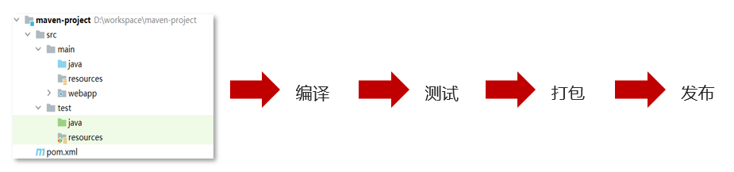

如上图所示我们开发了一套系统，代码需要进行编译、测试、打包、发布，这些操作如果需要反复进行就显得特别麻烦，而Maven提供了一套简单的命令来完成项目构建。

##### 依赖管理

依赖管理其实就是管理你项目所依赖的第三方资源（jar包、插件）。如之前我们项目中需要使用JDBC和Druid的话，就需要去网上下载对应的依赖包（当前之前是老师已经下载好提供给大家了），复制到项目中，还要将jar包加入工作环境这一系列的操作。如下图所示


而Maven使用标准的**坐标**配置来管理各种依赖，只需要简单的配置就可以完成依赖管理。


如上图右边所示就是mysql驱动包的坐标，在项目中只需要写这段配置，其他都不需要我们担心，Maven都帮我们进行操作了。市面上有很多构建工具，而Maven依旧还是主流构建工具，如下图是常用构建工具的使用占比

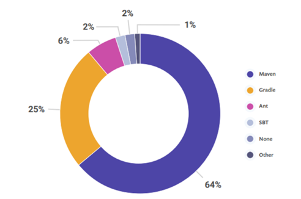

#### Maven简介

> Apache Maven 是一个项目管理和构建工具，它基于项目对象模型(POM)的概念，通过一小段描述信息来管理项目的构建、报告和文档。
>
> 官网 ：http://maven.apache.org/ 

通过上面的描述大家只需要知道Maven是一个工具即可。Apache 是一个开源组织，将来我们会学习很多Apache提供的项目。

##### Maven模型

* 项目对象模型 (Project Object Model)
* 依赖管理模型(Dependency)
* 插件(Plugin)

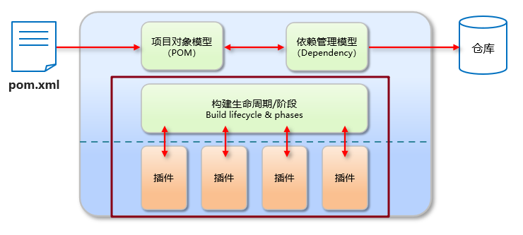

如上图所示就是Maven的模型，而我们先看紫色框框起来的部分，他就是用来完成**标准化构建流程**。如我们需要编译，Maven提供了一个编译插件供我们使用，我们需要打包，Maven就提供了一个打包插件提供我们使用等。

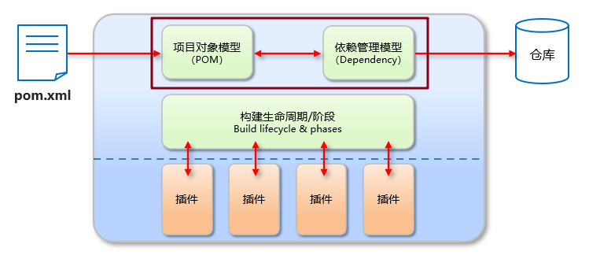

上图中紫色框起来的部分，项目对象模型就是将项目抽象成一个对象模型，有自己专属的坐标，如下图所示是一个Maven项目：


依赖管理模型则是使用坐标来描述当前项目依赖哪儿些第三方jar包，如下图所示


上述Maven模型图中还有一部分是仓库。如何理解仓库呢？

##### 仓库

大家想想这样的场景，我们创建Maven项目，在项目中使用坐标来指定项目的依赖，那么依赖的jar包到底存储在什么地方呢？其实依赖jar包是存储在我们的本地仓库中。而项目运行时从本地仓库中拿需要的依赖jar包。

仓库分类：

* 本地仓库：自己计算机上的一个目录

* 中央仓库：由Maven团队维护的全球唯一的仓库，地址： https://repo1.maven.org/maven2/

* 远程仓库(私服)：一般由公司团队搭建的私有仓库

我们只学习远程仓库的使用，并不会搭建。

当项目中使用坐标引入对应依赖jar包后，首先会查找本地仓库中是否有对应的jar包：

* 如果有，则在项目直接引用;

* 如果没有，则去中央仓库中下载对应的jar包到本地仓库。


如果还可以搭建远程仓库，将来jar包的查找顺序则变为：

> 本地仓库 --> 远程仓库--> 中央仓库

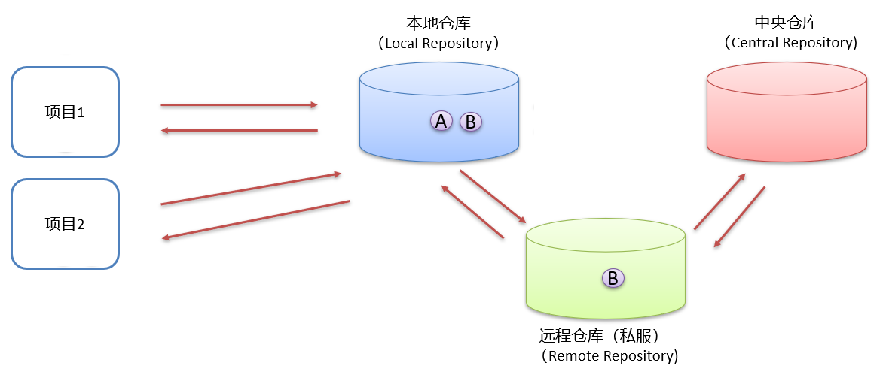

#### Maven安装配置

* 解压 apache-maven-3.6.1.rar 既安装完成

  > 建议解压缩到没有中文、特殊字符的路径下。

  解压缩后的目录结构如下：

  

  * bin目录 ： 存放的是可执行命令。mvn 命令重点关注。
  * conf目录 ：存放Maven的配置文件。`settings.xml` 配置文件后期需要修改。
  * lib目录 ：存放Maven依赖的jar包。Maven也是使用java开发的，所以它也依赖其他的jar包。

* 配置环境变量 MAVEN_HOME 为安装路径的bin目录

  `此电脑` 右键  -->  `高级系统设置`  -->  `高级`  -->  `环境变量`

  在系统变量处新建一个变量 `MAVEN_HOME`

  

  在 `Path` 中进行配置

  

  打开命令提示符进行验证，出现如图所示表示安装成功

  

* 配置本地仓库

  修改 conf/settings.xml 中的 <localRepository> 为一个指定目录作为本地仓库，用来存储jar包。

  

* 配置阿里云私服

  中央仓库在国外，所以下载jar包速度可能比较慢，而阿里公司提供了一个远程仓库，里面基本也都有开源项目的jar包。

  修改 conf/settings.xml 中的 <mirrors>标签，为其添加如下子标签：

  ```xml
  <mirror>  
      <id>alimaven</id>  
      <name>aliyun maven</name>  
      <url>http://maven.aliyun.com/nexus/content/groups/public/</url>
      <mirrorOf>central</mirrorOf>          
  </mirror>
  ```

#### Maven基本使用

##### Maven 常用命令

* compile ：编译

* clean：清理

* test：测试

* package：打包

* install：安装

命令演示：

在资料里提供了一个使用Maven构建的项目，项目结构如下：

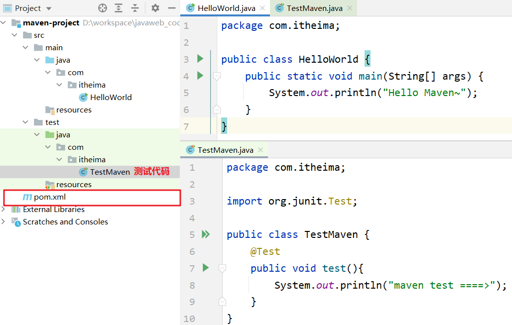

而我们使用上面命令需要在磁盘上进入到项目的 `pom.xml` 目录下，打开命令提示符


编译命令演示：

```java
mvn compile
```

执行上述命令可以看到：

* 从阿里云下载编译需要的插件的jar包，在本地仓库也能看到下载好的插件
* 在项目下会生成一个 `target` 目录

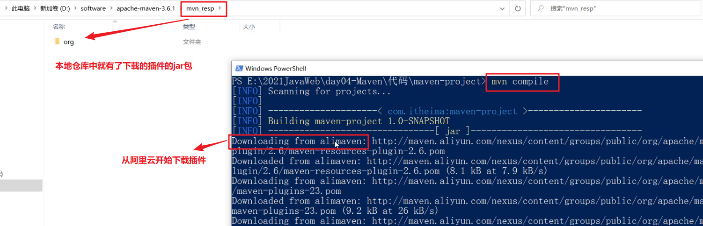

同时在项目下会出现一个 `target` 目录，编译后的字节码文件就放在该目录下


**清理命令演示：**

```
mvn clean
```

执行上述命令可以看到

* 从阿里云下载清理需要的插件jar包
* 删除项目下的 `target` 目录


**打包命令演示：**

```
mvn package
```

执行上述命令可以看到：

* 从阿里云下载打包需要的插件jar包
* 在项目的 `terget` 目录下有一个jar包（将当前项目打成的jar包）

**测试命令演示：**

```
mvn test  
```

该命令会执行所有的测试代码。执行上述命令效果如下


**安装命令演示：**

```
mvn install
```

该命令会将当前项目打成jar包，并安装到本地仓库。执行完上述命令后到本地仓库查看结果如下：


##### Maven 生命周期

Maven 构建项目生命周期描述的是一次构建过程经历经历了多少个事件

Maven 对项目构建的生命周期划分为3套：

* clean ：清理工作。
* default ：核心工作，例如编译，测试，打包，安装等。
* site ： 产生报告，发布站点等。这套声明周期一般不会使用。

同一套生命周期内，执行后边的命令，前面的所有命令会自动执行。例如默认（default）生命周期如下：


当我们执行 `install`（安装）命令时，它会先执行 `compile`命令，再执行 `test ` 命令，再执行 `package` 命令，最后执行 `install` 命令。

当我们执行 `package` （打包）命令时，它会先执行 `compile` 命令，再执行 `test` 命令，最后执行 `package` 命令。

默认的生命周期也有对应的很多命令，其他的一般都不会使用，我们只关注常用的：


#### IDEA使用Maven

以后开发中我们肯定会在高级开发工具中使用Maven管理项目，而我们常用的高级开发工具是IDEA，所以接下来我们会讲解Maven在IDEA中的使用。

##### IDEA配置Maven环境

我们需要先在IDEA中配置Maven环境：

* 选择 IDEA中 File --> Settings

* 搜索 maven 

  

* 设置 IDEA 使用本地安装的 Maven，并修改配置文件路径

  

##### Maven 坐标详解

什么是坐标：

* Maven 中的坐标是资源的唯一标识
* 使用坐标来定义项目或引入项目中需要的依赖

Maven 坐标主要组成：

* groupId：定义当前Maven项目隶属组织名称（通常是域名反写，例如：com.itheima）
* artifactId：定义当前Maven项目名称（通常是模块名称，例如 order-service、goods-service）
* version：定义当前项目版本号

如下图就是使用坐标表示一个项目：

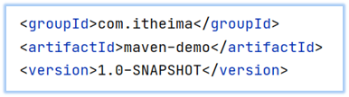

> 注意：
>
> * 上面所说的资源可以是插件、依赖、当前项目。
> * 我们的项目如果被其他的项目依赖时，也是需要坐标来引入的。

##### IDEA 创建 Maven项目

* 创建模块，选择Maven，点击Next

  

* 填写模块名称，坐标信息，点击finish，创建完成

  

  创建好的项目目录结构如下：

  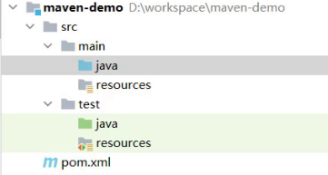

* 编写 HelloWorld，并运行

##### IDEA 导入 Maven项目

大家在学习时可能需要看老师的代码，当然也就需要将老师的代码导入到自己的IDEA中。我们可以通过以下步骤进行项目的导入：

* 选择右侧Maven面板，点击 + 号

  

* 选中对应项目的pom.xml文件，双击即可

  

* 如果没有Maven面板，选择

  View --> Appearance --> Tool Window Bars

  

可以通过下图所示进行命令的操作：


**配置 Maven-Helper 插件** 

* 选择 IDEA中 File --> Settings

* 选择 Plugins

* 搜索 Maven，选择第一个 Maven Helper，点击Install安装，弹出面板中点击Accept

* 重启 IDEA

安装完该插件后可以通过 选中项目右键进行相关命令操作，如下图所示：


#### 依赖管理

##### 使用坐标引入jar包

**使用坐标引入jar包的步骤：**

* 在项目的 pom.xml 中编写 <dependencies> 标签

* 在 <dependencies> 标签中 使用 <dependency> 引入坐标

* 定义坐标的 groupId，artifactId，version

  

* 点击刷新按钮，使坐标生效


>  注意：
>
>  * 具体的坐标我们可以到如下网站进行搜索
>  * https://mvnrepository.com/

**快捷方式导入jar包的坐标：**

每次需要引入jar包，都去对应的网站进行搜索是比较麻烦的，接下来给大家介绍一种快捷引入坐标的方式

* 在 pom.xml 中 按 alt + insert，选择 Dependency

  

* 在弹出的面板中搜索对应坐标，然后双击选中对应坐标

  

* 点击刷新按钮，使坐标生效


**自动导入设置：**

上面每次操作都需要点击刷新按钮，让引入的坐标生效。当然我们也可以通过设置让其自动完成

* 选择 IDEA中 File --> Settings

* 在弹出的面板中找到 Build Tools

  

* 选择 Any changes，点击 ok 即可生效

##### 依赖范围

通过设置坐标的依赖范围(scope)，可以设置 对应jar包的作用范围：编译环境、测试环境、运行环境。

如下图所示给 `junit` 依赖通过 `scope` 标签指定依赖的作用范围。 那么这个依赖就只能作用在测试环境，其他环境下不能使用。


那么 `scope` 都可以有哪些取值呢？

| **依赖范围** | 编译classpath | 测试classpath | 运行classpath | 例子              |
| ------------ | ------------- | ------------- | ------------- | ----------------- |
| **compile**  | Y             | Y             | Y             | logback           |
| **test**     | -             | Y             | -             | Junit             |
| **provided** | Y             | Y             | -             | servlet-api       |
| **runtime**  | -             | Y             | Y             | jdbc驱动          |
| **system**   | Y             | Y             | -             | 存储在本地的jar包 |

* compile ：作用于编译环境、测试环境、运行环境。
* test ： 作用于测试环境。典型的就是Junit坐标，以后使用Junit时，都会将scope指定为该值
* provided ：作用于编译环境、测试环境。我们后面会学习 `servlet-api` ，在使用它时，必须将 `scope` 设置为该值，不然运行时就会报错
* runtime  ： 作用于测试环境、运行环境。jdbc驱动一般将 `scope` 设置为该值，当然不设置也没有任何问题 

> 注意：如果引入坐标不指定 `scope` 标签时，默认就是 compile  值。以后大部分jar包都是使用默认值。

### Mybatis

#### Mybatis概述

##### Mybatis概念

> * MyBatis 是一款优秀的持久层框架，用于简化 JDBC 开发
>
> * MyBatis 本是 Apache 的一个开源项目iBatis, 2010年这个项目由apache software foundation 迁移到了google code，并且改名为MyBatis 。2013年11月迁移到Github
>
> * 官网：https://mybatis.org/mybatis-3/zh/index.html 

持久层：

* 负责将数据到保存到数据库的那一层代码。以后开发我们会将操作数据库的Java代码作为持久层。而Mybatis就是对jdbc代码进行了封装。

* JavaEE三层架构：表现层、业务层、持久层。三层架构在后期会给大家进行讲解，今天先简单的了解下即可。


框架：

* 框架就是一个半成品软件，是一套可重用的、通用的、软件基础代码模型。
* 在框架的基础之上构建软件编写更加高效、规范、通用、可扩展

举例给大家简单的解释一下什么是半成品软件。大家小时候应该在公园见过给石膏娃娃涂鸦


如下图所示有一个石膏娃娃，这个就是一个半成品。你可以在这个半成品的基础上进行不同颜色的涂鸦


了解了什么是Mybatis后，接下来说说以前 `JDBC代码` 的缺点以及Mybatis又是如何解决的。

##### JDBC 缺点

下面是 JDBC 代码，我们通过该代码分析都存在什么缺点：


* 硬编码

  * 注册驱动、获取连接：上图标1的代码有很多字符串，而这些是连接数据库的四个基本信息，以后如果要将Mysql数据库换成其他的关系型数据库的话，这四个地方都需要修改，如果放在此处就意味着要修改我们的源代码。

  * SQL语句：上图标2的代码。如果表结构发生变化，SQL语句就要进行更改。这也不方便后期的维护。

* 操作繁琐

  * 手动设置参数

  * 手动封装结果集：上图标4的代码是对查询到的数据进行封装，而这部分代码是没有什么技术含量，而且特别耗费时间的。


##### Mybatis 优化

* 硬编码可以配置到配置文件
* 操作繁琐的地方mybatis都自动完成

如图所示


下图是持久层框架的使用占比。


#### Mybatis快速入门

需求：查询user表中所有的数据

* 创建user表，添加数据

  ```sql
  create database mybatis;
  use mybatis;
  
  drop table if exists tb_user;
  
  create table tb_user(
  	id int primary key auto_increment,
  	username varchar(20),
  	password varchar(20),
  	gender char(1),
  	addr varchar(30)
  );
  
  INSERT INTO tb_user VALUES (1, 'zhangsan', '123', '男', '北京');
  INSERT INTO tb_user VALUES (2, '李四', '234', '女', '天津');
  INSERT INTO tb_user VALUES (3, '王五', '11', '男', '西安');
  ```

* 创建模块，导入坐标

  在创建好的模块中的 pom.xml 配置文件中添加依赖的坐标

  ```xml
  <dependencies>
      <!--mybatis 依赖-->
      <dependency>
          <groupId>org.mybatis</groupId>
          <artifactId>mybatis</artifactId>
          <version>3.5.5</version>
      </dependency>
  
      <!--mysql 驱动-->
      <dependency>
          <groupId>mysql</groupId>
          <artifactId>mysql-connector-java</artifactId>
          <version>5.1.46</version>
      </dependency>
  
      <!--junit 单元测试-->
      <dependency>
          <groupId>junit</groupId>
          <artifactId>junit</artifactId>
          <version>4.13</version>
          <scope>test</scope>
      </dependency>
  
      <!-- 添加slf4j日志api -->
      <dependency>
          <groupId>org.slf4j</groupId>
          <artifactId>slf4j-api</artifactId>
          <version>1.7.20</version>
      </dependency>
      <!-- 添加logback-classic依赖 -->
      <dependency>
          <groupId>ch.qos.logback</groupId>
          <artifactId>logback-classic</artifactId>
          <version>1.2.3</version>
      </dependency>
      <!-- 添加logback-core依赖 -->
      <dependency>
          <groupId>ch.qos.logback</groupId>
          <artifactId>logback-core</artifactId>
          <version>1.2.3</version>
      </dependency>
  </dependencies>
  ```

  注意：需要在项目的 resources 目录下创建logback的配置文件

* 编写 MyBatis 核心配置文件 -- > 替换连接信息 解决硬编码问题

  在模块下的 resources 目录下创建mybatis的配置文件 `mybatis-config.xml`，内容如下：

  ```xml
  <?xml version="1.0" encoding="UTF-8" ?>
  <!DOCTYPE configuration
          PUBLIC "-//mybatis.org//DTD Config 3.0//EN"
          "http://mybatis.org/dtd/mybatis-3-config.dtd">
  <configuration>
  
      <typeAliases>
          <package name="com.itheima.pojo"/>
      </typeAliases>
      
      <!--
      environments：配置数据库连接环境信息。可以配置多个environment，通过default属性切换不同的environment
      -->
      <environments default="development">
          <environment id="development">
              <transactionManager type="JDBC"/>
              <dataSource type="POOLED">
                  <!--数据库连接信息-->
                  <property name="driver" value="com.mysql.jdbc.Driver"/>
                  <property name="url" value="jdbc:mysql:///mybatis?useSSL=false"/>
                  <property name="username" value="root"/>
                  <property name="password" value="1234"/>
              </dataSource>
          </environment>
  
          <environment id="test">
              <transactionManager type="JDBC"/>
              <dataSource type="POOLED">
                  <!--数据库连接信息-->
                  <property name="driver" value="com.mysql.jdbc.Driver"/>
                  <property name="url" value="jdbc:mysql:///mybatis?useSSL=false"/>
                  <property name="username" value="root"/>
                  <property name="password" value="1234"/>
              </dataSource>
          </environment>
      </environments>
      <mappers>
         <!--加载sql映射文件-->
         <mapper resource="UserMapper.xml"/>
      </mappers>
  </configuration>
  ```

* 编写 SQL 映射文件 --> 统一管理sql语句，解决硬编码问题

  在模块的 `resources` 目录下创建映射配置文件 `UserMapper.xml`，内容如下：

  ```xml
  <?xml version="1.0" encoding="UTF-8" ?>
  <!DOCTYPE mapper PUBLIC "-//mybatis.org//DTD Mapper 3.0//EN" "http://mybatis.org/dtd/mybatis-3-mapper.dtd">
  <mapper namespace="test">
      <select id="selectAll" resultType="com.itheima.pojo.User">
          select * from tb_user;
      </select>
  </mapper>
  ```

* 编码

  * 在 `com.itheima.pojo` 包下创建 User类

    ```java
    public class User {
        private int id;
        private String username;
        private String password;
        private String gender;
        private String addr;
        
        //省略了 setter 和 getter
    }
    ```

  * 在 `com.itheima` 包下编写 MybatisDemo 测试类

    ```java
    public class MyBatisDemo {
    
        public static void main(String[] args) throws IOException {
            //1. 加载mybatis的核心配置文件，获取 SqlSessionFactory
            String resource = "mybatis-config.xml";
            InputStream inputStream = Resources.getResourceAsStream(resource);
            SqlSessionFactory sqlSessionFactory = new SqlSessionFactoryBuilder().build(inputStream);
    
            //2. 获取SqlSession对象，用它来执行sql
            SqlSession sqlSession = sqlSessionFactory.openSession();
            //3. 执行sql
            List<User> users = sqlSession.selectList("test.selectAll"); //参数是一个字符串，该字符串必须是映射配置文件的namespace.id
            System.out.println(users);
            //4. 释放资源
            sqlSession.close();
        }
    }
    ```

**解决SQL映射文件的警告提示：**

在入门案例映射配置文件中存在报红的情况。问题如下：


* 产生的原因：Idea和数据库没有建立连接，不识别表信息。但是大家一定要记住，它并不影响程序的执行。
* 解决方式：在Idea中配置MySQL数据库连接。

IDEA中配置MySQL数据库连接

* 点击IDEA右边框的 `Database` ，在展开的界面点击 `+` 选择 `Data Source` ，再选择 `MySQL`

  

* 在弹出的界面进行基本信息的填写

  

* 点击完成后就能看到如下界面

  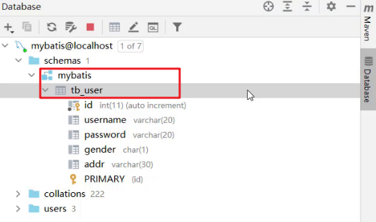

  而此界面就和 `navicat` 工具一样可以进行数据库的操作。也可以编写SQL语句


#### Mapper代理开发

##### Mapper代理开发概述

之前我们写的代码是基本使用方式，它也存在硬编码的问题，如下：


这里调用 `selectList()` 方法传递的参数是映射配置文件中的 namespace.id值。这样写也不便于后期的维护。如果使用 Mapper 代理方式（如下图）则不存在硬编码问题。


通过上面的描述可以看出 Mapper 代理方式的目的：

* 解决原生方式中的硬编码
* 简化后期执行SQL

Mybatis 官网也是推荐使用 Mapper 代理的方式。下图是截止官网的图片

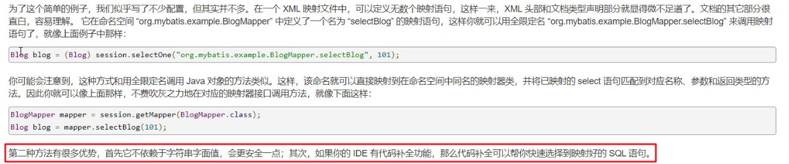

##### 使用Mapper代理要求

使用Mapper代理方式，必须满足以下要求：

* 定义与SQL映射文件同名的Mapper接口，并且将Mapper接口和SQL映射文件放置在同一目录下。如下图：

  

* 设置SQL映射文件的namespace属性为Mapper接口全限定名

  

* 在 Mapper 接口中定义方法，方法名就是SQL映射文件中sql语句的id，并保持参数类型和返回值类型一致

  

##### 案例代码实现

* 在 `com.itheima.mapper` 包下创建 UserMapper接口，代码如下：

  ```java
  public interface UserMapper {
      List<User> selectAll();
      User selectById(int id);
  }
  ```

* 在 `resources` 下创建 `com/itheima/mapper` 目录，并在该目录下创建 UserMapper.xml 映射配置文件

  ```xml
  <!--
      namespace:名称空间。必须是对应接口的全限定名
  -->
  <mapper namespace="com.itheima.mapper.UserMapper">
      <select id="selectAll" resultType="com.itheima.pojo.User">
          select *
          from tb_user;
      </select>
  </mapper>
  ```

* 在 `com.itheima` 包下创建 MybatisDemo2 测试类，代码如下：

  ```java
  /**
   * Mybatis 代理开发
   */
  public class MyBatisDemo2 {
  
      public static void main(String[] args) throws IOException {
  
          //1. 加载mybatis的核心配置文件，获取 SqlSessionFactory
          String resource = "mybatis-config.xml";
          InputStream inputStream = Resources.getResourceAsStream(resource);
          SqlSessionFactory sqlSessionFactory = new SqlSessionFactoryBuilder().build(inputStream);
  
          //2. 获取SqlSession对象，用它来执行sql
          SqlSession sqlSession = sqlSessionFactory.openSession();
          //3. 执行sql
          //3.1 获取UserMapper接口的代理对象
          UserMapper userMapper = sqlSession.getMapper(UserMapper.class);
          List<User> users = userMapper.selectAll();
  
          System.out.println(users);
          //4. 释放资源
          sqlSession.close();
      }
  }
  ```

注意：

如果Mapper接口名称和SQL映射文件名称相同，并在同一目录下，则可以使用包扫描的方式简化SQL映射文件的加载。也就是将核心配置文件的加载映射配置文件的配置修改为

```xml
<mappers>
    <!--加载sql映射文件-->
    <!-- <mapper resource="com/itheima/mapper/UserMapper.xml"/>-->
    <!--Mapper代理方式-->
    <package name="com.itheima.mapper"/>
</mappers>
```

#### 核心配置文件

核心配置文件中现有的配置之前已经给大家进行了解释，而核心配置文件中还可以配置很多内容。我们可以通过查询官网看可以配置的内容

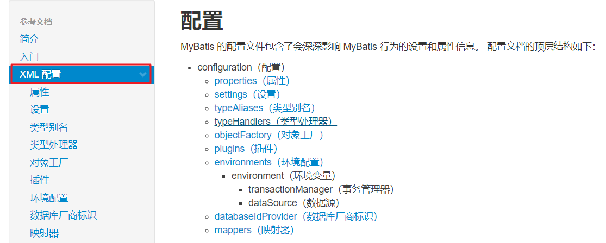

接下来我们先对里面的一些配置进行讲解。

##### 多环境配置

在核心配置文件的 `environments` 标签中其实是可以配置多个 `environment` ，使用 `id` 给每段环境起名，在 `environments` 中使用 `default='环境id'` 来指定使用哪儿段配置。我们一般就配置一个 `environment` 即可。

```xml
<environments default="development">
    <environment id="development">
        <transactionManager type="JDBC"/>
        <dataSource type="POOLED">
            <!--数据库连接信息-->
            <property name="driver" value="com.mysql.jdbc.Driver"/>
            <property name="url" value="jdbc:mysql:///mybatis?useSSL=false"/>
            <property name="username" value="root"/>
            <property name="password" value="1234"/>
        </dataSource>
    </environment>

    <environment id="test">
        <transactionManager type="JDBC"/>
        <dataSource type="POOLED">
            <!--数据库连接信息-->
            <property name="driver" value="com.mysql.jdbc.Driver"/>
            <property name="url" value="jdbc:mysql:///mybatis?useSSL=false"/>
            <property name="username" value="root"/>
            <property name="password" value="1234"/>
        </dataSource>
    </environment>
</environments>=
```

##### 类型别名

在映射配置文件中的 `resultType` 属性需要配置数据封装的类型（类的全限定名）。而每次这样写是特别麻烦的，Mybatis 提供了 `类型别名`(typeAliases) 可以简化这部分的书写。

首先需要现在核心配置文件中配置类型别名，也就意味着给pojo包下所有的类起了别名（别名就是类名），不区分大小写。内容如下：

```xml
<typeAliases>
    <!--name属性的值是实体类所在包-->
    <package name="com.itheima.pojo"/> 
</typeAliases>
```

通过上述的配置，我们就可以简化映射配置文件中 `resultType` 属性值的编写

```xml
<mapper namespace="com.itheima.mapper.UserMapper">
    <select id="selectAll" resultType="user">
        select * from tb_user;
    </select>
</mapper>
```

#### Mybatis练习

**目标**

> * 能够使用映射配置文件实现CRUD操作
> * 能够使用注解实现CRUD操作

##### 配置文件实现CRUD


如上图所示产品原型，里面包含了品牌数据的 `查询` 、`按条件查询`、`添加`、`删除`、`批量删除`、`修改` 等功能，而这些功能其实就是对数据库表中的数据进行CRUD操作。接下来我们就使用Mybatis完成品牌数据的增删改查操作。以下是我们要完成功能列表：

> * 查询
>   * 查询所有数据
>   * 查询详情
>   * 条件查询
> * 添加
> * 修改
>   * 修改全部字段
>   * 修改动态字段
> * 删除
>   * 删除一个
>   * 批量删除

我们先将必要的环境准备一下。

##### 环境准备

* 数据库表（tb_brand）及数据准备

  ```sql
  -- 删除tb_brand表
  drop table if exists tb_brand;
  -- 创建tb_brand表
  create table tb_brand
  (
      -- id 主键
      id           int primary key auto_increment,
      -- 品牌名称
      brand_name   varchar(20),
      -- 企业名称
      company_name varchar(20),
      -- 排序字段
      ordered      int,
      -- 描述信息
      description  varchar(100),
      -- 状态：0：禁用  1：启用
      status       int
  );
  -- 添加数据
  insert into tb_brand (brand_name, company_name, ordered, description, status)
  values ('三只松鼠', '三只松鼠股份有限公司', 5, '好吃不上火', 0),
         ('华为', '华为技术有限公司', 100, '华为致力于把数字世界带入每个人、每个家庭、每个组织，构建万物互联的智能世界', 1),
         ('小米', '小米科技有限公司', 50, 'are you ok', 1);
  ```

* 实体类 Brand

  在 `com.itheima.pojo` 包下创建 Brand 实体类。

  ```java
  public class Brand {
      // id 主键
      private Integer id;
      // 品牌名称
      private String brandName;
      // 企业名称
      private String companyName;
      // 排序字段
      private Integer ordered;
      // 描述信息
      private String description;
      // 状态：0：禁用  1：启用
      private Integer status;
      
      //省略 setter and getter。自己写时要补全这部分代码
  }
  ```

* 编写测试用例

  测试代码需要在 `test/java` 目录下创建包及测试用例。项目结构如下：

  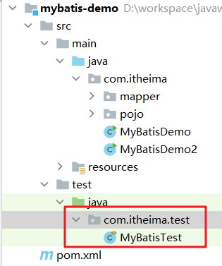

* 安装 MyBatisX 插件

  * MybatisX 是一款基于 IDEA 的快速开发插件，为效率而生。

  * 主要功能

    * XML映射配置文件 和 接口方法 间相互跳转
    * 根据接口方法生成 statement 

  * 安装方式

    点击 `file` ，选择 `settings` ，就能看到如下图所示界面

    

    > 注意：安装完毕后需要重启IDEA

  * 插件效果

    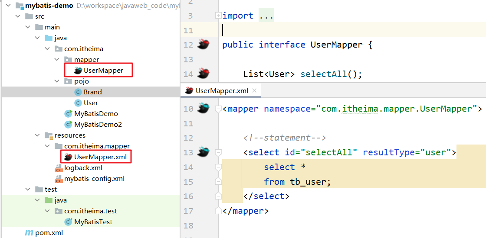

    红色头绳的表示映射配置文件，蓝色头绳的表示mapper接口。在mapper接口点击红色头绳的小鸟图标会自动跳转到对应的映射配置文件，在映射配置文件中点击蓝色头绳的小鸟图标会自动跳转到对应的mapper接口。也可以在mapper接口中定义方法，自动生成映射配置文件中的 `statement` ，如图所示

    

##### 查询所有数据

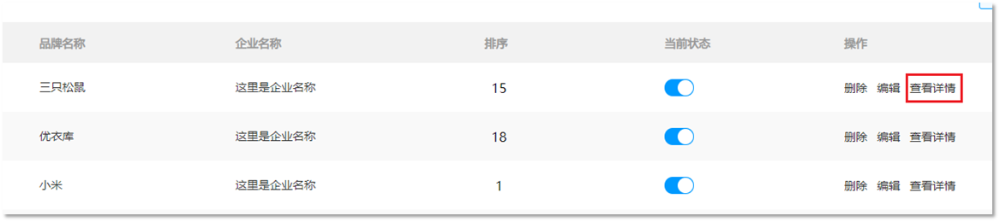

如上图所示就页面上展示的数据，而这些数据需要从数据库进行查询。接下来我们就来讲查询所有数据功能，而实现该功能我们分以下步骤进行实现：

* 编写接口方法：Mapper接口

  * 参数：无

    查询所有数据功能是不需要根据任何条件进行查询的，所以此方法不需要参数。

    ```java
    List<Brand> selectAll();
    ```

  * 结果：List<Brand>

    我们会将查询出来的每一条数据封装成一个 `Brand` 对象，而多条数据封装多个 `Brand` 对象，需要将这些对象封装到List集合中返回。

    ```java
    <select id="selectAll" resultType="brand"> 
        select *from tb_brand; 
    </select>
    ```

  * 执行方法、测试

###### 编写接口方法

在 `com.itheima.mapper` 包写创建名为 `BrandMapper` 的接口。并在该接口中定义 `List<Brand> selectAll()` 方法。

```java
public interface BrandMapper {

    /**
     * 查询所有
     */
    List<Brand> selectAll();
}
```

###### 编写SQL语句

在 `reources` 下创建 `com/itheima/mapper` 目录结构，并在该目录下创建名为 `BrandMapper.xml` 的映射配置文件

```xml
<?xml version="1.0" encoding="UTF-8" ?>
<!DOCTYPE mapper
        PUBLIC "-//mybatis.org//DTD Mapper 3.0//EN"
        "http://mybatis.org/dtd/mybatis-3-mapper.dtd">

<mapper namespace="com.itheima.mapper.BrandMapper">
    <select id="selectAll" resultType="brand">
        select *
        from tb_brand;
    </select>
</mapper>
```

###### 编写测试方法

在 `MybatisTest` 类中编写测试查询所有的方法

```java
@Test
public void testSelectAll() throws IOException {
    //1. 获取SqlSessionFactory
    String resource = "mybatis-config.xml";
    InputStream inputStream = Resources.getResourceAsStream(resource);
    SqlSessionFactory sqlSessionFactory = new SqlSessionFactoryBuilder().build(inputStream);

    //2. 获取SqlSession对象
    SqlSession sqlSession = sqlSessionFactory.openSession();

    //3. 获取Mapper接口的代理对象
    BrandMapper brandMapper = sqlSession.getMapper(BrandMapper.class);

    //4. 执行方法
    List<Brand> brands = brandMapper.selectAll();
    System.out.println(brands);

    //5. 释放资源
    sqlSession.close();

}
```

> 注意：现在我们感觉测试这部分代码写起来特别麻烦，我们可以先忍忍。以后我们只会写上面的第3步的代码，其他的都不需要我们来完成。

执行测试方法结果如下：

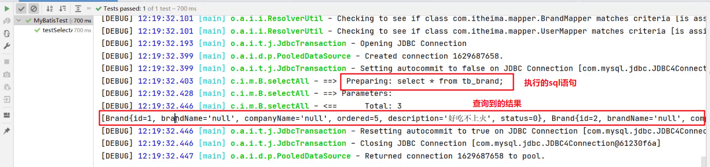

从上面结果我们看到了问题，有些数据封装成功了，而有些数据并没有封装成功。为什么这样呢？

这个问题可以通过两种方式进行解决：

* 给字段起别名
* 使用resultMap定义字段和属性的映射关系

###### 起别名解决上述问题

从上面结果可以看到 `brandName` 和 `companyName` 这两个属性的数据没有封装成功，查询 实体类 和 表中的字段 发现，在实体类中属性名是 `brandName` 和 `companyName` ，而表中的字段名为 `brand_name` 和 `company_name`，如下图所示 。那么我们只需要保持这两部分的名称一致这个问题就迎刃而解。


我们可以在写sql语句时给这两个字段起别名，将别名定义成和属性名一致即可。

```xml
<select id="selectAll" resultType="brand">
    select
    id, brand_name as brandName, company_name as companyName, ordered, description, status
    from tb_brand;
</select>
```

而上面的SQL语句中的字段列表书写麻烦，如果表中还有更多的字段，同时其他的功能也需要查询这些字段时就显得我们的代码不够精炼。Mybatis提供了`sql` 片段可以提高sql的复用性。

SQL片段：

* 将需要复用的SQL片段抽取到 `sql` 标签中

  ```xml
  <sql id="brand_column">
  	id, brand_name as brandName, company_name as companyName, ordered, description, status
  </sql>
  ```

  id属性值是唯一标识，引用时也是通过该值进行引用。

* 在原sql语句中进行引用

  使用 `include` 标签引用上述的 SQL 片段，而 `refid` 指定上述 SQL 片段的id值。

  ```xml
  <select id="selectAll" resultType="brand">
      select
      <include refid="brand_column" />
      from tb_brand;
  </select>
  ```

###### 使用resultMap解决上述问题

起别名 + sql片段的方式可以解决上述问题，但是它也存在问题。如果还有功能只需要查询部分字段，而不是查询所有字段，那么我们就需要再定义一个 SQL 片段，这就显得不是那么灵活。

那么我们也可以使用resultMap来定义字段和属性的映射关系的方式解决上述问题。

* 在映射配置文件中使用resultMap定义 字段 和 属性 的映射关系

  ```xml
  <resultMap id="brandResultMap" type="brand">
      <!--
              id：完成主键字段的映射
                  column：表的列名
                  property：实体类的属性名
              result：完成一般字段的映射
                  column：表的列名
                  property：实体类的属性名
          -->
      <result column="brand_name" property="brandName"/>
      <result column="company_name" property="companyName"/>
  </resultMap>
  ```

  > 注意：在上面只需要定义 字段名 和 属性名 不一样的映射，而一样的则不需要专门定义出来。

* SQL语句正常编写

  ```xml
  <select id="selectAll" resultMap="brandResultMap">
      select *
      from tb_brand;
  </select>
  ```

###### 小结

实体类属性名 和 数据库表列名 不一致，不能自动封装数据

* 起别名：在SQL语句中，对不一样的列名起别名，别名和实体类属性名一样
  * 可以定义 <sql>片段，提升复用性 
* resultMap：定义<resultMap> 完成不一致的属性名和列名的映射

而我们最终选择使用 resultMap的方式。查询映射配置文件中查询所有的 statement 书写如下：

```xml
 <resultMap id="brandResultMap" type="brand">
     <!--
            id：完成主键字段的映射
                column：表的列名
                property：实体类的属性名
            result：完成一般字段的映射
                column：表的列名
                property：实体类的属性名
        -->
     <result column="brand_name" property="brandName"/>
     <result column="company_name" property="companyName"/>
</resultMap>


<select id="selectAll" resultMap="brandResultMap">
    select *
    from tb_brand;
</select>
```

##### 查询详情


有些数据的属性比较多，在页面表格中无法全部实现，而只会显示部分，而其他属性数据的查询可以通过 `查看详情` 来进行查询，如上图所示。

查看详情功能实现步骤：

* 编写接口方法：Mapper接口

  ```java
  Brand selectByld(int id);
  ```

  * 参数：id

    查看详情就是查询某一行数据，所以需要根据id进行查询。而id以后是由页面传递过来。

  * 结果：Brand

    根据id查询出来的数据只要一条，而将一条数据封装成一个Brand对象即可

* 编写SQL语句：SQL映射文件

  ```java
  <select id="selectByld" parameterType="int" resultType="brand"> 
      select *from tb_brand where id = #{id}; 
  </select>
  ```

* 执行方法、进行测试

###### 编写接口方法

在 `BrandMapper` 接口中定义根据id查询数据的方法 

```java
/**
  * 查看详情：根据Id查询
  */
Brand selectById(int id);
```

###### 编写SQL语句

在 `BrandMapper.xml` 映射配置文件中编写 `statement`，使用 `resultMap` 而不是使用 `resultType`

```xml
<select id="selectById"  resultMap="brandResultMap">
    select *
    from tb_brand where id = #{id};
</select>
```

> 注意：上述SQL中的 #{id}先这样写，一会我们再详细讲解

###### 编写测试方法

在 `test/java` 下的 `com.itheima.mapper`  包下的 `MybatisTest类中` 定义测试方法

```java
 @Test
public void testSelectById() throws IOException {
    //接收参数，该id以后需要传递过来
    int id = 1;

    //1. 获取SqlSessionFactory
    String resource = "mybatis-config.xml";
    InputStream inputStream = Resources.getResourceAsStream(resource);
    SqlSessionFactory sqlSessionFactory = new SqlSessionFactoryBuilder().build(inputStream);

    //2. 获取SqlSession对象
    SqlSession sqlSession = sqlSessionFactory.openSession();

    //3. 获取Mapper接口的代理对象
    BrandMapper brandMapper = sqlSession.getMapper(BrandMapper.class);

    //4. 执行方法
    Brand brand = brandMapper.selectById(id);
    System.out.println(brand);

    //5. 释放资源
    sqlSession.close();
}
```

执行测试方法结果如下：

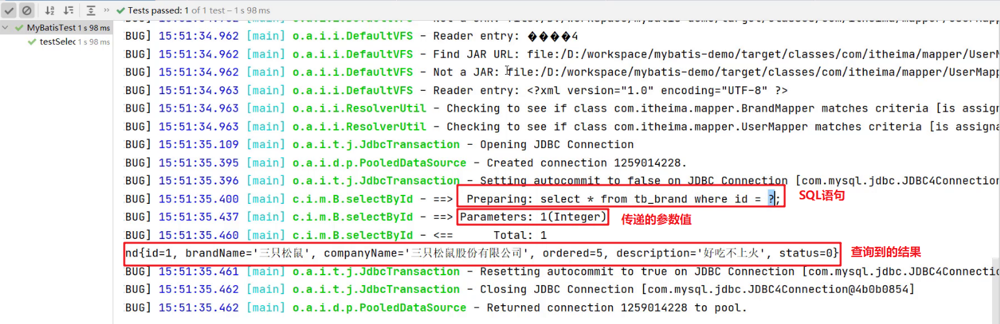

###### 参数占位符

查询到的结果很好理解就是id为1的这行数据。而这里我们需要看控制台显示的SQL语句，能看到使用？进行占位。说明我们在映射配置文件中的写的 `#{id}` 最终会被？进行占位。接下来我们就聊聊映射配置文件中的参数占位符。

mybatis提供了两种参数占位符：

* #{} ：执行SQL时，会将 #{} 占位符替换为？，将来自动设置参数值。从上述例子可以看出使用#{} 底层使用的是 `PreparedStatement`

* \${} ：拼接SQL。底层使用的是 `Statement`，会存在SQL注入问题。如下图将 映射配置文件中的 #{} 替换成 ${} 来看效果

  ```xml
  <select id="selectById"  resultMap="brandResultMap">
      select *
      from tb_brand where id = ${id};
  </select>
  ```

  重新运行查看结果如下：

  

> 注意：从上面两个例子可以看出，以后开发我们使用 #{} 参数占位符。

###### parameterType使用

对于有参数的mapper接口方法，我们在映射配置文件中应该配置 `ParameterType` 来指定参数类型。只不过该属性都可以省略。如下图：

```xml
<select id="selectById" parameterType="int" resultMap="brandResultMap">
    select *
    from tb_brand where id = ${id};
</select>
```

###### SQL语句中特殊字段处理

以后肯定会在SQL语句中写一下特殊字符，比如某一个字段大于某个值，如下图


可以看出报错了，因为映射配置文件是xml类型的问题，而 > < 等这些字符在xml中有特殊含义，所以此时我们需要将这些符号进行转义，可以使用以下两种方式进行转义

* 转义字符

  下图的 `&lt;` 就是 `<` 的转义字符。

  

* <![CDATA[内容]]>

  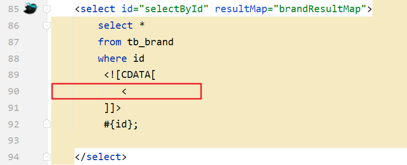

##### 多条件查询


我们经常会遇到如上图所示的多条件查询，将多条件查询的结果展示在下方的数据列表中。而我们做这个功能需要分析最终的SQL语句应该是什么样，思考两个问题

* 条件表达式
* 如何连接

条件字段 `企业名称`  和 `品牌名称` 需要进行模糊查询，所以条件应该是：


简单的分析后，我们来看功能实现的步骤：

* 编写接口方法
  * 参数：所有查询条件
  * 结果：List<Brand>
* 在映射配置文件中编写SQL语句

* 编写测试方法并执行

###### 编写接口方法

在 `BrandMapper` 接口中定义多条件查询的方法。

而该功能有三个参数，我们就需要考虑定义接口时，参数应该如何定义。Mybatis针对多参数有多种实现

* 使用 `@Param("参数名称")` 标记每一个参数，在映射配置文件中就需要使用 `#{参数名称}` 进行占位

  ```java
  List<Brand> selectByCondition(@Param("status") int status, @Param("companyName") String companyName,@Param("brandName") String brandName);
  ```

* 将多个参数封装成一个 实体对象 ，将该实体对象作为接口的方法参数。该方式要求在映射配置文件的SQL中使用 `#{内容}` 时，里面的内容必须和实体类属性名保持一致。

  ```java
  List<Brand> selectByCondition(Brand brand);
  ```

* 将多个参数封装到map集合中，将map集合作为接口的方法参数。该方式要求在映射配置文件的SQL中使用 `#{内容}` 时，里面的内容必须和map集合中键的名称一致。

  ```
  List<Brand> selectByCondition(Map map);
  ```

###### 编写SQL语句

在 `BrandMapper.xml` 映射配置文件中编写 `statement`，使用 `resultMap` 而不是使用 `resultType`

```xml
<select id="selectByCondition" resultMap="brandResultMap">
    select *
    from tb_brand
    where status = #{status}
    and company_name like #{companyName}
    and brand_name like #{brandName}
</select>
```

###### 编写测试方法

在 `test/java` 下的 `com.itheima.mapper`  包下的 `MybatisTest类中` 定义测试方法

```java
@Test
public void testSelectByCondition() throws IOException {
    //接收参数
    int status = 1;
    String companyName = "华为";
    String brandName = "华为";

    // 处理参数
    companyName = "%" + companyName + "%";
    brandName = "%" + brandName + "%";

    //1. 获取SqlSessionFactory
    String resource = "mybatis-config.xml";
    InputStream inputStream = Resources.getResourceAsStream(resource);
    SqlSessionFactory sqlSessionFactory = new SqlSessionFactoryBuilder().build(inputStream);
    //2. 获取SqlSession对象
    SqlSession sqlSession = sqlSessionFactory.openSession();
    //3. 获取Mapper接口的代理对象
    BrandMapper brandMapper = sqlSession.getMapper(BrandMapper.class);

    //4. 执行方法
	//方式一 ：接口方法参数使用 @Param 方式调用的方法
    //List<Brand> brands = brandMapper.selectByCondition(status, companyName, brandName);
    //方式二 ：接口方法参数是 实体类对象 方式调用的方法
     //封装对象
    /* Brand brand = new Brand();
        brand.setStatus(status);
        brand.setCompanyName(companyName);
        brand.setBrandName(brandName);*/
    
    //List<Brand> brands = brandMapper.selectByCondition(brand);
    
    //方式三 ：接口方法参数是 map集合对象 方式调用的方法
    Map map = new HashMap();
    map.put("status" , status);
    map.put("companyName", companyName);
    map.put("brandName" , brandName);
    List<Brand> brands = brandMapper.selectByCondition(map);
    System.out.println(brands);

    //5. 释放资源
    sqlSession.close();
}
```

###### 动态SQL

上述功能实现存在很大的问题。用户在输入条件时，肯定不会所有的条件都填写，这个时候我们的SQL语句就不能那样写的

例如用户只输入 当前状态 时，SQL语句就是

```sql
select * from tb_brand where status = #{status}
```

而用户如果只输入企业名称时，SQL语句就是

```sql
select * from tb_brand where company_name like #{companName}
```

而用户如果输入了 `当前状态` 和 `企业名称 ` 时，SQL语句又不一样

```sql
select * from tb_brand where status = #{status} and company_name like #{companName}
```

针对上述的需要，Mybatis对动态SQL有很强大的支撑：

> * if
>
> * choose (when, otherwise)
>
> * trim (where, set)
>
> * foreach

我们先学习 if 标签和 where 标签：

* if 标签：条件判断

  * test 属性：逻辑表达式

  ```xml
  <select id="selectByCondition" resultMap="brandResultMap">
      select *
      from tb_brand
      where
          <if test="status != null">
              and status = #{status}
          </if>
          <if test="companyName != null and companyName != '' ">
              and company_name like #{companyName}
          </if>
          <if test="brandName != null and brandName != '' ">
              and brand_name like #{brandName}
          </if>
  </select>
  ```

  如上的这种SQL语句就会根据传递的参数值进行动态的拼接。如果此时status和companyName有值那么就会值拼接这两个条件。

  执行结果如下：

  

  但是它也存在问题，如果此时给的参数值是

  ```java
  Map map = new HashMap();
  // map.put("status" , status);
  map.put("companyName", companyName);
  map.put("brandName" , brandName);
  ```

  拼接的SQL语句就变成了

  ```sql
  select * from tb_brand where and company_name like ? and brand_name like ?
  ```

  而上面的语句中 where 关键后直接跟 and 关键字，这就是一条错误的SQL语句。这个就可以使用 where 标签解决

* where 标签

  * 作用：
    * 替换where关键字
    * 会动态的去掉第一个条件前的 and 
    * 如果所有的参数没有值则不加where关键字

  ```xml
  <select id="selectByCondition" resultMap="brandResultMap">
      select *
      from tb_brand
      <where>
          <if test="status != null">
              and status = #{status}
          </if>
          <if test="companyName != null and companyName != '' ">
              and company_name like #{companyName}
          </if>
          <if test="brandName != null and brandName != '' ">
              and brand_name like #{brandName}
          </if>
      </where>
  </select>
  ```

  > 注意：需要给每个条件前都加上 and 关键字。

##### 单个条件（动态SQL）


如上图所示，在查询时只能选择 `品牌名称`、`当前状态`、`企业名称` 这三个条件中的一个，但是用户到底选择哪儿一个，我们并不能确定。这种就属于单个条件的动态SQL语句。 

这种需求需要使用到  `choose（when，otherwise）标签`  实现，  而 `choose` 标签类似于Java 中的switch语句。

通过一个案例来使用这些标签

###### 编写接口方法

在 `BrandMapper` 接口中定义单条件查询的方法。

```java
/**
  * 单条件动态查询
  * @param brand
  * @return
  */
List<Brand> selectByConditionSingle(Brand brand);
```

###### 编写SQL语句

在 `BrandMapper.xml` 映射配置文件中编写 `statement`，使用 `resultMap` 而不是使用 `resultType`

```xml
<select id="selectByConditionSingle" resultMap="brandResultMap">
    select *
    from tb_brand
    <where>
        <choose><!--相当于switch-->
            <when test="status != null"><!--相当于case-->
                status = #{status}
            </when>
            <when test="companyName != null and companyName != '' "><!--相当于case-->
                company_name like #{companyName}
            </when>
            <when test="brandName != null and brandName != ''"><!--相当于case-->
                brand_name like #{brandName}
            </when>
        </choose>
    </where>
</select>
```

###### 编写测试方法

在 `test/java` 下的 `com.itheima.mapper`  包下的 `MybatisTest类中` 定义测试方法

```java
@Test
public void testSelectByConditionSingle() throws IOException {
    //接收参数
    int status = 1;
    String companyName = "华为";
    String brandName = "华为";

    // 处理参数
    companyName = "%" + companyName + "%";
    brandName = "%" + brandName + "%";

    //封装对象
    Brand brand = new Brand();
    //brand.setStatus(status);
    brand.setCompanyName(companyName);
    //brand.setBrandName(brandName);

    //1. 获取SqlSessionFactory
    String resource = "mybatis-config.xml";
    InputStream inputStream = Resources.getResourceAsStream(resource);
    SqlSessionFactory sqlSessionFactory = new SqlSessionFactoryBuilder().build(inputStream);
    //2. 获取SqlSession对象
    SqlSession sqlSession = sqlSessionFactory.openSession();
    //3. 获取Mapper接口的代理对象
    BrandMapper brandMapper = sqlSession.getMapper(BrandMapper.class);
    //4. 执行方法
    List<Brand> brands = brandMapper.selectByConditionSingle(brand);
    System.out.println(brands);

    //5. 释放资源
    sqlSession.close();
}
```

执行测试方法结果如下：


##### 添加数据


如上图是我们平时在添加数据时展示的页面，而我们在该页面输入想要的数据后添加 `提交` 按钮，就会将这些数据添加到数据库中。接下来我们就来实现添加数据的操作。

* 编写接口方法

  ```java
  void add(Brand brand);
  ```

  参数：除了id之外的所有的数据。id对应的是表中主键值，而主键我们是 自动增长 生成的。

* 编写SQL语句

  ```java
  <insert id="add">
      insert into tb_brand (brand_name, company_name, ordered, description, status) 
      values (#{brandName},#{companyName},#{ordered},#{description},#{status});
  </insert>
  ```

* 编写测试方法并执行

明确了该功能实现的步骤后，接下来我们进行具体的操作。

###### 编写接口方法

在 `BrandMapper` 接口中定义添加方法。

```java
 /**
   * 添加
   */
void add(Brand brand);
```

###### 编写SQL语句

在 `BrandMapper.xml` 映射配置文件中编写添加数据的 `statement`

```xml
<insert id="add">
    insert into tb_brand (brand_name, company_name, ordered, description, status)
    values (#{brandName}, #{companyName}, #{ordered}, #{description}, #{status});
</insert>
```

###### 编写测试方法

在 `test/java` 下的 `com.itheima.mapper`  包下的 `MybatisTest类中` 定义测试方法

```java
@Test
public void testAdd() throws IOException {
    //接收参数
    int status = 1;
    String companyName = "波导手机";
    String brandName = "波导";
    String description = "手机中的战斗机";
    int ordered = 100;

    //封装对象
    Brand brand = new Brand();
    brand.setStatus(status);
    brand.setCompanyName(companyName);
    brand.setBrandName(brandName);
    brand.setDescription(description);
    brand.setOrdered(ordered);

    //1. 获取SqlSessionFactory
    String resource = "mybatis-config.xml";
    InputStream inputStream = Resources.getResourceAsStream(resource);
    SqlSessionFactory sqlSessionFactory = new SqlSessionFactoryBuilder().build(inputStream);
    //2. 获取SqlSession对象
    SqlSession sqlSession = sqlSessionFactory.openSession();
    //SqlSession sqlSession = sqlSessionFactory.openSession(true); //设置自动提交事务，这种情况不需要手动提交事务了
    //3. 获取Mapper接口的代理对象
    BrandMapper brandMapper = sqlSession.getMapper(BrandMapper.class);
    //4. 执行方法
    brandMapper.add(brand);
    //提交事务
    sqlSession.commit();
    //5. 释放资源
    sqlSession.close();
}
```

执行结果如下：


###### 添加-主键返回

在数据添加成功后，有时候需要获取插入数据库数据的主键（主键是自增长）。

比如：添加订单和订单项，如下图就是京东上的订单


订单数据存储在订单表中，订单项存储在订单项表中。

* 添加订单数据

  ```java
  <insert id="addOrder"useGeneratedKeys="true"keyProperty="id"> 
      insert into tb_order (payment, payment_type, status)
      values (#{payment},#{paymentType},#{status});
  </insert> 
  ```

* 添加订单项数据，订单项中需要设置所属订单的id

  ```java
  <insert id="addOrder"useGeneratedKeys="true"keyProperty="id"> 
      insert into tb_order (payment, payment_type, status)
      values (#{payment},#{paymentType},#{status});
  </insert> 
  ```

明白了什么时候 `主键返回` 。接下来我们简单模拟一下，在添加完数据后打印id属性值，能打印出来说明已经获取到了。

我们将上面添加品牌数据的案例中映射配置文件里 `statement` 进行修改，如下

```xml
<insert id="add" useGeneratedKeys="true" keyProperty="id">
    insert into tb_brand (brand_name, company_name, ordered, description, status)
    values (#{brandName}, #{companyName}, #{ordered}, #{description}, #{status});
</insert>
```

> 在 insert 标签上添加如下属性：
>
> * useGeneratedKeys：是够获取自动增长的主键值。true表示获取
> * keyProperty  ：指定将获取到的主键值封装到哪儿个属性里

##### 修改


如图所示是修改页面，用户在该页面书写需要修改的数据，点击 `提交` 按钮，就会将数据库中对应的数据进行修改。注意一点，如果哪儿个输入框没有输入内容，我们是将表中数据对应字段值替换为空白还是保留字段之前的值？答案肯定是保留之前的数据。

接下来我们就具体来实现

###### 编写接口方法

在 `BrandMapper` 接口中定义修改方法。

```java
 /**
   * 修改
   */
void update(Brand brand);
```

> 上述方法参数 Brand 就是封装了需要修改的数据，而id肯定是有数据的，这也是和添加方法的区别。

###### 编写SQL语句

在 `BrandMapper.xml` 映射配置文件中编写修改数据的 `statement`。

```xml
<update id="update">
    update tb_brand
    <set>
        <if test="brandName != null and brandName != ''">
            brand_name = #{brandName},
        </if>
        <if test="companyName != null and companyName != ''">
            company_name = #{companyName},
        </if>
        <if test="ordered != null">
            ordered = #{ordered},
        </if>
        <if test="description != null and description != ''">
            description = #{description},
        </if>
        <if test="status != null">
            status = #{status}
        </if>
    </set>
    where id = #{id};
</update>
```

> *set* 标签可以用于动态包含需要更新的列，忽略其它不更新的列。

###### 编写测试方法

在 `test/java` 下的 `com.itheima.mapper`  包下的 `MybatisTest类中` 定义测试方法

```java
@Test
public void testUpdate() throws IOException {
    //接收参数
    int status = 0;
    String companyName = "波导手机";
    String brandName = "波导";
    String description = "波导手机,手机中的战斗机";
    int ordered = 200;
    int id = 6;

    //封装对象
    Brand brand = new Brand();
    brand.setStatus(status);
    //        brand.setCompanyName(companyName);
    //        brand.setBrandName(brandName);
    //        brand.setDescription(description);
    //        brand.setOrdered(ordered);
    brand.setId(id);

    //1. 获取SqlSessionFactory
    String resource = "mybatis-config.xml";
    InputStream inputStream = Resources.getResourceAsStream(resource);
    SqlSessionFactory sqlSessionFactory = new SqlSessionFactoryBuilder().build(inputStream);
    //2. 获取SqlSession对象
    SqlSession sqlSession = sqlSessionFactory.openSession();
    //SqlSession sqlSession = sqlSessionFactory.openSession(true);
    //3. 获取Mapper接口的代理对象
    BrandMapper brandMapper = sqlSession.getMapper(BrandMapper.class);
    //4. 执行方法
    int count = brandMapper.update(brand);
    System.out.println(count);
    //提交事务
    sqlSession.commit();
    //5. 释放资源
    sqlSession.close();
}
```

执行测试方法结果如下：


从结果中SQL语句可以看出，只修改了 `status`  字段值，因为我们给的数据中只给Brand实体对象的 `status` 属性设置值了。这就是 `set` 标签的作用。

##### 删除一行数据


如上图所示，每行数据后面都有一个 `删除` 按钮，当用户点击了该按钮，就会将改行数据删除掉。那我们就需要思考，这种删除是根据什么进行删除呢？是通过主键id删除，因为id是表中数据的唯一标识。

接下来就来实现该功能。

###### 编写接口方法

在 `BrandMapper` 接口中定义根据id删除方法。

```java
/**
  * 根据id删除
  */
void deleteById(int id);
```

###### 编写SQL语句

在 `BrandMapper.xml` 映射配置文件中编写删除一行数据的 `statement`

```xml
<delete id="deleteById">
    delete from tb_brand where id = #{id};
</delete>
```

###### 编写测试方法

在 `test/java` 下的 `com.itheima.mapper`  包下的 `MybatisTest类中` 定义测试方法

```java
 @Test
public void testDeleteById() throws IOException {
    //接收参数
    int id = 6;

    //1. 获取SqlSessionFactory
    String resource = "mybatis-config.xml";
    InputStream inputStream = Resources.getResourceAsStream(resource);
    SqlSessionFactory sqlSessionFactory = new SqlSessionFactoryBuilder().build(inputStream);
    //2. 获取SqlSession对象
    SqlSession sqlSession = sqlSessionFactory.openSession();
    //SqlSession sqlSession = sqlSessionFactory.openSession(true);
    //3. 获取Mapper接口的代理对象
    BrandMapper brandMapper = sqlSession.getMapper(BrandMapper.class);
    //4. 执行方法
    brandMapper.deleteById(id);
    //提交事务
    sqlSession.commit();
    //5. 释放资源
    sqlSession.close();
}
```

运行过程只要没报错，直接到数据库查询数据是否还存在。

##### 批量删除


如上图所示，用户可以选择多条数据，然后点击上面的 `删除` 按钮，就会删除数据库中对应的多行数据。

###### 编写接口方法

在 `BrandMapper` 接口中定义删除多行数据的方法。

```java
/**
  * 批量删除
  */
void deleteByIds(int[] ids);
```

> 参数是一个数组，数组中存储的是多条数据的id

###### 编写SQL语句

在 `BrandMapper.xml` 映射配置文件中编写删除多条数据的 `statement`。

编写SQL时需要遍历数组来拼接SQL语句。Mybatis 提供了 `foreach` 标签供我们使用

###### **foreach 标签**

用来迭代任何可迭代的对象（如数组，集合）。

* collection 属性：
  * mybatis会将数组参数，封装为一个Map集合。
    * 默认：array = 数组
    * 使用@Param注解改变map集合的默认key的名称
* item 属性：本次迭代获取到的元素。
* separator 属性：集合项迭代之间的分隔符。`foreach` 标签不会错误地添加多余的分隔符。也就是最后一次迭代不会加分隔符。
* open 属性：该属性值是在拼接SQL语句之前拼接的语句，只会拼接一次
* close 属性：该属性值是在拼接SQL语句拼接后拼接的语句，只会拼接一次

```xml
<delete id="deleteByIds">
    delete from tb_brand where id
    in
    <foreach collection="array" item="id" separator="," open="(" close=")">
        #{id}
    </foreach>
    ;
</delete>
```

> 假如数组中的id数据是{1,2,3}，那么拼接后的sql语句就是：
>
> ```sql
> delete from tb_brand where id in (1,2,3);
> ```

###### 编写测试方法

在 `test/java` 下的 `com.itheima.mapper`  包下的 `MybatisTest类中` 定义测试方法

```java
@Test
public void testDeleteByIds() throws IOException {
    //接收参数
    int[] ids = {5,7,8};

    //1. 获取SqlSessionFactory
    String resource = "mybatis-config.xml";
    InputStream inputStream = Resources.getResourceAsStream(resource);
    SqlSessionFactory sqlSessionFactory = new SqlSessionFactoryBuilder().build(inputStream);
    //2. 获取SqlSession对象
    SqlSession sqlSession = sqlSessionFactory.openSession();
    //SqlSession sqlSession = sqlSessionFactory.openSession(true);
    //3. 获取Mapper接口的代理对象
    BrandMapper brandMapper = sqlSession.getMapper(BrandMapper.class);
    //4. 执行方法
    brandMapper.deleteByIds(ids);
    //提交事务
    sqlSession.commit();
    //5. 释放资源
    sqlSession.close();
}
```

##### Mybatis参数传递

Mybatis 接口方法中可以接收各种各样的参数，如下：

* 多个参数
* 单个参数：单个参数又可以是如下类型
  * POJO 类型
  * Map 集合类型
  * Collection 集合类型
  * List 集合类型
  * Array 类型
  * 其他类型

###### 多个参数

如下面的代码，就是接收两个参数，而接收多个参数需要使用 `@Param` 注解，那么为什么要加该注解呢？这个问题要弄明白就必须来研究Mybatis 底层对于这些参数是如何处理的。

```java
User select(@Param("username") String username,@Param("password") String password);
```

```xml
<select id="select" resultType="user">
	select *
    from tb_user
    where 
    	username=#{username}
    	and password=#{password}
</select>
```

我们在接口方法中定义多个参数，Mybatis 会将这些参数封装成 Map 集合对象，值就是参数值，而键在没有使用 `@Param` 注解时有以下命名规则：

* 以 arg 开头  ：第一个参数就叫 arg0，第二个参数就叫 arg1，以此类推。如：

  > map.put("arg0"，参数值1);
  >
  > map.put("arg1"，参数值2);

* 以 param 开头 ： 第一个参数就叫 param1，第二个参数就叫 param2，依次类推。如：

  > map.put("param1"，参数值1);
  >
  > map.put("param2"，参数值2);

**代码验证：**

* 在 `UserMapper` 接口中定义如下方法

  ```java
  User select(String username,String password);
  ```

* 在 `UserMapper.xml` 映射配置文件中定义SQL

  ```xml
  <select id="select" resultType="user">
  	select *
      from tb_user
      where 
      	username=#{arg0}
      	and password=#{arg1}
  </select>
  ```

  或者

  ```xml
  <select id="select" resultType="user">
  	select *
      from tb_user
      where 
      	username=#{param1}
      	and password=#{param2}
  </select>
  ```

* 运行代码结果如下

  

  在映射配合文件的SQL语句中使用用 `arg` 开头的和 `param` 书写，代码的可读性会变的特别差，此时可以使用 `@Param` 注解。

在接口方法参数上使用 `@Param` 注解，Mybatis 会将 `arg` 开头的键名替换为对应注解的属性值。

**代码验证：**

* 在 `UserMapper` 接口中定义如下方法，在 `username` 参数前加上 `@Param` 注解

  ```java
  User select(@Param("username") String username, String password);
  ```

  Mybatis 在封装 Map 集合时，键名就会变成如下：

  > map.put("username"，参数值1);
  >
  > map.put("arg1"，参数值2);
  >
  > map.put("param1"，参数值1);
  >
  > map.put("param2"，参数值2);

* 在 `UserMapper.xml` 映射配置文件中定义SQL

  ```xml
  <select id="select" resultType="user">
  	select *
      from tb_user
      where 
      	username=#{username}
      	and password=#{param2}
  </select>
  ```

* 运行程序结果没有报错。而如果将 `#{}` 中的 `username` 还是写成  `arg0` 

  ```xml
  <select id="select" resultType="user">
  	select *
      from tb_user
      where 
      	username=#{arg0}
      	and password=#{param2}
  </select>
  ```

* 运行程序则可以看到错误

  

结论：以后接口参数是多个时，在每个参数上都使用 `@Param` 注解。这样代码的可读性更高。

###### 单个参数

* POJO 类型

  直接使用。要求 `属性名` 和 `参数占位符名称` 一致

* Map 集合类型

  直接使用。要求 `map集合的键名` 和 `参数占位符名称` 一致

* Collection 集合类型

  Mybatis 会将集合封装到 map 集合中，如下：

  > map.put("arg0"，collection集合);
  >
  > map.put("collection"，collection集合;

  可以使用 `@Param` 注解替换map集合中默认的 arg 键名。

* List 集合类型

  Mybatis 会将集合封装到 map 集合中，如下：

  > map.put("arg0"，list集合);
  >
  > map.put("collection"，list集合);
  >
  > map.put("list"，list集合);

  可以使用 `@Param` 注解替换map集合中默认的 arg 键名。

* Array 类型

  Mybatis 会将集合封装到 map 集合中，如下：

  > map.put("arg0"，数组);
  >
  > map.put("array"，数组);

  可以使用 `@Param` 注解替换map集合中默认的 arg 键名。

* 其他类型

  比如int类型，`参数占位符名称` 叫什么都可以。尽量做到见名知意

##### 注解实现CRUD

使用注解开发会比配置文件开发更加方便。如下就是使用注解进行开发

```java
@Select(value = "select * from tb_user where id = #{id}")
public User select(int id);
```

> 注意：
>
> * 注解是用来替换映射配置文件方式配置的，所以使用了注解，就不需要再映射配置文件中书写对应的 `statement`

Mybatis 针对 CURD 操作都提供了对应的注解，已经做到见名知意。如下：

* 查询 ：@Select
* 添加 ：@Insert
* 修改 ：@Update
* 删除 ：@Delete

接下来我们做一个案例来使用 Mybatis 的注解开发

**代码实现：**

* 将之前案例中 `UserMapper.xml` 中的 根据id查询数据 的 `statement` 注释掉

  

* 在 `UserMapper` 接口的 `selectById` 方法上添加注解

  

* 运行测试程序也能正常查询到数据

我们课程上只演示这一个查询的注解开发，其他的同学们下来可以自己实现，都是比较简单。

注意：在官方文档中 `入门` 中有这样的一段话：

```
使用注解来映射简单语句会使代码显得更加简洁，但对于稍微复杂一点的语句，Java 注解不仅力不从心，还会让你本就复杂的 SQL语句更加混乱不堪。因此，如果你需要做一些很复杂的操作，最好用XML来映射语句。
选择何种方式来配置映射，以及认为是否应该要统一映射语句定义的形式，完全取决于你和你的团队。换句话说，永远不要拘泥于一种方式，你可以很轻松的在基于注解和XML的语句映射方式间自由移植和切换。
```

所以，注解完成简单功能，配置文件完成复杂功能。

而我们之前写的动态 SQL 就是复杂的功能，如果用注解使用的话，就需要使用到 Mybatis 提供的SQL构建器来完成，而对应的代码如下：


上述代码将java代码和SQL语句融到了一块，使得代码的可读性大幅度降低。
