# Java Web 进阶

## Web概述

### Web与JavaWeb

Web是全球广域网，也称为万维网(www)，能够通过浏览器访问的网站。在我们日常的生活中，经常会使用浏览器去访问`百度`、`京东`、`传智官网`等这些网站，这些网站统称为Web网站。如下就是通过浏览器访问传智官网的界面: 


我们知道了什么是Web，那么JavaWeb又是什么呢？顾名思义JavaWeb就是用Java技术来解决相关web互联网领域的技术栈。等学习完JavaWeb之后，同学们就可以使用Java语言开发我们上述所说的网站。而国内很多大型网站公司也是首选Java语言来解决web互联网相关的问题。

### JavaWeb技术栈

#### B/S架构

B/S 架构：Browser/Server，浏览器/服务器架构模式，它的特点是，客户端只需要浏览器，应用程序的逻辑和数据都存储在服务器端。浏览器只需要请求服务器，获取Web资源，服务器把Web资源发送给浏览器即可。大家可以通过下面这张图来回想下我们平常的上网过程:


* 打开浏览器访问百度首页，输入要搜索的内容，点击回车或百度一下，就可以获取和搜索相关的内容
* 思考下搜索的内容并不在我们自己的点上，那么这些内容从何而来？答案很明显是从百度服务器返回给我们的
* 日常百度的小细节，逢年过节百度的logo会更换不同的图片，服务端发生变化，客户端不需做任务事情就能获取最新内容
* 所以说B/S架构的好处:易于维护升级：服务器端升级后，客户端无需任何部署就可以使用到新的版本。

了解了什么是B/S架构后，作为后台开发工程师的我们将来主要关注的是服务端的开发和维护工作。在服务端将来会放很多资源,都有哪些资源呢?

#### 静态资源

静态资源主要包含HTML、CSS、JavaScript、图片等，主要负责页面的展示。我们之前已经学过前端网页制作`三剑客`(HTML+CSS+JavaScript),使用这些技术我们就可以制作出效果比较丰富的网页，将来展现给用户。但是由于做出来的这些内容都是静态的，这就会导致所有的人看到的内容将是一模一样。

在日常上网的过程中，我们除了看到这些好看的页面以外，还会碰到很多动态内容，比如我们常见的百度登录效果:

`张三`登录以后在网页的右上角看到的是 `张三`，而`李四`登录以后看到的则是`李四`。所以不同的用户访问相同的资源看到的内容大多数是不一样的，要想实现这样的效果，光靠静态资源是无法实现的。

#### 动态资源

动态资源主要包含Servlet、JSP等，主要用来负责逻辑处理。动态资源处理完逻辑后会把得到的结果交给静态资源来进行展示，动态资源和静态资源要结合一起使用。

动态资源虽然可以处理逻辑，但是当用户来登录百度的时候，就需要输入`用户名`和`密码`,这个时候我们就又需要解决的一个问题是，用户在注册的时候填入的用户名和密码、以及我们经常会访问到一些数据列表的内容展示(如下图所示)，这些数据都存储在哪里?我们需要的时候又是从哪里来取呢?


#### 数据库

数据库主要负责存储数据。整个Web的访问过程就如下图所示:


1. 浏览器发送一个请求到服务端，去请求所需要的相关资源;
2. 资源分为动态资源和静态资源,动态资源可以是使用Java代码按照Servlet和JSP的规范编写的内容;
3. 在Java代码可以进行业务处理也可以从数据库中读取数据;
4. 拿到数据后，把数据交给HTML页面进行展示,再结合CSS和JavaScript使展示效果更好;
5. 服务端将静态资源响应给浏览器;
6. 浏览器将这些资源进行解析;
7. 解析后将效果展示在浏览器，用户就可以看到最终的结果。
   在整个Web的访问过程中，会设计到很多技术，这些技术有已经学习过的，也有还未涉及到的内容，都有哪些还没有涉及到呢?

#### HTTP协议

HTTP协议:主要定义通信规则。

浏览器发送请求给服务器，服务器响应数据给浏览器，这整个过程都需要遵守一定的规则，之前大家学习过TCP、UDP，这些都属于规则，这里我们需要使用的是HTTP协议，这也是一种规则。

#### Web服务器

Web服务器:负责解析 HTTP 协议，解析请求数据，并发送响应数据

浏览器按照HTTP协议发送请求和数据，后台就需要一个Web服务器软件来根据HTTP协议解析请求和数据，然后把处理结果再按照HTTP协议发送给浏览器。Web服务器软件有很多，我们课程中将学习的是目前最为常用的Tomcat服务器。

到这为止，关于JavaWeb中用到的技术栈我们就介绍完了，这里面就只有HTTP协议、Servlet、JSP以及Tomcat这些知识是没有学习过的，所以整个Web核心主要就是来学习这些技术。

## HTTP

### 简介

HyperText Transfer Protocol，超文本传输协议，规定了浏览器和服务器之间数据传输的规则。数据传输的规则指的是请求数据和响应数据需要按照指定的格式进行传输。所以学习HTTP主要就是学习请求和响应数据的具体格式内容。

如果想知道具体的格式，可以打开浏览器，点击`F12`打开开发者工具，点击`Network`来查看某一次请求的请求数据和响应数据具体的格式内容，如下图所示:


> 注意:在浏览器中如果看不到上述内容，需要清除浏览器的浏览数据。chrome浏览器可以使用ctrl+shift+Del进行清除。

HTTP协议有它自己的一些特点，分别是：

- 基于TCP协议，面向连接，安全。TCP是一种面向连接的(建立连接之前是需要经过三次握手)、可靠的、基于字节流的传输层通信协议，在数据传输方面更安全。

- 基于请求-响应模型，一次请求对应一次响应，请求和响应是一一对应关系。

- HTTP协议是无状态协议：对于事物处理没有记忆能力。每次请求-响应都是独立的。无状态指的是客户端发送HTTP请求给服务端之后，服务端根据请求响应数据，响应完后，不会记录任何信息。这种特性有优点也有缺点：

  - 缺点:多次请求间不能共享数据。请求之间无法共享数据会引发的问题，如:

    * 京东购物，`加入购物车`和`去购物车结算`是两次请求
    * HTTP协议的无状态特性，加入购物车请求响应结束后，并未记录加入购物车是何商品
    * 发起去购物车结算的请求后，因为无法获取哪些商品加入了购物车，会导致此次请求无法正确展示数据

    具体使用的时候，我们发现京东是可以正常展示数据的，原因是Java早已考虑到这个问题，并提出了使用`会话技术(Cookie、Session)`来解决这个问题。具体如何来做，我们后面会详细讲到。

  - 优点:速度快

### 请求数据格式

请求数据总共分为三部分内容，分别是请求行、请求头、请求体。


* 请求行: HTTP请求中的第一行数据，请求行包含三块内容，分别是：

  * GET：请求方式，请求URL路径。请求方式有七种,最常用的是GET和POST。
  * HTTP/1.1：HTTP协议及版本

* 请求头: 第二行开始，格式为key: value形式。请求头中会包含若干个属性，常见的HTTP请求头有：

  * Host: 表示请求的主机名

  * User-Agent: 浏览器版本,例如Chrome浏览器的标识类似

  * Mozilla/5.0 ...Chrome/79，IE浏览器的标识类似Mozilla/5.0 (Windows NT ...)like Gecko；

  * Accept：表示浏览器能接收的资源类型，如text/\*，image/\*或者\*/\*表示所有；

  * Accept-Language：表示浏览器偏好的语言，服务器可以据此返回不同语言的网页；

  * Accept-Encoding：表示浏览器可以支持的压缩类型，例如gzip, deflate等。

  这些数据有什么用处?举例说明：服务端可以根据请求头中的内容来获取客户端的相关信息，有了这些信息服务端就可以处理不同的业务需求，比如：不同浏览器解析HTML和CSS标签的结果会有不一致，所以就会导致相同的代码在不同的浏览器会出现不同的效果。服务端根据客户端请求头中的数据获取到客户端的浏览器类型，就可以根据不同的浏览器设置不同的代码来达到一致的效果。这就是我们常说的浏览器兼容问题。

* 请求体: POST请求的最后一部分，存储请求参数

  

  如上图红线框的内容就是请求体的内容，请求体和请求头之间是有一个空行隔开。此时浏览器发送的是POST请求，为什么不能使用GET呢?这时就需要回顾GET和POST两个请求之间的区别了:

  * GET请求请求参数在请求行中，没有请求体，POST请求请求参数在请求体中
  * GET请求请求参数大小有限制，POST没有

### 响应数据格式

响应数据总共分为三部分内容，分别是响应行、响应头、响应体。


* 响应行：响应数据的第一行,响应行包含三块内容，分别是：
  * HTTP/1.1：HTTP协议及版本

  * 200：响应状态码

  * ok：状态码的描述

* 响应头：第二行开始，格式为key：value形式。响应头中会包含若干个属性，常见的HTTP响应头有:
  * Content-Type：表示该响应内容的类型，例如text/html，image/jpeg；

  * Content-Length：表示该响应内容的长度（字节数）；

  * Content-Encoding：表示该响应压缩算法，例如gzip；

  * Cache-Control：指示客户端应如何缓存，例如max-age=300表示可以最多缓存300秒

* 响应体： 最后一部分。存放响应数据。上图中\<html>...\</html>这部分内容就是响应体，它和响应头之间有一个空行隔开。

#### 响应状态码

关于响应状态码，我们先主要认识三个状态码，其余的等后期用到了再去掌握：

- 200  ok 客户端请求成功
- 404  Not Found 请求资源不存在
- 500 Internal Server Error 服务端发生不可预期的错误

**状态码大类**

| 状态码分类 | 说明                                                         |
| ---------- | ------------------------------------------------------------ |
| 1xx        | **响应中**——临时状态码，表示请求已经接受，告诉客户端应该继续请求或者如果它已经完成则忽略它 |
| 2xx        | **成功**——表示请求已经被成功接收，处理已完成                 |
| 3xx        | **重定向**——重定向到其它地方：它让客户端再发起一个请求以完成整个处理。 |
| 4xx        | **客户端错误**——处理发生错误，责任在客户端，如：客户端的请求一个不存在的资源，客户端未被授权，禁止访问等 |
| 5xx        | **服务器端错误**——处理发生错误，责任在服务端，如：服务端抛出异常，路由出错，HTTP版本不支持等 |

状态码大全：https://cloud.tencent.com/developer/chapter/13553 

**常见的响应状态码**

| 状态码 | 英文描述                               | 解释                                                         |
| ------ | -------------------------------------- | ------------------------------------------------------------ |
| 200    | **`OK`**                               | 客户端请求成功，即**处理成功**，这是我们最想看到的状态码     |
| 302    | **`Found`**                            | 指示所请求的资源已移动到由`Location`响应头给定的 URL，浏览器会自动重新访问到这个页面 |
| 304    | **`Not Modified`**                     | 告诉客户端，你请求的资源至上次取得后，服务端并未更改，你直接用你本地缓存吧。隐式重定向 |
| 400    | **`Bad Request`**                      | 客户端请求有**语法错误**，不能被服务器所理解                 |
| 403    | **`Forbidden`**                        | 服务器收到请求，但是**拒绝提供服务**，比如：没有权限访问相关资源 |
| 404    | **`Not Found`**                        | **请求资源不存在**，一般是URL输入有误，或者网站资源被删除了  |
| 428    | **`Precondition Required`**            | **服务器要求有条件的请求**，告诉客户端要想访问该资源，必须携带特定的请求头 |
| 429    | **`Too Many Requests`**                | **太多请求**，可以限制客户端请求某个资源的数量，配合 Retry-After(多长时间后可以请求)响应头一起使用 |
| 431    | **` Request Header Fields Too Large`** | **请求头太大**，服务器不愿意处理请求，因为它的头部字段太大。请求可以在减少请求头域的大小后重新提交。 |
| 405    | **`Method Not Allowed`**               | 请求方式有误，比如应该用GET请求方式的资源，用了POST          |
| 500    | **`Internal Server Error`**            | **服务器发生不可预期的错误**。服务器出异常了，赶紧看日志去吧 |
| 503    | **`Service Unavailable`**              | **服务器尚未准备好处理请求**，服务器刚刚启动，还未初始化好   |
| 511    | **`Network Authentication Required`**  | **客户端需要进行身份验证才能获得网络访问权限**               |

#### 自定义服务器

下面就是一个自定义的服务器代码，主要使用到的是`ServerSocket`和`Socket`

```java
package com.itheima;

import sun.misc.IOUtils;

import java.io.*;
import java.net.ServerSocket;
import java.net.Socket;
import java.nio.charset.StandardCharsets;
import java.nio.file.Files;
/*
    自定义服务器
 */
public class Server {
    public static void main(String[] args) throws IOException {
        ServerSocket ss = new ServerSocket(8080); // 监听指定端口
        System.out.println("server is running...");
        while (true){
            Socket sock = ss.accept();
            System.out.println("connected from " + sock.getRemoteSocketAddress());
            Thread t = new Handler(sock);
            t.start();
        }
    }
}

class Handler extends Thread {
    Socket sock;

    public Handler(Socket sock) {
        this.sock = sock;
    }

    public void run() {
        try (InputStream input = this.sock.getInputStream()) {
            try (OutputStream output = this.sock.getOutputStream()) {
                handle(input, output);
            }
        } catch (Exception e) {
            try {
                this.sock.close();
            } catch (IOException ioe) {
            }
            System.out.println("client disconnected.");
        }
    }

    private void handle(InputStream input, OutputStream output) throws IOException {
        BufferedReader reader = new BufferedReader(new InputStreamReader(input, StandardCharsets.UTF_8));
        BufferedWriter writer = new BufferedWriter(new OutputStreamWriter(output, StandardCharsets.UTF_8));
        // 读取HTTP请求:
        boolean requestOk = false;
        String first = reader.readLine();
        if (first.startsWith("GET / HTTP/1.")) {
            requestOk = true;
        }
        for (;;) {
            String header = reader.readLine();
            if (header.isEmpty()) { // 读取到空行时, HTTP Header读取完毕
                break;
            }
            System.out.println(header);
        }
        System.out.println(requestOk ? "Response OK" : "Response Error");
        if (!requestOk) {
            // 发送错误响应:
            writer.write("HTTP/1.0 404 Not Found\r\n");
            writer.write("Content-Length: 0\r\n");
            writer.write("\r\n");
            writer.flush();
        } else {
            // 发送成功响应:

            //读取html文件，转换为字符串
            BufferedReader br = new BufferedReader(new FileReader("http/html/a.html"));
            StringBuilder data = new StringBuilder();
            String line = null;
            while ((line = br.readLine()) != null){
                data.append(line);
            }
            br.close();
            int length = data.toString().getBytes(StandardCharsets.UTF_8).length;

            writer.write("HTTP/1.1 200 OK\r\n");
            writer.write("Connection: keep-alive\r\n");
            writer.write("Content-Type: text/html\r\n");
            writer.write("Content-Length: " + length + "\r\n");
            writer.write("\r\n"); // 空行标识Header和Body的分隔
            writer.write(data.toString());
            writer.flush();
        }
    }
}
```

上面代码，大家不需要自己写，主要通过上述代码，只需要大家了解到服务器可以使用java完成编写，是可以接受页面发送的请求和响应数据给前端浏览器的，真正用到的Web服务器，我们不会自己写，都是使用目前比较流行的web服务器，比如Tomcat。

## Tomcat

### 什么是Web服务器

Web服务器是一个应用程序（软件），对HTTP协议的操作进行封装，使得程序员不必直接对协议进行操作，让Web开发更加便捷。主要功能是"提供网上信息浏览服务"。


Web服务器是安装在服务器端的一款软件，将来我们把自己写的Web项目部署到Web Tomcat服务器软件中，当Web服务器软件启动后，部署在Web服务器软件中的页面就可以直接通过浏览器来访问了。

Web服务器软件使用步骤：

* 准备静态资源
* 下载安装Web服务器软件
* 将静态资源部署到Web服务器上
* 启动Web服务器使用浏览器访问对应的资源

上述内容在演示的时候，使用的是Apache下的Tomcat软件，至于Tomcat软件如何使用，后面会详细的讲到。而对于Web服务器来说，实现的方案有很多，Tomcat只是其中的一种，而除了Tomcat以外，还有很多优秀的Web服务器，比如:


### Tomcat的相关概念

Tomcat是Apache软件基金会一个核心项目，是一个开源免费的轻量级Web服务器，支持Servlet/JSP少量JavaEE规范。

JavaEE：Java Enterprise Edition，Java企业版。指Java企业级开发的技术规范总和。包含13项技术规范：JDBC、JNDI、EJB、RMI、JSP、Servlet、XML、JMS、Java IDL、JTS、JTA、JavaMail、JAF。

因为Tomcat支持Servlet/JSP规范，所以Tomcat也被称为Web容器、Servlet容器。Servlet需要依赖Tomcat才能运行。

### 基本使用

#### 下载

Tomcat的官网: https://tomcat.apache.org/ 从官网上可以下载对应的版本进行使用。


#### 安装

Tomcat是绿色版,直接解压即可

* 在D盘的software目录下，将`apache-tomcat-8.5.68-windows-x64.zip`进行解压缩，会得到一个`apache-tomcat-8.5.68`的目录，Tomcat就已经安装成功。

  注意，Tomcat在解压缩的时候，解压所在的目录可以任意，但最好解压到一个不包含中文和空格的目录，因为后期在部署项目的时候，如果路径有中文或者空格可能会导致程序部署失败。

* 打开`apache-tomcat-8.5.68`目录就能看到如下目录结构，每个目录中包含的内容需要认识下

  

  bin目录下有两类文件，一种是以`.bat`结尾的，是Windows系统的可执行文件，一种是以`.sh`结尾的，是Linux系统的可执行文件。webapps:就是以后项目部署的目录。

到此，Tomcat的安装就已经完成。

#### 卸载

卸载比较简单，可以直接删除目录即可

#### 启动

双击: bin\startup.bat。启动后，通过浏览器访问 `http://localhost:8080`能看到Apache Tomcat的内容就说明Tomcat已经启动成功。

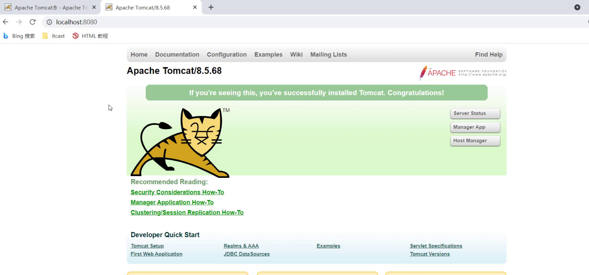

注意：启动的过程中，控制台有中文乱码，需要修改conf/logging.prooperties


#### 关闭

关闭有三种方式 ：

* 直接x掉运行窗口：强制关闭[不建议]
* bin\shutdown.bat：正常关闭
* ctrl+c： 正常关闭

#### 配置

修改端口：Tomcat默认的端口是8080，要想修改Tomcat启动的端口号，需要修改 conf/server.xml。

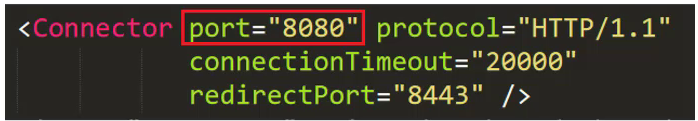

> 注: HTTP协议默认端口号为80，如果将Tomcat端口号改为80，则将来访问Tomcat时，将不用输入端口号。

启动时可能出现的错误：

* Tomcat的端口号取值范围是0-65535之间任意未被占用的端口，如果设置的端口号被占用，启动的时候就会包如下的错误

  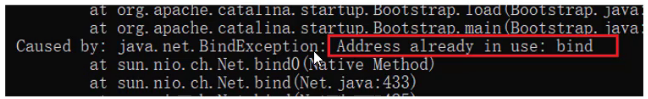

* Tomcat启动的时候，启动窗口一闪而过: 需要检查JAVA_HOME环境变量是否正确配置

  

#### 部署

Tomcat部署项目： 将项目放置到webapps目录下，即部署完成。

将 `资料/2. Tomcat/hello` 目录拷贝到Tomcat的webapps目录下通过浏览器访问`http://localhost/hello/a.html`，能看到下面页面就说明项目已经部署成功。

但是呢随着项目的增大，项目中的资源也会越来越多，项目在拷贝的过程中也会越来越费时间，该如何解决呢?

一般JavaWeb项目会被打包称war包，然后将war包放到Webapps目录下，Tomcat会自动解压缩war文件。

将 `资料/2. Tomcat/haha.war`目录拷贝到Tomcat的webapps目录下。Tomcat检测到war包后会自动完成解压缩，在webapps目录下就会多一个haha目录通过浏览器访问`http://localhost/haha/a.html`，能看到下面的内容就说明项目已经部署成功。

至此，Tomcat的部署就已经完成了，至于如何获得项目对应的war包，后期我们会借助于IDEA工具来生成。

### Maven创建Web项目

介绍完Tomcat的基本使用后，我们来学习在IDEA中如何创建Maven Web项目，学习这种方式的原因是以后Tomcat中运行的绝大多数都是Web项目，而使用Maven工具能更加简单快捷的把Web项目给创建出来，所以Maven的Web项目具体如何来构建呢?

在真正创建Maven Web项目之前，我们先要知道Web项目长什么样子，具体的结构是什么?

#### Web项目结构

Web项目的结构分为:开发中的项目和开发完可以部署的Web项目,这两种项目的结构是不一样的，我们一个个来介绍下：

* Maven Web项目结构：开发中的项目

  

* 开发完成部署的Web项目

  

开发项目通过执行Maven打包命令package,可以获取到部署的Web项目目录。编译后的Java字节码文件和resources的资源文件，会被放到WEB-INF下的classes目录下，pom.xml中依赖坐标对应的jar包，会被放入WEB-INF下的lib目录下。

#### 创建Maven Web项目

介绍完Maven Web的项目结构后，接下来使用Maven来创建Web项目，创建方式有两种：使用骨架和不使用骨架

##### 使用骨架

具体的步骤包含:

1. 创建Maven项目

   

2. 选择使用Web项目骨架

   

3. 输入Maven项目坐标创建项目

   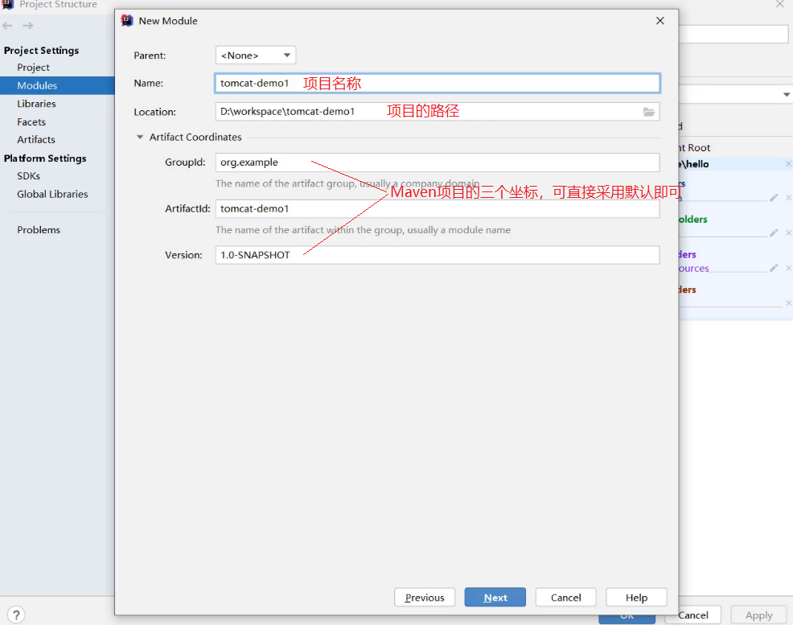

4. 确认Maven相关的配置信息后，完成项目创建

   

5. 删除pom.xml中多余内容

   

6. 补齐Maven Web项目缺失的目录结构

   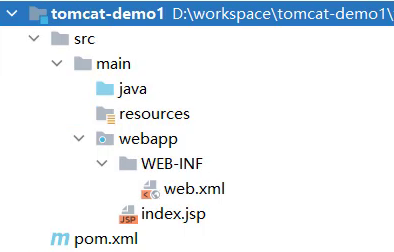

##### 不使用骨架

具体的步骤包含:

1. 创建Maven项目

   

2. 选择不使用Web项目骨架

   

3. 输入Maven项目坐标创建项目

   

4. 在pom.xml设置打包方式为war,默认是不写代表打包方式为jar

   

5. 补齐Maven Web项目缺失webapp的目录结构

   

6. 补齐Maven Web项目缺失WEB-INF/web.xml的目录结构

   

7. 补充完后，最终的项目结构如下:

   

上述两种方式，创建的web项目，都不是很全，需要手动补充内容，至于最终采用哪种方式来创建Maven Web项目，都是可以的，根据各自的喜好来选择使用即可。

### IDEA使用Tomcat

Maven Web项目创建成功后，通过Maven的package命令可以将项目打包成war包，将war文件拷贝到Tomcat的webapps目录下，启动Tomcat就可以将项目部署成功，然后通过浏览器进行访问即可。

然而我们在开发的过程中，项目中的内容会经常发生变化，如果按照上面这种方式来部署测试，是非常不方便的如何在IDEA中能快速使用Tomcat呢?

在IDEA中集成使用Tomcat有两种方式，分别是集成本地Tomcat和Tomcat Maven插件。

#### 集成本地Tomcat

目标: 将刚才本地安装好的Tomcat8集成到IDEA中，完成项目部署，具体的实现步骤

1. 打开添加本地Tomcat的面板

   

2. 指定本地Tomcat的具体路径

   

3. 修改Tomcat的名称，此步骤可以不改，只是让名字看起来更有意义，HTTP port中的端口也可以进行修改，比如把8080改成80

   

4. 将开发项目部署项目到Tomcat中

   

   扩展内容： xxx.war和 xxx.war exploded这两种部署项目模式的区别?

   * war模式是将WEB工程打成war包，把war包发布到Tomcat服务器上。war模式部署成功后，Tomcat的webapps目录下会有部署的项目内容
   * war exploded模式是将WEB工程以当前文件夹的位置关系发布到Tomcat服务器上。war exploded模式部署成功后，Tomcat的webapps目录下没有，而使用的是项目的target目录下的内容进行部署
   * 建议大家都选war模式进行部署，更符合项目部署的实际情况

5. 部署成功后，就可以启动项目，为了能更好的看到启动的效果，可以在webapp目录下添加a.html页面

   

6. 启动成功后，可以通过浏览器进行访问测试

   

7. 最终的注意事项

   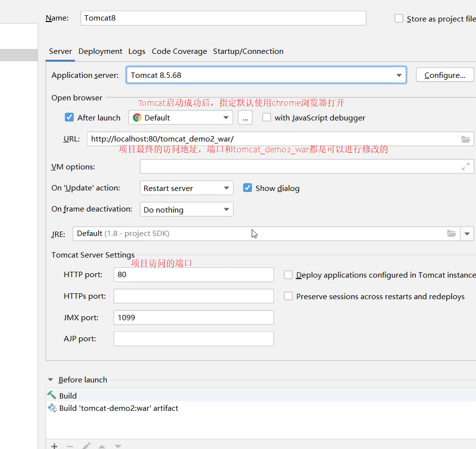

至此，IDEA中集成本地Tomcat进行项目部署的内容我们就介绍完了，整体步骤如下，大家需要按照流程进行部署操作练习。


#### Tomcat Maven插件

在IDEA中使用本地Tomcat进行项目部署，相对来说步骤比较繁琐，所以我们需要一种更简便的方式来替换它，那就是直接使用Maven中的Tomcat插件来部署项目，具体的实现步骤，只需要两步，分别是:

1. 在pom.xml中添加Tomcat插件

   ```xml
   <build>
       <plugins>
       	<!--Tomcat插件 -->
           <plugin>
               <groupId>org.apache.tomcat.maven</groupId>
               <artifactId>tomcat7-maven-plugin</artifactId>
               <version>2.2</version>
           </plugin>
       </plugins>
   </build>
   ```

2. 使用Maven Helper插件快速启动项目，选中项目，右键-->Run Maven --> tomcat7:run


注意：

* 如果选中项目并右键点击后，看不到Run Maven和Debug Maven，这个时候就需要在IDEA中下载Maven Helper插件，具体的操作方式为: File --> Settings --> Plugins --> Maven Helper ---> Install,安装完后按照提示重启IDEA，就可以看到了。

  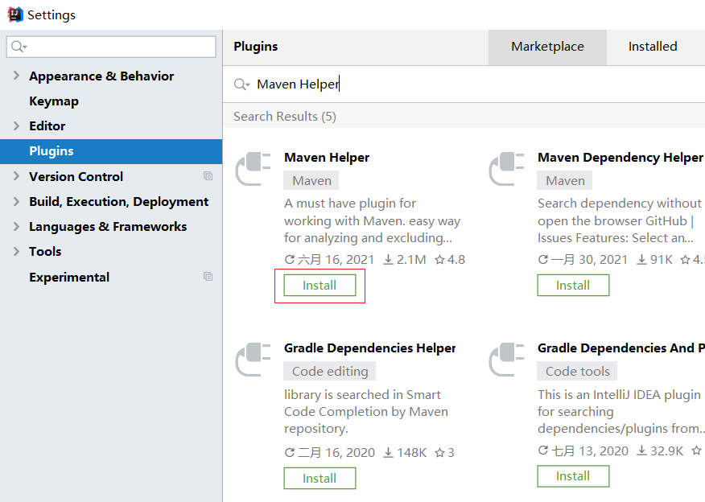

* Maven Tomcat插件目前只有Tomcat7版本，没有更高的版本可以使用

* 使用Maven Tomcat插件，要想修改Tomcat的端口和访问路径，可以直接修改pom.xml

  ```xml
  <build>
      <plugins>
      	<!--Tomcat插件 -->
          <plugin>
              <groupId>org.apache.tomcat.maven</groupId>
              <artifactId>tomcat7-maven-plugin</artifactId>
              <version>2.2</version>
              <configuration>
              	<port>80</port><!--访问端口号 -->
                  <!--项目访问路径
  					未配置访问路径: http://localhost:80/tomcat-demo2/a.html
  					配置/后访问路径: http://localhost:80/a.html
  					如果配置成 /hello,访问路径会变成什么?
  						答案: http://localhost:80/hello/a.html
  				-->
                  <path>/</path>
              </configuration>
          </plugin>
      </plugins>
  </build>
  ```

## Servlet


Servlet是JavaWeb最为核心的内容，它是Java提供的一门动态web资源开发技术。使用Servlet就可以实现，根据不同的登录用户在页面上动态显示不同内容。

Servlet是JavaEE规范之一，其实就是一个接口，将来我们需要定义Servlet类实现Servlet接口，并由web服务器运行Servlet


### 快速入门

需求分析: 编写一个Servlet类，并使用IDEA中Tomcat插件进行部署，最终通过浏览器访问所编写的Servlet程序。

具体的实现步骤为:

1. 创建Web项目`web-demo`，导入Servlet依赖坐标

   ```xml
   <dependency>
       <groupId>javax.servlet</groupId>
       <artifactId>javax.servlet-api</artifactId>
       <version>3.1.0</version>
       <!--
         此处为什么需要添加该标签?
         provided指的是在编译和测试过程中有效,最后生成的war包时不会加入
          因为Tomcat的lib目录中已经有servlet-api这个jar包，如果在生成war包的时候生效就会和Tomcat中的jar包冲突，导致报错
       -->
       <scope>provided</scope>
   </dependency>
   ```

2. 创建:定义一个类，实现Servlet接口，并重写接口中所有方法，并在service方法中输入一句话

   ```java
   package com.itheima.web;
   
   import javax.servlet.*;
   import java.io.IOException;
   
   public class ServletDemo1 implements Servlet {
   
       public void service(ServletRequest servletRequest, ServletResponse servletResponse) throws ServletException, IOException {
           System.out.println("servlet hello world~");
       }
       public void init(ServletConfig servletConfig) throws ServletException {
   
       }
   
       public ServletConfig getServletConfig() {
           return null;
       }
   
       public String getServletInfo() {
           return null;
       }
   
       public void destroy() {
   
       }
   }
   ```

3. 配置:在类上使用@WebServlet注解，配置该Servlet的访问路径

   ```java
   @WebServlet("/demo1")
   ```

4. 访问:启动Tomcat,浏览器中输入URL地址访问该Servlet

   ```
   http://localhost:8080/web-demo/demo1
   ```

5. 访问后，在控制台会打印`servlet hello world~` 说明servlet程序已经成功运行。

至此，Servlet的入门案例就已经完成，大家可以按照上面的步骤进行练习了。

### 执行流程

Servlet程序已经能正常运行，但是我们需要思考个问题: 我们并没有创建ServletDemo1类的对象，也没有调用对象中的service方法，为什么在控制台就打印了`servlet hello world~`这句话呢?

要想回答上述问题，我们就需要对Servlet的执行流程进行一个学习。


1. 浏览器发出`http://localhost:8080/web-demo/demo1`请求，从请求中可以解析出三部分内容，分别是`localhost:8080`、`web-demo`、`demo1`
   - 根据`localhost:8080`可以找到要访问的Tomcat Web服务器
   - 根据`web-demo`可以找到部署在Tomcat服务器上的web-demo项目
   - 根据`demo1`可以找到要访问的是项目中的哪个Servlet类，根据@WebServlet后面的值进行匹配
2. 找到ServletDemo1这个类后，Tomcat Web服务器就会为ServletDemo1这个类创建一个对象，然后调用对象中的service方法
   - ServletDemo1实现了Servlet接口，所以类中必然会重写service方法供Tomcat Web服务器进行调用
   - service方法中有ServletRequest和ServletResponse两个参数，ServletRequest封装的是请求数据，ServletResponse封装的是响应数据，后期我们可以通过这两个参数实现前后端的数据交互

### 生命周期

介绍完Servlet的执行流程后，我们知道Servlet是由Tomcat Web服务器帮我们创建的。接下来咱们再来思考一个问题:Tomcat什么时候创建的Servlet对象?

要想回答上述问题，我们就需要对Servlet的生命周期进行一个学习。

生命周期: 对象的生命周期指一个对象从被创建到被销毁的整个过程。Servlet运行在Servlet容器(web服务器)中，其生命周期由容器来管理，分为4个阶段：

1. 加载和实例化：默认情况下，当Servlet第一次被访问时，由容器创建Servlet对象。

   > 但是如果创建Servlet比较耗时的话，那么第一个访问的人等待的时间就比较长，用户的体验就比较差，那么我们能不能把Servlet的创建放到服务器启动的时候来创建，具体如何来配置?
   >
   > ```java
   > @WebServlet(urlPatterns = "/demo1",loadOnStartup = 1)
   > // loadOnstartup的取值有两类情况
   > //（1）负整数:第一次访问时创建Servlet对象
   > //（2）0或正整数:服务器启动时创建Servlet对象，数字越小优先级越高
   > ```

2. 初始化：在Servlet实例化之后，容器将调用Servlet的init()方法初始化这个对象，完成一些如加载配置文件、创建连接等初始化的工作。该方法只调用一次

3. 请求处理：每次请求Servlet时，Servlet容器都会调用Servlet的service()方法对请求进行处理

4. 服务终止：当需要释放内存或者容器关闭时，容器就会调用Servlet实例的destroy()方法完成资源的释放。在destroy()方法调用之后，容器会释放这个Servlet实例，该实例随后会被Java的垃圾收集器所回收

通过案例演示下上述的生命周期：

```java
package com.itheima.web;

import javax.servlet.*;
import javax.servlet.annotation.WebServlet;
import java.io.IOException;
/**
* Servlet生命周期方法
*/
@WebServlet(urlPatterns = "/demo2",loadOnStartup = 1)
public class ServletDemo2 implements Servlet {

    /**
     *  初始化方法
     *  1.调用时机：默认情况下，Servlet被第一次访问时，调用
     *      * loadOnStartup: 默认为-1，修改为0或者正整数，则会在服务器启动的时候，调用
     *  2.调用次数: 1次
     * @param config
     * @throws ServletException
     */
    public void init(ServletConfig config) throws ServletException {
        System.out.println("init...");
    }

    /**
     * 提供服务
     * 1.调用时机:每一次Servlet被访问时，调用
     * 2.调用次数: 多次
     * @param req
     * @param res
     * @throws ServletException
     * @throws IOException
     */
    public void service(ServletRequest req, ServletResponse res) throws ServletException, IOException {
        System.out.println("servlet hello world~");
    }

    /**
     * 销毁方法
     * 1.调用时机：内存释放或者服务器关闭的时候，Servlet对象会被销毁，调用
     * 2.调用次数: 1次
     */
    public void destroy() {
        System.out.println("destroy...");
    }
    public ServletConfig getServletConfig() {
        return null;
    }

    public String getServletInfo() {
        return null;
    }


}
```

注意:如何才能让Servlet中的destroy方法被执行？


在Terminal命令行中，先使用`mvn tomcat7:run`启动，然后再使用`ctrl+c`关闭tomcat

### 方法介绍

Servlet中总共有5个方法，我们已经介绍过其中的三个，剩下的两个方法作用分别是什么？

我们先来回顾下前面讲的三个方法，分别是:

* 初始化方法，在Servlet被创建时执行，只执行一次

  ```java
  void init(ServletConfig config) 
  ```

* 提供服务方法， 每次Servlet被访问，都会调用该方法

  ```java
  void service(ServletRequest req, ServletResponse res)
  ```

* 销毁方法，当Servlet被销毁时，调用该方法。在内存释放或服务器关闭时销毁Servlet

  ```java
  void destroy() 
  ```

剩下的两个方法是:

* 获取Servlet信息

  ```java
  String getServletInfo() 
  //该方法用来返回Servlet的相关信息，没有什么太大的用处，一般我们返回一个空字符串即可
  public String getServletInfo() {
      return "";
  }
  ```

* 获取ServletConfig对象

  ```java
  ServletConfig getServletConfig()
  ```

  ServletConfig对象，在init方法的参数中有，而Tomcat Web服务器在创建Servlet对象的时候会调用init方法，必定会传入一个ServletConfig对象，我们只需要将服务器传过来的ServletConfig进行返回即可。具体如何操作?

  ```java
  package com.itheima.web;
  
  import javax.servlet.*;
  import javax.servlet.annotation.WebServlet;
  import java.io.IOException;
  
  /**
   * Servlet方法介绍
   */
  @WebServlet(urlPatterns = "/demo3",loadOnStartup = 1)
  public class ServletDemo3 implements Servlet {
  
      private ServletConfig servletConfig;
      /**
       *  初始化方法
       *  1.调用时机：默认情况下，Servlet被第一次访问时，调用
       *      * loadOnStartup: 默认为-1，修改为0或者正整数，则会在服务器启动的时候，调用
       *  2.调用次数: 1次
       * @param config
       * @throws ServletException
       */
      public void init(ServletConfig config) throws ServletException {
          this.servletConfig = config;
          System.out.println("init...");
      }
      public ServletConfig getServletConfig() {
          return servletConfig;
      }
      
      /**
       * 提供服务
       * 1.调用时机:每一次Servlet被访问时，调用
       * 2.调用次数: 多次
       * @param req
       * @param res
       * @throws ServletException
       * @throws IOException
       */
      public void service(ServletRequest req, ServletResponse res) throws ServletException, IOException {
          System.out.println("servlet hello world~");
      }
  
      /**
       * 销毁方法
       * 1.调用时机：内存释放或者服务器关闭的时候，Servlet对象会被销毁，调用
       * 2.调用次数: 1次
       */
      public void destroy() {
          System.out.println("destroy...");
      }
      
      public String getServletInfo() {
          return "";
      }
  }
  ```

getServletInfo()和getServletConfig()这两个方法使用的不是很多，大家了解下。

### 体系结构

通过上面的学习，我们知道要想编写一个Servlet就必须要实现Servlet接口，重写接口中的5个方法，虽然已经能完成要求，但是编写起来还是比较麻烦的，因为我们更关注的其实只有service方法，那有没有更简单方式来创建Servlet呢?

要想解决上面的问题，我们需要先对Servlet的体系结构进行下了解:


因为我们将来开发B/S架构的web项目，都是针对HTTP协议，所以我们自定义Servlet,会通过继承HttpServlet

具体的编写格式如下:

```java
@WebServlet("/demo4")
public class ServletDemo4 extends HttpServlet {
    @Override
    protected void doGet(HttpServletRequest req, HttpServletResponse resp) throws ServletException, IOException {
        //TODO GET 请求方式处理逻辑
        System.out.println("get...");
    }
    @Override
    protected void doPost(HttpServletRequest req, HttpServletResponse resp) throws ServletException, IOException {
        //TODO Post 请求方式处理逻辑
        System.out.println("post...");
    }
}
```

要想发送一个GET请求，请求该Servlet，只需要通过浏览器发送`http://localhost:8080/web-demo/demo4`,就能看到doGet方法被执行了

要想发送一个POST请求，请求该Servlet，单单通过浏览器是无法实现的，这个时候就需要编写一个form表单来发送请求，在webapp下创建一个`a.html`页面，内容如下:

```html
<!DOCTYPE html>
<html lang="en">
<head>
    <meta charset="UTF-8">
    <title>Title</title>
</head>
<body>
    <form action="/web-demo/demo4" method="post">
        <input name="username"/><input type="submit"/>
    </form>
</body>
</html>
```

启动测试，即可看到doPost方法被执行了。

Servlet的简化编写就介绍完了，接着需要思考两个问题:

1. HttpServlet中为什么要根据请求方式的不同，调用不同的方法?
2. 如何调用?

针对问题一，我们需要回顾之前的知识点。前端发送GET和POST请求的时候，参数的位置不一致，GET请求参数在请求行中，POST请求参数在请求体中，为了能处理不同的请求方式，我们得在service方法中进行判断，然后写不同的业务处理，这样能实现，但是每个Servlet类中都将有相似的代码，针对这个问题，有什么可以优化的策略么?

```java
package com.itheima.web;

import javax.servlet.*;
import javax.servlet.annotation.WebServlet;
import javax.servlet.http.HttpServlet;
import javax.servlet.http.HttpServletRequest;
import javax.servlet.http.HttpServletResponse;
import java.io.IOException;


@WebServlet("/demo5")
public class ServletDemo5 implements Servlet {

    public void init(ServletConfig config) throws ServletException {

    }

    public ServletConfig getServletConfig() {
        return null;
    }

    public void service(ServletRequest req, ServletResponse res) throws ServletException, IOException {
        //如何调用?
        //获取请求方式，根据不同的请求方式进行不同的业务处理
        HttpServletRequest request = (HttpServletRequest)req;
       //1. 获取请求方式
        String method = request.getMethod();
        //2. 判断
        if("GET".equals(method)){
            // get方式的处理逻辑
        }else if("POST".equals(method)){
            // post方式的处理逻辑
        }
    }

    public String getServletInfo() {
        return null;
    }

    public void destroy() {

    }
}

```

要解决上述问题，我们可以对Servlet接口进行继承封装，来简化代码开发。

```java
package com.itheima.web;

import javax.servlet.*;
import javax.servlet.http.HttpServletRequest;
import java.io.IOException;

public class MyHttpServlet implements Servlet {
    public void init(ServletConfig config) throws ServletException {

    }

    public ServletConfig getServletConfig() {
        return null;
    }

    public void service(ServletRequest req, ServletResponse res) throws ServletException, IOException {
        HttpServletRequest request = (HttpServletRequest)req;
        //1. 获取请求方式
        String method = request.getMethod();
        //2. 判断
        if("GET".equals(method)){
            // get方式的处理逻辑
            doGet(req,res);
        }else if("POST".equals(method)){
            // post方式的处理逻辑
            doPost(req,res);
        }
    }

    protected void doPost(ServletRequest req, ServletResponse res) {
    }

    protected void doGet(ServletRequest req, ServletResponse res) {
    }

    public String getServletInfo() {
        return null;
    }

    public void destroy() {

    }
}

```

有了MyHttpServlet这个类，以后我们再编写Servlet类的时候，只需要继承MyHttpServlet，重写父类中的doGet和doPost方法，就可以用来处理GET和POST请求的业务逻辑。接下来，可以把ServletDemo5代码进行改造

```java
@WebServlet("/demo5")
public class ServletDemo5 extends MyHttpServlet {

    @Override
    protected void doGet(ServletRequest req, ServletResponse res) {
        System.out.println("get...");
    }

    @Override
    protected void doPost(ServletRequest req, ServletResponse res) {
        System.out.println("post...");
    }
}

```

将来页面发送的是GET请求，则会进入到doGet方法中进行执行，如果是POST请求，则进入到doPost方法。这样代码在编写的时候就相对来说更加简单快捷。

类似MyHttpServlet这样的类Servlet中已经为我们提供好了，就是HttpServlet,翻开源码，大家可以搜索`service()`方法，你会发现HttpServlet做的事更多，不仅可以处理GET和POST还可以处理其他五种请求方式。

```java
protected void service(HttpServletRequest req, HttpServletResponse resp)
        throws ServletException, IOException
    {
        String method = req.getMethod();

        if (method.equals(METHOD_GET)) {
            long lastModified = getLastModified(req);
            if (lastModified == -1) {
                // servlet doesn't support if-modified-since, no reason
                // to go through further expensive logic
                doGet(req, resp);
            } else {
                long ifModifiedSince = req.getDateHeader(HEADER_IFMODSINCE);
                if (ifModifiedSince < lastModified) {
                    // If the servlet mod time is later, call doGet()
                    // Round down to the nearest second for a proper compare
                    // A ifModifiedSince of -1 will always be less
                    maybeSetLastModified(resp, lastModified);
                    doGet(req, resp);
                } else {
                    resp.setStatus(HttpServletResponse.SC_NOT_MODIFIED);
                }
            }

        } else if (method.equals(METHOD_HEAD)) {
            long lastModified = getLastModified(req);
            maybeSetLastModified(resp, lastModified);
            doHead(req, resp);

        } else if (method.equals(METHOD_POST)) {
            doPost(req, resp);
            
        } else if (method.equals(METHOD_PUT)) {
            doPut(req, resp);
            
        } else if (method.equals(METHOD_DELETE)) {
            doDelete(req, resp);
            
        } else if (method.equals(METHOD_OPTIONS)) {
            doOptions(req,resp);
            
        } else if (method.equals(METHOD_TRACE)) {
            doTrace(req,resp);
            
        } else {
            //
            // Note that this means NO servlet supports whatever
            // method was requested, anywhere on this server.
            //

            String errMsg = lStrings.getString("http.method_not_implemented");
            Object[] errArgs = new Object[1];
            errArgs[0] = method;
            errMsg = MessageFormat.format(errMsg, errArgs);
            
            resp.sendError(HttpServletResponse.SC_NOT_IMPLEMENTED, errMsg);
        }
    }
```

### urlPattern配置

Servlet类编写好后，要想被访问到，就需要配置其访问路径（urlPattern）

* 一个Servlet,可以配置多个urlPattern

  

  ```java
  package com.itheima.web;
  
  import javax.servlet.ServletRequest;
  import javax.servlet.ServletResponse;
  import javax.servlet.annotation.WebServlet;
  
  /**
  * urlPattern: 一个Servlet可以配置多个访问路径
  */
  @WebServlet(urlPatterns = {"/demo7","/demo8"})
  public class ServletDemo7 extends MyHttpServlet {
  
      @Override
      protected void doGet(ServletRequest req, ServletResponse res) {
          
          System.out.println("demo7 get...");
      }
      @Override
      protected void doPost(ServletRequest req, ServletResponse res) {
      }
  }
  ```

  在浏览器上输入`http://localhost:8080/web-demo/demo7`,`http://localhost:8080/web-demo/demo8`这两个地址都能访问到ServletDemo7的doGet方法。

* urlPattern配置规则

  * 精确匹配

    

    ```java
    /**
     * UrlPattern:
     * * 精确匹配
     */
    @WebServlet(urlPatterns = "/user/select")
    public class ServletDemo8 extends MyHttpServlet {
    
        @Override
        protected void doGet(ServletRequest req, ServletResponse res) {
    
            System.out.println("demo8 get...");
        }
        @Override
        protected void doPost(ServletRequest req, ServletResponse res) {
        }
    }
    ```

    访问路径`http://localhost:8080/web-demo/user/select`

  * 目录匹配

    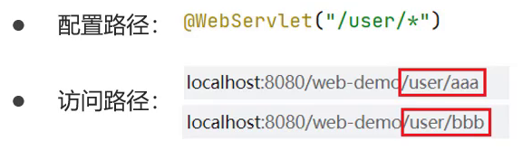

    ```java
    package com.itheima.web;
    
    import javax.servlet.ServletRequest;
    import javax.servlet.ServletResponse;
    import javax.servlet.annotation.WebServlet;
    
    /**
     * UrlPattern:
     * * 目录匹配: /user/*
     */
    @WebServlet(urlPatterns = "/user/*")
    public class ServletDemo9 extends MyHttpServlet {
    
        @Override
        protected void doGet(ServletRequest req, ServletResponse res) {
    
            System.out.println("demo9 get...");
        }
        @Override
        protected void doPost(ServletRequest req, ServletResponse res) {
        }
    }
    ```

    访问路径`http://localhost:8080/web-demo/user/任意`

    思考:

    1. 访问路径`http://localhost:8080/web-demo/user`是否能访问到demo9的doGet方法?
    2. 访问路径`http://localhost:8080/web-demo/user/a/b`是否能访问到demo9的doGet方法?
    3. 访问路径`http://localhost:8080/web-demo/user/select`是否能访问到demo9还是demo8的doGet方法?

    答案是: 能、能、demo8，进而我们可以得到的结论是`/user/*`中的`/*`代表的是零或多个层级访问目录同时精确匹配优先级要高于目录匹配。

  * 扩展名匹配

    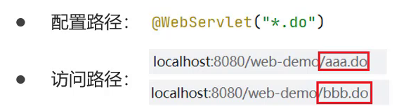

    ```java
    package com.itheima.web;
    
    import javax.servlet.ServletRequest;
    import javax.servlet.ServletResponse;
    import javax.servlet.annotation.WebServlet;
    
    /**
     * UrlPattern:
     * * 扩展名匹配: *.do
     */
    @WebServlet(urlPatterns = "*.do")
    public class ServletDemo10 extends MyHttpServlet {
    
        @Override
        protected void doGet(ServletRequest req, ServletResponse res) {
    
            System.out.println("demo10 get...");
        }
        @Override
        protected void doPost(ServletRequest req, ServletResponse res) {
        }
    }
    ```

    访问路径`http://localhost:8080/web-demo/任意.do`

    注意:

    1. 如果路径配置的不是扩展名，那么在路径的前面就必须要加`/`否则会报错

    2. 如果路径配置的是`*.do`,那么在*.do的前面不能加`/`,否则会报错

  * 任意匹配

    

    ```java
    package com.itheima.web;
    
    import javax.servlet.ServletRequest;
    import javax.servlet.ServletResponse;
    import javax.servlet.annotation.WebServlet;
    
    /**
     * UrlPattern:
     * * 任意匹配： /
     */
    @WebServlet(urlPatterns = "/")
    public class ServletDemo11 extends MyHttpServlet {
    
        @Override
        protected void doGet(ServletRequest req, ServletResponse res) {
    
            System.out.println("demo11 get...");
        }
        @Override
        protected void doPost(ServletRequest req, ServletResponse res) {
        }
    }
    ```

    访问路径`http://localhost:8080/demo-web/任意`

    ```java
    package com.itheima.web;
    
    import javax.servlet.ServletRequest;
    import javax.servlet.ServletResponse;
    import javax.servlet.annotation.WebServlet;
    
    /**
     * UrlPattern:
     * * 任意匹配： /*
     */
    @WebServlet(urlPatterns = "/*")
    public class ServletDemo12 extends MyHttpServlet {
    
        @Override
        protected void doGet(ServletRequest req, ServletResponse res) {
    
            System.out.println("demo12 get...");
        }
        @Override
        protected void doPost(ServletRequest req, ServletResponse res) {
        }
    }
    
    ```

    访问路径`http://localhost:8080/demo-web/任意`

    注意:`/`和`/*`的区别

    1. 当我们的项目中的Servlet配置了 "/",会覆盖掉tomcat中的DefaultServlet,当其他的url-pattern都匹配不上时都会走这个Servlet

    2. 当我们的项目中配置了"/*",意味着匹配任意访问路径

    3. DefaultServlet是用来处理静态资源，如果配置了"/"会把默认的覆盖掉，就会引发请求静态资源的时候没有走默认的而是走了自定义的Servlet类，最终导致静态资源不能被访问

### XML配置

前面对应Servlet的配置，我们都使用的是@WebServlet,这个是Servlet从3.0版本后开始支持注解配置，3.0版本前只支持XML配置文件的配置方法。

对于XML的配置步骤有两步:

1. 编写Servlet类

   ```JAVA
   package com.itheima.web;
   
   import javax.servlet.ServletRequest;
   import javax.servlet.ServletResponse;
   import javax.servlet.annotation.WebServlet;
   
   public class ServletDemo13 extends MyHttpServlet {
   
       @Override
       protected void doGet(ServletRequest req, ServletResponse res) {
   
           System.out.println("demo13 get...");
       }
       @Override
       protected void doPost(ServletRequest req, ServletResponse res) {
       }
   }
   ```

2. 在web.xml中配置该Servlet

   ```java
   <?xml version="1.0" encoding="UTF-8"?>
   <web-app xmlns="http://xmlns.jcp.org/xml/ns/javaee"
            xmlns:xsi="http://www.w3.org/2001/XMLSchema-instance"
            xsi:schemaLocation="http://xmlns.jcp.org/xml/ns/javaee http://xmlns.jcp.org/xml/ns/javaee/web-app_4_0.xsd"
            version="4.0">
       
       
       
       <!-- 
           Servlet 全类名
       -->
       <servlet>
           <!-- servlet的名称，名字任意-->
           <servlet-name>demo13</servlet-name>
           <!--servlet的类全名-->
           <servlet-class>com.itheima.web.ServletDemo13</servlet-class>
       </servlet>
   
       <!-- 
           Servlet 访问路径
       -->
       <servlet-mapping>
           <!-- servlet的名称，要和上面的名称一致-->
           <servlet-name>demo13</servlet-name>
           <!-- servlet的访问路径-->
           <url-pattern>/demo13</url-pattern>
       </servlet-mapping>
   </web-app>
   ```

这种配置方式和注解比起来，确认麻烦很多，所以建议大家使用注解来开发。但是大家要认识上面这种配置方式，因为并不是所有的项目都是基于注解开发的。

## Request&Response

Request是请求对象，Response是响应对象。这两个对象在我们使用Servlet的时候有看到：

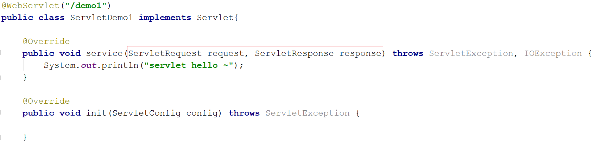

此时，我们就需要思考一个问题。request和response这两个参数的作用是什么?


* request：获取请求数据
  * 浏览器会发送HTTP请求到后台服务器[Tomcat]
  * HTTP的请求中会包含很多请求数据[请求行+请求头+请求体]
  * 后台服务器[Tomcat]会对HTTP请求中的数据进行解析并把解析结果存入到一个对象中
  * 所存入的对象即为request对象，所以我们可以从request对象中获取请求的相关参数
  * 获取到数据后就可以继续后续的业务，比如获取用户名和密码就可以实现登录操作的相关业务
* response：设置响应数据
  * 业务处理完后，后台就需要给前端返回业务处理的结果即响应数据
  * 把响应数据封装到response对象中
  * 后台服务器[Tomcat]会解析response对象,按照[响应行+响应头+响应体]格式拼接结果
  * 浏览器最终解析结果，把内容展示在浏览器给用户浏览

对于上述所讲的内容，我们通过一个案例来初步体验下request和response对象的使用。

```java
@WebServlet("/demo3")
public class ServletDemo3 extends HttpServlet {
    @Override
    protected void doGet(HttpServletRequest request, HttpServletResponse response) throws ServletException, IOException {
        //使用request对象 获取请求数据
        String name = request.getParameter("name");//url?name=zhangsan

        //使用response对象 设置响应数据
        response.setHeader("content-type","text/html;charset=utf-8");
        response.getWriter().write("<h1>"+name+",欢迎您！</h1>");
    }

    @Override
    protected void doPost(HttpServletRequest request, HttpServletResponse response) throws ServletException, IOException {
        System.out.println("Post...");
    }
}
```

启动成功后就可以通过浏览器来访问，并且根据传入参数的不同就可以在页面上展示不同的内容：


### Request对象

#### Request继承体系

在学习这节内容之前，我们先思考一个问题，前面在介绍Request和Reponse对象的时候，比较细心的同学可能已经发现：

* 当我们的Servlet类实现的是Servlet接口的时候，service方法中的参数是ServletRequest和ServletResponse
* 当我们的Servlet类继承的是HttpServlet类的时候，doGet和doPost方法中的参数就变成HttpServletRequest和HttpServletReponse

那么就有下面问题：

* ServletRequest和HttpServletRequest的关系是什么?
* request对象是有谁来创建的?
* request提供了哪些API,这些API从哪里查?

首先，我们先来看下Request的继承体系:


从上图中可以看出，ServletRequest和HttpServletRequest都是Java提供的，所以我们可以打开JavaEE提供的API文档[参考: 资料/JavaEE7-api.chm],打开后可以看到:


所以ServletRequest和HttpServletRequest是继承关系，并且两个都是接口，接口是无法创建对象，这个时候就引发了下面这个问题:


这个时候，我们就需要用到Request继承体系中的`RequestFacade`:

* 该类实现了HttpServletRequest接口，也间接实现了ServletRequest接口。
* Servlet类中的service方法、doGet方法或者是doPost方法最终都是由Web服务器[Tomcat]来调用的，所以Tomcat提供了方法参数接口的具体实现类，并完成了对象的创建
* 要想了解RequestFacade中都提供了哪些方法，我们可以直接查看JavaEE的API文档中关于ServletRequest和HttpServletRequest的接口文档，因为RequestFacade实现了其接口就需要重写接口中的方法

对于上述结论，要想验证，可以编写一个Servlet，在方法中把request对象打印下，就能看到最终的对象是不是RequestFacade,代码如下:

```java
@WebServlet("/demo2")
public class ServletDemo2 extends HttpServlet {
    @Override
    protected void doGet(HttpServletRequest request, HttpServletResponse response) throws ServletException, IOException {
        System.out.println(request);
    }

    @Override
    protected void doPost(HttpServletRequest request, HttpServletResponse response) throws ServletException, IOException {
    }
}
```

启动服务器，运行访问`http://localhost:8080/request-demo/demo2`,得到运行结果:


#### Request获取请求数据

HTTP请求数据总共分为三部分内容，分别是请求行、请求头、请求体，对于这三部分内容的数据，分别该如何获取，首先我们先来学习请求行数据如何获取?

##### 获取请求行数据

请求行包含三块内容，分别是`请求方式`、`请求资源路径`、`HTTP协议及版本`


对于这三部分内容，request对象都提供了对应的API方法来获取，具体如下:

* 获取请求方式: `GET`

  ```
  String getMethod()
  ```

* 获取虚拟目录(项目访问路径): `/request-demo`

  ```
  String getContextPath()
  ```

* 获取URL(统一资源定位符): `http://localhost:8080/request-demo/req1`

  ```
  StringBuffer getRequestURL()
  ```

* 获取URI(统一资源标识符): `/request-demo/req1`

  ```
  String getRequestURI()
  ```

* 获取请求参数(GET方式): `username=zhangsan&password=123`

  ```
  String getQueryString()
  ```

介绍完上述方法后，咱们通过代码把上述方法都使用下:

```java
/**
 * request 获取请求数据
 */
@WebServlet("/req1")
public class RequestDemo1 extends HttpServlet {
    @Override
    protected void doGet(HttpServletRequest req, HttpServletResponse resp) throws ServletException, IOException {
        // String getMethod()：获取请求方式： GET
        String method = req.getMethod();
        System.out.println(method);//GET
        // String getContextPath()：获取虚拟目录(项目访问路径)：/request-demo
        String contextPath = req.getContextPath();
        System.out.println(contextPath);
        // StringBuffer getRequestURL(): 获取URL(统一资源定位符)：http://localhost:8080/request-demo/req1
        StringBuffer url = req.getRequestURL();
        System.out.println(url.toString());
        // String getRequestURI()：获取URI(统一资源标识符)： /request-demo/req1
        String uri = req.getRequestURI();
        System.out.println(uri);
        // String getQueryString()：获取请求参数（GET方式）： username=zhangsan
        String queryString = req.getQueryString();
        System.out.println(queryString);
    }
    @Override
    protected void doPost(HttpServletRequest req, HttpServletResponse resp) throws ServletException, IOException {
    }
}
```

启动服务器，访问`http://localhost:8080/request-demo/req1?username=zhangsan&passwrod=123`，获取的结果如下:


##### 获取请求头数据

对于请求头的数据，格式为`key: value`如下:


所以根据请求头名称获取对应值的方法为:

```
String getHeader(String name)
```

接下来，在代码中如果想要获取客户端浏览器的版本信息，则可以使用

```java
/**
 * request 获取请求数据
 */
@WebServlet("/req1")
public class RequestDemo1 extends HttpServlet {
    @Override
    protected void doGet(HttpServletRequest req, HttpServletResponse resp) throws ServletException, IOException {
        //获取请求头: user-agent: 浏览器的版本信息
        String agent = req.getHeader("user-agent");
		System.out.println(agent);
    }
    @Override
    protected void doPost(HttpServletRequest req, HttpServletResponse resp) throws ServletException, IOException {
    }
}

```

重新启动服务器后，`http://localhost:8080/request-demo/req1?username=zhangsan&passwrod=123`，获取的结果如下:


##### 获取请求体数据

浏览器在发送GET请求的时候是没有请求体的，所以需要把请求方式变更为POST，请求体中的数据格式如下:


对于请求体中的数据，Request对象提供了如下两种方式来获取其中的数据，分别是:

* 获取字节输入流，如果前端发送的是字节数据，比如传递的是文件数据，则使用该方法

  ```
  ServletInputStream getInputStream()
  ```

* 获取字符输入流，如果前端发送的是纯文本数据，则使用该方法

  ```
  BufferedReader getReader()
  ```

接下来，大家需要思考，要想获取到请求体的内容该如何实现?

>具体实现的步骤如下:
>
>1.准备一个页面，在页面中添加form表单,用来发送post请求
>
>2.在Servlet的doPost方法中获取请求体数据
>
>3.在doPost方法中使用request的getReader()或者getInputStream()来获取
>
>4.访问测试

1. 在项目的webapp目录下添加一个html页面，名称为：`req.html`

   ```html
   <!DOCTYPE html>
   <html lang="en">
   <head>
       <meta charset="UTF-8">
       <title>Title</title>
   </head>
   <body>
   <!-- 
       action:form表单提交的请求地址
       method:请求方式，指定为post
   -->
   <form action="/request-demo/req1" method="post">
       <input type="text" name="username">
       <input type="password" name="password">
       <input type="submit">
   </form>
   </body>
   </html>
   ```

2. 在Servlet的doPost方法中获取数据

   ```java
   /**
    * request 获取请求数据
    */
   @WebServlet("/req1")
   public class RequestDemo1 extends HttpServlet {
       @Override
       protected void doGet(HttpServletRequest req, HttpServletResponse resp) throws ServletException, IOException {
       }
       @Override
       protected void doPost(HttpServletRequest req, HttpServletResponse resp) throws ServletException, IOException {
           //在此处获取请求体中的数据
       }
   }
   ```

3. 调用getReader()或者getInputStream()方法，因为目前前端传递的是纯文本数据，所以我们采用getReader()方法来获取

   ```java
   /**
    * request 获取请求数据
    */
   @WebServlet("/req1")
   public class RequestDemo1 extends HttpServlet {
       @Override
       protected void doGet(HttpServletRequest req, HttpServletResponse resp) throws ServletException, IOException {
       }
       @Override
       protected void doPost(HttpServletRequest req, HttpServletResponse resp) throws ServletException, IOException {
            //获取post 请求体：请求参数
           //1. 获取字符输入流
           BufferedReader br = req.getReader();
           //2. 读取数据
           String line = br.readLine();
           System.out.println(line);
       }
   }
   ```

   注意：BufferedReader流是通过request对象来获取的，当请求完成后request对象就会被销毁，request对象被销毁后，BufferedReader流就会自动关闭，所以此处就不需要手动关闭流了。

4. 启动服务器，通过浏览器访问`http://localhost:8080/request-demo/req.html`

   

   点击`提交`按钮后，就可以在控制台看到前端所发送的请求数据

   

##### 获取请求参数的通用方式

在学习下面内容之前，我们先提出两个问题:

* 什么是请求参数?

  为了能更好的回答上述两个问题，我们拿用户登录的例子来说明

  1. 想要登录网址，需要进入登录页面
  2. 在登录页面输入用户名和密码
  3. 将用户名和密码提交到后台
  4. 后台校验用户名和密码是否正确
  5. 如果正确，则正常登录，如果不正确，则提示用户名或密码错误

  上述例子中，用户名和密码其实就是我们所说的请求参数。

* 请求参数和请求数据的关系是什么?

  请求数据则是包含请求行、请求头和请求体的所有数据

  1. 请求参数是请求数据中的部分内容
  2. 如果是GET请求，请求参数在请求行中
  3. 如果是POST请求，请求参数一般在请求体中

对于请求参数的获取,常用的有以下两种:

* GET方式:

  ```
  String getQueryString()
  ```

* POST方式:

  ```
  BufferedReader getReader();
  ```

有了上述的知识储备，我们来实现一个案例需求:

1. 发送一个GET请求并携带用户名，后台接收后打印到控制台
2. 发送一个POST请求并携带用户名，后台接收后打印到控制台

此处大家需要注意的是GET请求和POST请求接收参数的方式不一样，具体实现的代码如下:

```java
@WebServlet("/req1")
public class RequestDemo1 extends HttpServlet {
    @Override
    protected void doGet(HttpServletRequest req, HttpServletResponse resp) throws ServletException, IOException {

        String result = req.getQueryString();
        System.out.println(result);

    }
    @Override
    protected void doPost(HttpServletRequest req, HttpServletResponse resp) throws ServletException, IOException {
        BufferedReader br = req.getReader();
        String result = br.readLine();
        System.out.println(result);
    }
}
```

* 对于上述的代码，会存在什么问题呢?


* 如何解决上述重复代码的问题呢?


当然，也可以在doGet中调用doPost,在doPost中完成参数的获取和打印,另外需要注意的是，doGet和doPost方法都必须存在，不能删除任意一个。

GET请求和POST请求获取请求参数的方式不一样，在获取请求参数这块该如何实现呢？要想实现，我们就需要思考：

GET请求方式和POST请求方式区别主要在于获取请求参数的方式不一样，是否可以提供一种统一获取请求参数的方式，从而统一doGet和doPost方法内的代码?

解决方案一:

```java
@WebServlet("/req1")
public class RequestDemo1 extends HttpServlet {
    @Override
    protected void doGet(HttpServletRequest req, HttpServletResponse resp) throws ServletException, IOException {
        //获取请求方式
        String method = req.getMethod();
        //获取请求参数
        String params = "";
        if("GET".equals(method)){
            params = req.getQueryString();
        }else if("POST".equals(method)){
            BufferedReader reader = req.getReader();
            params = reader.readLine();
        }
        //将请求参数进行打印控制台
        System.out.println(params);
      
    }
    @Override
    protected void doPost(HttpServletRequest req, HttpServletResponse resp) throws ServletException, IOException {
        this.doGet(req,resp);
    }
}
```

使用request的getMethod()来获取请求方式，根据请求方式的不同分别获取请求参数值，这样就可以解决上述问题，但是以后每个Servlet都需要这样写代码，实现起来比较麻烦，这种方案我们不采用

解决方案二:

request对象已经将上述获取请求参数的方法进行了封装，并且request提供的方法实现的功能更强大，以后只需要调用request提供的方法即可，在request的方法中都实现了哪些操作?

1. 根据不同的请求方式获取请求参数，获取的内容如下:

   

2. 把获取到的内容进行分割，内容如下:

   

3. 把分割后端数据，存入到一个Map集合中:

   

注意：因为参数的值可能是一个，也可能有多个，所以Map的值的类型为String数组。

基于上述理论，request对象为我们提供了如下方法:

* 获取所有参数Map集合

  ```
  Map<String,String[]> getParameterMap()
  ```

* 根据名称获取参数值（数组）

  ```
  String[] getParameterValues(String name)
  ```

* 根据名称获取参数值(单个值)

  ```
  String getParameter(String name)
  ```

接下来，我们通过案例来把上述的三个方法进行实例演示:

1. 修改req.html页面，添加爱好选项，爱好可以同时选多个

   ```html
   <!DOCTYPE html>
   <html lang="en">
   <head>
       <meta charset="UTF-8">
       <title>Title</title>
   </head>
   <body>
   <form action="/request-demo/req2" method="get">
       <input type="text" name="username"><br>
       <input type="password" name="password"><br>
       <input type="checkbox" name="hobby" value="1"> 游泳
       <input type="checkbox" name="hobby" value="2"> 爬山 <br>
       <input type="submit">
   
   </form>
   </body>
   </html>
   ```

   

2. 在Servlet代码中获取页面传递GET请求的参数值

   1. 获取GET方式的所有请求参数

      ```java
      /**
       * request 通用方式获取请求参数
       */
      @WebServlet("/req2")
      public class RequestDemo2 extends HttpServlet {
          @Override
          protected void doGet(HttpServletRequest req, HttpServletResponse resp) throws ServletException, IOException {
              //GET请求逻辑
              System.out.println("get....");
              //1. 获取所有参数的Map集合
              Map<String, String[]> map = req.getParameterMap();
              for (String key : map.keySet()) {
                  // username:zhangsan lisi
                  System.out.print(key+":");
      
                  //获取值
                  String[] values = map.get(key);
                  for (String value : values) {
                      System.out.print(value + " ");
                  }
      
                  System.out.println();
              }
          }
      
          @Override
          protected void doPost(HttpServletRequest req, HttpServletResponse resp) throws ServletException, IOException {
          }
      }
      ```

      获取的结果为:

      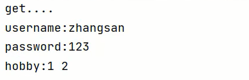

   2. 获取GET请求参数中的爱好，结果是数组值

      ```java
      /**
       * request 通用方式获取请求参数
       */
      @WebServlet("/req2")
      public class RequestDemo2 extends HttpServlet {
          @Override
          protected void doGet(HttpServletRequest req, HttpServletResponse resp) throws ServletException, IOException {
              //GET请求逻辑
              //...
              System.out.println("------------");
              String[] hobbies = req.getParameterValues("hobby");
              for (String hobby : hobbies) {
                  System.out.println(hobby);
              }
          }
      
          @Override
          protected void doPost(HttpServletRequest req, HttpServletResponse resp) throws ServletException, IOException {
          }
      }
      ```

      获取的结果为:

      

   3. 获取GET请求参数中的用户名和密码，结果是单个值

      ```java
      /**
       * request 通用方式获取请求参数
       */
      @WebServlet("/req2")
      public class RequestDemo2 extends HttpServlet {
          @Override
          protected void doGet(HttpServletRequest req, HttpServletResponse resp) throws ServletException, IOException {
              //GET请求逻辑
              //...
              String username = req.getParameter("username");
              String password = req.getParameter("password");
              System.out.println(username);
              System.out.println(password);
          }
      
          @Override
          protected void doPost(HttpServletRequest req, HttpServletResponse resp) throws ServletException, IOException {
          }
      }
      ```

      获取的结果为:

      

3. 在Servlet代码中获取页面传递POST请求的参数值

   1. 将req.html页面form表单的提交方式改成post
   2. 将doGet方法中的内容复制到doPost方法中即可

#### IDEA快速创建Servlet

使用通用方式获取请求参数后，屏蔽了GET和POST的请求方式代码的不同，则代码可以定义如下格式:


由于格式固定，所以我们可以使用IDEA提供的模板来制作一个Servlet的模板，这样我们后期在创建Servlet的时候就会更高效，具体如何实现:

1. 按照自己的需求，修改Servlet创建的模板内容

   

2. 使用servlet模板创建Servlet类

   

#### 请求参数中文乱码问题

问题展示:

1. 将req.html页面的请求方式修改为get

   ```html
   <!DOCTYPE html>
   <html lang="en">
   <head>
       <meta charset="UTF-8">
       <title>Title</title>
   </head>
   <body>
   <form action="/request-demo/req2" method="get">
       <input type="text" name="username"><br>
       <input type="password" name="password"><br>
       <input type="checkbox" name="hobby" value="1"> 游泳
       <input type="checkbox" name="hobby" value="2"> 爬山 <br>
       <input type="submit">
   
   </form>
   </body>
   </html>
   ```

2. 在Servlet方法中获取参数，并打印

   ```java
   /**
    * 中文乱码问题解决方案
    */
   @WebServlet("/req4")
   public class RequestDemo4 extends HttpServlet {
       @Override
       protected void doGet(HttpServletRequest request, HttpServletResponse response) throws ServletException, IOException {
          //1. 获取username
          String username = request.getParameter("username");
          System.out.println(username);
       }
   
       @Override
       protected void doPost(HttpServletRequest request, HttpServletResponse response) throws ServletException, IOException {
           this.doGet(request, response);
       }
   }
   ```

3. 启动服务器，页面上输入中文参数

   

4. 查看控制台打印内容

   

5. 把req.html页面的请求方式改成post,再次发送请求和中文参数

   

6. 查看控制台打印内容，依然为乱码

   

通过上面的案例，会发现，不管是GET还是POST请求，在发送的请求参数中如果有中文，在后台接收的时候，都会出现中文乱码的问题。具体该如何解决呢？

##### POST请求解决方案

分析出现中文乱码的原因：

* POST的请求参数是通过request的getReader()来获取流中的数据
* TOMCAT在获取流的时候采用的编码是ISO-8859-1
* ISO-8859-1编码是不支持中文的，所以会出现乱码

解决方案：

* 页面设置的编码格式为UTF-8
* 把TOMCAT在获取流数据之前的编码设置为UTF-8
* 通过request.setCharacterEncoding("UTF-8")设置编码,UTF-8也可以写成小写

修改后的代码为:

```java
/**
 * 中文乱码问题解决方案
 */
@WebServlet("/req4")
public class RequestDemo4 extends HttpServlet {
    @Override
    protected void doGet(HttpServletRequest request, HttpServletResponse response) throws ServletException, IOException {
        //1. 解决乱码: POST getReader()
        //设置字符输入流的编码，设置的字符集要和页面保持一致
        request.setCharacterEncoding("UTF-8");
       //2. 获取username
       String username = request.getParameter("username");
       System.out.println(username);
    }

    @Override
    protected void doPost(HttpServletRequest request, HttpServletResponse response) throws ServletException, IOException {
        this.doGet(request, response);
    }
}
```

重新发送POST请求，就会在控制台看到正常展示的中文结果。

至此POST请求中文乱码的问题就已经解决，但是这种方案不适用于GET请求，这个原因是什么呢，咱们下面再分析。

##### GET请求解决方案

刚才提到一个问题是：POST请求的中文乱码解决方案为什么不适用GET请求？

* GET请求获取请求参数的方式是`request.getQueryString()`
* POST请求获取请求参数的方式是`request.getReader()`
* request.setCharacterEncoding("utf-8")是设置request处理流的编码
* getQueryString方法并没有通过流的方式获取数据

所以GET请求不能用设置编码的方式来解决中文乱码问题，那问题又来了，如何解决GET请求的中文乱码呢? 

首先我们需要先分析下GET请求出现乱码的原因：


1. 浏览器通过HTTP协议发送请求和数据给后台服务器（Tomcat)
2. 浏览器在发送HTTP的过程中会对中文数据进行URL编码
3. 在进行URL编码的时候会采用页面`<meta>`标签指定的UTF-8的方式进行编码，`张三`编码后的结果为`%E5%BC%A0%E4%B8%89`
4. 后台服务器(Tomcat)接收到`%E5%BC%A0%E4%B8%89`后会默认按照`ISO-8859-1`进行URL解码
5. 由于前后编码与解码采用的格式不一样，就会导致后台获取到的数据为乱码。

思考: 如果把`req.html`页面的`<meta>`标签的charset属性改成`ISO-8859-1`,后台不做操作，能解决中文乱码问题么?

答案是否定的，因为`ISO-8859-1`本身是不支持中文展示的，所以改了<meta>标签的charset属性后，会导致页面上的中文内容都无法正常展示。

分析完上面的问题后，我们会发现，其中有两个我们不熟悉的内容就是URL编码和URL解码，什么是URL编码，什么又是URL解码呢?

###### URL编码

这块知识我们只需要了解下即可,具体编码过程分两步，分别是:

1. 将字符串按照编码方式转为二进制
2. 每个字节转为2个16进制数并在前边加上%

`张三`按照UTF-8的方式转换成二进制的结果为:

```
1110 0101 1011 1100 1010 0000 1110 0100 1011 1000 1000 1001
```

这个结果是如何计算的?

使用`http://www.mytju.com/classcode/tools/encode_utf8.asp`，输入`张三`


就可以获取张和三分别对应的10进制，然后在使用计算器，选择程序员模式，计算出对应的二进制数据结果:


在计算的十六进制结果中，每两位前面加一个%,就可以获取到`%E5%BC%A0%E4%B8%89`。当然你从上面所提供的网站中就已经能看到编码16进制的结果了:


但是对于上面的计算过程，如果没有工具，纯手工计算的话，相对来说还是比较复杂的，我们也不需要进行手动计算，在Java中已经为我们提供了编码和解码的API工具类可以让我们更快速的进行编码和解码:

编码:

```java
java.net.URLEncoder.encode("需要被编码的内容","字符集(UTF-8)")
```

解码:

```java
java.net.URLDecoder.decode("需要被解码的内容","字符集(UTF-8)")
```

接下来咱们对`张三`来进行编码和解码

```java
public class URLDemo {

  public static void main(String[] args) throws UnsupportedEncodingException {
        String username = "张三";
        //1. URL编码
        String encode = URLEncoder.encode(username, "utf-8");
        System.out.println(encode); //打印:%E5%BC%A0%E4%B8%89

       //2. URL解码
       //String decode = URLDecoder.decode(encode, "utf-8");//打印:张三
       String decode = URLDecoder.decode(encode, "ISO-8859-1");//打印:`å¼ ä¸ `
       System.out.println(decode);
    }
}
```

到这，我们就可以分析出GET请求中文参数出现乱码的原因了：

* 浏览器把中文参数按照`UTF-8`进行URL编码
* Tomcat对获取到的内容进行了`ISO-8859-1`的URL解码
* 在控制台就会出现类上`å¼ ä¸‰`的乱码，最后一位是个空格

清楚了出现乱码的原因，接下来我们就需要想办法进行解决


从上图可以看到：在进行编码和解码的时候，不管使用的是哪个字符集，他们对应的`%E5%BC%A0%E4%B8%89`是一致的。那他们对应的二进制值也是一样的。

```
1110 0101 1011 1100 1010 0000 1110 0100 1011 1000 1000 1001
```

所以我们可以考虑把`å¼ ä¸‰`转换成字节，在把字节转换成`张三`，在转换的过程中是它们的编码一致，就可以解决中文乱码问题。

具体的实现步骤为:

1. 按照ISO-8859-1编码获取乱码`å¼ ä¸‰`对应的字节数组
2. 按照UTF-8编码获取字节数组对应的字符串

实现代码如下:

```java
public class URLDemo {

  public static void main(String[] args) throws UnsupportedEncodingException {
        String username = "张三";
        //1. URL编码
        String encode = URLEncoder.encode(username, "utf-8");
        System.out.println(encode);
        //2. URL解码
        String decode = URLDecoder.decode(encode, "ISO-8859-1");

        System.out.println(decode); //此处打印的是对应的乱码数据

        //3. 转换为字节数据,编码
        byte[] bytes = decode.getBytes("ISO-8859-1");
        for (byte b : bytes) {
            System.out.print(b + " ");
        }
		//此处打印的是:-27 -68 -96 -28 -72 -119
        //4. 将字节数组转为字符串，解码
        String s = new String(bytes, "utf-8");
        System.out.println(s); //此处打印的是张三
    }
}
```

说明：在第18行中打印的数据是`-27 -68 -96 -28 -72 -119`和`张三`转换成的二进制数据`1110 0101 1011 1100 1010 0000 1110 0100 1011 1000 1000 1001`为什么不一样呢？

其实打印出来的是十进制数据，我们只需要使用计算机换算下就能得到他们的对应关系，如下图:


至此对于GET请求中文乱码的解决方案，我们就已经分析完了，最后在代码中去实现下:

```java
/**
 * 中文乱码问题解决方案
 */
@WebServlet("/req4")
public class RequestDemo4 extends HttpServlet {
    @Override
    protected void doGet(HttpServletRequest request, HttpServletResponse response) throws ServletException, IOException {
        //1. 解决乱码：POST，getReader()
        //request.setCharacterEncoding("UTF-8");//设置字符输入流的编码

        //2. 获取username
        String username = request.getParameter("username");
        System.out.println("解决乱码前："+username);

        //3. GET,获取参数的方式：getQueryString
        // 乱码原因：tomcat进行URL解码，默认的字符集ISO-8859-1
       /* //3.1 先对乱码数据进行编码：转为字节数组
        byte[] bytes = username.getBytes(StandardCharsets.ISO_8859_1);
        //3.2 字节数组解码
        username = new String(bytes, StandardCharsets.UTF_8);*/

        username  = new String(username.getBytes(StandardCharsets.ISO_8859_1),StandardCharsets.UTF_8);

        System.out.println("解决乱码后："+username);

    }

    @Override
    protected void doPost(HttpServletRequest request, HttpServletResponse response) throws ServletException, IOException {
        this.doGet(request, response);
    }
}
```

注意：把`request.setCharacterEncoding("UTF-8")`代码注释掉后，会发现GET请求参数乱码解决方案同时也可也把POST请求参数乱码的问题也解决了。只不过对于POST请求参数一般都会比较多，采用这种方式解决乱码起来比较麻烦，所以对于POST请求还是建议使用设置编码的方式进行。

另外需要说明一点的是Tomcat8.0之后，已将GET请求乱码问题解决，设置默认的解码方式为UTF-8。

#### Request请求转发

请求转发(forward)：一种在服务器内部的资源跳转方式。

1. 浏览器发送请求给服务器，服务器中对应的资源A接收到请求
2. 资源A处理完请求后将请求发给资源B
3. 资源B处理完后将结果响应给浏览器
4. 请求从资源A到资源B的过程就叫请求转发


##### 请求转发的实现方式

```
req.getRequestDispatcher("资源B路径").forward(req,resp);
```

具体如何来使用，我们先来看下需求:


针对上述需求，具体的实现步骤为:

1. 创建一个RequestDemo5类，接收/req5的请求，在doGet方法中打印`demo5`

   ```java
   /**
    * 请求转发
    */
   @WebServlet("/req5")
   public class RequestDemo5 extends HttpServlet {
       @Override
       protected void doGet(HttpServletRequest request, HttpServletResponse response) throws ServletException, IOException {
           System.out.println("demo5...");
       }
   
       @Override
       protected void doPost(HttpServletRequest request, HttpServletResponse response) throws ServletException, IOException {
           this.doGet(request, response);
       }
   }
   ```

2. 创建一个RequestDemo6类，接收/req6的请求，在doGet方法中打印`demo6`

   ```java
   /**
    * 请求转发
    */
   @WebServlet("/req6")
   public class RequestDemo6 extends HttpServlet {
       @Override
       protected void doGet(HttpServletRequest request, HttpServletResponse response) throws ServletException, IOException {
           System.out.println("demo6...");
       }
   
       @Override
       protected void doPost(HttpServletRequest request, HttpServletResponse response) throws ServletException, IOException {
           this.doGet(request, response);
       }
   }
   ```

3. 在RequestDemo5的方法中使用`req.getRequestDispatcher("/req6").forward(req,resp)`进行请求转发

   ```java
   /**
    * 请求转发
    */
   @WebServlet("/req5")
   public class RequestDemo5 extends HttpServlet {
       @Override
       protected void doGet(HttpServletRequest request, HttpServletResponse response) throws ServletException, IOException {
           System.out.println("demo5...");
           //请求转发
           request.getRequestDispatcher("/req6").forward(request,response);
       }
   
       @Override
       protected void doPost(HttpServletRequest request, HttpServletResponse response) throws ServletException, IOException {
           this.doGet(request, response);
       }
   }
   ```

4. 启动测试

   访问`http://localhost:8080/request-demo/req5`,就可以在控制台看到如下内容:

   

   说明请求已经转发到了`/req6`

##### 请求转发资源间共享数据

请求转发资源间共享数据：使用Request对象

此处主要解决的问题是把请求从`/req5`转发到`/req6`的时候，如何传递数据给`/req6`。需要使用request对象提供的三个方法:

* 存储数据到request域[范围,数据是存储在request对象]中

  ```
  void setAttribute(String name,Object o);
  ```

* 根据key获取值

  ```
  Object getAttribute(String name);
  ```

* 根据key删除该键值对

  ```
  void removeAttribute(String name);
  ```

接着上个需求：


1. 在RequestDemo5的doGet方法中转发请求之前，将数据存入request域对象中

   ```java
   @WebServlet("/req5")
   public class RequestDemo5 extends HttpServlet {
       @Override
       protected void doGet(HttpServletRequest request, HttpServletResponse response) throws ServletException, IOException {
           System.out.println("demo5...");
           //存储数据
           request.setAttribute("msg","hello");
           //请求转发
           request.getRequestDispatcher("/req6").forward(request,response);
   
       }
   
       @Override
       protected void doPost(HttpServletRequest request, HttpServletResponse response) throws ServletException, IOException {
           this.doGet(request, response);
       }
   }
   ```

2. 在RequestDemo6的doGet方法从request域对象中获取数据，并将数据打印到控制台

   ```java
   /**
    * 请求转发
    */
   @WebServlet("/req6")
   public class RequestDemo6 extends HttpServlet {
       @Override
       protected void doGet(HttpServletRequest request, HttpServletResponse response) throws ServletException, IOException {
           System.out.println("demo6...");
           //获取数据
           Object msg = request.getAttribute("msg");
           System.out.println(msg);
   
       }
   
       @Override
       protected void doPost(HttpServletRequest request, HttpServletResponse response) throws ServletException, IOException {
           this.doGet(request, response);
       }
   }
   ```

3. 启动访问测试

   访问`http://localhost:8080/request-demo/req5`,就可以在控制台看到如下内容:

   

   此时就可以实现在转发多个资源之间共享数据

##### 请求转发的特点

* 浏览器地址栏路径不发生变化：虽然后台从`/req5`转发到`/req6`,但是浏览器的地址一直是`/req5`,未发生变化

  

* 只能转发到当前服务器的内部资源：不能从一个服务器通过转发访问另一台服务器

* 一次请求，可以在转发资源间使用request共享数据：虽然后台从`/req5`转发到`/req6`，但是这个只有一次请求

### Response对象

前面讲解完Request对象，接下来我们回到刚开始的那张图:


* Request:使用request对象来获取请求数据
* Response:使用response对象来设置响应数据

Reponse的继承体系和Request的继承体系也非常相似:


介绍完Response的相关体系结构后，接下来对于Response我们需要学习如下内容:

* Response设置响应数据的功能介绍
* Response完成重定向
* Response响应字符数据
* Response响应字节数据

#### Response设置响应数据功能介绍

HTTP响应数据总共分为三部分内容，分别是响应行、响应头、响应体，对于这三部分内容的数据，respone对象都提供了哪些方法来进行设置?

1. 响应行

   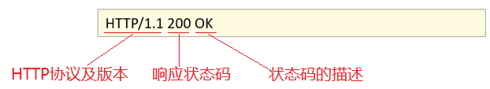

   对于响应头，比较常用的就是设置响应状态码:

   ```
   void setStatus(int sc);
   ```

2. 响应头

   

   设置响应头键值对：

   ```
   void setHeader(String name,String value);
   ```

3. 响应体

   

   对于响应体，是通过字符、字节输出流的方式往浏览器写。

   获取字符输出流:

   ```
   PrintWriter getWriter();
   ```

   获取字节输出流：

   ```
   ServletOutputStream getOutputStream();
   ```

介绍完这些方法后，后面我们会通过案例把这些方法都用一用，首先先来完成下重定向的功能开发。

#### Respones请求重定向

Response重定向(redirect):一种资源跳转方式。


1. 浏览器发送请求给服务器，服务器中对应的资源A接收到请求
2. 资源A现在无法处理该请求，就会给浏览器响应一个302的状态码+location的一个访问资源B的路径
3. 浏览器接收到响应状态码为302就会重新发送请求到location对应的访问地址去访问资源B
4. 资源B接收到请求后进行处理并最终给浏览器响应结果，这整个过程就叫重定向

##### 重定向的实现方式

```
resp.setStatus(302);
resp.setHeader("location","资源B的访问路径");
```

具体如何来使用，我们先来看下需求:

针对上述需求，具体的实现步骤为:

1. 创建ResponseDemo1类

   ```java
   @WebServlet("/resp1")
   public class ResponseDemo1 extends HttpServlet {
       @Override
       protected void doGet(HttpServletRequest request, HttpServletResponse response) throws ServletException, IOException {
           System.out.println("resp1....");
       }
   
       @Override
       protected void doPost(HttpServletRequest request, HttpServletResponse response) throws ServletException, IOException {
           this.doGet(request, response);
       }
   }
   ```

2. 创建ResponseDemo2类

   ```java
   @WebServlet("/resp2")
   public class ResponseDemo2 extends HttpServlet {
       @Override
       protected void doGet(HttpServletRequest request, HttpServletResponse response) throws ServletException, IOException {
           System.out.println("resp2....");
       }
   
       @Override
       protected void doPost(HttpServletRequest request, HttpServletResponse response) throws ServletException, IOException {
           this.doGet(request, response);
       }
   }
   ```

3. 在ResponseDemo1的doGet方法中给前端响应数据

   ```java
   @WebServlet("/resp1")
   public class ResponseDemo1 extends HttpServlet {
       @Override
       protected void doGet(HttpServletRequest request, HttpServletResponse response) throws ServletException, IOException {
           System.out.println("resp1....");
           //重定向
           //1.设置响应状态码 302
           response.setStatus(302);
           //2. 设置响应头 Location
           response.setHeader("Location","/request-demo/resp2");
       }
   
       @Override
       protected void doPost(HttpServletRequest request, HttpServletResponse response) throws ServletException, IOException {
           this.doGet(request, response);
       }
   }
   ```

4. 启动测试

   访问`http://localhost:8080/request-demo/resp1`,就可以在控制台看到如下内容:

   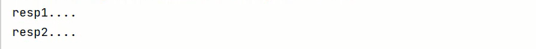

   说明`/resp1`和`/resp2`都被访问到了。到这重定向就已经完成了。

   虽然功能已经实现，但是从设置重定向的两行代码来看，会发现除了重定向的地址不一样，其他的内容都是一模一样，所以request对象给我们提供了简化的编写方式为:

   ```
   resposne.sendRedirect("/request-demo/resp2")
   ```

   所以第3步中的代码就可以简化为：

   ```java
   @WebServlet("/resp1")
   public class ResponseDemo1 extends HttpServlet {
       @Override
       protected void doGet(HttpServletRequest request, HttpServletResponse response) throws ServletException, IOException {
           System.out.println("resp1....");
           //重定向
           resposne.sendRedirect("/request-demo/resp2")；
       }
   
       @Override
       protected void doPost(HttpServletRequest request, HttpServletResponse response) throws ServletException, IOException {
           this.doGet(request, response);
       }
   }
   ```

##### 重定向的特点

* 浏览器地址栏路径发送变化

  当进行重定向访问的时候，由于是由浏览器发送的两次请求，所以地址会发生变化

  

* 可以重定向到任何位置的资源(服务内容、外部均可)

  因为第一次响应结果中包含了浏览器下次要跳转的路径，所以这个路径是可以任意位置资源。

* 两次请求，不能在多个资源使用request共享数据

  因为浏览器发送了两次请求，是两个不同的request对象，就无法通过request对象进行共享数据

介绍完请求重定向和请求转发以后，接下来需要把这两个放在一块对比下:


以后到底用哪个，还是需要根据具体的业务来决定。

#### 路径问题

问题1：转发的时候路径上没有加`/request-demo`而重定向加了，那么到底什么时候需要加，什么时候不需要加呢?


其实判断的依据很简单，只需要记住下面的规则即可:

* 浏览器使用:需要加虚拟目录(项目访问路径)
* 服务端使用:不需要加虚拟目录

对于转发来说，因为是在服务端进行的，所以不需要加虚拟目录。对于重定向来说，路径最终是由浏览器来发送请求，就需要添加虚拟目录。

掌握了这个规则，接下来就通过一些练习来强化下知识的学习:

* `<a href='路劲'>`
* `<form action='路径'>`
* req.getRequestDispatcher("路径")
* resp.sendRedirect("路径")

答案:

```
1.超链接，从浏览器发送，需要加
2.表单，从浏览器发送，需要加
3.转发，是从服务器内部跳转，不需要加
4.重定向，是由浏览器进行跳转，需要加。
```

问题2：在重定向的代码中，`/request-demo`是固定编码的，如果后期通过Tomcat插件配置了项目的访问路径，那么所有需要重定向的地方都需要重新修改，该如何优化?


答案也比较简单，我们可以在代码中动态去获取项目访问的虚拟目录，具体如何获取，我们可以借助前面咱们所学习的request对象中的getContextPath()方法，修改后的代码如下:

```java
@WebServlet("/resp1")
public class ResponseDemo1 extends HttpServlet {
    @Override
    protected void doGet(HttpServletRequest request, HttpServletResponse response) throws ServletException, IOException {
        System.out.println("resp1....");

        //简化方式完成重定向
        //动态获取虚拟目录
        String contextPath = request.getContextPath();
        response.sendRedirect(contextPath+"/resp2");
    }

    @Override
    protected void doPost(HttpServletRequest request, HttpServletResponse response) throws ServletException, IOException {
        this.doGet(request, response);
    }
}
```

重新启动访问测试，功能依然能够实现，此时就可以动态获取项目访问的虚拟路径，从而降低代码的耦合度。

#### Response响应字符数据

要想将字符数据写回到浏览器，我们需要两个步骤:

* 通过Response对象获取字符输出流： PrintWriter writer = resp.getWriter();

* 通过字符输出流写数据: writer.write("aaa");

接下来，我们实现通过些案例把响应字符数据给实际应用下:

1. 返回一个简单的字符串`aaa`

   ```java
   /**
    * 响应字符数据：设置字符数据的响应体
    */
   @WebServlet("/resp3")
   public class ResponseDemo3 extends HttpServlet {
       @Override
       protected void doGet(HttpServletRequest request, HttpServletResponse response) throws ServletException, IOException {
           response.setContentType("text/html;charset=utf-8");
           //1. 获取字符输出流
           PrintWriter writer = response.getWriter();
   		 writer.write("aaa");
       }
       @Override
       protected void doPost(HttpServletRequest request, HttpServletResponse response) throws ServletException, IOException {
           this.doGet(request, response);
       }
   }
   ```

   

2. 返回一串html字符串，并且能被浏览器解析

   ```java
   PrintWriter writer = response.getWriter();
   //content-type，告诉浏览器返回的数据类型是HTML类型数据，这样浏览器才会解析HTML标签
   response.setHeader("content-type","text/html");
   writer.write("<h1>aaa</h1>");
   ```

   

   注意:一次请求响应结束后，response对象就会被销毁掉，所以不要手动关闭流。

3. 返回一个中文的字符串`你好`，需要注意设置响应数据的编码为`utf-8`

   ```java
   //设置响应的数据格式及数据的编码
   response.setContentType("text/html;charset=utf-8");
   writer.write("你好");
   ```

   

#### Response响应字节数据

要想将字节数据写回到浏览器，我们需要两个步骤:

- 通过Response对象获取字节输出流：ServletOutputStream outputStream = resp.getOutputStream();

- 通过字节输出流写数据: outputStream.write(字节数据);

接下来，我们实现通过些案例把响应字符数据给实际应用下:

返回一个图片文件到浏览器

```java
/**
 * 响应字节数据：设置字节数据的响应体
 */
@WebServlet("/resp4")
public class ResponseDemo4 extends HttpServlet {
    @Override
    protected void doGet(HttpServletRequest request, HttpServletResponse response) throws ServletException, IOException {
        //1. 读取文件
        FileInputStream fis = new FileInputStream("d://a.jpg");
        //2. 获取response字节输出流
        ServletOutputStream os = response.getOutputStream();
        //3. 完成流的copy
        byte[] buff = new byte[1024];
        int len = 0;
        while ((len = fis.read(buff))!= -1){
            os.write(buff,0,len);
        }
        fis.close();
    }

    @Override
    protected void doPost(HttpServletRequest request, HttpServletResponse response) throws ServletException, IOException {
        this.doGet(request, response);
    }
}
```

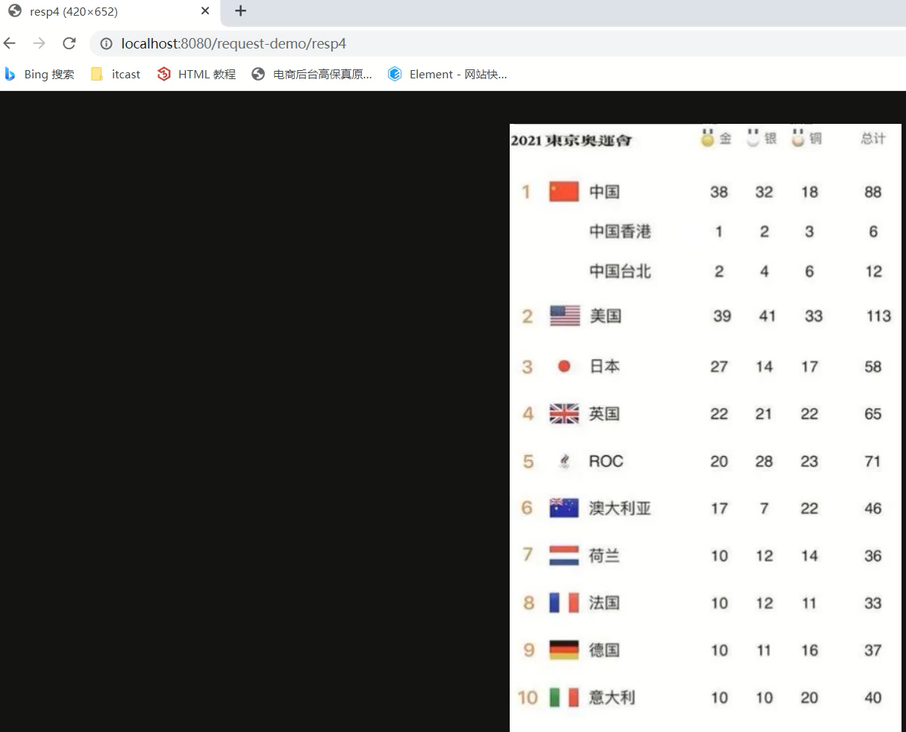

上述代码中，对于流的copy的代码还是比较复杂的，所以我们可以使用别人提供好的方法来简化代码的开发，具体的步骤是:

1. pom.xml添加依赖

   ```xml
   <dependency>
       <groupId>commons-io</groupId>
       <artifactId>commons-io</artifactId>
       <version>2.6</version>
   </dependency>
   ```

2. 调用工具类方法

   ```
   //fis:输入流
   //os:输出流
   IOUtils.copy(fis,os);
   ```

优化后的代码:

```java
/**
 * 响应字节数据：设置字节数据的响应体
 */
@WebServlet("/resp4")
public class ResponseDemo4 extends HttpServlet {
    @Override
    protected void doGet(HttpServletRequest request, HttpServletResponse response) throws ServletException, IOException {
        //1. 读取文件
        FileInputStream fis = new FileInputStream("d://a.jpg");
        //2. 获取response字节输出流
        ServletOutputStream os = response.getOutputStream();
        //3. 完成流的copy
      	IOUtils.copy(fis,os);
        fis.close();
    }

    @Override
    protected void doPost(HttpServletRequest request, HttpServletResponse response) throws ServletException, IOException {
        this.doGet(request, response);
    }
}
```

> 本章Request和Response项目案例省略，想看去原笔记素材看

## JSP

### JSP 概述

JSP（全称：Java Server Pages）：Java 服务端页面。是一种动态的网页技术，其中既可以定义 HTML、JS、CSS等静态内容，还可以定义 Java代码的动态内容，也就是 `JSP = HTML + Java`。如下就是jsp代码

```jsp
<html>
    <head>
        <title>Title</title>
    </head>
    <body>
        <h1>JSP,Hello World</h1>
        <%
        	System.out.println("hello,jsp~");
        %>
    </body>
</html>
```

上面代码 `h1` 标签内容是展示在页面上，而 Java 的输出语句是输出在 idea 的控制台。

那么，JSP 能做什么呢？现在我们只用 `servlet` 实现功能，看存在什么问题。如下图所示，当我们登陆成功后，需要在页面上展示用户名

 

上图的用户名是动态展示，也就是谁登陆就展示谁的用户名。只用 `servlet` 如何实现呢？在今天的资料里已经提供好了一个 `LoginServlet` ，该 `servlet` 就是实现这个功能的，现将资料中的 `LoginServlet.java` 拷贝到 `request-demo` 项目中来演示。接下来启动服务器并访问登陆页面


输入了 `zhangsan` 用户的登陆信息后点击 `登陆` 按钮，就能看到如下图效果


当然如果是 `lisi` 登陆的，在该页面展示的就是 `lisi,欢迎您`，动态的展示效果就实现了。那么 `LoginServlet` 到底是如何实现的，我们看看它里面的内容


上面的代码有大量使用到 `writer` 对象向页面写标签内容，这样我们的代码就显得很麻烦；将来如果展示的效果出现了问题，排错也显得有点力不从心。而 JSP 是如何解决这个问题的呢？在资料中也提供了一个 `login.jsp` 页面，该页面也能实现该功能，现将该页面拷贝到项目的 `webapp`下，需要修改 `login.html` 中表单数据提交的路径为下图


重新启动服务器并进行测试，发现也可以实现同样的功能。那么 `login.jsp` 又是如何实现的呢？那我们来看看 `login.jsp` 的代码


上面代码可以看到里面基本都是 `HTML` 标签，而动态数据使用 Java 代码进行展示；这样操作看起来要比用 `servlet` 实现要舒服很多。

JSP 作用：简化开发，避免了在Servlet中直接输出HTML标签。

### JSP 快速入门

#### 搭建环境

创建一个maven的 web 项目，项目结构如下：


`pom.xml` 文件内容如下：

```xml
<?xml version="1.0" encoding="UTF-8"?>
<project xmlns="http://maven.apache.org/POM/4.0.0"
         xmlns:xsi="http://www.w3.org/2001/XMLSchema-instance"
         xsi:schemaLocation="http://maven.apache.org/POM/4.0.0 http://maven.apache.org/xsd/maven-4.0.0.xsd">
    <modelVersion>4.0.0</modelVersion>

    <groupId>org.example</groupId>
    <artifactId>jsp-demo</artifactId>
    <version>1.0-SNAPSHOT</version>
    <packaging>war</packaging>

    <properties>
        <maven.compiler.source>8</maven.compiler.source>
        <maven.compiler.target>8</maven.compiler.target>
    </properties>

    <dependencies>
      <dependency>
            <groupId>javax.servlet</groupId>
            <artifactId>javax.servlet-api</artifactId>
            <version>3.1.0</version>
            <scope>provided</scope>
        </dependency>
    </dependencies>

    <build>
        <plugins>
            <plugin>
                <groupId>org.apache.tomcat.maven</groupId>
                <artifactId>tomcat7-maven-plugin</artifactId>
                <version>2.2</version>
            </plugin>
        </plugins>
    </build>
</project>
```

#### 导入 JSP 依赖

 `dependencies` 标签中导入 JSP 的依赖，如下

```xml
<dependency>
    <groupId>javax.servlet.jsp</groupId>
    <artifactId>jsp-api</artifactId>
    <version>2.2</version>
    <scope>provided</scope>
</dependency>
```

该依赖的 `scope` 必须设置为 `provided`，因为 tomcat 中有这个jar包了，所以在打包时我们是不希望将该依赖打进到我们工程的war包中。

#### 创建 jsp 页面

在项目的 `webapp` 下创建jsp页面


通过上面方式创建一个名为 `hello.jsp` 的页面。

#### 编写代码

在 `hello.jsp` 页面中书写 `HTML` 标签和 `Java` 代码，如下

```jsp
<%@ page contentType="text/html;charset=UTF-8" language="java" %>
<html>
<head>
    <title>Title</title>
</head>
<body>
    <h1>hello jsp</h1>

    <%
        System.out.println("hello,jsp~");
    %>
</body>
</html>
```

#### 测试

启动服务器并在浏览器地址栏输入 `http://localhost:8080/jsp-demo/hello.jsp`，我们可以在页面上看到如下内容


同时也可以看到在 `idea` 的控制台看到输出的 `hello,jsp~` 内容。

### JSP 原理

我们之前说 JSP 就是一个页面，那么在 JSP 中写 `html` 标签，我们能理解，但是为什么还可以写 `Java` 代码呢？

因为 JSP 本质上就是一个 Servlet。接下来我们聊聊访问jsp时的流程

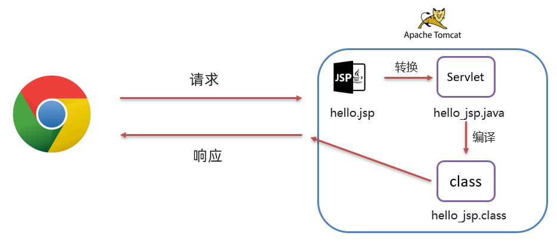

1. 浏览器第一次访问 `hello.jsp` 页面
2. `tomcat` 会将 `hello.jsp` 转换为名为 `hello_jsp.java` 的一个 `Servlet`
3. `tomcat` 再将转换的 `servlet` 编译成字节码文件 `hello_jsp.class`
4. `tomcat` 会执行该字节码文件，向外提供服务

我们可以到项目所在磁盘目录下找 `target\tomcat\work\Tomcat\localhost\jsp-demo\org\apache\jsp` 目录，而这个目录下就能看到转换后的 `servlet`


打开 `hello_jsp.java` 文件，来查看里面的代码

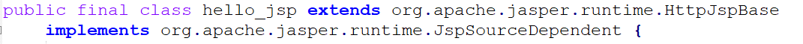

由上面的类的继承关系可以看到继承了名为 `HttpJspBase` 这个类，那我们在看该类的继承关系。到资料中的找如下目录： `资料\tomcat源码\apache-tomcat-8.5.68-src\java\org\apache\jasper\runtime` ，该目录下就有 `HttpJspBase` 类，查看该类的继承关系。


可以看到该类继承了 `HttpServlet` ；那么 `hello_jsp` 这个类就间接的继承了 `HttpServlet` ，也就说明 `hello_jsp` 是一个 `servlet`。

继续阅读 `hello_jsp` 类的代码，可以看到有一个名为 `_jspService()` 的方法，该方法就是每次访问 `jsp` 时自动执行的方法，和 `servlet` 中的 `service` 方法一样 。

而在 `_jspService()` 方法中可以看到往浏览器写标签的代码：


以前我们自己写 `servlet` 时，这部分代码是由我们自己来写，现在有了 `jsp` 后，由tomcat完成这部分功能。

### JSP 脚本

JSP脚本用于在 JSP页面内定义 Java代码。在之前的入门案例中我们就在 JSP 页面定义的 Java 代码就是 JSP 脚本。

#### 分类

JSP 脚本有如下三个分类：

* <%...%>：内容会直接放到_jspService()方法之中
* <%=…%>：内容会放到out.print()中，作为out.print()的参数
* <%!…%>：内容会放到_jspService()方法之外，被类直接包含

**代码演示：**

- 在 `hello.jsp` 中书写

  ```jsp
  <%
      System.out.println("hello,jsp~");
      int i = 3;
  %>
  ```

  通过浏览器访问 `hello.jsp` 后，查看转换的 `hello_jsp.java` 文件，i 变量定义在了 `_jspService()` 方法中

  

- 在 `hello.jsp` 中书写

  ```jsp
  <%="hello"%>
  <%=i%>
  ```

  通过浏览器访问 `hello.jsp` 后，查看转换的 `hello_jsp.java` 文件，该脚本的内容被放在了 `out.print()` 中，作为参数

  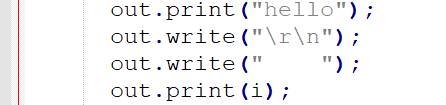

- 在 `hello.jsp` 中书写

  ```jsp
  <%!
      void  show(){}
  	String name = "zhangsan";
  %>
  ```

  通过浏览器访问 `hello.jsp` 后，查看转换的 `hello_jsp.java` 文件，该脚本的内容被放在了成员位置

  

#### 案例

使用JSP脚本展示品牌数据


说明：

* 在资料 `资料\1. JSP案例素材` 中提供了 `brand.html` 静态页面
* 在该案例中数据不从数据库中查询，而是在 JSP 页面上写死

**实现**

* 将资料 `资料\1. JSP案例素材` 中的 `Brand.java` 文件放置到项目的 `com.itheima.pojo` 包下

* 在项目的 `webapp` 中创建 `brand.jsp` ，并将 `brand.html`页面中的内容拷贝过来。`brand.jsp` 内容如下

  ```jsp
  <%@ page contentType="text/html;charset=UTF-8" language="java" %>
  <!DOCTYPE html>
  <html lang="en">
  <head>
      <meta charset="UTF-8">
      <title>Title</title>
  </head>
  <body>
  <input type="button" value="新增"><br>
  <hr>
      <table border="1" cellspacing="0" width="800">
          <tr>
              <th>序号</th>
              <th>品牌名称</th>
              <th>企业名称</th>
              <th>排序</th>
              <th>品牌介绍</th>
              <th>状态</th>
              <th>操作</th>
  
          </tr>
          <tr align="center">
              <td>1</td>
              <td>三只松鼠</td>
              <td>三只松鼠</td>
              <td>100</td>
              <td>三只松鼠，好吃不上火</td>
              <td>启用</td>
              <td><a href="#">修改</a> <a href="#">删除</a></td>
          </tr>
  
          <tr align="center">
              <td>2</td>
              <td>优衣库</td>
              <td>优衣库</td>
              <td>10</td>
              <td>优衣库，服适人生</td>
              <td>禁用</td>
  
              <td><a href="#">修改</a> <a href="#">删除</a></td>
          </tr>
  
          <tr align="center">
              <td>3</td>
              <td>小米</td>
              <td>小米科技有限公司</td>
              <td>1000</td>
              <td>为发烧而生</td>
              <td>启用</td>
  
              <td><a href="#">修改</a> <a href="#">删除</a></td>
          </tr>
      </table>
  </body>
  </html>
  ```

  现在页面中的数据都是假数据。

* 在 `brand.jsp` 中准备一些数据

  ```jsp
  <%
      // 查询数据库
      List<Brand> brands = new ArrayList<Brand>();
      brands.add(new Brand(1,"三只松鼠","三只松鼠",100,"三只松鼠，好吃不上火",1));
      brands.add(new Brand(2,"优衣库","优衣库",200,"优衣库，服适人生",0));
      brands.add(new Brand(3,"小米","小米科技有限公司",1000,"为发烧而生",1));
  %>
  ```

  > 注意：这里的类是需要导包的

* 将 `brand.jsp` 页面中的 `table` 标签中的数据改为动态的

  ```jsp
  <table border="1" cellspacing="0" width="800">
      <tr>
          <th>序号</th>
          <th>品牌名称</th>
          <th>企业名称</th>
          <th>排序</th>
          <th>品牌介绍</th>
          <th>状态</th>
          <th>操作</th>
  
      </tr>
      
      <%
       for (int i = 0; i < brands.size(); i++) {
           //获取集合中的 每一个 Brand 对象
           Brand brand = brands.get(i);
       }
      %>
      <tr align="center">
          <td>1</td>
          <td>三只松鼠</td>
          <td>三只松鼠</td>
          <td>100</td>
          <td>三只松鼠，好吃不上火</td>
          <td>启用</td>
          <td><a href="#">修改</a> <a href="#">删除</a></td>
      </tr>
  </table>
  ```

  上面的for循环需要将 `tr` 标签包裹起来，这样才能实现循环的效果，代码改进为

  ```jsp
  <table border="1" cellspacing="0" width="800">
      <tr>
          <th>序号</th>
          <th>品牌名称</th>
          <th>企业名称</th>
          <th>排序</th>
          <th>品牌介绍</th>
          <th>状态</th>
          <th>操作</th>
  
      </tr>
      
      <%
       for (int i = 0; i < brands.size(); i++) {
           //获取集合中的 每一个 Brand 对象
           Brand brand = brands.get(i);
      %>
      	 <tr align="center">
              <td>1</td>
              <td>三只松鼠</td>
              <td>三只松鼠</td>
              <td>100</td>
              <td>三只松鼠，好吃不上火</td>
              <td>启用</td>
              <td><a href="#">修改</a> <a href="#">删除</a></td>
          </tr>
      <%
       }
      %>
     
  </table>
  ```

  > 注意：<%%> 里面写的是 Java 代码，而外边写的是 HTML 标签

  上面代码中的 `td` 标签中的数据都需要是动态的，所以还需要改进

  ```jsp
  <table border="1" cellspacing="0" width="800">
      <tr>
          <th>序号</th>
          <th>品牌名称</th>
          <th>企业名称</th>
          <th>排序</th>
          <th>品牌介绍</th>
          <th>状态</th>
          <th>操作</th>
  
      </tr>
      
      <%
       for (int i = 0; i < brands.size(); i++) {
           //获取集合中的 每一个 Brand 对象
           Brand brand = brands.get(i);
      %>
      	 <tr align="center">
              <td><%=brand.getId()%></td>
              <td><%=brand.getBrandName()%></td>
              <td><%=brand.getCompanyName()%></td>
              <td><%=brand.getOrdered()%></td>
              <td><%=brand.getDescription()%></td>
              <td><%=brand.getStatus() == 1 ? "启用":"禁用"%></td>
              <td><a href="#">修改</a> <a href="#">删除</a></td>
          </tr>
      <%
       }
      %>
     
  </table>
  ```

**成品代码**

```jsp
<%@ page import="com.itheima.pojo.Brand" %>
<%@ page import="java.util.List" %>
<%@ page import="java.util.ArrayList" %>
<%@ page contentType="text/html;charset=UTF-8" language="java" %>

<%
    // 查询数据库
    List<Brand> brands = new ArrayList<Brand>();
    brands.add(new Brand(1,"三只松鼠","三只松鼠",100,"三只松鼠，好吃不上火",1));
    brands.add(new Brand(2,"优衣库","优衣库",200,"优衣库，服适人生",0));
    brands.add(new Brand(3,"小米","小米科技有限公司",1000,"为发烧而生",1));

%>


<!DOCTYPE html>
<html lang="en">
<head>
    <meta charset="UTF-8">
    <title>Title</title>
</head>
<body>
<input type="button" value="新增"><br>
<hr>
<table border="1" cellspacing="0" width="800">
    <tr>
        <th>序号</th>
        <th>品牌名称</th>
        <th>企业名称</th>
        <th>排序</th>
        <th>品牌介绍</th>
        <th>状态</th>
        <th>操作</th>
    </tr>
    <%
        for (int i = 0; i < brands.size(); i++) {
            Brand brand = brands.get(i);
    %>

    <tr align="center">
        <td><%=brand.getId()%></td>
        <td><%=brand.getBrandName()%></td>
        <td><%=brand.getCompanyName()%></td>
        <td><%=brand.getOrdered()%></td>
        <td><%=brand.getDescription()%></td>
		<td><%=brand.getStatus() == 1 ? "启用":"禁用"%></td>
        <td><a href="#">修改</a> <a href="#">删除</a></td>
    </tr>

    <%
        }
    %>
</table>
</body>
</html>
```

**测试**

在浏览器地址栏输入 `http://localhost:8080/jsp-demo/brand.jsp` ，页面展示效果如下


### JSP 缺点

通过上面的案例，我们可以看到 JSP 的很多缺点。

由于 JSP页面内，既可以定义 HTML 标签，又可以定义 Java代码，造成了以下问题：

* 书写麻烦：特别是复杂的页面

  既要写 HTML 标签，还要写 Java 代码

* 阅读麻烦

  上面案例的代码，相信你后期再看这段代码时还需要花费很长的时间去梳理

* 复杂度高：运行需要依赖于各种环境，JRE，JSP容器，JavaEE…

* 占内存和磁盘：JSP会自动生成.java和.class文件占磁盘，运行的是.class文件占内存

* 调试困难：出错后，需要找到自动生成的.java文件进行调试

* 不利于团队协作：前端人员不会 Java，后端人员不精 HTML

  如果页面布局发生变化，前端工程师对静态页面进行修改，然后再交给后端工程师，由后端工程师再将该页面改为 JSP 页面

由于上述的问题， JSP 已逐渐退出历史舞台，以后开发更多的是使用 HTML +  Ajax 来替代。Ajax 是我们后续会重点学习的技术。有个这个技术后，前端工程师负责前端页面开发，而后端工程师只负责前端代码开发。下来对技术的发展进行简单的说明。


1. 第一阶段：使用 `servlet` 即实现逻辑代码编写，也对页面进行拼接。这种模式我们之前也接触过

2. 第二阶段：随着技术的发展，出现了 `JSP` ，人们发现 `JSP` 使用起来比 `Servlet` 方便很多，但是还是要在 `JSP` 中嵌套 `Java` 代码，也不利于后期的维护

3. 第三阶段：使用 `Servlet` 进行逻辑代码开发，而使用 `JSP` 进行数据展示

   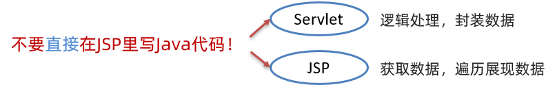

4. 第四阶段：使用 `servlet` 进行后端逻辑代码开发，而使用 `HTML` 进行数据展示。而这里面就存在问题，`HTML` 是静态页面，怎么进行动态数据展示呢？这就是 `ajax` 的作用了。

那既然 JSP 已经逐渐的退出历史舞台，那我们为什么还要学习 `JSP` 呢？原因有两点：

* 一些公司可能有些老项目还在用 `JSP` ，所以要求我们必须动 `JSP`
* 我们如果不经历这些复杂的过程，就不能体现后面阶段开发的简单

接下来我们来学习第三阶段，使用 `EL表达式` 和 `JSTL` 标签库替换 `JSP` 中的 `Java` 代码。

### EL 表达式

EL（全称Expression Language ）表达式语言，用于简化 JSP 页面内的 Java 代码。

EL 表达式的主要作用是 获取数据。其实就是从域对象中获取数据，然后将数据展示在页面上。

而 EL 表达式的语法也比较简单，${expression} 。例如：$​{brands} 就是获取域中存储的 key 为 brands 的数据。

#### 代码演示

* 定义servlet，在 servlet 中封装一些数据并存储到 request 域对象中并转发到 `el-demo.jsp` 页面。

  ```java
  @WebServlet("/demo1")
  public class ServletDemo1 extends HttpServlet {
      @Override
      protected void doGet(HttpServletRequest request, HttpServletResponse response) throws ServletException, IOException {
          //1. 准备数据
          List<Brand> brands = new ArrayList<Brand>();
          brands.add(new Brand(1,"三只松鼠","三只松鼠",100,"三只松鼠，好吃不上火",1));
          brands.add(new Brand(2,"优衣库","优衣库",200,"优衣库，服适人生",0));
          brands.add(new Brand(3,"小米","小米科技有限公司",1000,"为发烧而生",1));
  
          //2. 存储到request域中
          request.setAttribute("brands",brands);
  
          //3. 转发到 el-demo.jsp
          request.getRequestDispatcher("/el-demo.jsp").forward(request,response);
      }
  
      @Override
      protected void doPost(HttpServletRequest request, HttpServletResponse response) throws ServletException, IOException {
          this.doGet(request, response);
      }
  }
  ```

  > 注意： 此处需要用转发，因为转发才可以使用 request 对象作为域对象进行数据共享

* 在 `el-demo.jsp` 中通过 EL表达式 获取数据

  ```jsp
  <%@ page contentType="text/html;charset=UTF-8" language="java" %>
  <html>
  <head>
      <title>Title</title>
  </head>
  <body>
      ${brands}
  </body>
  </html>
  ```

* 在浏览器的地址栏输入 `http://localhost:8080/jsp-demo/demo1` ，页面效果如下：

  

#### 域对象

JavaWeb中有四大域对象，分别是：

* page：当前页面有效
* request：当前请求有效
* session：当前会话有效
* application：当前应用有效

el 表达式获取数据，会依次从这4个域中寻找，直到找到为止。而这四个域对象的作用范围如下图所示

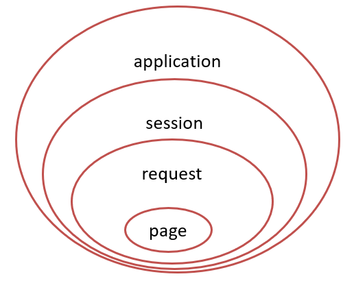

例如： ${brands}，el 表达式获取数据，会先从page域对象中获取数据，如果没有再到 requet 域对象中获取数据，如果再没有再到 session 域对象中获取，如果还没有才会到 application 中获取数据。

### JSTL标签

JSP标准标签库(Jsp Standarded Tag Library) ，使用标签取代JSP页面上的Java代码。如下代码就是JSTL标签

```jsp
<c:if test="${flag == 1}">
    男
</c:if>
<c:if test="${flag == 2}">
    女
</c:if>
```

上面代码看起来是不是比 JSP 中嵌套 Java 代码看起来舒服好了。而且前端工程师对标签是特别敏感的，他们看到这段代码是能看懂的。

JSTL 提供了很多标签，如下图


我们只对两个最常用的标签进行讲解，`<c:forEach>` 标签和 `<c:if>` 标签。

JSTL 使用也是比较简单的，分为如下步骤：

* 导入坐标

  ```xml
  <dependency>
      <groupId>jstl</groupId>
      <artifactId>jstl</artifactId>
      <version>1.2</version>
  </dependency>
  <dependency>
      <groupId>taglibs</groupId>
      <artifactId>standard</artifactId>
      <version>1.1.2</version>
  </dependency>
  ```

* 在JSP页面上引入JSTL标签库

  ```jsp
  <%@ taglib prefix="c" uri="http://java.sun.com/jsp/jstl/core" %> 
  ```

* 使用标签

#### if 标签

`<c:if>`：相当于 if 判断

* 属性：test，用于定义条件表达式

```jsp
<c:if test="${flag == 1}">
    男
</c:if>
<c:if test="${flag == 2}">
    女
</c:if>
```

**代码演示：**

* 定义一个 `servlet` ，在该 `servlet` 中向 request 域对象中添加 键是 `status` ，值为 `1` 的数据

  ```java
  @WebServlet("/demo2")
  public class ServletDemo2 extends HttpServlet {
      @Override
      protected void doGet(HttpServletRequest request, HttpServletResponse response) throws ServletException, IOException {
          //1. 存储数据到request域中
          request.setAttribute("status",1);
  
          //2. 转发到 jstl-if.jsp
          数据request.getRequestDispatcher("/jstl-if.jsp").forward(request,response);
      }
  
      @Override
      protected void doPost(HttpServletRequest request, HttpServletResponse response) throws ServletException, IOException {
          this.doGet(request, response);
      }
  }
  ```

* 定义 `jstl-if.jsp` 页面，在该页面使用 `<c:if>` 标签

  ```jsp
  <%@ page contentType="text/html;charset=UTF-8" language="java" %>
  <%@ taglib prefix="c" uri="http://java.sun.com/jsp/jstl/core" %>
  <html>
  <head>
      <title>Title</title>
  </head>
  <body>
      <%--
          c:if：来完成逻辑判断，替换java  if else
      --%>
      <c:if test="${status ==1}">
          启用
      </c:if>
  
      <c:if test="${status ==0}">
          禁用
      </c:if>
  </body>
  </html>
  ```

  > 注意： 在该页面已经要引入 JSTL核心标签库
  >
  > `<%@ taglib prefix="c" uri="http://java.sun.com/jsp/jstl/core" %>`

#### forEach 标签

`<c:forEach>`：相当于 for 循环。java中有增强for循环和普通for循环，JSTL 中的 `<c:forEach>` 也有两种用法

**用法一**

类似于 Java 中的增强for循环。涉及到的 `<c:forEach>` 中的属性如下

* items：被遍历的容器

* var：遍历产生的临时变量

* varStatus：遍历状态对象

如下代码，是从域对象中获取名为 brands 数据，该数据是一个集合；遍历遍历，并给该集合中的每一个元素起名为 `brand`，是 Brand对象。在循环里面使用 EL表达式获取每一个Brand对象的属性值

```jsp
<c:forEach items="${brands}" var="brand">
    <tr align="center">
        <td>${brand.id}</td>
        <td>${brand.brandName}</td>
        <td>${brand.companyName}</td>
        <td>${brand.description}</td>
    </tr>
</c:forEach>
```

**代码演示：**

* `servlet` 还是使用之前的名为 `ServletDemo1` 。

* 定义名为 `jstl-foreach.jsp` 页面，内容如下：

  ```jsp
  <%@ page contentType="text/html;charset=UTF-8" language="java" %>
  <%@ taglib prefix="c" uri="http://java.sun.com/jsp/jstl/core" %>
  
  <!DOCTYPE html>
  <html lang="en">
  <head>
      <meta charset="UTF-8">
      <title>Title</title>
  </head>
  <body>
  <input type="button" value="新增"><br>
  <hr>
  <table border="1" cellspacing="0" width="800">
      <tr>
          <th>序号</th>
          <th>品牌名称</th>
          <th>企业名称</th>
          <th>排序</th>
          <th>品牌介绍</th>
          <th>状态</th>
          <th>操作</th>
      </tr>
  
      <c:forEach items="${brands}" var="brand" varStatus="status">
          <tr align="center">
              <%--<td>${brand.id}</td>--%>
              <td>${status.count}</td>
              <td>${brand.brandName}</td>
              <td>${brand.companyName}</td>
              <td>${brand.ordered}</td>
              <td>${brand.description}</td>
              <c:if test="${brand.status == 1}">
                  <td>启用</td>
              </c:if>
              <c:if test="${brand.status != 1}">
                  <td>禁用</td>
              </c:if>
              <td><a href="#">修改</a> <a href="#">删除</a></td>
          </tr>
      </c:forEach>
  </table>
  </body>
  </html>
  ```

**用法二**

类似于 Java 中的普通for循环。涉及到的 `<c:forEach>` 中的属性如下

* begin：开始数

* end：结束数

* step：步长

实例代码：

从0循环到10，变量名是 `i` ，每次自增1

```jsp
<c:forEach begin="0" end="10" step="1" var="i">
    ${i}
</c:forEach>
```

## MVC模式和三层架构

MVC 模式和三层架构是一些理论的知识，将来我们使用了它们进行代码开发会让我们代码维护性和扩展性更好。

### MVC模式

MVC 是一种分层开发的模式，其中：

* M：Model，业务模型，处理业务

* V：View，视图，界面展示

* C：Controller，控制器，处理请求，调用模型和视图


控制器（serlvlet）用来接收浏览器发送过来的请求，控制器调用模型（JavaBean）来获取数据，比如从数据库查询数据；控制器获取到数据后再交由视图（JSP）进行数据展示。

**MVC 好处：**

* 职责单一，互不影响。每个角色做它自己的事，各司其职。

* 有利于分工协作。

* 有利于组件重用

### 三层架构

三层架构是将我们的项目分成了三个层面，分别是 `表现层`、`业务逻辑层`、`数据访问层`。


* 数据访问层：对数据库的CRUD基本操作
* 业务逻辑层：对业务逻辑进行封装，组合数据访问层层中基本功能，形成复杂的业务逻辑功能。例如 `注册业务功能` ，我们会先调用 `数据访问层` 的 `selectByName()` 方法判断该用户名是否存在，如果不存在再调用 `数据访问层` 的 `insert()` 方法进行数据的添加操作
* 表现层：接收请求，封装数据，调用业务逻辑层，响应数据

而整个流程是，浏览器发送请求，表现层的Servlet接收请求并调用业务逻辑层的方法进行业务逻辑处理，而业务逻辑层方法调用数据访问层方法进行数据的操作，依次返回到serlvet，然后servlet将数据交由 JSP 进行展示。

三层架构的每一层都有特有的包名称：

* 表现层： `com.itheima.controller` 或者 `com.itheima.web`
* 业务逻辑层：`com.itheima.service`
* 数据访问层：`com.itheima.dao` 或者 `com.itheima.mapper`

后期我们还会学习一些框架，不同的框架是对不同层进行封装的


### MVC 和 三层架构

通过 MVC 和 三层架构 的学习，有些人肯定混淆了。那他们有什么区别和联系？


如上图上半部分是 MVC 模式，上图下半部分是三层架构。 `MVC 模式` 中的 C（控制器）和 V（视图）就是 `三层架构` 中的表现层，而 `MVC 模式` 中的 M（模型）就是 `三层架构` 中的 业务逻辑层 和 数据访问层。

可以将 `MVC 模式` 理解成是一个大的概念，而 `三层架构` 是对 `MVC 模式` 实现架构的思想。 那么我们以后按照要求将不同层的代码写在不同的包下，每一层里功能职责做到单一，将来如果将表现层的技术换掉，而业务逻辑层和数据访问层的代码不需要发生变化。

> 本章JSP和MVC三层架构项目案例省略，想看去原笔记素材看

## 会话技术

### 会话跟踪技术的概述

对于`会话跟踪`这四个词，我们需要拆开来进行解释，首先要理解什么是`会话`，然后再去理解什么是`会话跟踪`:

会话：用户打开浏览器，访问web服务器的资源，会话建立，直到有一方断开连接，会话结束。在一次会话中可以包含多次请求和响应。

从浏览器发出请求到服务端响应数据给前端之后，一次会话(在浏览器和服务器之间)就被建立了。会话被建立后，如果浏览器或服务端都没有被关闭，则会话就会持续建立着。

浏览器和服务器就可以继续使用该会话进行请求发送和响应，上述的整个过程就被称之为会话。

用实际场景来理解下会话，比如在我们访问京东的时候，当打开浏览器进入京东首页后，浏览器和京东的服务器之间就建立了一次会话，后面的搜索商品,查看商品的详情,加入购物车等都是在这一次会话中完成。

思考:下图中总共建立了几个会话?


每个浏览器都会与服务端建立了一个会话，加起来总共是3个会话。

会话跟踪：一种维护浏览器状态的方法，服务器需要识别多次请求是否来自于同一浏览器，以便在同一次会话的多次请求间共享数据。

服务器会收到多个请求，这多个请求可能来自多个浏览器，如上图中的6个请求来自3个浏览器。服务器需要用来识别请求是否来自同一个浏览器。

服务器用来识别浏览器的过程，这个过程就是会话跟踪。服务器识别浏览器后就可以在同一个会话中多次请求之间来共享数据。

那么我们又有一个问题需要思考，一个会话中的多次请求为什么要共享数据呢?有了这个数据共享功能后能实现哪些功能呢?

* 购物车: `加入购物车`和`去购物车结算`是两次请求，但是后面这次请求要想展示前一次请求所添加的商品，就需要用到数据共享。

  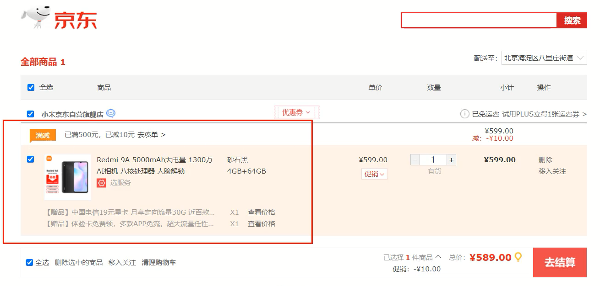

* 页面展示用户登录信息:很多网站，登录后访问多个功能发送多次请求后，浏览器上都会有当前登录用户的信息[用户名]，比如百度、京东、码云等。

  

* 网站登录页面的`记住我`功能:当用户登录成功后，勾选`记住我`按钮后下次再登录的时候，网站就会自动填充用户名和密码，简化用户的登录操作，多次登录就会有多次请求，他们之间也涉及到共享数据

  

* 登录页面的验证码功能:生成验证码和输入验证码点击注册这也是两次请求，这两次请求的数据之间要进行对比，相同则允许注册，不同则拒绝注册，该功能的实现也需要在同一次会话中共享数据。

  

通过这几个例子的讲解，相信大家对`会话追踪`技术已经有了一定的理解，该技术在实际开发中也非常重要。那么接下来我们就需要去学习下`会话跟踪`技术，在学习这些技术之前，我们需要思考:为什么现在浏览器和服务器不支持数据共享呢?

浏览器和服务器之间使用的是HTTP请求来进行数据传输，HTTP协议是无状态的，每次浏览器向服务器请求时，服务器都会将该请求视为新的请求。HTTP协议设计成无状态的目的是让每次请求之间相互独立，互不影响，请求与请求之间独立后，就无法实现多次请求之间的数据共享。

分析完具体的原因后，那么该如何实现会话跟踪技术呢? 具体的实现方式有:

- 客户端会话跟踪技术：Cookie
- 服务端会话跟踪技术：Session

这两个技术都可以实现会话跟踪，它们之间最大的区别:Cookie是存储在浏览器端而Session是存储在服务器端

具体的学习思路为:

* CooKie的基本使用、原理、使用细节
* Session的基本使用、原理、使用细节
* Cookie和Session的综合案例

### Cookie

Cookie：客户端会话技术，将数据保存到客户端，以后每次请求都携带Cookie数据进行访问。

#### Cookie的工作流程

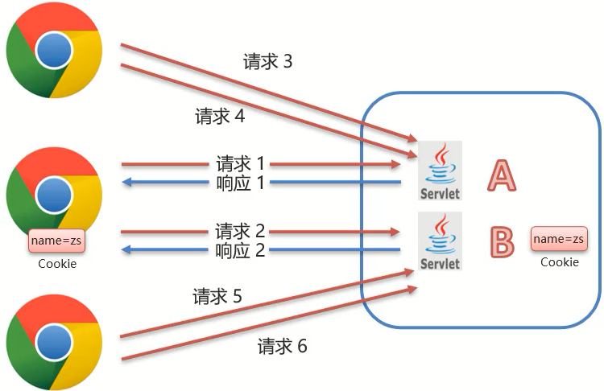

* 服务端提供了两个Servlet，分别是ServletA和ServletB
* 浏览器发送HTTP请求1给服务端，服务端ServletA接收请求并进行业务处理
* 服务端ServletA在处理的过程中可以创建一个Cookie对象并将`name=zs`的数据存入Cookie
* 服务端ServletA在响应数据的时候，会把Cookie对象响应给浏览器
* 浏览器接收到响应数据，会把Cookie对象中的数据存储在浏览器内存中，此时浏览器和服务端就建立了一次会话
* 在同一次会话中浏览器再次发送HTTP请求2给服务端ServletB，浏览器会携带Cookie对象中的所有数据
* ServletB接收到请求和数据后，就可以获取到存储在Cookie对象中的数据，这样同一个会话中的多次请求之间就实现了数据共享

#### Cookie的基本使用

对于Cookie的使用，我们更关注的应该是后台代码如何操作Cookie，对于Cookie的操作主要分两大类，本别是发送Cookie和获取Cookie,对于上面这两块内容，分别该如何实现呢?

##### 发送Cookie

* 创建Cookie对象，并设置数据

  ```
  Cookie cookie = new Cookie("key","value");
  ```

* 发送Cookie到客户端：使用response对象

  ```
  response.addCookie(cookie);
  ```

介绍完发送Cookie对应的步骤后，接下面通过一个案例来完成Cookie的发送。需求:在Servlet中生成Cookie对象并存入数据，然后将数据发送给浏览器。具体实现步骤为:

1. 创建Maven项目cookie-demo，并在pom.xml添加依赖

   ```xml
   <properties>
       <maven.compiler.source>8</maven.compiler.source>
       <maven.compiler.target>8</maven.compiler.target>
   </properties>
   
   <dependencies>
       <!--servlet-->
       <dependency>
           <groupId>javax.servlet</groupId>
           <artifactId>javax.servlet-api</artifactId>
           <version>3.1.0</version>
           <scope>provided</scope>
       </dependency>
       <!--jsp-->
       <dependency>
           <groupId>javax.servlet.jsp</groupId>
           <artifactId>jsp-api</artifactId>
           <version>2.2</version>
           <scope>provided</scope>
       </dependency>
       <!--jstl-->
       <dependency>
           <groupId>jstl</groupId>
           <artifactId>jstl</artifactId>
           <version>1.2</version>
       </dependency>
       <dependency>
           <groupId>taglibs</groupId>
           <artifactId>standard</artifactId>
           <version>1.1.2</version>
       </dependency>
   </dependencies>
   <build>
       <plugins>
           <plugin>
               <groupId>org.apache.tomcat.maven</groupId>
               <artifactId>tomcat7-maven-plugin</artifactId>
               <version>2.2</version>
           </plugin>
       </plugins>
   </build>
   ```

2. 编写Servlet类，名称为AServlet

   ```java
   @WebServlet("/aServlet")
   public class AServlet extends HttpServlet {
       @Override
       protected void doGet(HttpServletRequest request, HttpServletResponse response) throws ServletException, IOException {
   
       }
   
       @Override
       protected void doPost(HttpServletRequest request, HttpServletResponse response) throws ServletException, IOException {
           this.doGet(request, response);
       }
   }
   ```

3. 在Servlet中创建Cookie对象，存入数据，发送给前端

   ```java
   @WebServlet("/aServlet")
   public class AServlet extends HttpServlet {
       @Override
       protected void doGet(HttpServletRequest request, HttpServletResponse response) throws ServletException, IOException {
           //发送Cookie
           //1. 创建Cookie对象
           Cookie cookie = new Cookie("username","zs");
           //2. 发送Cookie，response
           response.addCookie(cookie);
       }
   
       @Override
       protected void doPost(HttpServletRequest request, HttpServletResponse response) throws ServletException, IOException {
           this.doGet(request, response);
       }
   }
   ```

4. 启动测试，在浏览器查看Cookie对象中的值

   访问`http://localhost:8080/cookie-demo/aServlet`，chrome浏览器查看Cookie的值，有两种方式：

   - 方式一：

     

   - 方式二：选中打开开发者工具或者 使用快捷键F12 或者 Ctrl+Shift+I

     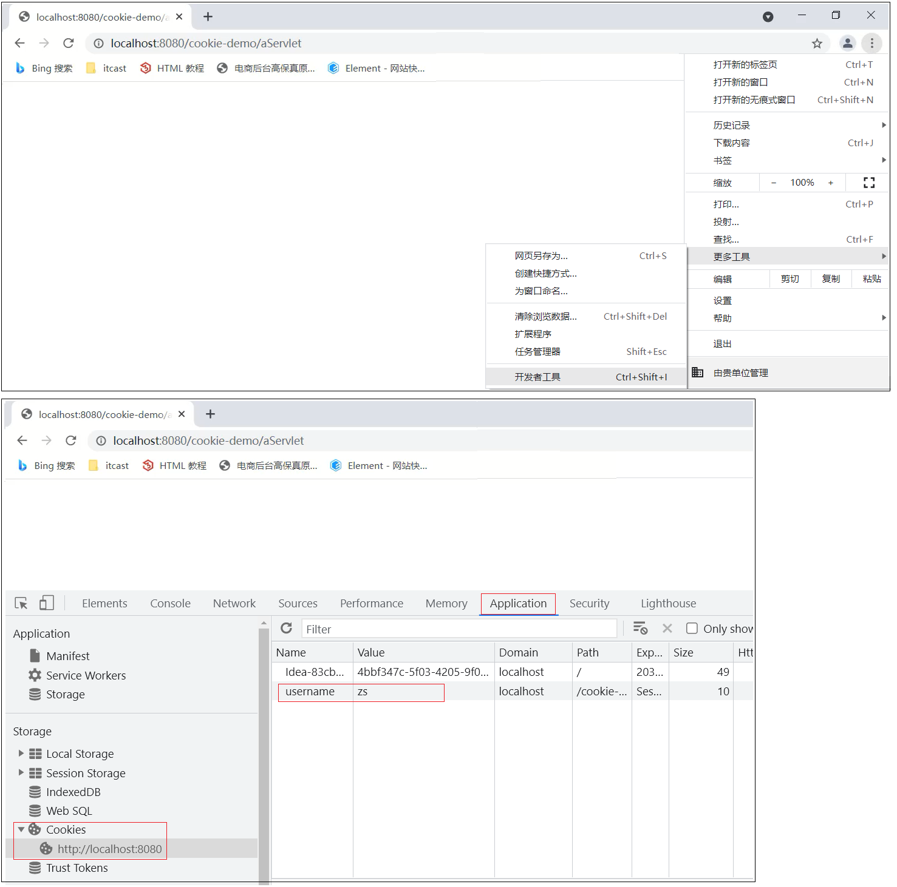

##### 获取Cookie

- 获取客户端携带的所有Cookie，使用request对象

  ```
  Cookie[] cookies = request.getCookies();
  ```

- 遍历数组，获取每一个Cookie对象：for

- 使用Cookie对象方法获取数据

  ```
  cookie.getName();
  cookie.getValue();
  ```

介绍完获取Cookie对应的步骤后，接下面再通过一个案例来完成Cookie的获取。需求:在Servlet中获取前一个案例存入在Cookie对象中的数据具体实现步骤为：

1. 编写一个新Servlet类，名称为BServlet

   ```java
   @WebServlet("/bServlet")
   public class BServlet extends HttpServlet {
       @Override
       protected void doGet(HttpServletRequest request, HttpServletResponse response) throws ServletException, IOException {
   
       }
   
       @Override
       protected void doPost(HttpServletRequest request, HttpServletResponse response) throws ServletException, IOException {
           this.doGet(request, response);
       }
   }
   ```

2. 在BServlet中使用request对象获取Cookie数组，遍历数组，从数据中获取指定名称对应的值

   ```java
   @WebServlet("/bServlet")
   public class BServlet extends HttpServlet {
       @Override
       protected void doGet(HttpServletRequest request, HttpServletResponse response) throws ServletException, IOException {
           //获取Cookie
           //1. 获取Cookie数组
           Cookie[] cookies = request.getCookies();
           //2. 遍历数组
           for (Cookie cookie : cookies) {
               //3. 获取数据
               String name = cookie.getName();
               if("username".equals(name)){
                   String value = cookie.getValue();
                   System.out.println(name+":"+value);
                   break;
               }
           }
   
       }
   
       @Override
       protected void doPost(HttpServletRequest request, HttpServletResponse response) throws ServletException, IOException {
           this.doGet(request, response);
       }
   }
   ```

3. 启动测试，在控制台打印出获取的值

   访问`http://localhost:8080/cookie-demo/bServlet`

   

   在IDEA控制台就能看到输出的结果：

   

   思考：测试的时候，在访问AServlet和BServlet的中间把关闭浏览器,重启浏览器后访问BServlet能否获取到Cookie中的数据?

   这个问题，我们会在Cookie的使用细节中讲，大家可以动手先试下。

介绍完Cookie的基本使用之后，那么Cookie的底层到底是如何实现一次会话两次请求之间的数据共享呢?

#### Cookie的原理分析

对于Cookie的实现原理是基于HTTP协议的,其中设计到HTTP协议中的两个请求头信息:

* 响应头:set-cookie
* 请求头: cookie


前面的案例中已经能够实现，AServlet给前端发送Cookie,BServlet从request中获取Cookie的功能。对于AServlet响应数据的时候，Tomcat服务器都是基于HTTP协议来响应数据。当Tomcat发现后端要返回的是一个Cookie对象之后，Tomcat就会在响应头中添加一行数据`Set-Cookie:username=zs`。浏览器获取到响应结果后，从响应头中就可以获取到`Set-Cookie`对应值`username=zs`,并将数据存储在浏览器的内存中。浏览器再次发送请求给BServlet的时候，浏览器会自动在请求头中添加`Cookie: username=zs`发送给服务端BServlet。Request对象会把请求头中cookie对应的值封装成一个个Cookie对象，最终形成一个数组。BServlet通过Request对象获取到Cookie[]后，就可以从中获取自己需要的数据。

接下来，使用刚才的案例，把上述结论验证下：

1. 访问AServlet对应的地址`http://localhost:8080/cookie-demo/aServlet`

   使用Chrom浏览器打开开发者工具(F12或Crtl+Shift+I)进行查看响应头中的数据

   

2. 访问BServlet对应的地址`http://localhost:8080/cookie-demo/bServlet

   使用Chrom浏览器打开开发者工具(F12或Crtl+Shift+I)进行查看请求头中的数据

   

#### Cookie的使用细节

在这节我们主要讲解两个知识，第一个是Cookie的存活时间，第二个是Cookie如何存储中文，首先来学习下Cookie的存活时间。

##### Cookie的存活时间

前面让大家思考过一个问题:


浏览器发送请求给AServlet,AServlet会响应一个存有`usernanme=zs`的Cookie对象给浏览器。浏览器接收到响应数据将cookie存入到浏览器内存中，当浏览器再次发送请求给BServlet,BServlet就可以使用Request对象获取到Cookie数据。在发送请求到BServlet之前，如果把浏览器关闭再打开进行访问，BServlet能否获取到Cookie数据?

注意：浏览器关闭再打开不是指打开一个新的选显卡，而且必须是先关闭再打开，顺序不能变。

针对上面这个问题，通过演示，会发现，BServlet中无法再获取到Cookie数据，这是为什么呢?

默认情况下，Cookie存储在浏览器内存中，当浏览器关闭，内存释放，则Cookie被销毁。

这个结论就印证了上面的演示效果，但是如果使用这种默认情况下的Cookie,有些需求就无法实现，比如:


上面这个网站的登录页面上有一个`记住我`的功能，这个功能大家都比较熟悉。

第一次输入用户名和密码并勾选`记住我`然后进行登录，下次再登陆的时候，用户名和密码就会被自动填充，不需要再重新输入登录。比如`记住我`这个功能需要记住用户名和密码一个星期，那么使用默认情况下的Cookie就会出现问题。因为默认情况，浏览器一关，Cookie就会从浏览器内存中删除，对于`记住我`功能就无法实现

所以我们现在就遇到一个难题是如何将Cookie持久化存储?

Cookie其实已经为我们提供好了对应的API来完成这件事，这个API就是setMaxAge。

设置Cookie存活时间：

```
setMaxAge(int seconds)
```

参数值为：

- 正数：将Cookie写入浏览器所在电脑的硬盘，持久化存储。到时间自动删除
- 负数：默认值，Cookie在当前浏览器内存中，当浏览器关闭，则Cookie被销毁
- 零：删除对应Cookie

接下来，咱们就在AServlet中去设置Cookie的存活时间。

```java
@WebServlet("/aServlet")
public class AServlet extends HttpServlet {
    @Override
    protected void doGet(HttpServletRequest request, HttpServletResponse response) throws ServletException, IOException {
        //发送Cookie
        //1. 创建Cookie对象
        Cookie cookie = new Cookie("username","zs");
        //设置存活时间   ，1周 7天
        cookie.setMaxAge(60*60*24*7); //易阅读，需程序计算
		//cookie.setMaxAge(604800); //不易阅读(可以使用注解弥补)，程序少进行一次计算
        //2. 发送Cookie，response
        response.addCookie(cookie);
    }

    @Override
    protected void doPost(HttpServletRequest request, HttpServletResponse response) throws ServletException, IOException {
        this.doGet(request, response);
    }
}
```

修改完代码后，启动测试，访问`http://localhost:8080/cookie-demo/aServlet`

访问一个AServlet后，把浏览器关闭重启后，再去访问`http://localhost:8080/cookie-demo/bServet`,能在控制台打印出`username:zs`,说明Cookie没有随着浏览器关闭而被销毁。

通过浏览器查看Cookie的内容，会发现Cookie的相关信息。


##### Cookie存储中文

首先，先来演示一个效果，将之前`username=zs`的值改成`username=张三`，把汉字`张三`存入到Cookie中，看是什么效果：

```java
@WebServlet("/aServlet")
public class AServlet extends HttpServlet {
    @Override
    protected void doGet(HttpServletRequest request, HttpServletResponse response) throws ServletException, IOException {
 		//发送Cookie
        String value = "张三";
        Cookie cookie = new Cookie("username",value);
        //设置存活时间   ，1周 7天
        cookie.setMaxAge(60*60*24*7);
        //2. 发送Cookie，response
        response.addCookie(cookie);
    }

    @Override
    protected void doPost(HttpServletRequest request, HttpServletResponse response) throws ServletException, IOException {
        this.doGet(request, response);
    }
}
```

启动访问测试，访问`http://localhost:8080/cookie-demo/aServlet`会发现浏览器会提示错误信息


通过上面的案例演示，我们得到一个结论：Cookie不能直接存储中文

Cookie不能存储中文，但是如果有这方面的需求，这个时候该如何解决呢?

这个时候，我们可以使用之前学过的一个知识点叫`URL编码`，所以如果需要存储中文，就需要进行转码，具体的实现思路为:

> 1.在AServlet中对中文进行URL编码，采用URLEncoder.encode()，将编码后的值存入Cookie中
>
> 2.在BServlet中获取Cookie中的值,获取的值为URL编码后的值
>
> 3.将获取的值在进行URL解码,采用URLDecoder.decode()，就可以获取到对应的中文值

1. 在AServlet中对中文进行URL编码

   ```java
   @WebServlet("/aServlet")
   public class AServlet extends HttpServlet {
       @Override
       protected void doGet(HttpServletRequest request, HttpServletResponse response) throws ServletException, IOException {
           //发送Cookie
           String value = "张三";
           //对中文进行URL编码
           value = URLEncoder.encode(value, "UTF-8");
           System.out.println("存储数据："+value);
           //将编码后的值存入Cookie中
           Cookie cookie = new Cookie("username",value);
           //设置存活时间   ，1周 7天
           cookie.setMaxAge(60*60*24*7);
           //2. 发送Cookie，response
           response.addCookie(cookie);
       }
   
       @Override
       protected void doPost(HttpServletRequest request, HttpServletResponse response) throws ServletException, IOException {
           this.doGet(request, response);
       }
   }
   ```

2. 在BServlet中获取值，并对值进行解码

   ```java
   @WebServlet("/bServlet")
   public class BServlet extends HttpServlet {
       @Override
       protected void doGet(HttpServletRequest request, HttpServletResponse response) throws ServletException, IOException {
           //获取Cookie
           //1. 获取Cookie数组
           Cookie[] cookies = request.getCookies();
           //2. 遍历数组
           for (Cookie cookie : cookies) {
               //3. 获取数据
               String name = cookie.getName();
               if("username".equals(name)){
                   String value = cookie.getValue();//获取的是URL编码后的值 %E5%BC%A0%E4%B8%89
                   //URL解码
                   value = URLDecoder.decode(value,"UTF-8");
                   System.out.println(name+":"+value);//value解码后为 张三
                   break;
               }
           }
   
       }
   
       @Override
       protected void doPost(HttpServletRequest request, HttpServletResponse response) throws ServletException, IOException {
           this.doGet(request, response);
       }
   }
   ```

至此，我们就可以将中文存入Cookie中进行使用。

### Session

Session：服务端会话跟踪技术：将数据保存到服务端。Session是存储在服务端而Cookie是存储在客户端，存储在客户端的数据容易被窃取和截获，存在很多不安全的因素。存储在服务端的数据相比于客户端来说就更安全。

#### Session的工作流程


* 在服务端的AServlet获取一个Session对象，把数据存入其中
* 在服务端的BServlet获取到相同的Session对象，从中取出数据
* 就可以实现一次会话中多次请求之间的数据共享了
* 现在最大的问题是如何保证AServlet和BServlet使用的是同一个Session对象(在原理分析会讲解)?

#### Session的基本使用

在JavaEE中提供了HttpSession接口，来实现一次会话的多次请求之间数据共享功能。具体的使用步骤为:

* 获取Session对象,使用的是request对象

  ```
  HttpSession session = request.getSession();
  ```

* Session对象提供的功能:

  * 存储数据到 session 域中

    ```
    void setAttribute(String name, Object o)
    ```

  * 根据 key，获取值

    ```
    Object getAttribute(String name)
    ```

  * 根据 key，删除该键值对

    ```
    void removeAttribute(String name)
    ```

介绍完Session相关的API后，接下来通过一个案例来完成对Session的使用。需求:在一个Servlet中往Session中存入数据，在另一个Servlet中获取Session中存入的数据。具体实现步骤为:

1. 创建名为SessionDemo1的Servlet类

   ```java
   @WebServlet("/demo1")
   public class SessionDemo1 extends HttpServlet {
       @Override
       protected void doGet(HttpServletRequest request, HttpServletResponse response) throws ServletException, IOException {
       
       }
   
       @Override
       protected void doPost(HttpServletRequest request, HttpServletResponse response) throws ServletException, IOException {
           this.doGet(request, response);
       }
   }
   ```

2. 创建名为SessionDemo2的Servlet类

   ```java
   @WebServlet("/demo2")
   public class SessionDemo2 extends HttpServlet {
       @Override
       protected void doGet(HttpServletRequest request, HttpServletResponse response) throws ServletException, IOException {
       
       }
   
       @Override
       protected void doPost(HttpServletRequest request, HttpServletResponse response) throws ServletException, IOException {
           this.doGet(request, response);
       }
   }
   ```

3. SessionDemo1:获取Session对象、存储数据

   ```java
   @WebServlet("/demo1")
   public class SessionDemo1 extends HttpServlet {
       @Override
       protected void doGet(HttpServletRequest request, HttpServletResponse response) throws ServletException, IOException {
       	//存储到Session中
           //1. 获取Session对象
           HttpSession session = request.getSession();
           //2. 存储数据
           session.setAttribute("username","zs");
       }
   
       @Override
       protected void doPost(HttpServletRequest request, HttpServletResponse response) throws ServletException, IOException {
           this.doGet(request, response);
       }
   }
   ```

4. SessionDemo2:获取Session对象、获取数据

   ```java
   @WebServlet("/demo2")
   public class SessionDemo2 extends HttpServlet {
       @Override
       protected void doGet(HttpServletRequest request, HttpServletResponse response) throws ServletException, IOException {
           //获取数据，从session中
           //1. 获取Session对象
           HttpSession session = request.getSession();
           //2. 获取数据
           Object username = session.getAttribute("username");
           System.out.println(username);
       }
   
       @Override
       protected void doPost(HttpServletRequest request, HttpServletResponse response) throws ServletException, IOException {
           this.doGet(request, response);
       }
   }
   ```

5. 启动测试

   - 先访问`http://localhost:8080/cookie-demo/demo1`,将数据存入Session

   - 在访问`http://localhost:8080/cookie-demo/demo2`,从Session中获取数据

   - 查看控制台

     

通过案例的效果，能看到Session是能够在一次会话中两次请求之间共享数据。

#### Session的原理分析

Session是基于Cookie实现的。

这句话其实不太能详细的说明Session的底层实现，接下来，咱们一步步来分析下Session的具体实现原理：


Session要想实现一次会话多次请求之间的数据共享，就必须要保证多次请求获取Session的对象是同一个。

那么它们是一个对象么？要验证这个结论也很简单，只需要在上面案例中的两个Servlet中分别打印下Session对象

- SessionDemo1

  ```java
  @WebServlet("/demo1")
  public class SessionDemo1 extends HttpServlet {
      @Override
      protected void doGet(HttpServletRequest request, HttpServletResponse response) throws ServletException, IOException {
      	//存储到Session中
          //1. 获取Session对象
          HttpSession session = request.getSession();
          System.out.println(session);
          //2. 存储数据
          session.setAttribute("username","zs");
      }
  
      @Override
      protected void doPost(HttpServletRequest request, HttpServletResponse response) throws ServletException, IOException {
          this.doGet(request, response);
      }
  }
  ```

- SessionDemo2

  ```java
  @WebServlet("/demo2")
  public class SessionDemo2 extends HttpServlet {
      @Override
      protected void doGet(HttpServletRequest request, HttpServletResponse response) throws ServletException, IOException {
          //获取数据，从session中
          //1. 获取Session对象
          HttpSession session = request.getSession();
          System.out.println(session);
          //2. 获取数据
          Object username = session.getAttribute("username");
          System.out.println(username);
      }
  
      @Override
      protected void doPost(HttpServletRequest request, HttpServletResponse response) throws ServletException, IOException {
          this.doGet(request, response);
      }
  }
  ```

- 启动测试，分别访问

  `http://localhost:8080/cookie-demo/demo1`

  `http://localhost:8080/cookie-demo/demo2`

  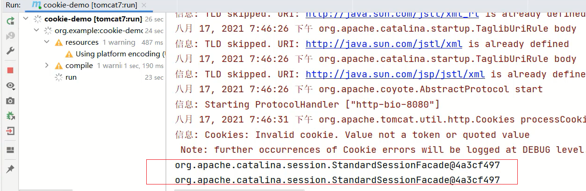

  通过打印可以得到如下结论:

  - 两个Servlet类中获取的Session对象是同一个
  - 把demo1和demo2请求刷新多次，控制台最终打印的结果都是同一个

那么问题又来了，如果新开一个浏览器，访问demo1或者demo2,打印在控制台的Session还是同一个对象么?


注意:在一台电脑上演示的时候，如果是相同的浏览器必须要把浏览器全部关掉重新打开，才算新开的一个浏览器。当然也可以使用不同的浏览器进行测试，就不需要把之前的浏览器全部关闭。

测试的结果：如果是不同浏览器或者重新打开浏览器后，打印的Session就不一样了。所以Session实现的也是一次会话中的多次请求之间的数据共享。

那么最主要的问题就来了，Session是如何保证在一次会话中获取的Session对象是同一个呢?


1. demo1在第一次获取session对象的时候，session对象会有一个唯一的标识，假如是`id:10`
2. demo1在session中存入其他数据并处理完成所有业务后，需要通过Tomcat服务器响应结果给浏览器
3. Tomcat服务器发现业务处理中使用了session对象，就会把session的唯一标识`id:10`当做一个cookie，添加`Set-Cookie:JESSIONID=10`到响应头中，并响应给浏览器
4. 浏览器接收到响应结果后，会把响应头中的coookie数据存储到浏览器的内存中
5. 浏览器在同一会话中访问demo2的时候，会把cookie中的数据按照`cookie: JESSIONID=10`的格式添加到请求头中并发送给服务器Tomcat
6. demo2获取到请求后，从请求头中就读取cookie中的JSESSIONID值为10，然后就会到服务器内存中寻找`id:10`的session对象，如果找到了，就直接返回该对象，如果没有则新创建一个session对象
7. 关闭打开浏览器后，因为浏览器的cookie已被销毁，所以就没有JESSIONID的数据，服务端获取到的session就是一个全新的session对象

至此，`Session是基于Cookie来实现的`这就话，我们就解释完了，接下来通过实例来演示下:

1. 使用chrome浏览器访问`http://localhost:8080/cookie-demo/demo1`,打开开发者模式(F12或Ctrl+Shift+I),查看响应头(Response Headers)数据：

   

2. 使用chrome浏览器再次访问`http://localhost:8080/cookie-demo/demo2`，查看请求头(Request Headers)数据:

   

#### Session的使用细节

##### Session钝化与活化

首先需要大家思考的问题是: 服务器重启后，Session中的数据是否还在?

要想回答这个问题，我们可以先看下下面这幅图。

 

服务器端AServlet和BServlet共用的session对象应该是存储在服务器的内存中，服务器重新启动后，内存中的数据应该是已经被释放，对象也应该都销毁了。

所以session数据应该也已经不存在了。但是如果session不存在会引发什么问题呢?举个例子说明下：

1. 用户把需要购买的商品添加到购物车，因为要实现同一个会话多次请求数据共享，所以假设把数据存入Session对象中
2. 用户正要付钱的时候接到一个电话，付钱的动作就搁浅了
3. 正在用户打电话的时候，购物网站因为某些原因需要重启
4. 重启后session数据被销毁，购物车中的商品信息也就会随之而消失
5. 用户想再次发起支付，就会出为问题

所以说对于session的数据，我们应该做到就算服务器重启了，也应该能把数据保存下来才对。

分析了这么多，那么Tomcat服务器在重启的时候，session数据到底会不会保存以及是如何保存的，我们可以通过实际案例来演示下:注意:这里所说的关闭和启动应该要确保是正常的关闭和启动。

那如何才是正常关闭Tomcat服务器呢?需要使用命令行的方式来启动和停止Tomcat服务器：

启动:进入到项目pom.xml所在目录，执行`tomcat7:run`


停止:在启动的命令行界面，输入`ctrl+c`


有了上述两个正常启动和关闭的方式后，接下来的测试流程是：

1. 先启动Tomcat服务器
2. 访问`http://localhost:8080/cookie-demo/demo1`将数据存入session中
3. 正确停止Tomcat服务器
4. 再次重新启动Tomcat服务器
5. 访问`http://localhost:8080/cookie-demo/demo2` 查看是否能获取到session中的数据


经过测试，会发现只要服务器是正常关闭和启动，session中的数据是可以被保存下来的。那么Tomcat服务器到底是如何做到的呢?

具体的原因就是:Session的钝化和活化:

* 钝化：在服务器正常关闭后，Tomcat会自动将Session数据写入硬盘的文件中。

  钝化的数据路径为:`项目目录\target\tomcat\work\Tomcat\localhost\项目名称\SESSIONS.ser`

  

* 活化：再次启动服务器后，从文件中加载数据到Session中

  数据加载到Session中后，路径中的`SESSIONS.ser`文件会被删除掉。

对于上述的整个过程，大家只需要了解下即可。因为所有的过程都是Tomcat自己完成的，不需要我们参与。

##### Session销毁

session的销毁会有两种方式:

* 默认情况下，无操作，30分钟自动销毁，对于这个失效时间，是可以通过配置进行修改的

  * 在项目的web.xml中配置

    ```xml
    <?xml version="1.0" encoding="UTF-8"?>
    <web-app xmlns="http://xmlns.jcp.org/xml/ns/javaee"
             xmlns:xsi="http://www.w3.org/2001/XMLSchema-instance"
             xsi:schemaLocation="http://xmlns.jcp.org/xml/ns/javaee http://xmlns.jcp.org/xml/ns/javaee/web-app_3_1.xsd"
             version="3.1">
    
        <session-config>
            <session-timeout>100</session-timeout>
        </session-config>
    </web-app>
    ```

  * 如果没有配置，默认是30分钟，默认值是在Tomcat的web.xml配置文件中写死的

    

* 调用Session对象的invalidate()进行销毁

  * 在SessionDemo2类中添加session销毁的方法

    ```java
    @WebServlet("/demo2")
    public class SessionDemo2 extends HttpServlet {
        @Override
        protected void doGet(HttpServletRequest request, HttpServletResponse response) throws ServletException, IOException {
            //获取数据，从session中
    
            //1. 获取Session对象
            HttpSession session = request.getSession();
            System.out.println(session);
    
            // 销毁
            session.invalidate();
            //2. 获取数据
            Object username = session.getAttribute("username");
            System.out.println(username);
        }
    
        @Override
        protected void doPost(HttpServletRequest request, HttpServletResponse response) throws ServletException, IOException {
            this.doGet(request, response);
        }
    }
    ```

  * 启动访问测试，先访问demo1将数据存入到session，再次访问demo2从session中获取数据

    

  * 该销毁方法一般会在用户退出的时候，需要将session销毁掉。

### Cookie和Session小结

Cookie 和 Session 都是来完成一次会话内多次请求间数据共享的。所需两个对象放在一块，就需要思考:

Cookie和Session的区别是什么?

Cookie和Session的应用场景分别是什么?

区别:

* 存储位置：Cookie 是将数据存储在客户端，Session 将数据存储在服务端
* 安全性：Cookie不安全，Session安全
* 数据大小：Cookie最大3KB，Session无大小限制
* 存储时间：Cookie可以通过setMaxAge()长期存储，Session默认30分钟
* 服务器性能：Cookie不占服务器资源，Session占用服务器资源

应用场景:

* 购物车:使用Cookie来存储
* 以登录用户的名称展示:使用Session来存储
* 记住我功能:使用Cookie来存储
* 验证码:使用session来存储

结论：

* Cookie是用来保证用户在未登录情况下的身份识别
* Session是用来保存用户登录后的数据

介绍完Cookie和Session以后，具体用哪个还是需要根据具体的业务进行具体分析。

> 本章Cookie和Session案例省略，想看去原笔记素材看

## Filter

### Filter概述

Filter 表示过滤器，是 JavaWeb 三大组件(Servlet、Filter、Listener)之一。Servlet 我们之前都已经学习过了，Filter和Listener 我们今天都会进行学习。

过滤器可以把对资源的请求拦截下来，从而实现一些特殊的功能。如下图所示，浏览器可以访问服务器上的所有的资源（servlet、jsp、html等）


而在访问到这些资源之前可以使过滤器拦截来下，也就是说在访问资源之前会先经过 Filter，如下图


拦截器拦截到后可以做什么功能呢？

过滤器一般完成一些通用的操作。比如每个资源都要写一些代码完成某个功能，我们总不能在每个资源中写这样的代码吧，而此时我们可以将这些代码写在过滤器中，因为请求每一个资源都要经过过滤器。

我们之前做的品牌数据管理的案例中就已经做了登陆的功能，而如果我们不登录能不能访问到数据呢？我们可以在浏览器直接访问首页 ，可以看到 `查询所有` 的超链接


当我点击该按钮，居然可以看到品牌的数据


这显然和我们的要求不符。我们希望实现的效果是用户如果登陆过了就跳转到品牌数据展示的页面；如果没有登陆就跳转到登陆页面让用户进行登陆，要实现这个效果需要在每一个资源中都写上这段逻辑，而像这种通用的操作，我们就可以放在过滤器中进行实现。这个就是权限控制，以后我们还会进行细粒度权限控制。过滤器还可以做 `统一编码处理`、 `敏感字符处理` 等等…

### Filter快速入门

#### 开发步骤

进行 `Filter` 开发分成以下三步实现

* 定义类，实现 Filter接口，并重写其所有方法

  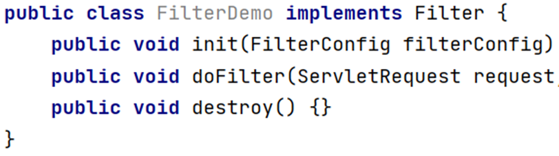

* 配置Filter拦截资源的路径：在类上定义 `@WebFilter` 注解。而注解的 `value` 属性值 `/*` 表示拦截所有的资源

  

* 在doFilter方法中输出一句话，并放行

  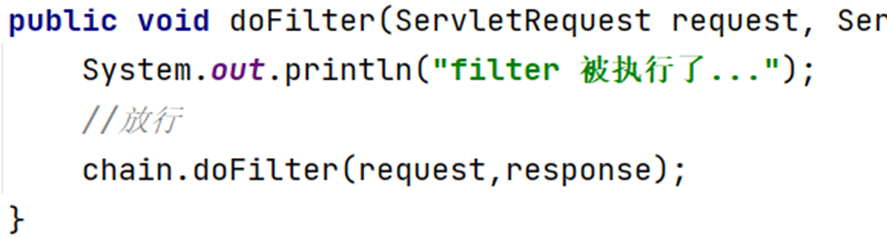

  > 上述代码中的 `chain.doFilter(request,response);` 就是放行，也就是让其访问本该访问的资源。

#### 代码演示

创建一个项目，项目下有一个 `hello.jsp` 页面，项目结构如下：


`pom.xml` 配置文件内容如下：

```xml
<?xml version="1.0" encoding="UTF-8"?>
<project xmlns="http://maven.apache.org/POM/4.0.0"
         xmlns:xsi="http://www.w3.org/2001/XMLSchema-instance"
         xsi:schemaLocation="http://maven.apache.org/POM/4.0.0 http://maven.apache.org/xsd/maven-4.0.0.xsd">
    <modelVersion>4.0.0</modelVersion>

    <groupId>org.example</groupId>
    <artifactId>filter-demo</artifactId>
    <version>1.0-SNAPSHOT</version>
    <packaging>war</packaging>

    <properties>
        <maven.compiler.source>8</maven.compiler.source>
        <maven.compiler.target>8</maven.compiler.target>
    </properties>

    <dependencies>
        <dependency>
            <groupId>javax.servlet</groupId>
            <artifactId>javax.servlet-api</artifactId>
            <version>3.1.0</version>
            <scope>provided</scope>
        </dependency>
    </dependencies>

    <build>
        <plugins>
            <plugin>
                <groupId>org.apache.tomcat.maven</groupId>
                <artifactId>tomcat7-maven-plugin</artifactId>
                <version>2.2</version>
                <configuration>
                    <port>80</port>
                </configuration>
            </plugin>
        </plugins>
    </build>
</project>
```

`hello.jsp` 页面内容如下：

```jsp
<%@ page contentType="text/html;charset=UTF-8" language="java" %>
<html>
<head>
    <title>Title</title>
</head>
<body>
    <h1>hello JSP~</h1>
</body>
</html>
```

我们现在在浏览器输入 `http://localhost/filter-demo/hello.jsp` 访问 `hello.jsp` 页面，这里是可以访问到 `hello.jsp` 页面内容的。

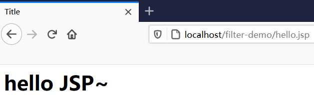

接下来编写过滤器。过滤器是 Web 三大组件之一，所以我们将 `filter` 创建在 `com.itheima.web.filter` 包下，起名为 `FilterDemo`

```java
@WebFilter("/*")
public class FilterDemo implements Filter {

    @Override
    public void doFilter(ServletRequest request, ServletResponse response, FilterChain chain) throws IOException, ServletException {
        System.out.println("FilterDemo...");
    }

    @Override
    public void init(FilterConfig filterConfig) throws ServletException {
    }

    @Override
    public void destroy() {
    }
}

```

重启启动服务器，再次重新访问 `hello.jsp` 页面，这次发现页面没有任何效果，但是在 `idea` 的控制台可以看到如下内容


上述效果说明 `FilterDemo` 这个过滤器的 `doFilter()` 方法执行了，但是为什么在浏览器上看不到 `hello.jsp` 页面的内容呢？这是因为在 `doFilter()` 方法中添加放行的方法才能访问到 `hello.jsp` 页面。那就在 `doFilter()` 方法中添加放行的代码

```java
//放行
 chain.doFilter(request,response);
```

再次重启服务器并访问 `hello.jsp` 页面，发现这次就可以在浏览器上看到页面效果。

**`FilterDemo` 过滤器完整代码如下：**

```java
@WebFilter("/*")
public class FilterDemo implements Filter {

    @Override
    public void doFilter(ServletRequest request, ServletResponse response, FilterChain chain) throws IOException, ServletException {
        System.out.println("1.FilterDemo...");
        //放行
        chain.doFilter(request,response);
    }

    @Override
    public void init(FilterConfig filterConfig) throws ServletException {
    }

    @Override
    public void destroy() {
    }
}
```

### Filter执行流程


如上图是使用过滤器的流程，我们通过以下问题来研究过滤器的执行流程：

* 放行后访问对应资源，资源访问完成后，还会回到Filter中吗？

  从上图就可以看出肯定 会 回到Filter中

* 如果回到Filter中，是重头执行还是执行放行后的逻辑呢？

  如果是重头执行的话，就意味着 `放行前逻辑` 会被执行两次，肯定不会这样设计了；所以访问完资源后，会回到 `放行后逻辑`，执行该部分代码。

通过上述的说明，我们就可以总结Filter的执行流程如下：


接下来我们通过代码验证一下，在 `doFilter()` 方法前后都加上输出语句，如下


同时在 `hello.jsp` 页面加上输出语句，如下

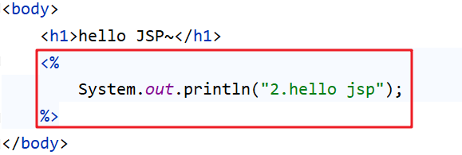

执行访问该资源打印的顺序是按照我们标记的标号进行打印的话，说明我们上边总结出来的流程是没有问题的。启动服务器访问 `hello.jsp` 页面，在控制台打印的内容如下：


以后我们可以将对请求进行处理的代码放在放行之前进行处理，而如果请求完资源后还要对响应的数据进行处理时可以在放行后进行逻辑处理。

### Filter拦截路径配置

拦截路径表示 Filter 会对请求的哪些资源进行拦截，使用 `@WebFilter` 注解进行配置。如：`@WebFilter("拦截路径")` 

拦截路径有如下四种配置方式：

* 拦截具体的资源：/index.jsp：只有访问index.jsp时才会被拦截
* 目录拦截：/user/*：访问/user下的所有资源，都会被拦截
* 后缀名拦截：*.jsp：访问后缀名为jsp的资源，都会被拦截
* 拦截所有：/*：访问所有资源，都会被拦截

通过上面拦截路径的学习，大家会发现拦截路径的配置方式和 `Servlet` 的请求资源路径配置方式一样，但是表示的含义不同。

### 过滤器链

过滤器链是指在一个Web应用，可以配置多个过滤器，这多个过滤器称为过滤器链。

如下图就是一个过滤器链，我们学习过滤器链主要是学习过滤器链执行的流程


上图中的过滤器链执行是按照以下流程执行：

1. 执行 `Filter1` 的放行前逻辑代码
2. 执行 `Filter1` 的放行代码
3. 执行 `Filter2` 的放行前逻辑代码
4. 执行 `Filter2` 的放行代码
5. 访问到资源
6. 执行 `Filter2` 的放行后逻辑代码
7. 执行 `Filter1` 的放行后逻辑代码

以上流程串起来就像一条链子，故称之为过滤器链。

#### 代码演示

* 编写第一个过滤器 `FilterDemo` ，配置成拦截所有资源

  ```java
  @WebFilter("/*")
  public class FilterDemo implements Filter {
  
      @Override
      public void doFilter(ServletRequest request, ServletResponse response, FilterChain chain) throws IOException, ServletException {
  
          //1. 放行前，对 request数据进行处理
          System.out.println("1.FilterDemo...");
          //放行
          chain.doFilter(request,response);
          //2. 放行后，对Response 数据进行处理
          System.out.println("3.FilterDemo...");
      }
  
      @Override
      public void init(FilterConfig filterConfig) throws ServletException {
      }
  
      @Override
      public void destroy() {
      }
  }
  ```

* 编写第二个过滤器 `FilterDemo2` ，配置炒年糕拦截所有资源

  ```java
  @WebFilter("/*")
  public class FilterDemo2 implements Filter {
  
      @Override
      public void doFilter(ServletRequest request, ServletResponse response, FilterChain chain) throws IOException, ServletException {
  
          //1. 放行前，对 request数据进行处理
          System.out.println("2.FilterDemo...");
          //放行
          chain.doFilter(request,response);
          //2. 放行后，对Response 数据进行处理
          System.out.println("4.FilterDemo...");
      }
  
      @Override
      public void init(FilterConfig filterConfig) throws ServletException {
      }
  
      @Override
      public void destroy() {
      }
  }
  
  ```

* 修改 `hello.jsp` 页面中脚本的输出语句

  ```jsp
  <%@ page contentType="text/html;charset=UTF-8" language="java" %>
  <html>
  <head>
      <title>Title</title>
  </head>
  <body>
      <h1>hello JSP~</h1>
      <%
          System.out.println("3.hello jsp");
      %>
  </body>
  </html>
  ```

* 启动服务器，在浏览器输入 `http://localhost/filter-demo/hello.jsp` 进行测试，在控制台打印内容如下

  

  从结果可以看到确实是按照我们之前说的执行流程进行执行的。

#### 问题

上面代码中为什么是先执行 `FilterDemo` ，后执行 `FilterDemo2` 呢？

我们现在使用的是注解配置Filter，而这种配置方式的优先级是按照过滤器类名(字符串)的自然排序。

比如有如下两个名称的过滤器 ： `BFilterDemo` 和 `AFilterDemo` 。那一定是 `AFilterDemo` 过滤器先执行。

> 本章Filter案例省略，想看去原笔记素材看

## Listener

### Listener 概述

* Listener 表示监听器，是 JavaWeb 三大组件(Servlet、Filter、Listener)之一。

* 监听器可以监听就是在 `application`，`session`，`request` 三个对象创建、销毁或者往其中添加修改删除属性时自动执行代码的功能组件。

  request 和 session 我们学习过。而 `application` 是 `ServletContext` 类型的对象。

  `ServletContext` 代表整个web应用，在服务器启动的时候，tomcat会自动创建该对象。在服务器关闭时会自动销毁该对象。

### Listener 分类

JavaWeb 提供了8个监听器：


这里面只有 `ServletContextListener` 这个监听器后期我们会接触到，`ServletContextListener` 是用来监听 `ServletContext` 对象的创建和销毁。

`ServletContextListener` 接口中有以下两个方法

* `void contextInitialized(ServletContextEvent sce)`：`ServletContext` 对象被创建了会自动执行的方法
* `void contextDestroyed(ServletContextEvent sce)`：`ServletContext` 对象被销毁时会自动执行的方法

### 代码演示

我们只演示一下 `ServletContextListener` 监听器

* 定义一个类，实现`ServletContextListener` 接口
* 重写所有的抽象方法
* 使用 `@WebListener` 进行配置

代码如下：

```java
@WebListener
public class ContextLoaderListener implements ServletContextListener {
    @Override
    public void contextInitialized(ServletContextEvent sce) {
        //加载资源
        System.out.println("ContextLoaderListener...");
    }

    @Override
    public void contextDestroyed(ServletContextEvent sce) {
        //释放资源
    }
}
```

启动服务器，就可以在启动的日志信息中看到 `contextInitialized()` 方法输出的内容，同时也说明了 `ServletContext` 对象在服务器启动的时候被创建了。

## Ajax

### Ajax 概述

`AJAX` (Asynchronous JavaScript And XML)：异步的 JavaScript 和 XML。

我们先来说概念中的 `JavaScript` 和 `XML`，`JavaScript` 表明该技术和前端相关；`XML` 是指以此进行数据交换。而这两个我们之前都学习过。

### Ajax 作用

AJAX 作用有以下两方面：

1. **与服务器进行数据交换**：通过AJAX可以给服务器发送请求，服务器将数据直接响应回给浏览器。我们先来看之前做功能的流程，如下图：

   

   如上图，`Servlet` 调用完业务逻辑层后将数据存储到域对象中，然后跳转到指定的 `jsp` 页面，在页面上使用 `EL表达式` 和 `JSTL` 标签库进行数据的展示。

   而我们学习了AJAX 后，就可以使用AJAX和服务器进行通信，以达到使用 HTML+AJAX来替换JSP页面了。如下图，浏览器发送请求servlet，servlet 调用完业务逻辑层后将数据直接响应回给浏览器页面，页面使用 HTML 来进行数据展示。

   

2. **异步交互**：可以在不重新加载整个页面的情况下，与服务器交换数据并更新部分网页的技术，如：搜索联想、用户名是否可用校验，等等…

   

   上图所示的效果我们经常见到，在我们输入一些关键字（例如 `奥运`）后就会在下面联想出相关的内容，而联想出来的这部分数据肯定是存储在百度的服务器上，而我们并没有看出页面重新刷新，这就是 更新局部页面 的效果。再如下图：

   

   我们在用户名的输入框输入用户名，当输入框一失去焦点，如果用户名已经被占用就会在下方展示提示的信息；在这整个过程中也没有页面的刷新，只是在局部展示出了提示信息，这就是 更新局部页面 的效果。

### 同步和异步

知道了局部刷新后，接下来我们再聊聊同步和异步:

* 同步发送请求过程如下

  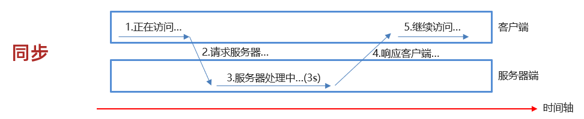

  浏览器页面在发送请求给服务器，在服务器处理请求的过程中，浏览器页面不能做其他的操作。只能等到服务器响应结束后才能，浏览器页面才能继续做其他的操作。

* 异步发送请求过程如下

  

  浏览器页面发送请求给服务器，在服务器处理请求的过程中，浏览器页面还可以做其他的操作。

### 快速入门

#### 服务端实现

在项目的创建 `com.itheima.web.servlet` ，并在该包下创建名为  `AjaxServlet` 的servlet

```java
@WebServlet("/ajaxServlet")
public class AjaxServlet extends HttpServlet {
    @Override
    protected void doGet(HttpServletRequest request, HttpServletResponse response) throws ServletException, IOException {
        //1. 响应数据
        response.getWriter().write("hello ajax~");
    }

    @Override
    protected void doPost(HttpServletRequest request, HttpServletResponse response) throws ServletException, IOException {
        this.doGet(request, response);
    }
}
```

#### 客户端实现

在 `webapp` 下创建名为 `01-ajax-demo1.html` 的页面，在该页面书写 `ajax` 代码

* 创建核心对象，不同的浏览器创建的对象是不同的

  ```js
   var xhttp;
  if (window.XMLHttpRequest) {
      xhttp = new XMLHttpRequest();
  } else {
      // code for IE6, IE5
      xhttp = new ActiveXObject("Microsoft.XMLHTTP");
  }
  ```

* 发送请求

  ```js
  //建立连接
  xhttp.open("GET", "http://localhost:8080/ajax-demo/ajaxServlet");
  //发送请求
  xhttp.send();
  ```

* 获取响应

  ```js
  xhttp.onreadystatechange = function() {
      if (this.readyState == 4 && this.status == 200) {
          // 通过 this.responseText 可以获取到服务端响应的数据
          alert(this.responseText);
      }
  };
  ```

**完整代码如下：**

```html
<!DOCTYPE html>
<html lang="en">
<head>
    <meta charset="UTF-8">
    <title>Title</title>
</head>
<body>

<script>
    //1. 创建核心对象
    var xhttp;
    if (window.XMLHttpRequest) {
        xhttp = new XMLHttpRequest();
    } else {
        // code for IE6, IE5
        xhttp = new ActiveXObject("Microsoft.XMLHTTP");
    }
    //2. 发送请求
    xhttp.open("GET", "http://localhost:8080/ajax-demo/ajaxServlet");
    xhttp.send();

    //3. 获取响应
    xhttp.onreadystatechange = function() {
        if (this.readyState == 4 && this.status == 200) {
            alert(this.responseText);
        }
    };
</script>
</body>
</html>
```

#### 测试

在浏览器地址栏输入 `http://localhost:8080/ajax-demo/01-ajax-demo1.html` ，在 `01-ajax-demo1.html`加载的时候就会发送 `ajax` 请求，效果如下


我们可以通过 `开发者模式` 查看发送的 AJAX 请求。在浏览器上按 `F12` 快捷键


这个是查看所有的请求，如果我们只是想看 异步请求的话，点击上图中 `All` 旁边的 `XHR`，会发现只展示 Type 是 `xhr` 的请求。如下图：


> 本章Ajax案例省略，想看去原笔记素材看

## axios

Axios 对原生的AJAX进行封装，简化书写。

Axios官网是：`https://www.axios-http.cn`

### 基本使用

axios 使用是比较简单的，分为以下两步：

* 引入 axios 的 js 文件

  ```html
  <script src="js/axios-0.18.0.js"></script>
  ```

* 使用axios 发送请求，并获取响应结果

  * 发送 get 请求

    ```js
    axios({
        method:"get",
        url:"http://localhost:8080/ajax-demo1/aJAXDemo1?username=zhangsan"
    }).then(function (resp){
        alert(resp.data);
    })
    ```

  * 发送 post 请求

    ```js
    axios({
        method:"post",
        url:"http://localhost:8080/ajax-demo1/aJAXDemo1",
        data:"username=zhangsan"
    }).then(function (resp){
        alert(resp.data);
    });
    ```

`axios()` 是用来发送异步请求的，小括号中使用 js 对象传递请求相关的参数：

* `method` 属性：用来设置请求方式的。取值为 `get` 或者 `post`。
* `url` 属性：用来书写请求的资源路径。如果是 `get` 请求，需要将请求参数拼接到路径的后面，格式为： `url?参数名=参数值&参数名2=参数值2`。
* `data` 属性：作为请求体被发送的数据。也就是说如果是 `post` 请求的话，数据需要作为 `data` 属性的值。

`then()` 需要传递一个匿名函数。我们将 `then()` 中传递的匿名函数称为 回调函数，意思是该匿名函数在发送请求时不会被调用，而是在成功响应后调用的函数。而该回调函数中的 `resp` 参数是对响应的数据进行封装的对象，通过 `resp.data` 可以获取到响应的数据。

### 快速入门

#### 后端实现

定义一个用于接收请求的servlet，代码如下：

```java
@WebServlet("/axiosServlet")
public class AxiosServlet extends HttpServlet {
    @Override
    protected void doGet(HttpServletRequest request, HttpServletResponse response) throws ServletException, IOException {
        System.out.println("get...");
        //1. 接收请求参数
        String username = request.getParameter("username");
        System.out.println(username);
        //2. 响应数据
        response.getWriter().write("hello Axios~");
    }

    @Override
    protected void doPost(HttpServletRequest request, HttpServletResponse response) throws ServletException, IOException {
        System.out.println("post...");
        this.doGet(request, response);
    }
}
```

#### 前端实现

* 引入 js 文件

  ```js
  <script src="js/axios-0.18.0.js"></script>
  ```

* 发送 ajax 请求

  * get 请求

    ```js
    axios({
        method:"get",
        url:"http://localhost:8080/ajax-demo/axiosServlet?username=zhangsan"
    }).then(function (resp) {
        alert(resp.data);
    })
    ```

  * post 请求

    ```js
    axios({
        method:"post",
        url:"http://localhost:8080/ajax-demo/axiosServlet",
        data:"username=zhangsan"
    }).then(function (resp) {
        alert(resp.data);
    })
    ```

**整体页面代码如下：**

```html
<!DOCTYPE html>
<html lang="en">
<head>
    <meta charset="UTF-8">
    <title>Title</title>
</head>
<body>

<script src="js/axios-0.18.0.js"></script>
<script>
    //1. get
   /* axios({
        method:"get",
        url:"http://localhost:8080/ajax-demo/axiosServlet?username=zhangsan"
    }).then(function (resp) {
        alert(resp.data);
    })*/

    //2. post  在js中{} 表示一个js对象，而这个js对象中有三个属性
    axios({
        method:"post",
        url:"http://localhost:8080/ajax-demo/axiosServlet",
        data:"username=zhangsan"
    }).then(function (resp) {
        alert(resp.data);
    })
</script>
</body>
</html>
```

### 请求方法别名

为了方便起见， Axios 已经为所有支持的请求方法提供了别名。如下：

* `get` 请求 ： `axios.get(url[,config])`

* `delete` 请求 ： `axios.delete(url[,config])`

* `head` 请求 ： `axios.head(url[,config])`

* `options` 请求 ： `axios.option(url[,config])`

* `post` 请求：`axios.post(url[,data[,config])`

* `put` 请求：`axios.put(url[,data[,config])`

* `patch` 请求：`axios.patch(url[,data[,config])`

而我们只关注 `get` 请求和 `post` 请求。入门案例中的 `get` 请求代码可以改为如下：

```js
axios.get("http://localhost:8080/ajax-demo/axiosServlet?username=zhangsan").then(function (resp) {
    alert(resp.data);
});
```

入门案例中的 `post` 请求代码可以改为如下：

```js
axios.post("http://localhost:8080/ajax-demo/axiosServlet","username=zhangsan").then(function (resp) {
    alert(resp.data);
})
```

## JSON

### 概述

概念：`JavaScript Object Notation`。JavaScript 对象表示法.

如下是 `JavaScript` 对象的定义格式：

```js
{
	name:"zhangsan",
	age:23,
	city:"北京"
}
```

接下来我们再看看 `JSON` 的格式：

```json
{
	"name":"zhangsan",
	"age":23,
	"city":"北京"
}
```

通过上面 js 对象格式和 json 格式进行对比，发现两个格式特别像。只不过 js 对象中的属性名可以使用引号（可以是单引号，也可以是双引号）；而 `json` 格式中的键要求必须使用双引号括起来，这是 `json` 格式的规定。`json` 格式的数据有什么作用呢？

作用：由于其语法格式简单，层次结构鲜明，现多用于作为数据载体，在网络中进行数据传输。如下图所示就是服务端给浏览器响应的数据，这个数据比较简单，如果现需要将 JAVA 对象中封装的数据响应回给浏览器的话，应该以何种数据传输呢？


大家还记得 `ajax` 的概念吗？ 是 异步的 JavaScript 和 xml。这里的 xml就是以前进行数据传递的方式，如下：

```xml
<student>
    <name>张三</name>
    <age>23</age>
    <city>北京</city>
</student>
```

再看 `json` 描述以上数据的写法：

```json
{	
	"name":"张三",
    "age":23,
    "city":"北京"
}
```

上面两种格式进行对比后就会发现 `json` 格式数据的简单，以及所占的字节数少等优点。

### JSON 基础语法

#### 定义格式

`JSON` 本质就是一个字符串，但是该字符串内容是有一定的格式要求的。 定义格式如下：

```js
var 变量名 = '{"key":value,"key":value,...}';
```

`JSON` 串的键要求必须使用双引号括起来，而值根据要表示的类型确定。value 的数据类型分为如下

* 数字（整数或浮点数）
* 字符串（使用双引号括起来）
* 逻辑值（true或者false）
* 数组（在方括号中）
* 对象（在花括号中）
* null

示例：

```js
var jsonStr = '{"name":"zhangsan","age":23,"addr":["北京","上海","西安"]}'
```

#### 代码演示

创建一个页面，在该页面的 `<script>` 标签中定义json字符串

```html
<!DOCTYPE html>
<html lang="en">
<head>
    <meta charset="UTF-8">
    <title>Title</title>
</head>
<body>
<script>
    //1. 定义JSON字符串
    var jsonStr = '{"name":"zhangsan","age":23,"addr":["北京","上海","西安"]}'
    alert(jsonStr);

</script>
</body>
</html>
```

通过浏览器打开，页面效果如下图所示


现在我们需要获取到该 `JSON` 串中的 `name` 属性值，应该怎么处理呢？

如果它是一个 js 对象，我们就可以通过 `js对象.属性名` 的方式来获取数据。JS 提供了一个对象 `JSON` ，该对象有如下两个方法：

* `parse(str)` ：将 JSON串转换为 js 对象。使用方式是： `var jsObject = JSON.parse(jsonStr);`
* `stringify(obj)` ：将 js 对象转换为 JSON 串。使用方式是：`var jsonStr = JSON.stringify(jsObject)`

代码演示：

```html
<!DOCTYPE html>
<html lang="en">
<head>
    <meta charset="UTF-8">
    <title>Title</title>
</head>
<body>
<script>
    //1. 定义JSON字符串
    var jsonStr = '{"name":"zhangsan","age":23,"addr":["北京","上海","西安"]}'
    alert(jsonStr);

    //2. 将 JSON 字符串转为 JS 对象
    let jsObject = JSON.parse(jsonStr);
    alert(jsObject)
    alert(jsObject.name)
    //3. 将 JS 对象转换为 JSON 字符串
    let jsonStr2 = JSON.stringify(jsObject);
    alert(jsonStr2)
</script>
</body>
</html>
```

### 发送异步请求携带参数

后面我们使用 `axios` 发送请求时，如果要携带复杂的数据时都会以 `JSON` 格式进行传递，如下

```js
axios({
    method:"post",
    url:"http://localhost:8080/ajax-demo/axiosServlet",
    data:"username=zhangsan"
}).then(function (resp) {
    alert(resp.data);
})
```

请求参数不可能由我们自己拼接字符串吧？肯定不用，可以提前定义一个 js 对象，用来封装需要提交的参数，然后使用 `JSON.stringify(js对象)` 转换为 `JSON` 串，再将该 `JSON` 串作为 `axios` 的 `data` 属性值进行请求参数的提交。如下：

```js
var jsObject = {name:"张三"};

axios({
    method:"post",
    url:"http://localhost:8080/ajax-demo/axiosServlet",
    data: JSON.stringify(jsObject)
}).then(function (resp) {
    alert(resp.data);
})
```

而 `axios` 是一个很强大的工具。我们只需要将需要提交的参数封装成 js 对象，并将该 js 对象作为 `axios` 的 `data` 属性值进行，它会自动将 js 对象转换为 `JSON` 串进行提交。如下：

```js
var jsObject = {name:"张三"};

axios({
    method:"post",
    url:"http://localhost:8080/ajax-demo/axiosServlet",
    data:jsObject  //这里 axios 会将该js对象转换为 json 串的
}).then(function (resp) {
    alert(resp.data);
})
```

注意：

* js 提供的 `JSON` 对象我们只需要了解一下即可。因为 `axios` 会自动对 js 对象和 `JSON` 串进行想换转换。
* 发送异步请求时，如果请求参数是 `JSON` 格式，那请求方式必须是 `POST`。因为 `JSON` 串需要放在请求体中。

### JSON串和Java对象的相互转换

学习完 json 后，接下来聊聊 json 的作用。以后我们会以 json 格式的数据进行前后端交互。前端发送请求时，如果是复杂的数据就会以 json 提交给后端；而后端如果需要响应一些复杂的数据时，也需要以 json 格式将数据响应回给浏览器。

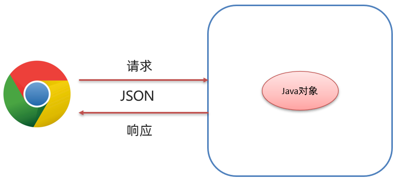

在后端我们就需要重点学习以下两部分操作：

* 请求数据：JSON字符串转为Java对象
* 响应数据：Java对象转为JSON字符串

接下来给大家介绍一套 API，可以实现上面两部分操作。这套 API 就是 `Fastjson`

#### Fastjson 概述

`Fastjson` 是阿里巴巴提供的一个Java语言编写的高性能功能完善的 `JSON` 库，是目前Java语言中最快的 `JSON` 库，可以实现 `Java` 对象和 `JSON` 字符串的相互转换。

#### Fastjson 使用

`Fastjson` 使用也是比较简单的，分为以下三步完成

1. **导入坐标**

   ```xml
   <dependency>
       <groupId>com.alibaba</groupId>
       <artifactId>fastjson</artifactId>
       <version>1.2.62</version>
   </dependency>
   ```

2. **Java对象转JSON**

   ```java
   String jsonStr = JSON.toJSONString(obj);
   ```

   将 Java 对象转换为 JSON 串，只需要使用 `Fastjson` 提供的 `JSON` 类中的 `toJSONString()` 静态方法即可。

3. **JSON字符串转Java对象**

   ```java
   User user = JSON.parseObject(jsonStr, User.class);
   ```

   将 json 转换为 Java 对象，只需要使用 `Fastjson` 提供的 `JSON` 类中的 `parseObject()` 静态方法即可。

#### 代码演示

* 引入坐标

* 创建一个类，专门用来测试 Java 对象和 JSON 串的相互转换，代码如下：

  ```java
  public class FastJsonDemo {
  
      public static void main(String[] args) {
          //1. 将Java对象转为JSON字符串
          User user = new User();
          user.setId(1);
          user.setUsername("zhangsan");
          user.setPassword("123");
  
          String jsonString = JSON.toJSONString(user);
          System.out.println(jsonString);//{"id":1,"password":"123","username":"zhangsan"}
  
  
          //2. 将JSON字符串转为Java对象
          User u = JSON.parseObject("{\"id\":1,\"password\":\"123\",\"username\":\"zhangsan\"}", User.class);
          System.out.println(u);
      }
  }
  ```


> 本章Axios + JSON案例省略，想看去原笔记素材看

