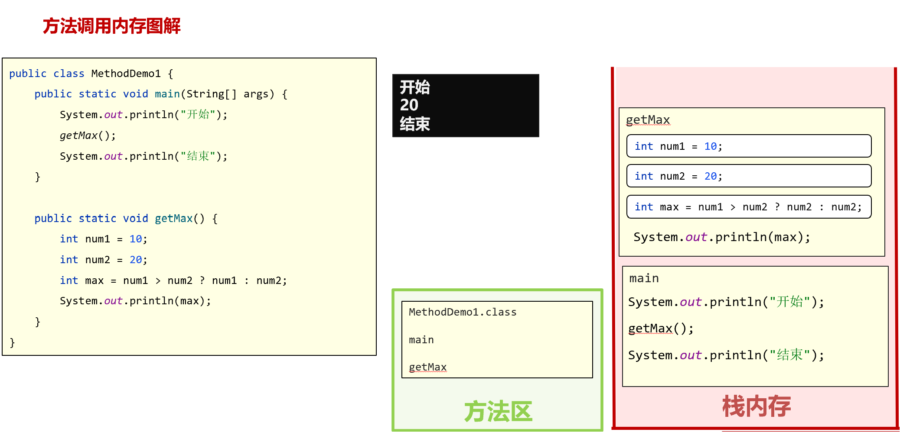
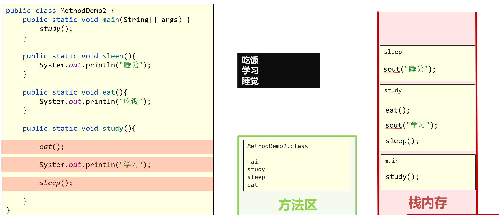

# 基础篇

## 注释

注释是对代码的解释和说明文字。

Java中的注释分为三种：

* 单行注释：

~~~java
// 这是单行注释文字
~~~

* 多行注释：

~~~java
/*
这是多行注释文字
这是多行注释文字
*/
~~~

* 文档注释（暂时用不到）：

```java
/**
这是多行注释文字
这是多行注释文字
*/
```

注释的内容不会参与编译和运行的，仅仅是对代码的解释说明而已。

所以，不管在注释当中写什么内容，都不会影响代码运行的结果。

> 修改注释样式：film->setting->editor->color scheme->language default->comments，会有三个选项要改，分别是单行，多行，文档注释。单行和多行直接点开后在右侧italic修改斜体，以及字体颜色。文档注释打开后在Text里找到并修改。

## Debug调试工具

用于查看程序的执行流程，也可以用于追踪程序执行过程来调试程序，可以理解为程序的另外一种运行模式，可人为的控制运行。

给程序设置好断点后，对代码界面右键的debug，就会跳到第一个断点处，在控制台菜单栏有一个转折箭头(快捷键F8)和直向下箭头，点击一次向下执行一步，不同的是前者不会进入函数，后者会进入函数。这样我们就能看到程序执行的每一步都做了什么。

在控制台debug栏中，frames栏中展示的是程序正在执行的方法，varlables栏表示程序中有哪些变量何变量的变化过程。最左侧还有很多功能按钮，比如重新调试运行，取消调试，取消所有断点，快速到下一断点等等。进入方法后上直箭头用来跳出此方法。

## 关键字

被Java赋予了特定含义的英文单词。当我们在代码中写了关键字之后，程序在运行的时候，就知道要做什么事情了。

关键字很多，不用刻意去记。

| **abstract**   | **assert**       | **boolean**   | **break**      | **byte**   |
| -------------- | ---------------- | ------------- | -------------- | ---------- |
| **case**       | **catch**        | **char**      | **class**      | **const**  |
| **continue**   | **default**      | **do**        | **double**     | **else**   |
| **enum**       | **extends**      | **final**     | **finally**    | **float**  |
| **for**        | **goto**         | **if**        | **implements** | **import** |
| **instanceof** | **int**          | **interface** | **long**       | **native** |
| **new**        | **package**      | **private**   | **protected**  | **public** |
| **return**     | **strictfp**     | **short**     | **static**     | **super**  |
| **switch**     | **synchronized** | **this**      | **throw**      | **throws** |
| **transient**  | **try**          | **void**      | **volatile**   | **while**  |

### 关键字-class

表示定义一个类。创建一个类。

类：Java项目最基本的组成单元，一个完整的Java项目有可能会有成千上万个类来组成的。class后面跟随的就是这个类的名字，简称类名。在类名后面会有一对大括号，表示这个类的内容。

举例：

```java
public class HelloWorld{
      
}
```

解释：class表示定义类。定义的类名为：HelloWorld。HelloWorld后面的大括号表示这个类的范围。

## 字面量(literal)

作用：告诉程序员，数据在程序中的书写格式。

| **字面量类型** | **说明**                                  | **程序中的写法**           |
| -------------- | ----------------------------------------- | -------------------------- |
| 整数           | 不带小数的数字                            | 666，-88                   |
| 小数           | 带小数的数字                              | 13.14，-5.21               |
| 字符           | 必须使用单引号，有且仅能一个字符          | ‘A’，‘0’，   ‘我’          |
| 字符串         | 必须使用双引号，内容可有可无              | “HelloWorld”，“黑马程序员” |
| 布尔值         | 布尔值，表示真假，只有两个值：true，false | true 、false               |
| 空值           | 一个特殊的值，空值                        | 值是：null                 |

~~~java
public class Demo {
    public static void main(String[] args) {
        System.out.println(10); // 输出一个整数
        System.out.println(5.5); // 输出一个小数
        System.out.println('a'); // 输出一个字符
        System.out.println(true); // 输出boolean值true
        System.out.println("欢迎来到黑马程序员"); // 输出字符串
    }
}
~~~

**区分技巧**

1. 不带小数点的数字都是整数类型的字面量。
2. 只要带了小数点，那么就是小数类型的字面量。
3. 只要用双引号引起来的，不管里面的内容是什么，不管里面有没有内容，都是字符串类型的字面量。
4. 字符类型的字面量必须用单引号引起来，不管内容是什么，但是个数有且只能有一个。
5. 字符类型的字面量只有两个值，true、false。
6. 空类型的字面量只有一个值，null。

## 变量(variable)

变量就在程序中临时存储数据的容器。但是这个容器中只能存一个值。

语法：`数据类型 变量名 = 数据值`；

数据类型限定了变量当中能存储什么类型的数据。变量名就是变量的名字。数据值是存储在变量中的数据。分号表示语句的结束。

```java
public class VariableDemo{
	public static void main(String[] args){
		//定义一个整数类型的变量
		//数据类型 变量名 = 数据值;
		int a = 16;
		System.out.println(a);//16
		
		//定义一个小数类型的变量
		double b = 10.1;
		System.out.println(b);//10.1
	}
}
```

**注意事项**

- 变量名不能重复
- 在一条语句中，可以定义多个变量。但是这种方式影响代码的阅读，熟练可以使用。
- 变量在使用之前必须要赋值。

```java
public class VariableDemo2{
	public static void main(String[] args){
		//1.变量名不允许重复
		//int a = 10;
		//int a = 20;
		//System.out.println(a);
		
		//2.一条语句可以定义多个变量
		//了解。
		//int a = 10, b = 20, c = 20,d = 20;
		//System.out.println(a);//?
		//System.out.println(b);//?
		
		
		//3.变量在使用之前必须要赋值
		int a = 30;
		System.out.println(a);
	}
}
```

## 标识符

标识符：就是给类，方法，变量等起名字的符号。

语法：

- 必须由数字、字母、下划线_、美元符号$组成。
- 数字不能开头
- 不能是关键字
- 区分大小写的。

建议：

- 小驼峰命名法：适用于**变量名**和方法名

  * 如果是一个单词，那么全部小写，比如：name


    * 如果是多个单词，那么从第二个单词开始，首字母大写，比如：firstName、maxAge


  * 大驼峰命名法：适用于**类名**

    * 如果是一个单词，那么首字母大写。比如：Demo、Test。
    * 如果是多个单词，那么每一个单词首字母都需要大写。比如：HelloWorld

  * 不管起什么名字，都要做到见名知意。

    - 尽量不要用拼音，使用英文单词。


    - 平时在给变量名、方法名、类名起名字的时候，不要使用下划线或美元符号。

## 数据类型

Java语言数据类型的分类

- 基本数据类型
- 引用数据类型（面向对象的时候再深入学习）

### 基本数据类型

| 数据类型 | 关键字  | 内存占用(字节) |            取值范围            |
| :------: | :-----: | :------------: | :----------------------------: |
|   整数   |  byte   |       1        |     -2^7 ~ 2^7-1(-128~127)     |
|          |  short  |       2        |  -2^15 ~ 2^15-1(-32768~32767)  |
|          |   int   |       4        |     -2^31 ~ 2^31-1(10位数)     |
|          |  long   |       8        |     -2^63 ~ 2^63-1(19位数)     |
|  浮点数  |  float  |       4        |  1.401298e-45 ~ 3.402823e+38   |
|          | double  |       8        | 4.9000000e-324 ~ 1.797693e+308 |
|   字符   |  char   |       2        |            0-65535             |
|   布尔   | boolean |       1        |          true，false           |

> e+38表示是乘以10^38，同样，e-45表示乘以10^-45。在java中整数默认是int类型，浮点数默认是double类型。

> 记忆以下几点：
>
> - 8种基本数据类型关键字，和对应所占字节
> - byte类型的取值范围：-128 ~ 127
> - 整数类型和小数类型的取值范围大小关系：double > float > long > int > short > byte

定义8种基本数据类型变量：

```java
public class VariableDemo3{
    public static void main(String[] args){
        //1.定义byte类型的变量
        //数据类型 变量名 = 数据值;
        byte a = 10;
        System.out.println(a);

        //2.定义short类型的变量
        short b = 20;
        System.out.println(b);

        //3.定义int类型的变量
        int c = 30;
        System.out.println(c);

        //4.定义long类型的变量
        long d = 123456789123456789L;
        System.out.println(d);

        //5.定义float类型的变量
        float e = 10.1F;
        System.out.println(e);

        //6.定义double类型的变量
        double f = 20.3;
        System.out.println(f);

        //7.定义char类型的变量
        char g = 'a';
        System.out.println(g);

        //8.定义boolean类型的变量
        boolean h = true;
        System.out.println(h);

    }
}
```

**注意点**

- 整数类型：首选int，如果发现int装不下了，将类型换成long，定义long类型变量需要加入L的后缀（建议大写，小写像1）
- 小数类型：首选double，非要用float类型，需要加入F后缀(大小写都行)

> byte和short用于解决早期计算机内存小的情况而使用的，而double比float精度更高，存放数据更安全。
>
> 所有整数字面量默认int类型，小数字面量默认double类型

### 数据类型转换

#### 隐式(数据类型)转换

隐式转换也叫自动类型提升。就是把一个取值范围小的数据或者变量，赋值给另一个取值范围大的变量。此时不需要我们额外写代码单独实现，是程序自动帮我们完成的。就是小的给大的，可以直接给。

两种提升规则：

* 取值范围小的，和取值范围大的进行运算，小的会先提升为大的，再进行运算。计算后数据类型默认为最大。
* byte、short、char三种类型的数据在运算的时候，都会直接先提升为int，然后再进行运算。包括两个同类型之间计算。

> 取值范围从小到大的关系：double > float > long > int > short > byte

```java
//案例一：
double d = 10;
System.out.println(d);//10.0
//解释：10是整数，整数默认是int类型的。而在取值范围的顺序中：byte short int long float double。在赋值的时候把一个int类型的赋值给了一个double类型的。把一个小的赋值给一个大的是可以直接给的。

//案例二：
byte b = 100;
int i = b;//可以成功赋值
//解释：因为byte的取值范围是小的，int的取值范围是大的，在底层进行了隐式转换，不需要我们额外写代码单独实现，是可以直接赋值。

//案例三：
int i = 10;
long n = 20L;
//??? result = i + n;
//问变量result是什么类型的？
//解释：变量i是int类型的，变量n是long类型的。而在取值范围的顺序中：byte short int long float double。变量i里面的值会自动提升为long类型的，最终的结果其实就是两个long相加，那么最终的result是long类型的。

//案例四：
int i = 10;
long n = 100L;
double d = 20.0;
//??? result = i + n + d;
//问变量result是什么类型的？  
//解释：变量i是int类型，变量n是long类型，变量d是double类型。而在取值范围的顺序中：byte short int long float double。所以变量i和变量n里面的值在参与运算的时候，都会进行类型提升，变成double。最终其实就是三个double进行相加，那么最终的结果就是double类型的。

//案例五：  
byte b1 = 10;
byte b2 = 20;
//??? result = b1 + b2;//int
//问变量result是什么类型的？
//解释：因为b1和b2都是byte类型的。所以在参与计算的时候，变量b1和变量b2里面的值都会自动提升为int类型的。最终其实就是两个int类型的相加，最终结果也是int类型的。    

//案例六：
byte b = 10;
short s = 20;
long n = 100L;
//??? result = b + s + n;
//问变量result是什么类型的？
//解释：变量b是byte类型的，变量s是short类型的，变量n是long类型的。byte，short，char类型的变量在参与运算的时候，变量里面的值会直接先提升为int。
//第一步：变量b和变量s里面的值会先提升为int参与运算。int + int + long
//第二步：而long类型的取值范围是大于int的取值范围的。所以变量b和变量s里面的值会再次提升为long。long + long + long。
//所以最终结果是long类型的。
```

#### 强制(数据类型)转换

如果要把一个取值范围大的数据或者变量赋值给另一个取值范围小的变量。是不允许直接操作。如果一定要这么干，就需要加入强制转换。要转成什么类型的，那么就在小括号中写什么类型就可以了。

语法：目标数据类型 变量名 = （目标数据类型）被强转的数据；

```java
//例子
public class OperatorDemo2 {
    public static void main(String[] args) {
        double a = 12.3;
        int b = (int) a;
        System.out.println(b);//12
    }
}
```

> 注意点：强制转换有可能会导致数据发生错误（数据的精度丢失）。如整数130 ：默认为int，int占用4个字节，也就是4组8个二进制位**00000000 00000000 00000000 10000010‬**；强转到byte：4个字节，强制转换为1个字节，就是砍掉前3组8位**10000010‬**；根据运算后的补码，反向推原码后，即为-126。

## 键盘录入Scanner

键盘录入能够让程序的使用者自己将数据录入变量，使程序中使用数据更加灵活。

键盘录入的实际功能Java已经帮我们写好了，不需要我们自己再实现了，而Java写好的功能都放在了Scanner这个类中，所以，我们只要直接使用Scanner这个类就可以了。

使用步骤：

```java
//第一步，导包，其实就是先找到Scanner这个类在哪。这里指java文件夹下util文件夹下的Scanner.java的文件。这个java文件可以在jdk\lib\src.zip\java base中找到。
import java.util.Scanner;
public class ScannerDemo1{
	public static void main(String[] args){
		//第二步，创建对象，其实就是申明一下，我准备开始用Scanner这个类了。
		Scanner sc = new Scanner(System.in);
		//第三步，接收数据，当程序运行之后，我们在键盘输入的数据就会被变量i给接收了
		System.out.println("请输入一个数字");
		int age = sc.nextInt();//从键盘录入整数，并使用int类型变量接收
        //double height = sc.nextDouble();//从键盘录入小数，并使用double类型变量接收
        //boolean flag=sc.nextBoolean();//从键盘录入布尔，并使用boolean类型变量接收
        //string name : sc.next();//从键盘录入字符串，并使用String类型变量接收
		System.out.println(age);
	}
}
```

## 运算符和表达式

运算符：就是对常量或者变量进行操作的符号。比如算数运算符： +  -  *  / 

表达式：用运算符把常量或者变量连接起来的，符合Java语法的式子就是表达式。比如：a + b 这个整体就是表达式。而其中+是算术运算符的一种，所以这个表达式也称之为算术表达式。

### 算术运算符

分类：

```java
+ - * / %
```

运算特点：

```java
// + - * :跟小学数学中一模一样没有任何区别.
    
// /：1.整数相除结果只能得到整除，如果结果想要是小数，必须要有小数参数。	2.小数直接参与运算，得到的结果有可能是不精确的。
System.out.println( 10 / 3);//3
System.out.println(10.0 / 3);//3.3333333333333335

// %：取模、取余。他做的也是除法运算，只不过获取的是余数而已。
System.out.println(10 % 2);//0
System.out.println(10 % 3);//1
//可以利用取模来判断一个数是奇数还是偶数
System.out.println(15 % 2);//1  奇数
```

```java
//练习：数值拆分
//需求：键盘录入一个三位数，将其拆分为个位、十位、百位后，打印在控制台

//1.键盘录入一个三位数
//导包 --- 创建对象 --- 接收数据
Scanner sc = new Scanner(System.in);
System.out.println("请输入一个三位数");
int number = sc.nextInt();//123

//2.获取这个三位数的个位、十位、百位并打印出来
//公式：针对于任意的一个数而言
//个位： 数字 % 10
int ones = number % 10;
//十位： 数字 / 10 % 10
int tens = number / 10 % 10;
//百位： 数字 / 100 % 10
int hundreds = number / 100  % 10;
//。。。以此类推。。。

//输出结果
System.out.println(ones);
System.out.println(tens);
System.out.println(hundreds);
```

#### 字符串的+操作(字符串拼接)

当+操作中出现字符串时，此时就是字符串的连接符，会将前后的数据进行拼接，并产生一个新的字符串。当连续进行+操作时，从左到右逐个执行的。

```java
//案例1：
1 + "abc" + 1
//结果："1abc1"
//解释：
//第一步： 1 + "abc"。在这个过程中，有字符串参与的，所以做的是拼接操作，产生一个新的字符串"1abc"
//第二步：  "1abc" + 1。这个过程中，有字符串参与的，所以做的也是拼接操作，产生一个新的字符串"1abc1"
    
//案例2：
1 + 2 + "abc" + 2 + 1
//结果：“3abc21”
//解释：
//第一步：1 + 2 。在这个过程中，没有字符串参与的，所以做的是加法运算，结果为3。
//第二步：3 + "abc"。在这个过程中，有字符串参与的，所以做的是拼接操作，产生一个新的字符串"3abc"。
//第三步："3abc" + 2。在这个过程中，有字符串参与的，所以做的是拼接操作，产生一个新的字符串"3abc2"。
//第四步："3abc2" + 1。在这个过程中，有字符串参与的，所以做的是拼接操作，产生一个新的字符串“3abc21”

//案例3：
String name = "黑默丁格";
System.out.println("我的名字是" + name);
//结果： 我的名字是黑默丁格
//解释：当字符串跟变量相加的时候，实际上是跟变量里面的值进行拼接。
```

#### 字符的+操作

当+操作中出现了字符，会拿着字符到计算机内置的ASCII码表中去查对应的数字，然后再进行计算。

```java
//案例
char c = 'a';
int result = c + 0;
System.out.println(result);//97
//ASCII码表中：
//'a'   -----    97
//'A'   -----    65
```

### 自增自减运算符

```java
++  自增运算符//++：就是把变量里面的值+1
--  自减运算符//--：就是把变量里面的值-1
```

若自增运算符放在变量的前面，我们叫做先++， 比如：++a。若自增运算符放在变量的后面，我们叫做后++。，比如：a++。

> 注意点：不管是先++，还是后++。单独写在一行的时候，运算结果是一模一样的。

```java
//案例：
int a = 10;
a++;//就是让变量a里面的值 + 1
System.out.println(a);//11
++a;//就是让变量a里面的值 + 1
System.out.println(a);//12
```

### 赋值运算符

=、+=、-=、*=、/=、%=。最为常用的：=

运算过程：就是把左边跟右边进行运算，把最终的结果赋值给左边。

```java
//案例：
public class OperatorDemo6 {
    public static void main(String[] args) {
        //1.最为简单的赋值运算符用法
        int a = 10;//就是把10赋值给变量a
        System.out.println(a);

        //2.如果等号右边需要进行计算
        int b = 20;
        int c = a + b;//先计算等号右边的，把计算的结果赋值给左边的变量
        System.out.println(c);

        //3.特殊的用法
        a = a + 10;//先计算等号右边的，把计算的结果赋值给左边的变量
        System.out.println(a);//20
    }
}
```

```java
//案例：
public class OperatorDemo7 {
    public static void main(String[] args) {
        //扩展赋值运算符
        int a = 10;
        int b = 20;
        a += b;//把左边和右边相加，再把最终的结果赋值给左边，对右边没有任何影响
        // 相当于 a = a + b;
        System.out.println(a);//30
        System.out.println(b);//20
    }
}
```

> 注意点：扩展的赋值运算符中隐层还包含了一个强制数据类型转换。原因是最后赋值给a但a是byte，所以需要强制类型转换。
>
> 以+=为例。a += b ;实际上相当于 a = (byte)(a + b);
>
> ```java
> public class OperatorDemo8 {
>  public static void main(String[] args) {
>      byte a = 10;
>      byte b = 20;
>      a += b;
>      //实际是：a = (byte)(a + b);
>      System.out.println(a);//30
>  }
> }
> ```

### 关系运算符

又叫比较运算符，其实就是拿着左边跟右边进行了判断而已。

| 符号 | 解释                                                         |
| ---- | ------------------------------------------------------------ |
| ==   | 就是判断左边跟右边是否相等，如果成立就是true，如果不成立就是false |
| !=   | 就是判断左边跟右边是否不相等，如果成立就是true，如果不成立就是false |
| >    | 就是判断左边是否大于右边，如果成立就是true，如果不成立就是false |
| >=   | 就是判断左边是否大于等于右边，如果成立就是true，如果不成立就是false |
| <    | 就是判断左边是否小于右边，如果成立就是true，如果不成立就是false |
| <=   | 就是判断左边是否小于等于右边，如果成立就是true，如果不成立就是false |

> 注意点：关系运算符最终的结果一定是布尔类型的。要么是true，要么是false
>

### 逻辑运算符

#### & 和 | 的使用：

&：逻辑与（而且）。两边都为真，结果才是真，只要有一个为假，那么结果就是假。

|：逻辑或（或者）。两边都为假，结果才是假，只要有一个为真，那么结果就是真。

使用场景：当我们需要同时满足左边和右边两种情况时，可以使用且(用户登录)。当两种条件只要满足其中一个的时候，可以使用或。

```java
// &  //两边都是真，结果才是真。
System.out.println(true & true);//true
System.out.println(false & false);//false
System.out.println(true & false);//false
System.out.println(false & true);//false

System.out.println("===================================");

// |  //两边都是假，结果才是假，如果有一个为真，那么结果就是真。
System.out.println(true | true);//true
System.out.println(false | false);//false
System.out.println(true | false);//true
System.out.println(false | true);//true
```

#### ^（异或）的使用：

计算规则：如果两边相同，结果为false，如果两边不同，结果为true

```java
//^   //左右不相同，结果才是true，左右相同结果就是false
System.out.println(true ^ true);//false
System.out.println(false ^ false);//false
System.out.println(true ^ false);//true
System.out.println(false ^ true);//true
```

#### !（取反）的使用：

是取反，也叫做非。计算规则：false取反就是true，true取反就是false 

```java
System.out.println(!false);//true
System.out.println(!true);//false

System.out.println(!!false);//注意点：取反最多只用一个。
```

#### 短路逻辑运算符 &&   ||

&&：运算结果跟&是一模一样的，只不过具有短路效果。

||：运算结果跟|是一模一样的。只不过具有短路效果。

逻辑核心：

- 当左边不能确定整个表达式的结果，右边才会执行。
- 当左边能确定整个表达式的结果，那么右边就不会执行了。从而提高了代码的运行效率。

总结：

- && 和 & 、||和|的运行结果都是一模一样的。但是短路逻辑运算符可以提高程序的运行效率。
- 最为常用： &&   ||   ！

### 三元运算符

又叫做三元表达式或者问号冒号表达式。

语法：关系表达式 ？ 表达式1 ：表达式2 ；

计算规则：计算关系表达式的值。如果关系表达式的值为真，那么执行表达式1。如果关系表达式的值为假，那么执行表达式2。

注意点：三元运算符的最终结果一定要被使用，要么赋值给一个变量，要么直接打印出来。

```java
//案例：
public class OperatorDemo12 {
    public static void main(String[] args) {
        //需求：求两个数的较大值
        int a = 10;
        int b = 20;
        //格式：关系表达式 ？ 表达式1 ： 表达式2 ；
        int max =  a > b ? a : b ;
        System.out.println(max);
        System.out.println(a > b ? a : b);
    }
}
```

### 运算符的优先级

在Java中涉及了很多的运算符，每一种运算符都有各自的优先级。但是这些优先级不需要记忆。咱们只要知道其中一点：小括号优先于所有。

> 这里可以参考C语言。

### 练习

#### 两只老虎

需求：动物园里有两只老虎，两只老虎的体重分别为通过键盘录入获得，请用程序实现判断两只老虎的体重是否相同。

```java
//1.获取两只老虎的体重
Scanner sc = new Scanner(System.in);
System.out.println("请输入第一只老虎的体重");
int weight1 = sc.nextInt();
System.out.println("请输入第二只老虎的体重");
int weight2 = sc.nextInt();

//2.利用三元运算符求出最终结果
String result = weight1 == weight2 ? "相同" : "不相同";
System.out.println(result);
```

#### 求三个数的最大值

需求：一座寺庙里住着三个和尚，已知他们的身高分别为150cm、210cm、165cm。请用程序实现获取这三个和尚的最高身高。

```java
//1.定义三个变量记录和尚的身高
int height1 = 150;
int height2 = 210;
int height3 = 165;

//2.利用三元运算符求出两个数中的较大值。
int temp = height1 > height2 ? height1 : height2;

//3.求出最终的结果
int max = temp > height3 ? temp : height3;

System.out.println(max);
```

## 流程控制语句

在一个程序执行的过程中，各条语句的执行顺序对程序的结果是有直接影响的。所以，我们必须清楚每条语句的执行流程。而且，很多时候要通过控制语句的执行顺序来实现我们想要的功能。

流程控制语句分类：

- 顺序结构
- 判断和选择结构(if, switch)
- 循环结构(for, while, do…while)

### 顺序结构

顺序结构是程序中最简单最基本的流程控制，没有特定的语法结构，按照代码的先后顺序，依次执行，程序中大多数的代码都是这样执行的。

### 判断和选择结构

#### 判断语句-if语句

##### 语法1

```java
if (关系表达式) {
    语句体;	
}
```

执行流程：

①首先计算关系表达式的值

②如果关系表达式的值为true就执行语句体

③如果关系表达式的值为false就不执行语句体

④继续执行后面的语句内容

```java
//示例：
public class IfDemo {
	public static void main(String[] args) {
		System.out.println("开始");	
		//定义两个变量
		int a = 10;
		int b = 20;	
		//需求：判断a和b的值是否相等，如果相等，就在控制台输出：a等于b
		if(a == b) {
			System.out.println("a等于b");
		}		
		//需求：判断a和c的值是否相等，如果相等，就在控制台输出：a等于c
		int c = 10;
		if(a == c) {
			System.out.println("a等于c");
		}		
		System.out.println("结束");
	}
}
```

```java
//练习：老丈人选女婿
//需求：键盘录入女婿的酒量，如果大于2斤，老丈人给出回应，否则没有任何回应

//分析：
//1.键盘录入女婿的酒量
Scanner sc = new Scanner(System.in);
System.out.println("请输入女婿的酒量");
int wine = sc.nextInt();//5
//2.对酒量进行一个判断即可
if(wine > 2) {
    System.out.println("不错哟，小伙子！");
}
```

```java
//练习2：考试奖励
//需求：键盘录入一个整数，表示小明的考试名次，如果名次为1，小红可以当小明的女朋有了。

//分析：
//1.键盘录入一个整数，表示小明的考试名次
Scanner sc = new Scanner(System.in);
System.out.println("请输入小明的名次");
int rank = sc.nextInt();
//2.对小明的考试成绩进行判断即可
if(rank == 1){
    System.out.println("小红成为了小明的女朋友");
}
```

> 第一种语法的建议：
>
> 1. 如果我们要对一个布尔类型的变量进行判断，不要写==，直接把变量写在小括号中即可。
> 2. 如果大括号中的语句体只有一条，那么大括号可以省略不写
> 3. 如果大括号省略了，那么if只能控制距离他最近的那一条语句。

##### 语法2

```java
if (关系表达式) {
    语句体1;	
} else {
    语句体2;	
}
```

执行流程：

①首先计算关系表达式的值

②如果关系表达式的值为true就执行语句体1

③如果关系表达式的值为false就执行语句体2

④继续执行后面的语句内容

```java
//示例：
public class IfDemo02 {
	public static void main(String[] args) {
		System.out.println("开始");		
		//定义两个变量
		int a = 10;
		int b = 20;
		//需求：判断a是否大于b，如果是，在控制台输出：a的值大于b，否则，在控制台输出：a的值不大于b
		if(a > b) {
			System.out.println("a的值大于b");
		} else {
			System.out.println("a的值不大于b");
		}		
		System.out.println("结束");
	}
}
```

```java
//练习1：吃饭
//需求：键盘录入一个整数，表示身上的钱。如果大于等于100块，就是网红餐厅。否则，就吃经济实惠的沙县小吃。

//分析：
//1.键盘录入一个整数。表示身上的钱。
Scanner sc = new Scanner(System.in);
System.out.println("请输入一个整数表示身上的钱");
int money = sc.nextInt();
//2.对钱进行判断
if(money >= 100){
    System.out.println("吃网红餐厅");
}else{
    System.out.println("福建大酒店");
}
```

```java
//练习2：影院选座
//需求：在实际开发中，电影院选座也会使用到if判断。假设某影院售卖了100张票，票的序号为1~100。其中奇数票号坐左侧，偶数票号坐右侧。键盘录入一个整数表示电影票的票号。根据不同情况，给出不同的提示：如果票号为奇数，那么打印坐左边。如果票号为偶数，那么打印坐右边。

//分析：
//1.键盘录入票号
Scanner sc = new Scanner(System.in);
System.out.println("请输入票号");
int ticket = sc.nextInt();
if(ticket >= 1 && ticket <= 100){
    //合法
    //2.对票号进行判断
    if (ticket % 2 == 0) {
        //偶数
        System.out.println("坐右边");
    } else {
        //奇数
        System.out.println("坐左边");
    }
}else{
    //票号不合法
    System.out.println("票号不合法");
}
```

##### 语法3

```java
if (关系表达式1) {
    语句体1;	
} else if (关系表达式2) {
    语句体2;	
} 
…
else {
    语句体n+1;
}
```

执行流程：

①首先计算关系表达式1的值

②如果值为true就执行语句体1；如果值为false就计算关系表达式2的值

③如果值为true就执行语句体2；如果值为false就计算关系表达式3的值

④…

⑤如果没有任何关系表达式为true，就执行语句体n+1。

```java
//练习1：考试奖励
//需求：小明快要期末考试了，小明爸爸对他说，会根据他不同的考试成绩，送他不同的礼物，
//假如你可以控制小明的得分，请用程序实现小明到底该获得什么样的礼物，并在控制台输出。
//分析：
//①小明的考试成绩未知，可以使用键盘录入的方式获取值
//②由于奖励种类较多，属于多种判断，采用if...else...if格式实现
//③为每种判断设置对应的条件
//④为每种判断设置对应的奖励

//代码示例：
//95~100 自行车一辆
//90~94   游乐场玩一天
//80 ~ 89 变形金刚一个
//80 以下  胖揍一顿

//1.键盘录入一个值表示小明的分数
Scanner sc = new Scanner(System.in);
System.out.println("请输入小明的成绩");
int score = sc.nextInt();
//2.对分数的有效性进行判断
if(score >= 0 && score <= 100){
    //有效的分数
    //3.对小明的分数进行判断，不同情况执行不同的代码
    if(score >= 95 && score <= 100){
        System.out.println("送自行车一辆");
    }else if(score >= 90 && score <= 94){
        System.out.println("游乐场玩一天");
    }else if(score >= 80 && score <= 89){
        System.out.println("变形金刚一个");
    }else{
        System.out.println("胖揍一顿");
    }
}else{
    //无效的分数
    System.out.println("分数不合法");
}
```

#### 选择语句-switch语句

语法：

```java
switch (表达式) {
	case 1:
		语句体1;
		break;
	case 2:
		语句体2;
		break;
	...
	default:
		语句体n+1;
		break;
}
```

执行流程：

- 首先计算出表达式的值 
- 其次，和case依次比较，一旦有对应的值，就会执行相应的语句，在执行的过程中，遇到break就会结 束。 
- 最后，如果所有的case都和表达式的值不匹配，就会执行default语句体部分，然后程序结束掉。 

```java
//练习：运动计划
//需求：键盘录入星期数，显示今天的减肥活动。
//周一：跑步  
//周二：游泳  
//周三：慢走  
//周四：动感单车
//周五：拳击  
//周六：爬山  
//周日：好好吃一顿

//代码示例：
package a01switch选择语句;

import java.util.Scanner;

public class SwitchDemo2 {
    public static void main(String[] args) {
        //1.键盘录入一个整数表示星期
        Scanner sc = new Scanner(System.in);
        System.out.println("请输入一个整数表示星期");
        int week = sc.nextInt();

        //2.书写一个switch语句去跟week进行匹配
        switch (week){
            case 1:
                System.out.println("跑步");
                break;
            case 2:
                System.out.println("游泳");
                break;
            case 3:
                System.out.println("慢走");
                break;
            case 4:
                System.out.println("动感单车");
                break;
            case 5:
                System.out.println("拳击");
                break;
            case 6:
                System.out.println("爬山");
                break;
            case 7:
                System.out.println("好好吃一顿");
                break;
            default:
                System.out.println("输入错误，没有这个星期");
                break;
        }
    }
}
```

##### 扩展知识

- default可以放在任意位置，也可以省略

- 不写break会引发case穿透现象

- switch在JDK12的新特性，如下

```java
int number = 10;
switch (number) {
    case 1 -> System.out.println("一");
    case 2 -> System.out.println("二");
    case 3 -> System.out.println("三");
    default -> System.out.println("其他");
}
```

- switch和if第三种语法各自的使用场景：

  - 当我们需要对一个范围进行判断的时候，用if的第三种格式

  - 当我们把有限个数据列举出来，选择其中一个执行的时候，用switch语句
  - 比如：小明的考试成绩，如果用switch，那么需要写100个case，太麻烦了，所以用if简单。如果是星期，月份，客服电话中0~9的功能选择就可以用switch


```java
//练习：休息日和工作日
//需求：键盘录入星期数，输出工作日、休息日。
//(1-5) 工作日，(6-7)休息日。

//代码示例：
//分析：
//1.键盘录入星期数
Scanner sc = new Scanner(System.in);
System.out.println("请输入星期");
int week = sc.nextInt();//3
//2.利用switch进行匹配
----------------------------------------------------
//利用case穿透简化代码
switch (week){
    case 1:
    case 2:
    case 3:
    case 4:
    case 5:
        System.out.println("工作日");
        break;
    case 6:
    case 7:
        System.out.println("休息日");
        break;
    default:
        System.out.println("没有这个星期");
        break;
}
----------------------------------------------------
//利用JDK12简化代码书写
switch (week) {
    case 1, 2, 3, 4, 5 -> System.out.println("工作日");
    case 6, 7 -> System.out.println("休息日");
    default -> System.out.println("没有这个星期");
}
```

### 循环结构

#### for循环结构

循环语句可以在满足循环条件的情况下，反复执行某一段代码，这段被重复执行的代码被称为循环体语句，当反复执行这个循环体时，需要在合适的时候把循环判断条件修改为false，从而结束循环，否则循环将一直执行下去，形成死循环。 

语法：

```java
for (初始化语句;条件判断语句;条件控制语句) {
	循环体语句;
}
```

语法解释：

- 初始化语句：  用于表示循环开启时的起始状态，简单说就是循环开始的时候什么样
- 条件判断语句：用于表示循环反复执行的条件，简单说就是判断循环是否能一直执行下去
- 循环体语句：  用于表示循环反复执行的内容，简单说就是循环反复执行的事情
- 条件控制语句：用于表示循环执行中每次变化的内容，简单说就是控制循环是否能执行下去

执行流程：

①执行初始化语句

②**执行条件判断语句**，看其结果是true还是false。如果是false，循环结束；如果是true，继续执行。

③执行循环体语句

④执行条件控制语句

⑤**回到②继续**

> for循环书写技巧：
>
> - 确定循环的开始条件
> - 确定循环的结束条件
> - 确定循环要重复执行的代码
>
> 注意：条件判断语句的执行时机总是弄混，记住只要执行了初始化语句和条件控制语句后紧接着就执行它，它永远在他们后面执行。

```java
//需求：打印5次HelloWorld
//开始条件：1
//结束条件：5
//重复代码：打印语句

for (int i = 1; i <= 5; i++) {
    System.out.println("HelloWorld");
}
```

```java
//for循环练习-输出数据
//需求：在控制台输出1-5和5-1的数据 

//示例代码：
public class ForTest01 {
    public static void main(String[] args) {
		//需求：输出数据1-5
        for(int i=1; i<=5; i++) {
			System.out.println(i);
		}
		System.out.println("--------");
		//需求：输出数据5-1
		for(int i=5; i>=1; i--) {
			System.out.println(i);
		}
    }
}
```

```java
//for循环练习-求和
//需求：求1-5之间的数据和，并把求和结果在控制台输出  

//示例代码：
public class ForTest02 {
    public static void main(String[] args) {
		//求和的最终结果必须保存起来，需要定义一个变量，用于保存求和的结果，初始值为0
		int sum = 0;
		//从1开始到5结束的数据，使用循环结构完成
		for(int i=1; i<=5; i++) {
			//将反复进行的事情写入循环结构内部
             // 此处反复进行的事情是将数据 i 加到用于保存最终求和的变量 sum 中
			sum = sum + i;
			/*
				sum += i;	sum = sum + i;
				第一次：sum = sum + i = 0 + 1 = 1;
				第二次：sum = sum + i = 1 + 2 = 3;
				第三次：sum = sum + i = 3 + 3 = 6;
				第四次：sum = sum + i = 6 + 4 = 10;
				第五次：sum = sum + i = 10 + 5 = 15;
			*/
		}
		//当循环执行完毕时，将最终数据打印出来
		System.out.println("1-5之间的数据和是：" + sum);
    }
}
```

```java
//for循环练习-求偶数和
//需求：求1-100之间的偶数和，并把求和结果在控制台输出

//示例代码：
public class ForTest03 {
    public static void main(String[] args) {
		//求和的最终结果必须保存起来，需要定义一个变量，用于保存求和的结果，初始值为0
		int sum = 0;
		//对1-100的数据求和与1-5的数据求和几乎完全一样，仅仅是结束条件不同
		for(int i=1; i<=100; i++) {
			//对1-100的偶数求和，需要对求和操作添加限制条件，判断是否是偶数
			if(i%2 == 0) {
                //sum += i；
				sum = sum + i;
			}
		}
		//当循环执行完毕时，将最终数据打印出来
		System.out.println("1-100之间的偶数和是：" + sum);
    }
}
```

#### while循环

语法：

```java
初始化语句;
while(条件判断语句){
	循环体;
	条件控制语句;
}
```

```java
//练习1：打印5次HelloWorld
int i = 1;
while(i <= 5){
    System.out.println("HelloWorld");
    i++;
}
System.out.println(i);
```

```java
//练习2：珠穆朗玛峰
//1.定义一个变量表示珠穆朗玛峰的高度
int height = 8844430;
//2.定义一个变量表示纸张的厚度
double paper = 0.1;

//定义一个计数器（变量），用来统计折叠的次数
int count = 0;

//3.循环折叠纸张
//只有纸张的厚度 < 穆朗玛峰的高度 循环才继续，否则循环就停止
//坑：只有判断为真，循环才会继续
while(paper < height){
    //折叠纸张
    paper = paper * 2;
    count++;
}

//4.打印一下纸张的厚度
System.out.println(count);//27
```

#### do...while循环

语法：

```java
初始化语句;
do{
    循环体;
    条件控制语句;
}while(条件判断语句);
```

特点：先执行，再判断。

> 三种格式的区别：for和while循环，是先判断，再执行。do...while是先执行，再判断。当知道循环次数或者循环范围的时候，用for循环。当不知道循环次数，也不知道循环范围，但是知道循环的结束条件时，用while循环。

#### 无限循环

又叫死循环。循环一直停不下来。

for格式：

```java
for(;;){
    System.out.println("循环执行一直在打印内容");
}
```

解释：

初始化语句可以空着不写，表示循环之前不定义任何的控制变量。

条件判断语句可以空着不写，如果不写，默认表示true，循环一直进行。

条件控制语句可以空着不写，表示每次循环体执行完毕后，控制变量不做任何变化。

while格式：

```java
while(true){
    System.out.println("循环执行一直在打印内容");
}
```

解释：小括号里面就不能省略了，true一定要写出来，否则代码会报错。

do...while格式：

```java
do{
    System.out.println("循环执行一直在打印内容");
}while(true);
```

解释：小括号里面就不能省略了，true一定要写出来，否则代码会报错。

#### 条件控制语句

##### break

不能单独存在的。可以用在switch和循环中，表示结束，跳出的意思。

代码示例：

```java
//1.吃1~5号包子
for (int i = 1; i <= 5; i++) {
    System.out.println("在吃第" + i + "个包子");
    //2.吃完第三个的时候就不吃了
    if(i == 3){
        break;//结束整个循环。
    }
}
```

##### continue

不能单独存在的。只能存在于循环当中。表示跳过本次循环，继续执行下次循环。

代码示例：

```java
//1.吃1~5号包子
for (int i = 1; i <= 5; i++) {
    //2.第3个包子有虫子就跳过，继续吃下面的包子
    if(i == 3){
        //跳过本次循环（本次循环中，下面的代码就不执行了），继续执行下次循环。
        continue;
    }
    System.out.println("在吃第" + i + "个包子");
}
```

#### 练习

##### 逢七过

需求：朋友聚会的时候可能会玩一个游戏：逢7过 。游戏规则：从任意一个数字开始报数，当你要报的数字是包含7或者是7的倍数时都要说过：过。使用程序在控制台打印出1-100之间的满足逢七必过规则的数据 。

举例：1 2 3 4 5 6 过 8 9 10 11 12 13 过 15 16 过 18 ...

代码示例：

```java
//分析：
//个位7  十位7   7倍数
//1 2 3 4 5 6 过 8 9 10 11 12 13 过 15 16 过 18 19 20 过....
//69 过 过 过 过 过 过... 80
//1.得到1~100之间的每一个数字
//开始：1
//结束：100
for (int i = 1; i <= 100; i++) {
    //2.判断每一个数字，如果符合规则，就打印过，如果不符合规则就打印真实的数字
    if(i % 10 == 7 || i / 10 % 10 == 7  ||  i % 7 == 0){
        System.out.println("过");
        continue;
    }
    System.out.println(i);
}
```

##### 平方根

需求：键盘录入一个大于等于2的整数 x ，计算并返回 x 的 平方根 。结果只保留整数部分 ，小数部分将被舍去 。

代码示例：

```java
//分析：
//平方根   16的平方根4
//         4的平方根2

// 10
// 1 * 1 = 1 < 10
// 2 * 2 = 4 < 10
// 3 * 3 = 9 < 10
// 4 * 4 = 16 > 10
//推断：10的平方根是在3~4之间。

// 20
// 1 * 1 = 1 < 20
// 2 * 2 = 4 < 20
// 3 * 3 = 9 < 20
// 4 * 4 = 16 < 20
// 5 * 5 = 25 > 20
//推断：20的平方根是在4~5之间。

//在代码当中
//从1开始循环，拿着数字的平方跟原来的数字进行比较
//如果小于的，那么继续往后判断
//如果相等，那么当前数字就是平方根
//如果大于的，那么前一个数字就是平方跟的整数部分

//1.键盘录入一个整数
Scanner sc = new Scanner(System.in);
System.out.println("请输入一个整数");
int number = sc.nextInt();
//2.从1开始循环判断
//开始：1 结束: number
for (int i = 1; i <= number; i++) {
    //用i * i 再跟number进行比较
    if(i * i == number){
        System.out.println(i + "就是" + number + "的平方根");
        //一旦找到了，循环就可以停止了，后面的数字就不需要再找了，提高代码的运行效率。
        break;
    }else if(i * i > number){
        System.out.println((i - 1) + "就是" + number + "平方根的整数部分");
        break;
    }
}
```

##### 判断是否为质数

需求：键盘录入一个正整数 x ，判断该整数是否为一个质数。 

代码示例：

```java
//质数：
//如果一个整数只能被1和本身整除，那么这个数就是质数。否则这个数叫做合数
//7 = 1 * 7 质数
//8 = 1 * 8  2 * 4 合数


//分析：
//1.键盘录入一个正整数
//number
Scanner sc = new Scanner(System.in);
System.out.println("请输入一个正整数");
int number = sc.nextInt();//9

//定义一个变量，表示标记
//标记着number是否为一个质数
//true： 是一个质数
//false : 不是一个质数

//表示最初就认为number是一个质数
boolean flag = true;


//2.判断
//写一个循环，从2开始判断，一直判断到number-1为止
//看这个范围之内，有没有数字可以被number整除
for (int i = 2; i < number; i++) {
    //i 依次表示这个范围之内的每一个数字
    //看number是否能被i整除就可以了
    if(number % i == 0){// 9 % 2 = 1
        flag = false;
        //System.out.println(number + "不是一个质数");
        break;
    }/*else{
                System.out.println(number + "是一个质数");
            }*/
}

//只有当这个循环结束了，表示这个范围之内所有的数字都判断完毕了
//此时才能断定number是一个质数
if(flag){
    System.out.println(number + "是一个质数");
}else{
    System.out.println(number + "不是一个质数");
}
```

## 随机数Random

Random跟Scanner一样，也是Java提前写好的类，我们不需要关心是如何实现的，只要直接使用就可以了。

使用步骤：

1. 导包

```java
import java.util.Random;
导包的动作必须出现在类定义的上边。
```

2. 创建对象

```java
Random r = new Random ();
上面这个格式里面，只有r是变量名，可以变，其他的都不允许变。
```

3. 生成随机数

```java
int number = r.nextInt(随机数的范围);
上面这个格式里面，只有number是变量名，可以变，其他的都不允许变。
随机数范围的特点：从0开始，不包含指定值。比如：参数为10，生成的范围[0,10)
```

代码示例：

```java
//1.导包
import java.util.Random;

public class RandomDemo1 {
    public static void main(String[] args) {
        //2.创建对象
        Random r = new Random();
        //3.生成随机数
        int number = r.nextInt(100);//包左不包右，包头不包尾
        //0 ~ 99
        System.out.println(number);
    }
}
```

```java
//猜数字小游戏
//需求：程序自动生成一个1-100之间的随机数，在代码中使用键盘录入去猜出这个数字是多少？
//要求：使用循环猜，一直猜中为止。
//思路分析：
//1. 生成一个1-100之间的随机数
//2. 使用键盘录入去猜出这个数字是多少
//3. 把反复猜的代码写在循环中

//代码示例：
//1.生成一个1-100之间的随机数
Random r = new Random();
int number = r.nextInt(100) + 1;// 0 ~ 99 + 1 --- 1 ~ 100
System.out.println(number);

//2.使用键盘录入去猜出这个数字是多少？
Scanner sc = new Scanner(System.in);
while(true){
    System.out.println("请输入一个整数");
    int guessNumber = sc.nextInt();
    //3.比较
    if(guessNumber > number){
        System.out.println("您猜的数字大了");
    }else if(guessNumber < number){
        System.out.println("您猜的数字小了");
    }else{
        System.out.println("恭喜你，猜中了");
        break;
    }
}
```

## 数组

数组指的是一种容器，可以同来存储同种数据类型的多个值。但是数组容器在存储数据的时候，需要结合隐式转换考虑。比如定义了一个int类型的数组。那么boolean。double类型的数据是不能存到这个数组中的，但是byte类型，short类型，int类型的数据是可以存到这个数组里面的。

建议：容器的类，和存储的数据类型保持一致。如整数1 2 3 4 56 就可以使用int类型的数组来存储。小数1.1 1.2 1.3 1.4 就可以使用double类型的数组来存储。字符串"aaa"  "bbb"  "ccc" 就可以使用String类型的数组来存储。

**语法1：**数据类型 [] 数组名

比如：int [] array

**语法二：**数据类型  数组名 []

比如： int array []

详解：

- 数据类型：限定了数组以后能存什么类型的数据。
- 方括号：表示现在定义的是一个数组。
- 数组名：就是一个名字而已，方便以后使用。

> 注意点：方法括号跟数组名，谁写在前面，谁写在后面都是一样的。平时习惯性使用第一种方式。

### 数组的初始化

#### 数组的静态初始化

语法：数据类型[] 数组名 = new 数据类型[]{元素1，元素2，元素3，元素4...};

比如：int[] arr = new int[]{11,22,33};	double[] arr = new double[]{1.1,1.2,1.3};

语法详解：

- 数据类型：限定了数组以后能存什么类型的数据。
- 方括号：表示现在定义的是一个数组。
- 数组名：其实就是名字而已，方便以后使用，在起名字的时候遵循小驼峰命名法。arr、namesArr
- new：就是给数组在内存中开辟了一个空间。
- 数据类型：限定了数组以后能存什么类型的数据。前面和后面的数据类型一定要保持一致。
- 方括号：表示现在定义的是一个数组。
- 大括号：表示数组里面的元素。元素也就是存入到数组中的数据。多个元素之间，一定要用逗号隔开。

> 注意点：等号前后的数据类型必须保持一致。数组一旦创建之后，长度不能发生变化。

简化语法：数据类型[] 数组名 = {元素1，元素2，元素3，元素4...};

比如：int[] array = {1,2,3,4,5};	double[] array = {1.1,1.2,1.3};

> 简化只是简化书写，计算机调用此行代码和全写代码的效果是一样的

```java
//练习1：定义数组存储5个学生的年龄。
//1.给数组限定什么类型？ int
//2.利用静态初始化完成创建并添加元素
int[] agesArr = new int[]{18,19,20,21,22};
int[] agesArr = {18,19,20,21,22};
```

```java
//练习2：定义数组存储3个学生的姓名。
//1.给数组限定什么类型？ String
//2.利用静态初始化完成创建并添加元素
String[] namesArr = new String[]{"zhangsan","lisi","wangwu"};
String[] namesArr = {"zhangsan","lisi","wangwu"};
```

```java
//练习3：定义数组存储4个学生的身高。
//1.给数组限定什么类型？ double
//2.利用静态初始化完成创建并添加元素
double[] heightsArr = new double[]{1.85,1.82,1.78,1.65};
double[] heightsArr = {1.85,1.82,1.78,1.65};
```

#### 数组的动态初始化

语法：数据类型[] 数组名 = new 数据类型[数组的长度];

举例：

```java
//1.定义一个数组，存3个人的年龄，年龄未知
int[] agesArr = new int[3];

//2.定义一个数组，存班级10名学生的考试成绩，考试成绩暂时未知，考完才知道。
int[] scoresArr = new int[10];
```

数组的默认初始化值：

- 整数类型：0
- 小数类型：0.0
- 布尔类型：false
- 字符类型：'\u0000'
- 引用类型：null

#### 数组两种初始化方式的区别

静态初始化：int[] arr = new int[]{1,2,3,4,5};

动态初始化：int[] arr = new int[3];

静态初始化：手动指定数组的元素，系统会根据元素的个数，计算出数组的长度。

动态初始化：手动指定数组长度，由系统给出默认初始化值。

使用场景：只明确元素个数，但是不明确具体的数据，推荐使用动态初始化。已经明确了要操作的所有数据，推荐使用静态初始化。

### 数组的地址值

打印数组的时候，实际出现的是数组的地址值。数组的地址值表示数组在内存中的位置。

```java
int[] arr = {1,2,3,4,5};
System.out.println(arr);//[I@6d03e736

double[] arr2 = {1.1,2.2,3.3};
System.out.println(arr2);//[D@568db2f2
```

以[I@6d03e736为例：

[ ：表示现在打印的是一个数组。

I：表示现在打印的数组是int类型的。

@：仅仅是一个间隔符号而已。

6d03e736：就是数组在内存中真正的地址值。（十六进制的）

但是，我们习惯性会把[I@6d03e736这个整体称之为数组的地址值。地址值对于我们来说，作用不大，简单了解。

### 数组元素访问

语法：数组名[索引];

作用：获取数组中对应索引上的值或修改数组中对应索引上的值，一旦修改之后，原来的值就会被覆盖了。

索引：也叫角标、下标，就是数组容器中每一个小格子对应的编号。索引一定是从0开始的。连续不间断且逐个+1增长。

代码示例：

```java
public class ArrDemo2 {
    public static void main(String[] args) {
       int[] arr = {1,2,3,4,5};
       //需求1：获取arr数组中，3索引上的值
        int number = arr[3];
        System.out.println(number);
        System.out.println(arr[3]);

       //需求2：将arr数组中，3索引上的值修改为10
        arr[3] = 10;
        System.out.println("修改之后为:" + arr[3]);
    }
}
```

#### 数组的遍历

遍历：就是把数组里面所有的内容一个一个全部取出来。

求数组的长度：数组名.length;

通用代码：

```java
for(int i = 0; i < arr.length; i++){
    //在循环的过程中，i依次表示数组中的每一个索引
    sout(arr[i]);//就可以把数组里面的每一个元素都获取出来，并打印在控制台上了。
}
```

#### 越界问题

ArrayIndexOutOfBoundsException 当访问了数组中不存在的索引，就会引发索引越界异常。

避免：针对于任意一个数组，索引的范围：最小索引：0；最大索引：数组的长度 - 1(数组名.length - 1)

```java
public class ArrDemo6 {
    public static void main(String[] args) {
       int[] arr = {1,2,3,4,5,5,5,5,5};
        //用索引来访问数组中的元素
        System.out.println(arr[1]);
        System.out.println(arr[10]);//ArrayIndexOutOfBoundsException
    }
}
```

### 数组内存图

java内存分配一共有以下五块：

- 栈
- 堆
- 方法区
- 本地方法栈(了解，虚拟机调用)
- 寄存器(了解，CPU来调用)


方法区和栈在方法章节里的内存调用中讲述，堆内存负责new出来的内存，如下例运行的程序举例。文件首先进入方法区，main自动调用入栈执行，执行到开辟整形数组数据结构空间，然后在这之中存放数组地址，而数组的实际内容则是在堆内存中开辟的空间保存（栈内存开辟->堆内存开辟->堆内存给栈内存地址）。这些完成后，在修改数组数据时会先调用栈中的数组地址，然后跟据地址找到堆中的数组通过索引改具体数据。打印和修改数据同理，也是进入栈拿到地址进堆通过索引获得具体数据再打印。


接下来是两个数组指相同内存，不细讲。


还有两道题，可以看看。


### 练习

#### 求和

需求：定义一个数组，存储1,2,3,4,5。遍历数组得到每一个元素，求数组里面所有的数据和

代码示例：

```java
//分析：
//1.定义一个数组，并添加数据1,2,3,4,5
int[] arr = {1,2,3,4,5};

//求和变量
int sum = 0;
//2.遍历数组得到每一个数据，累加求和
for (int i = 0; i < arr.length; i++) {
    //i 依次表示数组里面的每一个索引
    //arr[i] 依次表示数组里面的每一个元素
    sum = sum + arr[i];
}

//当循环结束之后，sum的值就是累加之后的结果
System.out.println(sum);
```

#### 统计个数

需求：定义一个数组，存储1,2,3,4,5,6,7,8,9,10。遍历数组得到每一个元素，统计数组里面一共有多少个能被3整除的数字

代码示例：

```java
//分析：
//1.定义一个数组 存储1,2,3,4,5,6,7,8,9,10
int[] arr = {1, 2, 3, 4, 5, 6, 7, 8, 9, 10};
//定义一个变量，用来统计次数
int count = 0;
//2.遍历数组得到每一个元素
for (int i = 0; i < arr.length; i++) {
    //i 表示数组里面的每一个索引
    //arr[i] 表示数组里面的每一个元素
    //3.判断当前的元素是否为3的倍数，如果是那么统计变量就需要自增一次。
    if(arr[i] % 3 == 0){
        // System.out.println(arr[i]);
        count++;
    }
}
//当循环结束之后，就表示数组里面所有的数字都判断完毕了，直接打印count即可
System.out.println("数组中能被3整除的数字有" + count + "个");
```

#### 变化数据

需求：定义一个数组，存储1,2,3,4,5,6,7,8,9,10。遍历数组得到每一个元素。

要求：如果是奇数，则将当前数字扩大两倍；如果是偶数，则将当前数字变成二分之一

代码示例：

```java
//分析：
//1.定义一个数组，存1,2,3,4,5,6,7,8,9,10
int[] arr = {1,2,3,4,5,6,7,8,9,10};
//2.遍历数组得到每一个元素
for (int i = 0; i < arr.length; i++) {
    //i 依次表示数组里面的每一个索引
    //arr[i] 依次表示数组里面的每一个元素
    //3.对每一个元素进行判断
    if(arr[i] % 2 == 0){
        //偶数 变成二分之一
        arr[i] = arr[i] / 2;
    }else{
        //奇数 扩大两倍
        arr[i] = arr[i] * 2;
    }
}

//遍历数组
//一个循环尽量只做一件事情。
for (int i = 0; i < arr.length; i++) {
    System.out.println(arr[i]);
}
```

#### 求最值

需求：求数组中的最大值

代码示例：

```java
//定义数组求最大值：33,5,22,44,55

//扩展问题：
//1.根据求最大值的思路，自己改写一下求最小智
//2.为什么max要记录为arr[0],默认值不能为0吗？
//不能写0
//max的初始化值一定要是数组中的值。
//3.循环中开始条件一定是0吗？
//循环的开始条件如果为0，那么第一次循环的时候是自己跟自己比了一下，对结果没有任何影响，但是效率偏低
//为了提高效率，减少一次循环的次数，循环开始条件可以写1.


//1.定义数组用来存储5个值
int[] arr = {33,5,22,44,55};
//2.定义一个变量max用来存储最大值
//临时认为0索引的数据是最大的
int max = arr[0];
//3.循环获取数组中的每一个元素
//拿着每一个元素跟max进行比较
for (int i = 1; i < arr.length; i++) {
    //i 索引  arr[i] 元素
    if(arr[i] > max){
        max = arr[i];
    }
}
//4.当循环结束之后，max记录的就是数组中的最大值
System.out.println(max);//55
```

#### 统计随机数

需求：生成10个1~100之间的随机数存入数组。

1）求出所有数据的和

2）求所有数据的平均数

3）统计有多少个数据比平均值小

代码示例：

```java
//分析：
//1.定义数组
int[] arr = new int[10];
//2.把随机数存入到数组当中
Random r = new Random();

for (int i = 0; i < arr.length; i++) {
    //每循环一次，就会生成一个新的随机数
    int number = r.nextInt(100) + 1;
    //把生成的随机数添加的数组当中
    //数组名[索引] = 数据;
    arr[i] = number;
}


// 1）求出所有数据的和
//定义求和变量
int sum = 0;
for (int i = 0; i < arr.length; i++) {
    //循环得到每一个元素
    //并把元素累加到sum当中
    sum = sum + arr[i];
}
System.out.println("数组中所有数据的和为：" + sum);


//2）求所有数据的平均数
int avg = sum / arr.length;
System.out.println("数组中平均数为：" + avg);


//3）统计有多少个数据比平均值小
int count = 0;
for (int i = 0; i < arr.length; i++) {
    if(arr[i] < avg){
        count++;
    }
}

//当循环结束之后，就表示我已经找到了所有的比平均数小的数据
System.out.println("在数组中，一共有" + count + "个数据，比平均数小");


//遍历数组，验证答案
for (int i = 0; i < arr.length; i++) {
    System.out.print(arr[i] + " ");
}
```

#### 交换数据

需求：定义一个数组，存入1,2,3,4,5。按照要求交换索引对应的元素。

交换前：1,2,3,4,5

交换后：5,2,3,4,1

代码示例：

```java
//1.定义数组存储数据
int[] arr = {1,2,3,4,5};
//2.利用循环去交换数据
for(int i = 0,j = arr.length - 1; i < j; i++,j--){
    //交换变量i和变量j指向的元素
    int temp = arr[i];
    arr[i] = arr[j];
    arr[j] = temp;
}
//当循环结束之后，那么数组中的数据就实现了头尾交换
for (int i = 0; i < arr.length; i++) {
    System.out.print(arr[i] + " ");
}
```

#### 打乱数据 

需求：定义一个数组，存入1~5。要求打乱数组中所有数据的顺序。

代码示例：

```java
//1.定义数组存储1~5
int[] arr = {1, 2, 3, 4, 5};
//2.循环遍历数组，从0索引开始打乱数据的顺序
Random r = new Random();
for (int i = 0; i < arr.length; i++) {
    //生成一个随机索引
    int randomIndex = r.nextInt(arr.length);
    //拿着随机索引指向的元素 跟 i 指向的元素进行交换
    int temp = arr[i];
    arr[i] = arr[randomIndex];
    arr[randomIndex] = temp;
}
//当循环结束之后，那么数组中所有的数据已经打乱顺序了
for (int i = 0; i < arr.length; i++) {
    System.out.print(arr[i] + " ");
}
```

### 二维数组

二维数组是一种容器，该容器用于存储一维数组

#### 二维数组静态初始化格式

格式：数据类型[]\[] 数组名 = new 数据类型[]\[] {{元素1,元素2},{元素1, 元素2}};

简化格式：数据类型[]\[] 数组名 = {{元素1,元素2}, {元素1, 元素2}};

如：int[]\[] arr = new int[]\[]{{11,22},{33,44}};	int[]\[] arr = {{11,22},{33,44}};

#### 二维数组元素访问

格式：数组名[索引]\[索引];

如：arr[1]\[0];

#### 二维数组遍历

```java
int[][] arr = new int[][]{{1, 2}, {3, 4}};
for (int i = 0; i < arr.length; i++) {
	for (int j = 0; j < arr[i].length; j++) {
		System.out.println(arr[i][j]);
	}
}
```

#### 二维数组动态初始化格式

格式：数据类型[]\[] 数组名 = new 数据类型[m]\[n];

m表示这个二维数组，可以存放多少个一维数组；n表示每一个一维数组，可以存放多少个元素

如：int[]\[] arr = new int[2]\[3];

```java
public class Test {
    public static void main(String[] args) {
        int[][] arr = new int[2][3];
        int[] arr1 = {11, 22, 33};
        int[] arr2 = {44, 55, 66};
        arr[0] = arr1;
        arr[1] = arr2;
    }
}
```

#### 二维数组内存图

在执行第一个语句时，先执行的是int[] arr = new int[2]，执行流程和一维数组一样。执行完后再执行int[] arr = new int[3]，流程还是一样只不过都放在堆中执行了，如下。


两次一维数组创建


一维数组赋值二维数组元素的元素


## 方法

方法（method）是程序中最小的执行单元。方法必须先创建才可以使用，该过程成为方法定义。方法创建后并不是直接可以运行的，需要手动使用后，才执行，该过程成为方法调用。

### 无参函数定义和调用

定义格式：

```java
public static void 方法名 (   ) {
	// 方法体;
}
```

调用格式：

```java
方法名();
```

注意：方法必须先定义，后调用，否则程序将报错

```java
//无参数方法的练习
//需求：设计一个方法用于打印两个数中的较大数 
//思路：
//①定义一个方法，用于打印两个数字中的较大数，例如getMax() 
//②方法中定义两个变量，用于保存两个数字 
//③使用分支语句分两种情况对两个数字的大小关系进行处理 
//④在main()方法中调用定义好的方法 
 
//代码：
public class MethodTest {
    public static void main(String[] args) {
        //在main()方法中调用定义好的方法
        getMax();
    }

    //定义一个方法，用于打印两个数字中的较大数，例如getMax()
    public static void getMax() {
        //方法中定义两个变量，用于保存两个数字
        int a = 10;
        int b = 20;

        //使用分支语句分两种情况对两个数字的大小关系进行处理
        if(a > b) {
            System.out.println(a);
        } else {
            System.out.println(b);
        }
    }
}
```

### 含参函数定义和调用

参数：由数据类型和变量名组成 -  数据类型 变量名

形参：方法定义中的参数，等同于变量定义格式，例如：int number

实参：方法调用中的参数，等同于使用变量或常量，例如：10  number

定义格式：

```java
public static void 方法名 (参数1, 参数2, 参数3...) {
	方法体;
}
```

调用格式：

```java
方法名(参数1,参数2);
```

注意：方法定义时，参数中的数据类型与变量名都不能缺少，缺少任意一个程序将报错。方法定义时，多个参数之间使用逗号( ，)分隔；方法调用时，参数的数量与类型必须与方法定义中的设置相匹配，否则程序将报错 

```java
//带参数方法练习
//需求：设计一个方法用于打印两个数中的较大数，数据来自于方法参数
//思路：
//①定义一个方法，用于打印两个数字中的较大数，例如getMax() 
//②为方法定义两个参数，用于接收两个数字 
//③使用分支语句分两种情况对两个数字的大小关系进行处理 
//④在main()方法中调用定义好的方法（使用常量）
//⑤在main()方法中调用定义好的方法（使用变量） 

//代码：
public class MethodTest {
    public static void main(String[] args) {
        //在main()方法中调用定义好的方法（使用常量）
        getMax(10,20);
        //调用方法的时候，人家要几个，你就给几个，人家要什么类型的，你就给什么类型的
        //getMax(30);
        //getMax(10.0,20.0);

        //在main()方法中调用定义好的方法（使用变量）
        int a = 10;
        int b = 20;
        getMax(a, b);
    }

    //定义一个方法，用于打印两个数字中的较大数，例如getMax()
    //为方法定义两个参数，用于接收两个数字
    public static void getMax(int a, int b) {
        //使用分支语句分两种情况对两个数字的大小关系进行处理
        if(a > b) {
            System.out.println(a);
        } else {
            System.out.println(b);
        }
    }
}
```

### 带返回值方法的定义和调用

定义格式：

```java
public static 数据类型 方法名 ( 参数 ) { 
	return 数据 ;
}
```

调用格式

```java
方法名 ( 参数 ) ;
数据类型 变量名 = 方法名 ( 参数 ) ;
```

注意：方法定义时return后面的返回值与方法定义上的数据类型要匹配，否则程序将报错；方法的返回值通常会使用变量接收，否则该返回值将无意义

```java
//4.2 带返回值方法练习1
//需求：设计一个方法可以获取两个数的较大值，数据来自于参数
//思路：
//①定义一个方法，用于获取两个数字中的较大数 
//②使用分支语句分两种情况对两个数字的大小关系进行处理 
//③根据题设分别设置两种情况下对应的返回结果 
//④在main()方法中调用定义好的方法并使用变量保存 
//⑤在main()方法中调用定义好的方法并直接打印结果 

//代码：
public class MethodTest {
    public static void main(String[] args) {
        //在main()方法中调用定义好的方法并使用变量保存
        int result = getMax(10,20);
        System.out.println(result);

        //在main()方法中调用定义好的方法并直接打印结果
        System.out.println(getMax(10,20));
    }

    //定义一个方法，用于获取两个数字中的较大数
    public static int getMax(int a, int b) {
        //使用分支语句分两种情况对两个数字的大小关系进行处理
        //根据题设分别设置两种情况下对应的返回结果
        if(a > b) {
            return a;
        } else {
            return b;
        }
    }
}
```

```java
//带返回值方法练习2
//需求：定义一个方法，求一家商场每个季度的营业额。根据方法结果再计算出全年营业额。

//代码示例：
package com.itheima.demo;

public class MethodDemo9 {
    public static void main(String[] args) {
        /*需求：定义一个方法，求一家商场每个季度的营业额。
        根据方法结果再计算出全年营业额。*/
        int sum1 = getSum(10, 20, 30);
        int sum2 = getSum(10, 20, 30);
        int sum3 = getSum(10, 20, 30);
        int sum4 = getSum(10, 20, 30);

        int sum = sum1 + sum2 + sum3 + sum4;
        System.out.println(sum);

    }

    //心得：
    //1.我要干嘛？  决定了方法体   每个季度的营业额
    //2.我干这件事情，需要什么才能完成？ 决定了形参 需要三个月的营业额 a b c
    //3.我干完这件事情，看调用处是否需要使用方法的结果。   决定了返回值
    //如果需要使用，那么必须返回
    //如果不需要使用，可以返回也可以不返回
    public static int getSum(int month1,int month2,int month3){
        int sum = month1 + month2 + month3;
        //因为方法的调用处，需要继续使用这个结果
        //所以我们必须要把sum返回
        return sum;
    }
}

```

```java
//带返回值方法练习3
//需求：键盘录入两个圆的半径（整数），比较两个圆的面积。

//代码示例：
import java.util.Scanner;

public class MethodDemo10 {
    public static void main(String[] args) {
        //需求：键盘录入两个圆的半径（整数），比较两个圆的面积。
        //键盘录入圆的半径
        Scanner sc = new Scanner(System.in);
        System.out.println("请输入圆的半径");
        int radii1 = sc.nextInt();

        System.out.println("请输入第二个圆的半径");
        int radii2 = sc.nextInt();
        double area1 = getArea(radii1);
        double area2 = getArea(radii2);
        if(area1 > area2){
            System.out.println("第一个圆更大");
        }else{
            System.out.println("第二个圆更大");
        }
    }

    //心得：
    //1.我要干嘛？   求圆的面积
    //2.我干这件事情，需要什么才能完成？        半径
    //3.方法的调用处，是否需要继续使用方法的结果    要比较
    public static double getArea(int radii) {
        double area = 3.14 * radii * radii;
        return area;
    }
}
```

### 方法的注意事项

* 方法不能嵌套定义

  ```java
  //示例代码：
  public class MethodDemo {
      public static void main(String[] args) {
  
      }
  
      public static void methodOne() {
  		public static void methodTwo() {
         		// 这里会引发编译错误!!!
      	}
      }
  }
  ```

* void表示无返回值，可以省略return，也可以单独的书写return，后面不加数据

  ```java
  //示例代码：
  public class MethodDemo {
      public static void main(String[] args) {
  
      }
      public static void methodTwo() {
          //return 100; 编译错误，因为没有具体返回值类型
          return;	
          //System.out.println(100); return语句后面不能跟数据或代码
      }
  }
  ```

### 函数的通用语法

```java
public static 返回值类型 方法名(参数) {
   方法体; 
   return 数据 ;
}
```

解释：

- public static：修饰符，目前先记住这个格式

- 返回值类型：方法操作完毕之后返回的数据的数据类型。如果方法操作完毕，没有数据返回，这里写void，而且方法体中一般不写return

- 方法名：调用方法时候使用的标识

- 参数：由数据类型和变量名组成，多个参数之间用逗号隔开

- 方法体：完成功能的代码块

- return：如果方法操作完毕，有数据返回，用于把数据返回给调用者

- 定义方法时，要做到两个明确：

  * 明确返回值类型：主要是明确方法操作完毕之后是否有数据返回，如果没有，写void；如果有，写对应的数据类型

  * 明确参数：主要是明确参数的类型和数量

* 调用方法时的注意：void类型的方法，直接调用即可；非void类型的方法，推荐用变量接收调用。

### 方法调用内存图解

方法没有被调用的时候，在方法区中的字节码文件中存放；方法被调用的时候，需要进入到栈内存中运行。

写完的源文件准备运行时会进行编译生成字节码文件，字节码文件也是我们将要运行的文件，要运行就要进入内存，而字节码文件就会进入方法区。

方法的运行就像是进入弹匣里的子弹，被调用是方法被压入栈内存(弹匣)，结束运行时被打出栈内存。

```java
//举例1
//此字节码文件要运行主要分成以下几步：
//1.MethodDemo1.class字节码文件进入方法区，同时源文件里面有主方法和getMax方法，因此他们也会进入方法区。
//2.两方法处于待命状态在方法区等待被调用，其中主方法因为特殊会自动被虚拟机调用执行，调用后主方法进入栈内存(第一颗子弹压入弹匣)
//3.主方法在栈中运行，控制台进行输出后执行调用getMax方法的语句，因此就去方法区寻找，找到后进行调用进入栈内存(第二颗子弹压入弹匣)
//4.getMax方法在栈中运行，在栈给getMax分配的空间内开辟了变量空间num1和num2、max，控制台输出，方法在栈中清空(第二颗子弹弹出)
//5.主方法的调用getMax方法的语句执行完毕，控制台输出后主方法在栈中清空(第一颗子弹弹出)
public class MethodDemo1 {
    public static void main(String[] args) {
        System.out.println("开始");
        getMax();
        System.out.println("结束");
    }

    public static void getMax() {
        int num1 = 10;
        int num2 = 20;
        int max = num1 > num2 ? num1 : num2;
        System.out.println(max);
    }
}
```



```java
//举例2
//此字节码文件要运行主要分成以下几步：
//1.MethodDemo2.class字节码文件进入方法区，同时源文件里面的主方法和其他方法也会进入方法区。
//2.主方法自动被虚拟机调用执行，调用后主方法进入栈内存(第一颗子弹压入弹匣)
//3.主方法在栈中运行，执行调用study方法的语句，因此就去方法区寻找，找到后进行调用进入栈内存(第二颗子弹压入弹匣)
//4.study方法在栈中运行，执行调用eat方法的语句(第三颗子压入弹匣)
//5.eat方法在栈中运行，控制台打印后在栈中清空(第三颗子弹弹出)
//6.回到study方法，控制台打印后，执行调用sleep方法的语句(第三颗子压入弹匣)
//7.sleep方法在栈中运行，控制台打印后在栈中清空(第三颗子弹弹出)
//8.study方法执行完毕，在栈中清空(第二颗子弹弹出)
//9.主方法的调用study方法的语句执行完毕，在栈中清空(第一颗子弹弹出)
public class MethodDemo2 {
    public static void main(String[] args) {
        study();
    }

    public static void sleep(){
        System.out.println("睡觉");
    }
        
    public static void eat(){
        System.out.println("吃饭");
    }
    
    public static void study(){
        eat();
        System.out.println("学习");
        sleep();
    }
}
```



### 方法重载

方法重载指同一个类中定义的多个方法之间的关系，满足下列条件的多个方法相互构成重载：

* 多个方法在同一个类中
* 多个方法具有相同的方法名
* 多个方法的参数列表不相同，参数列表包括参数的数量、类型或顺序。

注意：

* 重载仅对应方法的定义，与方法的调用无关，调用方式参照标准格式
* 重载仅针对同一个类中方法的名称与参数进行识别，与返回值无关，换句话说不能通过返回值来判定两个方法是否相互构成重载

正确范例：

```java
//不同的类型
public class MethodDemo {
	public static void fn(int a) {}
    public static int fn(double a) {}
}

//不同的数量
public class MethodDemo {
	public static float fn(int a) {}
    public static int fn(int a , int b) {}
}

//不同的顺序
public class MethodDemo {
	public static float fn(String b , int a) {}
    public static int fn(int a , String b) {}
}
```

错误范例：

```java
/*错误原因：重载与返回值无关*/
public class MethodDemo {
	public static void fn(int a) {}
    public static int fn(int a) {}
}

/*错误原因：这是两个类的两个fn方法*/
public class MethodDemo01 {
    public static void fn(int a) {}
} 
public class MethodDemo02 {
    public static int fn(double a) {}
}

/*错误原因：两个完全一样的参数列表*/
public class MethodDemo {
	public static float fn(int b , int a) {}
    public static int fn(int a , int b) {}
}
```

> 小技巧：在调用一个函数写参数时，按快捷键:ctrl + p。可以快速查看这个函数可选的参数列表，也就是此函数的重载函数。

```java
//方法重载练习
//需求：使用方法重载的思想，设计比较两个整数是否相同的方法，兼容全整数类型（byte,short,int,long） 
//思路：
//①定义比较两个数字的是否相同的方法compare()方法，参数选择两个int型参数
//②定义对应的重载方法，变更对应的参数类型，参数变更为两个long型参数
//③定义所有的重载方法，两个byte类型与两个short类型参数 
//④完成方法的调用，测试运行结果 

//代码：
public class MethodTest {
    public static void main(String[] args) {
        //调用方法
        System.out.println(compare(10, 20));
        System.out.println(compare((byte) 10, (byte) 20));
        System.out.println(compare((short) 10, (short) 20));
        System.out.println(compare(10L, 20L));
    }

    //int
    public static boolean compare(int a, int b) {
        System.out.println("int");
        return a == b;
    }

    //byte
    public static boolean compare(byte a, byte b) {
        System.out.println("byte");
        return a == b;
    }

    //short
    public static boolean compare(short a, short b) {
        System.out.println("short");
        return a == b;
    }

    //long
    public static boolean compare(long a, long b) {
        System.out.println("long");
        return a == b;
    }

}
```

### 练习

#### 数组遍历

需求：设计一个方法用于数组遍历，要求遍历的结果是在一行上的。例如：[11, 22, 33, 44, 55] 

思路：

* ①因为要求结果在一行上输出，所以这里需要在学习一个新的输出语句System.out.print(“内容”);

  System.out.println(“内容”); 输出内容并换行

  System.out.print(“内容”); 输出内容不换行

  System.out.println(); 起到换行的作用

* ②定义一个数组，用静态初始化完成数组元素初始化

* ③定义一个方法，用数组遍历通用格式对数组进行遍历

* ④用新的输出语句修改遍历操作

* ⑤调用遍历方法

代码：

```java
public class Test1 {
    public static void main(String[] args) {
      /*  //先打印数据，再进行换行
        System.out.println("aaa");
        //只打印不换行
        System.out.print("bbb");
        System.out.print("ddd");
        //不打印任何内容，只换行
        System.out.println();
        System.out.print("cc");*/
        //设计一个方法用于数组遍历，要求遍历的结果是在一行上的。例如：[11, 22, 33, 44, 55]
        int[] arr = {1,2,3,4,5};
        printArr(arr);
    }
    //1.我要遍历数组
    //2.需要什么？  数组
    //3.调用处是否需要使用方法的结果。
    public static void printArr(int[] arr){
        System.out.print("[");
        for (int i = 0; i < arr.length; i++) {
            if(i == arr.length - 1){
                System.out.println(arr[i] + "]");
            }else{
                System.out.print(arr[i] + ", ");
            }
        }
    }
}
```

#### 数组最大值

需求：设计一个方法用于获取数组中元素的最大值 

思路：

* ①定义一个数组，用静态初始化完成数组元素初始化
* ②定义一个方法，用来获取数组中的最大值，最值的认知和讲解我们在数组中已经讲解过了
* ③调用获取最大值方法，用变量接收返回结果
* ④把结果输出在控制台

代码：

```java
public class MethodTest02 {
    public static void main(String[] args) {
        //定义一个数组，用静态初始化完成数组元素初始化
        int[] arr = {12, 45, 98, 73, 60};

        //调用获取最大值方法，用变量接收返回结果
        int number = getMax(arr);

        //把结果输出在控制台
        System.out.println("number:" + number);
    }

    //定义一个方法，用来获取数组中的最大值
    /*
        两个明确：
            返回值类型：int
            参数：int[] arr
     */
    public static int getMax(int[] arr) {
        int max = arr[0];

        for(int x=1; x<arr.length; x++) {
            if(arr[x] > max) {
                max = arr[x];
            }
        }
        return max;
    }
}
```

#### 获取索引

需求：定义一个方法获取数字，在数组中的索引位置，将结果返回给调用处，如果有重复的，只要获取第一个即可。

代码示例：

```java
package com.itheima.demo;

public class Test4 {
    public static void main(String[] args) {
        //定义一个方法获取数字，在数组中的索引位置，将结果返回给调用处
        //如果有重复的，只要获取第一个即可

        int[] arr = {1,2,3,4,5};
        int index = contains(arr, 3);
        System.out.println(index);
    }

    //1. 我要干嘛？判断数组中的某一个数是否存在
    //2. 需要什么？数组 数字
    //3. 调用处是否需要继续使用？返回
    //获取number在arr中的位置
    public static int contains(int[] arr, int number) {
        //遍历arr得到每一个元素
        for (int i = 0; i < arr.length; i++) {
            //拿着每一个元素跟number比较
            if(arr[i] == number){
                //如果相等，表示找到了
                return i;
            }
        }
        //当循环结束之后，如果还不能返回索引，表示数组中不存在该数据
        //可以返回-1
        return -1;
    }
}

```

## 综合练习

### 飞机票

需求:机票价格按照淡季旺季、头等舱和经济舱收费、输入机票原价、月份和头等舱或经济舱。按照如下规则计算机票价格：旺季（5-10月）头等舱9折，经济舱8.5折，淡季（11月到来年4月）头等舱7折，经济舱6.5折。

代码示例：

```java
package com.itheima.test;

import java.util.Scanner;

public class Test1 {
    public static void main(String[] args) {
        /* 机票价格按照淡季旺季、头等舱和经济舱收费、输入机票原价、月份和头等舱或经济舱。
        按照如下规则计算机票价格：旺季（5-10月）头等舱9折，经济舱8.5折，淡季（11月到来年4月）头等舱7折，经济舱6.5折。*/

        //分析：
        //1.键盘录入机票原价、月份、头等舱或经济舱
        Scanner sc = new Scanner(System.in);
        System.out.println("请输入机票的原价");
        int ticket = sc.nextInt();
        System.out.println("请输入当前的月份");
        int month = sc.nextInt();
        System.out.println("请输入当前购买的舱位 0 头等舱 1 经济舱");
        int seat = sc.nextInt();
        //2.先判断月份是旺季还是淡季
        //ctrl + alt + M 自动抽取方法
        if (month >= 5 && month <= 10) {
            //旺季 //3.继续判断当前机票是经济舱还是头等舱
            //ticket = getPrice(ticket, seat, 0.9, 0.85);
            ticket = getTicket(ticket, seat, 0.9, 0.85);
        } else if ((month >= 1 && month <= 4) || (month >= 11 && month <= 12)) {
            //淡季
            //ticket = getPrice(ticket, seat, 0.7, 0.65);
            ticket = getTicket(ticket, seat, 0.7, 0.65);
        } else {
            //表示键盘录入的月份是一个非法数据
            System.out.println("键盘录入的月份不合法");
        }

        System.out.println(ticket);
    }

    public static int getTicket(int ticket, int seat, double v, double v2) {
        if (seat == 0) {
            //头等舱
            ticket = (int) (ticket * v);
        } else if (seat == 1) {
            //经济舱
            ticket = (int) (ticket * v2);
        } else {
            System.out.println("没有这个舱位");
        }
        return ticket;
    }

    //1.我要干嘛？根据舱位和折扣来计算最终的票价
    //2.我干这件事，需要什么才能完成？原价 舱位 头等舱的折扣 经济舱的折扣
    //3.方法的调用处是否需要继续使用这个结果  需要
    /*  public static int getPrice(int ticket, int seat, double v0, double v1) {
        if (seat == 0) {
            //头等舱
            ticket = (int) (ticket * v0);
        } else if (seat == 1) {
            //经济舱
            ticket = (int) (ticket * v1);
        } else {
            System.out.println("没有这个舱位");
        }
        return ticket;
    }*/
}
```

### 打印素数

判断101~200之间有多少个素数，并输出所有素数。备注：素数就是质数

代码示例：

```java
package com.itheima.test;

public class Test2 {
    public static void main(String[] args) {
        //判断 101 ~ 200 之间有多少个素数，并打印所有素数

        //思路一： 2 ~ 99
        //定义变量i ，赋值100
        //判断i是否为质数

        //定义一个变量用来统计有多少个质数
        int count = 0;
        //外循环：遍历101~200这个范围，依次得到这个范围之内的每一个数字
        for (int i = 101; i <= 200; i++) {
            //i 依次表示循环中的每一个数字
            //继续判断i是否为一个质数
            boolean flag = true;
            //内循环:判断当前数字是否为一个质数。
            for (int j = 2; j < i; j++) {
                //j 表示2~99之间的每一个数字
                if(i % j == 0){
                    flag = false;
                    //跳出单层循环，内循环
                    break;
                }
            }
            if(flag){
                System.out.println("当前数字"+i+"是质数");
                count++;
            }
        }

        System.out.println("一共有" + count + "个质数");

        /* int i = 7;
        boolean flag = true;
        for (int j = 2; j < i; j++) {
            //j 表示2~99之间的每一个数字
            if(i % j == 0){
                flag = false;
                break;
            }
        }
        if(flag){
            System.out.println("当前数字是质数");
        }else{
            System.out.println("当前数字不是一个质数");
        }*/
    }
}

```

### 验证码

需求：定义方法实现随机产生一个5位的验证码

验证码格式：长度为5；前四位是大写字母或者小写字母；最后一位是数字

代码示例：

```java
package com.itheima.test;

import java.util.Random;

public class Test3 {
    public static void main(String[] args) {
        /*   需求：
            定义方法实现随机产生一个5位的验证码
            验证码格式：
            长度为5
            前四位是大写字母或者小写字母
            最后一位是数字
     */

        //方法：
        //在以后如果我们要在一堆没有什么规律的数据中随机抽取
        //可以先把这些数据放到数组当中
        //再随机抽取一个索引

        //分析：
        //1.大写字母和小写字母都放到数组当中
        char[] chs = new char[52];
        for (int i = 0; i < chs.length; i++) {
            //ASCII码表
            if(i <= 25){
                //添加小写字母
                chs[i] = (char)(97 + i);
            }else{//27
                //添加大写字母
                // A --- 65
                chs[i] = (char)(65 + i - 26);
            }
        }

        //定义一个字符串类型的变量，用来记录最终的结果
        String result = "";

        //2.随机抽取4次
        //随机抽取数组中的索引
        Random r = new Random();
        for (int i = 0; i < 4; i++) {
            int randomIndex = r.nextInt(chs.length);
            //利用随机索引，获取对应的元素
            //System.out.println(chs[randomIndex]);
            result = result + chs[randomIndex];
        }
        //System.out.println(result);
        //3.随机抽取一个数字0~9
        int number = r.nextInt(10);
        //生成最终的结果
        result = result + number;

        //打印最终结果
        System.out.println(result);

    }
}

```

### 复制数组

需求：把一个数组中的元素复制到另一个新数组中去。

代码示例：

```java
package com.itheima.test;

public class Test4 {
    public static void main(String[] args) {
        /* 需求：
        把一个数组中的元素复制到另一个新数组中去。*/

        //分析：
        //1.定义一个老数组并存储一些元素
        int[] arr = {1,2,3,4,5};
        //2.定义一个新数组的长度跟老数组一致
        int[] newArr = new int[arr.length];
        //3.遍历老数组，得到老数组中的每一个元素，依次存入到新数组当中
        for (int i = 0; i < arr.length; i++) {
            //i 表示老数组中的索引。新数组中的每一个索引
            //arr[i]  表示老数组中的元素
            newArr[i] = arr[i];
        }

        //4.新数组中已经存满元素了
        for (int i = 0; i < newArr.length; i++) {
            System.out.println(newArr[i]);
        }

    }
}

```

### 评委打分

需求 :  在唱歌比赛中，有6名评委给选手打分，分数范围是[0 - 100]之间的整数。选手的最后得分为：去掉最高分、最低分后的4个评委的平均分，请完成上述过程并计算出选手的得分。

代码示例：

```java
package com.itheima.test;

import java.util.Scanner;

public class Test5 {
    public static void main(String[] args) {
        //在唱歌比赛中，有6名评委给选手打分，分数范围是[0 - 100]之间的整数。
        // 选手的最后得分为：去掉最高分、最低分后的4个评委的平均分，请完成上述过程并计算出选手的得分。


        //分析：
        //1.定义一个数组，用来存储6名评委的打分（0~100）
        int[] scoreArr = getScores();
        for (int i = 0; i < scoreArr.length; i++) {
            System.out.println(scoreArr[i]);
        }
        //2.求出数组中的最大值
        int max = getMax(scoreArr);
        //3.求出数组中的最小值
        int min = getMin(scoreArr);
        //4.求出数组中6个分数的总和
        int sum = getSum(scoreArr);
        //5.（总和 - 最大值 - 最小值 ）/4
        int avg =  (sum - max - min)/(scoreArr.length - 2);
        //6.打印结果
        System.out.println("选手的最终得分为：" + avg);
    }


    public static int getSum(int[] scoreArr){
        int sum = 0;
        for (int i = 0; i < scoreArr.length; i++) {
            sum = sum + scoreArr[i];
        }
        return  sum;

    }


    //求数组的最大值
    public static int getMax(int[] scoreArr){
        int max = scoreArr[0];
        for (int i = 1; i < scoreArr.length; i++) {
            if(scoreArr[i] > max){
                max = scoreArr[i];
            }
        }
        return max;
    }

    //求数组的最小值
    public static int getMin(int[] scoreArr){
        int min = scoreArr[0];
        for (int i = 1; i < scoreArr.length; i++) {
            if(scoreArr[i] < min){
                min = scoreArr[i];
            }
        }
        return min;
    }


    //1.我要干嘛？定义一个数组，用来存储6名评委的打分（0~100）
    //2.我需要什么？都不需要
    //3.干完了这件事情，是否需要返回？必须返回
    public static int[] getScores(){
        //定义数组
        int[] scores = new int[6];
        //使用键盘录入的形式，输入分数：0~100
        Scanner sc = new Scanner(System.in);
        for (int i = 0; i < scores.length; ) {
            System.out.println("请输入评委的打分");
            int score = sc.nextInt();//100
            if(score >=0 && score<= 100){
                scores[i] = score;
                i++;
            }else{
                System.out.println("成绩超出了范围,继续录入，当前的i为：" + i);
            }
        }
        return  scores;
    }
}
```

### 数字加密

需求：某系统的数字密码（大于0），比如1983，采用加密方式进行传输。

规则如下：先得到每位数，然后每位数都加上5 , 再对10求余，最后将所有数字反转，得到一串新数。

举例：

```java
		1	9	8	3
+5		6   14  13  8
%10		6   4   3   8
反转	   8   3   4   6
加密后的结果就是：8346
```

代码示例：

```java
package com.itheima.test;

public class Test6 {
    public static void main(String[] args) {
        /*
        某系统的数字密码（大于0）。比如1983，采用加密方式进行传输，
        规则如下：
            每位数加上5
            再对10求余，
            最后将所有数字反转，
            得到一串新数。
*/


        //分析：
        //1.把整数里面的每一位放到数组当中
        int[] arr = {1, 9, 8, 3};
        //2.加密
        //每位数加上5
        for (int i = 0; i < arr.length; i++) {
            arr[i] = arr[i] + 5;
        }
        //再对10求余，
        for (int i = 0; i < arr.length; i++) {
            arr[i] = arr[i] % 10;
        }
        //将所有数字反转
        for (int i = 0, j = arr.length - 1; i < j; i++, j--) {
            int temp = arr[i];
            arr[i] = arr[j];
            arr[j] = temp;
        }
        //8 3 4 6 --> 8346
        //3.把数组里面的每一个数字进行拼接，变成加密之后的结果
        int number = 0;
        for (int i = 0; i < arr.length; i++) {
            number = number * 10 + arr[i];
        }
        System.out.println(number);
    }
}
```

### 扩展

```java
package com.itheima.test;

public class Test7 {
    public static void main(String[] args) {
        //需求：
        //把整数上的每一位都添加到数组当中
        //反向推导


        //1.计算出数组的长度
        int number = 12345;
        //定义一个变量临时记录number的值，就是为了第三步的时候再次使用
        int temp = number;
        //定义一个变量进行统计
        int count = 0;
        while(number != 0){
            //每一次循环就去掉右边的一个数字
            number = number / 10;
            //去掉一位计数器就自增一次。
            count++;
        }
        //2.定义数组
        //动态初始化
        int[] arr = new int[count];
        //3.把整数上的每一位都添加到数组当中
        int index = arr.length -1;
        while(temp != 0){//12345
            //获取temp里面的每一位数组
            int ge = temp % 10;
            //再去掉右边的那位数字
            temp = temp / 10;
            //把当前获取到的个位添加到数组当中
            arr[index] = ge;
            index--;
        }
        //验证结果  1  2  3  4 5
        for (int i = 0; i < arr.length; i++) {
            System.out.print(arr[i] + " ");
        }
    }
}
```

### 数字解密

把上一题加密之后的数据进行解密

代码示例：

```java
package com.itheima.test;

public class Test8 {
    public static void main(String[] args) {
        /*某系统的数字密码（大于0）。比如1983，采用加密方式进行传输，
        规则如下：
            每位数加上5
            再对10求余，
            最后将所有数字反转，
            得到一串新数。
            按照以上规则进行解密：
            比如1983加密之后变成8346，解密之后变成1983
        */


        //1.定义数组记录解密之后的结果
        int[] arr = {8, 3, 4, 6};
        //2.反转
        for (int i = 0, j = arr.length - 1; i < j; i++, j--) {
            int temp = arr[i];
            arr[i] = arr[j];
            arr[j] = temp;
        }
        //3.由于加密是通过对10取余的方式进行获取的
        //所以在解密的时候就需要判断，0~4之间+10  5~9数字不变
        for (int i = 0; i < arr.length; i++) {
            if (arr[i] >= 0 && arr[i] <= 4) {
                arr[i] = arr[i] + 10;
            }
        }
        //4.每一位减5
        for (int i = 0; i < arr.length; i++) {
            arr[i] = arr[i] - 5;
        }
        //5.获取数组里面的每一位数字拼接成最终的结果
        int number = 0;
        for (int i = 0; i < arr.length; i++) {
            number = number * 10 + arr[i];
        }
        System.out.println(number);


    }
}

```

### 抽奖

需求：一个大V直播抽奖，奖品是现金红包，分别有{2, 588 , 888, 1000, 10000}五个奖金。请使用代码模拟抽奖，打印出每个奖项，奖项的出现顺序要随机且不重复。打印效果如下：（随机顺序，不一定是下面的顺序）

```java
888元的奖金被抽出
588元的奖金被抽出
10000元的奖金被抽出
1000元的奖金被抽出
2元的奖金被抽出
```

#### 解法一

```java
package com.itheima.test;

import java.util.Random;

public class Test9 {
    public static void main(String[] args) {
        /* 需求：
        一个大V直播抽奖，奖品是现金红包，分别有{2, 588 , 888, 1000, 10000}五个奖金。
        请使用代码模拟抽奖，打印出每个奖项，奖项的出现顺序要随机且不重复。
        打印效果如下：（随机顺序，不一定是下面的顺序）
            888元的奖金被抽出
            588元的奖金被抽出
            10000元的奖金被抽出
            1000元的奖金被抽出
            2元的奖金被抽出
        */


        //分析：
        //1.定义数组表示奖池
        int[] arr = {2, 588, 888, 1000, 10000};
        //2.定义新数组用于存储抽奖的结果
        int[] newArr = new int[arr.length];
        //3.抽奖
        Random r = new Random();
        //因为有5个奖项，所以这里要循环5次
        for (int i = 0; i < 5; ) {
            //获取随机索引
            int randomIndex = r.nextInt(arr.length);
            //获取奖项
            int prize = arr[randomIndex];
            //判断当前的奖项是否存在，如果存在则重新抽取，如果不存在，就表示是有效奖项
            boolean flag = contains(newArr, prize);
            if(!flag){
                //把当前抽取到的奖项添加到newArr当中
                newArr[i] = prize;
                //添加完毕之后，移动索引
                i++;
            }
        }
        //4.遍历newArr
        for (int i = 0; i < newArr.length; i++) {
            System.out.println(newArr[i]);
        }


    }

    //判断prize在数组当中是否存在
    //存在：true
    //不存在：false
    public static boolean contains(int[] arr,int prize){
        for (int i = 0; i < arr.length; i++) {
            if(arr[i] == prize){
                return true;
            }
        }
        return false;
    }


}

```

#### 解法二

```java
package com.itheima.test;

import java.util.Random;

public class Test10 {
    public static void main(String[] args) {
       /* 需求：
        一个大V直播抽奖，奖品是现金红包，分别有{2, 588 , 888, 1000, 10000}五个奖金。
        请使用代码模拟抽奖，打印出每个奖项，奖项的出现顺序要随机且不重复。
        打印效果如下：（随机顺序，不一定是下面的顺序）
            888元的奖金被抽出
            588元的奖金被抽出
            10000元的奖金被抽出
            1000元的奖金被抽出
            2元的奖金被抽出
        */

        //1.把奖池里面的所有奖项打乱顺序
        int[] arr = {2, 588, 888, 1000, 10000};
        Random r = new Random();
        for (int i = 0; i < arr.length; i++) {
            //获取随机索引
            int randomIndex = r.nextInt(arr.length);
            //拿着i跟随机索引randomIndex上的值进行交换
            int temp = arr[i];
            arr[i] = arr[randomIndex];
            arr[randomIndex] = temp;
        }
        //2.遍历奖池,从0索引开始获取每一个奖项
        for (int i = 0; i < arr.length; i++) {
            System.out.println(arr[i]);
        }


    }
}
```

### 双色球

 

代码示例:

```java
package com.itheima.test;

import java.util.Random;
import java.util.Scanner;

public class Test11 {
    public static void main(String[] args) {
        //1.生成中奖号码
        int[] arr = createNumber(); // 123456  7

        System.out.println("=======================");
        for (int i = 0; i < arr.length; i++) {
            System.out.print(arr[i] + " ");
        }

        System.out.println("=======================");


        //2.用户输入彩票号码（红球 + 蓝球）//654321
        int[] userInputArr = userInputNumber();

        //3.判断用户的中奖情况
        //红球 蓝球
        int redCount = 0;
        int blueCount = 0;

        //判断红球
        for (int i = 0; i < userInputArr.length - 1; i++) {
            int redNumber = userInputArr[i];
            for (int j = 0; j < arr.length - 1; j++) {
                if(redNumber == arr[j]){
                    redCount++;
                    //如果找到了，那么后面的数字就没有必要继续比较了
                    //跳出内循环，继续判断下一个红球号码是否中奖
                    break;
                }
            }
        }

        //判断蓝球
        int blueNumber = userInputArr[userInputArr.length-1];
        if(blueNumber == arr[arr.length - 1]){
            blueCount++;
        }

        //根据红球的个数以及蓝球的个数来判断中奖情况
        if(redCount == 6 && blueCount == 1){
            System.out.println("恭喜你，中奖1000万");
        }else if(redCount == 6 && blueCount == 0){
            System.out.println("恭喜你，中奖500万");
        }else if(redCount == 5 && blueCount == 1){
            System.out.println("恭喜你，中奖3000");
        }else if((redCount == 5 && blueCount == 0) ||  (redCount == 4 && blueCount == 1)){
            System.out.println("恭喜你，中奖200");
        }else if((redCount == 4 && blueCount == 0) ||  (redCount == 3 && blueCount == 1)){
            System.out.println("恭喜你，中奖10");
        }else if((redCount == 2 && blueCount == 1) ||  (redCount == 1 && blueCount == 1)|| (redCount == 0 && blueCount == 1)){
            System.out.println("恭喜你，中奖5");
        }else{
            System.out.println("谢谢参与，谢谢惠顾");
        }

    }

    public static int[] userInputNumber() {
        //1.创建数组用于添加用户购买的彩票号码
        //6个红球 1个蓝球 数组长度：7
        int[] arr = new int[7];

        //2.利用键盘录入让用输入
        Scanner sc = new Scanner(System.in);
        //让用户输入红球号码
        for (int i = 0; i < 6; ) {
            System.out.println("请输入第" + (i + 1) + "个红球号码");
            int redNumber = sc.nextInt();
            //redNumber  在1~33  唯一不重复
            if (redNumber >= 1 && redNumber <= 33) {
                boolean flag = contains(arr, redNumber);
                if (!flag) {
                    //不存在
                    //有效的，可以添加到数组当中
                    arr[i] = redNumber;
                    i++;
                } else {
                    //存在
                    System.out.println("当前红球号码已经存在，请重新输入");
                }
            } else {
                System.out.println("当前红球号码超出范围");
            }
        }

        //让用户输入篮球号码
        System.out.println("请输入篮球号码");
        //1~16
        while (true) {
            int blueNumber = sc.nextInt();
            if (blueNumber >= 1 && blueNumber <= 16) {
                arr[arr.length - 1] = blueNumber;
                break;
            } else {
                System.out.println("当前篮球号码超出范围");
            }
        }
        return arr;

    }


    public static int[] createNumber() {
        //1.创建数组用于添加中奖号码
        //6个红球 1个蓝球 数组长度：7
        int[] arr = new int[7];

        //2.随机生成号码并添加到数组当中
        //红球：不能重复的  1 2 3 4 5 6
        //蓝球：可以跟红球号码重复 5

        //生成红球号码并添加到数组当中
        Random r = new Random();
        for (int i = 0; i < 6; ) {
            //获取红球号码
            int redNumber = r.nextInt(33) + 1;
            boolean flag = contains(arr, redNumber);
            if (!flag) {
                //把红球号码添加到数组当中
                arr[i] = redNumber;
                i++;
            }
        }

        //生成蓝球号码并添加到数组当中
        int blueNumber = r.nextInt(16) + 1;
        arr[arr.length - 1] = blueNumber;
        return arr;
    }

    //用于判断数组在数组中是否存在
    public static boolean contains(int[] arr, int number) {
        for (int i = 0; i < arr.length; i++) {
            if (arr[i] == number) {
                return true;
            }
        }
        return false;
    }
}

```


> 2023.10.29 完成学习


