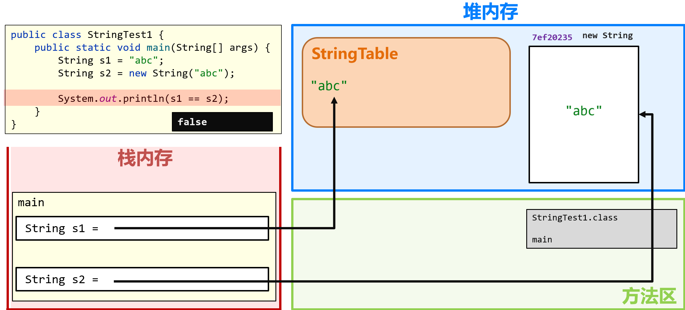

# 进阶篇

## 面向对象(Object-Oriented Programming)

客观存在的事物皆为对象 ，所以我们也常常说万物皆对象。

### 类和对象

类和对象的关系

* 类：类是对现实生活中一类具有共同属性和行为的事物的抽象
* 对象：是能够看得到摸的着的真实存在的实体

简单理解：**类是对事物的一种描述，对象则为具体存在的事物**

#### 类

Java 中想要创建对象，必须先要有类的存在，类指的是一组相关属性和行为的集合，我们将其理解为是一张对象的设计图，也就是理论、抽象的对象。

* 类是对现实生活中一类具有共同属性和行为的事物的抽象
* 类是对象的数据类型，类是具有相同属性和行为的一组对象的集合
* 简单理解：类就是对现实事物的一种描述

类的组成是由属性和行为两部分组成

* 属性：在类中通过成员变量来体现（类中方法外的变量）。相当于事物的特征，例如：手机事物（品牌，价格，尺寸）
* 行为(方法)：在类中通过成员方法来体现（和前面的方法相比去掉static关键字即可）。相当于事物能执行的操作，例如：手机事物（打电话，发短信）

类的定义步骤：

①定义类

②编写类的成员变量：跟之前定义变量的格式一样，只不过位置需要放在，方法的外面。

③编写类的成员方法：跟之前定义方法的格式一样，只不过需要去掉static关键字。

```java
public class 类名 {
	// 成员变量
	变量1的数据类型 变量1；
	变量2的数据类型 变量2;
	…
	// 成员方法
	方法1;
	方法2;	
}
```

示例代码：

```java
/*
    手机类：
        类名：
        手机(Phone)

        成员变量：
        品牌(brand)
        价格(price)

        成员方法：
        打电话(call)
        发短信(sendMessage)
 */
public class Phone {
    //成员变量
    String brand;
    int price;

    //成员方法
    public void call() {
        System.out.println("打电话");
    }

    public void sendMessage() {
        System.out.println("发短信");
    }
}

```

> 创建类的细节：一个.java文件中可以编写多个class
>
> 1. 保证类与类之间是平级关系，不能出现类嵌套的情况
> 2. 只能有一个被public修饰，否则文件会因为多个类名冲突而报错

#### 对象

创建对象的格式：类名 对象名 = new 类名();

调用成员的格式：
* 调用变量：对象名.成员变量
* 调用方法：对象名.成员方法(实际参数);

示例代码：

```java
/*
    创建对象
        格式：类名 对象名 = new 类名();
        范例：Phone p = new Phone();

    使用对象
        1：使用成员变量
            格式：对象名.变量名
            范例：p.brand
        2：使用成员方法
            格式：对象名.方法名()
            范例：p.call()
 */
public class PhoneDemo {
    public static void main(String[] args) {
        //创建对象
        Phone p = new Phone();

        //使用成员变量
        System.out.println(p.brand);
        System.out.println(p.price);

        p.brand = "小米";
        p.price = 2999;

        System.out.println(p.brand);
        System.out.println(p.price);

        //使用成员方法
        p.call();
        p.sendMessage();
    }
}
```

##### 对象内存图

###### 单个对象内存图


逐步分析：

1. 寻找main函数入口，因此类TestStudent进入方法区，main函数自动调用入栈。
2. 执行第一个语句，创建stu对象。因为用到Student因此类Student进入方法区，然后栈内存开辟空间，堆内存开辟空间存放成员变量和成员方法的引用地址，然后将堆内存开辟空间的地址传入栈中存放(引用数据类型特性)。
3. 打印stu对象，因为stu是引用数据类型，在栈中存放的是地址，因此打印对象的地址
4. 字符串和数字的初始化是null和0，因此打印就是null和0
5. 修改成员变量的值，首先在栈中找到对应对象地址，然后进入堆中进行修改。
6. 再次打印，数据被更改因此打印更改后数据
7. 调用成员方法，和5步骤一样，进入堆后找到对应成员方法地址,然后进入方法区字节码文件去找方法，找到后运行进栈，运行完清除
8. 主方法语句全部运行完，清栈清堆程序结束

###### 多个对象内存图


逐步分析：

1. 寻找main函数入口，因此类Test进入方法区，main函数自动调用入栈。
2. 执行第一个语句，创建stu1对象。因为用到Student因此类Student进入方法区，然后栈内存开辟空间，堆内存开辟空间存放成员变量和成员方法的引用地址，然后将堆内存开辟空间的地址传入栈中存放(引用数据类型特性)。
3. 修改stu1对象成员变量的值，首先在栈中找到对应对象地址，然后进入堆中进行修改。
4. 创建stu2对象。栈内存开辟空间，堆内存开辟空间存放成员变量和成员方法的引用地址，然后将堆内存开辟空间的地址传入栈中存放
5. 修改stu2对象成员变量的值，首先在栈中找到对应对象地址，然后进入堆中进行修改。
6. 打印两对象的成员变量，两对象步骤一样但路径不一样。
7. 调用成员方法，和6步骤一样，进入堆后找到对应成员方法地址,然后进入方法区字节码文件去找方法，找到后运行进栈，运行完清除。注意的是两对象运行的成员方法是同一个，方法也是引用数据类型。
8. 主方法语句全部运行完，清栈清堆程序结束

###### 两个引用指向相同内存图


##### 练习-学生对象

需求：首先定义一个学生类，然后定义一个学生测试类，在学生测试类中通过对象完成成员变量和成员方法的使用

分析：
* 成员变量：姓名，年龄…
* 成员方法：学习，做作业…

示例代码：

```java
public class Student {
    //成员变量
    String name;
    int age;

    //成员方法
    public void study() {
        System.out.println("好好学习，天天向上");
    }

    public void doHomework() {
        System.out.println("键盘敲烂，月薪过万");
    }
}
/*
    学生测试类
 */
public class StudentDemo {
    public static void main(String[] args) {
        //创建对象
        Student s = new Student();

        //使用对象
        System.out.println(s.name + "," + s.age);

        s.name = "林青霞";
        s.age = 30;

        System.out.println(s.name + "," + s.age);

        s.study();
        s.doHomework();
    }
}
```

### 成员变量和局部变量

| 区别         | 成员变量                                   | 局部变量                                       |
| ------------ | ------------------------------------------ | ---------------------------------------------- |
| 类中位置不同 | 方法外                                     | 方法中                                         |
| 初始化值不同 | 有默认初始化值                             | 没有，使用之前需要完成赋值                     |
| 内存位置不同 | 堆内存                                     | 栈内存                                         |
| 生命周期不同 | 随着对象的创建而存在，随着对象的消失而消失 | 随着方法的调用而存在，随着方法的运行结束而消失 |
| 作用域       | 在自己所归属的大括号中                     | 在自己所归属的大括号中                         |

### this关键字

this的作用是调用本类成员（变量成员或方法成员），主要用来区分局部变量和成员变量的重名问题（当局部变量和成员变量重名的时候, Java 使用的是就近原则），使用规则如下：

- this.本类成员变量 - 如果不涉及变量重复, this.可以省略
- this.本类成员方法(); - this.直接省略不影响调用

> this介绍：代表当前类的对象的地址。可以通过打印this来证明。并且也可以得知this是谁来调用我，我就代表谁。比如stu1调用this则this代表stu1的地址；stu2调用this则this代表stu2的地址。

```java
public class Student {
    private String name;
    private int age;

    public void setName(String name) {
        //成员变量name被成员方法setName里的局部变量name赋值
        this.name = name;
    }

    public String getName() {
        //返回成员变量name，因为没有涉及变量名重复
        return name;
    }

    public void setAge(int age) {
        //成员变量age被成员方法setAge里的局部变量age赋值
        this.age = age;
    }

    public int getAge() {
        //返回成员变量age，因为没有涉及变量名重复
        return age;
    }

    public void show() {
        //成员变量name和age进行字符串拼接
        System.out.println(name + "," + age);
        //this代表当前类的对象的地址
        System.out.println("this关键字：" + this);
    }
}
```

#### this内存图


逐步分析：（省略了方法区）

1. 方法区的字节码文件中的main自动入栈，然后使用Student类创建了stu对象，分别在栈和堆开辟了空间，其中stu对象的this存放的是自己在堆中的所在地址。
2. 修改对象中的成员变量，前面讲过不再讲。
3. 调用成员方法，方法sayHello入栈，西域狂鸭传参作为局部变量，在栈中开始运行方法。第一个sout打印因为没有使用this，因此调用的范围只能局限在栈内sayHello所在的空间，只能找到局部变量西域狂鸭。
4. 第二个sout使用了this，而sayHello的调用者为stu，因此this的地址就是在堆中的stu对象的地址。所以通过this直接拿到处于堆内存中的stu中的成员变量name的值，调用成员变量。
5. 结束

### 构造方法

#### 概述

构造方法（构造器）：初始化一个新建的对象，构建、创造对象的时候，所调用的方法。

格式：

1. 方法名与类名相同，大小写也要一致

2. 没有返回值类型，连void都没有

3. 没有具体的返回值（不能由return带回结果数据）

执行时机：

1. 创建对象的时候调用，每创建一次对象，就会执行一次构造方法

2. 不能手动调用构造方法

构造方法作用：

- 本质作用：创建对象

- 结合构造方法执行时机：给对象中的属性（成员变量）进行初始化

语法实例：

```java
class Student {
    int age;
    //构造函数创建（无参构造方法，也是系统默认给的构造方法）
    public Student() {
	
    }
    //构造函数重载
    public Student(int age) {
        this.age = 18;
    }
}

public class Test {
    public static void main(String[] args) {
        //构造函数使用（创建对象自动调用）
        Student stu = new Student();
    }
}
```

构造方法的创建：如果没有定义构造方法，系统将给出一个**默认**的**无参数构造方法**；如果定义了构造方法，系统将不再提供默认的构造方法

构造方法的重载：构造方法也是方法，允许重载关系出现

推荐的使用方式：无论是无参数构造方法和带参数构造方法，都自己手动写出

示例代码：

```java
/*
    学生类
 */
class Student {
    private String name;
    private int age;

    public Student() {}

    public Student(String name) {
        this.name = name;
    }

    public Student(int age) {
        this.age = age;
    }

    public Student(String name,int age) {
        this.name = name;
        this.age = age;
    }

    public void show() {
        System.out.println(name + "," + age);
    }
}
/*
    测试类
 */
public class StudentDemo {
    public static void main(String[] args) {
        //创建对象
        Student s1 = new Student();
        s1.show();

        //public Student(String name)
        Student s2 = new Student("林青霞");
        s2.show();

        //public Student(int age)
        Student s3 = new Student(30);
        s3.show();

        //public Student(String name,int age)
        Student s4 = new Student("林青霞",30);
        s4.show();
    }
}
```

#### 构造方法的执行流程


逐步分析：（省略了方法区）

1. 方法区的字节码文件中的main自动入栈开始第一个创建类Student对象的语句，在栈中开辟了一个Student类型的stu变量。
2. 然后执行语句右半部分，new先执行因此在堆中开辟空间产生地址；然后执行new后面的调用构造方法，因此构造方法Student()入栈执行
3. 在构造函数执行中，因为传参调用，因此构造方法里面的形参变量进行了赋值，且调用者也是Student，所以this.name就是成员变量name，因此成员变量name被构造函数的局部变量name赋值。同理age也一样。
4. 构造方法执行完毕出栈，这时堆才把地址交给栈中的stu变量

### 封装

#### 概述

封装是面向对象三大特征之一（封装，继承，多态），对象代表什么，就得封装对应的数据，并提供数据对应的行为

封装指的是使用类设计对象时，将需要处理的数据，以及处理这些数据的方法，设计到对象中。

封装代码实现：将类的某些信息隐藏在类内部，不允许外部程序直接访问，而是通过该类提供的方法来实现对隐藏信息的操作和访问
成员变量private，提供对应的getXxx()/setXxx()方法

例子如下：

```java
public class Student {
    int id;
    String name;
    int age;
    double mathScore;
    double chineseScore;
    
    //封装：使用类设计对象时，将需要处理的数据，以及处理这些数据的方法, 设计到对象中
    public Student(int id, String name, int age, double mathScore, double chineseScore) {
        this.id = id;
        this.name = name;
        this.age = age;
        this.mathScore = mathScore;
        this.chineseScore = chineseScore;
    }
    
    public double getTotalScore() {
        return mathScore + chineseScore;
    }
    
    public void showStudentInfos(){
        System.out.println("学号: " + id);
        System.out.println("姓名: " + name);
        System.out.println("年龄:" + age);
        System.out.println("数学成绩:" + mathScore);
        System.out.println("语文成绩:" + chineseScore);
    }
}

public class Test {
    public static void main(String[] args) {
        Student stu1 = new Student(1, "张三", 23,90,87);
        //外部无法直接访问对象中的数据(private情况下)，只能通过对象的成员方法来操作数据
        stu1.showStudentInfos();
        Student stu2 = new Student(2, "李四", 24,69,91);
        stu2.showStudentInfos();
    }
}
```

好处：更好的维护数据，使用者无需关心内部实现，只要知道如何使用即可。

> Random r = new Random();	int num = r.nextInt(100) + 1;
>
> Scanner sc = new Scanner(System.in);	int num = sc.nextInt();
>
> 这都是使用了封装思想，你使用这些类设计的对象时，不需要知道它怎么实现这些功能，只需要知道怎么去使用就可以。

#### 封装的设计规范

合理隐藏, 合理暴露。用户需要的暴露，用户不需要的隐藏。


如上图，在Phone中，call是暴露的供对象外调用，而saveLog则是隐藏的用于对象内部的调用。因此在对象外只能调用call方法而不是saveLog，这就是合理隐藏合理暴露，正常用户使用也只有call而不是saveLog

#### 权限修饰符

用于修饰成员(成员变量、成员方法)，不同权限修饰符修饰的成员，权限大小不一样

- private：私有权限，同一个类中
- (defalut)：默认权限，同一个包中
- protected：不同包的子类中
- public ：公共权限，任意位置访问(同一个项目中)

##### private关键字

private修饰成员访问权限很低，被private修饰的成员，只能在本类进行访问，一般用于私有成员变量保证安全性。

针对private修饰的成员变量，如果需要被其他类使用，需要提供相应的操作：

* 提供“get变量名()”方法，用于获取成员变量的值，方法用public修饰
* 提供“set变量名(参数)”方法，用于设置成员变量的值，方法用public修饰

示例代码：

```java
/*
    学生类
 */
class Student {
    //成员变量
    String name;
    private int age;

    //提供get/set方法
    public void setAge(int a) {
        if(a<0 || a>120) {
            System.out.println("你给的年龄有误");
        } else {
            age = a;
        }
    }

    public int getAge() {
        return age;
    }

    //成员方法
    public void show() {
        System.out.println(name + "," + age);
    }
}
/*
    学生测试类
 */
public class StudentDemo {
    public static void main(String[] args) {
        //创建对象
        Student s = new Student();
        //给成员变量赋值
        s.name = "林青霞";
        s.setAge(30);
        //调用show方法
        s.show();
    }
}
```

### 标准实体类(JavaBean)制作

JavaBean：实体类，指封装数据的类，如曾写过的Student、Book、Phone等。

但这些自己写的实体类不一定符合标准，作为一个标准的JavaBean，需要做到如下几点：

1. 类名需要见名知意
2. 类中的成员变量都要私有，使用private修饰。并且要对外提供每一个成员变量对应的getXxx ，setXxx方法。
3. 类中提供无参构造方法和带全部参数的构造方法
4. 如果还有其他行为，也需要写上

> 当然一个实体类有很多成员变量将会很难写，因此都会有相应的快捷键，比如写完私有的成员变量后，对空白区域右键选择Generate，选择第一个Constructor(构造器)，然后在选项卡中生成要生成的构造函数即可。生成get和set方法就选择Getter and Setter，在选项卡中生成要生成成员变量的get和set即可。
>
> 当然更快的可以使用插件，在设置里下载插件ptg，以后在写完一个类的成员变量后，直接右键选择ptg to javabean，直接全部写完

实体类的应用场景：实体类只负责数据存取，而对数据的处理交给其他类来完成，以实现数据和数据业务处理相分离。比如之前在Student类中写过一些业务方法比如计算学生总成绩等，这样的业务方法应该分离出来做成单独的一个类。这样在以后代码多的情况能够更好的管理代码。

> 因此一个标准的实体类是不存在业务方法的，当然现在没有进行细讲所以暂时将处理数据的方法都放进实体类中

### 练习

#### 标准学生类

需求：定义标准学生类，要求分别使用空参和有参构造方法创建两对象，空参创建的对象通过setXxx赋值，有参创建的对象直接赋值，最后两对象通过show方法展示数据。 

示例代码：

```java
class Student {
    //1.成员变量私有化
    private String name;
    private int age;

    //2.空参、带参构造方法
    public Student() {
    }

    public Student(String name, int age) {
        this.name = name;
        this.age = age;
    }

    //3.每一个成员变量对应的getXxx ，setXxx成员方法。
    public void setName(String name) {
        this.name = name;
    }

    public String getName() {
        return name;
    }

    public void setAge(int age) {
        this.age = age;
    }

    public int getAge() {
        return age;
    }

    //成员方法
    public void show() {
        System.out.println(name + "," + age);
    }
}
/*
    创建对象并为其成员变量赋值的两种方式
        1:无参构造方法创建对象后使用setXxx()赋值
        2:使用带参构造方法直接创建带有属性值的对象
*/
public class StudentDemo {
    public static void main(String[] args) {
        //无参构造方法创建对象后使用setXxx()赋值
        Student s1 = new Student();
        s1.setName("林青霞");
        s1.setAge(30);
        s1.show();

        //使用带参构造方法直接创建带有属性值的对象
        Student s2 = new Student("林青霞",30);
        s2.show();
    }
}
```

#### 标准账户类

需求：定义标准账户类，要求分别使用空参和有参构造方法创建两对象，空参创建的对象通过setXxx赋值，有参创建的对象直接赋值，然后将两对象打印出来。当前类中有个其他行为eat，对他进行使用。

示例代码：

```java
public class User {
    //1.私有化全部的成员变量
    //2.空参构造
    //3.带全部参数的构造
    //4.针对于每一个私有化的成员变量都要提供其对应的get和set方法
    //5.如果当前事物还有其他行为，那么也要写出来，比如学生的吃饭，睡觉等行为

    private String username;//用户名
    private String password;//密码
    private String email;//邮箱
    private char gender;//性别
    private int age;//年龄

    //空参构造方法
    public User() {
    }

    //带全部参数的构造
    public User(String username, String password, String email, char gender, int age) {
        this.username = username;
        this.password = password;
        this.email = email;
        this.gender = gender;
        this.age = age;
    }

    //get和set

    public String getUsername() {
        return username;
    }

    public void setUsername(String username) {
        this.username = username;
    }

    public String getPassword() {
        return password;
    }

    public void setPassword(String password) {
        this.password = password;
    }

    public String getEmail() {
        return email;
    }

    public void setEmail(String email) {
        this.email = email;
    }

    public char getGender() {
        return gender;
    }

    public void setGender(char gender) {
        this.gender = gender;
    }

    public int getAge() {
        return age;
    }

    public void setAge(int age) {
        this.age = age;
    }

    public void eat(){
        System.out.println(username + "在吃饭");
    }
}

public class Test {
    public static void main(String[] args) {
        //写一个标准的javabean类
        //咱们在课后只要能把这个标准的javabean能自己写出来，那么就表示今天的知识点就ok了


        //利用空参构造创建对象
        User u1 = new User();
        //如果利用空参创建对象，还想赋值只能用set方法赋值
        u1.setUsername("zhangsan");
        u1.setPassword("1234qwer");
        u1.setEmail("itheima@itcast.cn");
        u1.setGender('男');
        u1.setAge(23);
        //获取属性的值并打印
        System.out.println(u1.getUsername() + ", " + u1.getPassword()
                + ", " + u1.getEmail() + ", " + u1.getGender() + ", " + u1.getAge());
        u1.eat();

        System.out.println("=============================");

        //简单的办法
        //利用带全部参数的构造来创建对象
        //快捷键:ctrl + p
        User u2 = new User("lisi","12345678","lisi@itcast.cn",'女',24);
        System.out.println(u2.getUsername() + ", " + u2.getPassword()
                + ", " + u2.getEmail() + ", " + u2.getGender() + ", " + u2.getAge());
        u2.eat();
    }
}

```

#### 模仿电影信息系统

**需求**：用户运行程序可以在控制台输入选择：

1. 展示系统中的全部电影(每部电影展示：名称、评分)。
2. 允许用户根据电影编号（id）查询出某个电影的详细信息。
3. 退出

一共分为三个文件，分别是：

1. Movie：实体标准类，用来存放每部电影数据
2. MovieService：用来管理多个电影实体类对象，对此进行数据处理和功能实现
3. Test：new Movie实体类作为数据，并调用MovieService完成程序功能

此练习使用了包分类，因此需引用包。

```java
public class Movie {

    private int id;
    private String title;
    private String time;
    private double score;
    private String area;
    private String type;
    private String director;
    private String starring;


    public Movie() {
    }

    public Movie(int id, String title, String time, double score, String area, String type, String director, String starring) {
        this.id = id;
        this.title = title;
        this.time = time;
        this.score = score;
        this.area = area;
        this.type = type;
        this.director = director;
        this.starring = starring;
    }

    /**
     * 获取
     * @return id
     */
    public int getId() {
        return id;
    }

    /**
     * 设置
     * @param id
     */
    public void setId(int id) {
        this.id = id;
    }

    /**
     * 获取
     * @return title
     */
    public String getTitle() {
        return title;
    }

    /**
     * 设置
     * @param title
     */
    public void setTitle(String title) {
        this.title = title;
    }

    /**
     * 获取
     * @return time
     */
    public String getTime() {
        return time;
    }

    /**
     * 设置
     * @param time
     */
    public void setTime(String time) {
        this.time = time;
    }

    /**
     * 获取
     * @return score
     */
    public double getScore() {
        return score;
    }

    /**
     * 设置
     * @param score
     */
    public void setScore(double score) {
        this.score = score;
    }

    /**
     * 获取
     * @return area
     */
    public String getArea() {
        return area;
    }

    /**
     * 设置
     * @param area
     */
    public void setArea(String area) {
        this.area = area;
    }

    /**
     * 获取
     * @return type
     */
    public String getType() {
        return type;
    }

    /**
     * 设置
     * @param type
     */
    public void setType(String type) {
        this.type = type;
    }

    /**
     * 获取
     * @return director
     */
    public String getDirector() {
        return director;
    }

    /**
     * 设置
     * @param director
     */
    public void setDirector(String director) {
        this.director = director;
    }

    /**
     * 获取
     * @return starring
     */
    public String getStarring() {
        return starring;
    }

    /**
     * 设置
     * @param starring
     */
    public void setStarring(String starring) {
        this.starring = starring;
    }

}
```

```java
import java.util.Scanner;

public class MovieService {

    private Movie[] movies;

    private Scanner sc = new Scanner(System.in);

    public MovieService(Movie[] movies) {
        this.movies = movies;
    }

    /**
     * 启动电影信息管理系统
     */
    public void start() {

        lo:
        while (true) {
            System.out.println("----------电影信息系统----------");
            System.out.println("请输入您的选择:");
            System.out.println("1. 查询全部电影信息");
            System.out.println("2. 根据id查询电影信息");
            System.out.println("3. 退出");

            int choice = sc.nextInt();

            switch (choice) {
                case 1:
                    queryMovieInfos();
                    break;
                case 2:
                    queryMovieInfoById();
                    break;
                case 3:
                    System.out.println("感谢您的使用, 再见!");
                    break lo;
                default:
                    System.out.println("您的输入有误, 请检查");
                    break;
            }
        }
    }

    /**
     * 此方法根据电影编号, 查询电影详情信息
     */
    private void queryMovieInfoById() {
        // 1. 键盘录入用户输入的编号
        System.out.println("请输入您要查询的电影编号:");
        int id = sc.nextInt();
        // 2. 遍历数组, 从数组中查询电影信息
        for (int i = 0; i < movies.length; i++) {
            Movie movie = movies[i];
            if(movie.getId() == id){
                // 3. 将找到的电影信息, 打印在控制台
                System.out.println(movie.getId() + "---" + movie.getTitle() + "---" + movie.getTime()
                        + "---" + movie.getScore() + "---" + movie.getArea() + "---"
                        + movie.getType() + "---" + movie.getDirector() + "---" + movie.getStarring());
                return;
            }
        }

        // 代码要是走到这里, 说明没找到
        System.out.println("您输入的编号不存在, 请检查!");

    }


    /**
     * 展示系统中全部的电影 (名称, 评分)
     */
    private void queryMovieInfos() {
        // 1. 遍历数组, 取出每一个电影对象
        for (int i = 0; i < movies.length; i++) {
            Movie movie = movies[i];
            // System.out.println(movie);   打印对象名, 会看到内存地址
            // 2. 通过电影对象, 调用内部getXxx方法, 获取信息并打印
            System.out.println(movie.getTitle() + "---" + movie.getScore());
        }
    }
}

```

```java
public class Test {
    public static void main(String[] args) {

        Movie movie1 = new Movie(1, "东八区的先生们", "2022", 2.1, "中国大陆", "剧情 喜剧", "夏睿", "张翰 王晓晨");
        Movie movie2 = new Movie(2, "上海堡垒", "2019", 2.9, "中国大陆", "爱情 战争 科幻", "滕华涛", "鹿晗 舒淇");
        Movie movie3 = new Movie(3, "纯洁心灵·逐梦演艺圈", "2015", 2.2, "中国大陆", "剧情 喜剧", "毕志飞", "朱一文 李彦漫");

        Movie[] movies = {movie1, movie2, movie3};

        // 该如何将一个类中的数据, 传递给另外一个类
        MovieService movieService = new MovieService(movies);
        movieService.start();
    }
}
```

## API

### API概述

API (Application Programming Interface) ：应用程序编程接口。   意思就是别人写好的一些类，给咱们程序员直接拿去调用即可解决问题的。java中的API，指的就是 JDK 中提供的各种功能的 Java类，这些类将底层的实现封装了起来，我们不需要关心这些类是如何实现的，只需要学习这些类如何使用即可，我们可以通过帮助文档来学习这些API如何使用。

> 已经学习过的API：Scanner 键盘录入、Random 随机数。

> 查询如何使用一个API：直接上官网查询即可，比如Random。主要看如下几点：
>
> 1. 类在哪个包下：如果是lang包(核心包)，那么就不需要impart导入。如果是其他则需要进行导入所在包。
> 2. 类的描述：明白这个类是干什么用的
> 3. 构造方法：知道怎么使用这个类，写入什么参数，用于创建该类的对象
> 4. 成员方法：看成员方法的参数，有无返回值

### Scanner

在接收数据的时候，会遇到空格，回车，制表符其中一个就会停止接收数据。

主要将以下几个成员方法：next（）、nextLine（）、nextInt（）、nextDouble（）。

#### next()

可以接受任意数据，并返回一个字符串。

比如：键盘录入abc，那么会把abc看做字符串返回；键盘录入123，那么会把123看做字符串返回。

```java
Scanner sc = new Scanner(System.in);
String s = sc.next();//录入的所有数据都会看做是字符串
System.out.println(s);
```

遇到空格，回车，制表符其中一个就会停止接收数据。

```java
Scanner sc = new Scanner(System.in);
String s = sc.next();
System.out.println(s);
//键盘录入：a b//注意录入的时候a和b之间加空格隔开。
//此时控制台打印a
//表示next方法在接收数据的时候，遇到空格就停止了，后面的本次不接收。
```

#### nextInt（）

只能接受整数，并返回一个整数。

比如：键盘录入123，那么会把123当做int类型的整数返回。键盘录入小数或者其他字母，就会报错。

```java
Scanner sc = new Scanner(System.in);
int s = sc.nextInt();//只能录入整数
System.out.println(s);
```

遇到空格，回车，制表符其中一个就会停止接收数据。

```java
Scanner sc = new Scanner(System.in);
int i = sc.nextInt();
System.out.println(i);
//键盘录入：1 2//注意录入的时候1和2之间加空格隔开。
//此时控制台打印1
//表示nextInt方法在接收数据的时候，遇到空格就停止了，后面的本次不接收。
```

#### nextDouble（）

能接收整数和小数，但是都会看做小数返回。

```java
Scanner sc = new Scanner(System.in);
double d = sc.nextDouble();//录入的整数，小数都会看做小数。
System.out.println(d);
```

遇到空格，回车，制表符其中一个就会停止接收数据。

```java
Scanner sc = new Scanner(System.in);
double d = sc.nextDouble();
System.out.println(d);
//键盘录入：1.1 2.2//注意录入的时候1.1和2.2之间加空格隔开。
//此时控制台打印1.1
//表示nextDouble方法在接收数据的时候，遇到空格就停止了，后面的本次不接收。
```

#### nextLine()

可以接受任意数据，并返回一个字符串。nextLine（）方法是把一整行全部接收完毕。

比如：键盘录入abc，那么会把abc看做字符串返回；键盘录入123，那么会把123看做字符串返回。

```java
Scanner sc = new Scanner(System.in);
String s = sc.nextLine();//录入的所有数据都会看做是字符串
System.out.println(s);
```

#### 不同之处

next（），nextInt（），nextDouble（）在接收数据的时候，会遇到空格，回车，制表符其中一个就会停止接收数据。但是这些符号 + 后面的数据还在内存中并没有接收。如果后面还有其他键盘录入的方法，会自动将这些数据接收，在接收时会最先过滤最前面的空格。

```java
Scanner sc = new Scanner(System.in);
String s1 = sc.next();
String s2 = sc.next();
System.out.println(s1);
System.out.println(s2);
//此时值键盘录入一次 a b(注意a之前有空格，a和b之间用空格隔开)
//那么第一个next();会过滤掉最前面的所有空格，然后接收a，a后面是空格，那么就停止，所以打印s1是a
//但是空格+b还在内存中。
//第二个next会去掉前面的空格，只接收b
//所以第二个s2打印出来是b
```

而nextLine（）方法是把一整行全部接收完毕。那么nextLine不会过滤前面的空格等符号，会把这一整行数据全部接收完毕，因此也不会在内存中留下数据。

```java
Scanner sc = new Scanner(System.in);
String s = sc.nextLine();
System.out.println(s);
//键盘录入a b(注意a和b之间用空格隔开)
//那么nextLine不会过滤前面和后面的空格，会把这一整行数据全部接收完毕，并且内存中也不会留下它的结束符号回车。
```

##### 混用引起的后果

上面说的两套键盘录入不能混用，如果混用会有严重的后果。

```java
Scanner sc = new Scanner(System.in);//①
int i = sc.nextInt();//②
String s = sc.nextLine();//③
System.out.println(i);//④
System.out.println(s);//⑤
```

当代码运行到第二行，会让我们键盘录入，此时录入123。

但是实际上我们录的是123+回车。

而nextInt是遇到空格，回车，制表符都会停止，且符号不会清除。

所以nextInt只能接受123，回车还在内存中没有被接收。

此时就被nextLine接收了。而nextLine不会进行符号过滤，因此接收到回车直接结束了方法。

所以，如果混用就会导致nextLine接收不到数据。

##### 如何使用

键盘录入分为两套，两套决不能混用：

- 数据除字符串还有其他类型：next（）、nextInt（）、nextDouble（）这三个配套使用。

- 数据全是字符串：nextLine（）。

如果要使用第二套，且想要整数，那么先接收，再使用Integer.parseInt进行类型转换。

代码示例：

```java
Scanner sc = new Scanner(System.in);
String s = sc.next();//键盘录入123
System.out.println("此时为字符串" + s);//此时123是字符串
int i = sc.nextInt();//键盘录入123
System.out.println("此时为整数：" + i);
```

```java
Scanner sc = new Scanner(System.in);
String s = sc.nextLine();//键盘录入123，回车在作为结束符后被当前nextLine清除
System.out.println("此时为字符串" + s);//此时123是字符串
int i = Integer.parseInt(s);//想要整数再进行转换
System.out.println("此时为整数：" + i);
```

> 我们不需要解决这样的问题，因为Scanner采集用户信息只是在学习的时候用到，正常开发都是在前端拿到用户信息，后端处理，根本不会用Scanner。

### String

#### 概述

String 类代表字符串，Java 程序中的所有字符串文字（例如“abc”）都被实现为此类的实例(对象)。也就是说，**Java 程序中所有的双引号字符串，都是 String 类的对象**。String 类在 java.lang 包下，所以使用的时候不需要导包！

String类的特点：

- Java 程序中所有的双引号字符串，都是 String 类的对象。

  > 比如System.out.println("abc".toUpperCase);是被允许的

- 字符串在创建之后，其内容不能更改：即字符串变量(对象)只能替换为新字符串(对象)，而不是更改原有的字符串(对象)，而且他也没有提供setxxx方法让你更改内容。

  > 这里把他们都看成对象就行了，比如String类型创建的变量是对象，双引号字符串也是对象，对象 = 对象并没有改变任何一个对象本身的值，只是改变了变量里存放的地址值。

- 虽然字符串不可改变，但是它们可以被共享：同上，字符串作为引用数据类型，本身就允许多个变量引用其地址。而由于双引号特殊机制，在使用双引号创建的字符串对象时，会检查字符串常量值中是否存在该数据。如果不存在则会创建该字符串对象，如果存在，则会自动复用，其地址自动被需要的字符串变量引用。

  > 字符串常量：在jdk7版本之前处于方法区当中，jdk7开始之后处于堆中。

- 字符串效果上相当于字符数组( char[] )，但是底层原理是字节数组( byte[] )

String类常用的构造方法：

| 方法名                         | 说明                                                         |
| ------------------------------ | ------------------------------------------------------------ |
| public String()                | 创建一个空白字符串对象，不含有任何内容                       |
| public String(String original) | 根据传入的字符串，创建字符串对象                             |
| public String(char[] chs)      | 根据字符数组的内容，来创建字符串对象                         |
| public String(byte[] bys)      | 根据字节数组的内容，来创建字符串对象                         |
| String s = “abc”;              | 直接赋值的方式创建字符串对象，内容就是abc（只有String类有这样的构造方法） |

创建字符串对象两种方式的区别：

- 通过构造方法创建：前四种通过 new 创建的字符串对象，每一次 new 一定都会在堆中申请一个内存空间，就算是赋值相同的字符串，虽然在堆中存放的内容相同，但是每个堆的地址不同，因此变量名是不相等的，而堆中存放的是相同的地址值，因为该字符串对象已被创建于字符串常量池中，会被自动复用。
- 直接赋值方式创建：最后一种以"abc"方式给出的字符串，此时字符串对象abc是存在字符串常量池中的，因此会先检查字符串常量池中有没有字符串对象abc，如果有，不会创建新的，而是直接复用。如果没有abc，才会创建一个新的。所以只要字符序列(顺序和大小写)相同，无论在程序代码中出现几次，JVM 都只会建立一个 String 对象，并在字符串池中维护。所以，直接赋值的方式，代码简单，而且节约内存。


示例代码：

```java
  public class StringDemo01 {
      public static void main(String[] args) {
          //public String()：创建一个空白字符串对象，不含有任何内容
          String s1 = new String();
          System.out.println("s1:" + s1);
  
          //public String(char[] chs)：根据字符数组的内容，来创建字符串对象
          char[] chs = {'a', 'b', 'c'};
          String s2 = new String(chs);
          System.out.println("s2:" + s2);
  
          //public String(byte[] bys)：根据字节数组的内容，来创建字符串对象
          byte[] bys = {97, 98, 99};
          String s3 = new String(bys);
          System.out.println("s3:" + s3);
          
          //public String(String original)：根据传入的字符串，创建字符串对象
          String s4 = new String("abc");
          System.out.println("s4:" + s4);
  
          //String s = “abc”;	直接赋值的方式创建字符串对象，内容就是abc
          String s5 = "abc";
          System.out.println("s5:" + s5);
      }
  }
```

##### 练习题

- 1. 类文件进入方法区，main函数自动入栈
  2. 字符串变量s1创建同时创建字符串对象abc，首先查询字符串常量池是否有对象abc，没有因此创建对象abc后传回其地址值给s1
  3. 字符串变量s2创建同时创建字符串对象abc，首先查询字符串常量池是否有对象abc，找到后复用，返回对象abc的地址值
  4. s1 == s2，比的是两个变量内的值，即指向对象的地址值，地址值一样，相等。

  

- 1. 类文件进入方法区，main函数自动入栈

  2. 字符串变量s1创建同时创建字符串对象abc，首先查询字符串常量池是否有对象abc，没有因此创建对象abc后传回其地址值给s1

  3. 字符串变量s2创建同时创建字符串对象abc，确定字符串常量池拥有对象abc后，使用new在堆中开辟空间创建对象s2，此对象的地址值返回给字符串变量s2，而s2对象内部则存放了指向字符串常量池中的abc字符串对象的地址。

     > 字符串的源代码层面(底层)就是一个字节数组(byte[] value)。所以在堆中的字符串对象内部存放的就是通过拷贝在字符串常量池中的那个字符串对象的字节数组，也就是拷贝了字符串对象的地址。
     >
     > 还有，如果字符串对象abc在执行此语句前没有被创建，那么此语句一共创建了两个对象。一个在堆中，一个在字符串常量池中。

  4. s1 == s2，比的是两个变量内的值，即指向对象的地址值，地址值不一样，不相等。

  

- 1. 类文件进入方法区，main函数自动入栈
  2. 字符串变量s1创建同时创建字符串对象abc，首先查询字符串常量池是否有对象abc，没有因此创建对象abc后传回其地址值给s1
  3. 字符串变量s2创建同时创建字符串对象ab，首先查询字符串常量池是否有对象ab，没有因此创建对象ab后传回其地址值给s2
  4. 字符串变量s3创建同时创建字符串对象c，查询字符串常量池没有c后进行创建。然后因为+号拼接字符串所以系统自动在堆中创建一个叫StringBuilder的对象，该对象将加号两边的字符串对象拿到后在对象内部进行拼接，拼完后自动调用此对象中的toString方法转换拼接后的字符串到一个Sting类的对象中去(为了统一类型)，最后将这个Sting类对象的地址交给s3。
  5. s1 == s2，比的是两个变量内的值，即指向对象的地址值，地址值不一样，不相等。

  

- 1. 类文件进入方法区，main函数自动入栈

  2. 字符串变量s1创建同时创建字符串对象abc，首先查询字符串常量池是否有对象abc，没有因此创建对象abc后传回其地址值给s1

  3. 由于java存在常量优化机制，因此在编译(java class)时，"a"+"b"+"c"会被自动优化成"abc"，所以此语句在编译后形成的字节码文件中，就是`String s2 = "abc";`，和s1语句一样。

     > 字节码文件在项目中的out文件夹中

  4. s1 == s2，比的是两个变量内的值，即指向对象的地址值，地址值一样，相等。

  

#### 字符串的比较方法

- ==：比较基本数据类型：比较的是具体的数值是否相等；比较引用数据类型：比较的是对象地址值是否相等

  结论：==只能用于比较基本数据类型。不能比较引用数据类型。

- equals(要比较的字符串)：`public boolean equals(Object anObject) `。用于比较两个字符串内容是否相同、区分大小写。结果完全一样是true，否则为false

- equalsIgnoreCase(要比较的字符串)：`public boolean equalsIgnoreCase(String anotherString)`，比较两个字符串内容是否相同、忽略大小写的比较。 结果完全一样是true，否则为false 。

```java
public class StringDemo02 {
    public static void main(String[] args) {
        //构造方法的方式得到对象
        String s1 = new String("abc");
        String s2 = new String("ABC");

        //直接赋值的方式得到对象
        String s3 = "abc";
        String s4 = "ABC";

        //比较字符串对象地址是否相同
        System.out.println(s1 == s2);//false
        System.out.println(s1 == s3);//false
        System.out.println(s3 == s4);//false
        System.out.println("--------");

        //比较字符串内容是否相同
        System.out.println(s1.equals(s2));//false
        System.out.println(s1.equals(s3));//true
        System.out.println(s3.equals(s4));//false
        System.out.println("--------");
        
        //比较字符串内容是否相同(不区分大小写)
        System.out.println(s1.equalsIgnoreCase(s2));//true
        System.out.println(s1.equalsIgnoreCase(s3));//true
        System.out.println(s3.equalsIgnoreCase(s4));//true
        System.out.println("--------");
    }
}
```

##### 案例-用户登录案例

案例需求：已知用户名和密码，请用程序实现模拟用户登录。总共给三次机会，登录之后，给出相应的提示

代码实现：

```java
public class Test1登录案例 {
    public static void main(String[] args) {
        //1.定义两个变量用来记录正确的用户名和密码
        String rightUsername = "itheima";
        String rightPassword = "1234qwer";

        //2.键盘录入用户名和密码
        //ctrl + alt + T 选择包裹方式

        for (int i = 0; i < 3; i++) {//0 1 2
            Scanner sc = new Scanner(System.in);
            System.out.println("请输入用户名");
            String username = sc.next();
            System.out.println("请输入密码");
            String password = sc.next();

            //3.判断比较
            if (username.equals(rightUsername) && password.equals(rightPassword)) {
                System.out.println("登录成功");
                //如果正确，循环结束
                break;
            } else {
                //最后一次机会
                if(i == 2){
                    System.out.println("账户" + username + "被锁定，请联系黑马程序员官方小姐姐：XXXXXXX");
                }else{
                    //不是最后一次机会
                    System.out.println("用户名或密码错误，登录失败,还剩下" + (2 - i) + "次机会");//2 1 0
                }
            }
        }

    }
}
```

#### 字符串的遍历方法

- toCharArray()：`public char[] toCharArray()`  ，返回一个由字符串转换的字符数组
- chatAt (int index)：`public char chatAt (int index)`，返回指定索引处的字符(索引从0开始)
- length()：`public int length()`， 返回字符串的长度，配合chatAt()可以遍历字符串

```java
public class Test2字符串直接遍历 {
    public static void main(String[] args) {
        String s5 = "Hello";
        //第一种遍历方法：
        //toCharArray()：将字符串转换为一个字符数组 
        char[] charArray = s5.toCharArray();
        for (int i = 0; i < charArray.length; i++) {
            System.out.println(charArray[i]);
        }
        System.out.println("--------");

        //第二种遍历方法：
        //charAt()：会根据索引获取对应的字符
        //length(): 会返回字符串的长度
        System.out.println(s5.charAt(2));//l
        for (int i = 0; i < s5.length(); i++) {
            char c = s5.charAt(i);
            System.out.println(c);
        }
    }
}
```

> 第一种遍历方法效率更高，因为第二种遍历频繁的调用方法(循环调用)，方法的调用都会进栈出栈，需要内存和时间。而第一种只调用了一次toCharArray()方法，并且第一种方法将字符串转换成数组遍历也更好理解。

##### 案例-统计字符次数案例

案例需求：键盘录入一个字符串，统计该字符串中大写字母字符，小写字母字符，数字字符出现的次数(不考虑其他字符)

代码实现：

```java
public class Test4统计个数 {
    public static void main(String[] args) {
        //键盘录入一个字符串，统计大写，小写，数字出现的次数


        //1.键盘录入一个字符串
        Scanner sc = new Scanner(System.in);
        System.out.println("请输入一个字符串");
        String str = sc.next();


        //2.统计 --- 计数器count
        //此时我要统计的有3样东西，所以要定义3个计数器分别进行统计
        int bigCount = 0;
        int smallCount = 0;
        int numberCount = 0;
        //得到这个字符串里面每一个字符
        for (int i = 0; i < str.length(); i++) {
            //i 表示字符串中的索引
            //c 表示字符串中的每一个字符
            char c = str.charAt(i);

            //对c进行判断
            if (c >= 'a' && c <= 'z') {
                smallCount++;
            }else if(c >= 'A' && c <= 'Z'){
                bigCount++;
            }else if(c >= '0' && c <= '9'){
                numberCount++;
            }
        }

        //3.当循环结束之后，三个变量记录的就是对应的个数
        System.out.println("大写字符有:" + bigCount + "个");
        System.out.println("小写字符有:" + smallCount + "个");
        System.out.println("数字字符有:" + numberCount + "个");
    }
}

```

#### 字符串的截取方法

- substring(int beginIndex)：`public String substring(int beginIndex)`，根据传入的索引开始截取字符串直至末尾。
- substring(int beginIndex, int endIndex)：`public String substring(int beginIndex, int endIndex)`，根据传入的开始和结束索引截取字符串，注意包头不包尾，包左不包右。

```java
//substring(int beginIndex)
String s6 = "hello";
String substring = s6.substring(2);
System.out.println(substring);//llo

//substring(int beginIndex, int endIndex)
String substring1 = s6.substring(0, 1);
System.out.println(substring1);//h
```

##### 案例-手机号屏蔽

需求：以字符串的形式从键盘接受一个手机号，将中间四位号码屏蔽。最终效果为：`131****9468`

代码实现：

```java
public class Test8手机号屏蔽 {
    public static void main(String[] args) {
        /*以字符串的形式从键盘接受一个手机号，将中间四位号码屏蔽
        最终效果为：131****9468*/

        //1.键盘录入一个手机号码
        Scanner sc = new Scanner(System.in);
        System.out.println("请输入手机号码");
        String phoneNumber = sc.next();//13112349408

        //2.截取手机号码中的前三位
        String star = phoneNumber.substring(0, 3);

        //3.截取手机号码中的最后四位
        //此时我用substring方法，是用1个参数的，还是两个参数的？1个参数的会更好
        //因为现在我要截取到最后，所以建议使用1个参数的。
        String end = phoneNumber.substring(7);

        //4.拼接
        String result = star + "****" + end;

        System.out.println(result);

    }
}

```

#### 字符串的替换方法

replace(旧值,新值)：`public String replace(CharSequence target, CharSequence replacement)`，用于替换一个字符串中的部分字符串，第一个参数是要被替换的字符串部分，第二个是替换字符串，注意返回值才是替换之后的结果。

````java
//replace(CharSequence target, CharSequence replacement)
String s7 = "hello";
String replace = s7.replace("ello", "aha");
System.out.println(replace);
System.out.println("--------");//haha
````

##### 案例-敏感词替换 

需求1：键盘录入一个 字符串，如果字符串中包含（TMD），则使用***替换 

```java
public class Test9敏感词替换 {
    public static void main(String[] args) {
        //1.定义一个变量表示骂人的话
        String talk = "后裔你玩什么啊，TMD";


        //2.把这句话中的敏感词进行替换
        String result = talk.replace("TMD", "***");

        //3.打印
        System.out.println(talk);
        System.out.println(result);
    }
}

```

需求2：如果要替换的敏感词比较多怎么办？

```java
public class Test10多个敏感词替换 {
    public static void main(String[] args) {
        //实际开发中，敏感词会有很多很多

        //1.先键盘录入要说的话
        Scanner sc = new Scanner(System.in);
        System.out.println("请输入要说的话");
        String talk = sc.next();//后裔你玩什么啊，TMD,GDX,ctmd,ZZ

        //2.定义一个数组用来存多个敏感词
        String[] arr = {"TMD","GDX","ctmd","ZZ","lj","FW","nt"};

        //3.把说的话中所有的敏感词都替换为***

        for (int i = 0; i < arr.length; i++) {
            //i 索引
            //arr[i] 元素 --- 敏感词
            talk = talk.replace(arr[i],"***");
        }

        //4.打印结果
        System.out.println(talk);//后裔你玩什么啊，***,***,***,***
    }
}
```

#### 字符串的切割方法

split(String regex)：`public String[] split(String regex);`，根据传入的字符串(正则表达式)作为规则进行切割，将切割后的内容存入字符串数组中并返回。

```java
//public String[] split(String regex)
String s8 = "192,168,1,1";
String[] split = s8.split(",");
for (int i = 0; i < split.length; i++) {
	System.out.println(split[i]);
}
```

#### 练习

##### 身份证信息查看

需求：身份证的每一位都是有固定的含义：

* 1、2位：省份 
* 3、4位：城市 
* 5、6位：区县 
* 7-14位：出生年、月、日 
* 15、16位：所在地派出所 
* 17位：性别（奇数男性，偶数女性）
* 18位：个人信息码（随机产生） 

要求打印内容方式如下：

​	人物信息为：

​	出生年月日：XXXX年X月X日

​	性别为：男/女

```java
package com.itheima.stringdemo;

public class StringDemo11 {
    public static void main(String[] args) {
        //1.定义一个字符串记录身份证号码
        String id = "321281202001011234";

        //2.获取出生年月日
        String year = id.substring(6, 10);
        String month = id.substring(10, 12);
        String day = id.substring(12, 14);


        System.out.println("人物信息为：");
        System.out.println("出生年月日:" + year + "年" + month + "月" + day + "日");

        //3.获取性别
        char gender = id.charAt(16);//'3'  ---> 3
        //利用ASCII码表进行转换
        //'0' --->  48
        //'1' --->  49
        //'2' --->  50
        //'3' --->  51
        //'4' --->  52
        //'5' --->  53
        //'6' --->  54
        //'7' --->  55
        //'8' --->  56
        //'9' --->  57

       int num = gender - 48;
        if(num % 2 == 0){
            System.out.println("性别为:女");
        }else{
            System.out.println("性别为:男");
        }
    }
}
```

##### 字符串拼接案例

案例需求：定义一个方法，把 int 数组中的数据按照指定的格式拼接成一个字符串返回，调用该方法，并在控制台输出结果。例如，数组为 int[] arr = {1,2,3}; ，执行方法后的输出结果为：[1, 2, 3]

代码实现：

```java
public class Test5数组拼接成字符串 {
    public static void main(String[] args) {
        //定义一个方法，把 int 数组中的数据按照指定的格式拼接成一个字符串返回，调用该方法，
        //并在控制台输出结果。例如，数组为 int[] arr = {1,2,3};
        //执行方法后的输出结果为：[1, 2, 3]


        int[] arr = {1, 2, 3, 4, 5};

        String str = arrToString(arr);
        System.out.println(str);

    }


    //作用：把一个数组变成字符串
    public static String arrToString(int[] arr) {
        String s = "";
        //拼接左括号
        s = s + "["; //此时是拿着长度为0的字符串，跟[进行拼接，产生一个新的字符串。
        //把新的字符串再赋值给s，此时变量s记录的就是新的字符串"["的地址值

        //下面我想得到数组里面的每一个元素并进行拼接
        //那么就需要遍历数组，得到每一个元素才行
        for (int i = 0; i < arr.length; i++) {
            //假设第一次循环:i = 0 获取的就是0索引上的元素
            //在拼接的时候："[" + 1 + ", " 拼接完毕之后产生一个新的字符串 "[1, "
            //第二次循环：i = 1 获取的就是1索引上的元素
            //在拼接的时候： 此时s就是第一次循环结束后拼接完毕的结果："[1, "
            //在拼接的时候："[1, " + 2 + ", " 拼接完毕之后产生一个新的字符串 "[1, 2, "
            //...
           if(i == arr.length - 1){
               //如果是最后一个元素，那么不需要拼接逗号空格
               s = s + arr[i];
           }else{
               //如果不是最后一个元素，需要拼接元素和逗号空格
               s = s + arr[i] + ", ";
           }
        }

        //等循环结束之后，再拼接最后一个右括号
        s = s + "]";

        return s;

    }


    //用来遍历数组
    public static void printArr(int[] arr) {
        System.out.print("[");
        for (int i = 0; i < arr.length; i++) {
            if (i == arr.length - 1) {
                System.out.print(arr[i]);
            } else {
                System.out.print(arr[i] + ", ");
            }
        }
        System.out.println("]");

        //[1, 2, 3, 4, 5]
        //我们现在要知道，这个最终结果是怎么来的？
        //从到右依次打印得来的。
    }
}

```

##### 字符串反转案例

案例需求：定义一个方法，实现字符串反转。键盘录入一个字符串，调用该方法后，在控制台输出结果；例如，键盘录入 abc，输出结果 cba

代码实现：

```java
public class Test6反转字符串 {
    public static void main(String[] args) {
        /*定义一个方法，实现字符串反转。键盘录入一个字符串，调用该方法后，在控制台输出结果
        例如，键盘录入 abc，输出结果 cba*/


        //1.定义一个字符串
        Scanner sc = new Scanner(System.in);
        System.out.println("请输入一个字符串");
        String str = sc.next();
        //2.定义一个方法，反转字符串
        //abc  --->  cba
        //可以把字符串倒着遍历，再拼接
        String result = reverse(str);
        System.out.println(result);


    }

    //注释：方法的作用就是反转字符串
    //把传递进来的字符串进行反转
    public static String reverse(String str){//abc
        //核心思想：倒着遍历并进行拼接就可以了
        //fori :正着遍历  forr：倒着遍历
        String s = "";
        for (int i = str.length() - 1; i >= 0; i--) {
            //i 依次表示字符串里面的每一个索引（倒着的）
            //我们就可以拿到里面的每一个字符并拼接
            s = s + str.charAt(i);
        }

        //把倒着拼接之后的结果返回即可
        return s;

    }
}

```

##### 金额转换

案例需求：把2135变成：零佰零拾零万贰仟壹佰叁拾伍元 ；把789变成：零佰零拾零万零仟柒佰捌拾玖元

代码实现：

```java
package com.itheima.stringdemo;

import java.util.Scanner;

public class StringDemo9 {
    public static void main(String[] args) {
        //1.键盘录入一个金额
        Scanner sc = new Scanner(System.in);
        int money;
        while (true) {
            System.out.println("请录入一个金额");
            money = sc.nextInt();
            if (money >= 0 && money <= 9999999) {
                break;
            } else {
                System.out.println("金额无效");
            }
        }

        //定义一个变量用来表示钱的大写
        String moneyStr = "";

        //2.得到money里面的每一位数字,再转成中文
        while (true) {//2135
            //从右往左获取数据，因为右侧是数据的个位
            int ge = money % 10;
            String capitalNumber = getCapitalNumber(ge);
            //把转换之后的大写拼接到moneyStr当中
            moneyStr = capitalNumber + moneyStr;
            //第一次循环 ： "伍" + "" = "伍"
            //第二次循环 ： "叁" + "伍" = "叁伍"
            //去掉刚刚获取的数据
            money = money / 10;

            //如果数字上的每一位全部获取到了，那么money记录的就是0，此时循环结束
            if (money == 0) {
                break;
            }
        }

        //3.在前面补0，补齐7位
        int count = 7 - moneyStr.length();
        for (int i = 0; i < count; i++) {
            moneyStr = "零" + moneyStr;
        }
        System.out.println(moneyStr);//零零零贰壹叁伍

        //4.插入单位
        //定义一个数组表示单位
        String[] arr = {"佰","拾","万","仟","佰","拾","元"};
        //               零    零   零   贰   壹   叁   伍

        //遍历moneyStr，依次得到 零    零   零   贰   壹   叁   伍
        //然后把arr的单位插入进去

        String result = "";
        for (int i = 0; i < moneyStr.length(); i++) {
            char c = moneyStr.charAt(i);
            //把大写数字和单位拼接到result当中
            result = result + c + arr[i];
        }

        //5.打印最终结果
        System.out.println(result);

    }


    //定义一个方法把数字变成大写的中文
    //1 -- 壹
    public static String getCapitalNumber(int number) {
        //定义数组，让数字跟大写的中文产生一个对应关系
        String[] arr = {"零", "壹", "贰", "叁", "肆", "伍", "陆", "柒", "捌", "玖"};
        //返回结果
        return arr[number];
    }

}

```

### StringBuilder

#### 概述

StringBuilder可以**提高字符串操作效率**，当我们在拼接字符串和反转字符串的时候会使用到。

1. StringBuilder 是字符串的缓冲区, 我们可以将其理解为是一种容器，这个容器可以存储任何数据类型，但只要进入这个容器，就会全部变成字符串。

   ```java
   public class TestStringBuilder {
       public static void main(String[] args) {
           StringBuilder sb = new StringBuilder();
   
           sb.append(100);
           sb.append(45.6);
           sb.append(false);
           sb.append('中');
           sb.append("叮咚鸡");
   
           System.out.println(sb);//10045.6false中叮咚鸡
       }
   }
   ```

2. 容器是一种可变的字符序列，创建之后里面的内容是可变的。

   ```java
   public class TestStringBuilder {
       public static void main(String[] args) {
           System.out.println(sb);//
           sb.append("红色");
           System.out.println(sb);//红色
           sb.append("绿色");
           System.out.println(sb);//红色绿色
           sb.append("蓝色");
           System.out.println(sb);//红色绿色蓝色
       }
   }
   ```

构造方法：

| 构造方法                         | 说明                                                   |
| -------------------------------- | ------------------------------------------------------ |
| public StringBuilder()           | 创建一个空的字符串缓冲区(容器)                         |
| public StringBuilder(String str) | 创建一个字符串缓冲区, 并初始化好指定的参数(字符串)内容 |

常用方法：

| 方法名                                 | 说明                                         |
| -------------------------------------- | -------------------------------------------- |
| public StringBuilder append (任意类型) | 添加数据，并返回对象本身                     |
| public StringBuilder reverse()         | 反转容器中的内容，并返回对象本身             |
| public int  length()                   | 返回长度 ( 字符出现的个数)                   |
| public String toString()               | 将字符串缓冲区的内容，以string字符串类型返回 |

```java
public class TestStringBuilder {
    public static void main(String[] args) {
        //append返回对象本身的解释
        StringBuilder sb2=sb.append("红色");
        sb2.append("绿色");
        System.out.println(sb);//红色绿色

        //反转
        sb.reverse();
        System.out.println(sb);//色绿色红

        //获取长度
        System.out.println(sb.length());//4

        //转换String
        //情况：我数据在stringBuilder当中，我要调用的方法，StringBuilder没有，但是string有
        //解决：转换为string，再调用
        //String result = sb.toString();
        //String[] sArr = result.split("色");
        String[] sArr = sb.toString().split("色");
        for (int i = 0; i < sArr.length; i++) {
            System.out.println(sArr[i]);
        }
        //绿
        //红
    }
}
```

#### 链式编程

链式编程：调用的方法，**返回的结果是对象**，就可以继续向下调用方法。

```java
public class StringBuilderDemo4 {
    public static void main(String[] args) {
        //1.创建对象
        StringBuilder sb = new StringBuilder();

        //2.利用append返回对象本身的特性来添加字符串，属于链式编程
        sb.append("aaa").append("bbb").append("ccc").append("ddd");

        System.out.println(sb);//aaabbbcccddd

        //3.再把StringBuilder变回字符串
        String str = sb.toString();
        System.out.println(str);//aaabbbcccddd

    }
}
```

#### StringBuilder如何提高效率

String在拼接字符串(+)时是怎样浪费效率的：

1. 第一条语句：在字符串常量池创建字符串对象"a"。
2. 第二条语句：在字符串常量池创建字符串对象"b"，因为有+号要进行字符串拼接，系统自动创建一个StringBuilder对象(地址001)，SB对象拿到两字符串后自动调用append方法在SB对象中进行拼接，拼接好后还需要调用toString方法将此SB类型对象转换为String类型对象(地址002)，s2字符串类型变量才能接收其地址。
3. 第三条语句：在字符串常量池创建字符串对象"c"，因为有+号要进行字符串拼接，系统自动创建一个StringBuilder对象(地址003)，SB对象拿到两字符串后自动调用append方法在SB对象中进行拼接，拼接好后还需要调用toString方法将此SB类型对象转换为String类型对象(地址004)，s3字符串类型变量才能接收其地址。
4. 第四条语句：s3拿到地址004的String类型对象后打印。

从过程中可以看出，每一次使用一个加号进行字符串拼接，堆内存中都会多出两对象。而堆内存的创建和销毁都需要时间，这就是字符串使用+号进行拼接造成效率浪费的原因。


StringBuilder在拼接字符串时是怎样提高效率的：

1. 第一条语句：创建SB类型变量sb，有new进堆开辟地址创建SB对象(地址001)
2. 第二条语句：在字符串常量池创建字符串对象"a"，使用append方法将字符串a在自己创建的SB对象中进行拼接，期间没有创建其他对象
3. 第三条语句：在字符串常量池创建字符串对象"b"，使用append方法将字符串b在自己创建的SB对象中进行拼接，期间没有创建其他对象
4. 第四条语句：在字符串常量池创建字符串对象"c"，使用append方法将字符串c在自己创建的SB对象中进行拼接，期间没有创建其他对象
5. 第五条语句：打印sb变量存放的SB对象。

append方法拼接字符串进入的SB对象都是同一个，自己创建的SB对象，这个自己手动创建的对象没有造成内存的浪费，这就是提高效率的原因。


因此在未来拼接字符串操作使用十分频繁的情况下(五次以上)，一定要使用StringBuilder。

#### 练习

##### 对称字符串 

需求：键盘接受一个字符串，程序判断出该字符串是否是对称字符串，并在控制台打印是或不是

对称字符串：123321、111

非对称字符串：123123

代码示例：

```java
public class StringBuilderDemo6 {
    //使用StringBuilder的场景：
    //1.字符串的拼接
    //2.字符串的反转

    public static void main(String[] args) {
        //1.键盘录入一个字符串
        Scanner sc = new Scanner(System.in);
        System.out.println("请输入一个字符串");
        String str = sc.next();

        //2.反转键盘录入的字符串
        String result = new StringBuilder().append(str).reverse().toString();

        //3.比较
        if(str.equals(result)){
            System.out.println("当前字符串是对称字符串");
        }else{
            System.out.println("当前字符串不是对称字符串");
        }

    }
}

```

##### 拼接字符串 

需求：定义一个方法，把 int 数组中的数据按照指定的格式拼接成一个字符串返回。调用该方法，并在控制台输出结果。

例如：数组为int[] arr = {1,2,3}; 	执行方法后的输出结果为：[1, 2, 3]

代码示例:

```java
package com.itheima.stringbuilderdemo;

public class StringBuilderDemo7 {
    public static void main(String[] args) {
        //1.定义数组
        int[] arr = {1,2,3};

        //2.调用方法把数组变成字符串
        String str = arrToString(arr);

        System.out.println(str);

    }


    public static String arrToString(int[] arr){
        StringBuilder sb = new StringBuilder();
        sb.append("[");

        for (int i = 0; i < arr.length; i++) {
            if(i == arr.length - 1){
                sb.append(arr[i]);
            }else{
                sb.append(arr[i]).append(", ");
            }
        }
        sb.append("]");

        return sb.toString();
    }
}

```

### StringBuffer

StringBuffer跟StringBuilder一样，它的构造方法，常用成员方法都和StringBuilder都一样，了解StringBuilder的使用可以直接上手StringBuffer。

区别：

- StringBuffer在JDK1.0开始出现，StringBuilder在JDK1.5开始出现

- StringBuilder多线程是不安全的，StringBuffer是线程安全的可变字符序列

  > 线程安全的东西效率偏低，线程不安全的东西效率偏高

### StringJoiner

StringJoiner跟StringBuilder一样，也可以看成是一个容器，创建之后里面的内容是可变的。

作用：提高字符串的操作效率，而且代码编写特别简洁，但是目前市场上很少有人用。 JDK8出现的

基本使用：

```java
//1.创建一个对象，并指定中间的间隔符号
StringJoiner sj = new StringJoiner("---");
//2.添加元素
sj.add("aaa").add("bbb").add("ccc");
//3.打印结果
System.out.println(sj);//aaa---bbb---ccc
```

```java
//1.创建对象
StringJoiner sj = new StringJoiner(", ","[","]");
//2.添加元素
sj.add("aaa").add("bbb").add("ccc");
int len = sj.length();
System.out.println(len);//15
//3.打印
System.out.println(sj);//[aaa, bbb, ccc]
String str = sj.toString();
System.out.println(str);//[aaa, bbb, ccc]
```

## ArrayList集合

### 概述

什么是集合：集合是一种容器，用来装数据，类似于数组，容器指提供一种存储空间可变的存储模型，存储的数据容量可以发生改变。 数组在定义完成并启动后，长度就固定了，但集合大小可变，因此开发中用的更多。

集合和数组的使用场景：

- 数组: 存储的元素个数固定不变，这时使用数组防止内存造成浪费。

- 集合: 存储的元素个数经常发生改变，这时使用集合更加方便。

```java
//ArrayList基本使用
import java.util.ArrayList;

public class TestArrayList {
    public static void main(String[] args) {
        //步骤1：创建一个集合容器，内部存储11.1 22.2 33.3
        ArrayList<Double> doubleLest = new ArrayList<>();
        doubleLest.add(11.1);
        doubleLest.add(22.2);
        doubleLest.add(33.3);

        //步骤2：创建一个集合容器，内部存储张三，李四，王五
        ArrayList<String> stringList = new ArrayList<>();
        stringList.add("张三");
        stringList.add("李四");
        stringList.add("王五");

        //步骤3：在控制台展示两个集合中的元素
        System.out.println(doubleLest);//[11.1, 22.2, 33.3]
        System.out.println(stringList);//[张三, 李四, 王五]
    }
}
```

ArrayList集合对象的细节：

- 打印ArrayList类的对象名，没有看到地址值，而是元素内容，这和打印string，StringBuilder的对象表现一致。

- 可以添加任意类型数据，但这样将会造成数据的不严谨，因此需要类型限制：在`ArrayList`数据类型关键字后紧接`<>`，里面填写此集合对象只可写入的数据类型，如只能写入String类型：`ArrayList<String> array = new ArrayList<String>();`。而在jdk7版本开始，右边的尖括号将会自动匹配左边的尖括号，简化了书写`ArrayList<String> array = new ArrayList<>();`。

  > 泛型：<>即泛型，目前为止它可以用于约束集合中存储元素的数据类型。泛型中不允许编写基本数据类型，也就是`ArrayList<int> array = new ArrayList<>();`这样的语句会报错。解决方法是使用8种基本数据类型所对应的包装类，八种基本数据类型的包装类如下：
  >
  > | 基本数据类型 | 基本数据类型包装类 |
  > | ------------ | ------------------ |
  > | byte         | Byte               |
  > | short        | Short              |
  > | int          | Integer            |
  > | long         | Long               |
  > | float        | Float              |
  > | double       | Double             |
  > | boolen       | Boolen             |
  > | char         | Character          |

- 添加数据的时候不需要考虑索引，默认将数据添加到末尾。

构造方法:

| 方法名             | 说明                               |
| ------------------ | ---------------------------------- |
| public ArrayList() | 创建一个空的集合对象，初始大小为10 |

成员方法:

| 方法名                               | 说明                                                         |
| ------------------------------------ | ------------------------------------------------------------ |
| public boolean add(E element)        | 将指定的元素追加到此集合的末尾，返回布尔值证明是否添加成功(但其实根本不用考虑返回值，因为这个方法的返回值只有true) |
| public void add(int index,E element) | 将指定的元素插入到此集合中的指定位置(索引范围最大可以等于集合长度，即在末尾插入) |
| public boolean remove(Object o)      | 删除指定元素，返回值表示是否删除成功                         |
| public E remove(int index)           | 删除指定索引处的元素，返回被删除的元素                       |
| public E set(int index,E   element)  | 修改指定索引处的元素为对应的新元素，返回被修改的元素         |
| public E get(int index)              | 根据索引，返回索引处的元素                                   |
| public int size()                    | 返回集合中的元素的个数                                       |

> E指在泛型中写的数据类型，element则是此数据类型的变量名。上述方法的增删改操作的返回值一般不去接收。

示例代码：

```java
import java.util.ArrayList;

public class TestArrayList {
    public static void main(String[] args) {
        //常用方法
        //public boolean add(E element)
        ArrayList<String> list = new ArrayList<>();
        list.add("hello");
        list.add("world");
        list.add("java");
        System.out.println(list);//[hello, world, java]

        //public void add(int index,E element)
        list.add(0,"叮咚鸡");
        list.add(4,"大狗叫");
        System.out.println(list);//[叮咚鸡, hello, world, java, 大狗叫]

        //public boolean remove(Object o)
        list.remove("大狗叫");
        System.out.println(list);//[叮咚鸡, hello, world, java]

        //public E  remove(int index)
        list.remove(0);
        System.out.println(list);//[hello, world, java]

        //public E set(int index,E element)
        list.set(2,"C++");
        System.out.println(list);//[hello, world, C++]

        //public E get(int index)
        System.out.println(list.get(2));//C++

        //public int size()
        System.out.println(list.size());//3
    }
}
```

### ArrayList长度可变原理

1. 当创建 ArrayList 集合容器的时候, 底层会存在一个长度为10个元素大小的空数组
2. 当存放的元素大于10后，系统会自动创建一个原数组1.5 倍大小的新数组，然后将原数组的内容拷贝到新数组，再把多出的元素添加进新数组
3. 原数组成为垃圾，会被java垃圾回收机制不定时被清理。
4. 如果新数组又装不下多出的元素，则会重复上述的步骤。

> 当然这样可能会造成集合容器没有存满元素而造成内存浪费，所以在明确知道自己要存放固定的元素个数时，推荐使用数组。
>
> 注意：ArrayList的底层封装很好，那些没有用到的元素位置不需要你去关心你也无法使用，因此在使用时请默认忽略那些没有用到的空间

### 案例

#### 存储字符串并遍历

案例需求：创建一个存储字符串的集合，存储3个字符串元素，使用程序实现在控制台遍历该集合

代码实现：

```java
public class ArrayListDemo3 {
    public static void main(String[] args) {
        //1.创建集合对象
        ArrayList<String> list = new ArrayList<>();

        //2.添加元素
        list.add("aaa");
        list.add("bbb");
        list.add("ccc");
        list.add("ddd");

        //3.遍历
        //快捷键: list.fori 正向遍历
        //list.forr 倒着遍历
        System.out.print("[");
        for (int i = 0; i < list.size(); i++) {
            //i 依次表示集合里面的每一个索引

            if(i == list.size() - 1){
                //最大索引
                System.out.print(list.get(i));
            }else{
                //非最大索引
                System.out.print(list.get(i) + ", ");
            }
        }
        System.out.print("]");
    }
}

```

#### 存储学生对象并遍历

案例需求：创建一个存储学生对象的集合，存储3个学生对象，使用程序实现在控制台遍历该集合，学生的姓名和年龄来自于键盘录入。

代码实现：

```java
public class ArrayListDemo4 {
    public static void main(String[] args) {
        //1.创建集合对象，用来存储数据
        ArrayList<Student> list = new ArrayList<>();

        //2.创建学生对象
        Student s1 = new Student("zhangsan",16);
        Student s2 = new Student("lisi",15);
        Student s3 = new Student("wangwu",18);

        //3.把学生对象添加到集合中
        list.add(s1);
        list.add(s2);
        list.add(s3);

        //4.遍历
        for (int i = 0; i < list.size(); i++) {
            //i 依次表示集合中的每一个索引
            Student stu = list.get(i);
            System.out.println(stu.getName() + ", " + stu.getAge());
        }
    }
}
```

#### 集合删除元素

需求：创建一个存储String的集合，内部存储（test，张三，李四，test，test）字符串，删除所有的test字符串，删除后，将集合剩余元素打印在控制台。

```java
import java.util.ArrayList;

public class CollectionDeleteElement {
    public static void main(String[] args) {
        ArrayList<String> list= new ArrayList<>();
        list.add("test");
        list.add("张三");
        list.add("李四");
        list.add("test");
        list.add("test");

        //一次只删除最靠前的一个元素
        list.remove("test");
        list.remove("test");
        list.remove("test");
        System.out.println(list);
    }
}
```

#### 集合元素筛选

需求：定义一个方法，方法接收一个集合对象（泛型为Student），方法内部将年龄低于18的学生对象找出，并存入新集合对象，方法返回新集合。

```java
package ArrayList;

import _ObjectOrientedProgramming.StandardStudent.Student;

import java.util.ArrayList;

public class CollectionElementFiltering {
    public static void main(String[] args) {
        Student student1 = new Student("叮咚鸡",17);
        Student student2 = new Student("大狗叫",18);
        Student student3 = new Student("小熊维尼",19);
        ArrayList<Student> studentList = new ArrayList<>();
        studentList.add(student1);
        studentList.add(student2);
        studentList.add(student3);

        //打印新集合
        ArrayList<Student> newStudentList =newStudentList(studentList);
        for (int i = 0; i < newStudentList.size(); i++) {
            System.out.println(newStudentList.get(i).getName() + "," + newStudentList.get(i).getAge());
        }
    }

    public static ArrayList<Student> newStudentList(ArrayList<Student> studentList) {
        ArrayList<Student> newStudentList = new ArrayList<>();
        for (int i = 0; i < studentList.size(); i++) {
            if (studentList.get(i).getAge()<18) {
                newStudentList.add(studentList.get(i));
            }
        }
        return newStudentList;
    }
}
```

#### 查找用户的索引

需求： main方法中定义一个集合，存入三个用户对象。用户属性为：id，username，password。要求：定义一个方法，根据id查找对应的学生信息。如果存在，返回索引；如果不存在，返回-1

代码示例：

```java
public class ArrayListDemo6 {
    public static void main(String[] args) {
        /*需求：
        1，main方法中定义一个集合，存入三个用户对象。
        用户属性为：id，username，password
        2，要求：定义一个方法，根据id查找对应的学生信息。
        如果存在，返回索引
        如果不存在，返回-1*/


        //1.创建集合对象
        ArrayList<User> list = new ArrayList<>();

        //2.创建用户对象
        User u1 = new User("heima001", "zhangsan", "123456");
        User u2 = new User("heima002", "lisi", "1234");
        User u3 = new User("heima003", "wangwu", "1234qwer");

        //3.把用户对象添加到集合当中
        list.add(u1);
        list.add(u2);
        list.add(u3);

        //4.调用方法，通过id获取对应的索引
        int index = getIndex(list, "heima001");

        System.out.println(index);

    }


    //1.我要干嘛？  根据id查找对应的学生信息
    //2.我干这件事情需要什么才能完成？   集合 id
    //3.方法的调用处是否需要继续使用方法的结果？
    //要用必须返回，不要用可以返回也可以不返回
    //明确说明需要有返回值 int
    public static int getIndex(ArrayList<User> list, String id) {
        //遍历集合得到每一个元素
        for (int i = 0; i < list.size(); i++) {
            User u = list.get(i);
            String uid = u.getId();
            if(uid.equals(id)){
                return i;
            }
        }
        //因为只有当集合里面所有的元素都比较完了，才能断定id是不存在的。
        return -1;
    }
}

```

#### 判断用户的是否存在

需求： main方法中定义一个集合，存入三个用户对象。用户属性为：id，username，password。要求：定义一个方法，根据id查找对应的学生信息。如果存在，返回true；如果不存在，返回false

```java
public class ArrayListDemo5 {
    public static void main(String[] args) {
       /* 需求：
        1，main方法中定义一个集合，存入三个用户对象。
        用户属性为：id，username，password
        2，要求：定义一个方法，根据id查找对应的学生信息。
        如果存在，返回true
        如果不存在，返回false*/

        //1.定义集合
        ArrayList<User> list = new ArrayList<>();

        //2.创建对象
        User u1 = new User("heima001","zhangsan","123456");
        User u2 = new User("heima002","lisi","12345678");
        User u3 = new User("heima003","wangwu","1234qwer");

        //3.把用户对象添加到集合当中
        list.add(u1);
        list.add(u2);
        list.add(u3);

        //4.调用方法，查询id是否存在
        boolean result = contains(list, "heima001");
        System.out.println(result);

    }

    //定义在测试类中的方法需要加static
    //1.我要干嘛？ 我要根据id查询学生是否存在
    //2.我干这件事情，需要什么才能完成？ 集合 id
    //3.方法的调用处是否需要使用方法的结果？
    //如果要用，必须返回，如果不用，可以返回也可以不返回
    //但是本题明确说明需要返回
    public static boolean contains(ArrayList<User> list, String id){
        //循环遍历集合，得到集合里面的每一个元素
        //再进行判断

        for (int i = 0; i < list.size(); i++) {
            //i 索引  list.get(i); 元素
            User u = list.get(i);
            //判断id是否存在，我是拿着谁跟谁比较
            //需要把用户对象里面的id拿出来再进行比较。
            String uid = u.getId();
            if(id.equals(uid)){
                return true;//return 关键字：作用就是结束方法。
            }
        }
        //只有当集合里面所有的元素全部比较完毕才能认为是不存在的。
        return false;
    }
}
```

## 学生管理系统

### 学生管理系统实现步骤

案例需求：针对目前我们的所学内容，完成一个综合案例：学生管理系统。该系统主要功能如下：

1. 添加学生：通过键盘录入学生信息，添加到集合中
2. 删除学生：通过键盘录入要删除学生的学号，将该学生对象从集合中删除
3. 修改学生：通过键盘录入要修改学生的学号，将该学生对象其他信息进行修改
4. 查看学生：将集合中的学生对象信息进行展示
5. 退出系统：结束程序

实现需求：

1. 运行程序首先弹出菜单，是案例需求里的五个选项。并且这时由于没有学生信息。2，3，4都不能进行操作。
2. 选1添加学生，依次添加学生信息，添加成功后，当再次添加之前相同的学号时不允许添加要重新输入
3. 选2删除学号，删除不存在学号显示输入错误重新输入
4. 选3修改学号，修改不存在学号显示输入错误重新输入
5. 选4查看学号，以格式化形式列出所有学生信息
6. 选5退出程序

实现步骤：

1. 学生管理系统主界面的搭建步骤

    - 用输出语句完成主界面的编写
    - 用Scanner实现键盘输入
    - 用switch语句完成选择的功能
    - 用循环完成功能结束后再次回到主界面

2. 定义学生类，包含以下成员变量

    - private String sid            // 学生id
    - private String name       // 学生姓名
    - private String age          // 学生年龄
    - private String address   // 学生所在地
3. 学生管理系统的添加学生功能实现步骤

    - 定义一个方法，接收ArrayList\<Student>集合
    - 方法内完成添加学生的功能
               ①键盘录入学生信息
               ②根据录入的信息创建学生对象
               ③将学生对象添加到集合中
               ④提示添加成功信息
    - 在添加学生的选项里调用添加学生的方法
4. 学生管理系统的查看学生功能实现步骤

    - 定义一个方法，接收ArrayList\<Student>集合
    - 方法内遍历集合，将学生信息进行输出
    - 在查看所有学生选项里调用查看学生方法
5. 学生管理系统的删除学生功能实现步骤

    - 定义一个方法，接收ArrayList\<Student>集合
    - 方法中接收要删除学生的学号
    - 遍历集合，获取每个学生对象
    - 使用学生对象的学号和录入的要删除的学号进行比较,如果相同，则将当前学生对象从集合中删除
    - 在删除学生选项里调用删除学生的方法
6. 学生管理系统的修改学生功能实现步骤

    - 定义一个方法，接收ArrayList\<Student>集合
    - 方法中接收要修改学生的学号
    - 通过键盘录入学生对象所需的信息，并创建对象
    - 遍历集合，获取每一个学生对象。并和录入的修改学生学号进行比较.如果相同，则使用新学生对象替换当前学生对象
    - 在修改学生选项里调用修改学生的方法
7. 退出系统：使用System.exit(0);退出JVM


### 学生类的定义

```java
package com.itheima.studentsystem;

public class Student {
    private String id;
    private String name;
    private int age;
    private String address;

 	//下面是空参，有参，get和set方法
}

```

### 测试类的定义

```java
public class StudentSystem {
    public static void main(String[] args) {
        ArrayList<Student> list = new ArrayList<>();
        loop:
        while (true) {
            System.out.println("-----------------欢迎来到黑马学生管理系统-------------------");
            System.out.println("1:添加学生");
            System.out.println("2:删除学生");
            System.out.println("3:修改学生");
            System.out.println("4:查询学生");
            System.out.println("5:退出");
            System.out.println("请输入您的选择：");
            Scanner sc = new Scanner(System.in);
            String choose = sc.next();
            switch (choose) {
                case "1" -> addStudent(list);
                case "2" -> deleteStudent(list);
                case "3" -> updateStudent(list);
                case "4" -> queryStudent(list);
                case "5" -> {
                    System.out.println("退出");
                    //break loop;
                    System.exit(0);//停止虚拟机运行
                }
                default -> System.out.println("没有这个选项");
            }
        }
    }

    //添加学生
    public static void addStudent(ArrayList<Student> list) {
        //利用空参构造先创建学生对象
        Student s = new Student();

        Scanner sc = new Scanner(System.in);
        String id = null;
        while (true) {
            System.out.println("请输入学生的id");
            id = sc.next();
            boolean flag = contains(list, id);
            if(flag){
                //表示id已经存在，需要重新录入
                System.out.println("id已经存在，请重新录入");
            }else{
                //表示id不存在，表示可以使用
                s.setId(id);
                break;
            }
        }

        System.out.println("请输入学生的姓名");
        String name = sc.next();
        s.setName(name);

        System.out.println("请输入学生的年龄");
        int age = sc.nextInt();
        s.setAge(age);

        System.out.println("请输入学生的家庭住址");
        String address = sc.next();
        s.setAddress(address);


        //把学生对象添加到集合当中
        list.add(s);

        //提示一下用户
        System.out.println("学生信息添加成功");
    }

    //删除学生
    public static void deleteStudent(ArrayList<Student> list) {
        Scanner sc = new Scanner(System.in);
        System.out.println("请输入要删除的id");
        String id = sc.next();
        //查询id在集合中的索引
        int index = getIndex(list, id);
        //对index进行判断
        //如果-1，就表示不存在，结束方法，回到初始菜单
        if(index >= 0){
            //如果大于等于0的，表示存在，直接删除
            list.remove(index);
            System.out.println("id为：" + id + "的学生删除成功");
        }else{
            System.out.println("id不存在，删除失败");
        }
    }

    //修改学生
    public static void updateStudent(ArrayList<Student> list) {
        Scanner sc = new Scanner(System.in);
        System.out.println("请输入要修改学生的id");
        String id = sc.next();

        int index = getIndex(list, id);

        if(index == -1){
            System.out.println("要修改的id" + id + "不存在，请重新输入");
            return;
        }

        //当代码执行到这里，表示什么？表示当前id是存在的。
        //获取要修改的学生对象
        Student stu = list.get(index);

        //输入其他的信息并修改
        System.out.println("请输入要修改的学生姓名");
        String newName = sc.next();
        stu.setName(newName);

        System.out.println("请输入要修改的学生年龄");
        int newAge = sc.nextInt();
        stu.setAge(newAge);

        System.out.println("请输入要修改的学生家庭住址");
        String newAddress = sc.next();
        stu.setAddress(newAddress);

        System.out.println("学生信息修改成功");


    }


    //查询学生
    public static void queryStudent(ArrayList<Student> list) {
        if (list.size() == 0) {
            System.out.println("当前无学生信息，请添加后再查询");
            //结束方法
            return;
        }

        //打印表头信息
        System.out.println("id\t\t姓名\t年龄\t家庭住址");
        //当代码执行到这里，表示集合中是有数据的
        for (int i = 0; i < list.size(); i++) {
            Student stu = list.get(i);
            System.out.println(stu.getId() + "\t" + stu.getName() + "\t" + stu.getAge() + "\t" + stu.getAddress());
        }
    }


    //判断id在集合中是否存在
    public static boolean contains(ArrayList<Student> list, String id) {
        //循环遍历集合得到里面的每一个学生对象
        /*for (int i = 0; i < list.size(); i++) {
            //拿到学生对象后，获取id并进行判断
            Student stu = list.get(i);
            String sid = stu.getId();
            if(sid.equals(id)){
                //存在，true
                return true;
            }
        }
        // 不存在false
        return false;*/
       return getIndex(list,id) >= 0;
    }

    //通过id获取索引的方法
    public static int getIndex(ArrayList<Student> list, String id){
        //遍历集合
        for (int i = 0; i < list.size(); i++) {
            //得到每一个学生对象
            Student stu = list.get(i);
            //得到每一个学生对象的id
            String sid = stu.getId();
            //拿着集合中的学生id跟要查询的id进行比较
            if(sid.equals(id)){
                //如果一样，那么就返回索引
                return i;
            }
        }
        //当循环结束之后还没有找到，就表示不存在，返回-1.
        return -1;
    }
}

```


> 2023.11.7完成
