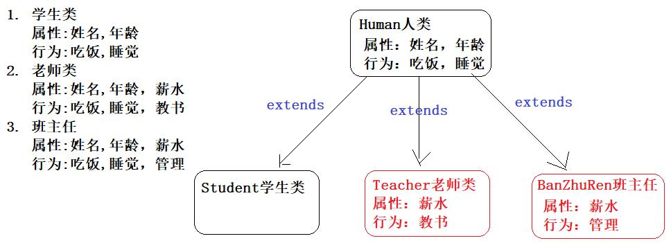

# JAVA高阶

> 接下来开始，当完成实操自己写完一个案例时，要和笔记中老师写的做对比

# 未实操

## 面向对象高阶

### static关键字

static是修饰符，是静态的意思。 static可以修饰成员变量或者成员方法。 被static修饰的成员是属于类的，是放在静态区中，没有static修饰的成员变量和方法则是属于对象的。

> 无static修饰的成员变量和成员方法是属于每个对象的，此成员变量叫实例变量，此成员方法也叫做实例方法，之前我们写的变量和方法就是实例成员变量和实例成员方法。实例变量和实例方法属于每个对象，必须创建类的对象才可以访问。   
>

#### static修饰成员变量

static修饰成员变量，说明这个成员变量是属于类的，这个成员变量称为类变量或者静态成员变量。 直接用类名访问即可。因为类只有一个，所以静态成员变量在内存区域中也只存在一份。所有的对象都可以共享这个变量。

static修饰成员变量用途：当某成员变量需要被所有对象共享使用，或者是某个数据需要被该类的所有对象所共享，那么就用static。

static修饰成员变量的特点：

- 被static修饰的成员方法，会被该类的所有对象所共享(共用)。

  > 如被static修饰的成员变量，每一个对象都会共享此成员变量。

- 多了一种调用方式，可以通过类名调用，也推荐使用此方式调用。

  > 如调用Student类的静态成员变量school：`Student.school`。

- static随着类的加载而加载，优先于对象存在。

  > 如即使没有此类的对象，你依然可以使用此类中被static修饰的成员变量。

静态成员变量的定义：`修饰符 static 数据类型 变量名 = 初始值;`    

```java
public class Student {
    public static String schoolName = "传智播客"； // 属于类，只有一份。
    // .....
}
```

静态成员变量的访问：`格式：类名.静态变量`

```java
public static void  main(String[] args){
    System.out.println(Student.schoolName); // 传智播客
    Student.schoolName = "黑马程序员";
    System.out.println(Student.schoolName); // 黑马程序员
}
```

##### 内存图解

程序运行步骤：

1. 方法区加载StaticTest1类字节码文件，main自动入栈。语句一执行，使用User类因此方法区加载User类字节码文件。**因为static静态是随着类的加载而加载，因此当User类进入内存(方法区)中，static修饰的onLineNumber就会加载并存在**，它会被存放到堆内存的一处空间，此空间叫User类的静态区，而因为堆内存存放的数据都会给予默认值，因此int类型的onLineNumber变量就会赋予默认值0，因为此语句做了++操作，因此onLineNumber变量值为1。

2. 语句二创建User类对象u1，new开辟堆空间存放u1，因为onLineNumber已经存在于User类的静态区，自然不会在对象中。当然User对象为了能够找到onLineNumber，都会和User类的静态区建立关联，u1也一样，因此可以通过u1对象拿到onLineNumber的值，其他语句依次执行不再分析。

3. 后面onLineNumber++，u2对象的创建和前两步一样。

整个步骤主要注意两点：static静态是随着类的加载而加载，所有对象都共享一个静态区。


#### static修饰成员方法

static修饰成员方法，说明这个成员方法是属于类的，这个成员方法称为类方法或者静态方法。 直接用类名访问即可。因为类只有一个，所以静态方法在内存区域中也只存在一份。所有的对象都可以共享这个方法。

static修饰成员方法用途：当此方法经常要被外部类调用，或者成员方法所在类为工具类，那么就用static。

static修饰成员变量的特点：

- 多了一种调用方式，可以通过类名调用。

  > 如调用System类的静态成员方法println：`System.println("hello")`。

- static修饰的成员方法, 只能直接访问本类的静态成员变量或方法。 (static随着类的加载而加载，优先于对象存在)

  > 如在一个Student类中有静态成员变量和非静态成员变量，有静态成员方法和非静态成员方法。那么如果该类的静态成员方法想使用本类的成员，他只能使用本类的静态变量和静态方法，使用非静态成员将会报错。
  >
  > 此特点的原因是因为static随着类的加载而加载，在没有对象的情况下，非静态成员并没有出现，因此不允许使用，而静态成员已经存在所以可以相互访问。若想要访问非静态成员，可以在静态方法内创建对象在访问，或者为非静态成员加static。

- static 中不允许使用 this 关键字。 (static随着类的加载而加载，优先于对象存在)

  > this代表当前对象的引用，也就是对象new出来才会出现this，因此静态方法不能访问this。

静态成员方法的定义：`修饰符 static 数据类型 函数名() {函数体}`  

```java
public class Student{
    public static String schoolName = "传智播客"； // 属于类，只有一份。
    // .....
    public static void study(){
    	System.out.println("我们都在黑马程序员学习");   
    }
}
```

静态成员方法的访问：`类名.静态方法`

```java
public static void  main(String[] args){
    Student.study();
}
```

##### 工具类

当一个类中的所有方法都是为其他类服务的，并且无法进行封装数据，这种类就叫做工具类。

工具类的所有方法都使用了static进行修饰，这样做就多了一种调用方式，别的类就可以使用`类名.方法名()`的方式直接调用成员方法，而不再需要创建一个对象进行调用，简化了调用的方式。这也是工具类的构造方法被private私有的原因。

如System就是一个工具类，它无法创建对象，调用方法也是直接通过`System.方法名()`的形式调用。

##### 重新认识主方法

```java
public class Main {
    public static void main(String[] args) {
        System.out.println("Hello world!");
    }
}
```

- public： 被JVM(虚拟机)调用，访问权限需要足够大

- static： 被JVM调用，为了方便JVM不创建对象

  > 如果编写的方法和主方法平级，则需要进行static修饰，这是因为main方法是静态的，所以测试类中其他方法也需要是静态的，这样mian方法才能访问其他的静态方法。12	

- void： 被JVM调用，不需要给JVM返回值

- main： 一个通用的名称，虽然不是关键字，但是会被JVM特别识别

- String[] args：String[]指字符串数组数据类型，args是数组名可以随便改，也就是args是字符串数组。这个东西以前用于接收键盘录入数据的，现在被Scanner替代了所以没用了，只是作为传统被保留了下来。

### 继承 

假如多个类中存在相同属性和行为时，我们可以将这些内容抽取到单独一个类中，那么多个类无需再定义这些属性和行为，只要继承那一个类即可。

继承：让类与类之间产生关系（子父类关系），子类可以直接使用父类中非私有的成员。父类，也被称为基类、超类；子类，也被称为派生类。

继承格式如下：通过 `extends` 关键字，可以声明一个子类继承另外一个父类，`class 子类名 extends 父类名 { }`

```java
class 父类 {
	...
}

class 子类 extends 父类 {
	...
}
```

继承的好处：

1. 提高代码的复用性（减少代码冗余，相同代码重复利用）。继承实际上是将多个子类相同的属性和行为定义在父类中，子类特有的属性和行为由自己定义，这样就实现了相同属性和行为的重复利用，从而提高了代码复用。
2. 使类与类之间产生了关系。子类继承父类，就可以直接得到父类的成员变量和方法。

继承的用途：当类与类之间，存在相同（共性）的内容，并且产生了is a的关系（谁是谁），就可以考虑使用继承，来优化代码。

- 正确用法：如老师和学生都有姓名和年龄，存在共性内容，可以向上抽取一个人的类，学生是人的一种，老师是人的一种。
- 错误用法：程序员：id、姓名、年龄；商品：id、品牌、价格。父类：id、姓名、年龄、品牌、价格。这样是完全不合理的，也没有is a关系。

代码示例：请使用继承定义以下类:

1. 学生类：属性：姓名，年龄；行为：吃饭，睡觉

2. 老师类：属性：姓名，年龄，薪水；行为：吃饭，睡觉，教书

3. 班主任类：属性：姓名，年龄，薪水；行为：吃饭，睡觉，管理

分析：老师类，学生类，还有班主任类，实际上都是属于人类的，我们可以定义一个人类，把他们相同的属性和行为都定义在人类中，然后继承人类即可，子类特有的属性和行为就定义在子类中了。



案例代码实现：

1. 父类Human类

   ```java
    public class Human {
       // 合理隐藏
       private String name ;
       private int age ;
   	
       // 合理暴露
       public String getName() {
           return name;
       }
   
       public void setName(String name) {
           this.name = name;
       }
   
       public int getAge() {
           return age;
       }
   
       public void setAge(int age) {
           this.age = age;
       }
    }
   ```

2. 子类Teacher类

   ```java
   public class Teacher extends Human {
       // 工资
       private double salary ;
       
       // 特有方法
       public void teach(){
           System.out.println("老师在认真教技术！")；
       }
   
       public double getSalary() {
           return salary;
       }
   
       public void setSalary(double salary) {
           this.salary = salary;
       }
   }
   ```

3. 子类Student类

   ```java
   public class Student extends Human{
    
   }
   ```

4. 子类BanZhuren类

   ```java
   public class Teacher extends Human {
       // 工资
       private double salary ;
       
          // 特有方法
       public void admin(){
           System.out.println("班主任强调纪律问题！")；
       }
       
       public double getSalary() {
           return salary;
       }
   
       public void setSalary(double salary) {
           this.salary = salary;
       }
   }
   ```

5. 测试类

   ```java
     public class Test {
         public static void main(String[] args) {
             Teacher dlei = new Teacher();
             dlei.setName("播仔");
             dlei.setAge("31");
             dlei.setSalary(1000.99);
             System.out.println(dlei.getName());
             System.out.println(dlei.getAge());
             System.out.println(dlei.getSalary());
             dlei.teach();
             
             BanZhuRen linTao = new BanZhuRen();
             linTao.setName("灵涛");
             linTao.setAge("28");
             linTao.setSalary(1000.99);
             System.out.println(linTao.getName());
             System.out.println(linTao.getAge());
             System.out.println(linTao.getSalary());
             linTao.admin();
   
             Student xugan = new Student();
             xugan.setName("播仔");
             xugan.setAge("31");
             //xugan.setSalary(1000.99); // xugan没有薪水属性，报错！
             System.out.println(xugan.getName());
             System.out.println(xugan.getAge());
         }
     }
   ```

#### 继承中成员变量访问特点

##### 成员变量访问

父类中的成员变量是非私有的，子类中可以直接访问。若父类中的成员变量私有了，子类是不能直接访问的。通常编码时，我们遵循封装的原则，使用private修饰成员变量，因此访问父类的私有成员变量需要使用父类中提供公共的getXxx方法和setXxx方法。

> 注意：父类的私有成员子类访问不了是因为权限不足无法直接访问，而不是因为没有被继承。，可以通过getter/setter方法访问父类的private成员变量。

```java
class Fu {
	// Fu中的成员变量
	int num = 5;
}
class Zi extends Fu {
	// Zi中的成员变量
	int num2 = 6;
  
	// Zi中的成员方法
	public void show() {
		// 访问父类中的num
		System.out.println("Fu num="+num); // 继承而来，所以直接访问。
		// 访问子类中的num2
		System.out.println("Zi num2="+num2);
	}
}
class Demo04 {
	public static void main(String[] args) {
        // 创建子类对象
		Zi z = new Zi(); 
      	// 调用子类中的show方法
		z.show();  
	}
}

//演示结果：
//Fu num = 5
//Zi num2 = 6
```

##### 成员变量重名

如果子类和父类中出现重名的成员变量，这时的访问是有影响的。代码如下：

```java
class Fu1 {
	// Fu中的成员变量。
	int num = 5;
}
class Zi1 extends Fu1 {
	// Zi中的成员变量
	int num = 6;
  
	public void show() {
		// 访问父类中的num
		System.out.println("Fu num=" + num);
		// 访问子类中的num
		System.out.println("Zi num=" + num);
	}
}
class Demo04 {
	public static void main(String[] args) {
      	// 创建子类对象
		Zi1 z = new Zi1(); 
      	// 调用子类中的show方法
		z1.show(); 
	}
}
//演示结果：
//Fu num = 6
//Zi num = 6
```

子父类中出现了同名的成员变量时，子类会优先访问自己对象中的成员变量。如果此时想访问父类成员，可以使用super关键字。

###### super访问重名成员变量

子父类中出现了同名的成员变量时，在子类中需要访问父类中非私有成员变量时，需要使用 super 关键字，修饰父类成员变量，类似于之前学过的  this 。

需要注意的是：super代表的是父类对象的引用，this代表的是当前对象的引用。

使用格式：`super.父类成员变量名`

实例代码如下：

```java
class Fu {
	// Fu中的成员变量。
	int num = 5;
}

class Zi extends Fu {
	// Zi中的成员变量
	int num = 6;
  
	public void show() {
        int num = 1;
      
        // 访问方法中的num
        System.out.println("method num=" + num);
        // 访问子类中的num
        System.out.println("Zi num=" + this.num);
        // 访问父类中的num
        System.out.println("Fu num=" + super.num);
	}
}

class Demo04 {
	public static void main(String[] args) {
      	// 创建子类对象
		Zi1 z = new Zi1(); 
      	// 调用子类中的show方法
		z1.show(); 
	}
}

//演示结果：
//method num=1
//Zi num=6
//Fu num=5
```

#### 继承中成员方法访问特点

##### 成员方法重名

如果子类父类中出现了方法声明一模一样的方法（方法名，参数，返回值），则创建子类对象调用该方法的时候，子类对象会优先调用自己的方法。这虽然是就近原则的现象，但并不是就近原则，它其实是子类的方法，对父类的方法进行了重写操作，也就是方法重写。

> 如果子类对父类的方法进行重写，但还想调用未被重写的父类方法，可以使用super关键字。

代码如下：

```java
class Fu {
	public void show() {
		System.out.println("Fu show");
	}
}
class Zi extends Fu {
	//子类重写了父类的show方法
	public void show() {
		System.out.println("Zi show");
	}
}
public class ExtendsDemo05{
	public static void main(String[] args) {
		Zi z = new Zi();
     	// 子类中有show方法，只执行重写后的show方法
		z.show();  // Zi show
	}
}
```

#### java继承的特点

Java只支持单继承，不支持多继承，但支持多层继承。也就是说一个类只能继承一个直接父类，但不能继承多个父类，父类可以继承分类的父类。

比如：a继承b，b还可以继承c，a可以使用b继承c的变量和方法。

```java
package com.itheima.mextends;

public class ExtendsDemo4 {
    public static void main(String[] args) {
        C c = new C();
        c.methodC();
        c.methodB();
        c.methodA();
    }
}

class A {
    public void methodA() {
        System.out.println("A...");
    }
}

class B extends A {
    public void methodB() {
        System.out.println("B...");
    }
}

class C extends B {
    public void methodC() {
        System.out.println("C...");
    }
}
```

因此在以后如果要学习一个java的继承体系结构，要先去学习最顶层的类，因为最顶层类的方法所有底层类也都具备，因此要先学习共有的方法，再去学习不同子类有哪些特有的方法。

> java为什么不支持多继承的原因：担心有逻辑冲突，如果同时继承多个父类就会面临父类中可能出现继承方法或变量出现冲突的问题。而支持多层继承的原因是，中间层的可以对上层的方法进行重写，这样下层就不需要担心逻辑冲突。

#### 继承中构造方法访问特点

1. 构造方法的名字是与类名一致的，所以子类是无法继承父类构造方法的。子类需要自己手动编写构造方法。
2. 构造方法的作用是初始化对象成员变量数据的，所以在子类的初始化过程中，必须先执行父类的初始化动作，父类成员变量初始化后，才可以给子类使用。子类的所有构造方法中的第一行默认有一个隐含的`super()` ，表示先调用父类的无参构造方法。
3. 对于子类的构造函数，无参构造方法可以不写super()，使用默认隐含的super()。而有参构造方法，则需要自己写一个含父类所有参数的super()，用来调用父类的有参构造方法，剩下属于自己的成员再进行初始化。
4. 其实java当中所有的类，都直接或间接的继承到了Object类。一个没有明显继承的类中的一些默认的方法，都是来自Object类。

案例演示：

需求：

- 人类（Person）：成员变量：姓名，年龄
- 老师类：成员变量：姓名，年龄；成员方法：teach，姓名为张三，年龄为30岁的老师正在讲课
- 学生类：成员变量：姓名，年龄，成绩；成员方法：study，姓名为李四，年龄为20岁，成绩为190分的学生，正在学习

人类：

```java
package com.itheima.test;

public class Person {
    private String name;
    private int age;

    public Person() {
    }

    public Person(String name, int age) {
        this.name = name;
        this.age = age;
    }

    /**
     * 获取
     * @return name
     */
    public String getName() {
        return name;
    }

    /**
     * 设置
     * @param name
     */
    public void setName(String name) {
        this.name = name;
    }

    /**
     * 获取
     * @return age
     */
    public int getAge() {
        return age;
    }

    /**
     * 设置
     * @param age
     */
    public void setAge(int age) {
        this.age = age;
    }

}

```

老师类：

```java
package com.itheima.test;

public class Teacher extends Person {

    public Teacher() {
    }

    public Teacher(String name, int age) {
        super(name, age);
    }

    public void teach() {
        System.out.println("姓名为" + super.getName() + ", 年龄为" + super.getAge() + "岁的老师正在讲课");
    }

}
```

学生类：

```java
package com.itheima.test;

public class Student extends Person {

    private double score;

    public Student() {
    }
                    // "李四", 20, 100
    public Student(String name, int age, double score) {
        super(name, age);
        this.score = score;
    }

    public double getScore() {
        return score;
    }

    public void setScore(double score) {
        this.score = score;
    }

    public void study() {
        System.out.println("姓名为" + super.getName() + ", 年龄为" + super.getAge() + "岁, 成绩为" + score + "分的学生, 正在学习");
    }
}
```

测试类：

```java
package com.itheima.test;

public class Test1 {
    public static void main(String[] args) {
        Teacher t = new Teacher("张三", 30);
        t.teach();

        Student stu = new Student("李四", 20, 100);
        stu.study();
    }
}
```

##### 内存图解

对构造方法中实例代码的内存图解：

1. 主方法进栈，走第一句话，等号左边执行声明变量stu，等号右边执行new堆内存开辟空间。首先new出的空间是属于Student类的，因此Student类自己的私有变量和this是肯定存在的；而通过父类继承过来的变量则是在这个对象的super区域里存放，super区域用来存放父类的相关成员。

   > super区域也会存放父类的私有变量，父类的私有变量可以被继承，子类只是没有权限去直接访问

   然后执行子类构造方法初始化变量，子类构造方法入栈执行接收了三个变量，其中前两个变量是父类的成员变量。子类的构造方法第一条语句执行，调用父类的构造方法并传入参数，父类构造方法入栈接收参数初始化

   

2. 在父类构造方法中，执行成员变量赋值语句，因此堆内存中的name和age就会被赋值。然后父类构造方法执行完毕出栈，也意味着子类构造方法第一个语句执行完毕。

   然后执行子类构造方法的成员变量赋值语句，因此堆内存中的score就会被赋值，执行完毕子类构造方法出栈。

   

3. 堆内存全部初始化完毕，此时会将此堆内存对象的地址交给stu变量存放，接下来是一系列的get方法，通过stu中的地址找到堆内存中的对象，再找到对应的成员变量。

   

#### 其他相关知识点

##### 方法重写

方法重载(overload)：在同一个类中，方法名相同但参数列表（类型，个数，顺序）不同，且与返回值无关

方法重写(override) ：在子父类当中，出现了方法声明一模一样的方法（方法名，参数列表，返回值都相同），会出现覆盖效果，也称为重写或者复写。**声明不变，重新实现**。

方法重写用途：子类继承了父类的方法，但是子类觉得父类的这方法不足以满足自己的需求（需要修改或增强），子类需要重写一个与父类同名的方法，以便覆盖父类的该方法。

注意事项：

1. 方法重写是发生在子父类之间的关系。

2. 子类方法覆盖父类方法，必须要保证权限大于等于父类权限，但父类的私有方法无法被重写

   > 比如父类方法权限是public，而子类的方法权限是默认，那么这个子类方法就无法对父类方法进行方法重写。推荐权限是和父类的权限保持一致

3. 子类方法覆盖父类方法，返回值类型、函数名和参数列表都要一模一样。

例如：我们定义了一个动物类代码如下：

```java
public class Animal  {
    public void run(){
        System.out.println("动物跑的很快！");
    }
    public void cry(){
        System.out.println("动物都可以叫~~~");
    }
}
```

然后定义一个猫类，猫可能认为父类cry()方法不能满足自己的需求，代码如下：

```java
public class Cat extends Animal {
    public void cry(){
        System.out.println("我们一起学猫叫，喵喵喵！喵的非常好听！");
    }
}

public class Test {
	public static void main(String[] args) {
      	// 创建子类对象
      	Cat ddm = new Cat()；
        // 调用父类继承而来的方法
        ddm.run();
      	// 调用子类重写的方法
      	ddm.cry();
	}
}
```

> 如果子父类的两个函数函数名、参数列表、返回值不完全一样，那么就会从方法重写变成方法重载，子类中定义的函数会和继承过来的父类函数成重载关系。
>
> 想要快捷进行方法重写，可以对在idea中对子类的括号范围内，右键选择生成，然后选重写方法，点需要重写的方法确定即可。
>
> 如果想在父类的基础上进行重写，可以在子类的重写方法里添加`super.love`。

###### @Override重写注解

@Override：注解，用于方法重写的校验。被这个注解标记的方法，就说明这个方法必须是重写了父类的方法，否则编译阶段报错。

建议重写都加上这个注解，一方面可以提高代码的可读性，一方面可以防止重写出错

加上后的子类代码形式如下：

``` java
public class Cat extends Animal {
    // 声明不变，重新实现
    // 方法名称与父类全部一样，只是方法体中的功能重写写了！
    @Override
    public void cry(){
        System.out.println("我们一起学猫叫，喵喵喵！喵的非常好听！");
    }
}
```

##### protected权限修饰符

在Java中提供了四种访问权限，使用不同的访问权限修饰符修饰时，被修饰的内容会有不同的访问权限，我们之前已经学习过了public 和 private，接下来我们研究一下protected的作用。

不同权限的访问能力：public > protected > 默认 > private

|           | 同一类中 | 同一包中的类 | 不同包的子类 | 不同包中的无关类 |
| --------- | -------- | ------------ | ------------ | ---------------- |
| public    | √        | √            | √            | √                |
| protected | √        | √            | √            |                  |
| (default) | √        | √            |              |                  |
| private   | √        |              |              |                  |

- public：公有权限，可被所有类访问，实现跨类、跨包访问目的，这种权限限制最少

  > 用于创建对象和方法

- protected：受保护权限，允许被同一包中的类或不同包的子类访问

- 默认（default）：默认权限，也叫包权限，它允许被同一包中的类访问，不允许被其它包的类访问。

- private：私有权限，限制最严，所修饰的成员只能在同一类中访问，不允许被其它任何类(包括子类)访问。

  > 用于成员变量

protected：在日后的开发中几乎不用的修饰符，因为使用较麻烦，下面是使用实例：

在a包中创建一个Fu类

```java
package a;

public class Fu {
    protected void show() {
        System.out.println("protected...fu...show");
    }
}
```

在b包中创建一个Zi类，是Fu的不同包的子类

```java
package b;

import a.Fu;

public class Zi extends Fu {
    public void method() {
        super.show();
    }
}
```

在b包中创建一个Zi类，是Fu的不同包的无关类

```java
package b;

public class Test {
    public static void main(String[] args) {
        Zi z = new Zi();
        //报错，权限不足
        z.show;
        //可以调用
        z.method;
    }
}
```

可以发现调用`z.show`这个方法是报错的，因为这个show方法的实际来源是在Fu类中，且此方法是被protected修饰的，而目前的调用环境是在Test类中，Test和Fu的关系是不同包的无关类，因此权限不足以调用z.show方法。而show可以被不同包的子类访问，因此可以在子类创建一个method方法调用show方法，然后外部类在通过调用method方法来调用show方法，也就等于间接调用show方法。

##### this和super

this调用本类，super调用父类：

- this：代表本类对象的引用
- super：代表父类存储空间的标识，标志此空间存放了继承父类的成员变量。

| **关键字** | **访问成员变量**    | **访问成员方法**      | **访问构造方法**                 |
| ---------- | ------------------- | --------------------- | -------------------------------- |
| this       | this.本类成员变量;  | this.本类成员方法();  | this(); this(…);  本类构造方法   |
| super      | super.父类成员变量; | super.父类成员方法(); | super(); super(…);  父类构造方法 |

> 特别注意：this() 和super()都在争夺构造方法第一行的位置，所以二者不能共存。但不用担心无法同时实现两个关键字的功能，因为子类总会有地方访问到父类的构造方法。
>
> ```java
> public A(int a, int b, int c) {
>     //可以将super()写在此处
>     super();
>     this.a = a;
>     this.b = b;
>     this.c = c;
> }    
> 
> public A(int a, int b, int c, int d) {
>     //第一行super()，this()会报错。而如果换位置，那么super()又会报错，因为二者都需要在第一行。
>     //super();
>     this(a, b, c);
> 	this.d = d;
> }
> ```

###### 省略super的情况

super 调用父类成员的省略规则：被调用的继承的变量和方法，在子类中不存在，那么super.可以直接省略

```java
package com.itheima.this_super;

public class SuperTest {
    public static void main(String[] args) {
        Zi z = new Zi();
        z.method();
    }
}

class Fu {
    int num = 10;

    public void show(){
        System.out.println("Fu...show");
    }
}

class Zi extends Fu {
    
    public void method(){
        //System.out.println(super.num);
        //super.show();
        System.out.println(num);
        show();
    }

}
```

但其实，如果不省略super.而是将其换成this.，你会发现没有报错可以正常使用。这是因为子类是继承父类的，继承的成员是存在于子类的，而this调用本类的成员自然是允许的。

```java
package com.itheima.this_super;

public class SuperTest {
    public static void main(String[] args) {
        Zi z = new Zi();
        z.method();
    }
}

class Fu {
    int num = 10;

    public void show(){
        System.out.println("Fu...show");
    }
}

class Zi extends Fu {
    
    public void method(){
        //System.out.println(super.num);
        //super.show();
        //System.out.println(num);
        //show();
        System.out.println(this.num);
        this.show();
    }

}
```

而因为此处的method方法里没有和成员变量num重名的变量，而this调用本类成员方法和不加this调用没有什么区别，因此这里的this都可以省略，就又变回了 `System.out.println(num);  ` 和 `show();` 的形式。

所以从本质上说其实一开始省略的并不是super，而是this。因为子类继承父类，父类的成员都被子类继承了，因此就可以使用this对他们进行调用，又根据this调用规则，调用本类成员变量不涉及重名问题，this直接省略，而调用本类成员方法本身也不需要this。

但这一切的前提是：调用的变量和方法在子类中不存在，也就是没有重名问题。如果子类中的成员和继承的成员有重复，那么this.就会调用本类的成员，而super.则会调用继承的成员。

> 在不熟悉这套简化规则的情况下，可以先不省略super，以后熟悉了在进行省略。

###### this(...)和super(...)

- this()和this(…)：访问本类构造方法
- super()和super(…)：访问父类构造方法

super()和super(…)的使用场景在构造方法的继承中已经见过了，主要是介绍this()和this(…)的使用场景：

> 开闭原则：对功能扩展做开放，对修改代码做关闭。也就是原有代码尽量不要修改，如果有新功能则重新编写。

```java
package com.itheima.this_super;

import java.io.BufferedReader;

public class Test {
    /*
        开闭原则 : 对功能扩展做开放, 对修改代码做关闭
     */
    public static void main(String[] args) {
        A a1 = new A(1, 2, 3);
        A a2 = new A(4, 5, 6);

        A a3 = new A(1,2,3,4);


    }
}

/*
    项目Version1.0版本 : 有3个成员变量
    项目Version1.1版本 : 新增一个成员变量
 */
class A {
    int a;
    int b;
    int c;
    int d;

    public A() {
    }

    public A(int a, int b, int c) {
        super();
        this.a = a;
        this.b = b;
        this.c = c;
    }

    public A(int a, int b, int c, int d) {
        //this.a = a;
        //this.b = b;
        //this.c = c;
        //使用this()来优化代码，将前三个数据传给另一个构造方法，最后一个新增的数据我来处理。减少了代码冗余。
        this(a, b, c);
        this.d = d;
    }
}
```

#### 案例

需求：

- 员工类 Employee：成员变量：姓名，年龄，工资；成员方法：work方法
  - 私有成员变量
  - 提供空参，带参构造
  - 提供setXxx\getXxx方法
  - 编写work方法 - 员工工作

- 程序员类 Coder：成员变量：姓名，年龄，工资；成员方法：work方法（姓名为张三，年龄为23，工资为15000的程序员正在编写代码）
  - 继承Employee父类
  - 提供空参，带参构造
  - 重写work方法

- 项目经理类 Manager：成员变量：姓名，年龄，工资，奖金；成员方法：work方法（姓名为李四，年龄为24，工资为18000，奖金为5000的项目经理正在分配任务…）
  - 继承Employee父类
  - 编写子类特有的成员变量 – 奖金
  - 私有化, 提供setXxx\getXxx方法
  - 提供空参，带参构造
  - 重写work方法

代码：

员工类：

```java
package com.itheima.test;

public class Employee {
    private String name;
    private int age;
    private double salary;


    public Employee() {
    }

    public Employee(String name, int age, double salary) {
        this.name = name;
        this.age = age;
        this.salary = salary;
    }

    /**
     * 获取
     *
     * @return name
     */
    public String getName() {
        return name;
    }

    /**
     * 设置
     *
     * @param name
     */
    public void setName(String name) {
        this.name = name;
    }

    /**
     * 获取
     *
     * @return age
     */
    public int getAge() {
        return age;
    }

    /**
     * 设置
     *
     * @param age
     */
    public void setAge(int age) {
        this.age = age;
    }

    /**
     * 获取
     *
     * @return salary
     */
    public double getSalary() {
        return salary;
    }

    /**
     * 设置
     *
     * @param salary
     */
    public void setSalary(double salary) {
        this.salary = salary;
    }

    public void work() {
        System.out.println("员工工作...");
    }
}
```

程序员类：

```java
package com.itheima.test;

public class Coder extends Employee {

    public Coder() {
    }

    public Coder(String name, int age, double salary) {
        super(name, age, salary);
    }

    @Override
    public void work() {
        System.out.println("姓名为:" + getName()
                + ", 年龄为:" + getAge()
                + ", 工资为" + getSalary() + "的程序员正在编写代码");
    }
}

```

项目经理类：

```java
package com.itheima.test;

public class Manager extends Employee {

    private double bonus;

    public Manager() {
    }

    public Manager(String name, int age, double salary, double bonus) {
        super(name, age, salary);
        this.bonus = bonus;
    }

    public double getBonus() {
        return bonus;
    }

    public void setBonus(double bonus) {
        this.bonus = bonus;
    }

    @Override
    public void work() {
        System.out.println("姓名为:" + getName()
                + ", 年龄为:" + getAge()
                + ", 工资为:" + getSalary() + ", 奖金为:" + bonus + "的项目经理正在分配任务");
    }
}

```

测试类：

```java
package com.itheima.test;

public class Test2 {
    public static void main(String[] args) {
        Coder c = new Coder("张三", 23, 15000);
        c.work();

        Manager m = new Manager("李四", 24, 18000, 5000);
        m.work();
    }
}

```

# 未整理

### final关键字

final 关键字是最终的意思，可以修饰（方法，类，变量）

final修饰的特点：

- 修饰方法：表明该方法是最终方法，不能被重写
- 修饰类：表明该类是最终类，不能被继承
- 修饰变量：表明该变量是常量，不能再次被赋值

final 修饰变量的细节补充：

- 变量是基本类型：final 修饰指的是基本类型的数据值不能发生改变
- 变量是引用类型：final 修饰指的是引用类型的地址值不能发生改变，但是地址里面的内容是可以发生改变的
- 成员变量如果被 final 修饰，需要在构造方法结束之前完成赋值

### 包

**什么是包？**

- 包本质来说就是文件夹, 用来管理类文件的

- 建包的语法格式：package 公司域名倒写.技术名称。报名建议全部英文小写，且具备意义

  ```java
  package com.itheima.domain;
  public class Student {
      
  }
  ```

- 建包语句必须在第一行，一般IDEA工具会帮助创建

**导包** 

相同包下的类可以直接访问，不同包下的类必须导包，才可以使用！导包格式：`import 包名.类名;`

假如一个类中需要用到不同类，而这个两个类的名称是一样的，那么默认只能导入一个类，另一个类要带包名访问。

### 抽象类


#### 抽象方法和抽象类

抽象类是一种特殊的父类，内部可以编写抽象方法。

抽象方法：将共性的行为（方法）抽取到父类之后，发现该方法的实现逻辑，无法在父类中给出具体明确，该方法就可以定义为抽象方法。

抽象类：如果一个类中存在抽象方法，那么该类就必须声明为抽象类

抽象方法的定义格式：`public abstract 返回值类型 方法名(参数列表);`

抽象类的定义格式：`public abstract class 类名{}`

注意事项：

- 抽象类不能实例化
- 抽象类存在构造方法
- 抽象类中可以存在普通方法
- 抽象类的子类要么重写抽象类中的所有抽象方法，要么是抽象类

abstract 关键字的冲突：

- final：被 abstract 修饰的方法，强制要求子类重写，被 final 修饰的方法子类不能重写

- private：被 abstract 修饰的方法，强制要求子类重写，被 private 修饰的方法子类不能重写

- static：被 static 修饰的方法可以类名调用，类名调用抽象方法没有意义

### 接口

接口：体现的思想是对规则的声明，Java中的接口更多体现的是对行为的抽象。

- 接口用关键字interface来定义：`public interface 接口名 {}` 

- 接口不能实例化

- 接口和类之间是实现关系，通过implements关键字表示：`public class 类名 implements 接口名 {}`

- 接口的子类（实现类）：要么重写接口中的所有抽象方法，要么是抽象类

#### 接口中的成员特点

- 成员变量：只能是常量，默认修饰符：`public static final`
- 构造方法：没有

- 成员方法：只能是抽象方法，默认修饰符：`public abstract`

关于接口中的方法，JDK8 和 JDK9 中有一些新特性

#### 类和接口之间的各种关系

- 类和类的关系：继承关系，只能单继承，但是可以多层继承

- 类和接口的关系：实现关系，可以单实现，也可以多实现，还可以在继承一个类的同时实现多个接口

- 接口和接口的关系：继承关系，可以单继承，也可以多继承

#### 抽象类和接口的对比

- 成员变量：
  - 抽象类 : 可以定义变量, 也可以定义常量
  - 接口 : 只能定义常量 
- 成员方法：
  - 抽象类 : 可以是定义具体方法, 也可以定义抽象方法
  - 接口 : 只能定义抽象方法
- 构造方法：
  - 抽象类 : 有
  - 接口 : 没有

#### 抽象类的应用场景

- 项目经理类 :
  - 成员变量 : 姓名, 年龄, 工资, 奖金
  - 成员方法 : 工作 (项目管理, 人员管理)
- 程序员类 : 
  - 成员变量 : 姓名, 年龄, 工资
  - 成员方法 : 工作 (写代码, 改Bug)
- 人事类 :
  - 成员变量 : 姓名, 年龄, 工资
  - 成员方法 : 工作 (人才招聘)
- 员工类 :
  - 成员变量 : 姓名, 年龄, 工资
  - 成员方法 : 工作方法 (Work) ??? 抽象方法

#### 接口的应用场景

接口可以为程序制定规则, 代码更加规范

#### 抽象类和接口的对比

- 抽象类 : 对事物做抽象 (描述事物)
- 接口 : 对行为抽象 (制定规则)

### 多态

同一个行为具有多个不同表现形式或形态的能力

多态前提：

- 有继承 / 实现关系
- 有方法重写
- 有父类引用指向子类对象

多态的成员访问特点：

- 成员变量：编译看左边（父类），执行看左边（父类）
- 成员方法：编译看左边（父类），执行看右边（子类）

#### 多态的好处和弊端

多态的好处 ：提高了程序的扩展性

多态的弊端：不能使用子类的特有成员

对象多态 : 将方法的形参定义为父类类型, 这个方法可以接收该父类的任意子类对象 

行为多态 : 同一个行为, 具有多个不同表现形式或形态的能力

#### 多态中的转型

- 向上转型：从子到父（父类引用指向子类对象）
- 向下转型：从父到子（将父类引用所指向的对象, 转交给子类类型）

##### 多态中的转型问题

如果被转的引用类型变量，对应的实际类型和目标类型不是同一种类型，那么在转换的时候就会出现ClassCastException 

关键字 instanceof

使用格式：对象名 instanceof 类型，判断一个对象是否是一个类的实例。

通俗的理解：判断关键字左边的对象，是否是右边的类型，返回boolean类型结果

#### 案例

模拟支付接口：

某网站需要开发一个支付功能，需要支持多种支付方式

(支付平台支付、银行卡网银支付、信用卡快捷支付)，如下所示：

# 未整理(复习)

#### JOptionPane

当使用 `JOptionPane` 类创建对话框时，你可以根据需要选择不同的方法。以下是一些常用方法的详细介绍：

**showMessageDialog 方法：**

1. `showMessageDialog(Component parentComponent, Object message)`:
   - 显示包含一条消息的对话框，只有一个 "确定" 按钮。
   - `parentComponent` 是指定的父组件，通常是 `null`。
   - `message` 是要显示的消息，可以是字符串、图标等。

2. `showMessageDialog(Component parentComponent, Object message, String title, int messageType)`:
   - 显示包含指定消息、标题和消息类型的对话框。
   - `title` 是对话框的标题。
   - `messageType` 是消息类型，例如 `JOptionPane.INFORMATION_MESSAGE` 表示信息消息。

**showConfirmDialog 方法：**

1. `showConfirmDialog(Component parentComponent, Object message)`:
   - 显示包含确认或取消按钮的对话框。
   - 返回用户的选择，`JOptionPane.YES_OPTION` 或 `JOptionPane.NO_OPTION`。

2. `showConfirmDialog(Component parentComponent, Object message, String title, int optionType)`:
   - 显示包含指定确认选项的对话框。
   - `optionType` 可以是 `YES_NO_OPTION`、`YES_NO_CANCEL_OPTION` 等。

3. `showConfirmDialog(Component parentComponent, Object message, String title, int optionType, int messageType)`:
   - 显示包含指定确认选项和消息类型的对话框。
   - `messageType` 是消息类型，例如 `JOptionPane.WARNING_MESSAGE` 表示警告消息。

**showInputDialog 方法：**

1. `showInputDialog(Component parentComponent, Object message)`:
   - 显示带有一个文本字段的对话框，用户可以输入文本。
   - 返回用户输入的字符串。

2. `showInputDialog(Component parentComponent, Object message, Object initialSelectionValue)`:
   - 显示带有文本字段的对话框，并指定初始文本。
   - `initialSelectionValue` 是文本字段的初始值。

3. `showInputDialog(Component parentComponent, Object message, String title, int messageType)`:
   - 显示带有文本字段的对话框，并指定标题和消息类型。

**showOptionDialog 方法：（没前三个重要）**

1. `showOptionDialog(Component parentComponent, Object message, String title, int optionType, int messageType, Icon icon, Object[] options, Object initialValue)`:
   - 显示带有自定义选项的对话框，可以指定标题、消息类型、图标和按钮选项。
   - `options` 是按钮选项的数组。
   - `initialValue` 是默认选中的选项。

这些方法的具体用法取决于你的需求，可以根据需要选择合适的方法，并通过方法的参数来自定义对话框的外观和行为。

#### foreach遍历数组

```java
//语法：
for (数组类型 元素:数组) {
	System.out.println(元素);
}
//实例：
for (int number : numbers) {
	System.out.println(number);
}
//等同如下
for (int i = 0; i < numbers.length; i++) {
      System.out.println(numbers[i]);
}
```

#### toString方法

`toString()` 是 Java 中的一个方法，它属于 `Object` 类，是所有类的基类。因此，所有的 Java 类都继承了 `Object` 类，包括 `toString()` 方法。然而，很多时候，我们希望 `toString()` 方法返回对象更有意义的信息，以便于调试和阅读代码。因此，可以在自定义类中覆写 `toString()` 方法，提供更有用的字符串表示形式。例如：

```java
public class MyClass {
    private int value;

    public MyClass(int value) {
        this.value = value;
    }

    @Override
    public String toString() {
        return "MyClass[value=" + value + "]";
    }

    public static void main(String[] args) {
        MyClass obj = new MyClass(42);
        System.out.println(obj.toString()); // 覆写后的 toString() 输出
    }
}
```

在这个例子中，`toString()` 方法被覆写，返回了一个包含类的信息的字符串。

##### 隐式调用toString

在Java中，当你直接将一个对象传递给 `System.out.println()` 方法时，它实际上会自动调用对象的 `toString()` 方法。因此，下面两行代码实际上是等效的：

```java
System.out.println(student.toString());
System.out.println(student);
```

这是因为 `System.out.println()` 方法在处理对象时会隐式调用对象的 `toString()` 方法，以便获得可打印的字符串表示形式。所以，你可以选择直接调用 `toString()` 方法或者简化为直接使用 `System.out.println(object)`。两者的效果是相同的。

#### 匿名对象

匿名对象是在创建对象的同时直接使用该对象而不给它起名字的一种对象创建方式。这样的对象通常用于一次性的场景，不需要在其他地方再次引用。在 Java 中，你可以通过直接使用 `new` 关键字创建匿名对象。

```java
public class AnonymousObjectExample {
    public static void main(String[] args) {
        // 创建匿名对象
        new MyClass().displayMessage();

        // 创建匿名对象，并直接调用方法
        new MyClass().showNumber(42);

        // 创建匿名对象，赋值给变量，然后调用方法
        MyClass anonymousObj = new MyClass();
        anonymousObj.showNumber(100);
    }
}

class MyClass {
    public void displayMessage() {
        System.out.println("Hello from MyClass!");
    }

    public void showNumber(int number) {
        System.out.println("Number is: " + number);
    }
}
```

在上述例子中，`new MyClass().displayMessage();` 创建了一个匿名对象，并直接调用了 `displayMessage()` 方法。这样的语法适用于那些只需要使用一次的对象，避免了显式地为对象取一个变量名。

需要注意的是，匿名对象的生命周期仅限于当前语句块或表达式，一旦执行完毕，它就会被垃圾回收。因此，如果你需要在后续代码中使用对象，最好还是给对象一个具体的引用。

#### 对象数组

顾名思义，数组的元素均为对象。

操作关键点：需要创建数组，对数组元素(对象)进行实例化。

```java
//格式：类名[] 数组名 = new 类名[长度];
//例如：
    
Student[] array = new Student[5];
	array[0]=new Student("张三","2140706101");
	array[1]=new Student("李四","2140706102");
	array[2]=new Student("赵五","2140706103");
	array[3]=new Student("钱六","2140707101");
	array[4]=new Student("孙七","2140707102");
                             
//也可创建对象数组同时实例化每个元素对象。
Student[] array = {
	new Student("张三","2140706101"),
	new Student("李四","2140706102"),
	new Student("赵五","2140706103"),
	new Student("钱六","2140707101"),
	new Student("孙七","2140707102")
};

```

#### StringTokenizer类和Math类

见ppt4-17，一个取词一个计算，应该不怎么考。

#### 包装类

Java提供了两个类型系统，基本类型与引用类型，使用基本类型在于效率，然而很多情况，会创建对象使用，因为对象可以做更多的功能，如果想要我们的基本类型像对象一样操作，就可以使用基本类型对应的包装类，如下：

| 基本类型 | 对应的包装类（位于java.lang包中） |
| -------- | --------------------------------- |
| byte     | Byte                              |
| short    | Short                             |
| int      | **Integer**                       |
| long     | Long                              |
| float    | Float                             |
| double   | Double                            |
| char     | **Character**                     |
| boolean  | Boolean                           |

方法：

①将包装类对象转换成基本数据类型：intValue()、floatValue()、doubleValue()、longValue等

②包装类对象与字符串的互换：toString()、 valueOf(String s)

③基本类型数据与字符串的相互转换：static  String toString(基本类型数据) 、parseXxxx(String s)

案例：

```java
Double dobj= new Double(12.34); 或 Double dobj=12.34;//装箱
double d=Double.doubleValue(dobj); 或 double d=dobj; //拆箱

String str=dobj.tostring(); 
Double dobj=new Double("12.34");  或 Double dobj=Double.valueOf("12.34");

//基本类型变量和字符串之间的转换：
//基本类型变量->字符串：通过""+值、封装类.toString()或 String.valueOf()三种方式转换
String str= ""+12.34;  或 String str= String.valueOf(12.34); 或 String str=Double.toString(12.34);
//字符串->基本类型变量：通过封装类的构造方法或封装类.parseXxx()两种方式
double d=Double.parseDouble("12.34"); 

```

##### 装箱与拆箱

基本类型与对应的包装类对象之间，来回转换的过程称为”装箱“与”拆箱“：

- **装箱**：从基本类型转换为对应的包装类对象。
- **拆箱**：从包装类对象转换为对应的基本类型。

用Integer与 int为例：（看懂代码即可）

基本数值---->包装对象

```java
Integer i = new Integer(4);//使用构造函数函数
Integer iii = Integer.valueOf(4);//使用包装类中的valueOf方法
```

包装对象---->基本数值

```java
int num = i.intValue();
```

##### 自动装箱与自动拆箱

由于我们经常要做基本类型与包装类之间的转换，从Java 5（JDK 1.5）开始，基本类型与包装类的装箱、拆箱动作可以自动完成。例如：

```java
Integer i = 4;//自动装箱。相当于Integer i = Integer.valueOf(4);
i = i + 5;//等号右边：将i对象转成基本数值(自动拆箱) i.intValue() + 5;
//加法运算完成后，再次装箱，把基本数值转成对象。
```

#### 日期日历类

##### Date类

点看以下两个构造函数

- `public Date()`：从运行程序的此时此刻到时间原点经历的毫秒值,转换成Date对象，分配Date对象并初始化此对象，以表示分配它的时间（精确到毫秒）。
- `public Date(long date)`：将指定参数的毫秒值date,转换成Date对象，分配Date对象并初始化此对象，以表示自从标准基准时间（称为“历元（epoch）”，即1970年1月1日00:00:00 GMT）以来的指定毫秒数。

简单来说：使用无参构造，可以自动设置当前系统时间的毫秒时刻；指定long类型的构造参数，可以自定义毫秒时刻。例如：

```java
import java.util.Date;

public class Demo01Date {
    public static void main(String[] args) {
        // 创建日期对象，把当前的时间
        System.out.println(new Date()); // Tue Jan 16 14:37:35 CST 2020
        // 创建日期对象，把当前的毫秒值转成日期对象
        System.out.println(new Date(0L)); // Thu Jan 01 08:00:00 CST 1970
    }
}
```

> tips:在使用println方法时，会自动调用Date类中的toString方法。Date类对Object类中的toString方法进行了覆盖重写，所以结果为指定格式的字符串。

常用的方法有：

- `public long getTime()` 把日期对象转换成对应的时间毫秒值。
- `public void setTime(long time)` 把方法参数给定的毫秒值设置给日期对象

```java
public class DateDemo02 {
    public static void main(String[] args) {
        //创建日期对象
        Date d = new Date();
        
        //public long getTime():获取的是日期对象从1970年1月1日 00:00:00到现在的毫秒值
        //System.out.println(d.getTime());
        //System.out.println(d.getTime() * 1.0 / 1000 / 60 / 60 / 24 / 365 + "年");

        //public void setTime(long time):设置时间，给的是毫秒值
        //long time = 1000*60*60;
        long time = System.currentTimeMillis();
        d.setTime(time);

        System.out.println(d);
    }
}
```

##### GregorianCalendar类

java.util.Calendar类表示一个“日历类”，可以进行日期运算。它是一个抽象类，不能创建对象，我们可以使用它的子类：java.util.GregorianCalendar类。

有两种方式可以获取GregorianCalendar对象：

- 直接创建GregorianCalendar对象；
- 通过Calendar的静态方法getInstance()方法获取GregorianCalendar对象【本次课使用】

常用方法:

| 方法名                                | 说明                                                         |
| ------------------------------------- | ------------------------------------------------------------ |
| public static Calendar getInstance()  | 获取一个它的子类GregorianCalendar对象。                      |
| public int get(int field)             | 获取某个字段的值。field参数表示获取哪个字段的值，<br />可以使用Calender中定义的常量来表示：<br />Calendar.YEAR : 年<br />Calendar.MONTH ：月<br />Calendar.DAY_OF_MONTH：月中的日期<br />Calendar.HOUR：小时<br />Calendar.MINUTE：分钟<br />Calendar.SECOND：秒<br />Calendar.DAY_OF_WEEK：星期 |
| public void set(int field,int value)  | 设置某个字段的值                                             |
| public void add(int field,int amount) | 为某个字段增加/减少指定的值                                  |

**get方法示例**

```java
public class Demo {
    public static void main(String[] args) {
        //1.获取一个GregorianCalendar对象
        Calendar instance = Calendar.getInstance();//获取子类对象

        //2.打印子类对象
        System.out.println(instance);

        //3.获取属性
        int year = instance.get(Calendar.YEAR);
        int month = instance.get(Calendar.MONTH) + 1;//Calendar的月份值是0-11
        int day = instance.get(Calendar.DAY_OF_MONTH);

        int hour = instance.get(Calendar.HOUR);
        int minute = instance.get(Calendar.MINUTE);
        int second = instance.get(Calendar.SECOND);

        int week = instance.get(Calendar.DAY_OF_WEEK);//返回值范围：1--7，分别表示："星期日","星期一","星期二",...,"星期六"

        System.out.println(year + "年" + month + "月" + day + "日" + 
                           	hour + ":" + minute + ":" + second);
        System.out.println(getWeek(week));

    }

    //查表法，查询星期几
    public static String getWeek(int w) {//w = 1 --- 7
        //做一个表(数组)
        String[] weekArray = {"星期日", "星期一", "星期二", "星期三", "星期四", "星期五", "星期六"};
        //            索引      [0]      [1]       [2]      [3]       [4]      [5]      [6]
        //查表
        return weekArray[w - 1];
    }
}

```

**set方法示例：**

```java
public class Demo {
    public static void main(String[] args) {
        //设置属性——set(int field,int value):
		Calendar c1 = Calendar.getInstance();//获取当前日期

		//计算班长出生那天是星期几(假如班长出生日期为：1998年3月18日)
		c1.set(Calendar.YEAR, 1998);
		c1.set(Calendar.MONTH, 3 - 1);//转换为Calendar内部的月份值
		c1.set(Calendar.DAY_OF_MONTH, 18);

		int w = c1.get(Calendar.DAY_OF_WEEK);
		System.out.println("班长出生那天是：" + getWeek(w));

        
    }
    //查表法，查询星期几
    public static String getWeek(int w) {//w = 1 --- 7
        //做一个表(数组)
        String[] weekArray = {"星期日", "星期一", "星期二", "星期三", "星期四", "星期五", "星期六"};
        //            索引      [0]      [1]       [2]      [3]       [4]      [5]      [6]
        //查表
        return weekArray[w - 1];
    }
}
```

**add方法示例：**

```java
public class Demo {
    public static void main(String[] args) {
        //计算200天以后是哪年哪月哪日，星期几？
		Calendar c2 = Calendar.getInstance();//获取当前日期
        c2.add(Calendar.DAY_OF_MONTH, 200);//日期加200

        int y = c2.get(Calendar.YEAR);
        int m = c2.get(Calendar.MONTH) + 1;//转换为实际的月份
        int d = c2.get(Calendar.DAY_OF_MONTH);

        int wk = c2.get(Calendar.DAY_OF_WEEK);
        System.out.println("200天后是：" + y + "年" + m + "月" + d + "日" + getWeek(wk));

    }
    //查表法，查询星期几
    public static String getWeek(int w) {//w = 1 --- 7
        //做一个表(数组)
        String[] weekArray = {"星期日", "星期一", "星期二", "星期三", "星期四", "星期五", "星期六"};
        //            索引      [0]      [1]       [2]      [3]       [4]      [5]      [6]
        //查表
        return weekArray[w - 1];
    }
}
```

##### SimpleDateFormat类

位于java.text包中,格式化输出日期，我们通过这个类可以帮我们完成日期和文本之间的转换,也就是可以在Date对象与String对象之间进行来回转换。

常用的格式规则为：

| 标识字母（区分大小写） | 含义 |
| ---------------------- | ---- |
| y                      | 年   |
| M                      | 月   |
| d                      | 日   |
| H                      | 时   |
| m                      | 分   |
| s                      | 秒   |

构造方法：

由于DateFormat为抽象类，不能直接使用，所以需要常用的子类`java.text.SimpleDateFormat`。这个类需要一个模式（格式）来指定格式化或解析的标准。构造方法为：

- `public SimpleDateFormat(String pattern)`：用给定的模式和默认语言环境的日期格式符号构造SimpleDateFormat。参数pattern是一个字符串，代表日期时间的自定义格式。

常用方法：

- `public String format(Date date)`：将Date对象格式化为字符串。

- `public Date parse(String source)`：将字符串解析为Date对象。

```java
package com.itheima.a01jdk7datedemo;

import java.text.ParseException;
import java.text.SimpleDateFormat;
import java.util.Date;

public class A03_SimpleDateFormatDemo1 {
    public static void main(String[] args) throws ParseException {
        /*
            public simpleDateFormat() 默认格式
            public simpleDateFormat(String pattern) 指定格式
            public final string format(Date date) 格式化(日期对象 ->字符串)
            public Date parse(string source) 解析(字符串 ->日期对象)
        */

        //1.定义一个字符串表示时间
        String str = "2023-11-11 11:11:11";
        //2.利用空参构造创建simpleDateFormat对象
        // 细节:
        //创建对象的格式要跟字符串的格式完全一致
        SimpleDateFormat sdf = new SimpleDateFormat("yyyy-MM-dd HH:mm:ss");
        Date date = sdf.parse(str);
        //3.打印结果
        System.out.println(date.getTime());//1699672271000


    }

    private static void method1() {
        //1.利用空参构造创建simpleDateFormat对象，默认格式
        SimpleDateFormat sdf1 = new SimpleDateFormat();
        Date d1 = new Date(0L);
        String str1 = sdf1.format(d1);
        System.out.println(str1);//1970/1/1 上午8:00

        //2.利用带参构造创建simpleDateFormat对象，指定格式
        SimpleDateFormat sdf2 = new SimpleDateFormat("yyyy年MM月dd日HH:mm:ss");
        String str2 = sdf2.format(d1);
        System.out.println(str2);//1970年01月01日 08:00:00

        //课堂练习:yyyy年MM月dd日 时:分:秒 星期
    }
}

```

#### Object类

位于java.lang包中，是所有Java 类的直接或者间接父类，该类所具备的方法，其他所有类都继承了。

三个重要方法：

- equals()：比较两个对象是否指向同一块内存区域，相当于==运算符。true表示相同，false表示不相同。(注意：String类已将该方法改写，比较字符串内容是否相同)；
- hashCode()：返回对象的hashcode(整数)，如果两个对象占用同一块内存空间，则hashcode值一定相等；
- toString()：返回返回该对象的字符串表示形式(可以看做是对象的内存地址值)，当对象与String型数据的连接时，自动调用其toString()方法。

#### 多态

多态是继封装、继承之后，面向对象的第三大特性。多态是出现在继承或者实现关系中的。

**多态的前提**：有继承关系，子类对象是可以赋值给父类类型的变量。例如Animal是一个动物类型，而Cat是一个猫类型。Cat继承了Animal，Cat对象也是Animal类型，自然可以赋值给父类类型的变量。

如果没有多态，在下图中register方法只能传递学生对象，其他的Teacher和administrator对象是无法传递给register方法方法的，在这种情况下，只能定义三个不同的register方法分别接收学生，老师和管理员。


有了多态之后，方法的形参就可以定义为共同的父类Person。


**要注意的是：**

* 当一个方法的形参是一个类，我们可以传递这个类所有的子类对象。
* 当一个方法的形参是一个接口，我们可以传递这个接口所有的实现类对象（后面会学）。
* 而且多态还可以根据传递的不同对象来调用不同类中的方法。

**多态的定义和前提**

**多态**： 是指同一行为，具有多个不同表现形式。

从上面案例可以看出，Cat和Dog都是动物，都是吃这一行为，但是出现的效果（表现形式）是不一样的。

 前提【重点】：

1. 有继承或者实现关系

2. 方法的重写【意义体现：不重写，无意义】

3. 父类引用指向子类对象【格式体现】

   > 父类类型：指子类对象继承的父类类型，或者实现的父接口类型。

多态体现的格式：

```java
父类类型 变量名 = new 子类/实现类构造器;
变量名.方法名();
```

**多态的运行特点**

调用成员变量时：编译看左边，运行看左边

调用成员方法时：编译看左边，运行看右边

代码示例：

```java
Fu f = new Zi()；
//编译看左边的父类中有没有name这个属性，没有就报错
//在实际运行的时候，把父类name属性的值打印出来
System.out.println(f.name);
//编译看左边的父类中有没有show这个方法，没有就报错
//在实际运行的时候，运行的是子类中的show方法
f.show();
```

**多态的弊端**

我们已经知道多态编译阶段是看左边父类类型的，如果子类有些独有的功能，此时**多态的写法就无法访问子类独有功能了**。

```java 
class Animal{
    public  void eat()｛
        System.out.println("动物吃东西！")
    ｝
}
class Cat extends Animal {  
    public void eat() {  
        System.out.println("吃鱼");  
    }  
   
    public void catchMouse() {  
        System.out.println("抓老鼠");  
    }  
}  

class Dog extends Animal {  
    public void eat() {  
        System.out.println("吃骨头");  
    }  
}

class Test{
    public static void main(String[] args){
        Animal a = new Cat();
        a.eat();
        a.catchMouse();//编译报错，编译看左边，Animal没有这个方法
    }
}
```

##### 对象(引用类型)的类型转换

为什么要转型：多态的写法就无法访问子类独有功能了。

当使用多态方式调用方法时，首先检查父类中是否有该方法，如果没有，则编译错误。也就是说，**不能调用**子类拥有，而父类没有的方法。编译都错误，更别说运行了。这也是多态给我们带来的一点"小麻烦"。所以，想要调用子类特有的方法，必须做向下转型。

多态的转型分为向上转型（自动转换）与向下转型（强制转换）两种。

**向上转型（自动转换）**

向上转型：多态本身是子类类型向父类类型向上转换（自动转换）的过程，这个过程是默认的。当父类引用指向一个子类对象时，便是向上转型。

使用格式：

```java
父类类型  变量名 = new 子类类型();
如：Animal a = new Cat();
```

原因是：父类类型相对与子类来说是大范围的类型，Animal是动物类，是父类类型。Cat是猫类，是子类类型。Animal类型的范围当然很大，包含一切动物。所以子类范围小可以直接自动转型给父类类型的变量。

**向下转型（强制转换）**

向下转型：父类类型向子类类型向下转换的过程，这个过程是强制的。一个已经向上转型的子类对象，将父类引用转为子类引用，可以使用强制类型转换的格式，便是向下转型。

使用格式：

```java
子类类型 变量名 = (子类类型) 父类变量名;
如:Aniaml a = new Cat();
   Cat c =(Cat) a;  
```

转型演示，代码如下：

定义类：

```java
abstract class Animal {  
    abstract void eat();  
}  

class Cat extends Animal {  
    public void eat() {  
        System.out.println("吃鱼");
    }  
    public void catchMouse() {  
        System.out.println("抓老鼠");
    }  
}  

class Dog extends Animal {  
    public void eat() {  
        System.out.println("吃骨头");  
    }  
    public void watchHouse() {  
        System.out.println("看家");  
    }  
}
```

定义测试类：

```java
public class Test {
    public static void main(String[] args) {
        // 向上转型  
        Animal a = new Cat();  
        a.eat(); 				// 调用的是 Cat 的 eat

        // 向下转型  
        Cat c = (Cat)a;       
        c.catchMouse(); 		// 调用的是 Cat 的 catchMouse
    }  
}
```

###### instanceof关键字

转型的过程中，一不小心就会遇到这样的问题，请看如下代码：

```java
public class Test {
    public static void main(String[] args) {
        // 向上转型  
        Animal a = new Cat();  
        a.eat();               // 调用的是 Cat 的 eat

        // 向下转型  
        Dog d = (Dog)a;       
        d.watchHouse();        // 调用的是 Dog 的 watchHouse 【运行报错】
    }  
}
```

这段代码可以通过编译，但是运行时，却报出了 `ClassCastException` ，类型转换异常！这是因为，明明创建了Cat类型对象，运行时，当然不能转换成Dog对象的。

为了避免ClassCastException的发生，Java提供了 `instanceof` 关键字，给引用变量做类型的校验，格式如下：

```java
变量名 instanceof 数据类型 
如果变量属于该数据类型或者其子类类型，返回true。
如果变量不属于该数据类型或者其子类类型，返回false。
```

所以，转换前，我们最好先做一个判断，代码如下：

```java
public class Test {
    public static void main(String[] args) {
        // 向上转型  
        Animal a = new Cat();  
        a.eat();               // 调用的是 Cat 的 eat

        // 向下转型  
        if (a instanceof Cat){
            Cat c = (Cat)a;       
            c.catchMouse();        // 调用的是 Cat 的 catchMouse
        } else if (a instanceof Dog){
            Dog d = (Dog)a;       
            d.watchHouse();       // 调用的是 Dog 的 watchHouse
        }
    }  
}
```

#### 类与类的关系

(1)继承关系：在一个已有类的基础上，添加特有功能，产生新类；继承也称为泛化。

(2)实现关系：一个类实现接口中声明的方法，其中接口对方法进行声明，而类完成方法的定义，即实现具体功能。

(3)依赖关系：是最常见的一种类间关系，如果在一个类的方法中操作另外一个类的对象，则称其依赖于被操作类

如：方法的参数是某种对象类型，或者方法中有某种对象类型的局部变量，或者方法中调用了另一个类的静态方法，这些都是依赖关系。   

(4)关联关系：比依赖关系更紧密，通常体现为一个类中使用另一个类的对象作为该类的成员变量

(5)聚合关系

(6)组合关系

#### 内部类

什么是内部类：将一个类A定义在另一个类B里面，里面的那个类A就称为**内部类**，B则称为**外部类**。可以把内部类理解成寄生，外部类理解成宿主。

什么时候使用内部类：一个事物内部还有一个独立的事物，内部的事物脱离外部的事物无法独立使用

1. 人里面有一颗心脏。
2. 汽车内部有一个发动机。
3. 为了实现更好的封装性。

内部类的分类：按定义的位置来分

1. **成员内部内**，类定义在了成员位置 (类中方法外称为成员位置，无static修饰的内部类)
2. **静态内部类**，类定义在了成员位置 (类中方法外称为成员位置，有static修饰的内部类)
3. **局部内部类**，类定义在方法内
4. **匿名内部类**，没有名字的内部类，可以在方法中，也可以在类中方法外。

##### 内部类与外部类关系

内部类与外部类的关系：

- 成员内部类的创建需要依赖于外部类对象(成员方法必须通过对象调用)，在没有外部类实例之前无法创建成员内部类对象；
- 内部类与外部类相对独立，不是is a 的关系(发动机-汽车)；
- 私有属性的互相访问，内部类可以直接访问外部类，而外部类访问内部类需要内部类的对象来访问；
- 创建内部类的语法：

  - 在外部类内部创建内部类对象，如：Inner inner = new Inner();
  - 在外部类外部创建内部类对象，如：Outter.Inner inner = new Outter().new Inner();
- 在内部类内部使用隐藏的外部类属性，前面加 Outter.this进行修饰。

##### 成员内部类

成员内部类特点：

- 无static修饰的内部类，属于外部类对象的。
- 宿主：外部类对象。

内部类的使用格式：

```java
 外部类.内部类。 // 访问内部类的类型都是用 外部类.内部类
```

获取成员内部类对象的两种方式：

1. 外部直接创建成员内部类的对象

   ```java
   外部类.内部类 变量 = new 外部类（）.new 内部类（）;
   ```

   案例演示：

   ```java
   public class Test {
       public static void main(String[] args) {
           //  宿主：外部类对象。
          // Outer out = new Outer();
           // 创建内部类对象。
           Outer.Inner oi = new Outer().new Inner();
           oi.method();
       }
   }
   
   class Outer {
       // 成员内部类，属于外部类对象的。
       // 拓展：成员内部类不能定义静态成员。
       public class Inner{
           // 这里面的东西与类是完全一样的。
           public void method(){
               System.out.println("内部类中的方法被调用了");
           }
       }
   }
   ```

2. 在外部类中定义一个方法提供内部类的对象

   案例演示：

   ```java
   public class Outer {
       String name;
       private class Inner{
           static int a = 10;
       }
       public Inner getInstance(){
           return new Inner();
       }
   }
   
   public class Test {
       public static void main(String[] args) {
           Outer o = new Outer();
           System.out.println(o.getInstance());
   
   
       }
   }
   ```

##### 匿名内部类(接口前置)

等接口整晚在搞这个

说明：

匿名内部类适合只需要使用一次的类，当创建一个匿名类时会创建该类的一个实例；

匿名内部类不能有构造方法；

一个匿名内部类一定跟在new的后面，创建其实现的接口或父类的对象。‘

#### 单例模式

单例模式的实现方法 ： 

- 构造方法私有； 
- 用一个私有的静态变量引用实例； 
- 提供一个公有的静态方法获取实例。

```java
public class Singleton {
    // 1. 构造方法私有，防止外部通过构造方法直接实例化对象
    private Singleton() {}

    // 2. 用一个私有的静态变量引用实例，但不直接初始化
    private static Singleton instance;

    // 3. 提供一个公有的静态方法获取实例
    public static Singleton getInstance() {
        // 如果实例尚未创建，则创建一个新的实例
        if (instance == null) {
            instance = new Singleton();
        }
        // 返回实例
        return instance;
    }

    // 其他成员方法...
}

```

上述代码中，`Singleton` 类的构造方法是私有的，通过将构造方法声明为私有的，确保外部无法通过 `new Singleton()`直接实例化对象。通过提供一个私有的静态变量 `instance` 来保存实例，而在 `getInstance()` 方法中通过判断 `instance` 是否为 `null` 来控制实例的创建。这种方式确保了只有在需要时才创建实例，达到了懒加载的效果。

这种做法是单例模式的一种基本实现方式，通过提供一个公有的静态方法 `getInstance()`，该方法负责创建或返回类的唯一实例。在这个方法内部，通过检查 `instance` 是否为 `null` 来决定是否需要创建新的实例。这就保证了在整个应用程序中只有一个实例存在。

#### 抽象类

父类中的方法，被它的子类们重写，子类各自的实现都不尽相同。那么父类的方法声明和方法主体，只有声明还有意义，而方法主体则没有存在的意义了(因为子类对象会调用自己重写的方法)。换句话说，父类可能知道子类应该有哪个功能，但是功能具体怎么实现父类是不清楚的（由子类自己决定），父类只需要提供一个没有方法体的定义即可，具体实现交给子类自己去实现。**我们把没有方法体的方法称为抽象方法。Java语法规定，包含抽象方法的类就是抽象类**。

- 抽象方法：没有方法体的方法。（注意不是传统的方法创建不写方法体，那叫方法体为空）
- 抽象类：包含抽象方法的类。

abstract是抽象的意思，用于修饰方法方法和类，修饰的方法是抽象方法，修饰的类是抽象类。

##### 抽象方法

使用`abstract`关键字修饰方法，该方法就成了抽象方法，抽象方法只包含一个方法名，而没有方法体。

定义格式：`修饰符 abstract 返回值类型 方法名 (参数列表)；`，比如：`public abstract void run()；`

##### 抽象类

如果一个类包含抽象方法，那么该类必须是抽象类。

注意：抽象类不一定有抽象方法，但是有抽象方法的类必须定义成抽象类。

定义格式：

```java
abstract class 类名字 { 
  
}
```

代码举例：

```java
public abstract class Animal {
    public abstract void run()；
}
```

##### 抽象类的使用

要求：继承抽象类的子类**必须重写父类所有的抽象方法**。否则，该子类也必须声明为抽象类。

代码举例：

```java
// 父类,抽象类
abstract class Employee {
	private String id;
	private String name;
	private double salary;
	
	public Employee() {
	}
	
	public Employee(String id, String name, double salary) {
		this.id = id;
		this.name = name;
		this.salary = salary;
	}
	
	// 抽象方法
	// 抽象方法必须要放在抽象类中
	abstract public void work();
}

// 定义一个子类继承抽象类
class Manager extends Employee {
	public Manager() {
	}
	public Manager(String id, String name, double salary) {
		super(id, name, salary);
	}
	// 2.重写父类的抽象方法
	@Override
	public void work() {
		System.out.println("管理其他人");
	}
}

// 定义一个子类继承抽象类
class Cook extends Employee {
	public Cook() {
	}
	public Cook(String id, String name, double salary) {
		super(id, name, salary);
	}
	@Override
	public void work() {
		System.out.println("厨师炒菜多加点盐...");
	}
}

// 测试类
public class Demo10 {
	public static void main(String[] args) {
		// 创建抽象类,抽象类不能创建对象
		// 假设抽象类让我们创建对象,里面的抽象方法没有方法体,无法执行.所以不让我们创建对象
//		Employee e = new Employee();
//		e.work();
		
		// 3.创建子类
		Manager m = new Manager();
		m.work();
		
		Cook c = new Cook("ap002", "库克", 1);
		c.work();
	}
}
```

此时的方法重写，是子类对父类抽象方法的完成实现，我们将这种方法重写的操作，也叫做**实现方法**。

##### 抽象类的特征

抽象类的特征总结起来可以说是 **有得有失**

- 有得：抽象类得到了拥有抽象方法的能力。

- 有失：抽象类失去了创建对象的能力。

其他成员（构造方法，实例方法，静态方法等）抽象类都是具备的。

##### 抽象类的细节

关于抽象类的使用，以下为语法上要注意的细节，虽然条目较多，但若理解了抽象的本质，无需死记硬背，只要当idea报错之后，知道如何修改即可。

1. 抽象类**不能创建对象**，如果创建，编译无法通过而报错。只能创建其非抽象子类的对象。

   > 理解：假设创建了抽象类的对象，调用抽象的方法，而抽象方法没有具体的方法体，没有意义。

2. 抽象类中，可以有构造方法，是供子类创建对象时，初始化父类成员使用的。

   > 理解：子类的构造方法中，有默认的super()，需要访问父类构造方法。

3. 抽象类中，不一定包含抽象方法，但是有抽象方法的类必定是抽象类。

   > 理解：未包含抽象方法的抽象类，目的就是不想让调用者创建该类对象，通常用于某些特殊的类结构设计。

4. 抽象类的子类，必须重写抽象父类中**所有的**抽象方法，否则子类也必须定义成抽象类，编译无法通过而报错。 

   > 理解：假设不重写所有抽象方法，则类中可能包含抽象方法。那么创建对象后，调用抽象的方法，没有意义。

5. 抽象类存在的意义是为了被子类继承。

   > 理解：抽象类中已经实现的是模板中确定的成员，抽象类不确定如何实现的定义成抽象方法，交给具体的子类去实现。

6. 抽象方法不能被private或static修饰。

   > 1. **Private修饰符：**
   >    - 如果抽象方法被声明为 `private`，那么它将无法被子类访问和实现。`private` 方法只能在声明它的类中访问，无法被其他类继承并实现。因为抽象方法的目的是由子类提供具体的实现，将其声明为 `private` 违背了这个目的。
   > 2. **Static修饰符：**
   >    - 抽象方法需要被子类实现，而 `static` 方法是类级别的，而不是实例级别的。在 Java 中，抽象方法需要被实例化的子类提供具体的实现，而不是通过类名直接调用。`static` 方法是通过类名调用的，而不是通过实例。因此，将抽象方法声明为 `static` 会导致无法在子类中提供具体的实现，违背了抽象方法的设计目的.(父类的static不会被继承，只是可以通过子类调用)

##### 抽象类存在的意义

抽象类存在的意义是为了被子类继承，否则抽象类将毫无意义。抽象类可以强制让子类，一定要按照规定的格式进行重写。

##### 抽象类的引用

虽然不能实例化抽象类，但可以创建它的引用。Java支持多态性，允许通过基类引用来引用派生类的对象。

```java
abstract class Shape {
    abstract void draw();
}

class Circle extends Shape {
    @Override
    void draw() {
        System.out.println("Drawing a Circle");
    }
}

class Rectangle extends Shape {
    @Override
    void draw() {
        System.out.println("Drawing a Rectangle");
    }
}

public class Main {
    public static void main(String[] args) {
        Shape circle = new Circle();      // 使用抽象类的引用引用 Circle 类的对象
        Shape rectangle = new Rectangle(); // 使用抽象类的引用引用 Rectangle 类的对象

        circle.draw();      // 调用的是 Circle 类的 draw 方法
        rectangle.draw();   // 调用的是 Rectangle 类的 draw 方法
    }
}

```

在这个例子中，`Shape` 是一个抽象类，它有一个抽象方法 `draw`。然后有两个具体的子类 `Circle` 和 `Rectangle`，它们分别实现了 `draw` 方法。在 `Main` 类的 `main` 方法中，我们使用了抽象类 `Shape` 的引用来引用 `Circle` 和 `Rectangle` 类的对象。通过这种方式，我们可以在运行时根据具体的对象类型调用相应的方法，实现了多态性。

#### 接口

我们已经学完了抽象类，抽象类中可以用抽象方法，也可以有普通方法，构造方法，成员变量等。那么什么是接口呢？接口是更加彻底的抽象，JDK7之前，包括JDK7，接口中全部是抽象方法。接口同样是不能创建对象的。

##### 定义格式

```java
//接口的定义格式：
interface 接口名称{
    // 抽象方法
}

// 接口的声明：interface
// 接口名称：首字母大写，满足“驼峰模式”
```

接口成分的特点：在JDK7，包括JDK7之前，接口中的**只有**包含：抽象方法和常量

- 抽象方法：

  注意：接口中的抽象方法默认会自动加上public abstract修饰程序员无需自己手写！！

  按照规范：以后接口中的抽象方法建议不要写上public abstract。因为没有必要啊，默认会加上。

- 常量：

  在接口中定义的成员变量默认会加上： public static final修饰。也就是说在接口中定义的成员变量实际上是一个常量。这里是使用public static final修饰后，变量值就不可被修改，并且是静态化的变量可以直接用接口名访问，所以也叫常量。常量必须要给初始值。常量命名规范建议字母全部大写，多个单词用下划线连接。

代码演示：

```java
public interface InterF {
    // 抽象方法！
    //    public abstract void run();
    void run();

    //    public abstract String getName();
    String getName();

    //    public abstract int add(int a , int b);
    int add(int a , int b);


    // 它的最终写法是：
    // public static final int AGE = 12 ;
    int AGE  = 12; //常量
    String SCHOOL_NAME = "黑马程序员";

}
```

##### 基本的实现

类与接口的关系为实现关系，即**类实现接口**，该类可以称为接口的实现类，也可以称为接口的子类。实现的动作类似继承，格式相仿，只是关键字不同，实现使用 ` implements`关键字。

类实现接口的意义：接口体现的是一种规范，接口对实现类是一种强制性的约束，要么全部完成接口申明的功能，要么自己也定义成抽象类。这正是一种强制性的规范。

###### 实现接口的格式

```java
/**接口的实现：
    在Java中接口是被实现的，实现接口的类称为实现类。
    实现类的格式:*/
class 类名 implements 接口1,接口2,接口3...{
}
```

从上面格式可以看出，接口是可以被多实现的。大家可以想一想为什么呢？

类实现接口的要求：

1. 必须重写实现的全部接口中所有抽象方法。
2. 如果一个类实现了接口，但是没有重写完全部接口的全部抽象方法，这个类也必须定义成抽象类。

###### 类与接口基本实现案例

假如我们定义一个运动员的**接口**（规范），代码如下：

```java
/**
   接口：接口体现的是规范。
 * */
public interface SportMan {
    void run(); // 抽象方法，跑步。
    void law(); // 抽象方法，遵守法律。
    String compittion(String project);  // 抽象方法，比赛。
}
```

接下来定义一个乒乓球运动员类，实现接口，实现接口的**实现类**代码如下：

```java
package com.itheima._03接口的实现;
/**
 * 接口的实现：
 *    在Java中接口是被实现的，实现接口的类称为实现类。
 *    实现类的格式:
 *      class 类名 implements 接口1,接口2,接口3...{
 *
 *
 *      }
 * */
public class PingPongMan  implements SportMan {
    @Override
    public void run() {
        System.out.println("乒乓球运动员稍微跑一下！！");
    }

    @Override
    public void law() {
        System.out.println("乒乓球运动员守法！");
    }

    @Override
    public String compittion(String project) {
        return "参加"+project+"得金牌！";
    }
}
```

测试代码：

```java
public class TestMain {
    public static void main(String[] args) {
        // 创建实现类对象。
        PingPongMan zjk = new PingPongMan();
        zjk.run();
        zjk.law();
        System.out.println(zjk.compittion("全球乒乓球比赛"));

    }
}
```

###### 类与接口的多实现案例

类与接口之间的关系是多实现的，一个类可以同时实现多个接口。

首先我们先定义两个接口，代码如下：

```java
/** 法律规范：接口*/
public interface Law {
    void rule();
}

/** 这一个运动员的规范：接口*/
public interface SportMan {
    void run();
}

```

然后定义一个实现类：

```java
/**
 * Java中接口是可以被多实现的：
 *    一个类可以实现多个接口: Law, SportMan
 *
 * */
public class JumpMan implements Law ,SportMan {
    @Override
    public void rule() {
        System.out.println("尊长守法");
    }

    @Override
    public void run() {
        System.out.println("训练跑步！");
    }
}
```

从上面可以看出类与接口之间是可以多实现的，我们可以理解成实现多个规范，这是合理的。

###### 接口与接口的多继承

Java中，接口与接口之间是可以多继承的：也就是一个接口可以同时继承多个接口。

一定要注意：

- **类与接口是实现关系**

- **接口与接口是继承关系**

接口继承接口就是把其他接口的抽象方法与本接口进行了合并。

案例演示：

```java 
public interface Abc {
    void go();
    void test();
}

/** 法律规范：接口*/
public interface Law {
    void rule();
    void test();
}

 *
 *  总结：
 *     接口与类之间是多实现的。
 *     接口与接口之间是多继承的。
 * */
public interface SportMan extends Law , Abc {
    void run();
}
```

##### 扩展：接口的细节

关于接口的使用，以下为语法上要注意的细节，虽然条目较多，但若理解了抽象的本质，无需死记硬背，只要当idea报错之后，知道如何修改即可。

1. 当两个接口中存在相同抽象方法的时候，该怎么办？

> 只要重写一次即可。此时重写的方法，既表示重写1接口的，也表示重写2接口的。

2. 实现类能不能继承A类的时候，同时实现其他接口呢？

> 继承的父类，就好比是亲爸爸一样；实现的接口，就好比是干爹一样
> 可以继承一个类的同时，再实现多个接口，只不过，要把接口里面所有的抽象方法，全部实现。

3. 实现类能不能继承一个抽象类的时候，同时实现其他接口呢？

> 实现类可以继承一个抽象类的同时，再实现其他多个接口，只不过要把里面所有的抽象方法全部重写。

4. 实现类Zi，实现了一个接口，还继承了一个Fu类。假设在接口中有一个方法，父类中也有一个相同的方法。子类如何操作呢？

> 处理办法一：如果父类中的方法体，能满足当前业务的需求，在子类中可以不用重写。
> 处理办法二：如果父类中的方法体，不能满足当前业务的需求，需要在子类中重写。

5. 如果一个接口中，有10个抽象方法，但是我在实现类中，只需要用其中一个，该怎么办?

> 可以在接口跟实现类中间，新建一个中间类（适配器类）
> 让这个适配器类去实现接口，对接口里面的所有的方法做空重写。
> 让子类继承这个适配器类，想要用到哪个方法，就重写哪个方法。
> 因为中间类没有什么实际的意义，所以一般会把中间类定义为抽象的，不让外界创建对象

##### 标记接口

标记接口是一种不包含任何方法声明的接口。它的目的不是为了强制实现某些方法，而是为了在运行时标记一个类，告诉编译器或其他工具特定的信息。

一个标记接口通常只是起到一个标记或标志的作用，用来表示被标记的类具有某种属性、行为或需要特殊处理。标记接口的常见示例包括 `Serializable` 接口和 `Cloneable` 接口。这两个接口都是空接口，没有定义任何方法，但它们通过标记类来告诉编译器和运行时环境一些信息。

```java
import java.io.Serializable;

// 标记接口，表示类可以被序列化
interface MySerializable extends Serializable {
}

// 实现了标记接口的类
class MyClass implements MySerializable {
    // 类的实现...
}

public class Main {
    public static void main(String[] args) {
        MyClass myObject = new MyClass();

        // 检查对象是否实现了 MySerializable 接口
        if (myObject instanceof MySerializable) {
            System.out.println("MyClass is serializable.");
        } else {
            System.out.println("MyClass is not serializable.");
        }
    }
}
```

在上述例子中，`MySerializable` 接口是一个标记接口，表示类可以被序列化。`MyClass` 类实现了这个接口，因此可以在运行时检查对象是否实现了 `MySerializable` 接口。

##### 面向接口编程

接口体现的是一种规范和实现分离的设计哲学，利用接口能够降低程序各模块之间的耦合，从而提高系统的可扩展性、可维护性。

面向接口编程的一个典型例子是使用简单工厂模式。在这种设计模式中，我们通过定义接口和工厂类，将对象的创建与客户端代码分离开来，从而实现了对系统的可扩展性、可维护性的提高。

场景：一个工厂Factory能够生产一种产品ProductA，有一天客户要求生产ProductB，如果之前Factory直接使用ProductA进行生产，则系统需要怎样修改呢？

```java
// 定义产品接口
interface Product {
    void produce();
}

// 具体产品A实现了产品接口
class ProductA implements Product {
    @Override
    public void produce() {
        System.out.println("生产ProductA");
    }
}

// 具体产品B实现了产品接口
class ProductB implements Product {
    @Override
    public void produce() {
        System.out.println("生产ProductB");
    }
}

// 工厂类负责创建产品
class Factory {
    // 根据传入的参数生产不同的产品
    public static Product createProduct(String type) {
        if ("A".equals(type)) {
            return new ProductA();
        } else if ("B".equals(type)) {
            return new ProductB();
        } else {
            throw new IllegalArgumentException("Unsupported product type");
        }
    }
}

// 客户端代码
public class Main {
    public static void main(String[] args) {
        // 客户端通过工厂创建产品
        Product productA = Factory.createProduct("A");
        productA.produce();

        Product productB = Factory.createProduct("B");
        productB.produce();
    }
}

```

#### 异常处理

**异常是什么：** 异常是指在程序执行过程中可能发生的、影响程序正常执行流程的不寻常事件。这些事件可能是错误，也可能是程序员希望捕获和处理的特定情况。异常提供了一种机制来处理这些情况，以确保程序在面临问题时可以以一种有序和可控的方式进行响应。

在 Java 中，异常是通过类的实例来表示的。Java 提供了一个异常类层次结构，其中 `Throwable` 是所有异常的根类，它分为两种主要类型：`Error` 和 `Exception`。`Error` 表示系统级错误，通常由虚拟机报告，而 `Exception` 是程序可以捕获和处理的异常。

异常(exception)的概念 概念：异常是程序执行过程中遇到特殊条件时发生的不正常事件。 异常事件将会中断程序的正常执行过程； Java 具有可确保在程序内处理异常的功能，增加健壮性。

Java的一个重要观点：一切皆对象。对异常的处理也不例外，定义了异常类，并通过异常类的实例来表示异常事件；

**异常的处理：** Java 提供了一种结构化的异常处理机制，使用 `try`、`catch` 和 `finally` 关键字。具体步骤如下：

- `try`：包含可能抛出异常的代码块。
- `catch`：捕获并处理异常的代码块。一个 `try` 块可以有多个 `catch` 块，用于处理不同类型的异常。
- `finally`：无论是否发生异常，都会执行的代码块。通常用于释放资源等清理操作。

**异常的例子：**

- ArithmeticException：除数为0时的算术异常 
- FileNotFoundException：找不到文件的异常 
- ArrayIndexOutOfBoundsException：数组元素下标越界 
- NumberFormatException：数据格式不正确异常 
- ClassNotFoundException：找不到相应类的异常

##### 编程时两类不同的异常

异常处理是一种在程序执行期间检测和处理运行时错误的机制。在Java中，异常分为两种类型：已检查异常（checked exceptions）和未检查异常（unchecked exceptions）。

**已检查异常（Checked Exceptions）：**已检查异常是在编译时由编译器检查的异常，是指编译器要求必须处置的异常。它们通常是程序在运行时可能会遇到的外部问题，例如文件不存在或网络连接中断。在方法中抛出已检查异常时，要求调用方要么捕获这些异常，要么在方法签名中使用 `throws` 关键字声明。

```java
import java.io.File;
import java.io.FileReader;
import java.io.FileNotFoundException;

public class CheckedExceptionExample {
    public static void main(String[] args) {
        try {
            // 试图读取一个不存在的文件
            FileReader fileReader = new FileReader(new File("nonexistent.txt"));
        } catch (FileNotFoundException e) {
            System.out.println("File not found: " + e.getMessage());
        }
    }
}

```

**未检查异常（Unchecked Exceptions）：**未检查异常是在运行时抛出的异常，通常是由程序的bug引起的，是指编译器不要求强制处置的异常。如空指针异常（NullPointerException）或数组越界异常（ArrayIndexOutOfBoundsException）。这类异常是`RuntimeException`及其子类的实例。

```java
public class UncheckedExceptionExample {
    public static void main(String[] args) {
        // 试图除以零
        int result = 10 / 0;  // 这会抛出 ArithmeticException
    }
}

```

在异常处理中，关键字 `try` 用于包含可能会抛出异常的代码块，`catch` 用于捕获并处理特定类型的异常，`finally` 用于定义无论是否发生异常都必须执行的代码块。

```java
public class ExceptionHandlingExample {
    public static void main(String[] args) {
        try {
            // 有可能抛出异常的代码块
            int result = divide(10, 0);
            System.out.println("Result: " + result);
        } catch (ArithmeticException e) {
            // 捕获并处理特定类型的异常
            System.out.println("Error: " + e.getMessage());
        } finally {
            // 无论是否发生异常，都会执行的代码块
            System.out.println("Finally block");
        }
    }

    public static int divide(int a, int b) {
        // 除法，可能抛出 ArithmeticException
        return a / b;
    }
}

```

在这个例子中，`divide` 方法可能抛出 `ArithmeticException`。在 `main` 方法中，使用 `try` 块包含可能抛出异常的代码块，`catch` 块捕获并处理特定类型的异常，`finally` 块定义了无论是否发生异常都必须执行的代码块。

##### Exception类

在 Java 中，`Exception` 类是异常类的基类，它继承自 `Throwable` 类。`Exception` 是一个通用性的异常类，它是所有异常类的父类。在 Java 的异常类层次结构中，`Exception` 类下面有很多子类，每个子类代表一种特定类型的异常情况。

构造方法：

- public Exception( )

- public Exception(String s)

  > 说明：字符串s是对该异常的描述

常用方法：

- public String toString()：返回异常对象信息的描述
- public String getMessage()：返回异常对象信息的详细描述
- public void printStackTrace( )：用来跟踪异常事件发生时执行堆栈内容

`Exception` 类本身并没有添加新的方法，它主要用作其他异常类的父类。它的子类包括但不限于以下几种：

1. **RuntimeException：**
   - `RuntimeException` 是一种未检查异常，它的子类包括诸如 `ArithmeticException`、`NullPointerException`、`ArrayIndexOutOfBoundsException` 等。这些异常通常由程序的bug引起，而不是外部环境的问题。
2. **IOException：**
   - `IOException` 是一种已检查异常，它的子类包括 `FileNotFoundException`、`IOException` 等，用于处理输入输出的异常情况。
3. **SQLException：**
   - `SQLException` 是一种已检查异常，用于处理与数据库操作相关的异常情况。
4. **ClassNotFoundException：**
   - `ClassNotFoundException` 是一种已检查异常，用于处理在运行时找不到指定类的异常情况。
5. **InterruptedException：**
   - `InterruptedException` 是一种已检查异常，用于处理线程中断的异常情况。

##### Java的异常处理机制

有两种：

- 使用try…catch捕获异常：将可能产生异常的代码放在try语句中进行隔离，如果遇到异常，程序会停止执行try块的代码，跳到catch块中处理

  ```java
  格式：
   try{
  	.....  //可能产生异常的代码
  }catch( ExceptionName1 e1 ){
  	......//当产生ExceptionName1型异常时的处理语句
  }catch( ExceptionName2 e2 ){
  	...... //当产生ExceptionName2型异常时的处理语句
  }  [ finally{
  	......	 //无论是否抛出异常都会执行的语句，即使在catch块中有return语句，一般用来做收尾工作，如：关闭文件
  }  ]
  
  ```

  > ```java
  > //为什么以下结构是错误的，该如何修改？
  > try {
  > 	……
  > }	catch (Exception e) {
  > 	……
  > }  	catch (ArrayIndexOutOfBoundsException e) { 
  > 	……
  > }	catch (NumberFormatException e) { 
  > 	……
  > }
  > //在 Java 的异常处理中，catch 块的顺序是有意义的。由于 Exception 是所有异常类的父类，如果先捕获 Exception，那么后面的 catch 块将永远不会执行，因为所有的异常都会被第一个 catch 块捕获。正确的方式是将特定的异常类型放在前面，通用的异常类型放在后面。这样可以确保特定类型的异常在通用类型之前被捕获。
  > try {
  >     // ...
  > } catch (ArrayIndexOutOfBoundsException e) {
  >     // 处理数组下标越界异常
  >     // ...
  > } catch (NumberFormatException e) {
  >     // 处理数字格式异常
  >     // ...
  > } catch (Exception e) {
  >     // 处理其他异常
  >     // ...
  > }
  > ```

- 使用throws声明抛出异常：当前方法不知道如何处理所出现的异常，该异常应由上一级调用者进行处理，可在定义该方法时使用throws声明抛出异常

##### Java的异常处理机制优点

- 将异常处理代码和正常的业务代码分离，提高了程序的可读性 
- 将不同类型的异常进行分类
- 可以对程序产生的异常进行灵活处理

##### 高版本JDK中 try…catch语句新增功能

**自动关闭资源的 try 语句**

Java 7 引入了自动关闭资源的 `try-with-resources` 语句。这种语法用于自动关闭实现 `AutoCloseable` 接口或 `Closeable` 接口的资源，如文件、网络连接等。在 `try-with-resources` 语句中，资源声明必须实现 `AutoCloseable` 接口或 `Closeable` 接口，程序会在 `try` 代码块结束时自动关闭这些资源。

```java
// 在 Java 7 中引入的 try-with-resources 语句
try (BufferedReader reader = new BufferedReader(new FileReader("example.txt"))) {
    // 使用资源，无需手动关闭
    String line = reader.readLine();
    System.out.println(line);
} catch (IOException e) {
    // 处理异常
    e.printStackTrace();
}

```

**多异常捕获：**

在较新的 Java 版本中，可以在一个 `catch` 块中捕获多个异常类型。这样可以减少重复的代码，使异常处理更为简洁。多异常捕获的语法形式如下：

```java
try {
    // 可能抛出多种异常的代码
} catch (IOException | SQLException | SomeOtherException e) {
    // 处理多种异常,如果在 try 块中发生 IOException、SQLException 或 SomeOtherException 中的任何一种异常，都会被捕获并在相同的 catch 块中进行处理。
    e.printStackTrace();
}

```

##### 自定义异常

在 Java 中，你可以通过创建自定义异常类来满足特定的应用程序需求。自定义异常类通常是通过继承 `Exception` 类或其子类来实现的。以下是创建和使用自定义异常的基本步骤：

1. **创建自定义异常类：**
   自定义异常类通常继承自 `Exception` 类或其子类。你可以添加自己的构造方法、成员变量和其他方法来满足你的需求。例如：

   ```java
   public class CustomException extends Exception {
       // 可以添加自定义的成员变量
   
       // 构造方法
       public CustomException() {
           super();
       }
   
       public CustomException(String message) {
           super(message);
       }
   
       // 可以添加其他自定义方法
   }
   ```

2. **在代码中抛出自定义异常：**
   在你的代码中，当满足某些条件时，使用 `throw` 关键字抛出自定义异常的实例：

   ```java
   public class Example {
       public static void main(String[] args) {
           try {
               // 满足某些条件时抛出自定义异常
               throw new CustomException("This is a custom exception");
           } catch (CustomException e) {
               // 捕获并处理自定义异常
               System.out.println("Caught custom exception: " + e.getMessage());
           }
       }
   }
   ```

3. **在方法中声明可能抛出的自定义异常：**
   如果你的方法可能抛出自定义异常，需要在方法声明中使用 `throws` 关键字声明异常：

   ```java
   public class Example {
       // 方法声明可能抛出自定义异常
       public static void exampleMethod() throws CustomException {
           // 满足某些条件时抛出自定义异常
           throw new CustomException("This is a custom exception");
       }
   
       public static void main(String[] args) {
           try {
               // 调用可能抛出异常的方法
               exampleMethod();
           } catch (CustomException e) {
               // 捕获并处理自定义异常
               System.out.println("Caught custom exception: " + e.getMessage());
           }
       }
   }
   ```

通过自定义异常，你可以更好地组织和处理应用程序中的特定错误或异常情况。自定义异常还提供了一种在代码中明确表达错误条件的方式。

#### 注解

不是重点6-19

#### 反射

反射（Reflection）是 Java 编程语言的一个特性，它提供了在运行时检查和操作类、方法、字段等信息的能力。反射允许程序在运行时动态获取和使用类的信息，以及在运行时创建和操作对象。反射是一种强大而灵活的机制，但也需要谨慎使用，因为它可能会导致性能问题和编译时类型安全性的丧失。

主要功能: 

- 在运行时判断任意一个对象所属的类; 

  > 使用反射可以动态获取一个对象的类信息，包括类的名称、父类、实现的接口等。
  >
  > ```java
  > Object obj = new String("Hello, Reflection!");
  > Class<?> clazz = obj.getClass();
  > System.out.println("Class Name: " + clazz.getName());
  > ```

- 获取类的信息，如类的方法、构造方法、超类、成员变量、常量；

-  在运行时构造任意一个类的对象； 

- 在运行时调用任意一个对象的方法； 

- 生成动态代理。   

##### 反射类

cnm看不懂，让我死吧6-24

#### 泛型

泛型是 Java 编程语言中的一个重要特性，它允许在代码中使用参数化类型。通过使用泛型，你可以将原本确定不变的数据类型参数化，即将所操作的数据类型被指定为一个参数，从而提高应用程序的类型安全性、可维护性和可靠性。

限制：不能操作基本数据类型 

在JDK 5.0之前，为了实现参数类型的任意化，都是通过Object类型来处理。带来不足：需要进行强制类型转换，造成代码臃肿，从 5.0开始，Java增加对泛型的支持。 泛型经常使用在类、接口和方法的定义中，分别称为泛型类、泛型接口和泛型方法。

##### 创建与使用

泛型类是具有一个或多个类型参数的类。类型参数用于在类的声明中表示一种通用的数据类型。泛型类的创建和使用包括以下几个步骤：

创建格式:

```java
class Node <T> {
	private T data;
	public Node <T> next;
	//省略......
}
```

使用格式：

```java
类名<类型参数列表> 对象 = new 类名<类型参数列表>([构造方法参数列表]);
//从Java 7开始，实例化泛型类时只需给出一对尖括号“<>”即可：
类名<类型参数列表> 对象 = new 类名<> ([构造方法参数列表]);
```

案例：

```java
// 泛型类的声明，使用<T>表示一个类型参数
public class Box<T> {
    private T value;

    // 构造方法
    public Box(T value) {
        this.value = value;
    }

    // 获取值的方法
    public T getValue() {
        return value;
    }

    // 设置值的方法
    public void setValue(T value) {
        this.value = value;
    }
}

public class Main {
    public static void main(String[] args) {
        // 创建泛型类的实例，可以指定具体的类型参数
        Box<String> stringBox = new Box<>("Hello, Generics!");
        Box<Integer> intBox = new Box<>(42);

        // 获取值
        String stringValue = stringBox.getValue();
        Integer intValue = intBox.getValue();

        // 打印值
        System.out.println("String Box Value: " + stringValue);
        System.out.println("Integer Box Value: " + intValue);

        // 泛型类可以存储不同类型的数据
        Box<Double> doubleBox = new Box<>(3.14);
        Double doubleValue = doubleBox.getValue();
        System.out.println("Double Box Value: " + doubleValue);

        // 泛型类的类型参数可以是任何引用类型
        Box<Person> personBox = new Box<>(new Person("John"));
        Person personValue = personBox.getValue();
        System.out.println("Person Box Value: " + personValue.getName());
    }
}

// 用于演示的Person类
class Person {
    private String name;

    public Person(String name) {
        this.name = name;
    }

    public String getName() {
        return name;
    }
}
```

在上面的例子中，`Box` 类是一个泛型类，它可以存储任意类型的数据。在使用时，通过在尖括号中指定具体的类型参数（如 `Box<String>`、`Box<Integer>`）来创建泛型类的实例。在运行时，Java 编译器会进行类型检查，确保不会发生类型错误。

##### 通配符？和 有界类型

在 Java 中，通配符（Wildcard）是一种用于表示未知类型的符号。通配符允许你在泛型类型中使用一种更灵活的方式，尤其是在不确定类型参数的场景下。通配符有两种：`?` 和 `? extends T`（上界通配符）和 `? super T`（下界通配符）。

1. 问号 `?`：当使用一个泛型类时，应该为此泛型类传入一个实参，否则编译器会提出泛型警告。假设现在定义一个方法，该方法的参数是泛型，但类型参数是不确定的，若此时使用Object类型来解决，编译时则会出现错误。

   ```java
   public void processBox(Box<?> box) {
       // 在这里，box 中的值的具体类型是未知的
       // 可以读取，但不能写入（除了写入 null）
       Object value = box.getValue();
       // box.setValue(someValue); // 编译错误
   }
   ```

   使用 `?` 表示未知类型，这样的泛型对象可以接受任意类型的参数。在方法内部，你可以读取泛型对象的值，但无法写入非 null 的值。

2. 上界通配符 `? extends T`：

   ```java
   public void processBoxWithUpperBound(Box<? extends Number> box) {
       // 在这里，box 中的值的类型是 Number 或其子类
       Number value = box.getValue();
       // box.setValue(someValue); // 编译错误
   }
   ```

   使用 `? extends T` 表示泛型对象的类型是 T 或 T 的子类。在方法内部，你可以读取泛型对象的值，但无法写入非 null 的值。

3. 下界通配符 `? super T`：

   ```java
   public void processBoxWithLowerBound(Box<? super Integer> box) {
       // 在这里，box 中的值的类型是 Integer 或其超类
       // 你可以写入 Integer 类型的值或其子类的值
       box.setValue(42);
       // 读取时的类型是 Object
       Object value = box.getValue();
   }
   ```

   使用 `? super T` 表示泛型对象的类型是 T 或 T 的超类。在方法内部，你可以写入 T 类型或 T 的子类的值，但读取时的类型是 `Object`。

##### 泛型方法

```java
public class Utils {
    // 泛型方法
    public static <T> T getElement(T[] array, int index) {
        if (index >= 0 && index < array.length) {
            return array[index];
        } else {
            return null;
        }
    }
}

// 使用泛型方法
Integer[] intArray = {1, 2, 3, 4, 5};
Integer element = Utils.getElement(intArray, 2);

```

##### 泛型接口

```java
public interface Pair<K, V> {
    K getKey();
    V getValue();
}

// 实现泛型接口
public class OrderedPair<K, V> implements Pair<K, V> {
    private K key;
    private V value;

    // 构造方法和实现接口方法...
}

```

#### 集合

学你嘛。7-7

#### File类与文件目录操作

Java提供了文件和输入输出操作的类和接口，位于java.io包；

File类：以抽象方式表示文件和目录的类，如 d:\mydir\readme.txt ，可表示：File file1=new File("d:\\\mydir\\\readme.txt"); 

说明:File对象只是一个引用，指向的文件或目录可能存在，也可能不存在。

**构造方法(三种)：**

- File(String pathname)
- File(String parent, String child)
- File(File parent, String child) 

> 例如： 
>
> ```java
> File dir1=new File("d:\\mydir");
> File file2=new File("d:\\mydir", "readme.txt");  
> File file3=new File(dir1, "readme.txt"); 
> ```

**常用方法：**

1)获取文件/目录某一属性的值

- String getName()：获取名字
- String getParent()：获取父目录
- String getPath()：获得路径名
- String getAbsolutePath()：获取绝对路径

2)测试文件/目录是否具备某一属性

- boolean exists()：是否存在
- boolean isDirectory()：是否为目录
- boolean isFile()：是否为文件
- boolean canRead()：是否能读
- boolean canWrite()：是否能写  
- boolean canExecute()：是否可运行
- boolean isHidden()：是否隐含

3)设置文件/目录某一属性

- boolean setExecutable(boolean executable)：设置可运行性
- boolean setReadable(boolean readable)：设置可读性
- boolean setReadOnly()：设置为只读
- boolean setWritable(boolean writable)：设置可写性
- boolean setLastModified(long time)：设置最新修改时间

4)文件/目录操作(重点掌握)

- long length()：获取文件长度(单位：byte)
- long lastModified()：获取文件/目录最新修改时间
- String[ ] list()：以字符串数组方式，返回目录中的所有文件或目录
- String[ ] list(FileFilter filter)：以字符串数组方式返回指定类型的文件或目录
- File[ ] listFiles()：以File数组方式，返回目录中的所有文件或目录
- File[ ] listFiles(FileFilter filter)：以File数组方式，返回指定类型的文件或目录
- boolean createNewFile()：创建新文件是否成功(所建文件内容为空)
- boolean mkdir()：创建目录是否成功
- boolean mkdirs()：创建目录是否成功，与前一方法不同的是：创建多级目录时，若父目录不存在也会自动创建
- boolean renameTo(File dest)：文件/目录改名是否成功
- boolean delete()：文件/目录删除是否成功(只有空目录才能被删除)

##### 应用举例

见实验报告

#### 输入输出流

**什么是流(stream)**

是指一组有序的数据序列，它们从数据源不断流向目的地；

屏蔽了输入输出设备的操作细节。例如：“在磁盘中读写文件” 与“通过网络传送数据’，它们的操作步骤都大体相同：先创建、打开流，再进行读写操作，最后是关闭流。

“流”能够采用相同方式来编写程序，提高效率。

**输入输出流**

“流”的方向性

1)输入流(input stream)：数据从输入设备流向内存。例如，从文件、网络或其他设备读取数据。

2)输出流(output stream)：数据从内存流向输出设备。例如，写入文件、发送数据到网络或其他设备。

需要牢记的是：站在内存(即程序)的角度来判定

**对输入流和输出流的操作要求：**

1)输入流：只能进行读取操作，主要掌握read()方法及变形，不能向其写入数据

2)输出流：进行的是写入操作，重点关注write()方法及变形，不能从中读取数据

##### Java中的流及其分类

根据数据处理基本单位的不同，又可分为字节流和字符流： 

1)字节流：是以字节(byte，8位)为基本单位，将数据看作是由一个个字节构成的序列，可处理任何类型的数据(包括二进制数据和文本信息)。

2)字符流：是以字符(Unicode编码，16位，2字节)为基本单位，将数据看作是由一个个字符组成的序列，适用于字符、文本类型数据的操作。这是JDK 1.1后新增内容。在使用字符流进行操作时，存在着Unicode编码和本地字符集码的转换问题。

输入输出流与字节流/字符流结合在一起，可形成4种流：

1)字节输入流、字节输出流：基类分别为InputStream、OutputStream，如图所示：

- `InputStream` 用于从输入流中读取字节数据。
- `OutputStream` 用于向输出流中写入字节数据。

这两个类都是抽象类，声明了字节数据读取或写入的一些方法。字节流的输入输出操作由它们的子类具体实现，子类命名格式为：XxxxInputStream和XxxxOutputStream  。

2)字符输入流、字符输出流：基类分别为Reader、Wirter，如下所示：

- `Reader` 用于从输入流中读取字符数据。
- `Writer` 用于向输出流中写入字符数据。

它们也是抽象类，声明了字符数据读取或写入一些方法。字符流的输入输出操作也由这两个类的子类来实现，子类命名格式为：XxxxReader和XxxxWriter。

##### 输入输出流操作基本步骤

1. 引入java.io包中的类；
2. 打开输入流或输出流；
3. 从输入流中读取数据或向输出流写入数据；
4. 关闭流。

#### 字节流

**字节流的基类**

InputStream、OutputStream分别是字节输入流、字节输出流的基类，均为抽象类，不能实例化对象。

InputStream类的基本方法：

- read()：从输入流中读取数据，有3种格式： 

  ①int read()：读取一个字节。返回值是所读取的字节内容，转化为0~255范围的整数

  > 在Java中，`read()` 方法返回的是 `int` 类型，即四个字节。`int` 类型虽然占用四个字节，但在 `read()` 方法中，实际只有低八位（一个字节）用来存放读取到的字节数据。这是为了方便标识文件末尾，因为文件末尾的标识是 `-1`，而不是有效的字节值。
  >
  > 每次读取后，文件读取指针会移动到下一部分数据的位置，直到文件末尾。

  ②int read(byte b[])：读取多个字节，并将这些字节存放到数组中，返回值是实际读取的字节个数 

  ③int read(byte b[], int off, int len)：一次读取len个字节的数据，并写入数组b中，数据从下标为off的数组元素位置开始存放。返回值也是实际读取的字节个数

  对于这三个方法，如果读指针到达输入流尾部，意味着再无数据可读，将返回-1 。

- void close()：关闭输入流，并释放与该输入流有关的系统资源


OutputStream类的基本方法：

- write()：向输出流写入数据。有3种格式：

​	①void write(int b)：将整数写入到输出流中。写入的内容是整数的低8位数据，其余24位被忽略，该方法无返回值；

​	②void write(byte[] b)：将字节数组的数据写入到输出流中。这一方法的效率要比①高；

​	③void write(byte[] b, int off, int len)：将字节数组b中从下标从off开始、个数为len的字节写入到输出流中。

​	这几个方法如果在写入数据时出错，会抛出IOException异常

- void flush()：将缓冲区中的数据强制进行写操作，刷新输出缓冲区。
- void close()：关闭输出流，并释放相关的系统资源。

##### **文件字节流**

FileInputStream与FileOutputStream类是与文件读写有关的字节流类。通过这两个类，可以“字节”为单位进行文件操作。

FileInputStream类构造方法：

1) FileInputStream(File f)：以File类型为参数构造对象
2) FileInputStream(String name)：以String类型为参数构造对象

```java
以读取Windows系统中的文件d:\mydir\readme.txt为例， 语句
File f=new File("d:\\mydir\\readme.txt");
FileInputStream infile1=new FileInputStream(f); 
与
FileInputStream infile2=new FileInputStream("d:\\mydir\\readme.txt");
等效
```

```java
//假设readme.txt的内容为：Java语言于1995年5月23日诞生。
//例4 现用FileInputStream对象以“逐字节”方式读取、显示文本文件内容 (程序代码8_4)

FileInputStream infile = new FileInputStream("d:/readme.txt");
try {
	int i = infile.read();		// 先读取一个字节
	while (i != -1) {		// 读指针到达输出流尾部时结束
	System.out.print((char) i);	// 将一个字节强制转换为一个字符,并输出
	i = infile.read();		// 读取下一个字节
	}
} catch (IOException e) {
	System.out.println(e.getMessage());
} finally {
	infile.close();//关闭输入流
}

//程序运行结果： Java??????1995?¨º5??23?????¨²??
```

问题：为什么会出现乱码？

原因：一个汉字包含2个字节，读取时拆成2个字节分开处理，每一字节强行转换成一个字符来输出。

```java
//改进办法：利用String(byte[] bytes)或String(byte[] bytes, int offset, int length) 构造新字符串
//例5 用“字节数组”方式读取、显示文本文件内容(程序代码8_5)

FileInputStream infile = new FileInputStream("d:/readme.txt");
try {
	byte[] b = new byte[128];//定义一个字节数组
	int i=infile.read(b);//读取数据存放到字节数组中 
	while (i != -1) {// 读指针到达输出流尾部时结束
	System.out.print(new String(b,0,i));// 将字节数组内容转换为字符串，并输出。bytes: 是一个字节数组，存储从文件中读取的数据。0: 是字符串的起始索引，表示从字节数组的第一个位置开始。i: 是要转换的字节数，即实际读取的字节个数。
    i = infile.read(b);// 读取后续数据存放到字节数组中 
	}
} catch (IOException e) {
	System.out.println(e.getMessage());
}finally{
	infile.close();//关闭输入流
}

//程序运行结果： Java语言于1995年5月23日诞生。
```

##### 过滤流

问题：如何操作一个int、double、float等类型数据？

解决这些问题的有效办法是用“过滤流”对“字节流”进行包装。

过滤流概念：不是一个具体类，而是指具备“逐层包装”特征的多个流类，既包括字节流，也包括字符流，它们的基类分别为：FilterInputStream、FilterOutputStream、FilterReader、FilterWriter，共同点是以Filter(过滤)开头。

“逐层包装”思想：用一个已存在的流来构造另一个流(也就是说：一个流的构造方法的参数是另一个流)，之后又可以在这个流的基础上再构造其他流，如此这般下去，直至满足要求为止。在这期间，对于流的构造层数和顺序没有特别要求，只要匹配构造方法的参数类型即可，包装的目的是实现在更高层次上对数据的简便操作。

FilterInputStream与FilterOutputStream类：是字节过滤流的基类，它们又派生了多个子类

在编程时通常不使用这两个基类，而是使用它们的子类。例如：数据流、缓冲字节流都能对字节文件流进行过滤、包装，并能方便地读取各种类型数据、提高读写效率

###### 数据流(DataInputStream和DataOutputStream)

继承关系如下：

- java.lang.Object
  - java.io.InputStream
    - java.io.FilterInputStream
      - java.io.DataInputStream

- java.lang.Object
  - java.io.OutputStream
    - java.io.FilterOutputStream
      - java.io.DataOutputStream

分别实现了DataInput、DataOutput接口，除了基本的read()、write()方法外，还提供了形如：readXxx()、writeXxx()多种方法，可对基本数据类型和字符串进行读写操作，高效、实用。

- DataInputStream读取基本类型数据和字符串的方法：基本格式：XXX  readXxx() (注：xxx代表不同数据类型)

  > 例如：boolean readBoolean()、 byte readByte()、 short readShort()、 char readChar()、 int readInt()、 float readFloat()、double readDouble()、 String readUTF()等

- DataOutputStream写入基本类型数据和字符串的方法：基本格式：void  WriteXxx()  (注：xxx代表不同数据类型)

  > 例如 : void writeByte(int v)：向输出流写入一个byte型数据
  >
  >  writeShort(int v)、 writeChar(int v)、 writeDouble(double v) writeLong(long v)、 writeFloat(float v)、 writeInt(int v)
  >
  > void writeUTF(String str)：向输出流写入一个String型数据

###### 缓冲字节流(BufferedInputStream和BufferedOutputStream)

继承关系如下：

- java.lang.Object
  - java.io.InputStream
    - java.io.FilterInputStream
      - java.io.BufferedInputStream

- java.lang.Object
  - java.io.OutputStream
    - java.io.FilterOutputStream
      - java.io.BufferedOutputStream

由于使用了“缓冲区”，可以加快读写速度，提高存取效率

构造方法：

1) BufferedInputStream(InputStream in) 或 BufferedInputStream(InputStream in, int size)
2) BufferedOutputStream(OutputStream out) 或 BufferedOutputStream(OutputStream out, int size)

其中：第二个参数设置缓冲区的大小(单位：字节), 省略第二个参数时，默认缓冲区的大小为32字节

###### PrintStream

该类是FilterOutputStream的一个子类，属于输出字节过滤流

特点：

1)提供了将Java的任何类型转换为字符串类型并输出的能力,常用方法print()和println()；

2)不抛出IOException，可用checkError()来检查输出是否成功，返回true时表示不成功;

3)能选择是否自动刷新输出流。

构造方法：
1) PrintStream(OutputStream out)：该类不会自动刷新
2) PrintStream(OutputStream out, boolean autoFlush)：第二个参数决定是否自动刷新
3) PrintStream(File file)：以File类型为参数，生成字节输出流对象
4) PrintStream(String fileName)：以String类型为参数，生成字节输出流对象

常用方法：基本格式：void print(xxx) 或 void println(xxx) 

其中：xxx代表不同类型的数据

例如：println(boolean b)、println(char c) 、println(double d) 、println(float f) 、println(int i)、println(long l) 、println(String s) 、println(Object obj)等

> 说明：
>
> - System.in(标准输入流，默认为键盘)是InputStream对象;
> - System.out(标准输出流，默认为控制台)和System.err(标准错误流，默认为控制台)都是PrintStream类的实例。

#### 字符流

 字节流虽然可以处理字符串，要以“字节数组”为中介，并不方便：

- “写入”时：write(字符串.getBytes()) 
- “读取”时：read(new String(字节数组,0,i))或read(new String(字节数组))

所以，从JDK1.1开始， 引入了字符流专门用于文本的处理。进行字符处理时，涉及不同字符编码转换问题：

- 内存中(使用Unicode编码的字符串)-------字符流的write()方法-------->目标数据(其他编码的字符串)
- 目标数据(其他编码的字符串)-------字符流的read()方法-------->内存中(使用Unicode编码的字符串)

**字符流的基类**

Reader和Writer分别是字符输入流、字符输出流的基类；它们都是抽象类，声明了一些重要方法，需在子类中具体实现。

Reader类的基本方法：

- read()：从输入流中读取数据。有3种格式： 

​	①int read()：读一个字符。返回值是所读取的字符内容

​	②int read(char[] cbuf)：读取多个字符，并存放到字符数组cbuf中，返回值是实际读取的字符个数	

​	③int read(char[] cbuf, int off, int len)：一次读取len个字符的数据，并写入数组cbuf中。返回值也是实际读取的字符个数

> 如果读指针到达输入流尾部，将返回-1 。

- void close()：关闭输入流，并释放与该输入流有关的系统资源。

Writer类的基本方法：

- write()：向输出流写入数据。有5种格式：

​	①void write(int c)：将整数写入输出流中。写入的内容是整数的低16位数据；

​	②void write(char[] cbuf)：将字符数组的数据写入到输出流中。该方法的效率比①高；

​	③void write(char[] cbuf, int off, int len)：将字符数组cbuf中从下标从off开始、长度为len的字符写入到输出流中。

​	④void write(String str)：向输出流写入字符串str。

​	⑤void write(String str, int off, int len)：将从位置off开始、长度为len的字符串写入输出流中。

> 上述方法在写入数据时出错，将抛出IOException异常。

- void flush()：将缓冲区中的数据强制进行写操作
- void close()：关闭输出流

**Reader和Writer三组有代表性的子类**

- 实现从“字节”到“字符”转换的字符流：
  - InputStreamReader(InputStream in)
  - OutputStreamWriter(OutputStream out)；

- 以“行”为读取、写入单位的字符流：
  - BufferedReader(Reader in)
  - BufferedWriter(Writer out)；

- 与文件相关的字符流：
  - FileReader(File file或String filename)
  - FileWriter(File file或String filename)

##### InputStreamReader和OutputStreamWriter类

充当着字节流和字符流之间转换的桥梁。

常用的构造方法：

1) InputStreamReader(InputStream in)：使用系统默认的字符集
2) InputStreamReader(InputStream in, String charsetName)：使用用户指定的字符集
3) OutputStreamWriter(OutputStream out)：使用系统默认的字符集
4) OutputStreamWriter(OutputStream out, String charsetName)：使用用户指定的字符集

示例：

1. 先创建文件字节输出流，再用OutputStreamWriter包装成字符输出流，之后用几种方式向文件写入一个或多个字符：
2. 创建文件字节输入流，再用InputStreamReader包装成字符输入流，然后读取输入流内容，并显示、输出。

> 说明：CSV是逗号分隔值文件，纯文本格式，行与行之间用换行符分开。可用记事本、excle打开，显示效果有差异。

问题：
(1)文件大小是多少字节？
(2)能否以“行”为单位更便捷操作文本？

##### 缓冲字符流(BufferedReader和BufferedWriter类)

继承关系如下：

- java.lang.Object
  - java.io.Reader
    - java.io.BufferedReader

- java.lang.Object
  - java.io.Writer
    - java.io.BufferedWriter

缓冲字符流由于使用了缓冲区，提高了文本的读写速度。缓冲区的大小可以由用户设置或采用系统默认设置。

构造方法：

1) BufferedReader(Reader in)：使用系统默认的缓冲区设置
2) BufferedReader(Reader in, int sz)：使用用户指定的缓冲区大小
3) BufferedWriter(Writer out)：使用系统默认的缓冲区大小
4) BufferedWriter(Writer out, int sz)：使用用户指定的缓冲区大小

> 不同操作系统的换行字符不尽相同，例如：Windows系统:\r\n (即回车换行符)，Linux系统:\n”(即换行符)


常用方法：

1. 提供了一个“整行字符读取”方法：
   格式： String  readLine()   
   功能：能够整行地读取字符。无数据可读时，返回null，可以此来判断数据是否读取完毕
2. 提供了一个“换行符”方法：
   格式：void  newLine()  
   功能：能够根据不同的操作系统，提供相应“换行符”

示例：

```java
//例2：逐层包装   字节流字符流缓冲流 (程序代码9_2)
//例2  主要代码：
// 文件字节输出流—>字符输出流 —> 缓冲输出流
FileOutputStream fos = new FileOutputStream("char2.txt");
OutputStreamWriter osw = new OutputStreamWriter(fos);
BufferedWriter bw = new BufferedWriter(osw);
bw.write("您好!");// 写入字符串，下同
bw.newLine();// 插入“换行符”，下同
bw.write("谢谢!");
……
bw.close();
// 文件字节输入流 —> 字符输入流 —> 缓冲字符输入流
FileInputStream fis = new FileInputStream("char2.txt");
InputStreamReader isr = new InputStreamReader(fis);
BufferedReader br = new BufferedReader(isr);
String s;
// 用循环逐行读取字符串，直至遇到null为止
while ((s = br.readLine()) != null){
System.out.println(s);
}
br.close();
//程序运行结果：
//您好!
//谢谢!
//再见!
```

程序能够以“行”为单位直接读取、写入字符串，操作比较方便；但是，从 “文件字节流”—>“字符流”—>“缓冲流” 比较麻烦，能否简化？

##### 字符流常用类

###### 文件字符流(FileReader和FileWriter类)

继承关系如下：

- java.lang.Object
  - java.io.Reader
    - java.io.InputStreamReader
      - java.io.FileReader

- java.lang.Object
  - java.io.Writer
    - java.io.OutputStreamWriter
      - java.io.FileWriter

它们是InputStreamReader或OutStreamWriter的子类，具备从字节流到字符流转换的功能。即：

```java
FileReader fr = new FileReader("char.txt");
//等价于
FileInputStream fis = new FileInputStream("char.txt");
InputStreamReader isr = new InputStreamReader(fis);

FileWriter fw = new FileWriter("char.txt");
//等价于
FileOutputStream fos = new FileOutputStream("char.txt");
OutputStreamWriter osw = new OutputStreamWriter(fos); 
```

FileReader、FileWriter类的构造方法：

1) FileReader(File file)：参数为File类型
2) FileReader(String fileName)：参数为String类型
3) FileWriter(File file)：参数为File类型
4) FileWriter(File file, boolean append)：第一个参数为File类型，第二个参数为true将把新增内容追加到文件尾部
5) FileWriter(String fileName)：参数为String类型
6) FileWriter(String fileName, boolean append)：第一个参数为String类型，第二个参数为true将把新增内容追加到件尾部。

###### PrintWriter

是Writer一个子类，继承关系如下：

- java.lang.Object
  - java.io.Writer
    - java.io.PrintWriter

PrintWriter可格式化文本输出，该类实现了PrintStream的print()和println()方法。从JDK 5.0起，PrintWriter类的功能得到了显著增强：

1. 可使用String和File对象来构造PrintWrtier对象，可取代FileWriter或BufferedWriter类。构造方法有：
   ①PrintWriter(File file)：不具有自动行刷新功能 
   ②PrintWriter(File file, String csn)：不具有自动行刷新功能
   ③PrintWriter(OutputStream out)：
   ④PrintWriter(OutputStream out, boolean autoFlush)：
   ⑤PrintWriter(String fileName)：
   ⑥PrintWriter(String fileName, String csn)： 
   ⑦PrintWriter(Writer out)：
   ⑧PrintWriter(Writer out, boolean autoFlush)：

2. PrintWirter增加了一些新方法。例如：format(String format, Object... args)实现类似于C语言的格式输出，第一个参数是带格式控制符的字符串，后续参数是输出对象或表达式列表。

   >例如：int a=5,b=10; (设pw为PrintWriter对象) 
   >
   >pw.format(“%1$d+%2$d=%3$d”,a,b,a+b); 
   >
   >能输出：5+10=15结果，其中：n$(n为正整数)是格式符
   >
   >请注意：
   >
   >1)这个类的方法不抛出IOException异常，需要调用checkError()来检查是否出错；
   >
   >2)PrintWriter与BufferedWriter都带有缓冲区，它们的差别是：
   >
   >①BufferedWriter通常在缓冲区满了时才进行物理写操作；
   >
   >②PrintWriter的缓冲功能可以由用户设置，通常也是在缓冲区满了时才进行写操作。

###### Scanner读取文件数据

构造器：
①Scanner(File source)：从指定文件中读取数据 
②Scanner(File source, String charsetName)：还可指定字符集 
③Scanner(InputStream source) 
④Scanner(InputStream source, String charsetName) 

常用方法：
①boolean hasNext() 或 hanNextXxx()：有无下一数据
②next() 或 nextXxx()：读取下一数据

#### 对象序列化

什么是对象的序列化：需求：将对象的某一状态保存在文件或网络中。如何解决这一问题呢？

已有方法解决方式：当对象的属性为基本数据类型或字符串时，虽可用“数据流”保存到文件中，但属性个数较多或对象数目较大时，要做到“读写”顺序、类型一致，非常困难；对象属性为对象类型时，保存对象引用的值、毫无意义。   

由此可见，将对象“化整为零”的方法并不好用。可采用对象“整存整取”的方法——“对象序列化”。

- 对象序列化：把对象“整体”存放到文件或网络上；
- 对象反序列化：从文件或网络“整体”读取对象。

对象要具备序列化的功能，必须实现java.io.Serializable接口

> 说明：Serializable接口是一个空接口，不包含任何方法，又称标记接口；
>
> 进行序列化时保存的是对象属性，对象方法以代码方式出现，不必要保存。

##### ObjectInputStream和ObjectOutputStream

分别继承了InputStream、OutputStream类，并实现了ObjectInput、ObjectOutput接口；

功能：ObjectOutputStream是以字节流形式写入对象，ObjectInputStream是以字节流形式读取对象

构造方法：

- ObjectInputStream(InputStream in) 
- ObjectOutputStream(OutputStream out) 

常用方法：

- Object readObject() ：从 ObjectInputStream 读取对象，需要进行类型转换
- void writeObject(Object obj) ：将指定的对象写入 ObjectOutputStream流中 

#### 文件随机存取

什么是文件的随机存取：前面介绍的输入流、输出流，都有明确的分工：输出流只能写入数据，不能提供数据；输入流只能读取数据，不能保存数据。若要读写文件，需分别建立输入流、输出流，操作起来不是很方便。

RandomAccessFile类具有将“输入流”、“输出流”合二为一的功能，利用它打开文件时，既可以“读取”也可以“写入”，还可根据需要任意“移动”文件读写指针位置，即文件的随机存取。

##### RandomAccessFile类

该类不属于输入流、输出流范畴，它是Object 的直接子类，实现了DataInput 和DataOutput 接口，其继承关系如图所示：

- java.lang.Object
  - java.io.RandomAccessFile

该类支持移动文件指针进行读写操作，每进行一次读写操作，指针将往后移，移动的长度就是读写过的字节数目。

构造方法：

- RandomAccessFile(File file, String mode)：以File类型指定的文件来创建对象，第二个参数指明文件访问模式，“r”表示只读，“rw”表示读写。请注意：无“w”只写方式。
- RandomAccessFile(String name, String mode)：以String类型指定的文件来创建对象，第二个参数含义同1)。

常用方法：可分成几类

1. 读取类：read()、read(byte[] b)、read(byte[] b, int off, int len)、readXxx()(如：readBoolean() 、readByte() 、readDouble()、readFloat() 、readInt() 、readUTF()、readLine()等；
2. 写入类：write()、write(byte[] b)、write(byte[] b, int off, int len)、writeXxx()(如： writeBoolean(boolean v) 、writeBy tes(String s)  、writeChar(int v)、writeDouble(double v)、writeFloat(float v)、writeInt(int v)、writeUTF(String str)等
3. long length()：获取文件长度，单位为字节；
4. void setLength(long newLength)：设置文件长度；
5. long getFilePointer()：返回文件指针当前位置，单位为字节；
6. int skipBytes(int n)：将文件指针向下移动n个字节；
7. void seek(long pos)：将文件指针移动到距离文件头pos字节的位置；
8. void close()：关闭文件，释放相应系统资源。

#### JDBC基础

面临的问题：由于数据库系统的多样性、复杂性，如何在Java中用标准操作去使用数据库？

JDBC是Java DataBase Connectivity(Java 数据库连接)技术的简称，是一种可用于执行SQL语句的Java API。它由一些Java语言编写的类和接口组成；JDBC为数据库应用开发人员、数据库前台工具开发人员提供了一种标准的API，使开发人员可以用纯Java语言编写完整的数据库应用程序。

JDBC主要功能：

1. 与数据库建立连接;
2. 向数据库发送SQL语句;
3. 处理数据返回的结果。

JDBC实现原理包括三部分：

1. JDBC驱动管理器：java.sql.DriverManger类，负责注册特定JDBC驱动器，建立与数据库的连接
2. JDBC驱动器API：由SUN公司制定
3. JDBC驱动器：由数据库供应商或者其他第三方工具提供商创建，负责与特定的数据库连接

JDBC的类与接口，JDBC有两个程序包：

1. java.sql：核心包，该包中的类主要完成数据库的基本操作，如生成连接、执行SQL语句、预处理SQL语句等;
2. javax.sql：扩展包，主要为数据库方面的高级操作提供了接口和类。

JDBC常用类和接口：

1. Driver 接口：在内部创建连接
2. DriverManager类：装入所需的驱动程序，编程时调用它的方法来创建连接；
3. Connection接口：编程时使用该接口对象创建Statement对象或PreparedStatement对象等；
4. Statement：编程时使用该接口对象得到ResultSet对象；
5. PreparedStatement：预处理SQL语句接口
6. ResultSet：结果集接口
7. ResultSetMetaData：结果集的元数据接口
8. DatabaseMetaData接口：数据库的元数据接口

##### JDBC操作的主要步骤

“万物皆对象”再次充分体现，创建数据源(使用JDBC-ODBC桥式驱动程序时必需，Java 8不支持，忽略不讲)

1. 注册、加载特定的驱动程序；
2. 创建连接Connection对象；
3. 利用Connection对象生成Statement对象；
4. 利用Statement对象执行SQL语句，如查询、更新、插入、删除等；
5. 若是执行查询语句，还要从ResultSet读取数据；
6. 关闭ResultSet、Statement、Connection等。

**加载驱动程序**

格式：Class.forName("驱动程序名称"); 

> 请注意：不同类型的数据库加载的驱动程序不同：
>
> JDBC-ODBC桥式及Ms Access  ：Class.forName("sun.jdbc.odbc.JdbcOdbcDriver");
>
> MySql5.0：Class.forName("com.mysql.jdbc.Driver"); 
>
> MySql8.0：Class.forName("com.mysql.cj.jdbc.Driver");
>
> Ms SQL sever ：
>
> SQL 2000:Class.forName("com.microsoft.jdbc.sqlserver.SQLServerDriver");
>
> SQL 2005/2008/2012:Class.forName("com.microsoft.sqlserver.jdbc.SQLServerDriver ");

在IDEA中添加JDBC驱动程序jar包文件方法：

1. 准备好jar文件；
2. 在项目中创建lib目录(New/Directory)，将jar文件拷贝到lib目录中；
3. 将lib增设为库目录(右键目录/Add as Library)。

> MySql  5.x驱动程序的Jar包有1个文件
>
> SQL  Server 2000驱动程序的Jar包有3个文件
>
> SQL  Server 2005驱动程序的Jar包有1个文件
>
> SQL  Server /2008/2012驱动程序的Jar包有2个文件：其中sqljdbc是为JDK1.5用的，而JDK1.6必须用sqljdbc4

**创建数据库连接**

格式：Connection conn = DriverManager.getConnection(url,"用户名", "密码");  

其中：url由三部分组成，即：协议:子协议:子命名，协议通常是jdbc，子协议是接受DBMS的名称和版本，子名字通常是数据源。

> Ms Access  和 JDBC-ODBC桥式：jdbc:odbc:数据源名，例如： jdbc:odbc:computer_dept
>
> MySQL 5.x：jdbc:mysql://localhost:3306/数据库名?characterEncoding=编码
>
> 特别提醒：若使用了utf-8字符集，则需要在数据库名后面加上?characterEncoding=utf-8
>
> Ms SQL sever ：例如jdbc:microsoft:sqlserver://172.16.26.234:1433;DatabaseName=数据库名   (适用于SQL Server2000)
>
> jdbc:sqlserver://172.16.26.234:1433;DatabaseName= 数据库名   (适用于SQL Server2005/2008/2012)

**利用Connection对象生成Statement对象(即语句)**

格式：Statement stmt = conn.createStatement( );    

**利用Statement对象执行SQL语句**

执行select语句：将返回一个 ResultSet 对象 

格式：ResultSet rs = stmt.executeQuery("Select 语句");

例如：ResultSet rs = stmt.executeQuery("Select * from weektests");

结果集(即ResultSet 对象 )：也就是符合查询条件的记录构成的集合,可以将它理解为一张二维表格。稍后将介绍从结果集中获取数据的方法。

执行update(更新)、insert(插入)、delete(删除)语句：

格式：[int  n=] stmt.executeUpdate("update、insert、delete语句等");

例如：stmt.executeUpdate("update weektests set test8=90  where nnum=‘2140701234' ");

返回结果：受影响的记录行数(0时表示操作不成功)，可以不保存。

请注意： srmt.executeQuery()与stmt.executeUpdate()方法的不同

若是执行查询语句，需要从ResultSet读取数据：

- ResultSet对象具有指向其当前数据行的指针。最初，指针被置于第一行之前。next 方法将光标移动到下一行；
- ResultSet提供了指针下移的方法：next()，指针可以不断下移，因为该方法在 ResultSet 对象没有下一行时返回 false，所以，可以在 while 循环中使用它来迭代结果集；
- 通常，也用rs.next() 来判断结果集是否为空。
- ResultSet提供了一些方法来获得当前行中的不同字段的值：getXXX(int 列序号) 或 getXXX(string 列名)

建议：采用列名，而不是用列序号来得到查询结果，为什么？使用列名可以使代码更易读和易维护。

请注意：当查询结果不是列名时(如统计结果)必须用序号。

**调用close()方法**，依次关闭ResultSet、Statement、Connection对象。注意：关闭顺序与打开顺序相反。

##### 防范SQL注入

什么是SQL注入：sql = ""select * from users where id=" + s_id+ " and pwd=" + s_pwd ;

如果在输入内容中加入特殊代码，就可能出现SQL语句中where子句为真，引发“非法闯入”后果。

已知帐号，输入：sql语句：select * from users where id=`'xyz' or '1'='1'` and pwd=`'yyyy'`

结果：不管输入什么密码都能进入。

sql语句： select * from users where id=`'xxx' or '1'='1'  or  '1'='1'` and pwd=`'yyy'`

结果：不管输入什么帐号、密码都能进入。

如何防范“SQL注入”

1. 禁止输入单引号、双引号及or、and等内容;

2. 将帐号、密码的匹配分开，即先得到输入帐号对应的密码 ，再与输入的密码进行比较，若相同则为合法用户。

3. 使用预处理语句。

##### 预处理语句

前述操作面临问题：

- 流程：向数据库发送一个SQL语句=>SQL解释器负责生成底层的内部命令=> 执行命令，完成操作；
- 结果：不断地提交SQL语句，增加负担，影响执行速度；
- 解决办法：使用预处理语句。
- 优点：SQL语句书写方便；系统执行速度更快；可防范SQL注入问题。

PreparedStatement接口表示预编译的 SQL 语句的对象，利用它可以高效执行此SQL语句。

预处理语句使用步骤：

1. 构建String类型的SQL语句(用？替代参数)，如：String  sql = "select * from users where id=? and pwd=?";

2. 由连接对象con调用 prepareStatement(String sql)方法生成PreparedStatement对象，如：PreparedStatement  ps = con.prepareStatement(sql);

3. 为PreparedStatement 对象设置各参数对应值(请注意序号、参数 类型，序号为整数，从1开始)，如：

   ps.setString(1, s_id);

   ps.setString(2, s_pwd);

4. 预处理语句的执行，PreparedStatement对象调用execute()[或executeQuery()、executeUpdate()]等，如：ResultSet rs = ps.executeQuery();

#### swing UI

**AWT与Swing**

分别位于Java中java.awt和javax.swing 两个包

AWT：图形的显示要依赖于“本地对等组件”，即同一Java程序在不同操作系统中显示的结果可能不同，故称为重量级组件，是Java的早期版本；

Swing：又称为轾量级组件，是Java的改进版本，组件完全在Java中实现的，图形显示不依赖于本地对等组件，且提供了更多的组件和更强大的功能，是GUI设计的首选。

AWT是Swing 的基础。

**三大概念**

组件(Component)：组件是一个可以以图形化的方式显示在屏幕上并能与用户进行交互的对象，例如一个按钮，一个标签等。通常，组件不能独立地显示出来，必须将组件放在一定的容器中才可以显示出来 。

容器(Container)：容器(Container) 本身也是一个组件，具有组件的所有性质，但是它的主要功能是容纳其它组件和容器。  

布局管理器(LayoutManager)：每个容器都有一个布局管理器，当容器需要对某个组件进行定位或判断其大小尺寸时，就会调用其对应的布局管理器。

> 共同的抽象父类Component

**Swing的类库**

Swing类库位于javax.swing包中；Swing组件，从名称上很容易记忆和区别，在组件的名前多一个“J”字母；

javax.swing包中有五个最重要的类JApplet、JFrame、JDialog、JWindow、JComponent；

JFrame、JApplet、JDialog、 JWindow都是重量级组件，即有同位体的组件，这样窗口、对话框、小应用程序可以和操作系统交互信息，轻组件必须在这些重量容器中绘制自己。

##### 容器

**Swing的顶级容器——JFrame类**

是java.awt包中Frame类的子类，其功能是创建窗体，默认布局管理器是BorderLayout。一个Swing窗体由多层窗格组成：JFrame>根窗格>菜单条窗格>内容窗格>透明窗格

常用方法：

- JFrame()：创建一个无标题的窗口

- JFrame(String s)：创建一个标题为s的窗口

- public void setSize(int width,int height)：设置窗口的大小，默认大小为0

- public void pack()：调整此窗口的大小，以适合其子组件的首选大小和布局

- public void setLocation(int x,int y)：设置窗口的位置坐标（以像素为单位）

  > frame.setLocationRelativeTo(null);窗体在正中，最常用

- public void setBounds(int a,int b,int width,int height)：设置窗口的初始位置和大小

- public void setVisible(boolean b)：设置窗口是否可见，默认是不可见

  > 用于在swing窗体完毕后，末尾添上frame.setVisible(true);显示窗体。

- public void setResizable(boolean b)：设置窗口是否可调整大小，默认是可调整大小的

- public void setIconImage(Image image)：设置窗体左上角的图标

- Swing窗体可以通过调用方法：setDefaultCloseOperation(参数);来关闭窗口，参数如下：
  - DO_NOTHING_ON_CLOSE：不执行任何操作；
  - HIDE_ON_CLOSE：自动隐藏该窗体，默认设置； 
  - DISPOSE_ON_CLOSE：自动隐藏并释放该窗体； 
  - EXIT_ON_CLOSE：退出应用程序。

Swing还可以设置图标等

```java
//例1创建第一个JFrame窗体(程序代码11_1)
JLabel lbl= new JLabel("这是我设计的第一个JFrame窗体");// 创建一个JLabel实例
add(lbl); // 将lbl增加到JFrame
//问题：能否将标签中的文字居中对齐、字体设置得更大一些且为蓝色？完全可以，只要设置标签居中对齐、前景颜色、字体即可。
//修改、增加代码如下:
JLabel lbl= new JLabel("这是我设计的第一个JFrame窗体",JLabel.CENTER);// 创建一个JLabel实例
lbl.setFont(new Font("宋体",Font.BOLD,24));
lbl.setForeground(Color.BLUE);
```

**Color类**

颜色类Color类位于java.awt包中,该类定义了一些常量来表示颜色，如：Color.black表示黑色;

常用构造方法：

- Color(int r, int g, int b)：用指定的红色、绿色和蓝色值创建颜色，r、g、b取值范围0--255 
- Color(float r, float g, float b)：功能同上，r、g、b取值范围0.0—1.0

组件与颜色相关的常用方法：

- setBackground(Color c)：设置组件的背景色
- setForeground(Color c)：设置组件的前景色：

**Font类**

字体类Font类位于java.awt包中。字体有名称、字形、大小三方面属性(参数)。Font.PLAIN、Font.BOLD、Font.ITALIC常量来分别表示字形中的：正常、粗体、斜体三种情况，可以用运算符(|)把它们组合起来；

构造方法：Font(String name, int style, int size) 根据指定名称、样式和大小，创建Font 

组件与字体相关的常用方法：

- setFont(Font f)：设置字体 
- getFont()：获取字体

 **ImageIcon类**

ImageIcon类用于加载指定的图片文件，常用的构造方法：

- ImageIcon() 
- ImageIcon(Image image)
- ImageIcon(String filename)

**中间容器——JPanel**

JPanel(面板)是JComponent 的子类,不能独立使用，只能包含在其它容器中使用，即为中间容器；

JPanel类对象没有边框、菜单栏或标题栏，主要用来放置组件，也可以把JPanel当作组件放入另一JPanel或窗口中；

默认布局管理器为流式，即为FlowLayout。

常用方法：

- JPanel()：使用默认的布局管理器创建新面板
- JPanel(LayoutManager layout) ：创建具有指定布局管理器的新面板
- add()：向JPanel对象添加组件
- setLayout(LayoutManager mgr)：设置布局管理器

##### 组件

**按钮(JButton)**

JButton类：负责创建按钮对象

常用方法：

- JButton(String str)
- JButton(Icon icon)
- JButton(String str,Icon icon)
- String getText()：获取按钮上的文本内容
- void setText(String str) ：设置按钮上的文本内容
- void setIcon(Icon icon) ：设置按钮上的图标

**标签(JLabel)**

JLabel 类：负责创建标签对象，既可以设置文本，也可以加载图标。对齐方式有: JlLabel.LEFT、JLabel.CENTER、JLabel.RIGHT等

常用方法：

- JLabel() ：创建无图像并且其标题为空字符串标签
- JLabel(String text)：创建具有指定文本的标签
- JLabel(Icon image)：创建具有指定图像的标签
- JLabel(Icon image, int horizontalAlignment)：创建具有指定图像和水平对齐方式的标签 
- JLabel(String text, Icon icon, int horizontalAlignment)：创建具有指定文本、图像和水平对齐方式的标

**文本框组件**

JTextField类：创建单行文本框。常用方法：

| **方法**                        | **功能描述**                                       |
| ------------------------------- | -------------------------------------------------- |
| JTextField(int cols)            | 构造方法，创建一个内容是空的、指定长度的文本框     |
| JTextField(String str)          | 构造方法，创建一个指定文本内容的文本框             |
| JTextField(String s, int  cols) | 构造方法，创建一个指定文本内容的、指定长度的文本框 |
| String  getText()               | 获取文本框中用户输入的文本内容                     |
| void  setText(String  str)      | 设置文本框中的文本内容为指定字符串内容             |

JPasswordField类：创建密码框。常用方法：

| **方法**                             | **功能描述**                                     |
| ------------------------------------ | ------------------------------------------------ |
| JPasswordField (int cols)            | 创建一个内容是空的、指定长度的密码框             |
| JPasswordField (String str)          | 创建一个指定密码信息的密码框                     |
| JPasswordField (String s, int  cols) | 创建一个指定密码信息、指定长度的密码框           |
| char[]  getPassword()                | 获取密码框中用户输入的密码，以字符型数组形式返回 |
| setEchoChar(char c)                  | 设置密码框中显示的字符为指定的字符               |

JTextArea类：创建多行文本框，具有换行能力。常用方法：

| **方法**                                    | **功能描述**                                 |
| ------------------------------------------- | -------------------------------------------- |
| JTextArea(int rows,int columns)             | 创建一个内容是空的、指定行数及列数的文本域   |
| JTextArea(String text)                      | 创建一个指定文本内容的文本域                 |
| JTextArea(String text,int rows,int columns) | 创建一个指定文本内容、指定行数及列数的文本域 |
| String  getText()                           | 获取文本域中用户输入的文本内容               |
| void  setText(String  str)                  | 设置文本域中的文本内容为指定字符串内容       |

**组合框(JComboBox)**

是一个文本框和下拉列表的组合，常用构造方法：

- JComboBox()
- JComboBox(Object[] listData)
- JComboBox(Vector<?> listData) 

常用方法：

| **方法**                   | **功能说明**             |
| -------------------------- | ------------------------ |
| int getSelectedIndex()     | 获取用户选中的选项的下标 |
| Object  getSelectedValue() | 获得用户选中的选项值     |
| void  addItem(Object  obj) | 添加一个新的选项内容     |
| void  removeAllItems()     | 从项列表中移除所有项     |

**列表框(JList)**

其选项以列表的形式显示出来，常用构造方法：

- JList()
- JList(Object[] listData)
- JList(Vector<?> listData)

常用方法：

| **方法**                                  | **功能说明**                           |
| ----------------------------------------- | -------------------------------------- |
| int getSelectedIndex()                    | 获得选中选项的下标                     |
| Object  getSelectedValue()                | 获得列表中用户选中的选项的值           |
| Object[]  getSelectedValues()             | 以对象数组的形式返回所有被选中选项的值 |
| void  setModel(ListModel  m)              | 设置表示列表内容或列表“值”的模型       |
| void  setSelectionMode(int selectionMode) | 设置列表的选择模式                     |

**单选钮(JRadioButton)**

可以可被选择或被取消选择，常用构造方法：

- JRadioButton(String str)
- JRadioButton(String str,boolean state)

常用方法：

| **方法**                         | **功能说明**         |
| -------------------------------- | -------------------- |
| void  setSelected(boolean state) | 设置单选钮的选中状态 |
| boolean isSelected()             | 获得单选钮是否被选中 |

使用单选按钮要经过两个步骤：

- 实例化所有的JRadioButton单选按钮对象
- 创建一个ButtonGroup按钮组对象，并用其add()方法将所有的单选按钮添加到该组中

说明：ButtonGroup只是为了实现单选规则的逻辑分组，而不是物理上的分组，因此仍要将JRadioButton单选按钮对象添加到容器对象中。

**复选框(JCheckBox)**

可以控制选项的开启或关闭，常用构造方法：

- JCheckBox(String str) 
- JCheckBox(String str, boolean state)

常用方法：

| **方法**                         | **功能说明**                         |
| -------------------------------- | ------------------------------------ |
| void  setSelected(boolean state) | 设置复选框的选中状态                 |
| boolean isSelected()             | 判断复选框是否被选中，返回一个布尔值 |

##### 布局管理器(Layout Manager)

布局管理器:为容器内的组件排列提供布局策略。每种容器都有默认的布局，也可以重新设置。(实现LayoutManager接口)

**BorderLayout类(边界布局管理器)**

特点：把容器空间分为东、西、南、北、中五个区域，每个组件可以占据其中某个区域。

构造方法：

- BorderLayout() :构造一个组件之间没有间距的新边框布局。
- BorderLayout(int hgap,int vgap):构造一个具有指定组件间距的边框布局

定义常量：

| **常量**            | **描述**                     |
| ------------------- | ---------------------------- |
| BorderLayout.EAST   | 东部位置                     |
| BorderLayout.WEST   | 西部位置                     |
| BorderLayout.SOUTH  | 南部位置                     |
| BorderLayout.NORTH  | 北部位置                     |
| BorderLayout.CENTER | 中央位置，该位置属于缺省位置 |

向容器中添加组件时使用带两个参数的add()方法

> 例如：将组件添加到NORTH区域里:
>
> ​    add(组件，BorderLayout.NORTH);
>
> ​    add(组件，"North");
>
> ​    add("North"，组件);

使用BorderLayout布局时，需要注意：当向使用BorderLayout布局的容器中添加组件时，需要指定组件所放置的区域位置。通常一个区域位置只能添加一个组件

问题：

1. 如不指明区域，直接添加组件，会放在什么位置？

   如果不指定区域位置，组件将默认放置在 `BorderLayout` 的中心区域 (`CENTER`)。这是因为默认情况下，`BorderLayout` 会将未指定位置的组件放在中心区域。

2. 若向同一区域添加两个以上组件，结果如何？

   一个区域位置只能容纳一个组件。如果向同一区域添加两个以上的组件，最后添加的组件将替换之前的组件。

3. BorderLayout布局能否添加6个及以上的组件吗?

   `BorderLayout` 的区域位置有五个：`NORTH`、`SOUTH`、`EAST`、`WEST`、`CENTER`。因此，理论上只能添加五个组件，每个组件占据一个区域。如果添加第六个组件，它将替换中心区域的组件。

4. 当组件数目不足5个时，显示效果如何？

   如果组件数目不足五个，未被占用的区域将保持为空。例如，如果只添加了两个组件，它们分别位于北部和中心区域，而其他区域将保持为空。

   > 添加数量和组件默认顺序：只有一个组件（CENTER）;只有两个组件（NORTH 和 CENTER）;只有三个组件（NORTH、SOUTH 和 CENTER）只有四个组件（NORTH、SOUTH、EAST 和 CENTER）：

**FlowLayout类(流式布局管理器)**

排列方式：从左到右，从上到下，Panel默认布局为FlowLayout

常用方法：

- FlowLayout()：按默认的居中对齐方式排列组件
- FlowLayout(int align) ：按指定的对齐方式排列组件(水平、垂直间距默认为5象素)，对齐方式有三种：Layout.LEFT(左对齐)，FlowLayout.CENTER(居中对齐，默认)，FlowLayout.RIGHT(右对齐)
- FlowLayout(int align, int hgap, int vgap)：按指定的对齐方式、水平及垂直间距排列组件

> 例如：new FlowLayout(FlowLayout.LEFT);
>
> (左对齐，组件之间水平间距、竖直间距：5个像素)
>
> new FlowLayout(FlowLayout.RIGHT,20,40);
>
> (右对齐，组件之间水平间距20个像素，竖直间距40个像素)

**GridLayout (网格布局管理器)**

GridLayout是将布局划分成 rows行及columns列的矩形网格，每个单元格区域的大小相等；组件被添加到每个单元格中，先从左到右添满一行后换行，再从上到下。

构造方法：

- GridLayout() ：创建具有默认值的网格布局，即每个组件占据一行一列
- GridLayout(int rows, int cols) 
- GridLayout(int rows, int cols, int hgap, int vgap)     

**CardLayout 类**

CardLayout是把容器的所有组件当作一叠卡片，只有其中的一张被显示出来，其余的组件不可见。最先加入的是第一张卡片；

CardLayout允许为每张卡片定义一个名字，这样就可以按名字显示这张卡片；也可以调用相关方法，按顺序向前向后翻卡片，或直接选第一张或最后一张卡片；

构造方法：

- CardLayout()：创建一个间隙大小为 0 的卡片布局 
- CardLayout(int hgap, int vgap)：创建一个具有指定的水平和垂直间隙的卡片布局

将组件添加方法：

- add(Component comp) 
- add(Component comp,String name)

显示组件的方法(即是布局对象的方法)：show()、first()、last()、previous()、next()

**BoxLayout类**

BoxLayout可以在垂直和水平两个方向上摆放组件,其构造方法：BoxLayout(Container target, int axis)

BoxLayout类提供指明组件排列方向的静态常量

| **常量**         | **描述**                                                     |
| ---------------- | ------------------------------------------------------------ |
| BoxLayout.X_AXIS | X轴（横向）排列                                              |
| BoxLayout.Y_AXIS | Y轴（纵向）排列                                              |
| LINE_AXIS        | 根据容器的ComponentOrientation属性，按照文字在一行中的排列方式布置组件 |
| PAGE_AXIS        | 根据容器的ComponentOrientation属性，按照文字在一行中的排列方式布置组件 |

**设置/取消布局管理器**

设置新的布局管理器：setLayout(新的布局管理器)；

> 例如：setLayout(new FlowLayout(FlowLayout.LEFT));

取消该容器的布局管理器，方法为：setLayout(null)；

public void setBounds(int a,int b,int width,int height)：设置组件的初始位置和大小

**GUI 中的容器分层结构**

借助JPanel等容器，我们可以进行分层设计，构建比较复杂的GUI

#### 事件处理

##### 事件委托模型

如何让GUI“动”起来？解决办法：进行事件处理，首先应学习理解“事件委托模型”

- 事件(Event)——用对象表示，它描述了发生什么事情。当用户进行界面操作时，例如：点击窗口上的按钮，在文本框中输入内容时，都会引发相应的事件；
- 事件源(Event source)——产生事件的组件。当这个事件源内部状态以某种方式改变时，就产生了相应事件； 
- 事件处理(Event Process)——事件发生之后，要做什么？

> 例子：
>
> - 事件源：三个按钮
> - 事件：点击这三个按钮
> - 事件处理：改变窗体颜色

从JDK1.1开始，Java采用了事件委托模型：组件(事件源)可以不处理自己的事件，而是将事件处理委托给外部的处理实体(事件侦听器)，不同的事件，可以交由不同类型的侦听器去处理；当然，也可以自己处理。

基于侦听器的事件处理实现步骤：

1. 委托：组件将事件处理委托给特定的事件处理对象

2. 通知：触发指定的事件时，就通知所委托的事件处理对象

3. 处理：事件处理对象调用相应的事件处理方法来处理该事件

##### 事件类和事件对象

**事件类(大多形如：XXXEvent)**

在Java中，事件是用对象来表示的。Java已定义了一些标准的事件类；

- java.util.EventObject：是所有事件类的父类；
- java.awt.AWTEvent ：是AWT事件类的父类；

AWT事件可分为

- 低级事件  包括：ContainerEvent、WindowEvent、FocusEvent、KeyEvent、MouseEvent、PaintEvent
- 高级事件  包括：ActionEvent、AdjustmentEvent、ItemEvent、TextEvent

**事件对象**

当事件源的内部状态发生改变时就会自动生成事件，用户不必自己创建事件对象

**返回事件源的方法**

在进行事件处理时，经常要“获取”事件源

- java.util.EventObject类中的： Object getSource()
- java.awt.event.ComponentEvent类中的：Component getComponent()
- java.awt.event.WindowEvent类中的：Window getWindow()
- java.awt.event.ActionEvent类中的：String getActionCommand()

##### 事件侦听器与侦听接口

**事件侦听器**

事件侦听器：是事件侦听器类的一个对象，它负责对委托的事件源进行监视。当事件发生时，事件源就会生成事件对象向其发送，事件侦听器收到事件对象后就会立即进行事件处理。它有两个基本要求：

- 必须实现处理该事件侦听接口的所有方法

> 例如：处理WindowEvent事件的WindowListener接口有7个方法，该事件的侦听器类必须实现这7个方法。

- 在事件源中已经注册

​	方法: 事件源.add…Listener(事件侦听器)；

> 例如：redbutton.addActionListener(new ColorAction(this, Color.red));

**事件侦听器类与侦听接口**

事件侦听器类必须实现对应事件侦听接口(形如：XXXListener)的所有方法，以便其行为得到“规范”(规定了做什么，未规定怎样做) 

在java.awt.event包中对各事件的侦听接口及其方法进行定义，后面一一介绍. 方法名命名规则：动词、名词+动词过去分词、名词+动词ing.

**事件处理步骤**

1. 定义侦听器类(需要实现相应接口)
2. 创建侦听器对象
3. 向事件源注册侦听器对象

**多重事件侦听器**

一个事件源注册了多个事件侦听器，即一个事件源引发多个事件,交由不同事件侦听器处理。

一个事件侦听器可以注册到多个事件源上，即多个事件源产生的事件都由一个对象来处理。

 这种方式经常使用，常用分支语句进一步判断。

##### 常见事件处理

**ActionEvent事件处理(重点掌握)**

什么情况下会引发ActionEvent事件？通常在按下一个按钮、双击一个列表项、选中一个菜单项或在文本框输入内容后按回车键时等4种情况发生。 (属于语义事件)

处理此事件需要实现什么接口？该接口包含什么方法：actionPerformed(ActionEvent e){...}

**WindowEvent事件处理(重点掌握)**

产生条件：在用户打开、关闭、最小、最大化窗口等时发生

WindowEvent类常用方法：public Window getWindow( )  返回产生事件的窗口

WindowListener接口方法

- windowClosing(WindowEvent e){...}
- windowOpened(WindowEvent e){...}
- windowlconified(WindowEvent e) {...}
- windowDeiconified(WindowEvent e) {...}
- windowClosed(WindowEvent e){...}
- windowActivated(WindowEvent e) {...}
- windowDeactivated(WindowEvent e) {...}

注册侦听器对象：事件源.addWindowListener(侦听器对象）

**使用适配器类进行事件处理**

为什么要引入事件适配器类？

问题的提出：以关闭窗口为例，根据“事件委托模型”，事件侦听器类要实现WindowListener接口的所有方法(共计７个)，而用户真正关心的是windowClosing(WindowEvent e)方法，只要把关闭窗口的代码写入该方法即可，尽管其余的６个方法可以写成空方法，有些麻烦。

有无方法解决这一问题来简化编程呢？答案：有，利用事件适配器类。

什么是适配器类？

为简化编程，Java针对大多数事件侦听器接口定义了相应的实现类——事件适配器类。

在适配器类中，实现了相应侦听器接口中所有的方法，但不做任何事情，即空实现。例如：WindowAdapter，其源代码为：

```java
public abstract class WindowAdapter
    implements WindowListener, WindowStateListener, WindowFocusListener{
    public void windowOpened(WindowEvent e) {}
    public void windowClosing(WindowEvent e) {}
    public void windowClosed(WindowEvent e) {}
    public void windowIconified(WindowEvent e) {}
    public void windowDeiconified(WindowEvent e) {}
    public void windowActivated(WindowEvent e) {}
    public void windowDeactivated(WindowEvent e) {}
    public void windowStateChanged(WindowEvent e) {}
    public void windowGainedFocus(WindowEvent e) {}
    public void windowLostFocus(WindowEvent e) {}
}
//以空方法方式实现接口中的所有方法
```

在定义侦听器类时可以继承事件适配器类，并且只重写所需要的方法，对其它方法不予考虑，这样可以减少工作量。例如：

```java
publict class WindowHandling extends WindowAdapter {
  public void windowClosing(WindowEvent we){
     System.exit(0);
  }
}
//说明：Swing中由于setDefaultCloseOperation(参数)具备关闭窗口功能，通常情况下可不用考虑窗口关闭问题。
```

适配器类(Adapter)

| **适配器类**       | **实现的接口**      |
| ------------------ | ------------------- |
| ComponentAdapter   | ComponentListener   |
| ContainerAdapter   | ContainerListener   |
| FocusAdapter       | FocusListener       |
| KeyAdapter         | KeyListener         |
| MouseAdapter       | MouseListener       |
| MouseMotionAdapter | MouseMotionListener |
| WindowAdapter      | WindowListener      |

说明：

1. 侦听接口中只声明了一个方法的，如ActionListener没有对应的适配器。为什么？
2. 使用适配器的限制：由于Java只支持单一继承，当一个类已经继承了一个类，这时候就不能再继承适配器类了。即使有了适配器也不能省事

**DocumentEvent事件处理(一般理解)**

是文本框(JTextField)或多行文本框(JTextArea)的字符串发生改变时产生的事件；

对应的接口为DocumentListener，该接口包含的方法有3个，即：

- void changedUpdate(DocumentEvent e) : 给出属性或属性集发生了更改的通知；
- void insertUpdate(DocumentEvent e) : 给出对文档执行了插入操作的通知；
- void removeUpdate(DocumentEvent e) : 给出移除了一部分文档的通知。

操作步骤：

1. 返回一个Document对象：Document doc = 文本框对象.getDocument(); 
2. 给Document对象添加一个DocumentListener侦听器，重写它的三个方法

**使用匿名内部类进行事件处理(重点掌握)**

Java允许在一个类的内部再定义其它的类，这称为内部类。

内部类可以直接访问外部类成员，所以，用内部类来作为事件侦听类是很有益处的；

所谓匿名内部类，指没有命名的内部类，将类的定义与对象的创建“合二为一”，该类只创建了一个对象就完成其使命；

匿名内部类既可以实现某一接口，也可以继承某一类；

匿名内部类作为事件侦听器类，可简化程序代码，方便访问外部类成员。

```java
格式：事件源.addXXXListener(new 适配器类或接口([实参表]){
	//重写或实现方法
})；
```

**MouseEvent事件处理(重点掌握)**

产生：用户使用鼠标在某个组件上进行某种操作时发生的事件

MouseEvent类的常用方法:

- public int getButton( )：//获取按钮：NOBUTTON=0、BUTTON1=1、BUTTON2=2、BUTTON3=3
- public Point getPoint( )：//获取鼠标坐标
- public int  getX()、public int getY()：//获取鼠标X、Y坐标

处理鼠标事件，要实现两个不同接口：

MouseListener：

- mousePressed(MouseEvente) {...}
- mouseReleased(MouseEvent e) {...}
- mouseEntered(MouseEvente) {...}
- mouseExited(MouseEvente){...}
- mouseClicked(MouseEvente) {...}

MouseMotionListener：

- mouseDragged(MouseEvente) {...}
- mouseMoved(MouseEvente){...}

注册侦听器对象：

- 事件源.addMouseListener(侦听器对象)    
- 事件源.addMouseMotionListener(侦听器对象)

**KeyEvent事件处理(重点掌握)**

产生：与键盘有关的事件;

KeyEvent类的常用方法：

- char getKeyChar(): 返回按键表示的字符

> 例如：直接按“a”,返回字符a，若按“Shift+a”，则返回字符A，

- int getKeyCode()：返回整数 keyCode(键盘按键的编号)

> 无论是按”a”，还是”Shift+a”，均返回65。KeyEvent类定义许多常量来表示键码值，例如：VK_F1~VK_F12, VK_LEFT,VK_UP,VK_HOME,VK_SHIFT,VK_ALT,,… 具体见API文档

- String getKeyText(int keyCode) ：返回keyCode所对应的String，即取得按键表示的文字。如“HOME”、“F1”或“A” 

侦听接口：KeyListener

侦听接口中的方法：

- 键被按下时，调用方法：keyPressed(KeyEvent e) {…}
- 松开键时，调用方法：keyReleased(KeyEvent e) {…}
- 击键一次时，调用方法：keyTyped(KeyEvent e) {…}

> 实际上，它是keyPressed()和KeyReleased()方法的组合

注册侦听器对象  事件源.addKeyListener(侦听器对象)

**ItemEvent事件处理(一般理解)**

产生：选中列表框或下拉列表框的项目时，或者改变复选框的状态时，发生ItemEvent事件

ItemEvent类的常用方法：public boolean isSelected() ：获取选择的状态：

ItemListener接口方法：public void itemStateChanged(ItemEvent  event)： 项目状态发生改变时调用

注册侦听器对象 事件源.addItemListener(侦听器对象)

**AdjustmentEvent事件处理(一般理解)**

产生：当用户在Scrollbar或ScrollPane上滚动值发生改变时，产生该事件。

AdjustmentEvent类的常用方法:

- public Adjustable getAdjustable( )：获取产生事件的组件
- public int getAdjustmentType( )：获取滚动状态值
- public int getValue(  )：获取组件的当前值

AdjustmentListener接口方法：public void adjustmentValueChanged(AdjustmentEvent  event)：滚动值发生改变时调用

注册侦听器对象 事件源.addAdjustmentListener(侦听器对象)

**FocusEvent事件处理(一般理解)**

产生：当组件获得焦点或失去焦点时，产生该事件.

FocusListener接口方法 ：

- public void focusGained(FocusEvent e)：组件获得焦点时调用
- public void focusLost(FocusEvent e)：组件失去焦点时调用

注册侦听器对象 事件源.addFocusListener (侦听器对象)

#### Swing菜单

菜单的组成：一个完整的菜单系统是由菜单条、菜单和菜单项组成的。

菜单类：都是Container 类的子类，属于容器；组成结构：窗体(JFrame)->菜单条(JMenuBar)->菜单(JMenu)->菜单项(JMenuItem)

下拉式菜单步骤：

1. 创建一个JMenuBar(菜单条)对象；
2. 创建一个或多个JMenu (菜单)对象；
3. 创建各个菜单中包含的JMenuItem (菜单项)对象(一个或多个)；
4. 将创建的菜单项加入到对应的JMenu对象中；
5. 将所有的菜单添加到创建的JMenuBar对象中。

**菜单条(JMenuBar)**

向窗体中添加菜单条JMenuBar,使用JFrame的方法：public  void setJMenuBar(JMenuBar m)

JMenuBar常用方法：

- JMenu add( JMenu m) //向菜单条添加菜单m
- void remove(int index)    //删除第几个菜单
- JMenu getMenu(int i)   //返回第几个菜单

**菜单(JMenu)**

构造方法： JMenu(String s)：//以串s为菜单显示名称

常用方法：

- JMenuItem add(JMenuItem m)   //菜单项添加到菜单中
- void remove(int index) 
- void removeAll( )  //删除所有菜单项
- JMenuItem getItem(int index) //获取第几项菜单 //在第几个位置插入菜单项
- void addSeparator( ) //添加分隔线   

**菜单项(JMenuItem)**

构造方法：

- public JMenuItem(String s)：//以s为菜单项显示名称
- public JMenuItem(String s,JMenuShortcut msc)： //以s为菜单项显示名称,，以msc为快捷键

> 例如：JMenuItem mi_Copy=new JMenuItem(“拷贝”,new   MenuShortcut(KeyEvent.VK_C));//快捷键为Ctrl+C

常用方法：

- String getLabel()      //获取菜单项标题
- void setLabel(String s)   //设置菜单项标题
- boolean  isEnabled()     //菜单项启用状态
- void setEnabled(boolean b)  //设置启用状态 

扩展：

创建JCheckBoxMenuItem对象生成复选菜单项：从继承层次中可知，JMenu类是JMenuItem的子类，如果将菜单对象当做菜单项对象来处理，则可以生成二级菜单。

若要让菜单在点击时能够作出反应，就要进行事件处理，具体就是让“菜单项”实现ActionListener接口，实现actionPerformed(ActionEvent e)方法。

**弹出式菜单(JPopupMenu)**

点击鼠标右键弹出菜单 

构造方法：

- public JPopupMenu( )     
- public JPopupMenu(String s)

常用方法：void show(Component cmp,int x,int y)：//在指定位置显示弹出菜单,cmp是包含此弹出菜单的组件

#### Swing 对话框

JDialog类是一种通知用户信息的顶层窗体对话框，它必须依附于某一窗体或对话框，随着宿主窗体或对话框的隐藏而消失；

有两种类型：

- 模态：不允许将焦点转移到其它程序或窗体
- 非模态：允许转移焦点到其他窗体

常用方法：

- JDialog(宿主窗体或对话框)：创建非模态对话框
- JDialog(宿主窗体或对话框,String 标题)：创建非模态指定标题的对话框
- JDialog(宿主窗体或对话框, String 标题，boolean modal)：创建指定类型、标题的对话框
- setModal(boolean b)
- setVisible(boolean b)

**JOptionPane(选项对话框)**

JOptionPane类位于javax.swing包中，利用它可以简单地实现标准对话框；

该类有四个静态方法:showInputDialog()、showMessageDialog、showConfirmDialog()、showOptionDialog()

一个典型的对话框应该包含以下几部分：

- 一个图标；用常量来设定：
  - ERROR_MESSAGE 
  - INFORMATION_MESSAGE
  - WARNING_MESSAGE
  - QESTION_MESSAGE
  - PLAIN_MESSAGE:无图标
- 一条信息；通常用字符串来表示
- 一个或多个选项按钮；与对话框类型有关
  - DEFAULT_OPTION    (确定)
  - YES_NO_OPTION    (是/否)
  - YES_NO_CANCEL_OPTION (是/否/取消)
  - OK_CANCEL_OPTION   (确定/取消)
- 对话框的标题。通常用字符串来表示

**输入框(重点掌握)**

格式：showInputDialog(Component 父组件,Object 信息[,  String 标题,int 信息类型])

例如：String str=JOptionPane.showInputDialog(null,"请输入您的手机号码：","输入框",JOptionPane.QUESTION_MESSAGE);

**消息框(重点掌握)**

格式：showMessageDialog(Component 父组件,Object 信息[,String 标题,int 信息类型])

例如：JOptionPane.showMessageDialog(null,"\"无人驾驶\"即将成为现实?","消息框",JOptionPane.INFORMATION_MESSAGE);

**确认框**

格式：showConfirmDialog(Component 父组件,Object 信息[,String 标题,int 按钮选项,int 信息类型])

例如：

```java
int confirm=JOptionPane.showConfirmDialog(null,"是否保存对\"新建文件\"的更改？","确认框",JOptionPane.YES_NO_CANCEL_OPTION);
if (confirm==JOptionPane.YES_OPTION)
	System.out.println("您选择了\"确定\"");
else if (confirm==JOptionPane.NO_OPTION)
	System.out.println("您选择了\"否定\"");
else 
	System.out.println("您选择了\"取消\"");	
```

**选项对话框**

格式：int showOptionDialog(Component parentComponent,Object message,String title,int optionType, int messageType,Icon icon,Object[ ] options,Object initialValue)

例如：

```java
  Object[] options = { "Red", "Green", "Blue" };
  JOptionPane.showOptionDialog(null, "选择颜色：", "选择", OptionPane.DEFAULT_OPTION, JOptionPane.WARNING_MESSAGE, null,options, options[0]);     
```

**JFileChooser(文件选择器)(重点掌握)**

位于javax.swing包中，利用它可以从文件系统选择文件，主要用于打开、保存文件

主要方法:

- showOpenDialog(Component 父组件)：打开文件时用
- showSaveDialog(Component 父组件)：保存文件时用

按钮的结果有二个：

- JFileChooser.APPROVE_OPTION：按“确定”钮
- JFileChooser.CANCEL_OPTION：按“取消”钮

如果按“确定”钮，可通过JFileChooser对象的getSelectedFile()得到选择的文件，该对象是File类型，可进一步调用getPath()、getName()得到详尽信息。

**JColorChooser(颜色选择器)**

位于javax.swing包中，利用它可以从颜色控制器中选择颜色；

静态方法:public static Color showDialog(Component 父组件, String 标题, Color 初始颜色)；

#### 工具栏

Swing中提供了JToolBar类，用于实现工具栏的功能，位于javax.swing包中。

构造方法：

- JToolBar()：创建新的工具栏，默认的方向为 HORIZONTAL 
- JToolBar(int orientation)：创建具有指定 orientation 的新工具栏 
- JToolBar(String name)：创建一个具有指定 name 的新工具栏 

常用方法：

- Component add(Component comp)：添加工具组件到工具栏
- void addSeparator()：添加分隔符组件到工具栏
- void setMargin(Insets m)：设置工具栏边缘和其内部工具组件之间的边距

#### Java的观感

问题：Java语言具有跨平台的特性，同一程序在不同的系统下，运行显示的人机界面可能不同。例如：为了能让程序能以用户最熟悉的界面环境运行，因此，有必要设置Java程序的观感(Look and Feel)。

Java观感的类型：

- Metal观感：Java默认的观感，只要操作系统支持JFC，都可以这种方式运行
- Windows观感：只能在Windows操作系统下运行
- Motif观感：在Unix操作系统下运行

Java观感的有关类：

- LookAndFeel 、UIDefaults 和UIManager是提供Swing 外观的三个类，它们位于javax.swing 包中；
- LookAndFeel 类是一个继承Object 的抽象类，其他类会继承该类以提供特殊的外观

如何设置Java观感？

```java
try {
         UIManager.setLookAndFeel(字符串类型的类名称);
         …
}  catch( Exception e ) {
         System.out.println ("Look and Feel Exception");
         System.exit(0);
}
```

其中：类名称有三个主要取值

- “javax.swing.plaf.metal.MetalLookAndFeel”：Java默认界面
- “com.sun.java.swing.plaf.windows.WindowsLookAndFeel”：Windows界面
- “com.sun.java.swing.plaf.motif.MotifLookAndFeel”：Unix界面

#### 表格(JTable)

JTable类：创建表格组件(以行和列的形式显示数据)，允许对表格中的数据进行编辑；表格的模型功能强大、灵活并易于执行。JDK1.6.0后为JTable增加了排序和过虑的功能。

常用的构造方法：

- JTable(int numRows, int numColumns) ：使用 DefaultTableModel 构造具有 numRows 行和 numColumns 列个空单元格的表格
- JTable(Object[][] rowData, Object[] columnNames) ： 构造一个 JTable 来显示二维数组 rowData 中的值，其列名称为 columnNames。
- JTable(TableModel dm) ：构造一个 JTable，使用数据模型 dm、默认的列模型和默认的选择模型对其进行初始化
- JTable(TableModel dm, TableColumnModel cm) 构造一个 JTable，使用数据模型 dm、列模型 cm 和默认的选择模型对其进行初始化
- JTable(TableModel dm, TableColumnModel cm, ListSelectionModel sm) ：构造一个 JTable，使用数据模型 dm、列模型 cm 和选择模型 sm 对其进行初始化
- JTable(Vector rowData, Vector columnNames)：构造一个 JTable 来显示 Vector 所组成的 Vector rowData 中的值，其列名称为 columnNames

常用方法：

- public void setpreferredscrollableviewportsize(dimension size)设置表格视口的大小
- public void setFillsViewportHeight(boolean fillsViewportHeight) 设置此表是否始终大到足以填充封闭视口的高度
- public void setAutoCreateRowSorter(boolean autoCreateRowSorter) 指定其模型更改时是否应该为表创建一个 RowSorter。当为 true时，立即创建一个 TableRowSorter 并安装在表上，每次模型更改都会创建一个新的 TableRowSorter 并将其设置为表的行排序器。

**树(JTree)**

JTree类：提供了一个用树型结构分层显示数据的视图

树中最基本的对象叫做节点，表示在给定层次结构中的数据项；树以垂直方式显示数据，每行显示一个节点。树中只有一个根节点，所有其它节点从这里引出。除根节点外，其它节点分为两类：一类是带子节点的分支节点，另一类是不带子节点的叶节点。

DefaultMutableTreeNode 是树数据结构中的通用节点。 如：

```java
DefaultMutableTreeNode root = new DefaultMutableTreeNode("根"); //根节点
DefaultMutableTreeNode t1 = new DefaultMutableTreeNode("节点"); //节点
DefaultMutableTreeNode t1_1= new DefaultMutableTreeNode("叶节点");
              …
root.add(t1);
t1.add(t1_1);
		…
JTree tree = new JTree(root); //创建根为root的树
```

构造方法：

- JTree():建立一棵系统默认的树。
- JTree(Hashtable value):利用Hashtable建立树，不显示root node(根节点).
- JTree(Object[] value):利用Object Array建立树，不显示root node.
- JTree(TreeModel newModel):利用TreeModel建立树。
- JTree(TreeNode root):利用TreeNode建立树。
- JTree(TreeNode root,boolean asksAllowsChildren):利用TreeNode建立树，并决定是否允许子节点的存在.
- JTree(Vector value):利用Vector建立树，不显示root node.

#### **进程与线程**

**进程**

当前正在执行的程序，称为进程(Process)，例如：多任务的执行

每个进程都有自己独立的一块内存空间，一个进程中可以启动多个线程。说明：单CPU无法同时运行多个进程，只能交替轮流执行多个程序。

在Windows中可以通过任务管理器查看进程

说明：CPU是一种非常宝贵的资源，它直接影响程序的运行情况。

**线程**

线程是进程中程序代码的一个执行序列，是一种比进程更小的执行单位，一个进程可以包含多个线程；

线程也是一个动态的概念，包含产生、存在和消亡的过程；

每个进程都有一段专用的内存区域，而线程间可以共享相同的内存单元(包括代码与数据)。因此，线程得到广泛应用，例如：网络下载等

**并行与并发**

对于单CPU系统而言，在某一时间点只能执行一个进程，CPU不断地在多个进程之间来回轮换执行

并行性与并发性的比较：

- 并行是指多个事件在同一时刻发生
- 并发是指多个事件在同一时间间隔内发生

**多线程**

以前的程序：一个入口，语句序列，一个出口。程序依次执行，这称为单线程。

多线程：CPU交替执行程序序列。

主线程：每个进程至少包含一个线程，即主线程，它有两个特点：

- 一个进程肯定包含一个主线程；
- 主线程用来执行main()方法，调用Thread类的静态方法currentThread()来获取主线程。

##### 运行时类Runtime和进程类Process

Runtime类:提供JVM启动系统接口及运行平台的相关信息，在程序运行时才产生该类对象。常用方法：

- public  static Runtime getRuntime() 获取Runtime对象
- public Process exec(String command) throws IOException 
- public void exit( int status)  终止JVM执行

Process类:与当前在执行的进程相关的类。常用方法：

- public void destroy( )
- public int waitFor( ) throws InterruptedException等待进程终止，返回0

##### 创建线程的三种方法(重点)

创建线程，最重要的是实现其中的run()，run()决定了线程所做的工作,又称为线程体。当线程开始时, run()被执行

三种方法来创建线程类：继承线程类Thread、实现Runnable接口、使用Callable、Future接口

Thread类和Runnable接口都在java.lang 包中，Callable、Future接口和FutureMask类位于java.util.current包中。

**继承线程类Thread**

继承Thread类，并重写其中的run() 方法来定义线程体，以实现线程的具体行为，然后创建该子类的对象，并启动线程。

实现步骤：

1. 继承java.lang.Thread类 ：

```java
public class  线程类名 extends Thread {
  ……  
  public void run(){
    …… //编写线程的代码
  }
}
```

2. 创建线程类对象
3. 启动线程： 线程类对象.start(); 

注意：不要在程序中直接调用线程的run()方法

Thread类的构造方法：

- public Thread();
- public Thread(Runnable target);
- public Thread(String name);
- public Thread(ThreadGroup group, String name);

​	其中：target表示run()方法所在的类，name是线程(组)名

- void run()：线程所执行的代码
- void start() ：启动线程
- void sleep(long milis)：让线程睡眠一段时间，此期间线程不消耗CPU资源
- void interrupt()：中断线程
- static Thread currentThread()：返回当前线程对象的引用
- void setName(String threadName)：设置线程的名字
- String getName()：获得线程的名字
- void join([long millis[, int nanos]])：等待线程结束
- static void yield()：暂停当前线程，让其他线程执行
- void setPriority(int p)：设置线程的优先级
- notify() / notifyAll() / wait() ：从Object继承而来，用于线程间通信

以下几个方法出于安全问题考虑，现已不推荐使用：

- void destroy()：销毁线程
- void stop()：终止线程的执行
- void suspend() / void resume()：挂起/恢复线程

**实现Runnable接口**

因Java只支持单一继承，使用继承Thread类方法有限制。实现Runnable接口可弥补这一不足。Runnable接口只有一个run()方法，其作用和Thread类的run()方法相同。创建步骤为：

1. 定义目标类：

```java
public class  目标类名 implements Runnable {
  ……  
  public void run(){
    …… //线程体代码
  }
}
```

2. 不能直接创建目标类对象并运行它，而是应该以目标类为参数创建Thread类的对象，例如：

```java
PingPang2 pp1=new PingPang2("ping", 500);
Thread t1=new Thread(pp1);
```

3. 启动线程：以目标类为参数创建Thread类的对象.start(); 例如：t1.start();

**使用Callable、Future接口**

步骤：

1. 创建Callable接口的实现类，并实现call()方法;
2. 使用FutureTask类实现Future接口，用来包装Callable对象;
3. 将FutureTask对象作为Thread对象的target，创建并启动新线程；
4. 调用FutureTask对象的get()方法来获得子线程执行结束后的返回值。

**三种方法的比较**

由继承Thread类创建线程的方法简单方便，可以直接操作线程，但不能再继承其他类；

使用Runnable接口方法可以从其他类继承；

Callable是类似于Runnable的接口，实现Callable接口的类和实现Runnable的类都是可被其他线程执行的任务，两者区别是：

- Callable定义的方法是call，而Runnable定义的方法是run；
- Callable的call方法可以有返回值，而Runnable的run方法不能有返回值；
- Callable的call方法可抛出异常，而Runnable的run方法不能抛出异常。 

##### 线程的生命周期(重点)

线程的生命周期有五种状态：

新建状态(new)：当一个线程类实例被创建时，线程处于新建状态，此时的线程已经被初始化，并分配了资源

- 例如：Thread myThread = new MyThreadClass( );

就绪状态(Runnable)：已具备运行条件，进入线程队列，排队等待CPU。一旦获得CPU使用权，就可进入运行状态

- 例如：myThread.start( );

运行状态(Running)：当处于就绪状态的线程被调度获得CPU资源时，就进入了运行状态。定义在线程体中的run()方法被调用，从方法体的第一条语句开始顺序执行；

阻塞状态(Blocked)：处于运行状态的线程因事件的发生，而导致让出CPU使用权，并终止当前执行，进入阻塞状态。

线程由运行状态进入阻塞状态包含以下几种情况：

- 调用了该线程的sleep()方法。等待其休眠指定时间之后，自动脱离阻塞状态；
- 等待I/O操作完成。一旦I/O操作完成，系统自己调用特定的指令使该线程恢复可运行状态；
- 调用wait()方法。调用notify()或notifyAll()方法可回到运行状态；
- 调用suspend()方法。调用resume()方法可恢复线程的执行；

死亡状态(Dead)：线程通过以下两种途径进入死亡状态：

- 自然终止：正常运行run()方法后终止；

- 异常终止：调用stop ()方法让线程终止运行。

##### 线程的优先级

优先级是用数字来表示，范围从1到10，数字越大表示优先级越高。一个线程的默认优先级是5；

Thread类定义了三个静态常量来表示优先级：

- MAX_PRIORITY，最大优先级(值为10)
- MIN_PRIORITY，最小优先级(值为1)
- NORM_PRIORITY，默认优先级(值为5)

新建线程将继承创建它的父线程的优先级; 通常情况下，主线程具有普通优先级；

常用方法：

- int getPriority()：获得线程的优先级
- setPriority(int n)：设置线程的优先级

##### 线程同步

概念：保证某个资源在某一时刻只能由一个线程访问，在完整执行一个线程后，再执行下一个线程。线程同步通常采用三种方式：同步代码块、同步方法、同步锁

**同步代码块**

只需将访问语句放入一个同步块中，其语法：
```java
synchronized(object){
 // 需要同步的代码块
}
//注：object是同步监视器
```

**同步方法**

使用synchronized关键字修饰需要同步的方法，其语法：

```java
[访问修饰符] synchronized 返回类型 方法名([参数列表]) {
 // 方法体
}
```

**同步锁**

通过显式定义同步锁对象来实现线程同步，ReentrantLock类是常用的可重入同步锁，可以显式地加锁、释放锁，使用步骤如下：

1. 定义一个ReentrantLock锁对象，该对象是final常量`private final ReentrantLock lock = new ReentrantLock();`
2. 在需要保证线程安全的代码之前增加“加锁”操作`lock.lock();`
3. 在执行完线程安全的代码后“释放锁”`lock.unlock();`

说明：

- 加锁和释放锁需要放在线程安全的方法中；
- lock.unlock()放在finally语句中，不管发生异常与否，都需要释放锁。

**线程应用举例**

可以通过定义线程类，或通过使用Java提供了Timer或其它类，来执行规划好的任务或循环任务。以按钮在窗口中移动为例，可以分别采用Thread、Timer和Swing Timer来实现。

Thread类：时钟 (涉及多线程、GUI、Date、文本格式化内容,  重点讲解)

定时器Timer

使用java.util.Timer具体步骤：

1. 定义一个类继承TimerTask，实现相应任务；
2. 创建Timer对象；
3. 调用Timer对象的schedule()方法安排任务，设置时间间隔等；
4. 调用Timer对象的cancel()方法，取消一个规划好的任务`。

Timer类的schedule()方法几种重载方式：

- schedule(TimerTask task, Date time)
- schedule(TimerTask task, Date firstTime, long period)
- schedule(TimerTask task, long delay, long period)

#### 网络

##### 网络基本概念

见ppt第一页

##### Java网络API

Java中有关网络的类与接口都定义在java.net包中

**URL类**

URL是Uniform Resource Locator(统一资源定位器简称)，表示Internet上某一资源的地址，由协议名、主机、端口和资源四个部分组成；

http://www.seig.edu.cn:80/index.html：

- 协议名：`http`
- 主机：`www.seig.edu.cn`
- 端口：`80`
- 资源：`index.html`

Java将URL封装成URL类，通过该类对象记录下URL信息，主要构造方法：

- URL(String spec) 
- URL(String protocol, String host, String file) 
- URL(String protocol, String host, int port, String file) 

常用方法：一个URL对象生成后，其属性是不能被改变的，但可以通过它给定的方法来获取这些属性：

- String getProtocol()、String getHost() 、String getPort()、String getPath() 、String getFile()
- URLConnection openConnection() 
- InputStream openStream()

> URL ---------------InputStream---------->Java程序

**InetAddress类**

域名或IP地址，如：www.sise.com.cn，172.16.26.123。InetAddress由IP地址和对应的主机名组成，该类内部实现了主机名、IP地址之间的转换

InetAddress类没有构造函数，创建类的实例可以使用以下的静态方法：

- InetAddress getLocalHost()：获得本机的InetAddress对象
- InetAddress getByName(String host)：获得一个指定计算机的InetAddress对象。host既可以是主机名或IP地址
- InetAddress[] getAllByName(String host)：表示指定计算机的所有IP地址

调用上述方法获取InetAddress对象时，如果指定的主机名或IP地址不能被解析，将抛出UnknownHostException异常。例如：

```java
try{
 InetAddress address=InetAddress.getByName(" www.microsoft.com”);
}catch(UnknownHostException ex){
  System.out.println("不能找到www.microsoft.com”);
}
```

常用方法：

- byte[] getAddress( )：返回原始IP地址
- String getHostAddress( )：返回IP地址
- String getHostName( )：返回IP地址对应的计算机名
- String toString( )：返回包括计算机名和数字形式的字符串

在网络上的计算机运行多个程序，用端口来区别常用端口号：

| **端口号** | **关键字** | **描述**                   |
| ---------- | ---------- | -------------------------- |
| 20         | FTP-DATA   | 用于数据传送的文件传送协议 |
| 21         | FTP        | 用于控制消息的文件传送协议 |
| 23         | TELNET     | 远程终端登陆               |
| 25         | SMTP       | 简单邮件传送协议           |
| 53         | DOMAIN     | 域名服务器                 |
| 80         | HTTP       | Web服务器                  |

**URLConnection类**

URLConnection代表与URL指定的数据源的动态连接，允许使用POST、PUT或其他HTTP请求方法将数据送回服务器；

URLConnection类表示了应用程序和URL资源之间的通信连接，它的两个主要方法是：

- InputStream getInputStream()：返回URL资源对应的输入字节流 
- OutputStream getOutputStream()：返回URL资源对应的输出字节流

利用这两个方法，可以从URL得到资源或写入内容 

##### 什么是Socket

客户端/服务器(即C/S)：是一种基于网络环境的分布处理模型。

首先，在客户端和服务器之间定义一套通信协议，并创建一个Socket(套接字)类，利用这个类建立一条可靠的链接；然后，客户机/服务器再在这条连接上可靠地传输数据。客户端发出请求，服务器监听来自客户端的请求，并为客户端提供响应服务。这就是典型的“请求－应答”模式。

- 服务器创建服务器套接字(ServerScoket)，侦听来自客户机的连接；
- 客户端创建套接字(Scoket)，与服务器进行连接；
- 客户端在创建Socket时，需要了解服务器的主机地址和提供服务的端口。

在服务器与客户机之间建立连接时，套接字以两种模式操作：

- 面向连接的模式，使用TCP/IP协议
- 无连接模式，使用用户数据报协议(UDP)

##### TCP编程

TCP：是一种面向连接的、可靠的、基于字节流的通信协议；主要用到两个类：ServerSocket和Socket

ServerSocket类：创建服务器套接字，等待请求、并作出响应。它的主要构造方法：

- ServerSocket(int port)：参数为端口
- ServerSocket(int port, int backlog)：支持指定数目的连接

```java
try {
ServerSocket server = new ServerSocket(8888);
} catch (IOException e) {
  e.printStackTrace();
}
```

ServerSocket的常用方法：

- Socket accept()：等待客户端的连接
- void close()：关闭Socket
- InetAddress getInetAddress()：返回IP地址
- int getLocalPort()：返回本地端口
- void setSoTimeout(int timeout)：设置超时值

Socket类：创建客户套接字，形成一条可靠的连接

主要构造方法：

- Socket(String host, int port)：参数为服务器IP、端口
- Socket(InetAddress address, int port) 

这些方法可能抛出IOException异常，程序中需要捕获处理：

- void close()：关闭Socket
- InputStream getInputStream()：返回此连接上的输入流
- OutputStream getOutputStream()：返回此连接上的输出流

```java
try{
 Socket s= new Socket("172.16.26.128" , 8888);
 ...//Socket通信
}catch (IOException e) {
 e.printStackTrace();
}
```

TCP编程的主要步骤：

1. 服务器、客户端分别创建ServerSocket、Socket对象;
2. 服务器、客户端分别打开连接到socket的输入/输出流；
3. 按照一定的协议对socket进行读/写操作；
4. 关闭socket。

**例6 简单的C/S程序示例(程序代码16_6)**

说明如下：

- 服务器程序能够处理多个客户的请求，并向客户端发送一个“你好”字符串；
- 客户端与服务器连接后，读取一行服务器的信息，在屏幕上输出信息；
- 若客户端和服务器是同一台计算机，则可使用127.0.0.1代表本机IP地址。若不是，则将IP改为服务器实际配置的IP地址。
- 本程序中使用端口号为2345(大于1024)。

```java
//服务器端代码主要片断
int i = 0;// 计数
try {
	ServerSocket ss = new ServerSocket(2345);// 创建ServerSocket对象
	System.out.println("服务器启动......");
	while (true) {
		Socket socket = ss.accept();// 等待客户端连接,并生成Socket对象
		i++;// 计数
		System.out.println("接受连接请求" + i);
		//得到Socket的输出流,并包装
		PrintStream out = new PrintStream(socket.getOutputStream());
		out.println("你好！");
		out.close();
		socket.close();
		if (i>=3)//连接数大于等于3时,服务器程序退出
			break;
	}
} catch (IOException e) {
	System.out.println(e);
}
//程序的执行：
//服务器启动......
//接受连接请求1
//接受连接请求2
//接受连接请求3
//客户端代码主要片断
try {
	Socket sock = new Socket("127.0.0.1", 2345);// 创建Socket对象,地址与端口要对应服务器的值
	// 对Socket的输入流进行包装
	BufferedReader in = new BufferedReader(new InputStreamReader(sock					.getInputStream()));
	String s = in.readLine();
	System.out.println(s);
	in.close();
} catch (IOException e) {
	System.out.println("error!");
}
//程序的执行：
//你好!
```

**例7  例6改进版**

服务器端等待客户端访问，连接成功后：

- 服务器端向客户端传送“欢迎访问服务器！”信息；
- 客户端收到服务器信息后显示出来，再向服务器发出：“客户端已收到服务器信息”；
- 服务器收到这一信息后，也显示输出；当连接数大于等于3时，服务器程序退出。

编程思考点：

(1)因不清楚对方会在什么时候发送信息过来，所以，需要用专门线程来获取对方传送的字符串；

(2)为模拟更复杂状况，己方发送信息也是随机的；

(3)客户端需要在收到对方信息后，才发送自己信息，因此，要让接收线程执行完才发送消息。

**一对一编程**

套接字连接中涉及输入输出流操作，为了避免相互影响，我们应把套接字连接在一个单独的线程中去；

服务器端接收到一个客户的套接字请求，就应该启动一个专门线程来为该客户服务。

**例8:一对一聊天程序(程序代码15_8)**

功能：客户输入服务器IP，连接服务器，就可与服务器进行交流

技术要点分析：如何解决聊天记录A区域信息显示的问题？

可以通过编写“发送”按钮事件来实现信息从B区到A区；对于客户端发送来的信息，必须时刻监控Socket通道上是否有信息传输给服务器，若有信息，则在A区域显示。可以采用多线程方法。

```java
//程序框架：
public class ServerUI extends JFrame{
   ServerUI(){…}
   public static void main(){
​    new ServerUI();
​    new SvrCom().start();
  }
}
class SvrCom extends Thread {
  SvrCom(){…}//创建端口,监听客户请求
  public void run(){…}//接收客户端信息
  void sendMsg(String s){…}//发送服务器信息
}
```

如何解决ServerUI与SvrCom类之间的参数传递问题？

由于SvrCom会把客户端传来的信息，在ServerUI的mainArea组件显示；ServerUI的sendArea的信息，会传递给SvrCom的Socket通道的输出流。

按常规解决问题方法

```java
//ServerUI
SvrCom sc;
setServer(SvrCom server) {
this.sc = server;
}
//SvrCom
ServerUI ui;
SvrCom(ServerUI ui){
  this.ui=ui;
}
//在main()方法中：
  ServerUI sui=new ServerUI();
  SvrCom sc=new SvrCom(sui);
  sc.start();
```

对于客户端可以采用类似方法来分析

**一对多编程**

为多个客户端服务存在问题：我们可能希望有多个客户同时连接到服务器上。

解决办法：当成功调用accept的时候，将创建一个新的线程来处理服务器和该客户端之间的连接，而主线程将立即返回并等待下一个连接。

##### UDP编程

UDP协议是一种无连接的协议，它以数据报作为数据传输的载体。数据报的传输次序、到达时间以及内容本身等都不能得到保证，数据报的大小最多为64KB；UDP协议无需在发送方和接收方建立连接，数据报在网上可以以任何可能的路径传往目的地。其特点；传输速度快

在Java中，基于UDP协议实现网络通信的类有三个：

- DatagramPacket：表示通信数据的数据报类
- DatagramSocket：进行端到端通信的类
- MulticastSocket： 用于广播通信的类

**UDP编程**

基于UDP通信的基本模式是：

- 将数据打包，称为数据报，然后将数据报发往目的地；
- 接受别人发来的数据报，然后查看数据报中的内容。

Java有两个数据报类:

- DatagramSocket类：发送、接收DatagramPacket
- DatagramPacket：此类表示发送、接收的数据报包

**发送数据报 (有接收地址)**

1. 用DatagramPacket类将数据打包。其构造方法：DatagramPacket(byte data[], [int offset,] int length, InetAddress address, int port)

​	说明：用来将长度为 length 偏移量为 offset 的包发送到指定主机上的指定端口

​	例如：

```java
byte data[]="近来好吗？".getBytes();
InetAddress add=InetAddress.getByName("localhost");
DatagramPacket pack=new DatagramPacket(data,data.length,add,2345);
```

2. 然后用DatagramSocket类的不带参数构造方法创建对象，该对象负责发送数据包，如：

```java
DatagramSocket mail_out=new DatagrameSocket();
mail_out.send(pack);
```

**接收数据报**

1. 用DatagramSocket类创建一个接收数据的端口：DatagramSocket mail_in=new  datagramSocket(2345);

​	注意：接收方的端口号跟发送方的端口号相同。

2. 调用receive(DatagramPacket pack)接收数据报

​	该方法把接收到的数据包传递给该参数。因此，必须预备一个数据包接收数据。创建接收数据报的方法为：

```java
DatagramPacket(byte data[], int length)
//如：byte data[]=new byte[100];
DatagramPacket pack=new DatagramPacket(data, data.length);
mail_in.receive(pack);
String msg=new String(pack.getData(),0,pack.getLength());
```

**TCP与UDP的比较**

- TCP是面向连接的协议，UDP是一个不可靠协议，可能会丢失数据包。发送方所发送的数据报并不一定以相同的次序到达接收方；

- 使用UDP传输数据有大小限制,每个传输数据报限定在64KB之内，TCP没限定；

- UDP资源消耗小、处理速度快；

- 使用的类不同：

  - TCP:URL,URLConnection,Socket,ServerSocket类

  - UDP:DatagramPacket,DatagramSocket,MulticastSocket类

- 适用的场景不同：
  - TCP:FTP等
  - UDP:ICQ，音频、视频传送等


一个UDP应用程序需要完成的主要工作：

1. 创建一个需要发送的数据报DatagramPacket 对象;
2. 设置一个套接字DatagramSocket，用于接收和发送数据；
3. 向套接字中插入需要发送的数据报；
4. 等待从套接字中接收数据报；
5. 对数据据进行解码，提取报文等其他信息。
