# python基础

## 初识python

- python 诞生与 1991年, 作者是龟叔

- python 解释器的官方实现版本是 C 语言实现。Python的解释器如今有多个语言实现，我们常用的是CPython（官方版本的C语言实现），其他还有Jython（可以运行在Java平台）、IronPython （可以运行在.NET和Mono平台）、PyPy（Python实现的，支持JIT即时编译）

- python 的版本:

  - python2.x  官方已经停止维护

  - Python3.x

### python配置

1. 想要使用Python语言编写程序，我们必须下载Python安装包并配置Python环境，Python自前最新版本是：3.10.4（2022年3月24日）

   > 下载最新版Python：https://www.python.org/downloads

2. 双击打开下载的安装包（以Windows系统为例），勾选：add python 3.10 to PATH选项后，下载。

3. 打开“命令提示符”程序，在命令提示符程序内，输入：python 并回车。验证是否安装完毕。

### 第一个Python程序

我们的Python的Hello World代码非常简单，如下：

```python
print("Hello World!!!")
```

打开CMD（命令提示符）程序，输入Python并回车，然后在里面输入代码回车即可立即执行

### Python解释器

安装Python环境，本质上就是在电脑中安装：Python解释器程序。

Python解释器是一个计算机程序，用来翻译Python代码，并提交给计算机执行。所以它的功能很简单，就2点：

1. 翻译代码
2. 提交给计算机运行

解释器存放在：<Python安装目录>/python.exe。我们在CMD（命令提示符）程序内，执行的python，就是python.exe程序哦。

### Python开发环境

PyCharm集成开发工具（IDE），是当下全球Python开发者，使用最频繁的工具软件。绝大多数的Python程序，都是在PyCharm工具内完成的开发。

下载并安装：https://www.jetbrains.com/pycharm/download/#section=windows

指定工程路径以及选择Python解释器：

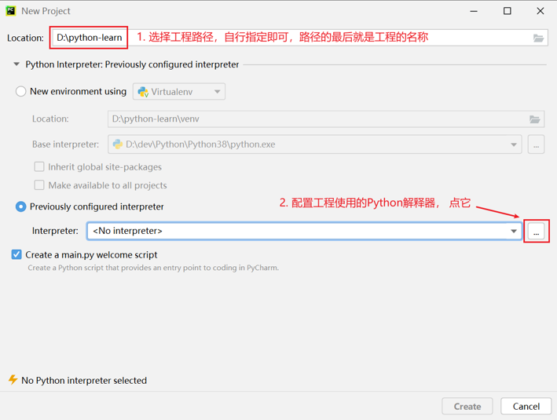

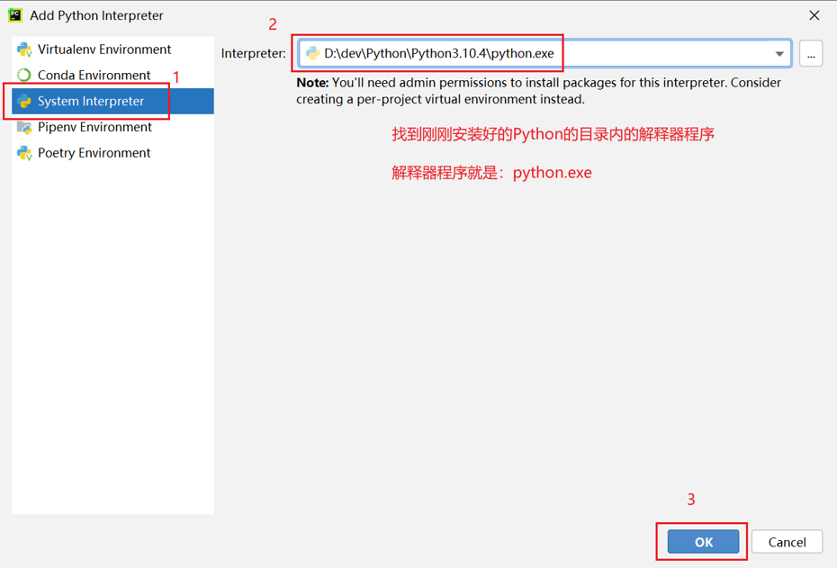

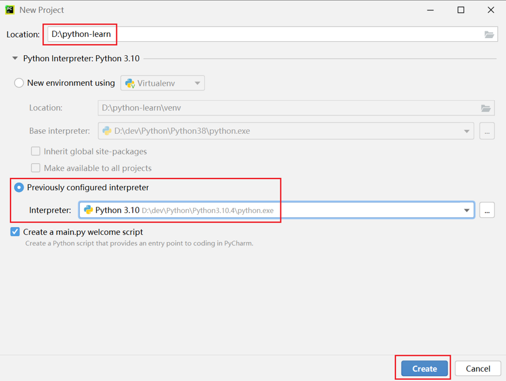

## 字面量

在代码中，被写下来的的固定的值，称之为字面量。

Python中常用的有6种值（数据）的类型

| 类型             | 描述                   | 说明                                                         |
| ---------------- | ---------------------- | ------------------------------------------------------------ |
| 数字(Number)     | 整数(int)              | 如：10、-10                                                  |
|                  | 浮点数(float)          | 如：13.14、-13.14                                            |
|                  | 复数(complex)          | 如：4+3j，以j结尾表示复数                                    |
|                  | 布尔(bool)             | 表达现实生活中的逻辑，即真和假，True表示真，False表示假。True本质上是一个数字记作1，False记作0 |
| 字符串(String)   | 描述文本的一种数据类型 | 由任意数量的字符组成，需要用双引号（""）包围起来             |
| 列表(List)       | 有序的可变序列         | 使用最频繁的数据类型，可有序记录一堆数据                     |
| 元组(Tuple)      | 有序的不可变序列       | 可有序记录一堆不可变的Python数据集合                         |
| 集合(Set)        | 无序不重复集合         | 可无序记录一堆不重复的Python数据集合                         |
| 字典(Dictionary) | 无序Key-Value集合      | 可无序记录一堆Key-Value型的Python数据集合                    |

## 注释

注释：在程序代码中对程序代码进行解释说明的文字。

作用：注释不是程序，不能被执行，只是对程序代码进行解释说明，让别人可以看懂程序代码的作用，能够大大增强程序的可读性。

- 单行注释：以#开头，起辅助说明作用

  ```python
  # 我是单行注释
  ```

- 多行注释：以一对三个双引号引起来 (""")来解释说明一段代码的作用使用方法

  ```python
  """
  我是多行注释
  """
  ```

## 变量

变量：在程序运行时，能储存计算结果或能表示值的抽象概念。

变量的定义格式：`变量名称 = 变量的值`

## 数据类型

目前在入门阶段，我们主要接触如下三类数据类型：

| 类型   | 描述             | 说明                               |
| ------ | ---------------- | ---------------------------------- |
| string | 字符串类型       | 用引号引起来的数据都是字符串       |
| int    | 整型（有符号）   | 数字类型，存放整数，如 -1,10, 0 等 |
| float  | 浮点型（有符号） | 数字类型，存放小数，如 -3.14, 6.66 |

> 我们可以通过type()语句来得到数据的类型，语法：type(被查看类型的数据)。

## 数据类型转换

数据类型之间，在特定的场景下，是可以相互转换的，如字符串转数字、数字转字符串等。

常见的转换语句:

| 语句(函数) | 说明                  |
| ---------- | --------------------- |
| int(x)     | 将x转换为一个整数     |
| float(x)   | 将x转换为一个浮点数   |
| str(x)     | 将对象 x 转换为字符串 |

类型转换不是万能的，我们需要注意：

1. 任何类型，都可以通过str()，转换成字符串
2. 字符串内必须真的是数字，才可以将字符串转换为数字

## 标识符

标识符：是用户在编程的时候所使用的一系列名字，用于给变量、类、方法等命名。

在Python程序中，我们可以给很多东西起名字，比如：

- 变量的名字
- 方法的名字
- 类的名字，等等

这些名字，我们把它统一的称之为标识符，用来做内容的标识。

Python中，标识符命名的规则主要有3类：

- 内容限定
- 大小写敏感(分开)
- 不可使用关键字

标识符命名中，只允许出现这四类元素，其余任何内容都不被允许：

- 英文
- 中文
- 数字
- 下划线（_）

> 1. 不推荐使用中文
> 2. 数字不可以开头
> 3. 不可使用关键字，关键字: 系统定义好的标识符,具有特殊的作用。

学完了标识符（变量、类、方法）的命名规则后，我们在来学习标识符的命名规范，不同的标识符，有不同的规范。

- 变量名
  1. 见名知意
  2. 下划线命名法
  3. 英文字母全小写
- 类名
- 方法名

## 输出输入

我们前面学习过print语句（函数），可以完成将内容（字面量、变量等）输出到屏幕上。

在Python中，与之对应的还有一个input语句，用来获取键盘输入。

- 数据输出：print
- 数据输入：input

使用上也非常简单：

- 使用input()语句可以从键盘获取输入
- 使用一个变量接收（存储）input语句获取的键盘输入数据即可

input()语句其实是可以在要求使用者输入内容前，输出提示内容的哦，方式如下：

```python
"""
print("请告诉我你是谁?")
name = input()
print("Get!!!你是： %s" % name)
等同下面
"""
name = input("请告诉我你是谁？")
print("Get!!!你是：%s" % name)
```

### input语句获取的数据类型

```python
v1 = input("请输入一个字符串：")
v2 = input("请输入一个整数：")
v3 = input("请输入一个浮点数：")
v4 = input("请输入一个布尔类型：")
print(f"输入的是字符串，变量类型是{type(v1)}，内容是：{v}")
print(f"输入的是整数，变量类型是{type(v2)}，内容是：{v2}")
print(f"输入的是浮点数，变量类型是{type(v3)}，内容是：{v3}")
print(f"输入的是布尔类型，变量类型是{type(v4)}，内容是：{v4}")
"""
输出：
请输入一个字符串：你好　
请输入一个整数：11
请输入一个浮点数：13.14
请输入一个布尔类型：True
输入的是字符串，变量类型是<class 'str'>，内容是：你好　
输入的是整数，变量类型是<class 'str'>，内容是：11
输入的是浮点数，变量类型是<class 'str'>，内容是：13.14
输入的是布尔类型，变量类型是<class 'str'>，内容是：True　
"""
```

可以看到，无论键盘输入何种类型的数据，最终的结果都是：字符串类型的数据。

### print输出不换行

默认print语句输出内容会自动换行，如下

```python
print("Hello")
print("World")
"""
输出：
Hello
World
"""
```

使用print语句，输出不换行的功能，非常简单，实现方式如下：

```python
print("Hello", end='')
print("World", end='')
# 输出：Helloworld
```

在print语句中，加上 end='' 即可输出不换行了，end='' 是使用的方法传参功能，我们在后面会详细讲解。

### 制表符\t

在字符串中，有一个特殊符号：\t，效果等同于在键盘上按下：tab键。它可以让我们的多行字符串进行对齐。

```python
# 使用空格无法对齐
print("Hello World")
print("itheima best") 
# 使用\t后，可以对齐
print("Hellol\tWorld")
print("itheima\tbest")
"""
输出：
Hello World
itheima best
Hello	World
itheima	best
"""
```

## 运算符

### 算术运算符

| 运算符 | 描述   | 实例                                                         |
| ------ | ------ | ------------------------------------------------------------ |
| +      | 加     | 两个对象相加 a + b 输出结果 30                               |
| \-     | 减     | 得到负数或是一个数减去另一个数 a - b 输出结果 -10            |
| *      | 乘     | 两个数相乘或是返回一个被重复若干次的字符串 a * b 输出结果 200 |
| /      | 除     | b / a 输出结果 2                                             |
| //     | 取整除 | 返回商的整数部分 9//2 输出结果 4，9.0//2.0 输出结果 4.0      |
| %      | 取余   | 返回除法的余数 b % a 输出结果 0                              |
| **     | 指数   | a**b 为10的20次方， 输出结果 100000000000000000000           |

### 赋值运算符

| 运算符 | 描述       | 实例                                                         |
| ------ | ---------- | ------------------------------------------------------------ |
| =      | 赋值运算符 | 把 = 号右边的结果 赋给 左边的变量，如 num = 1 + 2 * 3，结果num的值为7 |

### 复合赋值运算符

| 运算符 | 描述             | 实例                       |
| ------ | ---------------- | -------------------------- |
| +=     | 加法赋值运算符   | c += a 等效于 c = c + a    |
| -=     | 减法赋值运算符   | c -= a 等效于 c = c - a    |
| *=     | 乘法赋值运算符   | c *= a 等效于 c = c * a    |
| /=     | 除法赋值运算符   | c /= a 等效于 c = c / a    |
| %=     | 取模赋值运算符   | c %= a 等效于 c = c % a    |
| **=    | 幂赋值运算符     | c \**= a 等效于 c = c ** a |
| //=    | 取整除赋值运算符 | c //= a 等效于 c = c // a  |

### 比较运算符

> 比较运算符的结果是 bool 类型, 即 True,或者是 False

| 运算符 | 描述                                                         | 示例                          |
| ------ | ------------------------------------------------------------ | ----------------------------- |
| ==     | 判断内容是否相等，满足为True，不满足为False                  | 如a=3,b=3，则(a == b) 为 True |
| !=     | 判断内容是否不相等，满足为True，不满足为False                | 如a=1,b=3，则(a != b) 为 True |
| \>     | 判断运算符左侧内容是否大于右侧，满足为True，不满足为False    | 如a=7,b=3，则(a > b)  为 True |
| <      | 判断运算符左侧内容是否小于右侧，满足为True，不满足为False    | 如a=3,b=7，则(a < b)  为 True |
| \>=    | 判断运算符左侧内容是否大于等于右侧，满足为True，不满足为False | 如a=3,b=3，则(a >= b) 为 True |
| <=     | 判断运算符左侧内容是否小于等于右侧，满足为True，不满足为False | 如a=3,b=3，则(a <= b) 为 True |

### 逻辑运算符

> 逻辑运算符可以连接连个表达式, 两个表达式共同的结果决定最终的结果是 True,还是 False

```python 
and  逻辑与, 连接的两个条件都必须为 True,结果为 True,  一假为假
	如果第一个条件为 False,就不会再判断第二个条件
or   逻辑或, 连接的两个条件都为 False,结果为 False,    一真为真
	如果第一个条件为 True,第二个条件就不会再判断了
not  逻辑非, 取反,原来是 True,变为 False,原来是 False,变为 True
```

## 字符串

### 字符串的三种定义方式

字符串有3种不同的定义方式：

- 双引号定义法：`"字符串"`
- 单引号定义法：`'字符串'`
- 三引号定义法：`"""字符串"""`

> 三引号定义法，表示在一堆三个双引号的范围内，均是字符串，如下：
>
> ```python
> text = """
> 在三个引号的包围圈内
> 全部都是
> 字符串哦
> """
> ```
>
> 三引号定义法和多行注释的写法一样，同样支持换行操作。使用变量接收它，它就是字符串；不使用变量接收它，就可以作为多行注释使用。

引号的嵌套：

- 单引号定义法，可以内含双引号
- 双引号定义法，可以内含单引号
- 可以使用转移字符（\）来将引号解除效用，变成普通字符串

### 字符串拼接

如果我们有两个字符串（文本）字面量，可以将其拼接成一个字符串，通过+号即可完成，如：

```python
print("学IT来黑马" + "月薪过万")
# 输出结果：学工来黑马月新过万
```

不过一般，单纯的2个字符串字面量进行拼接显得很呆，一般，字面量和变量或变量和变量之间会使用拼接，如：

```python
name = "黑马程序员"
print("我的名字是："+ name +"，我可以教大家IT技能")
# 输出结果：我的名字是： 黑马程序员，我可以教大家IT技能
```

> 字符串无法和非字符串变量进行拼接，因为类型不一致无法接上，就像接力赛一样，不是队友，不能接力的哦。
>
> ```python
> name = "传智播客"
> set_up_year = 2006
> print("我是：" ＋ name + "，我成立于：" + set_up_year)
> # 报错
> ```

### 字符串格式化

我们会发现拼接字符串存在问题：

1. 变量过多，拼接起来实在是太麻烦了
2. 字符串无法和数字或其它类型完成拼接。

我们可以通过如下语法，完成字符串和变量的快速拼接。

```python
name = "黑马程序员"
message ="学IT就来 %s" % name
print(message)
```

其中的，%s 

- % 表示：我要占位
- s  表示：将变量变成字符串放入占位的地方

所以，综合起来的意思就是：我先占个位置，等一会有个变量过来，我把它变成字符串放到占位的位置。

因此数字也可以用%s占位，因为将数字转换成了字符串后在进行占位。

```python
class_num = 57
avg_salary = 16781
message ="Python大数据学科，北京%s期，毕业平均工资：%s" % (class_num, avg_salary)
print(message)
```

>  多个变量占位，变量要用括号括起来并按照占位的顺序填入

有没有体面一点的方式，让数字以其原本的面貌拼接进去呢。Python中，其实支持非常多的数据类型占位：

| 格式符号 | 转化                             |
| -------- | -------------------------------- |
| %s       | 将内容转换成字符串，放入占位位置 |
| %d       | 将内容转换成整数，放入占位位置   |
| %f       | 将内容转换成浮点型，放入占位位置 |

如下代码，完成字符串、整数、浮点数，三种不同类型变量的占位

```python
name = "传智播客"
set_up_year = 2006
stock_price = 19.99
message = "我是：%s，我成立于：%d，我今天的股价是：%f" % (name, set_up_year, stock_price)
print(message)
# 输出：我是：传智播客，我成立于：2006，我今天的股价是：19.990000
```

### 格式化的精度控制

可以发现上面演示的浮点数19.99，变成了19.990000输出。这里我们就要讲解一下，字符串格式化之“数字精度控制”。

我们可以使用辅助符号"m.n"来控制数据的宽度和精度：

- m：控制宽度，要求是数字（很少使用），设置的宽度小于数字自身，不生效
- n：控制小数点精度，要求是数字，会进行小数的四舍五入

示例：

- %5d：表示将整数的宽度控制在5位，如数字11，被设置为5d，就会变成：\[空格]\[空格][空格]11，用三个空格补足宽度。
- %5.2f：表示将宽度控制为5，将小数点精度设置为2
- %.2f：表示不限制宽度，只设置小数点精度为2，如11.345设置%.2f后，结果是11.35

> 小数点和小数部分也算入宽度计算。如，对11.345设置了%7.2f 后，结果是：\[空格][空格]11.35。2个空格补足宽度，小数部分限制2位精度后，四舍五入为 .35。

```python
num1 = 11
num2 = 11.345
print("数字11宽度限制5，结果：%5d" % num1)
print("数字11宽度限制1，结果：%1d" % num1)
print("数字11.345宽度限制7，小数精度2，结果 ：%7.2f" % num2)
print("数字11.345不限制宽度，小数精度2，结果：%.2f" % num2)
"""
输出：
数字11宽度限制5，结果：   11 					宽度5，补了3个空格
数字11宽度限制1，结果：11						宽度小于数字本身，无影响
数字11.345宽度限制7，小数精度2，结果：  11.35 	宽度7，补了2个空格，小数精度2，四舍五入后为.35
数字11.345不限制宽度，小数精度2，结果：11.35	不限制宽度，小数点后四舍五入后为.35
"""
```

### 字符串格式化 - 快速写法

通过语法：`f"内容{变量}"`的格式来快速格式化。这种写法不做精度控制，也不理会类型，适用于快速格式化字符串。

```python
name = "传智播客"
set_up_year = 2006
stock_price = 19.99
print(f"我是{name}，我成立于：{set_up_year}，我今天的股票价格是：{stock_price}")
# 输出：我是：传智播客，我成立于：2006，我今天的股价是：19.99
```

### 对表达式进行格式化

表达式：一条具有明确执行结果的代码语句。

如：1 + 1、5 * 2，就是表达式，因为有具体的结果，结果是一个数字。又或者常见的变量定义：name = “张三”   age = 11 + 11。等号右侧的都是表达式，因为它们有具体的结果，结果赋值给了等号左侧的变量。

那么，对于字符串格式化，能否直接格式化一个表达式呢？

```python
print("1 ＊ 1的结果是：%d" % (1 ＊ 1))　
print(f"1 ＊ 1的结果是：{1 ＊ 1}")　
print("字符串在Python中的类型是：%s" % type('字符串'))
"""
输出：
1 ＊ 1的结果是：1　
1 ＊ 1的结果是：1　
字符串在Python中的类型是：<class 'str'>
"""
```

在无需使用变量进行数据存储的时候，可以直接格式化表达式，简化代码

## 判断语句

### 布尔类型和比较运算符

定义变量存储布尔类型数据：`变量名称 = 布尔类型字面量`

布尔类型的字面量：

- True 表示真（是、肯定）
- False 表示假 （否、否定）

布尔类型不仅可以自行定义，同时也可以通过计算，也就是使用比较运算符进行比较运算得到布尔类型的结果。

```python
result = 10 > 5
print(f"10 > 5 的结果是：{result}，类型是：{type(result)}")
# 输出：10 > 5 的结果是：True，类型是：<class' bool'>
```

```python
result = "itcast" == "itheima"
print(f"字符串itcast是否和itheima相等，结果是：{result}，类型是：{type(result)}")
# 输出：字符串itcast是否和itheima相等，结果是：False 类型是 <class 'bool'>
```

### if语句的基本格式

语法：

```
if 要判断的条件：
	条件成立时，要做的事情
```

例子：

```python
# 定义变量
age = 30
# 进行判断
if age >= 18:    
	print("我已经成年了")
# 执行结果
# 输出：我已经成年了
```

> if语句的注意点：
>
> - 判断语句的结果，必须是布尔类型True或False，True会执行if内的代码语句，False则不会执行
> - 归属于if判断的代码语句块，需在前方填充4个空格缩进，Python通过缩进判断代码块的归属关系。

### if else 语句

语法：

```
if条件：
	满足条件时要做的事情1
	满足条件时要做的事情2
	满足条件时要做的事情3
	...(省略)...
else:
	不满足条件时要做的事情1
	不满足条件时要做的事情2
	不满足条件时要做的事情3
	...(省略)...
```

例子：

```python
print("欢迎来到黑马儿童游乐场，儿童免费，成人收费。")
age = int(input("请输入你的年龄："))
if age >= 18:
	print("您已成年，游玩需要补票10元。")　# 条件成立时执行
else:
	print("您未成年, 可以免费游玩。")	# 条件不成立时执行
print("祝您游玩愉快。")
```

> if else语句注意点：
>
> - else后，不需要判断条件
> - 和if的代码块一样，else的代码块同样需要4个空格作为缩进

### if elif else语句

语法：

```
if条件1：
	条件1满足应做的事情
	条件1满足应做的事情
	.......
elif 条件2：
	条件2满足应做的事情
	条件2满足应做的事情
	......
elif 条件N:
	条件N满足应做的事情
	条件N满足应做的事情
	.......
else:
	所有条件都不满足应做的事情
	所有条件都不满足应做的事情
	......
```

例子：

```python
print("欢迎来到黑马动物园。")
height = int(input("请输入你的身高（cm）："))
vip_level = int(input("请输入你的vip级别（1~5）："))
if height < 120:
	print("您的身高小于120CM，可以免费游玩。")
elif vip_level > 3:
	print("您的vip级别大于3，可以免费游玩。")
else:
	print("不好意思，所有条件都不满足，需要购票10元。")
print("祝您游玩愉快。")
```

> if else语句注意点：
>
> - 判断是互斥且有顺序的。满足1将不会理会2和3；满足2，将不会理会3；1、2、3均不满足，进入else。else也可以省略不写，效果等同3个独立的if判断
>
> - 空格缩进同样不可省略
>
> - 可以将input输入语句直接写入判断条件中，节省代码量。
>
>   ```python
>   print("欢迎来到黑马动物园。")
>   if int(input("请输入你的身高（cm）：")) < 120:
>   	print("您的身高小于120CM，可以免费游玩。")
>   elif int(input("请输入你的vip级别（1~5）：")) > 3:
>   	print("您的vip级别大于3，可以免费游玩。")
>   else:
>   	print("不好意思，所有条件都不满足，需要购票10元。")
>   print("祝您游玩愉快。")
>   ```

### 判断语句嵌套

语法：

```
if条件1：　
	满足条件1 做的事情1
	满足条件1 做的事情2
	
	if 条件2：　
		满足条件2 做的事情1
		满足条件2 做的事情2
```

第二个if，属于第一个if内，只有第一个if满足条件，才会执行第二个if。

例子：

```python
print("欢迎来到黑马动物园。")
if int(input("请输入你的身高（cm）：")) > 120:
	print("你的身高大于120cm，不可以免费")
	print("不过如果你的vip等级高于3，可以免费游玩")
    if int(input("请输入你的vip级别（1~5）：")) > 3:
		print("您的vip级别大于3，可以免费游玩。")
	else:
		print("不好意思，所有条件都不满足，需要购票10元。")
else:
	print("祝您游玩愉快。")
```

> 嵌套的关键点：
>
> - 通过空格缩进，来决定语句之间的层次关系
> - if elif else 可以自由组合，满足缩进的要求即可

## 循环语句

### while循环语句

语法：

```
while条件：
	条件满足时，做的事情1
	条件满足时，做的事情2
	杀件满足时，做的事情3
	...（省略）...
```

例子：

```python
i=0
while i < 100:
	print("小美， 我喜欢你")
	i+= 1
```

> 关键点：
>
> - while的条件需得到布尔类型，True表示继续循环，False表示结束循环
> - 需要设置循环终止的条件，如i += 1配合 i < 100，就能确保100次后停止，否则将无限循环
> - 空格缩进和if判断一样，都需要设置

#### while循环的嵌套

语法：

```
while条件：
	条件1满足时，做的事情1
	条件1满足时，做的事情2
	杀件1满足时，做的事情3
	...（省略）...
	
	while条件：
		条件2满足时，做的事情1
		条件2满足时，做的事情2
		杀件2满足时，做的事情3
		...（省略）...
```

例子：

```python
i=1
while i <= 100:
	print(f"今天是第{i}天，准备表白····")
	j=1
	while j <= 10:
		print(f"送给小美第{j}只玫瑰花")
		j += 1
	print("小美，我喜欢你")
	i+= 1

print(f"坚持到第{i-1}天，表白成功")
```

> 关键点：
>
> - 同判断语句的嵌套一样，循环语句的嵌套，要注意空格缩进。基于空格缩进来决定层次关系
> - 注意条件的设置，避免出现无限循环（除非真的需要无限循环）

### for循环语句

Python同样提供了for循环语句。两者能完成的功能基本差不多，但仍有一些区别：

- while循环的循环条件是自定义的，自行控制循环条件
- for循环是一种”轮询”机制，是对一批内容进行”逐个处理”。从待处理数据集中逐个取出数据，赋值给临时变量。

语法：

```
for 临时变量 in 待处理数据集: 
	循环满足条件时执行的代码
```

例子：

```python
# 定义字符串name
name = ”itheima”
# for循环处理字符串
for x in name: 
	print(x)
"""
输出：
i
t
h
e
i
m
a
"""
```

可以看出，for循环是将字符串的内容依次取出。所以for循环也被称之为：遍历循环

> 关键点：
>
> - 同while循环不同，for循环是无法定义循环条件的。只能从被处理的数据集中，依次取出内容进行处理。
> - 所以，理论上讲，Python的for循环无法构建无限循环（被处理的数据集不可能无限大）

> 叫for in循环更合适，功能上也属于for in循环。

#### range语句

```
for 临时变量 in 待处理数据集(可迭代对象): 
	循环满足条件时执行的代码
```

语法中的待处理数据集，严格来说称之为可迭代类型。可迭代类型指，其内容可以一个个依次取出的一种类型，包括：字符串、列表、元组等。for循环语句本质上是遍历可迭代对象，尽管除字符串外，其它可迭代类型目前没学习到，但不妨碍我们通过学习range语句，获得一个简单的数字序列（可迭代类型的一种）。

语法1：

```
range(num)
```

获取一个**从0开始**，到num结束的数字序列（不含num本身），如range(5)取得的数据是：[0, 1, 2, 3, 4]

语法2：

```
range(num1, num2)
```

获得一个从num1开始，到num2结束的数字序列（不含num2本身），如，range(5, 10)取得的数据是：[5, 6, 7, 8, 9]

语法3：

```
range(num1, num2, step)
```

获得一个从num1开始，到num2结束的数字序列（不含num2本身），数字之间的步长，以step为准（step默认为1）。如，range(5, 10, 2)取得的数据是：[5, 7, 9]

例子：

```python
# for循环处理字符串
for i in range(5): 
	print(i)
"""
输出：
0
1
2
3
4
"""
```

#### for循环的变量作用域

```
for 临时变量 in 待处理数据集: 
	循环满足条件时执行的代码
```

回看for循环的语法，我们会发现，将从数据集（序列）中取出的数据赋值给临时变量，为什么是临时的呢？

临时变量，在编程规范上，作用范围（作用域），只限定在for循环内部。如果在for循环外部访问临时变量实际上是可以访问到的，但在编程规范上，是不允许这么做的。

如果实在需要在循环外访问循环内的临时变量，可以在循环外预先定义。例子：

```python
i = 0
for i in range(5):
	print(i)
    
print(i)
# 每一次循环的时候，都会将取出的值赋予i变量。由于i变量是在循环之前（外）定义的，在循环外访问i变量是合理的、允许的
```

#### for循环的嵌套应用

语法：

```
for 临时变量 in 待处理数据集（序列）:
	循环满足条件应做的事情1
	循环满足条件应做的事情2
	循环满足条件应做的事情N
	...
	for 临时变量 in 待处理数据集（序列）:
		循环满足条件应做的事情1
		循环满足条件应做的事情2
		循环满足条件应做的事情N
```

例子：

```python
i = 1
for i in range(1, 101):
	print(f"今天是向小美表白的第{i}天，坚持。")
	for j in range(1, 11):
		print(f"送给小美的第{j}朵玫瑰花")
	print(f"小美，我喜欢你(第{i}天的表白结束)")

print(f"第{i}天, 表白成功")
```

这两类循环语句是可以相互嵌套的，如下，小美表白的案例可以改为：

```python
i = 1
while i <= 100:
	print(f"今天是向小美表白的第{i}天，坚持。")
	for j in range(1, 11):
		print(f"送给小美的第{j}朵玫瑰花")
	print(f"小美，我喜欢你(第{i}天的表白结束)")
    i +=1
    
print(f"第{i - 1}天, 表白成功")
```

### 循环中断

#### continue

continue关键字：中断本次循环，直接进入下一次循环。

continue关键字只可以控制它所在的循环临时中断，对外层循环无影响。

#### break

break关键字：直接结束所在循环

break关键字同样只可以控制它所在的循环永久中断，对外层循环无影响。

## 函数

函数：是组织好的，可重复使用的，用来实现特定功能的代码段。我们使用过的：input()、print()、str()、int()等都是Python的内置函数。

函数的定义：

```python
def 函数名(传入参数):
	函数体
	return 返回值
```

函数的调用：

```python
函数名(参数)
```

注意事项：

- 参数如不需要，可以省略
- 返回值如不需要，可以省略
- 函数必须先定义后使用

### 函数参数

参数的功能是：在函数进行计算的时候，接受外部（调用时）提供的数据。

例子：

```python
# 定义函数
def add(x,y):
	result = x + y
	print(f"{x} + {y}的结果是:{result}")
    
# 调用函数
add(5, 6)
```

函数定义中，提供的x和y，称之为：形式参数（形参），表示函数声明将要使用2个参数，参数之间使用逗号进行分隔

函数调用中，提供的5和6，称之为：实际参数（实参），表示函数执行时真正使用的参数值，传入的时候，按照顺序传入数据，使用逗号分隔。

传入参数的数量是不受限制的。可以不使用参数，也可以仅使用任意N个参数。

#### 函数参数种类

使用方式上的不同, 函数有4中常见参数使用方式:

- 位置参数
- 关键字参数
- 缺省参数
- 不定长参数

##### 位置参数

位置参数：调用函数时根据函数定义的参数位置来传递参数

```python
def user_info(name, age, gender):
    print(f'您的名字是{name}，年龄是{age}，性别是{gender}')
user_info('TOM', 20, '男')
```

注意：传递的参数和定义的参数的顺序及个数必须一致

##### 关键字参数

关键字参数：函数调用时通过“键=值”形式传递参数.

作用：可以让函数更加清晰、容易使用，同时也清除了参数的顺序需求.

```python
def user_info(name, age, gender):
    print(f"您的名字是：{name}，年龄是：{age}，性别是：{gender}")

# 关键字传参
user_info(name="小明", age=20, gender="男")
# 可以不按照固定顺序
user_info(age=20, gender="男", name="小明")
# 可以和位置参数混用，位置参数必须在前，且匹配参数顺序
user_info("小明", age=20, gender="男")
```

注意：函数调用时，如果有位置参数时，位置参数必须在关键字参数的前面，但关键字参数之间不存在先后顺序

##### 缺省参数

缺省参数：缺省参数也叫默认参数，用于定义函数，为参数提供默认值，调用函数时可不传该默认参数的值（注意：所有位置参数必须出现在默认参数前，包括函数定义和调用）.

作用：当调用函数时没有传递参数, 就会使用默认是用缺省参数对应的值.

```python
def user_info(name, age, gender='男'):
    print(f'您的名字是{name}，年龄是{age}，性别是{gender}')

user_info('TOM', 20)
user_info('Rose', 18, '女')
```

注意：函数调用时，如果为缺省参数传值则修改默认参数值, 否则使用这个默认值

##### 不定长参数

不定长参数：不定长参数也叫可变参数. 用于不确定调用的时候会传递多少个参数(不传参也可以)的场景.

作用：当调用函数时不确定参数个数时, 可以使用不定长参数

不定长参数的类型：

- 位置传递

  ```python
  def user_info(*args):
      print(args)
  
  # ('TOM',)
  user_info('TOM')
  # ('TOM', 18)
  user_info('TOM', 18)
  ```

  注意：传进的所有参数都会被args变量收集，它会根据传进参数的位置合并为一个元组(tuple)，args是元组类型，这就是位置传递

- 关键字传递

  ```python
  def user_info(**kwargs):
      print(kwargs)
  
  # {'name': 'TOM', 'age': 18, 'id': 110}
  user_info(name='TOM', age=18, id=110)
  ```

  注意：参数是“键=值”形式的形式的情况下, 所有的“键=值”都会被kwargs接受, 同时会根据“键=值”组成字典.

### 函数返回值

所谓“返回值”，就是程序中函数完成事情后，最后给调用者的结果

```python
def 函数名(传入参数):
	函数体
	return 返回值

变量 = 函数(参数)
```

如上，变量就能接收到函数的返回值

#### None类型

如果函数没有使用return语句返回数据，那么函数有返回值吗？实际上是有的。

Python中有一个特殊的字面量：None，其类型是：<class 'NoneType'>。无返回值的函数，实际上就是返回了None这个字面量。

None表示：空的、无实际意义的意思。函数返回的None，就表示这个函数没有返回值为空的意思。

例子：

```python
def say_hello():
	print("Hello...")
    
# 使用变量接收say_he1lo函数的返回值
result = say_hello()
# 打印返回值　
print(result) # 结果None
# 打印返回值类型
print(type(result))
# 结果<class 'NoneType'>
```

None可以主动使用return返回，效果等同于不写return语句：

```python
def say_hello():
	print("Hello...")
    return None

# 使用变量接收say_he1lo函数的返回值
result = say_hello()
# 打印返回值　
print(result) # 结果None
```

None作为一个特殊的字面量，用于表示：空、无意义，其有非常多的应用场景：

- 用在函数无返回值上

- 用在if判断上：在if判断中，None等同于False。一般用于在函数中主动返回None，配合if判断做相关处理

  ```python
  def check_age(age):
  	if age > 18:
  		return "SUCCESS"
  	return None
  
  result = check_age(5)
  if not result:
  	print("未成年，不可进入")
  ```

- 用于声明无内容的变量上：定义变量，但暂时不需要变量有具体值，可以用None来代替

  ```python
  # 暂不赋予变量具体值
  name = None
  ```

#### 多个返回值

如果一个函数要有多个返回值，该如何书写代码？

```python
def test_return():
    return 1, 2
x, y = test_return()
print(x)	# 结果：1
print(y)	# 结果：2
```

按照返回值的顺序，写对应顺序的多个变量接收即可，变量之间用逗号隔开，支持不同类型的数据return。

### 函数的说明文档

函数是纯代码语言，想要理解其含义，就需要一行行的去阅读理解代码，效率比较低。我们可以给函数添加说明文档，辅助理解函数的作用。通过多行注释的形式，对函数进行说明解释，内容应写在函数体之前。

语法：

```python
def func(x, y):
	"""
	函数说明
	:param x：形参x的说明
	:param y：形参y的说明
	:return：返回值的说明
	"""
    函数体
	return 返回值
```

在PyCharm编写代码时，可以通过鼠标悬停，查看调用函数的说明文档。

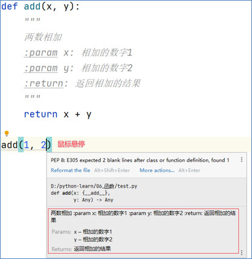

### 函数的嵌套调用

所谓函数嵌套调用指的是一个函数里面又调用了另外一个函数

```python
def func_b():
	print("---2---")
    
    
def func_a():
	print("---1---")
    
	func_b()

    print("---3---")
    
    
#调用函数func_a
func_a()

"""
输出：
---1---
---2---
---3---
"""
```

如果函数A中，调用了另外一个函数B，那么先把函数B中的任务都执行完毕之后才会回到上次函数A执行的位置

### 变量的作用域

变量作用域指的是变量的作用范围（变量在哪里可用，在哪里不可用）。主要分为两类：局部变量和全局变量

#### 局部变量

所谓局部变量是定义在函数体内部的变量，即只在函数体内部生效。局部变量的作用：在函数体内部，临时保存数据，即当函数调用完成后，则销毁局部变量。

```python
def testA():
	num = 100 
	print(num)

testA()	# 100
print(num)	# 报错：name 'num' is not defined
```

变量a是定义在`testA`函数内部的变量，在函数外部访问则立即报错。

#### 全局变量

所谓全局变量，指的是在函数体内、外都能生效的变量

```python
# 定义全局变量a
num = 100

def testA():
    print(num)	# 访问全局变量num，并打印变量num存储的数据

    
def testB():
	print(num)	# 访问全局变量num，并打印变量num存储的数据

    
testA	# 100
testB	# 100
```

#### global关键字

使用 global关键字 可以在函数内部声明变量为全局变量，如下所示：

```python
num = 100

def testA():
	print(num)
    
    
def testB():
	# globa1 关键字声明a是全局变量
	global num
	num = 200 
	print(num)

    
testA()	# 结果：100
testB()	# 结果：200
print(f'全局变量num = {num}')	# 结果：全局变量num = 200
```

#### 匿名函数

##### 函数作为参数传递

在前面的函数学习中，我们一直使用的函数，都是接受数据作为参数传入：

- 数字
- 字符串
- 字典、列表、元组等

其实，我们学习的函数本身，也可以作为参数传入另一个函数内。

如下代码：

```python
def test_func(compute):
    result = compute(1, 2)
    print(result)

def compute(x, y):
    return x + y

test_func(compute)	# 结果：3


def test_func(compute):
    result = compute(1, 2)
    print(result)

def compute(x, y):
    return x * y

test_func(compute)	# 结果：2


def test_func(compute):
    result = compute(1, 2)
    print(result)

def compute(x, y):
    return x - y

test_func(compute)	# 结果：-1
```

函数compute，作为参数，传入了test_func函数中使用。test_func需要一个函数作为参数传入，这个函数需要接收2个数字进行计算，计算逻辑由这个被传入函数决定。compute函数接收2个数字对其进行计算，compute函数作为参数，传递给了test_func函数使用。最终，在test_func函数内部，由传入的compute函数，完成了对数字的计算操作。所以，这是一种，计算逻辑的传递，而非数据的传递。就像上述代码那样，不仅仅是相加，相见、相除、等任何逻辑都可以自行定义并作为函数传入。

##### lambda匿名函数

函数的定义中：

- def关键字，可以定义带有名称的函数
- lambda关键字，可以定义匿名函数（无名称）

有名称的函数，可以基于名称重复使用。无名称的匿名函数，只可临时使用一次。

匿名函数定义语法：`lambda 传入参数：函数体（一行代码）`

- lambda 是关键字，表示定义匿名函数
- 传入参数表示匿名函数的形式参数，如：x, y 表示接收2个形式参数
- 函数体，就是函数的执行逻辑，要注意：只能写一行，无法写多行代码

如下图代码，我们可以：

```python
# 通过def关键字，定义一个函数，并传入，如下：
def test_func(compute):
    result = compute(1, 2)
    print(result)

def compute(x, y):
    return x + y

test_func(compute)	# 结果：3

# 也可以通过lambda关键字，传入一个一次性使用的lambda匿名函数
def test_func(compute):
    result = compute(1, 2)
    print(result)

test_func(lambda x, y: x + y)	# 结果：3
```

使用def和使用lambda，定义的函数功能完全一致，只是lambda关键字定义的函数是匿名的，无法二次使用

## 数据容器

Python中的数据容器：一种可以容纳多份数据的数据类型，容纳的每一份数据称之为1个元素。每一个元素，可以是任意类型的数据，如字符串、数字、布尔等。

数据容器根据特点的不同进行分类如：

- 是否支持重复元素
- 是否可以修改
- 是否有序，等

共分为5类，列表（list）、元组（tuple）、字符串（str）、集合（set）、字典（dict）

### list(列表)

#### 列表的定义

语法：
```python
# 字面量 
[元素1, 元素2, 元素3, 元素4, ...]

# 定义变量
变量名称 = [元素1, 元素2, 元素3, 元素4, ...]

# 定义空列表
变量名称 = []
变量名称 = list()
```

列表有如下特点：

- 以 [] 作为标识
- 列表内的每一个数据，称之为元素
- 列表内每一个元素之间用逗号隔开
- 可以容纳多个元素（上限为2**63-1、9223372036854775807个）
- 可以容纳不同类型的元素（混装）
- 数据是有序存储的（有下标序号）
- 允许重复数据存在
- 可以修改（增加或删除元素等）

例子：

```python
name_list = ['itheima', 'itcast', 'python'] 
print(name_list) 
print(type(name_list))
"""
['itheima', 'itcast', 'python']
<class 'list'>
"""

my_list = ['itheima', 666, True] 
print(my_list)
print(type(my_list))
"""
['itheima', 666, True] 
<class 'list'>
"""

my_list = [ [1, 2, 3], [4, 5, 6] ] 
print(my_list) 
print(type(my_list)) 
"""
[[1, 2, 3], [4, 5, 6]]
<class 'list'>
"""
```

> 注意：列表可以一次存储多个数据，且可以为不同的数据类型，支持嵌套

#### 列表的下标（索引）

从列表中取出特定位置的数据，我们可以使用下标索引。列表中的每一个元素，都有其位置下标索引，从前向后的方向，从0开始，依次递增，我们只需要按照下标索引，即可取得对应位置的元素。

```python
#语法：列表[下标索引]

name_list = ['Tom', 'Lily', 'Rose'] 
print(name_list[0]) # 结果：Tom 
print(name_1ist[1]) # 结果：Lily 
print(name_1ist[2]) # 结果：Rose
```

或者，可以反向索引，也就是从后向前：从-1开始，依次递减（-1、-2、-3......）

```python
#语法：列表[下标索引]

name_list = ['Tom', 'Lily', 'Rose'] 
print(name_list[-1]) # 结果：Rose
print(name_1ist[-2]) # 结果：Lily 
print(name_1ist[-3]) # 结果：Tom
```

如果列表是嵌套的列表，同样支持下标索引

```python
# 2层嵌套list 
my_1ist = [ [1, 2, 3], [4, 5, 6] ]

# 获取内层第一个list 
print(my_1ist[0])		# 结果：[1, 2, 3]

# 获取内层第一个1ist的第一个元素
print(my_list[0][0])	# 结果：1
```

#### 列表的常用方法

列表也提供了一系列功能，这些功能我们都称之为列表的方法：

- 插入元素
- 删除元素
- 清空列表
- 修改元素
- 统计元素个数
- 等等

在Python中，如果将函数定义为class（类）的成员，那么函数会称之为方法。方法和函数功能一样， 有传入参数，有返回值，只是方法的使用格式不同，关于类和方法的定义，在面向对象章节我们学习，目前我们知道如何使用方法即可。

```python
# 函数的定义
def add(x, y):
	return x + y

# 函数的使用
num = add(1, 2)
```

方法：

```python
# 方法的定义
class Student:
    
	def add(self, x, y):
		return x + y
    
# 方法的使用
student = Student() 
num = student.add(1, 2)
```

列表的方法总览：

| 编号 | 使用方式                | 作用                                     |
| ---- | ----------------------- | ---------------------------------------- |
| 1    | 列表.append(元素)       | 向列表中追加一个元素                     |
| 2    | 列表.extend(容器)       | 将数据容器的内容依次取出，追加到列表尾部 |
| 3    | 列表.insert(下标, 元素) | 在指定下标处，插入指定的元素             |
| 4    | del 列表[下标]          | 删除列表指定下标元素                     |
| 5    | 列表.pop(下标)          | 删除列表指定下标元素                     |
| 6    | 列表.remove(元素)       | 从前向后，删除此元素第一个匹配项         |
| 7    | 列表.clear()            | 清空列表                                 |
| 8    | 列表.count(元素)        | 统计此元素在列表中出现的次数             |
| 9    | 列表.index(元素)        | 查找指定元素在列表的下标                 |
| 10   | len(列表)               | 统计容器内有多少元素                     |

> 功能方法非常多，同学们不需要硬记下来。学习编程，不仅仅是Python语言本身，以后根据方向，会学习更多的框架技术。除了经常用的，大多数是记忆不下来的。
>
> 我们要做的是，有一个模糊印象，知晓有这样的用法即可。需要的时候，随时查阅资料即可。

##### 列表的查询方法

查找某元素的下标：

- 语法：`列表.index(元素)`。index就是列表对象（变量）内置的方法（函数）
- 功能：查找指定元素在列表的下标，如果找不到，报错ValueError

```python
my_list = ["itheima", "itcast", "python"]
print(my_list.index("itcast"))	# 结果：1
```

统计列表内，有多少元素：

- 语法：`len(列表)`
- 功能：可以得到一个int数字，表示列表内的元素数量

```python
my_list = [1, 2, 3, 4, 5] 
print(len(my_1ist))	# 结果5
```

##### 列表的修改方法

修改特定位置（索引）的元素值：

- 语法：`列表[下标] = 值`
- 功能：可以直接对指定下标（正向、反向下标均可）的值进行：重新赋值（修改）

```python
# 正向下标 
my_1ist = [l, 2, 3] 
my_list[0] = 5 
print(my_list) # 结果：[5, 2, 3]

# 反向下标 
my_1ist = [1, 2, 3] 
my_1ist[-3] = 5  
print(my_list) # 结果： [5, 2, 3]
```

插入元素：

- 语法：`列表.insert(下标, 元素)`，在指定的下标位置，插入指定的元素

```python
my_list = [1, 2, 3] 
my_list.insert(1, "itheima") 
print(my_list) # 结果：[1，"itheima", 3, 4]
```

追加元素：

- 语法：`列表.append(元素)`，将指定元素，追加到列表的尾部

```python
my_1ist = [1, 2, 3] 
my_1ist.append(4)　
print(my_list)	# 结果：[1, 2, 3, 4]

my_1ist = [1, 2, 3] 
my_1ist.append([4, 5, 6]) 
print(my_1ist) 	# 结果： [1, 2, 3, [4, 5, 6]]
```

追加元素方式2：

- 语法：`列表.extend(其它数据容器)`，将其它数据容器的内容取出，依次追加到列表尾部

```python
my_1ist = [1, 2, 3] 
my_1ist.extend([4, 5, 6])
print(my_list)	# 结果：[1, 2, 3, 4, 5, 6]　
```

删除元素：

- 语法1：`del 列表[下标]`
- 语法2：`列表.pop(下标)`

```python
my_1ist = [1, 2, 3]

# 方式1 
del my_list[0] 
print(my_1ist)	# 结果：[2, 3] 

# 方式2　 
my_list.pop(0) 
print(my_1ist) 	# 结果： [2, 3]
```

删除某元素在列表中的第一个匹配项：

- 语法：`列表.remove(元素)`

```python
my_1ist = [1, 2, 3, 2, 3] 
my_list.remove(2) 
print(my_list) # 结果：[1, 3, 2, 3]　
```

清空列表内容：

- 语法：`列表.clear()`

```python
my_list = [1, 2, 3] 
my_list.clear() 
print(my_list) # 结果：[]
```

统计某元素在列表内的数量：

- 语法：`列表.count(元素)`

```python
my_list = [1, 1, 1, 2, 3] 
print(my_list.count(1)) # 结果：3
```

#### 列表的遍历

既然数据容器可以存储多个元素，那么就会有需求从容器内依次取出元素进行操作。将容器内的元素依次取出进行处理的行为，称之为：遍历、迭代。

```python
# while循环遍历大致语法
# 定义一个变量表示下标，从0开始，循环条件为 下标值 < 列表的元素数量
index = 0
while index < len(列表):
	元素 = 列表[index] 
    对元素进行处理 
    index += 1
    
# for循环遍历大致语法
# for循环更加适合对列表等数据容器进行遍历，表示从容器内依次取出元素并赋值到临时变量上。在每一次的循环中，我们可以对临时变量（元素）进行处理。
for 临时变量 in 数据容器:
	对临时变量进行处理
    
# for循环例子
my_list = [1, 2, 3, 4, 5] 
for i in my_list:
	print(i)
"""
1 
2 
3
4
5
"""
```

while循环和for循环，都是循环语句，但细节不同：

- 在循环控制上：

  - while循环可以自定循环条件，并自行控制

  - for循环不可以自定循环条件，只可以一个个从容器内取出数据

- 在无限循环上：

  - while循环可以通过条件控制做到无限循环
  - for循环理论上不可以，因为被遍历的容器容量不是无限的

- 在使用场景上：

  - while循环适用于任何想要循环的场景
  - for循环适用于遍历数据容器的场景或简单的固定次数循环场景

### tuple(元组)

列表是可以修改的。如果想要传递的信息，不被篡改，列表就不合适了。元组同列表一样，都是可以封装多个、不同类型的元素在内。但最大的不同点在于：元组一旦定义完成，就不可修改。所以，当我们需要在程序内封装数据，又不希望封装的数据被篡改，那么元组就非常合适了。

#### 定义元组

元组定义：定义元组使用小括号，且使用逗号隔开各个数据，数据可以是不同的数据类型。

语法：

```python
# 定义元组字面量 
(元素, 元素, ......, 元素)

# 定义元组变量
变量名称 =(元素, 元素, ......, 元素) 

# 定义空元组
变量名称 = ()		# 方式1
变量名称 = tuple()	# 方式2
```

列表有如下特点：

- 可以容纳多个数据
- 可以容纳不同类型的数据（混装）
- 数据是有序存储的（下标索引）
- 允许重复数据存在
- 不可以修改（增加或删除元素等）
- 支持for循环

多数特性和list一致，不同点在于不可修改的特性。

元组也支持嵌套：

```python
# 定义一个嵌套元组
t1 = ((1, 2, 3), (4, 5, 6))
print(t1[0][0])  # 结果: 1
```

注意事项：

```python
# 定义3个元素的元组
t1 = (1, 'Hello', True)

# 定义1个元素的元组
t2 = ('Hello',)		# 注意，必须带有逗号，否则不是元组类型
```

> 注意：元组只有一个数据，这个数据后面要添加逗号

#### 元组的相关操作

元组由于不可修改的特性，所以其操作方法非常少。

| **编号** | **方法**  | **作用**                                           |
| -------- | --------- | -------------------------------------------------- |
| 1        | index()   | 查找某个数据，如果数据存在返回对应的下标，否则报错 |
| 2        | count()   | 统计某个数据在当前元组出现的次数                   |
| 3        | len(元组) | 统计元组内的元素个数                               |

```python
# 根据下标（索引）取出数据
t1 = (1, 2, 'hello')
print(t1[2])  # 结果：'hello'

# 根据index，查找特定元素的第一个匹配项
t2 = (1, 2, 'hello', 3, 4, 'hello')
print(t2.index('hello'))  # 结果：2

# 统计某个数据在元组内出现的次数
t3 = (1, 2, 'hello', 3, 4, 'hello')
print(t3.count('hello'))  # 结果：2

# 统计元组内的元素个数
t4 = (1, 2, 3)
print(len(t4))  # 结果：3
```

注意事项：

- 不可以修改元组的内容，否则会直接报错

  ```python
  # 尝试修改元组内容
  t1 = (1, 2, 3)
  t1[0] = 5  # 此处会报错，因为元组是不可变的
  ```

- 可以修改元组内的list的内容（修改元素、增加、删除、反转等）

  ```python
  # 尝试修改元组内容
  t1 = (1, 2, ['itheima', 'itcast'])
  t1[2][0] = 'best'
  print(tl)  # 结果：(1, 2, ['itcast', 'best'])
  ```

- 不可以替换list为其它list或其它类型

  ```python
  # 尝试修改元组内容
  t1 = (1, 2, ['itheima', 'itcast'])
  t1[2] = [1, 2, 3]
  print(t1)	# 此处会报错
  ```

#### 元组的遍历

同列表一样，元组也可以被遍历。可以使用while循环和for循环遍历它

```python
# while循环
my_tuple = (1, 2, 3, 4, 5)
index = 0
while index < len(my_tuple):
    print(my_tuple[index])
    index += 1

# for循环
my_tuple = (1, 2, 3, 4, 5)
for i in my_tuple:
    print(i)

"""
1
2
3
4
5
"""
```

### str(字符串)

尽管字符串看起来并不像：列表、元组那样，一看就是存放了许多数据的容器。但不可否认的是，字符串同样也是数据容器的一员。字符串是字符的容器，一个字符串可以存放任意数量的字符。如，字符串："itheima"

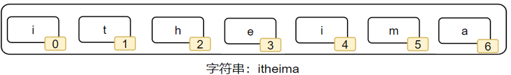

作为数据容器，字符串有如下特点：

- 只可以存储字符串
- 长度任意（取决于内存大小）
- 支持下标索引
- 允许重复字符串存在
- 不可以修改（增加或删除元素等）
- 支持for循环

基本和列表、元组相同，不同与列表和元组的在于：字符串容器可以容纳的类型是单一的，只能是字符串类型。不同于列表，相同于元组的在于：字符串不可修改

#### 字符串的下标（索引）

和其它容器如：列表、元组一样，字符串也可以通过下标进行访问。

- 从前向后，下标从0开始
- 从后向前，下标从-1开始

```python
# 通过下标获取特定位置字符
name = "itheima"
print(name[0])  # 结果：i
print(name[-1])  # 结果：a
```

同元组一样，字符串是一个：无法修改的数据容器。所以：

- 修改指定下标的字符 （如：字符串[0] = “a”）
- 移除特定下标的字符 （如：del 字符串[0]、字符串.remove()、字符串.pop()等）
- 追加字符等 （如：字符串.append()）

均无法完成。如果必须要做，只能得到一个新的字符串，旧的字符串是无法修改

#### 字符串的常用操作

字符串常用操作汇总：

| **编号** | **操作**                             | **说明**                                                     |
| -------- | ------------------------------------ | ------------------------------------------------------------ |
| 1        | 字符串[下标]                         | 根据下标索引取出特定位置字符                                 |
| 2        | 字符串.index(字符串）                | 查找给定字符的第一个匹配项的下标                             |
| 3        | 字符串.replace(字符串1, 字符串2)     | 将字符串内的全部字符串1，替换为字符串2  不会修改原字符串，而是得到一个新的 |
| 4        | 字符串.split(字符串)                 | 按照给定字符串，对字符串进行分隔  不会修改原字符串，而是得到一个新的列表 |
| 5        | 字符串.strip()  字符串.strip(字符串) | 移除首尾的空格和换行符或指定字符串                           |
| 6        | 字符串.count(字符串)                 | 统计字符串内某字符串的出现次数                               |
| 7        | len(字符串)                          | 统计字符串的字符个数                                         |

查找特定字符串的下标索引值：

- 语法：字符串.index(字符串)

```python
my_str = "itcast and itheima"
print(my_str.index("and"))  # 结果：7
```

字符串的替换：

- 语法：字符串.replace(字符串1，字符串2）
- 功能：将字符串内的全部：字符串1，替换为字符串2
- 注意：不是修改字符串本身，而是得到了一个新字符串哦

```python
# 可以看到，字符串name本身并没有发生变化，而是得到了一个新字符串对象
name = "itheima itcast"
new_name = name.replace("it", "传智")

print(new_name)	# 结果：传智heima 传智cast
print(name)	# 结果：itheima itcast
```

字符串的分割：

- 语法：字符串.split(分隔符字符串)
- 功能：按照指定的分隔符字符串，将字符串划分为多个字符串，并存入列表对象中
- 注意：字符串本身不变，而是得到了一个列表对象

```python
# 可以看到，字符串按照给定的 <空格>进行了分割，变成多个子字符串，并存入一个列表对象中
name = "传智播客 传智教育 黑马程序员 博学谷"
name_list = name.split(" ")
	
print(name_list)	# 结果：['传智播客', '传智教育', '黑马程序员', '博学谷']
print(type(name_list))  # 结果：<class 'list'>
```

字符串的规整操作（去前后空格）：

- 语法：字符串.strip()

```python
my_str = " itheima and itcast "
print(my_str.strip())	# 结果: "itheima and itcast"
```

字符串的规整操作（去前后指定字符串）：

- 语法：字符串.strip(字符串)
- 注意，传入的是“12” 其实就是：”1”和”2”都会移除，是按照单个字符。

```python
my_str = "12itheima and itcast21"
print(my_str.strip("12"))	# 结果："itheima and itcast"
```

统计字符串中某字符串的出现次数：

- 语法：字符串.count(字符串)

```python
my_str = "itheima and itcast!"
print(my_str.count("it"))	# 结果：2
```

统计字符串的长度：

- 语法：len(字符串)

```python
my_str = "1234 abcd !@#$  黑马程序员"
print(len(my_str))	# 结果：20

"""
可以看出：
数字（1、2、3...）
字母（abcd、ABCD等）
符号（空格、!、@、#、$等）
中文
均算作1个字符
所以上述代码，结果20
"""
```

#### 字符串的遍历

同列表、元组一样，字符串也支持while循环和for循环进行遍历

```python
# while循环
my_str = "黑马程序员"
index = 0
while index < len(my_str):
    print(my_str[index])
    index += 1

# for循环
my_str = "黑马程序员"
for i in my_str:
    print(i)

"""
黑
马
程
序
员
"""
```

### 序列

序列是指：内容连续、有序，可使用下标索引的一类数据容器。列表、元组、字符串，均可以可以视为序列。如图，序列的典型特征就是：有序并可用下标索引，字符串、元组、列表均满足这个要求

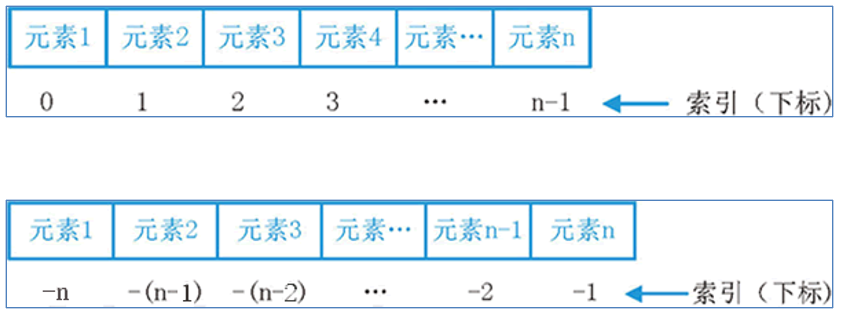

#### 序列的常用操作-切片

序列支持切片，即：列表、元组、字符串，均支持进行切片操作

- 切片：从一个序列中，取出一个子序列
- 语法：`序列[起始下标:结束下标:步长]`。表示从序列中，从指定位置开始，依次取出元素，到指定位置结束，得到一个新序列：
  - 起始下标表示从何处开始，可以留空，留空视作从头开始
  - 结束下标（不含）表示何处结束，可以留空，留空视作截取到结尾
  - 步长表示，依次取元素的间隔
    - 步长1表示，一个个取元素
    - 步长2表示，每次跳过1个元素取
    - 步长N表示，每次跳过N-1个元素取
    - 步长为负数表示，反向取（注意，起始下标和结束下标也要反向标记）

注意，此操作不会影响序列本身，而是会得到一个新的序列（列表、元组、字符串）

```python
# 序列的切片演示
my_list = [1, 2, 3, 4, 5]	# 切片操作：从列表中提取子列表
new_list = my_list[1:4]		# 下标1开始，下标4（不含）结束，步长1
print(new_list)				# 结果: [2, 3, 4]

my_tuple = (1, 2, 3, 4, 5)	# 切片操作：从元组中提取子元组
new_tuple = my_tuple[:]		# 从头开始，到最后结束，步长1
print(new_tuple)			# 结果：（1,2,3,4,5)

my_list = [1, 2, 3, 4, 5]	# 切片操作：从列表中提取子列表
new_list = my_list[:2]		# 从头开始，到最后结束，步长2
print(new_list)				# 结果：[1, 3, 5]

my_str = "12345"			# 切片操作：从字符串中提取子字符串
new_str = my_str[:4:2]		# 从头开始，到下标4（不含）结束，步长2
print(new_str)				# 结果："13″


my_str = "12345"
new_str = my_str[::-1]		# 从头（最后）开始，到尾结束，步长-1（倒序）
print(new_str)				# 结果："54321″

my_list = [1, 2, 3, 4, 5]
new_list = my_list[3:1:-1]	# 从下标3开始，到下标1（不含）结束，步长-1（倒序）
print(new_list)				# 结果：[4, 3]

my_tuple = (1, 2, 3, 4, 5)
new_tuple = my_tuple[:1:-2]	# 从头（最后）开始，到下标1（不含）结束，步长-2（倒序）
print(new_tuple)			# 结果：(5, 3)
# 可以看到，这个操作对列表、元组、字符串是通用的，同时非常灵活，根据需求，起始位置，结束位置，步长（正反序）都是可以自行控制的
```

### set(集合)

我们目前接触到了列表、元组、字符串三个数据容器了。基本满足大多数的使用场景。为何又需要学习新的集合类型呢？

通过特性来分析：

- 列表可修改、支持重复元素且有序
- 元组、字符串不可修改、支持重复元素且有序

同学们，有没有看出一些局限？局限就在于：它们都支持重复元素。如果场景需要对内容做去重处理，列表、元组、字符串就不方便了。而集合，最主要的特点就是：不支持元素的重复（自带去重功能）、并且内容无序。

#### 集合的定义

和列表、元组、字符串等定义基本相同：

- 列表使用：[]
- 元组使用：()
- 字符串使用：""
- 集合使用：{}

语法：

```python
# 定文集合字面量
{元素，元素，．．． .. 元素}

# 定义集合变量
变量名称 = {元素，元素，......，元素} 

# 定义空集合
变量名称 = set()
```

集合有如下特点：

- 可以容纳多个数据
- 可以容纳不同类型的数据（混装）
- 数据是无序存储的（不支持下标索引）
- 不允许重复数据存在
- 可以修改（增加或删除元素等）
- 支持for循环

例子：

```python
names = {"黑马程序员", "传智播客", "itcast", "itheima", "黑马程序员", "传智播客"}
print(names) # {'itheima', '黑马程序员', '传智播客', 'itcast'}
```

结果中可见：去重且无序。因为要对元素做去重处理，所以无法保证顺序和创建的时候一致。

#### 集合的常用操作

集合常用功能总结：

| **编号** | **操作**                       | **说明**                                                    |
| -------- | ------------------------------ | ----------------------------------------------------------- |
| 1        | 集合.add(元素)                 | 集合内添加一个元素                                          |
| 2        | 集合.remove(元素)              | 移除集合内指定的元素                                        |
| 3        | 集合.pop()                     | 从集合中随机取出一个元素                                    |
| 4        | 集合.clear()                   | 将集合清空                                                  |
| 5        | 集合1.difference(集合2)        | 得到一个新集合，内含2个集合的差集  原有的2个集合内容不变    |
| 6        | 集合1.difference_update(集合2) | 在集合1中，删除集合2中存在的元素  集合1被修改，集合2不变    |
| 7        | 集合1.union(集合2)             | 得到1个新集合，内含2个集合的全部元素  原有的2个集合内容不变 |
| 8        | len(集合)                      | 得到一个整数，记录了集合的元素数量                          |

##### 集合的常用操作-修改

首先，因为集合是无序的，所以集合不支持：下标索引访问。但是集合和列表一样，是允许修改的，所以我们来看看集合的修改方法。

添加新元素：

- 语法：集合.add(元素)。
- 功能：将指定元素，添加到集合内
- 结果：集合本身被修改，添加了新元素

```python
my_set = {"Hello", "World"}
my_set.add("itheima")
print(my_set)  # 结果: {'Hello', 'itheima', 'World'
```

移除元素：

- 语法：集合.remove(元素)
- 功能：将指定元素，从集合内移除
- 结果：集合本身被修改，移除了元素

```python
my_set = {"Hello", "world", "itheima"}
my_set.remove("Hello")
print(my_set)  # 结果: {'world', 'itheima'}
```

从集合中随机取出元素：

- 语法：集合.pop()
- 功能：从集合中随机取出一个元素
- 结果：会得到一个元素的结果。同时集合本身被修改，元素被移除

```python
my_set = {"Hello", "world", "itheima"}
element = my_set.pop()
print(my_set)	# 结果 {'world', 'itheima'}
print(element)	# 结果 'Hello'
```

清空集合：

- 语法：集合.clear()
- 功能：清空集合
- 结果：集合本身被清空

```python
my_set = {"Hello", "world", "itheima"}
my_set.clear()
print(my_set)	# 结果：set()	空集合
```

取出2个集合的差集：

- 语法：集合1.difference(集合2)
- 功能：取出集合1和集合2的差集（集合1有而集合2没有的）
- 结果：得到一个新集合，集合1和集合2不变

```python
set1 = {1, 2, 3}
set2 = {1, 5, 6}
set3 = set1.difference(set2)
print(set3)	# 结果：{2, 3}得到的新集合
print(set1)	# 结果：{1, 2, 3}不变
print(set2)	# 结果：{1, 5, 6}不变
```

消除2个集合的差集：

- 语法：集合1.difference_update(集合2)
- 功能：对比集合1和集合2，在集合1内，删除和集合2相同的元素。
- 结果：集合1被修改，集合2不变

```python
set1 = {1, 2, 3}
set2 = {1, 5, 6}
set1.difference_update(set2)
print(set1)	# 结果：{2, 3}
print(set2)	# 结果：{1, 5, 6}
```

2个集合合并：

- 语法：集合1.union(集合2)
- 功能：将集合1和集合2组合成新集合
- 结果：得到新集合，集合1和集合2不变

```python
set1 = {1, 2, 3}
set2 = {1, 5, 6}
set3 = set1.union(set2)
print(set3)	# 结果：{1, 2, 3, 5, 6}，新集合
print(set1)	# 结果：{1, 2, 3}，set1不变
print(set2)	# 结果：{1, 5, 6}，set2不变
```

##### 集合的常用操作-集合长度

查看集合的元素数量：

- 语法：len(集合)
- 功能：统计集合内有多少元素
- 结果：得到一个整数结果

```python
set1 = {1, 2, 3}
print(len(set1))
# 结果：3
```

##### 集合的常用操作-for循环遍历

集合同样支持使用for循环遍历。要注意：集合不支持下标索引，所以也就不支持使用while循环。

```python
set1 = {1, 2, 3}
for i in set1:
    print(i)
"""
1
2
3
"""
```

### dict(字典、映射)

Python中字典和生活中字典十分相像：

- 生活中的字典：【字】：【含义】。可以按【字】找出对应的【含义】
- Python中的字典：Key: Value。可以按【Key】找出对应的【Value】

为什么需要字典？因为可以使用字典，实现用key取出Value的操作。老师有一份名单，记录了学生的姓名和考试总成绩。现在需要将其通过Python录入至程序中，并可以通过学生姓名检索学生的成绩。使用字典最为合适：可以通过Key（学生姓名），取到对应的Value（考试成绩）

#### 字典的定义

字典的定义，同样使用{}，不过存储的元素是一个个的键值对，如下语法：

- 使用{}存储原始，每一个元素是一个键值对
- 每一个键值对包含Key和Value（用冒号分隔）
- 键值对之间使用逗号分隔
- Key和Value可以是任意类型的数据（key不可为字典）
- Key不可重复，重复会对原有数据覆盖

```python
# 定义字典字面量 
{key: value, key: value, ......, key: value}
# 定义字典变量 
my_dict = {key: value, key: value, ......, key: value}
# 定义空字典
my_dict = {}		# 空字典定义方式1
my_dict = dict()	# 空字典定义方式2

# 前文中提到的，记录学生成绩，可以使用如下定义：
stu_score = {"王力鸿": 99, "周杰轮": 88, "林俊节": 77}
```

字典有如下特点：

- 可以容纳多个数
- 可以容纳不同类型的数据
- 每一份数据是KeyValue键值对
- 可以通过Key获取到Value，Key不可重复（重复会覆盖）
- 不支持下标索引
- 可以修改（增加或删除更新元素等）
- 支持for循环，不支持while循环

#### 字典数据的获取

字典同集合一样，不可以使用下标索引。但是字典可以通过Key值来取得对应的Value

```python
# 语法：字典「key」可以取到对应的Value
stu_score = {"王力鸿": 99, "周杰轮": 88, "林俊节": 77}
print(stu_score["王力鸿"])	# 结果: 99
print(stu_score["周杰轮"])	# 结果: 88
print(stu_score["林俊节"])	# 结果: 77
```

#### 字典的嵌套

字典的Key和Value可以是任意数据类型（Key不可为字典），那么就表明，字典是可以嵌套的。需求如下：记录学生各科的考试信息

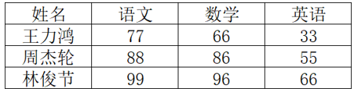

代码：

```python
stu_score = {
    "王力鸿": {"语文": 77, "数学": 66, "英语": 33},
    "周杰轮": {"语文": 88, "数学": 86, "英语": 55},
    "林俊节": {"语文": 99, "数学": 96, "英语": 66}
}
```

嵌套字典的内容获取：

```python
stu_score = {
    "王力鸿": {"语文": 77, "数学": 66, "英语": 33},
    "周杰轮": {"语文": 88, "数学": 86, "英语": 55},
    "林俊节": {"语文": 99, "数学": 96, "英语": 66}
}
print(stu_score["王力鸿"])				# 结果：{"语文": 77, "数学": 66, "英语": 33}
print(stu_score["王力鸿"]["语文"])	# 结果：77
print(stu_score["周杰轮"]["数学"])	# 结果：86
```

#### 字典的常用操作

字典的常用操作总结：

| **编号** | **操作**          | **说明**                                      |
| -------- | ----------------- | --------------------------------------------- |
| 1        | 字典[Key]         | 获取指定Key对应的Value值                      |
| 2        | 字典[Key] = Value | 添加或更新键值对                              |
| 3        | 字典.pop(Key)     | 取出Key对应的Value并在字典内删除此Key的键值对 |
| 4        | 字典.clear()      | 清空字典                                      |
| 5        | 字典.keys()       | 获取字典的全部Key，可用于for循环遍历字典      |
| 6        | len(字典)         | 计算字典内的元素数量                          |

新增元素：

- 语法：字典[Key] = Value
- 结果：字典被修改，新增了元素

```python
stu_score = {
    "王力鸿": 77,
    "周杰轮": 88,
    "林俊节": 99
}

# 新增：张学油的考试成绩
stu_score["张学油"] = 66
print(stu_score)	# 结果：{'王力鸿': 77, '周杰轮': 88, '林俊节': 99, '张学油': 66}
```

更新元素：

- 语法：字典[Key] = Value
- 结果：字典被修改，元素被更新
- 注意：字典Key不可以重复，所以对已存在的Key执行上述操作，就是更新Value值

```python
stu_score = {
    "王力鸿": 77,
    "周杰轮": 88,
    "林俊节": 99
}
# 更新：王力鸿的考试成绩
stu_score["王力鸿"] = 100
print(stu_score)		# 结果：{'王力鸿': 100, '周杰轮': 88, '林俊节': 99}
```

删除元素：

- 语法：字典.pop(Key)
- 结果：获得指定Key的Value，同时字典被修改，指定Key的数据被删除

```python
stu_score = {
    "王力鸿": 77,
    "周杰轮": 88,
    "林俊节": 99
}
value = stu_score.pop("王力鸿")
print(value)		# 结果：77
print(stu_score)	# 结果：{"周杰轮": 88, "林俊节": 99}
```

清空字典：

- 语法：字典.clear()
- 结果：字典被修改，元素被清空

```python
stu_score = {
    "王力鸿": 77,
    "周杰轮": 88,
    "林俊节": 99
}
stu_score.clear()
print(stu_score)	# 结果：{}
```

获取全部的key：

- 语法：字典.keys()
- 结果：得到字典中的全部Key

```python
stu_score = {
    "王力鸿": 77,
    "周杰轮": 88,
    "林俊节": 99
}
keys = stu_score.keys()
print(keys)		# 结果：dict_keys(['王力鸿', '周杰轮', '林俊节'])
```

遍历字典：

- 语法：for key in 字典.keys()
- 注意：字典不支持下标索引，所以同样不可以用while循环遍历

```python
stu_score = {
    "王力鸿": 77,
    "周杰轮": 88,
    "林俊节": 99
}
keys = stu_score.keys()
for key in keys:
    print(f"学生:{key}，分数:{stu_score[key]}")
```

计算字典内的全部元素（键值对）数量：

- 语法：len(字典)
- 结果：得到一个整数，表示字典内元素（键值对）的数量

```python
stu_score = {
    "王力鸿": 77,
    "周杰轮": 88,
    "林俊节": 99
}
print(len(stu_score))		# 结果：3
```

### 其他

#### 数据容器分类

数据容器可以从以下视角进行简单的分类：

- 是否支持下标索引：
  - 支持：列表、元组、字符串 - 序列类型
  - 不支持：集合、字典 - 非序列类型
- 是否支持重复元素：
  - 支持：列表、元组、字符串 - 序列类型
  - 不支持：集合、字典 - 非序列类型
- 是否可以修改：
  - 支持：列表、集合、字典
  - 不支持：元组、字符串

#### 数据容器特点对比

|          | **列表**                         | **元组**                           | **字符串**         | **集合**               | **字典**                                           |
| -------- | -------------------------------- | ---------------------------------- | ------------------ | ---------------------- | -------------------------------------------------- |
| 元素数量 | 支持多个                         | 支持多个                           | 支持多个           | 支持多个               | 支持多个                                           |
| 元素类型 | 任意                             | 任意                               | 仅字符             | 任意                   | Key：Value  Key：除字典外任意类型  Value：任意类型 |
| 下标索引 | 支持                             | 支持                               | 支持               | 不支持                 | 不支持                                             |
| 重复元素 | 支持                             | 支持                               | 支持               | 不支持                 | 不支持                                             |
| 可修改性 | 支持                             | 不支持                             | 不支持             | 支持                   | 支持                                               |
| 数据有序 | 是                               | 是                                 | 是                 | 否                     | 否                                                 |
| 使用场景 | 可修改、可重复的一批数据记录场景 | 不可修改、可重复的一批数据记录场景 | 一串字符的记录场景 | 不可重复的数据记录场景 | 以Key检索Value的数据记录场景                       |

#### 数据容器的通用操作

| **功能**                     | **描述**                                         |
| ---------------------------- | ------------------------------------------------ |
| 通用for循环                  | 遍历容器（字典是遍历key）                        |
| max                          | 容器内最大元素                                   |
| min()                        | 容器内最小元素                                   |
| len()                        | 容器元素个数                                     |
| list()                       | 转换为列表                                       |
| tuple()                      | 转换为元组                                       |
| str()                        | 转换为字符串                                     |
| set()                        | 转换为集合                                       |
| sorted(序列, [reverse=True]) | 排序，reverse=True表示降序  得到一个排好序的列表 |

##### 数据容器的通用操作遍历

数据容器尽管各自有各自的特点，但是它们也有通用的一些操作。

首先，在遍历上：

- 5类数据容器都支持for循环遍历
- 列表、元组、字符串支持while循环，集合、字典不支持（无法下标索引）

尽管遍历的形式各有不同，但是，它们都支持遍历操作。

##### 数据容器的通用统计功能

除了遍历这个共性外，数据容器可以通用非常多的功能方法

- len(容器)：统计容器的元素个数

  ```python
  my_list = [1, 2, 3]
  my_tuple = (1, 2, 3, 4, 5)
  my_str = "itiheima"
  
  print(len(my_list))	# 结果3
  print(len(my_tuple))	# 结果5
  print(len(my_str))	# 结果7
  ```

- max(容器)：统计容器的最大元素

  ```python
  my_list = [1, 2, 3]
  my_tuple = (1, 2, 3, 4, 5)
  my_str = "itiheima"
  
  print(max(my_list))	# 结果3
  print(max(my_tuple))	# 结果5
  print(max(my_str))	# 结果t
  ```

- min(容器)：统计容器的最小元素

  ```python
  my_list = [1, 2, 3]
  my_tuple = (1, 2, 3, 4, 5)
  my_str = "itiheima"
  
  print(min(my_list))	# 结果1
  print(min(my_tuple))	# 结果1
  print(min(my_str))	# 结果a
  ```

##### 容器的通用转换功能

除了下标索引这个共性外，还可以通用类型转换：

- list(容器)：将给定容器转换为列表
- tuple(容器)：将给定容器转换为元组
- str(容器)：将给定容器转换为字符串
- set(容器)：将给定容器转换为集合

##### 容器通用排序功能

sorted(容器, [reverse=True])：将给定容器进行排序。注意，排序后都会得到列表（list）对象。

## 文件操作

### 文件编码

思考：计算机只能识别：0和1，那么我们丰富的文本文件是如何被计算机识别，并存储在硬盘中呢？

答案：使用编码技术（密码本）将内容翻译成0和1存入。

编码技术即翻译的规则，记录了如何将内容翻译成二进制，以及如何将二进制翻译回可识别内容。计算机中有许多可用编码：

- UTF-8
- GBK
- Big5，等

不同的编码，将内容翻译成二进制也是不同的。编码有许多，所以要使用正确的编码， 才能对文件进行正确的读写操作。

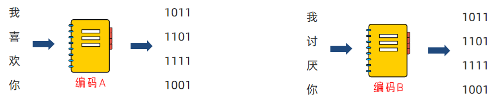

如上，如果你给喜欢的女孩发送文件，使用编码A进行编码（内容转二进制）。女孩使用编码B打开文件进行解码（二进制反转回内容）。

#### 查看文件编码

我们可以使用Windows系统自带的记事本，打开文件后，即可看出文件的编码是什么：

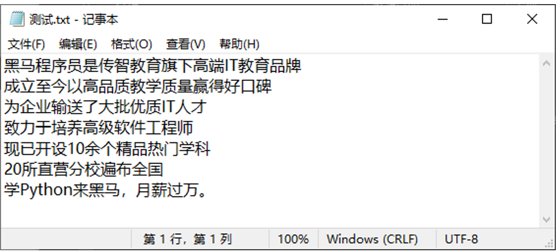

UTF-8是目前全球通用的编码格式，除非有特殊需求，否则一律以UTF-8格式进行文件编码即可。

### 文件的读取

内存中存放的数据在计算机关机后就会消失。要长久保存数据，就要使用硬盘、光盘、U 盘等设备。为了便于数据的管理和检索，引入了“文件”的概念。一篇文章、一段视频、一个可执行程序，都可以被保存为一个文件，并赋予一个文件名。操作系统以文件为单位管理磁盘中的数据。一般来说，文件可分为文本文件、视频文件、音频文件、图像文件、可执行文件等多种类别。

在日常生活中，文件操作主要包括打开、关闭、读、写等操作。想想我们平常对文件的基本操作，大概可以分为三个步骤（简称文件操作三步走）：

1. 打开文件
2. 读写文件
3. 关闭文件

> 注意：可以只打开和关闭文件，不进行任何读写

#### open()打开函数

在Python，使用open函数，可以打开一个已经存在的文件，或者创建一个新文件，语法如下：`open(name, mode, encoding)`。

- name：是要打开的目标文件名的字符串(可以包含文件所在的具体路径)。
- mode：设置打开文件的模式(访问模式)：只读、写入、追加等。
- encoding：编码格式（推荐使用UTF-8）

示例代码：

```python
f = open('python.txt', 'r', encoding=”UTF-8)
# encoding的顺序不是第三位，所以不能用位置参数，用关键字参数直接指定
# 注意：此时的`f`是`open`函数的文件对象，对象是Python中一种特殊的数据类型，拥有属性和方法，可以使用对象.属性或对象.方法对其进行访问，后续面向对象课程会给大家进行详细的介绍。
```

##### mode常用三种基础访问模式

| **模式** | **描述**                                                     |
| -------- | ------------------------------------------------------------ |
| r        | 以只读方式打开文件。文件的指针将会放在文件的开头。这是默认模式。 |
| w        | 打开一个文件只用于写入。如果该文件已存在则打开文件，并从开头开始编辑，原有内容会被删除。如果该文件不存在，创建新文件。 |
| a        | 打开一个文件用于追加。如果该文件已存在，新的内容将会被写入到已有内容之后。如果该文件不存在，创建新文件进行写入。 |

##### 读操作相关方法

| 操作                                  | 功能                                    |
| ------------------------------------- | --------------------------------------- |
| 文件对象 = open(file, mode, encoding) | 打开文件获得文件对象                    |
| 文件对象.read(num)                    | 读取指定长度字节  不指定num读取文件全部 |
| 文件对象.readline()                   | 读取一行                                |
| 文件对象.readlines()                  | 读取全部行，得到列表                    |
| for line in 文件对象                  | for循环文件行，一次循环得到一行数据     |
| 文件对象.close()                      | 关闭文件对象                            |
| with open() as f                      | 通过with open语法打开文件，可以自动关闭 |

- read()方法：`文件对象.read(num)`，num表示要从文件中读取的数据的长度（单位是字节），如果没有传入num，那么就表示读取文件中所有的数据。

- readlines()方法：readlines可以按照行的方式把整个文件中的内容进行一次性读取，并且返回的是一个列表，其中每一行的数据为一个元素。

  ```python
  f = open('python.txt')
  content = f.readlines()
  
  # ['hello world\n', 'abcdefg\n', 'aaa\n', 'bbb\n', 'ccc']
  print(content)
  
  # 关闭文件
  f.close()
  ```

- readline()方法：一次读取一行内容

  ```python
  f = open('python.txt')
  
  content = f.readline()
  print(f'第一行：{content}')
  
  content = f.readline()
  print(f'第二行：{content}')
  
  # 关闭文件
  f.close()
  ```

- for循环读取文件行

  ```python
  for line in open("python.txt", "r"):
      print(line)
  
  # 每一个line临时变量，就记录了文件的一行数据
  ```

- close() 关闭文件对象

  ```python
  f = open("python.txt", "r")
  
  f.close()
  
  # 最后通过close，关闭文件对象，也就是关闭对文件的占用
  # 如果不调用close,同时程序没有停止运行，那么这个文件将一直被Python程序占用。
  ```

- with open 语法

  ```python
  with open("python.txt", "r") as f:
      f.readlines()
  
  # 通过在with open的语句块中对文件进行操作
  # 可以在操作完成后自动关闭close文件，避免遗忘掉close方法
  ```

### 文件的写入

案例演示：

```python
# 1. 打开文件
f = open('python.txt', 'w')

# 2.文件写入
f.write('hello world')

# 3. 内容刷新
f.flush()
```

注意：

- 直接调用write，内容并未真正写入文件，而是会积攒在程序的内存中，称之为缓冲区
- 当调用flush的时候，内容会真正写入文件
- 这样做是避免频繁的操作硬盘，导致效率下降（攒一堆，一次性写磁盘）
- 文件如果不存在，使用”w”模式，会创建新文件
- 文件如果存在，使用”w”模式，会将原有内容清空

### 文件的追加

案例演示：

```python
# 1. 打开文件，通过a模式打开即可
f = open('python.txt', 'a')

# 2.文件写入
f.write('hello world')

# 3. 内容刷新
f.flush()
```

注意：

- a模式，文件不存在会创建文件
- a模式，文件存在会在最后，追加写入文件

## 异常

异常演示：例如：以`r`方式打开一个不存在的文件：`f = open('linux.txt', 'r')`。执行结果：

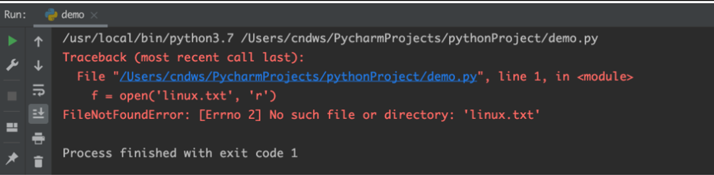

### 异常的捕获方法

世界上没有完美的程序，任何程序在运行的过程中，都有可能出现：异常，也就是出现bug，导致程序无法完美运行下去。我们要做的，不是力求程序完美运行。而是在力所能及的范围内，对可能出现的bug，进行提前准备、提前处理。这种行为我们称之为：异常处理（捕获异常）。

当我们的程序遇到了BUG, 那么接下来有两种情况：

1. 整个程序因为一个BUG停止运行
2. 对BUG进行提醒, 整个程序继续运行

显然在之前的学习中, 我们所有的程序遇到BUG就会出现①的这种情况, 也就是整个程序直接奔溃。但是在真实工作中, 我们肯定不能因为一个小的BUG就让整个程序全部奔溃, 也就是我们希望的是达到②的这种情况，那这里我们就需要使用到捕获异常。

捕获异常的作用在于：提前假设某处会出现异常，做好提前准备，当真的出现异常的时候，可以有后续手段。

#### 捕获常规异常

基本语法：

```python
try:
    可能发生错误的代码
except:
    如果出现异常执行的代码
```

需求：尝试以`r`模式打开文件，如果文件不存在，则以`w`方式打开。

```python
try:
    f = open('linux.txt', 'r')
except:
    f = open('linux.txt', 'w')
```

#### 捕获指定异常

基本语法：

```python
try:
    print(name)
except NameError as e:
    print('name变量名称未定义错误')
```

注意事项： 

- 如果尝试执行的代码的异常类型和要捕获的异常类型不一致，则无法捕获异常。
- 一般try下方只放一行尝试执行的代码。

#### 捕获多个异常

当捕获多个异常时，可以把要捕获的异常类型的名字，放到except 后，并使用元组的方式进行书写。

```python
try:
    print(1/0)
except (NameError, ZeroDivisionError):
    print('ZeroDivision错误...')
```

执行结果：

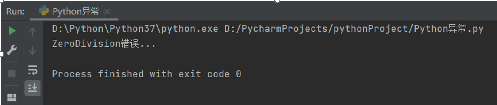

#### 捕获异常并输出描述信息

基本语法：

```python
try:
    print(num)
except (NameError, ZeroDivisionError) as e:
    print(e)
```

执行结果：

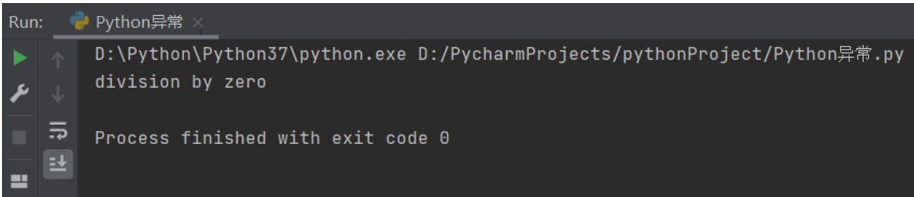

#### 捕获所有异常

基本语法：

```python
try:
    print(name)
except Exception as e:
    print(e)
```

执行结果：

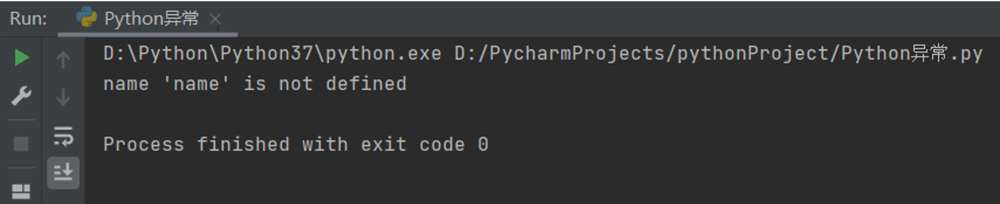

#### 异常else

else表示的是如果没有异常要执行的代码。

```python
try:
    print(1)
except Exception as e:
    print(e)
else:
    print('我是else，是没有异常的时候执行的代码')
```

执行结果：

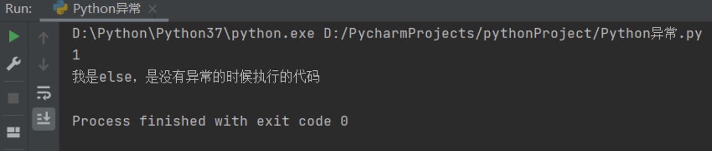

#### 异常的finally

finally表示的是无论是否异常都要执行的代码，例如关闭文件。

```python
try:
    f = open('test.txt', 'r')
except Exception as e:
    f = open('test.txt', 'w')
else:
    print('没有异常，真开心')
finally:
    f.close()
```

### 异常的传递

异常是具有传递性的，如图。当函数func01中发生异常, 并且没有捕获处理这个异常的时候, 异常会传递到函数func02, 当func02也没有捕获处理这个异常的时候，main函数会捕获这个异常, 这就是异常的传递性.

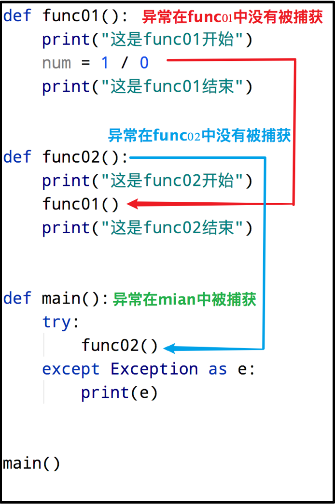

提示：当所有函数都没有捕获异常h的时候, 程序就会报错

利用异常具有传递性的特点, 当我们想要保证程序不会因为异常崩溃的时候，就可以在main函数中设置异常捕获, 由于无论在整个程序哪里发生异常, 最终都会传递到main函数中, 这样就可以确保所有的异常都会被捕获。

## Python模块

Python 模块(Module)，是一个 Python 文件，以 .py 结尾。模块能定义函数，类和变量，模块里也能包含可执行的代码.

模块的作用：python中有很多各种不同的模块, 每一个模块都可以帮助我们快速的实现一些功能, 比如实现和时间相关的功能就可以使用time模块。我们可以认为一个模块就是一个工具包, 每一个工具包中都有各种不同的，工具供我们使用进而实现各种不同的功能。

大白话：模块就是一个Python文件，里面有类、函数、变量等，我们可以拿过来用（导入模块去使用）。

### 模块的导入方式

模块在使用前需要先导入，导入的语法如下：`[from 模块名] import [模块 | 类 | 变量 | 函数 | *] [as 别名]`

常用的组合形式如：

- import 模块名
- from 模块名 import 类、变量、方法等
- from 模块名 import *
- import 模块名 as 别名
- from 模块名 import 功能名 as 别名

#### import模块名

基本语法：

```python
import 模块名
import 模块名1，模块名2

模块名.功能名()
```

案例：导入time模块

```python
# 导入时间模块
import time

print("开始")
# 让程序睡眠1秒(阻塞)
time.sleep(1)
print("结束")
```

#### from 模块名 import 功能名

基本语法：

```python
from 模块名 import 功能名

功能名()
```

案例：导入time模块中的sleep方法

```python
# 导入时间模块中的sleep方法
from time import sleep

print("开始")
# 让程序睡眠1秒(阻塞)
sleep(1)
print("结束")
```

#### from 模块名 import *

基本语法：

```python
from 模块名 import *

功能名()
```

案例：导入time模块中所有的方法

```python
# 导入时间模块中所有的方法
from time import *

print("开始")
# 让程序睡眠1秒(阻塞)
sleep(1)
print("结束")
```

#### as定义别名

基本语法：

```python
# 模块定义别名
import 模块名 as 别名

# 功能定义别名
from 模块名 import 功能 as 别名
```

案例：

```python
# 模块别名
import time as tt

tt.sleep(2)
print('hello')


# 功能别名
from time import sleep as sl

sl(2)
print('hello')
```

### 制作自定义模块

Python中已经帮我们实现了很多的模块. 不过有时候我们需要一些个性化的模块, 这里就可以通过自定义模块实现, 也就是自己制作一个模块

案例：新建一个Python文件，命名为my_module1.py，并定义test函数

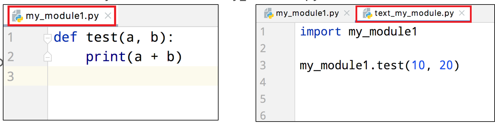

注意：每个Python文件都可以作为一个模块，模块的名字就是文件的名字. 也就是说自定义模块名必须要符合标识符命名规则

#### 测试模块

在实际开发中，当一个开发人员编写完一个模块后，为了让模块能够在项目中达到想要的效果，这个开发人员会自行在py文件中添加一些测试信息，例如，在my_module1.py文件中添加测试代码test(1,1)

```python
def test(a, b):
    print(a + b)

test(1, 1)
```

问题：此时，无论是当前文件，还是其他已经导入了该模块的文件，在运行的时候都会自动执行`test`函数的调用

解决方案：

```python
def test(a, b):
    print(a + b)

# 只在当前文件中调用该函数，其他导入的文件内不符合该条件，则不执行test函数调用
if __name__ == '__main__':
    test (1, 1)
```

注意事项：当导入多个模块的时候，且模块内有同名功能，当调用这个同名功能的时候，调用到的是后面导入的模块的功能

```python
# 模块1代码
# my_module1.py
def my_test(a, b):
    print(a + b)

# 模块2代码
# my_module2.py
def my_test(a, b):
    print(a - b)

# 导入模块和调用功能代码
from my_module1 import my_test # my_test1
from my_module2 import my_test # my_test2

# my_test函数是模块2中的函数
my_test(1, 1)
```

#### \__all__

如果一个模块文件中有`__all__`变量，当使用`from xxx import *`导入时，只能导入这个列表中的元素

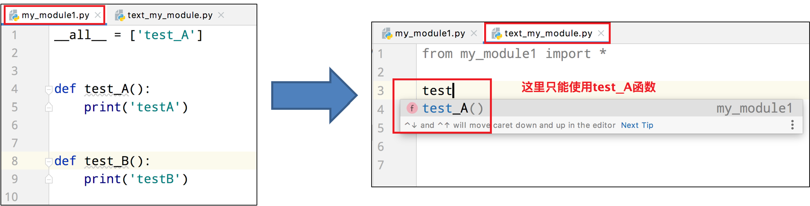

## Python包

从物理上看，包就是一个文件夹，在该文件夹下包含了一个 \__init__.py 文件，该文件夹可用于包含多个模块文件；从逻辑上看，包的本质依然是模块。

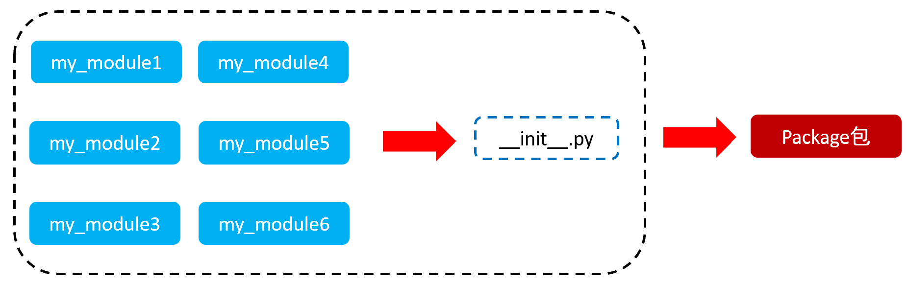

包的作用：当我们的模块文件越来越多时,包可以帮助我们管理这些模块, 包的作用就是包含多个模块，但包的本质依然是模块。

步骤如下：

1. 新建包`my_package`
2. 新建包内模块：`my_module1` 和 `my_module2`
3. 模块内代码如下

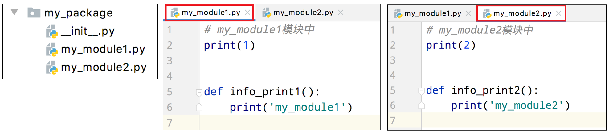

Pycharm中的基本步骤：[New]  ->  [Python Package]  ->  输入包名  -> [OK]  -> 新建功能模块(有联系的模块)

注意：新建包后，包内部会自动创建`__init__.py`文件，这个文件控制着包的导入行为

### 导入包

方式一：

```python
import 包名.模块名

包名.模块名.目标
```

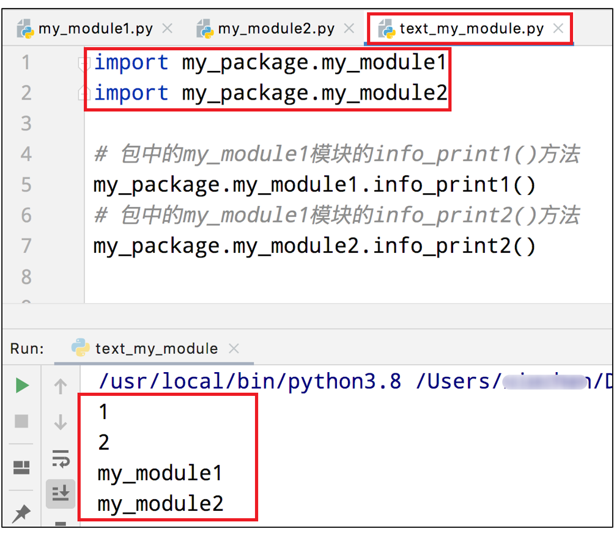

方式二：

```python
from 包名 import *

模块名.目标
```

注意：必须在`__init__.py`文件中添加`__all__ = []`，控制允许导入的模块列表

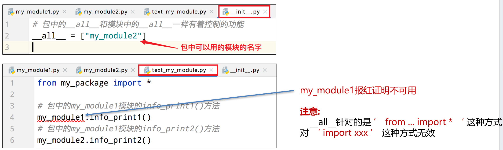

### 第三方包

我们知道，包可以包含一堆的Python模块，而每个模块又内含许多的功能。所以，我们可以认为：一个包，就是一堆同类型功能的集合体。在Python程序的生态中，有许多非常多的第三方包（非Python官方），可以极大的帮助我们提高开发效率，如：

- 科学计算中常用的：numpy包
- 数据分析中常用的：pandas包
- 大数据计算中常用的：pyspark、apache-flink包
- 图形可视化常用的：matplotlib、pyecharts
- 人工智能常用的：tensorflow
- 等

这些第三方的包，极大的丰富了Python的生态，提高了开发效率。但是由于是第三方，所以Python没有内置，所以我们需要安装它们才可以导入使用哦。

#### 安装第三方包 - pip

第三方包的安装非常简单，我们只需要使用Python内置的pip程序即可。打开我们许久未见的：命令提示符程序，在里面输入：`pip install 包名称`，即可通过网络快速安装第三方包。

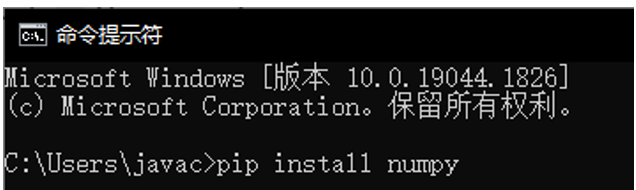

**pip的网络优化**

由于pip是连接的国外的网站进行包的下载，所以有的时候会速度很慢。我们可以通过如下命令，让其连接国内的网站进行包的安装：`pip install -i https://pypi.tuna.tsinghua.edu.cn/simple 包名称`

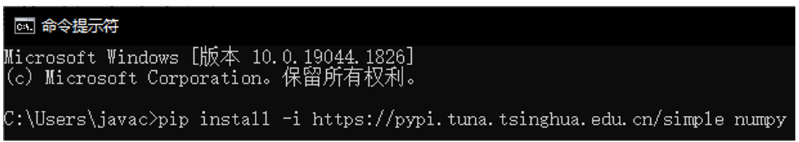

> https://pypi.tuna.tsinghua.edu.cn/simple 是清华大学提供的一个网站，可供pip程序下载第三方包

#### 安装第三方包 - PyCharm

PyCharm也提供了安装第三方包的功能：

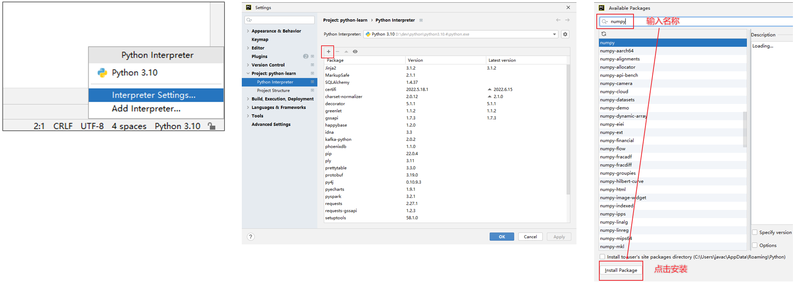

## 面向对象

### 初识对象

学校开学，要求学生填写自己的基础信息，一人发一张白纸，让学生自己填，内容混乱。改为登记表，打印出来让学生自行填写，整洁明了。而在程序中简单使用变量来记录学生信息也是如此，混乱、不统一。

在程序中是可以做到和生活中那样，设计表格、生产表格、填写表格的组织形式的。

1. 在程序中设计表格，我们称之为：设计类（class）

   ```python
   class Student:
       name = None	# 记录学生姓名
   ```

2. 在程序中打印生产表格，我们称之为：创建对象

   ```python
   # 基于类创建对象
   stu_1 = Student()
   stu_2 = Student()
   ```

3. 在程序中填写表格，我们称之为：对象属性赋值

   ```python
   stu_1.name = "周杰轮"	# 为学生1对象赋予名称属性值
   stu_2.name = "林军杰"	# 为学生2对象赋予名称属性值
   ```

### 成员变量与方法

现在我们来看看类的使用语法：

```python
class 类的名称:	# class是关键字，表示要定义类了
    类的属性	# 类的属性，即定义在类中的变量（成员变量）
	类的行为	# 类的行为，即定义在类中的函数（成员方法）
```

创建类对象的语法：`对象 = 类名称()`

```python
class Student:
    name = None	# 学生的姓名
    age = None	# 学生的年龄

    def say_hi(self):
        print(f"Hi大家好，我是{self.name}")

stu = Student()
stu.name = "周杰轮"
stu.say_hi()	# 输出：Hi大家好，我是周杰轮
```

可以看出，类中：不仅可以定义属性用来记录数据，也可以定义函数，用来记录行为

其中：

- 类中定义的属性（变量），我们称之为：成员变量
- 类中定义的行为（函数），我们称之为：成员方法

> 从今天开始，定义在类内部的函数，称之为方法哦

在类中定义成员方法和定义函数基本一致，但仍有细微区别：

```python
def 方法名(self, 形参1, 形参2, ..., 形参N):
    方法体
```

可以看到，在方法定义的参数列表中，有一个：self关键字。self关键字是成员方法定义的时候，必须填写的。

- 它用来表示类对象自身的意思
- 当我们使用类对象调用方法的是，self会自动被python传入
- 在方法内部，想要访问类的成员变量，必须使用self

```python
def say_hi(self):
    print(f"Hi大家好，我是{self.name}")
```

> 注意事项：self关键字，尽管在参数列表中，但是传参的时候可以忽略它。如：
>
> 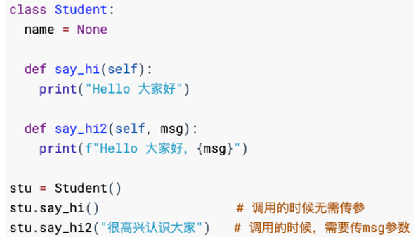
>
> 可以看到，在传入参数的时候，self是透明的，可以不用理会它。

### 类和对象

现实世界的事物也有属性和行为，类也有属性和行为。使用程序中的类，可以完美的描述现实世界的事物

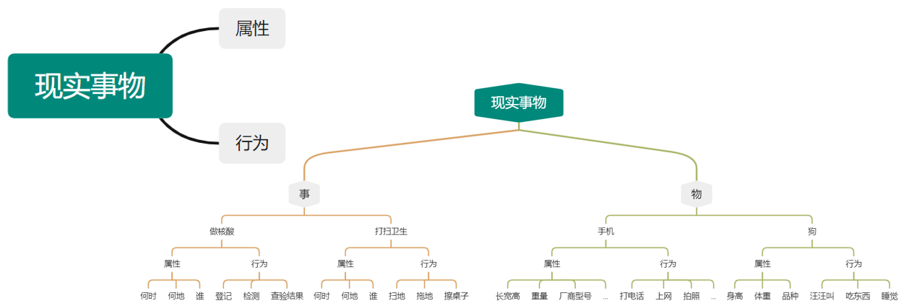

为什么非要创建对象才能使用呢？类只是一种程序内的“设计图纸”，需要基于图纸生产实体（对象），才能正常工作。这种套路，称之为：面向对象编程。

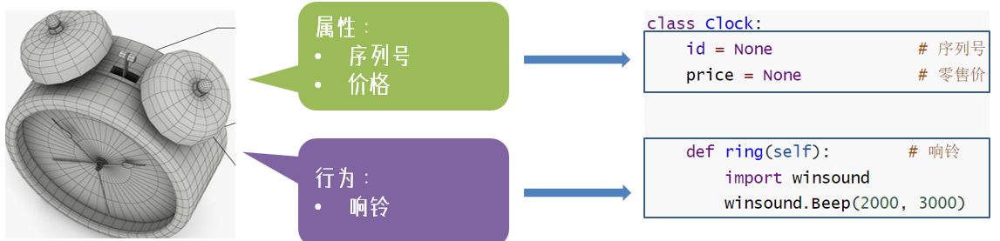

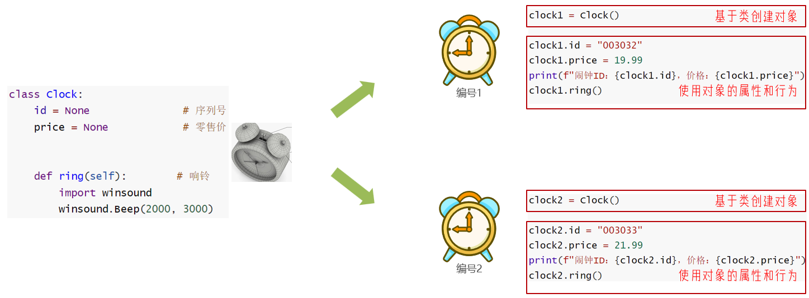

### 构造方法

```python
class student:
    name = None	# 姓名
    age = None	# 年龄
    tel = None	# 手机号

student1 = student()
student1.name = "周杰轮"
student1.age = 31
student1.tel = "18012340000"

student2 = student()
student2.name = "周杰轮"
student2.age = 31
student2.tel = "18012340000"
```

代码中，为对象的属性赋值需要依次进行，略显繁琐。有没有更加高效的方式，能够一行代码就完成呢？

思考：`student()`，这个括号，能否像函数（方法）那样，通过传参的形式对属性赋值呢？可以，需要使用构造方法：\__init__()

Python类可以使用：\__init__()方法，称之为构造方法。可以实现：

- 在创建类对象（构造类）的时候，会自动执行。
- 在创建类对象（构造类）的时候，将传入参数自动传递给\__init__方法使用。

```python
class Student:
	name = None
	age = None
	tel = None

# 构建类时传入的参数会自动提供给__init__方法，构建类的时候__init__方法会自动执行
def __init__(self, name, age, tel):
    self.name = name
    self.age = age
    self.tel = tel
    print("student类创建了一个对象")
    
stu = Student("周杰轮", 31, "18500006666")
```

注意事项：

- 重要的事情说三遍，构造方法名称：\_\_init\_\_  \_\_init\_\_  \_\_init_\_ ， 千万不要忘记init前后都有2个下划线
- 构造方法也是成员方法，不要忘记在参数列表中提供：self
- 在构造方法内定义成员变量，需要使用self关键字。这是因为变量是定义在构造方法内部，如果要成为成员变量，需要用self来表示。

### 其它内置方法

#### 魔术方法

上文学习的\__init__ 构造方法，是Python类内置的方法之一。这些内置的类方法，各自有各自特殊的功能，这些内置方法我们称之为：魔术方法。魔术方法非常多，我们学习几个常见的即可。

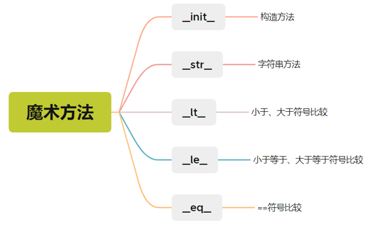

#### \__str__ 字符串方法

```python
class Student:  
    def __init__(self, name, age):  
        self.name = name
        self.age = age

student = Student("周杰轮", 11)  
print(student)  		# 结果：<__main__.Student object at 0x000002200cFD7040>
print(str(student))  	# 结果：<__main__.Student object at 0x000002200cFD7040>
```

当类对象需要被转换为字符串之时，会输出如上结果（内存地址）,内存地址没有多大作用，我们可以通过、\__str__方法，控制类转换为字符串的行为。

- 方法名：\__str__
- 返回值：字符串
- 内容：自行定义

```python
class Student:
    def __init__(self, name, age):
        self.name = name
        self.age = age

    def __str__(self):
        return f"student类对象，name={self.name}，age={self.age}"

student = Student("周杰轮", 11)
print(student)		# 结果：student类对象，name=周杰轮，age=11
print(str(student)) # 结果：student类对象，name=周杰轮，age=11
```

#### \__lt__ 小于符号比较方法

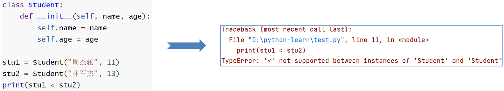

直接对2个对象进行比较是不可以的，但是在类中实现\__lt__方法，即可同时完成：小于符号和大于符号2种比较。

- 方法名：\__lt__
- 传入参数：other，另一个类对象
- 返回值：True 或 False
- 内容：自行定义

```python
class student:
	def init(self, name, age):
		self.name = name
		self.age = age

	def __lt__(self, other):
    	return self.age < other.age
    
stu1 = student("周杰轮", 11)
stu2 = student("林军杰", 13)
print(stu1 < stu2) # 结果：True
print(stu1 > stu2) # 结果：False
```

比较大于符号的魔术方法是：\_\_gt\_\_。不过实现了\_\_lt\_\_，\_\_gt\_\_就没必要实现了

#### \__le__ 小于等于比较符号方法

\__le__可用于：<=、>=两种比较运算符上。

- 方法名：\__le__
- 传入参数：other，另一个类对象
- 返回值：True 或 False
- 内容：自行定义

```python
class Student:
    def __init__(self, name, age):
        self.name = name
        self.age = age

    def __le__(self, other):
        return self.age <= other.age

stu1 = Student("周杰轮", 11)
stu2 = Student("林军杰", 13)
print(stu1 <= stu2)  # 结果：True
print(stu1 >= stu2)  # 结果：False
```

\>=符号实现的魔术方法是：\_\_ge\_\_不过实现了\_\_le\_\_，\_\_ge\_\_就没必要实现了

#### \__eq__，比较运算符实现方法

- 方法名：\__eq__
- 传入参数：other，另一个类对象
- 返回值：True 或 False
- 内容：自行定义

不实现\_\_eq\_\_方法，对象之间可以比较，但是是比较内存地址，也即是：不同对象==比较一定是False结果。实现了\__eq__方法，就可以按照自己的想法来决定2个对象是否相等了。

```python
class student:
    def __init__(self, name, age):
        self.name = name
        self.age = age

    def __eq__(self, other):
        return self.age == other.age

stul = student("周杰轮", 11)
stu2 = student("林军杰", 11)
print(stul == stu2)  # 结果： True
```

### 面向对象3大主要特性

面向对象编程，是许多编程语言都支持的一种编程思想。简单理解是：基于模板（类）去创建实体（对象），使用对象完成功能开发。面向对象包含3大主要特性：

- 封装
- 继承
- 多态

#### 封装

封装表示的是，将现实世界事物的：属性、行为。封装到类中，描述为：成员变量、成员方法。从而完成程序对现实世界事物的描述。

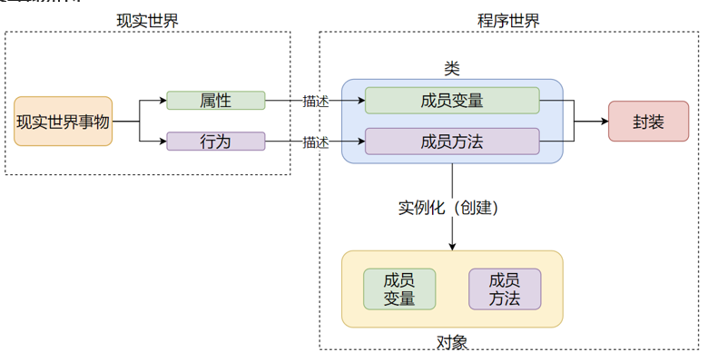

现实世界中的事物，有属性和行为。但是不代表这些属性和行为都是开放给用户使用的。苹果越狱、安卓root，也是为了突破权限使用这些对用户隐藏的属性和行为。

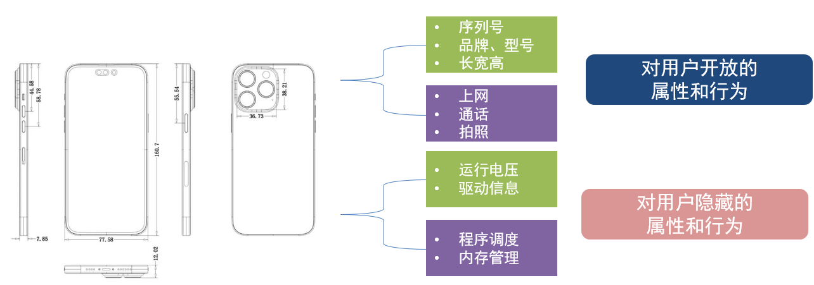

##### 私有成员

既然现实事物有不公开的属性和行为，那么作为现实事物在程序中映射的类，也应该支持。类中提供了私有成员的形式来支持。定义私有成员的方式非常简单，只需要下面即可完成私有成员的设置：

- 私有成员变量：变量名以\__开头
- 私有成员方法：方法名以__开头

```python
class Phone:
    IMEI = None					# 序列号
    producer = None				# 厂商
    
    __current_voltage = None	# 当前电压 私有成员变量

    def call_by_5g(self):
        print("5g通话已开启")

    def __keep_single_core(self):
        print("让cpu以单核模式运行以节省电量")
```

私有方法无法直接被类对象使用

```python
class Phone:
    IMEI = None					# 序列号 
    producer = None				# 厂商
    
    __current_voltage = None	# 当前电压	

    def call_by_5g(self):
        print("5g通话已开启")

    def __keep_single_core(self):
        print("让CPU以单核模式运行以节省电量")

phone = Phone()						# 创建对象 
phone.__Phone__keep_single_core()	# 使用私有方法

# 程序直接报错
```

私有变量无法赋值，也无法获取值。

```python
class Phone:
    IMEI = None					# 序列号 
    producer = None				# 厂商
    
    __current_voltage = None		# 当前电压	

    def call_by_5g(self):
        print("5g通话已开启")

    def __keep_single_core(self):
        print("让CPU以单核模式运行以节省电量")

phone = Phone()					# 创建对象  
phone.__current_voltage = 33	# 私有变量赋值，不报错，但无效
print(phone.__current_voltage)	# 获取私有变量值，报错，无法使用	
```

私有成员无法被类对象使用，但是可以被其它的成员使用。

```python
class Phone:
    IMEI = None				# 序列号 
    producer = None			# 厂商	
    
    __current_voltage = None	# 当前电压

    def call_by_5g(self):
        if self.__current_voltage >= 1:	# 在成员方法内可以访问其它私有成员
            self.__keep_single_core()
            print("5G通话已开启")
        else:
            print("通话失败，电量不足")

    def __keep_single_core(self):
        print("让CPU以单核模式运行以节省电量")
```

#### 继承

继承分为：单继承和多继承。继承表示：将从父类那里继承（复制）来成员变量和成员方法（不含私有）

##### 单继承

使用语法：

```python
class 类名 (父类名):
	类内容体
```

例子：
```python
class Phone:
    IMEI = None			# 序列号 
    producer = None		# 厂商

    def call_by_4g(self):
        print("4g通话")

class Phone2022(Phone):
    face_id = True		# 面部识别

    def call_by_5g(self):
        print("2022最新5g通话")
```

##### 多继承

Python的类之间也支持多继承，即一个类，可以继承多个父类。

使用语法：

```python
class 类名(父类1, 父类2, ...., 父类N):
    # 类内容体
```

例子：

```python
class Phone:
    IMEI = None			# 序列号 
    producer = None		# 厂商

    def call_by_5g(self):
        print("5g通话")

class NFCReader:
    nfc_type = "第五代"
    producer = "HM"

    def read_card(self):
        print("读取NFC卡")

    def write_card(self):
        print("写入NFC卡")

class RemoteControl:
    rc_type = "红外遥控"

    def control(self):
        print("红外遥控开启")

class MyPhone(Phone, NFCReader, RemoteControl):
    pass
```

多个父类中，如果有同名的成员，那么默认以继承顺序（从左到右）为优先级。即：先继承的保留，后继承的被覆盖。

##### 复写

子类继承父类的成员属性和成员方法后，如果对其“不满意”，那么可以进行复写。即：在子类中重新定义同名的属性或方法即可。

```python
class Phone:
    IMEI = None				# 序列号
    producer = "ITCAST"  	# 厂商

    def call_by_5g(self):
        print("父类的5g通话")

class MyPhone(Phone):
    producer = "ITHEIMA"	# 重写父类属性

    def call_by_5g(self):	# 重写父类方法
        print("子类的5g通话")
```

##### 调用父类同名成员

一旦复写父类成员，那么类对象调用成员的时候，就会调用复写后的新成员。如果需要使用被复写的父类的成员，需要特殊的调用方式。

方式1：调用父类成员

- 使用成员变量：父类名.成员变量
- 使用成员方法：父类名.成员方法(self)

方式2：使用super()调用父类成员

- 使用成员变量：super().成员变量
- 使用成员方法：super().成员方法()

```python
class Phone:
    IMEI = None				# 序列号
    producer = "ITCAST"  	# 厂商

    def call_by_5g(self):
        print("父类的5g通话")

class MyPhone(Phone):
    producer = "ITHEIMA"

    def call_by_5g(self):
        # 方式1调用父类成员
        print(f"父类的品牌是：{Phone.producer}")
        Phone.call_by_5g(self)

        # 方式2调用父类成员
        print(f"父类的品牌是：{super().producer}")
        super().call_by_5g()

        print("子类的5g通话")
```

只能在子类内调用父类的同名成员。子类的类对象直接调用会调用子类复写的成员

#### 多态

多态，指的是：多种状态，即完成某个行为时，使用不同的对象会得到不同的状态。同样的行为（函数），传入不同的对象，得到不同的状态。

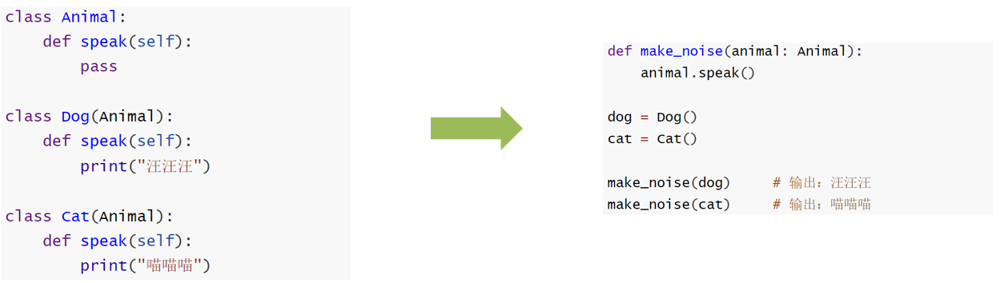

多态常作用在继承关系上，比如函数(方法)形参声明接收父类对象，实际传入父类的子类对象进行工作。即:

- 以父类做定义声明
- 以子类做实际工作
- 用以获得同一行为, 不同状态

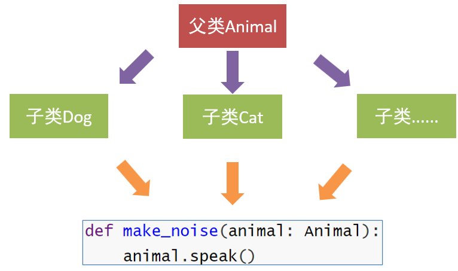

##### 抽象类（接口）

细心的同学可能发现了，父类Animal的speak方法，是空实现。这种设计的含义是：父类用来确定有哪些方法，具体的方法实现，由子类自行决定。这种写法，就叫做抽象类（也可以称之为接口）

抽象类：含有抽象方法的类称之为抽象类

抽象方法：方法体是空实现的（pass）称之为抽象方法

```python
class Animal:
    def speak(self):
        pass

class Dog(Animal):
    def speak(self):
        print("汪汪汪")

class Cat(Animal):
    def speak(self):
        print("喵喵喵")
```

为什么要使用抽象类呢？提出标准后，不同的厂家各自实现标准的要求。抽象类就好比定义一个标准，包含了一些抽象的方法，要求子类必须实现。配合多态完成：

- 抽象的父类设计（设计标准）
- 具体的子类实现（实现标准）

```python
# 定义空调类
class AC:
    def cool_wind(self):
        """制冷"""
        pass

    def hot_wind(self):
        """制热"""
        pass

    def swing_l_r(self):
        """左右摆风"""
        pass

# 定义美的空调类，继承自空调类
class Midea_AC(AC):
    def cool_wind(self):
        print("美的空调核心制冷科技")

    def hot_wind(self):
        print("美的空调电热丝加热")

    def swing_l_r(self):
        print("美的空调无风感左右摆风")

# 定义格力空调类，继承自空调类
class GREE_AC(AC):
    def cool_wind(self):
        print("格力空调变频省电制冷")

    def hot_wind(self):
        print("格力空调电热丝加热")

    def swing_l_r(self):
        print("格力空调静音左右摆风")

def make_cool(ac: AC):
	ac.cool_wind()
        
midea_ac = Midea_AC()
gree_ac = GREE_AC()

make_cool(midea_ac) 	# 输出：美的空调制冷
make_cool(gree_ac)		# 输出：格力空调制冷
```

### 类型注解

自动提示可用方法：在PyCharm中编写代码，我们经常能够见到如下提示。因为PyCharm确定这个对象，是list类型。

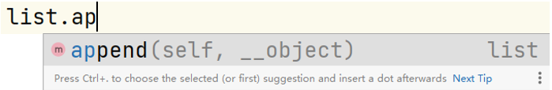

同样，我们换一份代码，定义一个函数func，接收一个参数data。你会发现，PyCharm不会在做出任何提示了。因为PyCharm不确定这个对象是什么类型。

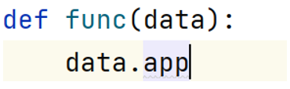

又或者当我们调用方法，进行传参的时候（快捷键ctrl + p弹出提示）。为什么内置模块random的方法可以提示类型

自己定义的就不可以？因为PyCharm无法通过代码确定应传入什么类型，我们需要使用类型注解。

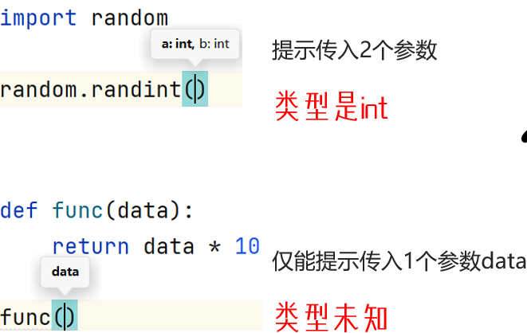

Python在3.5版本的时候引入了类型注解，以方便静态类型检查工具，IDE等第三方工具。类型注解：在代码中涉及数据交互的地方，提供数据类型的注解（显式的说明）。

主要功能：

- 帮助第三方IDE工具（如PyCharm）对代码进行类型推断，协助做代码提示
- 帮助开发者自身对变量进行类型注释

支持：

- 变量的类型注解
- 函数（方法）形参列表和返回值的类型注解

#### 类型注解的语法

##### 为变量设置类型注解

基础语法：` 变量: 类型`

```python
# 基础数据类型注解
var_1: int = 10
var_2: float = 3.1415926
var_3: bool = True
var_4: str = "itheima"

# 类对象类型注解
class Student:
    pass
stu: Student = Student()

# 基础容器类型注解
my_list: list = [1, 2, 3]
my_tuple: tuple = (1, 2, 3)
my_set: set = {1, 2, 3}
my_dict: dict = {"itheima": 666}
my_str: str = "itheima"

# 容器类型详细注解
my_list: list[int] = [1, 2, 3]
my_tuple: tuple[str, int, bool] = ("itheima", 666, True)
my_set: set[int] = {1, 2, 3}
my_dict: dict[str, int] = {"itheima": 666}
```

注意：

- 元组类型设置类型详细注解，需要将每一个元素都标记出来
- 字典类型设置类型详细注解，需要2个类型，第一个是key第二个是value

##### 注释中进行类型注解

除了使用`变量: 类型`， 这种语法做注解外，也可以在注释中进行类型注解。

语法：`# type: 类型`

```python
# 在注释中进行类型注解
class Student:  
    pass

var_1 = random.randint(1, 10)  # type: int
var_2 = json.loads(data)  # type: dict[str, int]
var_3 = func()  # type: student

# 如下，就算不写注解，也明确的知晓变量的类型
class Student:
    pass

var_l: int = random.randint(1, 10)
var_2: dict = json.loads(data)
var_3: Student = func()
```

类型注解主要功能如下，并不会真正的对类型做验证和判断：

- 帮助第三方IDE工具（如PyCharm）对代码进行类型推断，协助做代码提示
- 帮助开发者自身对变量进行类型注释（备注）

也就是，类型注解仅仅是提示性的，不是决定性的。如下代码，是不会报错的哦。

```python
var_l: int = "itheima" 
var_2: str = 123 
```

#### 函数（方法）的类型注解 

##### 形参注解

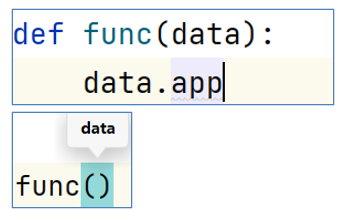

如图所示：

- 在编写函数（方法），使用形参data的时候，工具没有任何提示
- 在调用函数（方法），传入参数的时候，工具无法提示参数类型

这些都是因为，我们在定义函数（方法）的时候，没有给形参进行注解。

函数和方法的形参类型注解语法：

```python
def 函数方法名(形参名: 类型, 形参名: 类型, ...):
    pass
```

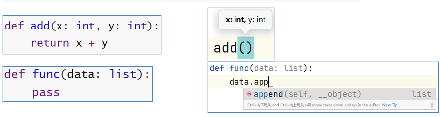

##### 返回值注解

同时，函数（方法）的返回值也是可以添加类型注解的。语法如下：

```python
def 函数方法名(形参: 类型, ..., 形参: 类型) -> 返回值类型:
    pass
```

例子：

```python
def add(x: int, y: int) -> int:
    return x + y

def func(data: list[int]) -> list[int]:
    pass
```

#### Union类型

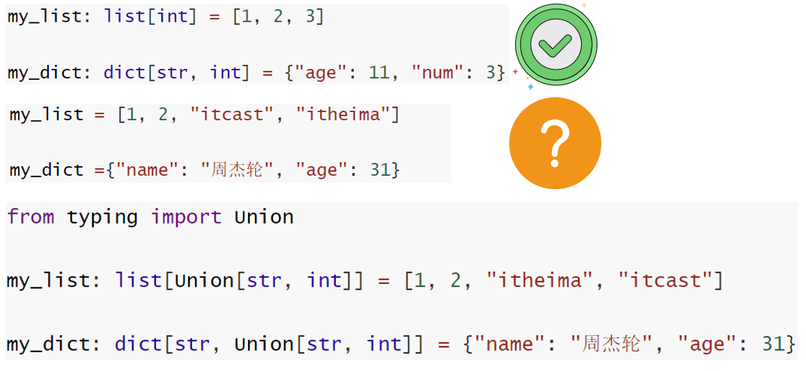

使用`Union[类型, ......, 类型]`，可以定义联合类型注解。Union联合类型注解，在变量注解、函数（方法）形参和返回值注解中，均可使用。

```python
my_list: list[Union(int, str)] = [1, 2, "itcast", "itheima"]

my_dict: dict[str, Union[str, int]] = {"name": "周杰轮", "age": 31}

def func(data: Union[int, str]) -> Union[int, str]:
    pass
```

