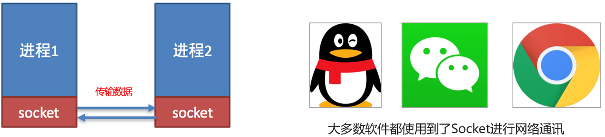
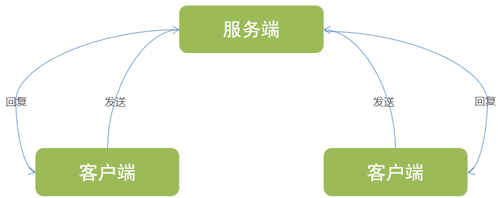
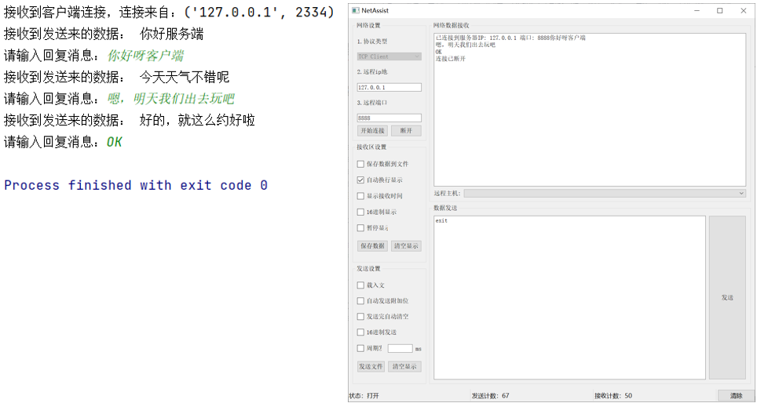
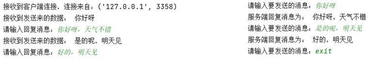

# python进阶

## 第三方库的使用

### Numpy

NumPy，一言以蔽之，是Python中基于数组对象的科学计算库。它是Python语言的一个扩展程序库，支持大量的维度数组与矩阵运算，以及大量的数学函数库。NumPy的核心是ndarray对象，它是一个功能强大的N维数组对象，封装了n维同类数组。很多运算是由编译过的代码来执行的，以此来提高效率。

以下是NumPy的一些主要特点：

1. **多维数组对象**：NumPy的核心数据结构是`ndarray`，它是一个多维数组，用于存储同质数据类型的元素。这些数组可以是一维、二维、三维等，非常适用于向量化操作和矩阵运算。
2. **广播功能**：NumPy允许在不同形状的数组之间执行操作，通过广播功能，它可以自动调整数组的形状，以使操作变得有效。
3. **丰富的数学函数**：NumPy提供了大量的数学、统计和线性代数函数，包括基本的加减乘除、三角函数、指数和对数函数、随机数生成、矩阵操作等。
4. **索引和切片**：NumPy允许使用索引和切片操作来访问和修改数组中的元素，这使得数据的选择和处理非常灵活。
5. **高性能计算**：NumPy的底层实现是用C语言编写的，因此它在处理大规模数据时非常高效。此外，NumPy还与其他高性能计算库（如BLAS和LAPACK）集成，提供了快速的线性代数运算。
6. **互操作性**：NumPy可以与许多其他Python库和数据格式（例如Pandas、SciPy、Matplotlib）无缝集成，这使得数据科学工作流更加流畅。

#### 创建nparray数组

NumPy最重要的一个特点就是其`N维数组对象`（即ndarray），该对象是一个快速而灵活的`大数据集容器`。你可以`利用这种数组`对`整块数据`执行一些数学运算，其语法跟标量元素之间的运算一样。

| 函数                                | 说明                                                         |
| ----------------------------------- | ------------------------------------------------------------ |
| array(序列)                         | 将输入数据 （列表、元组、数组或其他序列类型）转换为 ndarray。 要么推断出 dtype，要么显式指定 dtype。默认直接复制输入数据 |
| asarray(序列)                       | 将输入转换为 ndarray，如果输入本身就是一个 ndarray 就不进行复制 |
| arange(起始,结束,步长)              | 类似于内置的 range，使用方法也一样，但返回的是一个 ndaray 而不是列表 |
| ones((行,列))、ones_like((行,列))   | 根据指定的形状和 dtype 创建一个全 1 数组。ones_like 以另一个数组为参数，并根据其形状和 dtype 创建一个全 1 数组 |
| zeros((行,列))、zeros_like((行,列)) | 类似于 ones 和 ones_like，只不过产生的是全 0 数组而已        |
| empty((行,列))、empty_like((行,列)) | 创建新数组， 只分配内存空间但不填充任何值                    |
| eye、identity                       | 创建一个正方的N×N单位矩阵（对角线为1， 其余为0）             |

> 参数里需要用行,列表示的。行,列用不用括号包裹都可以。

```python
import numpy as np;

print ('使用列表生成一维数组')
data = [1,2,3,4,5,6]
x = np.array(data)
print (x) #打印数组	[1 2 3 4 5 6]
print(x.dtype)  # 打印数组元素的类型 int32

print('使用列表生成二维数组')
data = [[1,2],[3,4],[5,6]]
x = np.array(data)
print(x)  # 打印数组
"""
[[1 2]
 [3 4]
 [5 6]]
"""
print(x.ndim)  # 打印数组的维度 2
print(x.shape)  # 打印数组各个维度的长度。shape是一个元组 (3, 2)

print('使用zero/ones/empty创建数组:根据shape来创建')
x = np.zeros(6) #创建一维长度为6的，元素都是0一维数组
print(x) # [0. 0. 0. 0. 0. 0.]
x = np.zeros((2,3)) #创建一维长度为2，二维长度为3的二维0数组
print(x)
"""
[[0. 0. 0.]
 [0. 0. 0.]]
"""
x = np.ones((2,3)) #创建一维长度为2，二维长度为3的二维1数组
print(x)
"""
[[1. 1. 1.]
 [1. 1. 1.]]
"""
x = np.empty((3,3)) #创建一维长度为2，二维长度为3,未初始化的二维数组
print(x)
"""
[[0.00e+000 0.00e+000 0.00e+000]
 [0.00e+000 0.00e+000 1.86e-321]
 [0.00e+000 0.00e+000 0.00e+000]]
"""
print('使用arrange生成连续元素')
print(np.arange(6))  # [0 1 2 3 4 5]
print(np.arange(0, 6, 2))  # [0 2 4]
```

#### 操作数组

| 函数                                            | 说明                                                         |
| ----------------------------------------------- | ------------------------------------------------------------ |
| np数组.reshape((行, 列))                        | 通过使用 `reshape`，可以将一个多维数组转换为不同的形状，但总元素数量必须保持不变。也可以制作三维数组，如重塑为2x2x3的三维数组：b = a.reshape((2, 2, 3)) |
| np数组.flatten()                                | `flatten` 函数是 NumPy 中用于将多维数组转换为一维数组的一个方法。它会返回一个新的数组，而不会修改原始数组。 |
| np数组1.dot(np数组2)<br />dot(np数组1, np数组2) | `dot` 函数用于计算两个数组的点积（或称为内积）。它在不同维度的数组上有不同的行为：  **一维数组**：计算向量的点积。 **二维数组**：计算矩阵乘法。 **多维数组**：计算高维数组的点积。 |
|                                                 |                                                              |
|                                                 |                                                              |
|                                                 |                                                              |
|                                                 |                                                              |

```python
import numpy as np;

a = np.array([[1,2],[3,4]]) # 2行2列
b = np.arange(6).reshape((2,3)) # 2行3列
print(a)
"""
[[1 2]
 [3 4]]
 """
print(b)
"""
[[0 1 2]
 [3 4 5]]
"""
print(a.dot(b))  # 2行3列
"""
[[ 6  9 12]
 [12 19 26]]
"""

# 使用 flatten 函数
flattened_array = a.flatten()
print("展平后的数组:")
print(flattened_array)
"""
[1 2 3 4]
"""
```

### Matplotlib

### Beautifulsoup

Python beautifulsoup库是一个强大的Web抓取和解析库，它提供了丰富的功能和简单易用的API，可以帮助我们处理HTML和XML文档，从中提取数据，进行数据清洗和处理。beautifulsoup库基于[Python标准库](https://so.csdn.net/so/search?q=Python标准库&spm=1001.2101.3001.7020)中的html.parser模块，同时还可以与第三方解析库lxml和parsel配合使用，提供更高效和灵活的解析方式。

#### 创建 BeautifulSoup 对象

```python
#encoding:UTF-8
# 首先导入库 bs4   lxml  requests
from bs4 import BeautifulSoup
import lxml
import requests

# 演示素材
html = """
<html><head><title>The Dormouse's story</title></head>
<body>
<p class="title" name="dromouse"><b>The Dormouse's story</b></p>
<p class="story">Once upon a time there were three little sisters; and their names were
<a href="http://example.com/elsie" class="sister" id="link1"><!-- Elsie --></a>,
<a href="http://example.com/lacie" class="sister" id="link2">Lacie</a> and
<a href="http://example.com/tillie" class="sister" id="link3">Tillie</a>;
and they lived at the bottom of a well.</p>
<p class="story">...</p>
"""

# 创建 beautifulsoup 对象：
soup = BeautifulSoup(html,'lxml')  #创建 beautifulsoup 对象
```

#### 四种对象

Beautiful Soup将复杂HTML文档转换成一个复杂的树形结构,每个节点都是Python对象,所有对象可以归纳为4种:

- Tag
- NavigableString
- BeautifulSoup
- Comment

##### Tag

Tag就是 HTML 中的一个个标签，例如：`<title>The Dormouse's story</title>`

用 BeautifulSoup 可以很方便地获取 Tags：

```python
# 这种方式查找的是在所有内容中的第一个符合要求的标签。
print soup.title
print soup.head
print soup.a
print soup.p
print type(soup.a)

# 对于 Tag，它有两个重要的属性，name 和 attrs ：
print soup.name
print soup.a.name
print soup.attrs
print soup.p.attrs #在这里，我们把 p 标签的所有属性打印输出了出来，得到的类型是一个字典。
print soup.p['class'] #单独获取某个属性
print soup.p.get('class') #单独获取某个属性 跟上面一样的
# 可以对这些属性和内容等等进行修改：
soup.p['class']="newClass"
# 可以对这个属性进行删除：
del soup.p['class']
```

##### NavigableString

得到了标签的内容用 .string 即可获取标签内部的文字，例如：`print soup.p.string`

来检查一下它的类型：

```python
print type(soup.p.string)
#<class 'bs4.element.NavigableString'>
```

可以看到它的类型是一个 NavigableString，翻译过来叫 可以遍历的字符串。

##### BeautifulSoup

BeautifulSoup 对象表示的是一个文档的全部内容.大部分时候,可以把它当作 Tag 对象，是一个特殊的 Tag，我们可以分别获取它的类型，名称：

```python
print type(soup.name)
#<type 'unicode'>
print soup.name 
# [document]
print soup.attrs 
#{} 空字典
```

##### Comment

Comment 对象是一个特殊类型的 NavigableString 对象，其实输出的内容仍然不包括注释符号。我们找一个带注释的标签：

```python
print soup.a
print soup.a.string
print type(soup.a.string)

# 运行结果如下：
<a class="sister" href="http://example.com/elsie" id="link1"><!-- Elsie --></a>
 Elsie 
<class 'bs4.element.Comment'>
```

a 标签里的内容实际上是注释，但是如果我们利用 .string 来输出它的内容，我们发现它已经把注释符号去掉了，所以这可能会给我们带来不必要的麻烦。

我们打印输出下它的类型，发现它是一个 Comment 类型，所以，我们在使用前最好做一下判断，判断代码如下：

```python
if type(soup.a.string)==bs4.element.Comment:
    print soup.a.string
```

上面的代码中，我们判断了它的类型，是否为 Comment 类型。

### pandas

`pandas` 是一个强大且灵活的数据处理和分析库，广泛用于数据科学和数据分析领域。它提供了高性能、易于使用的数据结构和数据分析工具。以下是 `pandas` 库的一些主要功能和用途

#### pandas 和 numpy 区别

**NumPy**: 主要用于数值计算和数组操作，适合处理同质数值数据。

**Pandas**: 提供了更高级的数据结构和数据操作功能，适合处理异质表格数据和进行数据分析。

1. **数据结构**
   - **NumPy**: 主要提供多维数组（ndarray）和用于数组操作的函数。NumPy 数组是同质的，即数组中的所有元素类型必须相同。
   - **Pandas**: 提供了更高级的数据结构，如 Series（一维）和 DataFrame（二维），允许不同列包含不同类型的数据。Pandas 的数据结构更接近于电子表格或 SQL 表，非常适合处理异质数据。
2. **数据操作和分析功能**
   - **NumPy**: 主要用于数值计算，提供了大量的数学函数和线性代数操作。NumPy 的操作是基于数组的，主要面向数值数据处理。
   - **Pandas**: 提供了丰富的数据操作功能，如数据清洗、合并、重塑、分组和聚合等。Pandas 更关注于数据分析和处理，特别是表格数据。
3. **时间序列处理**
   - **NumPy**: 对时间序列数据的支持相对有限，主要是通过数组操作来实现。
   - **Pandas**: 提供了强大的时间序列处理功能，包括时间索引、重采样、滚动窗口操作等。
4. **数据读取和写入**
   - **NumPy**: 提供了基本的文件读取和写入功能，如从文本文件或二进制文件读取数据。
   - **Pandas**: 提供了丰富的数据读取和写入功能，支持多种文件格式，如 CSV、Excel、SQL 数据库、JSON 等。

NumPy 示例：

```python
import numpy as np

# 创建一个 NumPy 数组
arr = np.array([1, 2, 3, 4, 5])

# 数组运算
arr_squared = arr ** 2
print(arr_squared)

# 数组重塑
arr_reshaped = arr.reshape((1, 5))
print(arr_reshaped)
```

Pandas 示例：

```python
import pandas as pd

# 创建一个 Pandas DataFrame
data = {
    'Name': ['Alice', 'Bob', 'Charlie'],
    'Age': [25, 30, 35],
    'City': ['New York', 'Los Angeles', 'Chicago']
}
df = pd.DataFrame(data)
print(df)

# 数据过滤
filtered_df = df[df['Age'] > 25]
print(filtered_df)

# 数据分组和聚合
grouped = df.groupby('City').mean()
print(grouped)
```

## 网络编程

### Socket

socket (简称 套接字) 是进程之间通信一个工具，好比现实生活中的插座，所有的家用电器要想工作都是基于插座进行，进程之间想要进行网络通信需要socket。

Socket负责进程之间的网络数据传输，好比数据的搬运工。



2个进程之间通过Socket进行相互通讯，就必须有服务端和客户端。

- Socket服务端：等待其它进程的连接、可接受发来的消息、可以回复消息
- Socket客户端：主动连接服务端、可以发送消息、可以接收回复



### Socket服务端编程

主要分为如下几个步骤：

1. 创建socket对象

   ```python
   import socket
   socket_server = socket.socket()
   ```

2. 绑定socket_server到指定IP和地址

   ```python
   socket_server.bind(host, port)
   ```

3. 服务端开始监听端口

   ```python
   socket_server.listen(backlog)  
   # backlog为int整数，表示允许的连接数量，超出的会等待，可以不填，不填会自动设置一个合理值
   ```

4. 接收客户端连接，获得连接对象

   ```python
   conn, address = socket_server.accept() 
   print(f"接收到客户端连接，连接来自：{address}")
   # accept方法是阻塞方法，如果没有连接，会卡在当前这一行不继续下一行代码
   # accept返回的是一个二元元组，可以使用上述形式，用两个变量接收二元元组的2个元素
   ```

5. 客户端连接后，通过recv方法，接收客户端发送的消息

   ```python
   while True:
       data = conn.recv(1024).decode('utf-8')  
   	# recv方法的返回值是字节数组（Bytes），可以通过decode使用UTF-8解码为字符串
   	# recv方法的传参是buffsize，缓冲区大小，一般设置为1024即可
       if data == 'exit':
           break
       print("接收到发送来的数据：", data)
       # 可以通过whileTrue无限循环来持续和客户端进行数据交互 
       # 可以通过判定客户端发来的特殊标记，如exit，来退出无限循环
   ```

6. 通过conn（客户端当次连接对象），调用send方法可以回复消息

   ```python
   while True:
       data = conn.recv(1024).decode("utf-8")
       if data == 'exit':
           break
       print("接收到发送来的数据：", data)
      
       conn.send("你好呀哈哈哈".encode("utf-8"))
   ```

7. conn（客户端当次连接对象）和socket_server对象调用close方法，关闭连接

### 实现服务端并结合客户端进行测试

```python
import socket

socket_server = socket.socket()
socket_server.bind(("localhost", 8888))
socket_server.listen(1)
conn, address = socket_server.accept()
print(f"接收到客户端连接，连接来自：{address}")

while True:
    data = conn.recv(1024).decode("UTF-8")
    if data == 'exit':
        break
    print("接收到发送来的数据：", data)
    reply = input("请输入回复消息：").encode("UTF-8")
    conn.send(reply)

conn.close()
socket_server.close()
```

下载网络调试助手作为客户端：https://github.com/nicedayzhu/netAssist/releases



### Socket客户端编程

主要分为如下几个步骤：

1. 创建socket对象

   ```python
   import socket
   socket_client = socket.socket()
   ```

2. 连接到服务端

   ```python
   socket_client.connect(('localhost', 8888))
   ```

3. 发送消息

   ```python
   while True:		# 可以通过无限循环来确保持续的发送消息给服务端
       send_msg = input("请输入要发送的消息: ")
       if send_msg == 'exit':  
           # 通过特殊标记来确保可以退出无限循环
           break
       socket_client.send(send_msg.encode("UTF-8"))  # 消息需要编码为字节数组（UTF-8编码）
   ```

4. 接收返回消息

   ```python
   while True:
       send_msg = input("请输入要发送的消息: ").encode("UTF-8")
       socket_client.send(send_msg)
       
       recv_data = socket_client.recv(1024)  # 1024是缓冲区大小，一般1024即可
       # recv方法是阻塞式的，即不接收到返回，就卡在这里等待
       print("服务端回复消息为：", recv_data.decode("UTF-8"))  # 接收的消息需要通过UTF-8解码为字符串
   ```

5. 关闭链接

   ```python
   socket_client.close() # 最后通过close关闭链接
   ```

### 服务端客户端相互通讯

结合上一节学习的服务端代码，以及当前学习的客户端代码。两者均运行起来，进行相互通讯。

