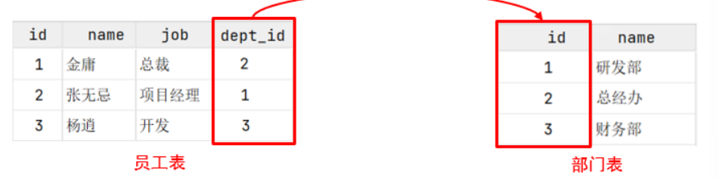
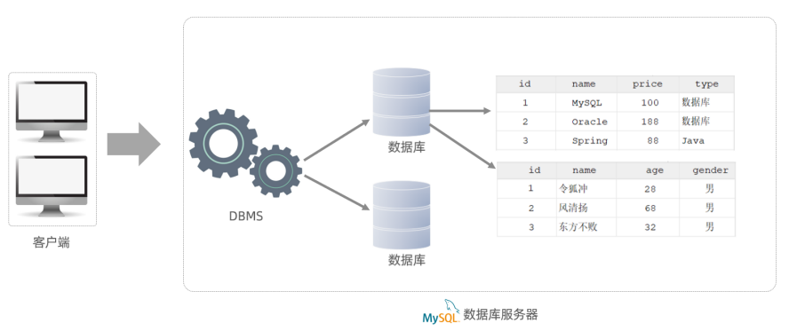

# MySQL入门篇

> 看此篇前建议复习一下数据库原理，明白数据库系统构成的5个要素以及之间的关系，逻辑数据模型中的关系模型。

> 本文档主要讲述MySQL配置，部分数据库系统概念和关系型数据库概念

## 数据库系统部分概念

| 名称                    | 介绍                                                         | 简称                              |
| ----------------------- | ------------------------------------------------------------ | --------------------------------- |
| 数据库                  | 存储数据的仓库，数据是有组织的进行存储                       | DataBase（DB）                    |
| 数据库管理系统          | 操纵和管理数据库的大型软件                                   | DataBase Management System (DBMS) |
| 结构化的数据库语言(SQL) | **操作关系型数据库**的编程语言，定义了一套操作关系型数据库统一标准 | Structured Query Language (SQL)   |

### 主流数据库管理系统

下面是一些数据库管理系统，市场占有率依次递减：

1. Oracle：大型的收费数据库，Oracle公司产品，价格昂贵。
2. MySQL：开源免费的中小型数据库，后来Sun公司收购了MySQL，而Oracle又收购了Sun公司。 目前Oracle推出了收费版本的MySQL，也提供了免费的社区版本。
3. Microsoft SQL Server：Microsoft 公司推出的收费的中型数据库，C#、.net等语言常用。 
4. PostgreSQL：开源免费的中小型数据库。 
5. DB2：IBM公司的大型收费数据库产品。 
6. SQLLite：嵌入式的微型数据库。Android内置的数据库采用的就是该数据库。 
7. MariaDB：开源免费的中小型数据库。是MySQL数据库的另外一个分支、另外一个衍生产品，与 MySQL数据库有很好的兼容性

而不论我们使用的是上面的哪一个关系型数据库，最终在操作时，都是使用SQL语言来进行统一操作， 因为我们前面讲到SQL语言，是操作关系型数据库的统一标准 。所以即使我们现在学习的是MySQL， 假如我们以后到了公司，使用的是别的关系型数据库，如：Oracle、DB2、SQLServer，也完全不用担心，因为操作的方式都是一致的。 

## MySQL数据库配置

### 配置

#### 下载

MySQL官方提供了两种不同的版本：社区版本和商业版本。下载MySQL最新的社区版即可。

下载地址：https://downloads.mysql.com/archives/installer/

#### 安装

傻瓜安装，但要注意以下几点

1. 里面有一步是安装MySQL的相关组件，这个过程可能需要耗时几分钟，耐心等待。
2. 输入MySQL中root用户的密码,一定记得记住该密码

#### 配置环境变量

1. 在此电脑上，右键选择属性
2. 点击左侧的 "高级系统设置"，选择环境变量
3. 找到 Path 系统变量, 点击 "编辑"
4. 选择 "新建" , 将MySQL Server的安装目录下的bin目录添加到环境变量

### 运行

MySQL安装完成之后，在系统启动时，会自动启动MySQL服务，我们无需手动启动了。当然，也可以手动的通过指令启动停止，下面是两种操作方法。

#### 使用CMD

##### 方法1

以管理员身份运行cmd，进入命令行执行如下指令：

- 启动MySQL运行：`net start mysql80`
- 停止MySQL运行：` net stop mysql80`

> 上述的 mysql80 是我们在安装MySQL时，默认指定的mysql的系统服务名，不是固定的，如果未改动，默认就是mysql80。
>
> 此方法必须使用管理员权限

##### 方法2

常用语法：`mysql -u root -p`

语法：` mysql  [-h 127.0.0.1]  [-P 3306]  -u root -p`

参数解释：

- -h : MySQL服务所在的主机IP
- -P : MySQL服务端口号， 默认3306
- -u : MySQL数据库用户名
- -p ： MySQL数据库用户名对应的密码

- []内为可选参数，如果需要连接远程的MySQL，需要加上这两个参数来指定远程主机IP、端口，如果连接本地的MySQL，则无需指定这两个参数。

> 注意： 使用CMD方式进行连接时，需要安装完毕后配置PATH环境变量。

#### 使用MySQL客户端命令行工具

打开文件MySQL 8.0 Command Line Client，输入密码后即完成连接。文件可在电脑菜单或MySQL所在文件夹中找到。

## 关系型数据库(RDBMS)

概念：建立在关系模型基础上，由多张相互连接的二维表组成的数据库。

所谓二维表，指的是由行和列组成的表，如下图，类似于Excel表格数据，有表头、有列、有行， 还可以通过一列关联另外一个表格中的某一列数据。我们之前提到的MySQL、Oracle、DB2、 SQLServer这些都是属于关系型数据库，里面都是基于二维表存储数据的。简单说，基于二维表存储数据的数据库就成为关系型数据库，不是基于二维表存储数据的数据库，就是非关系型数据库。

特点：

- 使用表存储数据，格式统一，便于维护。
- 使用SQL语言操作，标准统一，使用方便。

### 关系型数据库-MySQL

MySQL是关系型数据库，是基于二维表进行数据存储的，具体的结构图下:

- 我们可以通过MySQL客户端连接数据库管理系统DBMS，然后通过DBMS操作数据库。 
- 可以使用SQL语句，通过数据库管理系统操作数据库，以及操作数据库中的表结构及数据。 
- 一个数据库服务器中可以创建多个数据库，一个数据库中也可以包含多张表，而一张表中又可以包含多行记录。

## 图形化界面工具

在命令行工具里进行操作，主要存在以下两点问题：

- 会影响开发效率
- 使用起来，并不直观，并不方便

所以呢，我们在日常的开发中，会借助于MySQL的图形化界面，来简化开发，提高开发效率。而目前 mysql主流的图形化界面工具，有以下几种：

- sqlyog
- Navicat
- DataGrip

> 网址：
>
> - Workbench(免费): http://dev.mysql.com/downloads/workbench/
> - navicat(收费，试用版30天): https://www.navicat.com/en/download/navicat-for-mysql
> - Sequel Pro(开源免费，仅支持Mac OS): http://www.sequelpro.com/
> - HeidiSQL(免费): http://www.heidisql.com/
> - phpMyAdmin(免费): https://www.phpmyadmin.net/
> - SQLyog: https://sqlyog.en.softonic.com/

而我们选择最后一种DataGrip，这种图形化界面工具，功能更加强大，界面提示更加友好， 是我们使用MySQL的不二之选。接下来，我们来介绍一下DataGrip该如何安装、使用。

### DataGrip

#### 下载

浏览器直接搜，下载后免费试用30天

#### 安装

傻瓜安装，里面有个创建桌面快捷方式可以勾选

#### 使用

1. 第一次使用时，提示是否导入配置选否，进入注册页面直接点击免费试用即可
2. 打开开始界面后，点击New project，取好数据库的名称(英文名)。
3. 在左侧栏database explorer中的加号里添加data sources里的mysql
4. 打开mysql界面后，配置连接信息：主机localhost，端口3306；然后用户为root；密码123456；最后在下方的提示中下载驱动文件。一切完毕后确定即可
5. 在它提示的省略号按钮中勾选All schemas，然后点击刷新，成功展示出了所有的数据库。这样就算完成在图形化界面中连接上了mysql

##### 创建数据库

右键mysql(根目录)，在new中选择schema，然后在里面填写数据库名称，就会发现在下面会自己生成创建数据库的语句，填好后确定即可。

##### 创建表

右键数据库，在new中选择table，填写表明和注释信息后，在columns选项中点击加号添加字段，完成后确定即可。

##### 自己编写SQL语句

想要在哪个数据库写SQL语句，只需要右键具体的数据库后，选择Query Console，然后在这里面写SQL语句操作本数据库。编写完后点击执行按钮，就可以执行最下面的一句语句。