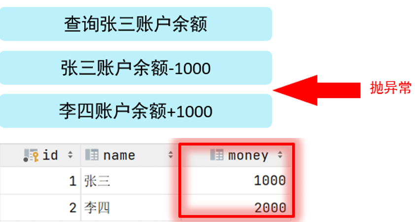

# MySQL基础

## SQL

全称 Structured Query Language，结构化查询语言。操作关系型数据库的编程语言，定义了 一套操作关系型数据库统一标准。

### SQL通用语法

在学习具体的SQL语句之前，先来了解一下SQL语言的通用语法。

- SQL语句可以单行或多行书写，以分号结尾。
- SQL语句可以使用空格/缩进来增强语句的可读性。
- MySQL数据库的SQL语句**不区分大小写**，关键字建议使用大写。
- 注释： 
  - 单行注释：-- 注释内容 或 # 注释内容 
  - 多行注释：/* 注释内容 */

### SQL分类

SQL语句，根据其功能，主要分为四类：DDL、DML、DQL、DCL。

| 分类 | 全称                       | 汉译         | 说明                                     |
| ---- | -------------------------- | ------------ | ---------------------------------------- |
| DDL  | Data Definition Language   | 数据定义语言 | 用来定义数据库对象(操作数据库，表，字段) |
| DML  | Data Manipulation Language | 数据操作语言 | 用来对数据库表中的数据进行增删改         |
| DQL  | Data Query Language        | 数据查询语言 | 用来查询数据库中表的记录                 |
| DCL  | Data Control Language      | 数据控制语言 | 用来创建数据库用户、控制数据库的访问权限 |

#### DDL(数据定义语言)

Data Definition Language，数据定义语言，用来定义数据库对象(数据库，表，字段) 。

##### 数据库操作

- 查询所有数据库：`SHOW DATABASES;`

  

- 查询当前数据库：`SELECT DATABASE();`

  > 此指令是在进入某个数据库后，用于查询自己进入的是哪个数据库，没有进入数据库时使用此语句会查询出NULL。

- 创建数据库：`CREATE DATABASE [ IF NOT EXISTS ] 数据库名 [ DEFAULT CHARSET 字符集] [COLLATE 排序规则 ];`

  > 注意事项：
  >
  > - []括起来的都可以省略。[ IF NOT EXISTS ]代表如果数据库名称不存在则创建，如果存在则不执行操作；[ DEFAULT CHARSET 字符集]用于指定当前数据库所使用的字符集，不过数据库有默认的字符集；[COLLATE 排序规则 ]指定默认的排序规则。
  >
  > - UTF8字符集长度为3字节，有些符号占4字节，所以推荐用utf8mb4字符集
  >
  > - 在同一个数据库服务器中，不能创建两个名称相同的数据库，否则将会报错。可以通过[ IF NOT EXISTS ]参数来解决这个问题
  >
  > - 例子：创建一个itcast数据库, 使用数据库默认的字符集：`create database itcast;`
  >
  >   

- 删除数据库：`DROP DATABASE [ IF EXISTS ] 数据库名;`

  

  > 如果删除一个不存在的数据库，将会报错。此时可以加上参数[ IF EXISTS ]，如果数据库存在，再执行删除，否则不执行删除。

- 切换数据库：`USE 数据库名;`

  > 我们要操作某一个数据库下的表时，就需要通过该指令，切换到对应的数据库下，否则是不能操作的。 比如，切换到itcast数据，执行如下SQL语句：`use itcast;`

##### 表操作

###### 查询创建

- 查询当前数据库所有表：`SHOW TABLES;`

  > 比如，我们可以切换到sys这个系统数据库，并查看系统数据库中的所有表结构：`use sys;`、`show tables;`
  >
  > 

- 查询指定表结构：`DESC 表名;`

  

  > 通过这条指令，我们可以查看到指定表的字段，字段的类型、是否可以为NULL，是否存在默认值等信息。

- 查询指定表的建表语句：`SHOW CREATE TABLE 表名;`

  

  > 通过这条指令，主要是用来查看建表语句的，可以看到表的更详细的细节入注释，而有部分参数我们在创建表的时候，并未指定也会查询到，因为这部分是数据库的默认值，如：存储引擎、字符集等。

- 创建表结构：

  ```mysql
  CREATE TABLE 表名(
  	字段1 字段1类型 [COMMENT 字段1注释],
  	字段2 字段2类型 [COMMENT 字段2注释],
  	字段3 字段3类型 [COMMENT 字段3注释],
  	...
  	字段n 字段n类型 [COMMENT 字段n注释]
  )[ COMMENT 表注释 ];
  ```

  > 注意：[...] 内为可选参数，最后一个字段后面没有逗号，注释的字符必须有单引号包裹。
  >
  > 比如，我们创建一张表 tb_user ，对应的结构如下：
  >
  > 
  >
  > 那么建表语句为：
  >
  > ```mysql
  > create table tb_user(
  > 	id int comment '编号',
  > 	name varchar(50) comment '姓名',
  > 	age int comment '年龄',
  > 	gender varchar(1) comment '性别'
  > ) comment '用户表';
  > ```

###### 数据类型

在上述的创建表结构的语句中，我们在指定字段的数据类型时，用到了int ，varchar，那么接下来，我们就来详细介绍一下MySQL的数据类型。

MySQL中的数据类型有很多，主要分为三类：数值类型、字符串类型、日期时间类型。

**数值类型**

| 类型        | 大小     | 有符号(SIGNED)范围                                     | 无符号(UNSIGNED)范围                                       | 描述               |
| ----------- | -------- | ------------------------------------------------------ | ---------------------------------------------------------- | ------------------ |
| TINYINT     | 1byte    | (-128，127)                                            | (0，255)                                                   | 小整数值           |
| SMALLINT    | 2bytes   | (-32768，32767)                                        | (0，65535)                                                 | 大整数值           |
| MEDIUMINT   | 3bytes   | (-8388608，8388607)                                    | (0，16777215)                                              | 大整数值           |
| INT/INTEGER | 4bytes   | (-2147483648， 2147483647)                             | (0，4294967295)                                            | 大整数值           |
| BIGINT      | 8bytes   | (-2^63，2^63-1)                                        | (0，2^64-1)                                                | 极大整数 值        |
| FLOAT       | 4bytes   | (-3.402823466 E+38， 3.402823466351 E+38)              | 0 和 (1.175494351 E-38，3.402823466 E+38)                  | 单精度浮点数值     |
| DOUBLE      | 8bytes   | (-1.7976931348623157 E+308， 1.7976931348623157 E+308) | 0 和 (2.2250738585072014 E-308， 1.7976931348623157 E+308) | 双精度浮点数值     |
| DECIMAL     | M+2bytes | 依赖于M(精度)和D(标度)的值                             | 依赖于M(精度)和D(标度)的值                                 | 压缩的“严格”定点数 |

> 这里可以类比Java的数据类型分类，SMALLINT=short、INT/INTEGER=int、BIGINT=long、FLOAT=float、DOUBLE=double。
>
> DECIMAL中精度指整串数字的位数，标度指整串数字小数位数。如123.45，精度为5标度为2。


```mysql
#数值类型使用方式举例
#年龄字段：不会出现负数, 而且人的年龄不会太大，因此为了避免占用内存，使用TINYINT UNSIGNED正好
age tinyint unsigned
#分数：总分100分, 最多出现一位小数，使用double很好
score decimal(4,1)
#double有两个参数，第一个参数代表精度，第二个代表标度。精度最多4(100.0)，标度为1(最多一位小数)。
```

**字符串类型**

| 类型          | 大小                                                      | 描述                         | 说明                                        |
| ------------- | --------------------------------------------------------- | ---------------------------- | ------------------------------------------- |
| CHAR(M)       | M bytes，1<=M<=255                                        | 定长字符串                   | 固定长度非二进制字符串，需要指定长度        |
| VARCHAR(M)    | 0-65 535 bytes                                            | 变长字符串                   | 变长非二进制字符串，需要指定长度            |
| TINYTEXT      | 0-255 bytes                                               | 短文本字符串                 | 非常小的非二进制字符串                      |
| TEXT          | 0-65 535 bytes                                            | 长文本数据                   | 小的非二进制字符串                          |
| MEDIUMTEXT    | 0-16 777 215 bytes                                        | 中等长度文本数据             | 中等大小的非二进制字符串                    |
| LONGTEXT      | 0-4 294 967 295 bytes                                     | 极大文本数据                 | 大的非二进制字符串                          |
| ENUM          | 1或2 bytes，取决于枚举值的数目 (最大值为65535)            | 枚举类型                     | 枚举类型，只能有一个枚举字符串值            |
| SET           | 1、2、3、4或8 bytes，取决于集合成员的数量（最多64个成员） | 设置                         | 一个设置，字符串对象可以有零个或多个SET成员 |
| BIT(M)        | 大约 (M+7)/8 bytes                                        | 位字段类型                   |                                             |
| BINARY(M)     | M bytes                                                   | 定长二进制字符串             | 固定长度二进制字符串                        |
| VARBINARY (M) | M+1 bytes                                                 | 变长二进制字符串             | 可变长度二进制字符串                        |
| TINYBLOB(M)   | 0-255 bytes                                               | 不超过255个字符的二进制数据  | 非常小的BLOB                                |
| BLOB(M)       | 0-65 535 bytes                                            | 二进制形式的长文本数据       | 小 BLOB                                     |
| MEDIUMBLOB(M) | 0-16 777 215 bytes                                        | 二进制形式的中等长度文本数据 | 中等大小的BLOB                              |
| LONGBLOB(M)   | 0-4 294 967 295 bytes                                     | 二进制形式的极大文本数据     | 非常大的BLOB                                |

> 这里面主要分为两类：后半部分以及后缀blob的是描述二进制数据的，前半部分以及后缀是text是描述文本数据的。二进制数据比如视频音频压缩包这些是可以存储到数据库当中的，但在开发中很少去这样做，原因是性能并不高且不方便管理，对于这些二进制数据一般会采用专用的文件服务器进行存储，因此二进制字符串数据类型用的并不多。
>
> char 与 varchar 都可以描述字符串，在使用他们时，都需要在后面给一个参数，指定他们存储字符串的最大长度是多少，如char(10)代表最大存储10字符，可以存储小于等于10字符的字符串，超出则报错。char是定长字符串，指定长度多长，就占用多少个字符，和字段值大小无关。而varchar是变长字符串，指定的长度为最大占用长度，在没有超出指定长度情况下占用空间为字段值大小，超出则报错 。相对来说，char的性能会更高些，因为varchar在使用时会根据内容计算占用空间。不过具体使用时要先考虑空间在考虑性能。

```mysql
#字符串类型使用方式举例
#用户名username：长度不定, 最长不会超过50位，这种情况使用varchar更好，因为这是变长的字符串，使用varchar可以尽可能的节省空间。
username varchar(50)
#性别gender：存储值, 不是男,就是女。这种显然用char更好，因为固定使用1字节，而且用char性能更高
gender char(1)
#手机号phone：固定长度为11
phone char(11)
```

**日期时间类型**

| 类型      | 大小   | 范围                                      | 格式                | 描述                     |
| --------- | ------ | ----------------------------------------- | ------------------- | ------------------------ |
| YEAR      | 1byte  | 1901 ~ 2155                               | YYYY                | 年份值                   |
| TIME      | 3bytes | -838:59:59 ~ 838:59:59                    | HH:MM:SS            | 时间值或持续时间         |
| DATE      | 3bytes | 1000-01-01 ~ 9999-12-31                   | YYYY-MM-DD          | 日期值                   |
| DATETIME  | 8bytes | 1000-01-01 00:00:00 ~ 9999-12-31 23:59:59 | YYYY-MM-DD HH:MM:SS | 混合日期和时间值         |
| TIMESTAMP | 4bytes | 1970-01-01 00:00:01 ~ 2038-01-19 03:14:07 | YYYY-MM-DD HH:MM:SS | 混合日期和时间值，时间戳 |

```mysql
#举例
#生日字段 birthday，记录年月日更好些，因此使用date类型
birthday date
#创建时间 createtime
createtime datetime
```

###### 案例

设计一张员工信息表，要求如下： 

1. 编号（纯数字） 
2. 员工工号 (字符串类型，长度不超过10位) 
3. 员工姓名（字符串类型，长度不超过10位） 
4. 性别（男/女，存储一个汉字） 
5. 年龄（正常人年龄，不可能存储负数）
6. 身份证号（二代身份证号均为18位，身份证中有X这样的字符）
7. 入职时间（取值年月日即可）

对应的建表语句如下:

```mysql
create table emp(
	id int comment '编号',
	workno varchar(10) comment '工号',
	name varchar(10) comment '姓名',
	gender char(1) comment '性别',
	age tinyint unsigned comment '年龄',
	idcard char(18) comment '身份证号',
	entrydate date comment '入职时间'
) comment '员工表';
```

SQL语句编写完毕之后，就可以在MySQL的命令行中执行SQL，然后也可以通过 desc 指令查询表结构信息：


表结构创建好了，里面的name字段是varchar类型，最大长度为10，也就意味着如果超过10将会报错，如果我们想修改这个字段的类型或修改字段的长度该如何操作呢？接下来再来讲解DDL语句中，如何操作表字段。

###### 修改

- 添加字段：`ALTER TABLE 表名 ADD 字段名 类型(长度) [COMMENT 注释] [约束];` 

  > 案例：为emp表增加一个新的字段”昵称”为nickname，类型为varchar(20)：`ALTER TABLE emp ADD nickname varchar(20) COMMENT '昵称';`

- 修改指定字段的数据类型：`ALTER TABLE 表名 MODIFY 字段名 新数据类型(长度);`

- 修改字段名和字段类型：`ALTER TABLE 表名 CHANGE 旧字段名 新字段名 类型(长度) [COMMENT 注释] [约束];`

  > 案例：将emp表的nickname字段修改为username，类型为varchar(30)：`ALTER TABLE emp CHANGE nickname username varchar(30) COMMENT '昵称';`

- 删除字段：`ALTER TABLE 表名 DROP 字段名;`

  > 案例：将emp表的字段username删除：`ALTER TABLE emp DROP username;`

- 修改表名：`ALTER TABLE 表名 RENAME TO 新表名`

  > 案例：将emp表的表名修改为 employee：`ALTER TABLE emp RENAME TO employee;`

###### 删除

- 删除表：`DROP TABLE [IF EXISTS] 表名;`

  > 可选项 IF EXISTS 代表，只有表名存在时才会删除该表，表名不存在，则不执行删除操作(如果不加该参数项，删除一张不存在的表，执行将会报错)。
  >
  > 案例：如果tb_user表存在，则删除tb_user表：`DROP TABLE IF EXISTS tb_user;`

- 删除指定表，并重新创建该表：`TRUNCATE TABLE 表名;`

  > 注意: 在删除表的时候，表中的全部数据也都会被删除，也就是只有表结构没有表数据。

#### DML(数据操作语言)

DML英文全称是Data Manipulation Language(数据操作语言)，用来对数据库中表的数据记录进行增、删、改操作。

因此主要用到下面三个关键字：

- 添加数据：INSERT 
- 修改数据：UPDATE
- 删除数据：DELETE

> 下面的章节全部使用DataGrip可视化图形界面进行操作

##### 添加数据

- 给指定字段添加数据：`INSERT INTO 表名(字段名1, 字段名2, ...) VALUES (值1, 值2, ...);`

  > 案例: 给employee表所有的字段添加数据
  >
  > ```mysql
  > insert into employee(id, workno, name, gender, age, idcard, entrydate) values (1,'1','itcast','男',10,'123456789012345678','2000-01-01');
  > ```
  >
  > 
  >
  > 如果添加的数据不满足字段要求，比如添加的年龄字段值为-1。
  >
  > ```mysql
  > insert into employee(id, workno, name, gender, age, idcard, entrydate) values (1,'1','itcast','男',-1,'123456789012345678','2000-01-01');
  > ```
  >
  > 执行上述的SQL语句时就会报错，具体的错误信息如下：
  >
  > 
  >
  > 因为 employee 表的age字段类型为 tinyint，而且还是无符号的 unsigned ，所以取值只能在 0-255 之间。

- 给全部字段添加数据：`INSERT INTO 表名 VALUES (值1, 值2, ...);`

  > 案例：插入数据到employee表，具体的SQL如下：
  >
  > ```mysql
  > insert into employee values(2,'2','张无忌','男',18,'123456789012345670','2005-01-01');
  > ```

- 批量添加数据：

  - 语法一：`INSERT INTO 表名(字段名1, 字段名2, ...) VALUES (值1, 值2, ...), (值1, 值2, ...), (值1, 值2, ...);`
  - 语法二：`INSERT INTO 表名 VALUES (值1, 值2, ...), (值1, 值2, ...), (值1, 值2, ...);`

  > 案例：批量插入数据到employee表，具体的SQL如下：
  >
  > ```mysql
  > insert into employee values(3,'3','韦一笑','男',38,'123456789012345670','2005-01-01'),(4,'4','赵敏','女',18,'123456789012345670','2005-01-01');
  > ```
  >
  > 注意事项：
  >
  > - 插入数据时，指定的字段顺序和添加值的顺序是一一对应的。
  > - 字符串和日期型数据应该包含在引号中。
  > - 插入的数据大小，应该在字段的规定范围内。

##### 修改数据

- 修改数据：`UPDATE 表名 SET 字段名1 = 值1, 字段名2 = 值2, ... [ WHERE 条件 ];`

  > 案例:  
  >
  > 1. 修改id为1的数据，将name修改为itheima：`update employee set name = 'itheima' where id = 1;`
  > 2. 修改id为1的数据，将name修改为小昭, gender修改为女：` update employee set name = '小昭', gender = '女' where id = 1;`
  > 3. 将所有的员工入职日期修改为 2008-01-01：`update employee set entrydate = '2008-01-01';`
  >
  > 注意事项：修改语句的条件可以有，也可以没有，如果没有条件，则会修改整张表的所有数据。

##### 删除数据

- 删除数据：`DELETE FROM 表名 [ WHERE 条件 ];`

  > 案例: 
  >
  > 1. 删除gender为女的员工：` delete from employee where gender = '女';`
  > 2. 删除所有员工(即删除员工表所有数据)：`delete from employee;`
  >
  > 注意事项: 
  >
  > - DELETE 语句的条件可以有，也可以没有，如果没有条件，则会删除整张表的所有数据。
  > - DELETE 语句不能删除某一个字段的值(可以使用UPDATE，将该字段值置为NULL即可)，它只会删除一个数据即全部字段。
  > - 当进行删除全部数据操作时，datagrip会提示我们，询问是否确认删除，我们直接点击Execute即可。

#### DQL(数据查询语言)

DQL英文全称是Data Query Language(数据查询语言)，数据查询语言，用来查询数据库中表的记录。

查询关键字: SELECT

在一个正常的业务系统中，查询操作的频次是要远高于增删改的，当我们去访问企业官网、电商网站， 在这些网站中我们所看到的数据，实际都是需要从数据库中查询并展示的。而且在查询的过程中，可能还会涉及到条件、排序、分页等操作。


##### 数据准备

在学习DQL和数据的查询操作，我们先来完成如下数据准备工作:

```mysql
# 把之前的员工表删掉
drop table if exists employee;

create table emp(
    id int comment '编号',
    workno varchar(10) comment '工号',
    name varchar(10) comment '姓名',
    gender char(1) comment '性别',
    age tinyint unsigned comment '年龄',
    idcard char(18) comment '身份证号',
    workaddress varchar(50) comment '工作地址',
    entrydate date comment '入职时间'
)comment '员工表';
 
INSERT INTO emp (id, workno, name, gender, age, idcard, workaddress, entrydate) 
VALUES (1, '00001', '柳岩666', '女', 20, '123456789012345678', '北京', '2000-01-01');
 
INSERT INTO emp (id, workno, name, gender, age, idcard, workaddress, entrydate) 
VALUES (2, '00002', '张无忌', '男', 18, '123456789012345670', '北京', '2005-09-01');

INSERT INTO emp (id, workno, name, gender, age, idcard, workaddress, entrydate) 
VALUES (3, '00003', '韦一笑', '男', 38, '123456789712345670', '上海', '2005-08-01');

INSERT INTO emp (id, workno, name, gender, age, idcard, workaddress, entrydate) 
VALUES (4, '00004', '赵敏', '女', 18, '123456757123845670', '北京', '2009-12-01');

INSERT INTO emp (id, workno, name, gender, age, idcard, workaddress, entrydate) 
VALUES (5, '00005', '小昭', '女', 16, '123456769012345678', '上海', '2007-07-01');

INSERT INTO emp (id, workno, name, gender, age, idcard, workaddress, entrydate) 
VALUES (6, '00006', '杨逍', '男', 28, '12345678931234567X', '北京', '2006-01-01');

INSERT INTO emp (id, workno, name, gender, age, idcard, workaddress, entrydate) 
VALUES (7, '00007', '范瑶', '男', 40, '123456789212345670', '北京', '2005-05-01');

INSERT INTO emp (id, workno, name, gender, age, idcard, workaddress, entrydate) 
VALUES (8, '00008', '黛绮丝', '女', 38, '123456157123645670', '天津', '2015-05-01');

INSERT INTO emp (id, workno, name, gender, age, idcard, workaddress, entrydate) 
VALUES (9, '00009', '范凉凉', '女', 45, '123156789012345678', '北京', '2010-04-01');

INSERT INTO emp (id, workno, name, gender, age, idcard, workaddress, entrydate) 
VALUES (10, '00010', '陈友谅', '男', 53, '123456789012345670', '上海', '2011-01-01');

INSERT INTO emp (id, workno, name, gender, age, idcard, workaddress, entrydate) 
VALUES (11, '00011', '张士诚', '男', 55, '123567897123465670', '江苏', '2015-05-01');

INSERT INTO emp (id, workno, name, gender, age, idcard, workaddress, entrydate) 
VALUES (12, '00012', '常遇春', '男', 32, '123446757152345670', '北京', '2004-02-01');

INSERT INTO emp (id, workno, name, gender, age, idcard, workaddress, entrydate) 
VALUES (13, '00013', '张三丰', '男', 88, '123656789012345678', '江苏', '2020-11-01');

INSERT INTO emp (id, workno, name, gender, age, idcard, workaddress, entrydate) 
VALUES (14, '00014', '灭绝', '女', 65, '123456719012345670', '西安', '2019-05-01');

INSERT INTO emp (id, workno, name, gender, age, idcard, workaddress, entrydate) 
VALUES (15, '00015', '胡青牛', '男', 70, '12345674971234567X', '西安', '2018-04-01');

INSERT INTO emp (id, workno, name, gender, age, idcard, workaddress, entrydate) 
VALUES (16, '00016', '周芷若', '女', 18, null, '北京', '2012-06-01');
```

准备完毕后，我们就可以看到emp表中准备的16条数据。接下来，我们再来完成DQL语法的学习。

##### 基本语法

```mysql
SELECT
	字段列表
FROM
	表名
WHERE
	条件列表
GROUP BY
	分组字段列表
HAVING
	分组后的条件列表
ORDER BY
	排序字段列表
LIMIT
	分页参数
```

我们在讲解这部分内容的时候，会将上面的完整语法进行拆分，分为以下几个部分： 

- 基本查询（不带任何条件） 
- 条件查询（WHERE） 
- 聚合函数（count、max、min、avg、sum） 
- 分组查询（group by） 
- 排序查询（order by） 
- 分页查询（limit）

##### 基础查询

在基本查询的DQL语句中，不带任何的查询条件，查询的语法如下：

- 查询多个字段：

  - 语法一：`SELECT 字段1, 字段2, 字段3, ... FROM 表名;`
  - 语法二：`SELECT * FROM 表名;`

  > 注意 : * 号代表查询所有字段，在实际开发中尽量少用（不直观、影响效率），最好把*换成所有字段
  >
  > 案例：  
  >
  > 1. 查询指定字段name, workno, age并返回：`select name,workno,age from emp;`
  > 2. 查询返回所有字段：`select id ,workno,name,gender,age,idcard,workaddress,entrydate from emp;`或` select * from emp;`

- 查询时字段设置别名：

  - 语法一：`SELECT 字段1 [ AS 别名1 ], 字段2 [ AS 别名2 ], 字段3 [ AS 别名3 ], ... FROM 表名;`
  - 语法二：`SELECT 字段1 [ 别名1 ], 字段2 [ 别名2 ], 字段3 [ 别名3 ], ... FROM 表名;`

  > as可以省略，省略后就是语法二。
  >
  > 起别名的意思是查询后的字段名称为你设置的别名名称，也就是更好的展示查询的字段。
  >
  > 案例：查询所有员工的工作地址并起别名：` select workaddress as '工作地址' from emp;`或`select workaddress '工作地址' from emp;`

- 查询时去除重复记录：`SELECT DISTINCT 字段列表 FROM 表名;`

  > 案例：查询公司员工的上班地址有哪些(不要重复)：`select distinct workaddress '工作地址' from emp;`

##### 条件查询

语法：`SELECT 字段列表 FROM 表名 WHERE 条件列表;`

条件：

常用的比较运算符如下：

| 比较运算符          | 功能                                        |
| ------------------- | ------------------------------------------- |
| >                   | 大于                                        |
| >=                  | 大于等于                                    |
| <                   | 小于                                        |
| <=                  | 小于等于                                    |
| =                   | 等于                                        |
| <> 或 !=            | 不等于                                      |
| BETWEEN ... AND ... | 在(最小值,最大值)范围内（含最小、最大值）。 |
| IN(...)             | 在in括号中的单个或多个值                    |
| LIKE 占位符         | 模糊匹配（\_匹配单个字符，%匹配任意个字符） |
| IS NULL             | 是NULL                                      |

常用的逻辑运算符如下:

| 逻辑运算符         | 功能                         |
| ------------------ | ---------------------------- |
| AND 或 &&          | 并且（多个条件同时成立）     |
| OR 或 &#124;&#124; | 或者（多个条件任意一个成立） |
| NOT 或 !           | 非，不是                     |

案例：
```mysql
-- 查询年龄等于 88 的员工
select * from emp where age = 88;
-- 查询年龄小于 20 的员工信息
select * from emp where age < 20;
-- 查询年龄小于等于 20 的员工信息
select * from emp where age <= 20;
-- 查询没有身份证号的员工信息
select * from emp where idcard is null;
-- 查询有身份证号的员工信息
select * from emp where idcard is not null;
-- 查询年龄不等于 88 的员工信息
select * from emp where age != 88;
select * from emp where age <> 88;
-- 查询年龄在15岁(包含)到20岁(包含)之间的员工信息
select * from emp where age >= 15 && age <= 20;
select * from emp where age >= 15 and age <= 20;
select * from emp where age between 15 and 20;
-- 查询性别为 女 且年龄小于25岁的员工信息
select * from emp where gender = '女' and age < 25;
-- 查询年龄等于18 或 20 或 40 的员工信息
select * from emp where age = 18 or age = 20 or age =40;
select * from emp where age in(18,20,40);
-- 查询姓名为两个字的员工信息
select * from emp where name like '__';
-- 查询身份证号最后一位是X的员工信息
select * from emp where idcard like '%X';
select * from emp where idcard like '_________________X';#17个_
```

##### 聚合查询(聚合函数)

聚合函数将一列数据作为一个整体，进行纵向计算 ，他只作用于某一列。

常见聚合函数：

| 函数  | 功能     |
| ----- | -------- |
| count | 统计数量 |
| max   | 最大值   |
| min   | 最小值   |
| avg   | 平均值   |
| sum   | 求和     |

语法：`SELECT 聚合函数(字段列表) FROM 表名;`

注意 : NULL值是不参与所有聚合函数运算的。

> 聚合查询出来的聚合函数可以看作一个不在原本表内的字段，这是他可以写在字段列表位置的原因，因此你也可以给它添加别名。

案例：

1. 统计该企业员工数量：

   ```mysql
   select count(*) from emp; -- 统计的是总记录数
   select count(idcard) from emp; -- 统计的是idcard字段不为null的记录数
   ```

   对于count聚合函数，统计符合条件的总记录数，还可以通过count(数字/字符串)的形式进行统计查询，比如：`select count(1) from emp;`

   对于count(*) 、count(字段)、 count(1) 的具体原理，我们在进阶篇中SQL优化部分会详细讲解，此处大家只需要知道如何使用即可。

2. 统计该企业员工的平均年龄：`select avg(age) from emp;`

3. 统计该企业员工的最大年龄：` select max(age) from emp;`

4. 统计该企业员工的最小年龄：`select min(age) from emp;`

5. 统计西安地区员工的年龄之和：`select sum(age) from emp where workaddress = '西安';`

##### 分组查询

语法：`SELECT 字段列表 FROM 表名 [ WHERE 条件 ] GROUP BY 分组字段名 [ HAVING 分组后的过滤条件 ];`

 where 和 having 的区别：

- 执行时机不同：where是分组之前进行过滤，不满足where条件不参与分组；having是分组后对结果进行过滤。
- 判断条件不同：where不能对聚合函数进行判断，而having可以。

注意事项：

- 分组之后，查询的字段一般为聚合函数和分组字段，查询其他字段无任何意义，甚至会报错，比如`select name,gender,count(*) from emp group by gender;`，name因无法聚合分组而报错。
- 执行顺序: where > 聚合函数 > having 。
- 支持多字段分组, 具体语法为 : group by columnA,columnB

案例：

```mysql
-- 根据性别分组 , 统计男性员工 和 女性员工的数量（只显示分组数量，不显示哪个是男哪个是女）
select count(*) from employee group by gender;
-- 根据性别分组 , 统计男性员工 和 女性员工的数量
select gender, count(*) from employee group by gender;
-- 根据性别分组 , 统计男性员工 和 女性员工的平均年龄
select gender, avg(age) from employee group by gender;
-- 查询年龄小于45的员工 , 并根据工作地址分组 , 获取员工数量大于等于3的工作地址
# 这条语句确实难写，首先先写查询年龄小于45的员工即select * from emp where age < 45，然后写根据工作地址分组即select * from emp where age < 45 group by workaddress，因为统计的是工作地址的数量，因此修改为select workaddress,count(*) from emp where age < 45 group by workaddress，又因为最终统计的是员工数量大于等于3的工作地址，所以添加having条件进行分组后过滤即select workaddress,count(*) from emp where age < 45 group by workaddress having count(*) >=3，最后可以为count(*)设置一个别名在表上更好看。
select workaddress, count(*) address_count from employee where age < 45 group by workaddress having address_count >= 3;
-- 统计各个工作地址上班的男性及女性员工的数量
select workaddress, gender, count(*) '数量' from emp group by gender, workaddress;
```

##### 排序查询

语法：`SELECT 字段列表 FROM 表名 ORDER BY 字段1 排序方式1, 字段2 排序方式2;`

排序方式：

- ASC: 升序（默认）
- DESC: 降序

注意事项：

- 如果是升序, 可以不指定排序方式ASC
- 如果是多字段排序，当第一个字段值相同时，才会根据第二个字段进行排序 

案例：

```mysql
-- 根据年龄对公司的员工进行升序排序(升序可以省略)
SELECT * FROM employee ORDER BY age ASC;
SELECT * FROM employee ORDER BY age;
-- 根据入职时间,对员工进行降序排序
select * from employee order by entrydate desc;
-- 根据年龄对公司的员工进行升序排序,年龄相同时,再按照入职时间进行降序排序
SELECT * FROM employee ORDER BY age ASC, entrydate DESC;
```

##### 分页查询

分页操作在业务系统开发时，也是非常常见的一个功能，我们在网站中看到的各种各样的分页条，后台都需要借助于数据库的分页操作。

语法：`SELECT 字段列表 FROM 表名 LIMIT 起始索引, 查询记录数;`

注意事项：

- 起始索引从0开始，起始索引= (查询页码-1)*每页显示记录数。如每页展示10条记录的话，查询第二页起始索引应该是10。
- 分页查询是数据库的方言，不同的数据库有不同的实现，MySQL中是LIMIT。
- 如果查询的是第一页数据，起始索引可以省略，直接简写为 limit 10。

案例：

```mysql
-- 查询第1页员工数据, 每页展示10条记录
SELECT * FROM employee LIMIT 0,10;
select * from employee limit 10;
-- 查询第2页员工数据, 每页展示10条记录 --------> (页码-1)*页展示记录数
SELECT * FROM employee LIMIT 10,10;
```

##### 综合案例

1. 查询年龄为20,21,22,23岁的女员工信息。

   ```mysql
   select * from emp where gender = '女' and age in(20,21,22,23);
   ```

2. 查询性别为男 ，并且年龄在 20-40 岁(含)以内的姓名为三个字的员工。

   ```mysql
   select * from emp where gender = '男' and ( age between 20 and 40 ) and name like '___';
   ```

   > 可以使用括号把整个between运算符括起来，这样更加直观

3. 统计员工表中, 年龄小于60岁的 , 男性员工和女性员工的人数。

   ```mysql
   select gender, count(*) from emp where age < 60 group by gender;
   ```

4. 查询所有年龄小于等于35岁员工的姓名和年龄，并对查询结果按年龄升序排序，如果年龄相同按入职时间降序排序。

   ```mysql
   select name , age from emp where age <= 35 order by age asc , entrydate desc;
   ```

5. 查询性别为男，且年龄在20-40 岁(含)以内的前5个员工信息，对查询的结果按年龄升序排序，年龄相同按入职时间升序排序。

   ```mysql
   select * from emp where gender = '男' and age between 20 and 40 order by age asc , entrydate asc limit 5;
   ```

##### 执行顺序

在讲解DQL语句的具体语法之前，我们已经讲解了DQL语句的完整语法，及编写顺序，接下来，我们要来说明的是DQL语句在执行时的执行顺序，也就是先执行那一部分，后执行那一部分。


DQL语句的执行顺序为：FROM -> WHERE -> GROUP BY -> SELECT -> HAVING -> ORDER BY -> LIMIT

验证过程：  

查询年龄大于15的员工姓名、年龄，并根据年龄进行升序排序。

```mysql
select name,age from emp where age > 15 order by age asc;
```

在查询时，我们给emp表起一个别名e，然后在select及where中使用该别名。

```mysql
select e.name,e.age from emp e where e.age > 15 order by age asc;
```

执行上述SQL语句后，我们看到依然可以正常的查询到结果，此时就说明：因为表的别名起效所以from先执行, 然后  where 和 select 执行。那 where 和 select 到底哪个先执行呢?

此时，此时我们可以给select后面的字段起别名，然后在 where 中使用这个别名，然后看看是否可以执行成功。

```mysql
select e.name ename , e.age eage from emp e where eage > 15 order by age asc;
```

执行上述SQL报错了:


由此我们可以得出结论：from 先执行，然后执行 where ， 再执行select。

接下来，我们再如法炮制，执行如下SQL语句，查看执行效果：

```mysql
select e.name ename,e.age eage from emp e where e.age > 15 order by eage asc;
```

结果执行成功。 也就验证了: order by 是在select 语句之后执行的。

综上所述，我们可以看到DQL语句的执行顺序为：FROM -> WHERE -> GROUP BY -> SELECT -> HAVING -> ORDER BY -> LIMIT

#### DCL(数据控制语言)

DCL英文全称是Data Control Language(数据控制语言)，用来管理数据库用户、控制数据库的访问权限。


##### 管理用户

- 查询用户：

  - 语法一：`SELECT * FROM mysql.user;`

  - 语法二：

    ```mysql
    USE mysql;
    SELECT * FROM user;
    ```

  > 用户的信息在mysql中都存放在系统数据库mysql中的user表，所以我们直接访问mysql数据库查询user表即可
  >
  > 查询的结果如下: 
  >
  > 
  >
  > 其中 Host代表当前用户访问的主机, 如果为localhost, 仅代表只能够在当前本机访问，是不可以远程访问的。 User代表的是访问该数据库的用户名。在MySQL中需要通过Host和User一起来唯一标识一个用户。

- 创建用户:`CREATE USER '用户名'@'主机名' IDENTIFIED BY '密码';`

  > 案例：
  >
  > ```mysql
  > -- 创建用户itcast, 只能够在当前主机localhost访问, 密码123456;
  > create user 'itcast'@'localhost' identified by '123456';
  > -- 创建用户heima, 可以在任意主机访问该数据库, 密码123456;
  > create user 'heima'@'%' identified by '123456';
  > ```
  >
  > 注意事项: 
  >
  > - 在MySQL中需要通过用户名@主机名的方式，来唯一标识一个用户。
  > - 主机名可以使用 % 通配。
  > - 这类SQL语句数据库开发人员操作的比较少，主要是DBA（ Database Administrator 数据库管理员）使用。

- 修改用户密码：`ALTER USER '用户名'@'主机名' IDENTIFIED WITH mysql_native_password BY '新密码';`

  > 案例：
  >
  > ```mysql
  > -- 修改用户heima的访问密码为1234;
  > alter user 'heima'@'%' identified with mysql_native_password by '1234';
  > ```

- 删除用户：`DROP USER '用户名'@'主机名';`

  > 案例：
  >
  > ```mysql
  > -- 删除 itcast@localhost 用户
  > drop user 'itcast'@'localhost';
  > ```

##### 权限控制

MySQL中定义了很多种权限，但是常用的就以下几种：

| 权限                | 说明               |
| ------------------- | ------------------ |
| ALL, ALL PRIVILEGES | 所有权限           |
| SELECT              | 查询数据           |
| INSERT              | 插入数据           |
| UPDATE              | 修改数据           |
| DELETE              | 删除数据           |
| ALTER               | 修改表             |
| DROP                | 删除数据库/表/视图 |
| CREATE              | 创建数据库/表      |

- 查询权限：`SHOW GRANTS FOR '用户名'@'主机名';`

  > 案例：查询 'heima'@'%' 用户的权限：`show grants for 'heima'@'%';`

- 授予权限：`GRANT 权限列表 ON 数据库名.表名 TO '用户名'@'主机名';`

  > 案例：授予 'heima'@'%' 用户itcast数据库所有表的所有操作权限：`grant all on itcast.* to 'heima'@'%';`

- 撤销权限：`REVOKE 权限列表 ON 数据库名.表名 FROM '用户名'@'主机名';`

  > 案例：撤销 'heima'@'%' 用户的itcast数据库的所有权限：` revoke all on itcast.* from 'heima'@'%';`

注意事项：

- 多个权限用逗号分隔
- 授权时，数据库名和表名可以用 * 进行通配，代表所有

更多权限请详见[官方文档](https://dev.mysql.com/doc/refman/8.0/en/privileges-provided.html "官方文档")，下面是本地版

> GRANT 和 REVOKE 允许的静态权限
>
> | Privilege                                                    | Grant Table Column           | Context                               |
> | :----------------------------------------------------------- | :--------------------------- | :------------------------------------ |
> | [`ALL [PRIVILEGES]`](https://dev.mysql.com/doc/refman/8.0/en/privileges-provided.html#priv_all) | Synonym for “all privileges” | Server administration                 |
> | [`ALTER`](https://dev.mysql.com/doc/refman/8.0/en/privileges-provided.html#priv_alter) | `Alter_priv`                 | Tables                                |
> | [`ALTER ROUTINE`](https://dev.mysql.com/doc/refman/8.0/en/privileges-provided.html#priv_alter-routine) | `Alter_routine_priv`         | Stored routines                       |
> | [`CREATE`](https://dev.mysql.com/doc/refman/8.0/en/privileges-provided.html#priv_create) | `Create_priv`                | Databases, tables, or indexes         |
> | [`CREATE ROLE`](https://dev.mysql.com/doc/refman/8.0/en/privileges-provided.html#priv_create-role) | `Create_role_priv`           | Server administration                 |
> | [`CREATE ROUTINE`](https://dev.mysql.com/doc/refman/8.0/en/privileges-provided.html#priv_create-routine) | `Create_routine_priv`        | Stored routines                       |
> | [`CREATE TABLESPACE`](https://dev.mysql.com/doc/refman/8.0/en/privileges-provided.html#priv_create-tablespace) | `Create_tablespace_priv`     | Server administration                 |
> | [`CREATE TEMPORARY TABLES`](https://dev.mysql.com/doc/refman/8.0/en/privileges-provided.html#priv_create-temporary-tables) | `Create_tmp_table_priv`      | Tables                                |
> | [`CREATE USER`](https://dev.mysql.com/doc/refman/8.0/en/privileges-provided.html#priv_create-user) | `Create_user_priv`           | Server administration                 |
> | [`CREATE VIEW`](https://dev.mysql.com/doc/refman/8.0/en/privileges-provided.html#priv_create-view) | `Create_view_priv`           | Views                                 |
> | [`DELETE`](https://dev.mysql.com/doc/refman/8.0/en/privileges-provided.html#priv_delete) | `Delete_priv`                | Tables                                |
> | [`DROP`](https://dev.mysql.com/doc/refman/8.0/en/privileges-provided.html#priv_drop) | `Drop_priv`                  | Databases, tables, or views           |
> | [`DROP ROLE`](https://dev.mysql.com/doc/refman/8.0/en/privileges-provided.html#priv_drop-role) | `Drop_role_priv`             | Server administration                 |
> | [`EVENT`](https://dev.mysql.com/doc/refman/8.0/en/privileges-provided.html#priv_event) | `Event_priv`                 | Databases                             |
> | [`EXECUTE`](https://dev.mysql.com/doc/refman/8.0/en/privileges-provided.html#priv_execute) | `Execute_priv`               | Stored routines                       |
> | [`FILE`](https://dev.mysql.com/doc/refman/8.0/en/privileges-provided.html#priv_file) | `File_priv`                  | File access on server host            |
> | [`GRANT OPTION`](https://dev.mysql.com/doc/refman/8.0/en/privileges-provided.html#priv_grant-option) | `Grant_priv`                 | Databases, tables, or stored routines |
> | [`INDEX`](https://dev.mysql.com/doc/refman/8.0/en/privileges-provided.html#priv_index) | `Index_priv`                 | Tables                                |
> | [`INSERT`](https://dev.mysql.com/doc/refman/8.0/en/privileges-provided.html#priv_insert) | `Insert_priv`                | Tables or columns                     |
> | [`LOCK TABLES`](https://dev.mysql.com/doc/refman/8.0/en/privileges-provided.html#priv_lock-tables) | `Lock_tables_priv`           | Databases                             |
> | [`PROCESS`](https://dev.mysql.com/doc/refman/8.0/en/privileges-provided.html#priv_process) | `Process_priv`               | Server administration                 |
> | [`PROXY`](https://dev.mysql.com/doc/refman/8.0/en/privileges-provided.html#priv_proxy) | See `proxies_priv` table     | Server administration                 |
> | [`REFERENCES`](https://dev.mysql.com/doc/refman/8.0/en/privileges-provided.html#priv_references) | `References_priv`            | Databases or tables                   |
> | [`RELOAD`](https://dev.mysql.com/doc/refman/8.0/en/privileges-provided.html#priv_reload) | `Reload_priv`                | Server administration                 |
> | [`REPLICATION CLIENT`](https://dev.mysql.com/doc/refman/8.0/en/privileges-provided.html#priv_replication-client) | `Repl_client_priv`           | Server administration                 |
> | [`REPLICATION SLAVE`](https://dev.mysql.com/doc/refman/8.0/en/privileges-provided.html#priv_replication-slave) | `Repl_slave_priv`            | Server administration                 |
> | [`SELECT`](https://dev.mysql.com/doc/refman/8.0/en/privileges-provided.html#priv_select) | `Select_priv`                | Tables or columns                     |
> | [`SHOW DATABASES`](https://dev.mysql.com/doc/refman/8.0/en/privileges-provided.html#priv_show-databases) | `Show_db_priv`               | Server administration                 |
> | [`SHOW VIEW`](https://dev.mysql.com/doc/refman/8.0/en/privileges-provided.html#priv_show-view) | `Show_view_priv`             | Views                                 |
> | [`SHUTDOWN`](https://dev.mysql.com/doc/refman/8.0/en/privileges-provided.html#priv_shutdown) | `Shutdown_priv`              | Server administration                 |
> | [`SUPER`](https://dev.mysql.com/doc/refman/8.0/en/privileges-provided.html#priv_super) | `Super_priv`                 | Server administration                 |
> | [`TRIGGER`](https://dev.mysql.com/doc/refman/8.0/en/privileges-provided.html#priv_trigger) | `Trigger_priv`               | Tables                                |
> | [`UPDATE`](https://dev.mysql.com/doc/refman/8.0/en/privileges-provided.html#priv_update) | `Update_priv`                | Tables or columns                     |
> | [`USAGE`](https://dev.mysql.com/doc/refman/8.0/en/privileges-provided.html#priv_usage) | Synonym for “no privileges”  | Server administration                 |
>
> GRANT 和 REVOKE 允许的动态权限
>
> | Privilege                                                    | Context                                           |
> | :----------------------------------------------------------- | :------------------------------------------------ |
> | [`APPLICATION_PASSWORD_ADMIN`](https://dev.mysql.com/doc/refman/8.0/en/privileges-provided.html#priv_application-password-admin) | Dual password administration                      |
> | [`AUDIT_ABORT_EXEMPT`](https://dev.mysql.com/doc/refman/8.0/en/privileges-provided.html#priv_audit-abort-exempt) | Allow queries blocked by audit log filter         |
> | [`AUDIT_ADMIN`](https://dev.mysql.com/doc/refman/8.0/en/privileges-provided.html#priv_audit-admin) | Audit log administration                          |
> | [`AUTHENTICATION_POLICY_ADMIN`](https://dev.mysql.com/doc/refman/8.0/en/privileges-provided.html#priv_authentication-policy-admin) | Authentication administration                     |
> | [`BACKUP_ADMIN`](https://dev.mysql.com/doc/refman/8.0/en/privileges-provided.html#priv_backup-admin) | Backup administration                             |
> | [`BINLOG_ADMIN`](https://dev.mysql.com/doc/refman/8.0/en/privileges-provided.html#priv_binlog-admin) | Backup and Replication administration             |
> | [`BINLOG_ENCRYPTION_ADMIN`](https://dev.mysql.com/doc/refman/8.0/en/privileges-provided.html#priv_binlog-encryption-admin) | Backup and Replication administration             |
> | [`CLONE_ADMIN`](https://dev.mysql.com/doc/refman/8.0/en/privileges-provided.html#priv_clone-admin) | Clone administration                              |
> | [`CONNECTION_ADMIN`](https://dev.mysql.com/doc/refman/8.0/en/privileges-provided.html#priv_connection-admin) | Server administration                             |
> | [`ENCRYPTION_KEY_ADMIN`](https://dev.mysql.com/doc/refman/8.0/en/privileges-provided.html#priv_encryption-key-admin) | Server administration                             |
> | [`FIREWALL_ADMIN`](https://dev.mysql.com/doc/refman/8.0/en/privileges-provided.html#priv_firewall-admin) | Firewall administration                           |
> | [`FIREWALL_EXEMPT`](https://dev.mysql.com/doc/refman/8.0/en/privileges-provided.html#priv_firewall-exempt) | Firewall administration                           |
> | [`FIREWALL_USER`](https://dev.mysql.com/doc/refman/8.0/en/privileges-provided.html#priv_firewall-user) | Firewall administration                           |
> | [`FLUSH_OPTIMIZER_COSTS`](https://dev.mysql.com/doc/refman/8.0/en/privileges-provided.html#priv_flush-optimizer-costs) | Server administration                             |
> | [`FLUSH_STATUS`](https://dev.mysql.com/doc/refman/8.0/en/privileges-provided.html#priv_flush-status) | Server administration                             |
> | [`FLUSH_TABLES`](https://dev.mysql.com/doc/refman/8.0/en/privileges-provided.html#priv_flush-tables) | Server administration                             |
> | [`FLUSH_USER_RESOURCES`](https://dev.mysql.com/doc/refman/8.0/en/privileges-provided.html#priv_flush-user-resources) | Server administration                             |
> | [`GROUP_REPLICATION_ADMIN`](https://dev.mysql.com/doc/refman/8.0/en/privileges-provided.html#priv_group-replication-admin) | Replication administration                        |
> | [`GROUP_REPLICATION_STREAM`](https://dev.mysql.com/doc/refman/8.0/en/privileges-provided.html#priv_group-replication-stream) | Replication administration                        |
> | [`INNODB_REDO_LOG_ARCHIVE`](https://dev.mysql.com/doc/refman/8.0/en/privileges-provided.html#priv_innodb-redo-log-archive) | Redo log archiving administration                 |
> | [`NDB_STORED_USER`](https://dev.mysql.com/doc/refman/8.0/en/privileges-provided.html#priv_ndb-stored-user) | NDB Cluster                                       |
> | [`PASSWORDLESS_USER_ADMIN`](https://dev.mysql.com/doc/refman/8.0/en/privileges-provided.html#priv_passwordless-user-admin) | Authentication administration                     |
> | [`PERSIST_RO_VARIABLES_ADMIN`](https://dev.mysql.com/doc/refman/8.0/en/privileges-provided.html#priv_persist-ro-variables-admin) | Server administration                             |
> | [`REPLICATION_APPLIER`](https://dev.mysql.com/doc/refman/8.0/en/privileges-provided.html#priv_replication-applier) | `PRIVILEGE_CHECKS_USER` for a replication channel |
> | [`REPLICATION_SLAVE_ADMIN`](https://dev.mysql.com/doc/refman/8.0/en/privileges-provided.html#priv_replication-slave-admin) | Replication administration                        |
> | [`RESOURCE_GROUP_ADMIN`](https://dev.mysql.com/doc/refman/8.0/en/privileges-provided.html#priv_resource-group-admin) | Resource group administration                     |
> | [`RESOURCE_GROUP_USER`](https://dev.mysql.com/doc/refman/8.0/en/privileges-provided.html#priv_resource-group-user) | Resource group administration                     |
> | [`ROLE_ADMIN`](https://dev.mysql.com/doc/refman/8.0/en/privileges-provided.html#priv_role-admin) | Server administration                             |
> | [`SESSION_VARIABLES_ADMIN`](https://dev.mysql.com/doc/refman/8.0/en/privileges-provided.html#priv_session-variables-admin) | Server administration                             |
> | [`SET_USER_ID`](https://dev.mysql.com/doc/refman/8.0/en/privileges-provided.html#priv_set-user-id) | Server administration                             |
> | [`SHOW_ROUTINE`](https://dev.mysql.com/doc/refman/8.0/en/privileges-provided.html#priv_show-routine) | Server administration                             |
> | [`SYSTEM_USER`](https://dev.mysql.com/doc/refman/8.0/en/privileges-provided.html#priv_system-user) | Server administration                             |
> | [`SYSTEM_VARIABLES_ADMIN`](https://dev.mysql.com/doc/refman/8.0/en/privileges-provided.html#priv_system-variables-admin) | Server administration                             |
> | [`TABLE_ENCRYPTION_ADMIN`](https://dev.mysql.com/doc/refman/8.0/en/privileges-provided.html#priv_table-encryption-admin) | Server administration                             |
> | [`VERSION_TOKEN_ADMIN`](https://dev.mysql.com/doc/refman/8.0/en/privileges-provided.html#priv_version-token-admin) | Server administration                             |
> | [`XA_RECOVER_ADMIN`](https://dev.mysql.com/doc/refman/8.0/en/privileges-provided.html#priv_xa-recover-admin) | Server administration                             |

## 函数

函数是指一段可以直接被另一段程序调用的程序或代码。 也就意味着，这一段程序或代码在MySQL中已经给我们提供了，我们要做的就是在合适的业务场景调用对应的函数完成对应的业务需求即可。 那么，函数到底在哪儿使用呢？

1. 在企业的OA或其他的人力系统中，经常会提供的有这样一个功能，每一个员工登录上来之后都能够看到当前员工入职的天数。 而在数据库中，存储的都是入职日期，如 2000-11-12，那如果快速计算出天数呢？
2. 在做报表这类的业务需求中,我们要展示出学员的分数等级分布。而在数据库中，存储的是学生的分数值，如98/75，如何快速判定分数的等级呢？ 其实，上述的这一类的需求呢，我们通过MySQL中的函数都可以很方便的实现 。 

MySQL中的函数主要分为以下四类：

- 字符串函数
- 数值函数
- 日期函数
- 流程函数

### 字符串函数

MySQL中内置了很多字符串函数，常用的几个如下：

| 函数  | 功能  |
| ------------ | ------------ |
| CONCAT(s1, s2, ..., sn)  | 字符串拼接，将s1, s2, ..., sn拼接成一个字符串  |
| LOWER(str)  | 将字符串str全部转为小写 |
| UPPER(str)  | 将字符串str全部转为大写 |
| LPAD(str, n, pad)  | 左填充，用字符串pad对str的左边进行填充，达到n个字符串长度  |
| RPAD(str, n, pad)  | 右填充，用字符串pad对str的右边进行填充，达到n个字符串长度  |
| TRIM(str)  | 去掉字符串头部和尾部的空格  |
| SUBSTRING(str, start, len)  | 返回从字符串str从start位置起的len个长度的字符串  |
| REPLACE(column, source, replace)  | 替换字符串  |

使用示例：

```mysql
-- concat : 字符串拼接
SELECT CONCAT('Hello ', 'World');# Hello world
-- lower : 全部转小写
SELECT LOWER('Hello');# hello
-- upper : 全部转大写
SELECT UPPER('Hello');# HELLO
-- lpad : 左填充
SELECT LPAD('01', 5, '-');# ---01
-- rpad : 右填充
SELECT RPAD('01', 5, '-');# 01---
-- trim : 去除空格
SELECT TRIM(' Hello World ');# Hello World
-- substring : 截取子字符串（起始索引为1）
SELECT SUBSTRING('Hello World', 1, 5);# Hello
```

案例：


由于业务需求变更，企业员工的工号，统一为5位数，目前不足5位数的全部在前面补0。比如：1号员工的工号应该为00001。

```mysql
update emp set workno = lpad(workno, 5, '0');
```

处理完毕后, 具体的数据为：


### 数值函数

常见的数值函数如下：

| 函数  | 功能  |
| ------------ | ------------ |
| CEIL(x)  | 向上取整  |
| FLOOR(x)  | 向下取整  |
| MOD(x, y)  | 返回x/y的模  |
| RAND() | 返回0~1内的随机数 |
| ROUND(x, y) | 求参数x的四舍五入值，保留y位小数 |

使用示例：

```mysql
-- ceil：向上取整
select ceil(1.1); #2
-- floor：向下取整
select floor(1.9);# 1
-- mod：取模
select mod(7,4);# 3
-- rand：获取随机数
select rand();# 0-1之间的随机小数
-- round：四舍五入
select round(2.345,2);# 2.35
```

案例： 

通过数据库的函数，生成一个六位数的随机验证码。 思路： 获取随机数可以通过rand()函数，但是获取出来的随机数是在0-1之间的，所以可以在其基础上乘以1000000，然后舍弃小数部分，如果长度不足6位，补0

```mysql
select lpad(round(rand()*1000000 , 0), 6, '0');
```

> 我写的：`select lpad('',6,round(rand(),6)*1000000);`。当然还是上面的好用。

### 日期函数

常见的日期函数如下：

| 函数  | 功能  |
| ------------ | ------------ |
| CURDATE()  | 返回当前日期  |
| CURTIME()  | 返回当前时间  |
| NOW()  | 返回当前日期和时间  |
| YEAR(date)  | 获取指定date的年份  |
| MONTH(date)  | 获取指定date的月份  |
| DAY(date)  | 获取指定date的日期  |
| DATE_ADD(date, INTERVAL expr type)  | 返回一个日期/时间值加上一个时间间隔expr后的时间值  |
| DATEDIFF(date1, date2)  | 返回起始时间date1和结束时间date2相差的天数，前者减后者 |

使用示例：

```mysql
-- curdate：当前日期
select curdate();
-- curtime：当前时间
select curtime();
-- now：当前日期和时间
select now();
-- YEAR , MONTH , DAY：当前年、月、日
select YEAR(now());
select MONTH(now());
select DAY(now());
-- date_add：增加指定的时间间隔，当前时间推迟70年
select date_add(now(), INTERVAL 70 YEAR );
-- datediff：获取两个日期相差的天数
select datediff('2021-10-01', '2021-12-01');# -61
```

案例：

查询所有员工的入职天数，并根据入职天数倒序排序。思路： 入职天数，就是通过当前日期 - 入职日期，所以需要使用datediff函数来完成。

```mysql
select name, datediff(curdate(), entrydate) as 'entrydays' from emp order by entrydays desc;
```

### 流程函数

流程函数也是很常用的一类函数，可以在SQL语句中实现条件筛选，从而提高语句的效率：

| 函数  | 功能  |
| ------------ | ------------ |
| IF(value, t, f)  | 如果value为true，则返回t，否则返回f  |
| IFNULL(value1, value2)  | 如果value1不为null，返回value1，否则返回value2 |
| CASE WHEN [ val1 ] THEN [ res1 ] ... ELSE [ default ] END  | 如果val1为true，返回res1，... 否则返回default默认值  |
| CASE [ expr ] WHEN [ val1 ] THEN [ res1 ] ... ELSE [ default ] END  | 如果expr的值等于val1，返回res1，... 否则返回default默认值  |

使用示例：

```mysql
-- if
select if(false, 'Ok', 'Error');# Error
--  ifnull
select ifnull('Ok','Default');# Ok
select ifnull('','Default');# 
select ifnull(null,'Default');# Default
-- case when then else end
-- 需求: 查询emp表的员工姓名和工作地址 (北京/上海 ----> 一线城市 , 其他 ----> 二线城市)
select
    name,
    ( case workaddress when '北京' then '一线城市' when '上海' then '一线城市' else 
'二线城市' end ) as '工作地址'
from emp;
```

例子：

统计班级各个学员的成绩，展示的规则如下：

- \>= 85，优秀
- \>= 60，及格
- 其他为不及格

```mysql
-- 素材 
create table score(
    id int comment 'ID',
    name varchar(20) comment '姓名',
    math int comment '数学',
    english int comment '英语',
    chinese int comment '语文'
 ) comment '学员成绩表';
insert into score(id, name, math, english, chinese) VALUES (1, 'Tom', 67, 88, 95 ), (2, 'Rose' , 23, 66, 90),(3, 'Jack', 56, 98, 76);
-- 具体的SQL语句如下:
select id,
       name,
       (case when math >= 85 then '优秀' when math >= 60 then '良好' else '不及格' end) as 'math',
       (case when english >= 85 then '优秀' when english >= 60 then '良好' else '不及格' end) as 'english',
       (case when chinese >= 85 then '优秀' when chinese >= 60 then '良好' else '不及格' end) as 'chinese' 
from score;
```

MySQL的常见函数我们学习完了，那接下来，我们就来分析一下，在前面讲到的两个函数的案例场景， 思考一下需要用到什么样的函数来实现?

1. 数据库中，存储的是入职日期，如 2000-01-01，如何快速计算出入职天数呢？ -------->  答案: datediff
2. 数据库中，存储的是学生的分数值，如98、75，如何快速判定分数的等级呢？ ---------->  答案: case ... when ...

## 约束

概念：约束是作用于表中字段上的规则，用于限制存储在表中的数据。 

目的：保证数据库中数据的正确性、有效性和完整性。

分类：

| 约束  | 描述  | 关键字  |
| ------------ | ------------ | ------------ |
| 非空约束  | 限制该字段的数据不能为null  | NOT NULL  |
| 唯一约束  | 保证该字段的所有数据都是唯一、不重复的  | UNIQUE  |
| 主键约束  | 主键是一行数据的唯一标识，要求非空且唯一  | PRIMARY KEY  |
| 默认约束  | 保存数据时，如果未指定该字段的值，则采用默认值  | DEFAULT  |
| 检查约束（8.0.16版本后） | 保证字段值满足某一个条件  | CHECK |
| 外键约束  | 用来让两张图的数据之间建立连接，保证数据的一致性和完整性  | FOREIGN KEY  |

注意：约束是作用于表中字段上的，可以再创建表/修改表的时候添加约束。

### 常见约束演示

上面我们介绍了数据库中常见的约束，以及约束涉及到的关键字，那这些约束我们到底如何在创建表、 修改表的时候来指定呢，接下来我们就通过一个案例，来演示一下。

案例需求： 根据需求，完成表结构的创建。需求如下：

| 字段名 | 字段含义   | 字段类型    | 约束条件                   | 约束关键字                  |
| ------ | ---------- | ----------- | -------------------------- | --------------------------- |
| id     | ID唯一标识 | int         | 主键，并且自动增长         | PRIMARY KEY, AUTO_INCREMENT |
| name   | 姓名       | varchar(10) | 不为空，并且唯一           | NOT NULL , UNIQUE           |
| age    | 年龄       | int         | 大于0，并且小于等于120     | CHECK                       |
| status | 状态       | char(1)     | 如果没有指定该值， 默认为1 | DEFAULT                     |
| gender | 性别       | char(1)     | 无                         |                             |

对应的建表语句为：

```mysql
CREATE TABLE tb_user(
    id int AUTO_INCREMENT PRIMARY KEY  COMMENT  'ID唯一标识',
    name varchar(10) NOT NULL UNIQUE  COMMENT  '姓名' ,
    age int check (age > 0 && age <= 120)  COMMENT  '年龄' ,
    status char(1) default  '1'  COMMENT  '状态',
    gender char(1)  COMMENT  '性别'
 ) COMMENT  '用户表';
```

在为字段添加约束时，我们只需要在字段之后加上约束的关键字即可，需要关注其语法。我们执行上面的SQL把表结构创建完成，然后接下来，就可以通过一组数据进行测试，从而验证一下，约束是否可以生效。

```mysql
-- id主键约束与自动增长
insert into tb_user(name,age,status,gender) values ('Tom1',19,'1','男'),('Tom2',25,'0','男'),('Tom3',25,'0','男');
-- name非空和唯一约束
insert into tb_user(name,age,status,gender) values (null,19,'1','男');# 报错：非空约束
insert into tb_user(name,age,status,gender) values ('Tom3',19,'1','男');# 报错：唯一约束
-- age检查约束
insert into tb_user(name,age,status,gender) values ('Tom4',80,'1','男');
insert into tb_user(name,age,status,gender) values ('Tom5',-1,'1','男');# 报错：检查约束
insert into tb_user(name,age,status,gender) values ('Tom5',121,'1','男');# 报错：检查约束
-- status默认约束
insert into tb_user(name,age,gender) values ('Tom5',120,'男');
```

上面，我们是通过编写SQL语句的形式来完成约束的指定，那加入我们是通过图形化界面来创建表结构时，又该如何来指定约束呢？ 只需要在创建表的时候，根据我们的需要选择对应的约束即可。


### 外键约束

外键：用来让两张表的数据之间建立连接，从而保证数据的一致性和完整性。

#### 案例问题

我们来看一个例子：


左侧的emp表是员工表，里面存储员工的基本信息，包含员工的ID、姓名、年龄、职位、薪资、入职日期、上级主管ID、部门ID。员工表的dept_id字段是关联着部门表dept的主键id，因此emp表的dept_id就是外键,关联的是另一张表的主键。

子表(从表)：具有外键的表称为子表，员工表就是子表

父表(主表)：被其他表的外键而进行关联的表为父表，部门表就是父表

> 注意：目前上述两张表，只是在逻辑上存在这样一层关系；在数据库层面，并未建立外键关联， 所以是无法保证数据的一致性和完整性的。也就意味着如果删除了部门表的某个数据，员工表的数据不会有变化。

没有数据库外键关联的情况下，能够保证一致性和完整性呢，我们来测试一下。

准备数据：

```mysql
create table dept(
    id int auto_increment comment 'ID' primary key,
    name varchar(50) not null comment '部门名称'
)comment '部门表';
INSERT INTO dept (id, name) VALUES (1, '研发部'), (2, '市场部'),(3, '财务部'), (4, '销售部'), (5, '总经办');

-- 创建此emp表时要注意将原有的emp表删掉或改名
create table emp(
id  int auto_increment comment 'ID' primary key,
name varchar(50) not null comment '姓名',
age  int comment '年龄',
job varchar(20) comment '职位',
salary int comment '薪资',
entrydate date comment '入职时间',
managerid int comment '直属领导ID',
dept_id int comment '部门ID'
)comment '员工表';

INSERT INTO emp (id, name, age, job,salary, entrydate, managerid, dept_id) VALUES
(1, '金庸', 66, '总裁',20000, '2000-01-01', null,5),
(2, '张无忌', 20, '项目经理',12500, '2005-12-05', 1,1),
(3, '杨逍', 33, '开发', 8400,'2000-11-03', 2,1),
(4, '韦一笑', 48, '开发',11000, '2002-02-05', 2,1),
(5, '常遇春', 43, '开发',10500, '2004-09-07', 3,1),
(6, '小昭', 19, '程序员鼓励师',6600, '2004-10-12', 2,1);
```


接下来，我们可以做一个测试，删除id为1的部门信息。


结果，我们看到删除成功，而删除成功之后，部门表不存在id为1的部门，而在emp表中还有很多的员 工，关联的为id为1的部门，此时就出现了数据的不完整性。 而要想解决这个问题就得通过数据库的外键约束。z

#### 语法

- 添加外键：

  - 语法一：

    ```mysql
    CREATE TABLE 表名(
    	字段名 字段类型,
    	...
    	[CONSTRAINT] [外键名称] FOREIGN KEY(外键字段名) REFERENCES 主表(主表列名)
    );
    ```

  - 语法二：

    ```mysql
    ALTER TABLE 表名 ADD CONSTRAINT 外键名称 FOREIGN KEY (外键字段名) REFERENCES 主表(主表列名);
    ```

  > 案例：为emp表的dept_id字段添加外键约束,关联dept表的主键id：` alter table emp add constraint fk_emp_dept_id foreign key (dept_id) references dept(id);` 
  >
  > 
  >
  > 添加了外键约束之后，我们再到dept表(父表)删除id为1的记录，此时将会报错，不能删除或更新父表记录，因为存在外键约束。

- 删除外键：`ALTER TABLE 表名 DROP FOREIGN KEY 外键名;`

  > 案例： 删除emp表的外键fk_emp_dept_id：`alter table emp drop foreign key fk_emp_dept_id;`

#### 删除/更新行为

添加了外键之后，再删除父表数据时产生的约束行为，我们就称为删除/更新行为。具体的删除/更新行为有以下几种：

| 行为  | 说明  |
| ------------ | ------------ |
| NO ACTION  | 当在父表中删除/更新对应记录时，首先检查该记录是否有对应外键，如果有则不允许删除/更新（与RESTRICT一致），默认行为 |
| RESTRICT  | 当在父表中删除/更新对应记录时，首先检查该记录是否有对应外键，如果有则不允许删除/更新（与NO ACTION一致），默认行为 |
| CASCADE  | 当在父表中删除/更新对应记录时，首先检查该记录是否有对应外键，如果有则也删除/更新外键在子表中的记录  |
| SET NULL  | 当在父表中删除/更新对应记录时，首先检查该记录是否有对应外键，如果有则设置子表中该外键值为null（要求该外键允许为null）  |
| SET DEFAULT | 父表有变更时，子表将外键设为一个默认值（Innodb不支持）  |

- 更改删除/更新行为：`ALTER TABLE 表名 ADD CONSTRAINT 外键名称 FOREIGN KEY (外键字段) REFERENCES 主表名(主表字段名) ON UPDATE 行为 ON DELETE 行为;`

  > 由于NO ACTION 是默认行为，我们前面语法演示的时候，已经测试过了，就不再演示了，这里我们再演示其他的两种行为：CASCADE、SET NULL。
  >
  > 演示如下：
  >
  > 1. CASCADE：` alter table emp add constraint fk_emp_dept_id foreign key (dept_id) references dept(id) on update cascade on delete cascade ;`
  >
  >    - 修改父表id为1的记录，将id修改为6
  >
  >      
  >
  >      我们发现，原来在子表中dept_id值为1的记录，现在也变为6了，这就是cascade级联的效果。但在一般的业务系统中，不会修改一张表的主键值。
  >      
  >     - 删除父表id为6的记录
  >
  >       
  >
  >       我们发现，父表的数据删除成功了，但是子表中关联的记录也被级联删除了。
  >
  > 2. SET NULL：在进行测试之前，我们需要将emp、dept表的数据恢复，将使用的表删除后在重新创建一份即可。 `alter table emp add constraint fk_emp_dept_id foreign key (dept_id) references dept(id) on update set null on delete set null ;`
  >
  >    - 接下来，我们删除id为1的数据，看看会发生什么样的现象。
  >
  >      
  >
  >      我们发现父表的记录是可以正常的删除的，父表的数据删除之后，再打开子表 emp，我们发现子表emp 的dept_id字段，原来dept_id为1的数据，现在都被置为NULL了。
  >
  >      
  >
  >      这就是SET NULL这种删除/更新行为的效果。
  >
  
  > 使用图形化界面添加外键约束也十分简单，只需要右键需要添加的表，修改表，然后找到外键进行添加即可。

## 多表查询

我们之前在讲解SQL语句的时候，讲解了DQL语句，也就是数据查询语句，但是之前讲解的查询都是单表查询，而本章节我们要学习的则是多表查询操作，主要从以下几个方面进行讲解。

### 多表关系

项目开发中，在进行数据库表结构设计时，会根据业务需求及业务模块之间的关系，分析并设计表结构，由于业务之间相互关联，所以各个表结构之间也存在着各种联系，基本上分为三种：

- 一对多（多对一）
- 多对多
- 一对一

#### 一对多

案例：部门与员工的关系

关系：一个部门对应多个员工，一个员工对应一个部门

实现：在多的一方建立外键，指向一的一方的主键


#### 多对多

案例：学生与课程的关系

关系：一个学生可以选多门课程，一门课程也可以供多个学生选修

实现：建立第三张中间表，中间表至少包含两个外键，分别关联两方主键


对应的SQL脚本:

```mysql
create table student(
    id int auto_increment primary key comment '主键ID',
    name varchar(10) comment '姓名',
    no varchar(10) comment '学号'
 ) comment '学生表';
 insert into student values (null, '黛绮丝', '2000100101'),(null, '谢逊', '2000100102'),(null, '殷天正', '2000100103'),(null, '韦一笑', '2000100104');

 create table course(
    id int auto_increment primary key comment '主键ID',
    name varchar(10) comment '课程名称'
 ) comment '课程表';
 insert into course values (null, 'Java'), (null, 'PHP'), (null , 'MySQL') , (null, 'Hadoop');

 create table student_course(
    id int auto_increment comment '主键' primary key,
    studentid int not null comment '学生ID',
    courseid  int not null comment '课程ID',
    constraint fk_courseid foreign key (courseid) references course (id),
    constraint fk_studentid foreign key (studentid) references student (id)
 )comment '学生课程中间表';

 insert into student_course values (null,1,1),(null,1,2),(null,1,3),(null,2,2),(null,2,3),(null,3,4);
```

> 对关系表右键，选择图->显示图，就可以清晰的显示他进行关联的两表之间的关系

#### 一对一

案例：用户与用户详情的关系

关系：一对一关系，多用于单表拆分，将一张表的基础字段放在一张表中，其他详情字段放在另一张表中，以提升操作效率

实现：在任意一方加入外键，关联另外一方的主键，并且设置外键为唯一的（UNIQUE）


对应的SQL脚本:

```mysql
create table tb_user(
    id int auto_increment primary key comment '主键ID',
    name varchar(10) comment '姓名',
    age int comment '年龄',
    gender char(1) comment '1: 男 , 2: 女',
    phone char(11) comment '手机号'
) comment '用户基本信息表';

create table tb_user_edu(
    id int auto_increment primary key comment '主键ID',
    degree varchar(20) comment '学历',
    major varchar(50) comment '专业',
    primaryschool varchar(50) comment '小学',
    middleschool varchar(50) comment '中学',
    university varchar(50) comment '大学',
    userid int unique comment '用户ID',
    constraint fk_userid foreign key (userid) references tb_user(id)
) comment '用户教育信息表';

insert into tb_user(id, name, age, gender, phone) values
(null,'黄渤',45,'1','18800001111'),
(null,'冰冰',35,'2','18800002222'),
(null,'码云',55,'1','18800008888'),
(null,'李彦宏',50,'1','18800009999');

insert into tb_user_edu(id, degree, major, primaryschool, middleschool, university, userid) values
(null,'本科','舞蹈','静安区第一小学','静安区第一中学','北京舞蹈学院',1),
(null,'硕士','表演','朝阳区第一小学','朝阳区第一中学','北京电影学院',2),
(null,'本科','英语','杭州市第一小学','杭州市第一中学','杭州师范大学',3),
(null,'本科','应用数学','阳泉第一小学','阳泉区第一中学','清华大学',4);
```

### 多表查询概述

顾名思义，就是同时对多张表进行查询

#### 数据准备

删除之前 emp, dept表的测试数据。然后执行如下脚本，创建emp表与dept表并插入测试数据。

```mysql
-- 创建dept表，并插入数据
create table dept(
    id   int auto_increment comment 'ID' primary key,
    name varchar(50) not null comment '部门名称'
)comment '部门表';
INSERT INTO dept (id, name) VALUES (1, '研发部'), (2, '市场部'),(3, '财务部'), (4, '销售部'), (5, '总经办'), (6, '人事部');

-- 创建emp表，并插入数据
create table emp(
    id  int auto_increment comment 'ID' primary key,
    name varchar(50) not null comment '姓名',
    age  int comment '年龄',
    job varchar(20) comment '职位',
    salary int comment '薪资',
    entrydate date comment '入职时间',
    managerid int comment '直属领导ID',
    dept_id int comment '部门ID'
)comment '员工表';

-- 添加外键
alter table emp add constraint fk_emp_dept_id foreign key (dept_id) references dept(id);

INSERT INTO emp (id, name, age, job,salary, entrydate, managerid, dept_id) VALUES
(1, '金庸', 66, '总裁',20000, '2000-01-01', null,5),
(2, '张无忌', 20, '项目经理',12500, '2005-12-05', 1,1),
(3, '杨逍', 33, '开发', 8400,'2000-11-03', 2,1),
(4, '韦一笑', 48, '开发',11000, '2002-02-05', 2,1),
(5, '常遇春', 43, '开发',10500, '2004-09-07', 3,1),
(6, '小昭', 19, '程序员鼓励师',6600, '2004-10-12', 2,1),
(7, '灭绝', 60, '财务总监',8500, '2002-09-12', 1,3),
(8, '周芷若', 19, '会计',48000, '2006-06-02', 7,3),
(9, '丁敏君', 23, '出纳',5250, '2009-05-13', 7,3),
(10, '赵敏', 20, '市场部总监',12500, '2004-10-12', 1,2),
(11, '鹿杖客', 56, '职员',3750, '2006-10-03', 10,2),
(12, '鹤笔翁', 19, '职员',3750, '2007-05-09', 10,2),
(13, '方东白', 19, '职员',5500, '2009-02-12', 10,2),
(14, '张三丰', 88, '销售总监',14000, '2004-10-12', 1,4),
(15, '俞莲舟', 38, '销售',4600, '2004-10-12', 14,4),
(16, '宋远桥', 40, '销售',4600, '2004-10-12', 14,4),
(17, '陈友谅', 42, null,2000, '2011-10-12', 1,null);
```

dept表共6条记录，emp表共17条记录。

#### 概述

多表查询就是指从多张表中查询数据。

原来查询单表数据，执行的SQL形式为：select * from emp; 那么我们要执行多表查询，就只需要使用逗号分隔多张表即可。

- 合并查询（笛卡尔积，会展示所有组合结果）：`select * from 表名1, 表名2,...,表名n;`

  > 如：`select * from emp , dept` ; 具体的执行结果如下:
  >
  > 
  >
  > 此时,我们看到查询结果中包含了大量的结果集，总共102条记录，而这其实就是员工表emp所有的记录 (17) 与 部门表dept所有记录(6) 的所有组合情况，这种现象称之为笛卡尔积。接下来，就来简单介绍下笛卡尔积。
  >
  > 笛卡尔积: 笛卡尔乘积是指在数学中，两个集合A集合 和 B集合的所有组合情况。
  >
  > 
  >
  > 而在多表查询中，我们是需要消除无效的笛卡尔积的，只保留两张表关联部分的数据。
  >
  > 
  >
  > 
  >
  > 在SQL语句中，如何来去除无效的笛卡尔积呢？ 我们可以给多表查询加上连接查询的条件即可，即连接条件。

- 消除无效笛卡尔积：`select * from 表名1, 表名2 where 表名1.dept = 表名2.id;`

  > ```mysql
  > select * from emp , dept where emp.dept_id = dept.id;
  > ```
  >
  > 
  >
  > 而由于id为17的员工，没有dept_id字段值，所以在多表查询时，根据连接查询的条件并没有查询到。

#### 分类

- 连接查询：

  - 内连接：相当于查询A、B交集部分数据

  - 外连接： 
    - 左外连接：查询左表所有数据，包括两张表交集部分数据
    - 右外连接：查询右表所有数据，包括两张表交集部分数据
  
  
    - 自连接：当前表与自身的连接查询，自连接必须使用表别名


- 子查询


### 内连接

内连接查询的是两张表交集部分的数据。(也就是绿色部分的数据)


内连接的语法分为两种: 隐式内连接、显式内连接。先来学习一下具体的语法结构。

- 隐式内连接：`SELECT 字段列表 FROM 表1, 表2 WHERE 条件 ...;`

  > 案例：查询每一个员工的姓名 , 及关联的部门的名称 (隐式内连接实现)   
  >
  > - 表结构: emp , dep
  > - 连接条件: emp.dept_id = dept.id
  >
  > ```mysql
  >select emp.name , dept.name from emp , dept where emp.dept_id = dept.id ;
  > -- 简化上句，为每一张表起别名,简化SQL编写
  > select e.name,d.name from emp e , dept d where e.dept_id = d.id;
  > ```
  > 
  > 可以发现只查询出16条数据，这是因为内连接只查询和两表有关联的数据，第17条数据只和A表有关，无法使用内连接查询出来
  
- 显式内连接：`SELECT 字段列表 FROM 表1 [ INNER ] JOIN 表2 ON 连接条件 ...;`

  > 案例：查询每一个员工的姓名 , 及关联的部门的名称 (显式内连接实现)  
  >
  > - 表结构: emp , dept
  > - 连接条件: emp.dept_id = dept.id
  >
  > ```mysql
  > select e.name, d.name from emp e inner join dept d on e.dept_id = d.id;
  > -- 简化上句，省略inner，简化SQL编写
  > select e.name, d.name from emp e join dept d on e.dept_id = d.id;
  > ```
  > 
  >查询效果和隐式内连接一样

> 表的别名：
>
> - 语法一：`tablea as 别名1 , tableb as 别名2 ;`
> - 语法二：`tablea 别名1 , tableb 别名2 ;`
>
> 注意事项：
>
> - 一旦为表起了别名，就不能再使用表名来指定对应的字段了，此时只能够使用别名来指定字段，具体原因可以看DQL执行顺序
> - 显式性能比隐式高

### 外连接


外连接分为两种，分别是左外连接和右外连接。具体的语法结构为：

- 左外连接：`SELECT 字段列表 FROM 表1 LEFT [ OUTER ] JOIN 表2 ON 条件 ...;`

  > 左外连接指查询左表所有数据，以及两张表交集部分数据。相当于查询表1(左表)的所有数据，以及表1和表2交集部分的数据。
  >
  > 案例：查询emp表的所有数据，和对应的部门信息(左外连接)。由于需求中提到，要查询emp的所有数据，所以是不能内连接查询的，需要考虑使用外连接查询。 
  >
  > - 表结构: emp, dept
  > - 连接条件: emp.dept_id = dept.id
  >
  > ```mysql
  > select e.*, d.name from emp e left join dept d on e.dept_id = d.id;
  > ```
  > 
  >查询出17条员工数据，包括无部门员工
  
- 右外连接：`SELECT 字段列表 FROM 表1 RIGHT [ OUTER ] JOIN 表2 ON 条件 ...;`

  > 右外连接指查询右表所有数据，以及两张表交集部分数据。相当于查询表2(右表)的所有数据，以及表1和表2交集部分的数据。
  >
  > 案例：查询dept表的所有数据, 和对应的员工信息(右外连接)。由于需求中提到，要查询dept表的所有数据，所以是不能内连接查询的，需要考虑使用外连接查询。
  >
  > - 表结构: emp, dept
  > - 连接条件: emp.dept_id = dept.id
  >
  > ```mysql
  > select d.*, e.* from emp e right join dept d on e.dept_id = d.id;
  > -- 左外连接替换右外，因为左外更常用。
  > select d.*, e.* from dept d left join emp e on e.dept_id = d.id;
  > ```
  > 
  >查询出17条所有部门的员工数据，包括无员工部门

> 注意事项： 左外连接和右外连接是可以相互替换的，只需要调整在连接查询时SQL中，表结构的先后顺序就可以了。而我们在日常开发使用时，更偏向于左外连接。

### 自连接

#### 自连接查询

自连接查询，顾名思义，就是自己连接自己，也就是把一张表连接查询多次。我们先来学习一下自连接的查询语法：

- 语法：`SELECT 字段列表 FROM 表A 别名A JOIN 表A 别名B ON 条件 ...;`

  > 而对于自连接查询，可以是内连接查询，也可以是外连接查询。使用自连接时可以把一张表看成两张表，方便理解。
  >
  > 案例：
  >
  > 1. 查询员工及其所属领导的名字。(内连接)表结构: emp：`select a.name , b.name from emp a , emp b where a.managerid = b.id;`
  > 2. 查询所有员工 emp 及其领导的名字 emp , 如果员工没有领导, 也需要查询出来。(外连接)表结构: emp a , emp b：` select a.name '员工', b.name '领导' from emp a left join emp b on a.managerid =  b.id;` 
  >
  > 注意事项:  在自连接查询中，必须要为表起别名，要不然我们不清楚所指定的条件、返回的字段，到底是哪一张表的字段。

### 联合查询

对于union查询，就是把多次查询的结果合并起来，形成一个新的查询结果集。

- 语法：

  ```mysql
  SELECT 字段列表 FROM 表A ...
  UNION [ALL]
  SELECT 字段列表 FROM 表B ...;
  ```

  > 对于联合查询的多张表的列数必须保持一致，字段类型也需要保持一致。 union all 会将全部的数据直接合并在一起，union 会对合并之后的数据去重。
  >
  > 案例：将薪资低于 5000 的员工 , 和 年龄大于 50 岁的员工全部查询出来。当前对于这个需求，我们可以直接使用多条件查询，使用逻辑运算符 or 连接即可。 那这里呢，我们也可以通过union/union all来联合查询。 	
  >
  > ```mysql
  >  select * from emp where salary < 5000
  >  union all
  >  select * from emp where age > 50;
  > ```
  >
  > 
  >
  > union all查询出来的结果，仅仅进行简单的合并，并未去重。
  >
  > ```mysql
  > select * from emp where salary < 5000
  > union
  > select * from emp where age > 50;
  > ```
  >
  > 
  >
  >  union 联合查询，会对查询出来的结果进行去重处理。
  >
  > 注意：
  >
  > - 如果多条查询语句查询出来的结果，字段数量不一致，在进行union/union all联合查询时，将会报错。如：
  >
  >   
  >
  > - UNION ALL 会有重复结果，UNION 不会
  >
  > - 联合查询比使用or效率高，不会使索引失效

### 子查询

SQL语句中嵌套SELECT语句，称谓嵌套查询，又称子查询。

- 语法：`SELECT * FROM t1 WHERE column1 = (SELECT column1 FROM t2);`

  > 子查询外部的语句可以是 INSERT / UPDATE / DELETE / SELECT 的任何一个。
  >
  > 根据子查询结果不同可以分为：
  >
  > - 标量子查询（子查询结果为单个值）
  > - 列子查询（子查询结果为一列）
  > - 行子查询（子查询结果为一行）
  > - 表子查询（子查询结果为多行多列）
  >
  > 根据子查询位置可分为：
  >
  > - WHERE 之后
  > - FROM 之后
  > - SELECT 之后
  >
  > 子查询可以由多个查询语句合成，因此先分步写出每个需要的语句，在合成子查询是一个不错的选择。

#### 标量子查询

子查询返回的结果是单个值（数字、字符串、日期等），最简单的形式，这种子查询称为标量子查询。

常用操作符：- < > > >= < <=

案例：

1. 查询 "销售部" 的所有员工信息。完成这个需求时，我们可以将需求分解为两步：

   1. 查询 "销售部" 部门ID：` select id from dept where name = '销售部';`

   2. 根据 "销售部" 部门ID, 查询员工信息：` select * from emp where dept_id = (select id from dept where name = '销售部');`

2. 查询在 "方东白" 入职之后的员工信息。完成这个需求时，我们可以将需求分解为两步：

   1. 查询 方东白 的入职日期：` select entrydate from emp where name = '方东白';`
   2. 查询指定入职日期之后入职的员工信息：`select * from emp where entrydate > (select entrydate from emp where name = '方东白');`

#### 列子查询

子查询返回的结果是一列（可以是多行），这种子查询称为列子查询。

常用操作符：IN 、NOT IN 、 ANY 、SOME 、 ALL

| 操作符  | 描述  |
| ------------ | ------------ |
| IN  | 在指定的集合范围内，多选一  |
| NOT IN  | 不在指定的集合范围内  |
| ANY  | 子查询返回列表中，有任意一个满足即可  |
| SOME  | 与ANY等同，使用SOME的地方都可以使用ANY  |
| ALL  | 子查询返回列表的所有值都必须满足  |

案例：

1. 查询 "销售部" 和 "市场部" 的所有员工信息。分解为以下两步：

   1. 查询 "销售部" 和 "市场部" 的部门ID：` select id from dept where name = '销售部' or name = '市场部';`
   2. 根据部门ID, 查询员工信息：` select * from emp where dept_id in (select id from dept where name = '销售部' or  name = '市场部');`

2. 查询比财务部所有人工资都高的员工信息。分解为以下两步：

   1. 查询所有 财务部 人员工资：

      ```mysql
      select id from dept where name = '财务部';
      select salary from emp where dept_id = (select id from dept where name = '财务部');
      ```

   2. 比 财务部 所有人工资都高的员工信息：` select * from emp where salary > all ( select salary from emp where dept_id =  (select id from dept where name = '财务部') );`

3. 查询比研发部其中任意一人工资高的员工信息，分解为以下两步：

   1. 查询研发部所有人工资：` select salary from emp where dept_id = (select id from dept where name = '研发部');`
   2. 比研发部其中任意一人工资高的员工信息：`select * from emp where salary > any ( select salary from emp where dept_id = (select id from dept where name = '研发部') );`

#### 行子查询

子查询返回的结果是一行（可以是多列），这种子查询称为行子查询。

常用操作符：=, <, >, IN, NOT IN

案例：查询与 "张无忌" 的薪资及直属领导相同的员工信息，这个需求同样可以拆解为两步进行：

1. 查询 "张无忌" 的薪资及直属领导：`select salary, managerid from emp where name = '张无忌';`
2. 查询与 "张无忌" 的薪资及直属领导相同的员工信息：` select * from emp where (salary,managerid) = (select salary, managerid from emp where name = '张无忌');`

> 这里的where需要使用()将两个条件组合起来进行条件的判断

#### 表子查询

子查询返回的结果是多行多列，这种子查询称为表子查询。

常用操作符：IN

案例：

1. 查询与 "鹿杖客" , "宋远桥" 的职位和薪资相同的员工信息，分解为两步执行：
   1. 查询 "鹿杖客" , "宋远桥" 的职位和薪资：` select job, salary from emp where name = '鹿杖客' or name = '宋远桥';`
   2. 查询与 "鹿杖客" , "宋远桥" 的职位和薪资相同的员工信息：` select * from emp where (job,salary) in ( select job, salary from emp where name =  '鹿杖客' or name = '宋远桥' );`
2. 查询入职日期是 "2006-01-01" 之后的员工信息 , 及其部门信息，分解为两步执行：
   1. 入职日期是 "2006-01-01" 之后的员工信息：` select * from emp where entrydate > '2006-01-01';`
   2. 查询这部分员工, 对应的部门信息：` select e.*, d.* from (select * from emp where entrydate > '2006-01-01') e left join dept d on e.dept_id = d.id ;`

> 其实就是结合了行子查询和列子查询的where用法

### 综合案例

数据环境准备：

```mysql
create table salgrade(
    grade int,
    losal int,
    hisal int
 ) comment '薪资等级表';
 
 insert into salgrade values (1,0,3000);
 insert into salgrade values (2,3001,5000);
 insert into salgrade values (3,5001,8000);
 insert into salgrade values (4,8001,10000);
 insert into salgrade values (5,10001,15000);
 insert into salgrade values (6,15001,20000);
 insert into salgrade values (7,20001,25000);
 insert into salgrade values (8,25001,30000);
```

在这个案例中，我们主要运用上面所讲解的多表查询的语法，完成以下的12个需求即可，而这里主要涉及到的表就三张：emp员工表、dept部门表、salgrade薪资等级表 。

1. 查询员工的姓名、年龄、职位、部门信息 （隐式内连接）

   表: emp , dept

   连接条件: emp.dept_id = dept.id

   ```mysql
   select e.name , e.age , e.job , d.name from emp e , dept d where e.dept_id = d.id;
   ```

2. 查询年龄小于30岁的员工的姓名、年龄、职位、部门信息（显式内连接）

   表: emp , dept

   连接条件: emp.dept_id = dept.id

   ```mysql
   select e.name , e.age , e.job , d.name from emp e inner join dept d on e.dept_id = d.id where e.age < 30;
   ```

3. 查询拥有员工的部门ID、部门名称

   表: emp , dept

   连接条件: emp.dept_id = dept.id

   ```mysql
   select distinct d.id , d.name from emp e , dept d where e.dept_id = d.id;
   ```

4. 查询所有年龄大于40岁的员工, 及其归属的部门名称; 如果员工没有分配部门, 也需要展示出来(外连接)

   表: emp , dept

   连接条件: emp.dept_id = dept.id

   ```mysql
   select e.*, d.name from emp e left join dept d on e.dept_id = d.id where e.age > 40 ;
   ```

5. 查询所有员工的工资等级

   表: emp , salgrade

   连接条件 : emp.salary >= salgrade.losal and emp.salary <= salgrade.hisal

   ```mysql
   -- 方式一
   select e.* , s.grade , s.losal, s.hisal from emp e , salgrade s where e.salary >= s.losal and e.salary <= s.hisal;
   -- 方式二
   select e.* , s.grade , s.losal, s.hisal from emp e , salgrade s where e.salary between s.losal and s.hisal;
   ```

6. 查询 "研发部" 所有员工的信息及 工资等级

   表: emp , salgrade , dept

   连接条件 : emp.salary between salgrade.losal and salgrade.hisal ,  emp.dept_id = dept.id

   查询条件 : dept.name = '研发部'

   ```mysql
   select e.* , s.grade from emp e , dept d , salgrade s where e.dept_id = d.id and ( e.salary between s.losal and s.hisal ) and d.name = '研发部';
   ```

7. 查询 "研发部" 员工的平均工资

   表: emp , dept

   连接条件 :  emp.dept_id = dept.id

   ```mysql
   select avg(e.salary) from emp e, dept d where e.dept_id = d.id and d.name = '研发部';
   ```

8. 查询工资比 "灭绝" 高的员工信息。

   1. 查询 "灭绝" 的薪资：` select salary from emp where name = '灭绝';`
   2. 查询比她工资高的员工数据：` select * from emp where salary > ( select salary from emp where name = '灭绝' );`

9. 查询比平均薪资高的员工信息

   1. 查询员工的平均薪资：`select avg(salary) from emp;`
   2. 查询比平均薪资高的员工信息：`select * from emp where salary > ( select avg(salary) from emp );`

10. 查询低于本部门平均工资的员工信息

    1. 查询指定部门平均薪资：

       ```mysql
        select avg(e1.salary) from emp e1 where e1.dept_id = 1;
        select avg(e1.salary) from emp e1 where e1.dept_id = 2;
       ```

    2. 查询低于本部门平均工资的员工信息：

       ```mysql
       select * from emp e2 where e2.salary < ( select avg(e1.salary) from emp e1 where e1.dept_id = e2.dept_id );
       ```

11. 查询所有的部门信息, 并统计部门的员工人数

    ```mysql
    select d.id, d.name , ( select count(*) from emp e where e.dept_id = d.id ) '人数' from dept d;
    ```

> 备注: 以上需求的实现方式可能会很多, SQL写法也有很多，只要能满足我们的需求，查询出符合条件的记录即可。

> 你怎么知道我基本全对？
>
> ```mysql
> # 查询员工的姓名、年龄、职位、部门信息 （隐式内连接）
> select emp.name '姓名',emp.age '年龄',emp.job '职位',dept.name '部门信息' from emp,dept where emp.dept_id = dept.id;
> # 查询年龄小于30岁的员工的姓名、年龄、职位、部门信息（显式内连接）
> select emp.name '姓名',emp.age '年龄',emp.job '职位',dept.name '部门信息' from emp join dept on emp.dept_id = dept.id where emp.age < 30;
> # 查询拥有员工的部门ID、部门名称
> # select dept_id from emp;
> select id '部门id',name'部门名称' from dept where id in (select dept_id from emp);
> # 查询所有年龄大于40岁的员工, 及其归属的部门名称; 如果员工没有分配部门, 也需要展示出来(外连接)
> select emp.name '姓名',dept.name '部门名称' from emp left join dept on emp.dept_id = dept.id where emp.age > 40;
> # 查询所有员工的工资等级
> select emp.name,salgrade.grade from emp,salgrade where salgrade.losal < emp.salary and salgrade.hisal > emp.salary;# 卧槽成功了（并不对，错误原因是因为应该写>=）
> # 查询 "研发部" 所有员工的信息及工资等级
> # select id from dept where name = '研发部';
> select emp.name,salgrade.grade from emp,salgrade where (salgrade.losal < emp.salary and salgrade.hisal > emp.salary) and emp.dept_id = (select id from dept where name = '研发部'); #缝合再缝合
> # 查询 "研发部" 员工的平均工资
> # select id from dept where name = '研发部';
> select avg(salary) from emp where dept_id = (select id from dept where name = '研发部');
> # 查询工资比 "灭绝" 高的员工信息。
> # select salary from emp where name = '灭绝';
> select * from emp where salary > (select salary from emp where name = '灭绝');
> # 查询比平均薪资高的员工信息
> # select avg(salary) from emp;
> select * from emp where salary > (select avg(salary) from emp);
> # 查询低于本部门平均工资的员工信息
> # select avg(emp.salary),emp.dept_id from emp,dept group by emp.dept_id;
> select emp.* from emp join (select avg(emp.salary) avg,emp.dept_id from emp,dept group by emp.dept_id) b on emp.dept_id = b.dept_id where emp.salary < b.avg;# 哇哇哇（过长）
> # 查询所有的部门信息, 并统计部门的员工人数
> # select count(*),dept_id from emp group by dept_id;
> select dept.*,b.count from dept left join (select count(*) count,dept_id from emp group by dept_id) b on b.dept_id = dept.id;#ohhhhh（不完美，null应为0）
> ```

## 事务

### 事务简介

事务是一组操作的集合，它是一个不可分割的工作单位，事务会把所有的操作作为一个整体一起向系统提交或撤销操作请求，即这些操作要么同时成功，要么同时失败。

就比如: 张三给李四转账1000块钱，张三银行账户的钱减少1000，而李四银行账户的钱要增加1000。 这一组操作就必须在一个事务的范围内，要么都成功，要么都失败。


正常情况: 转账这个操作, 需要分为下面三步来完成 , 完成之后, 张三减少1000, 而李四 增加1000, 转账成功 :


异常情况:  转账这个操作, 也是分为以下这么三步来完成 , 但在执行第三步报错了, 这样就导致张三减少1000块钱, 而李四的金额没变, 这样就造成了数据的不一致, 就出现问题了。



为了解决上述的问题，就需要通过数据的事务来完成，我们只需要在业务逻辑执行之前开启事务，执行完毕后提交事务。如果执行过程中报错，则回滚事务，把数据恢复到事务开始之前的状态。


> 注意： 默认MySQL的事务是自动提交的，也就是说，当执行完一条DML语句时，MySQL会立即隐式的提交事务，因此我们要手动的开启事务。

### 事务操作

#### 数据准备

```mysql
drop  table if exists account;

 create table account(
  id int primary key AUTO_INCREMENT comment 'ID',
  name varchar(10) comment '姓名',
  money double(10,2) comment '余额'
 ) comment '账户表';
 
insert into account(name, money) VALUES ('张三',2000), ('李四',2000);
```

#### 未控制事务

1. 测试正常情况(三语句全部选中运行)

   ```mysql
   -- 1. 查询张三账户余额
   select * from account where name = '张三';
   -- 2. 将张三账户余额-1000
   update account set money = money - 1000 where name = '张三';
   -- 3. 将李四账户余额+1000
   update account set money = money + 1000 where name = '李四';
   ```

   测试完毕之后检查数据的状态, 可以看到数据操作前后是一致的。

   

2. 测试异常情况(恢复数据后，三语句全部选中执行)

   ```mysql
   -- 1. 查询张三账户余额
   select * from account where name = '张三';
   -- 2. 将张三账户余额-1000
   update account set money = money - 1000 where name = '张三';
   啊偶，这里有错误#这里使用错误语法模拟sql语句错误
   -- 3. 将李四账户余额+1000
   update account set money = money + 1000 where name = '李四';
   ```

   我们把数据都恢复到2000， 然后再次一次性执行上述的SQL语句，检查最终的数据情况, 发现数据在操作前后不一致了。

   

#### 控制事务一(修改提交方式)

- 查看事务提交方式：`SELECT @@autocommit;`

- 设置事务提交方式：`SET @@autocommit = 0;`

  > 1为自动提交，0为手动提交，该设置只对当前会话有效

- 提交事务：` COMMIT;`

- 回滚事务：`ROLLBACK;`

注意：上述的这种方式，我们是修改了事务的自动提交行为, 把默认的自动提交修改为了手动提交, 此时我们执行的DML语句都不会提交, 需要手动的执行commit进行提交。

#### 控制事务二(范围手动提交)

- 开启事务：
  - 语法一：`START TRANSACTION;`
  - 语法二：`BEGIN;`
- 提交事务：` COMMIT;`
- 回滚事务：`ROLLBACK;`

案例：

```mysql
-- 开启事务
start transaction;
-- 1. 查询张三余额
select * from account where name = '张三';
-- 2. 张三的余额减少1000
 update account set money = money - 1000 where name = '张三';
 -- 3. 李四的余额增加1000
 update account set money = money + 1000 where name = '李四';
 -- 如果正常执行完毕, 则提交事务
commit;
-- 如果执行过程中报错, 则回滚事务
-- rollback;
```

### 四大特性ACID

- 原子性(Atomicity)：事务是不可分割的最小操作单元，要么全部成功，要么全部失败
- 一致性(Consistency)：事务完成时，必须使所有数据都保持一致状态
- 隔离性(Isolation)：数据库系统提供的隔离机制，保证事务在不受外部并发操作影响的独立环境下运行
- 持久性(Durability)：事务一旦提交或回滚，它对数据库中的数据的改变就是永久的

上述就是事务的四大特性，简称ACID。


### 并发事务问题

| 问题  | 描述  | 实例 | 解决特征 |
| ------------ | ------------ | ------------ | ------------ |
| 脏读  | 一个事务读到另一个事务更新过但还没提交的数据 | 事物B读取到了A更新但未提交的数据。 | 一个事务去读取另一个事务更新过但还没提交的数据时，和更新前的数据一样 |
| 不可重复读  | 一个事务先后读取同一条记录，但两次读取的数据不同，称之为不可重复读。 | 事务A读取数据，事物B更新数据，事物A再读，但是读取到的数据却是不一样的。 | 一个事务先后读取同一条记录，两次读取的数据结果相同 |
| 幻读  | 一个事务按照条件查询数据时，没有对应的数据行，但是再插入数据时，又发现这行数据已经存在，但第二次查询还是没有对应数据(不可重复读问题已解决)，好像出现了 "幻影" | 事物A读取后，B插入数据，A无法插入数据，再次查询依旧不存在数据。 | 一个事务按照条件查询数据时，没有对应的数据行，另一事务要插入此数据，但发现无法执行任何语句，直到前者事物提交后，后者的语句才得以执行。(串行化) |

### 事务隔离级别

为了解决并发事务所引发的问题，在数据库中引入了事务隔离级别。主要有以下几种并发事务隔离级别：

| 隔离级别  | 脏读  | 不可重复读  | 幻读  |
| ------------ | ------------ | ------------ | ------------ |
| Read uncommitted  | √  | √  | √  |
| Read committed  | ×  | √  | √  |
| Repeatable Read(mysql默认) | ×  | ×  | √  |
| Serializable  | ×  | ×  | ×  |

> 注意：
>
> - √表示在当前隔离级别下该问题会出现
> - 从上至下事务隔离级别越高，数据越安全，但是性能越低
> - Serializable 性能最低；Read uncommitted 性能最高，但数据安全性最差
> - 一般采用默认级别

- 查看事务隔离级别：`SELECT @@TRANSACTION_ISOLATION;`

- 设置事务隔离级别：`SET [ SESSION | GLOBAL ] TRANSACTION ISOLATION LEVEL {READ UNCOMMITTED | READ COMMITTED | REPEATABLE READ | SERIALIZABLE };`

  > [ SESSION | GLOBAL ] 是会话级别，SESSION 表示只针对当前会话窗口有效，GLOBAL 表示对所有会话窗口有效
  >
  > 案例：设置当前窗口隔离级别为Read uncommitted：`SET SESSION TRANSACTION ISOLATION LEVEL READ UNCOMMITTED;`


> MySQL基础于23.10.12完成
>
> MySQL基础于23.10.15学完