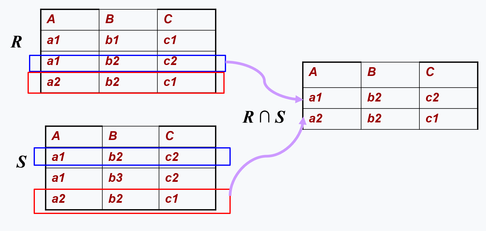
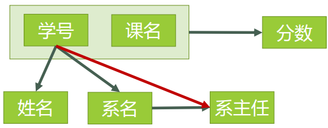
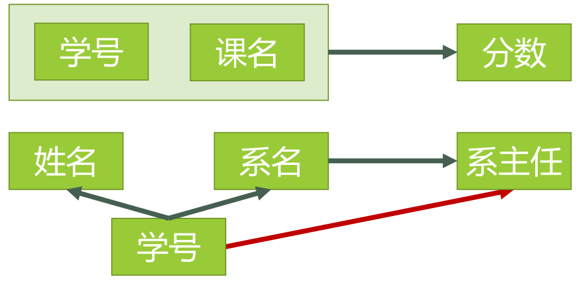

# 数据库原理

> 本文档只讲述了数据库原理的部分内容，并不全面

## 什么是数据库

数据库是电子化信息的集合，将信息规范化并使之电子化，形成电子信息'库'，以便利用计算机对这些信息进行快速有效的存储、检索、统计与管理。

数据库起源于规范化“表（table）“的处理。Table：以按行按列形式组织及展现的数据。

下面是表的构成，其中的术语一定要把握。表是一批相互有关联关系的数据的集合。

下面是数据库的构成。数据库是相互之间有关联关系的表的集合。

当然，上面都是由表形式构成的数据库，叫关系数据库。也有非关系数据库，比如图像数据库，工程数据库等。

## 什么是数据库系统

数据库系统(DBS)是由以下5个要素构成的，是一个大的工作环境。下面是抽象化的数据库系统。

下面是实例化的数据库系统。

> 这边让我想到了结构主义和自然主义

### 用户角度看数据库管理系统的功能

1. 数据库定义:定义数据库中桌子的名称、标题(内含的属性名称及对该属性的值的要求)等 

   - DBMS提供一套数据定义语言（DDL）给用户 
   - 用户使用DDL描述其所要建立表的格式 
   - DBMS依照用户的定义，创建数据库及其中的Table
   - 

2. 数据库操纵:向数据库的Table中增加/删除/更新数据及对数据进行查询、检索、统计等 

   - DBMS提供一套数据操纵语言（DML）给用户
   - 用户使用DML描述其所要进行的增、删、改、查等操作 
   - DBMS依照用户的操作描述，实际执行这些操作
   - 

3. 数据库控制:控制数据库中数据的使用，哪些用户可以使用，哪些不可以 

   - 数据库管理系统提供一套数据控制语言（DCL）给用户 
   - 用户使用DCL描述其对数据库所要实施的控制 
   - 数据库管理系统依照用户的描述，实际进行控制
   - 

4. 数据库维护:转储/恢复/重组/性能监测/分析.. 

   - 数据库管理系统提供一系列程序(实用程序/例行程序)给用户 
   - 在这些程序中提供了对数据库维护的各种功能 
   - 用户使用这些程序进行各种数据库维护操作

   数据库维护的实用程序,一般都是由数据库管理员（DBA）来使用和掌握的。

   

### 数据库语言

数据库语言：使用者通过数据库语言利用DBMS操作数据库。

SQL语言：结构化的数据库语言，下面是SQL语言包含的数据库语言。

- 数据定义语言（DDL:Data Definition Language），DBMS提供给用户，以使用户定义数据格式
- 数据操纵语言（DML:Data Manipulation Language），DBMS提供给用户，以使用户对数据进行操作
- 数据控制语言（DCL:Data Control Language），DBMS提供给用户，以便用户对数据进行控制

数据库各种操作的执行：DBMS按用户要求进行定义、操纵、控制和维护。

数据库语言与高级语言：一条数据库语言语句相当于高级语言的一个或多个循环程序，如

数据库语言（标准的：SQL语言）：Select 学号，姓名 From 学生登记表 Where 性别 = '男'；

高级语言：For K=1 to 最后一条记录
						读第K条记录
						If 性别 = ‘男’ 	then
							显示第K条记录
						Endif
					Next K

> 数据库语言也可以嵌入到高级语言(宿主语言)中使用，如嵌入式数据库语言(SQL语句嵌入到某一种高级语言中)。

### 从系统实现角度看数据库管理系统的功能

DBMS为完成DB管理，在后台运行着一系列程序：

- 语言编译器：将用数据库语言书写的内容，翻译成DBMS可执行的命令。例如：DDL编译器，DML编译器，DCL编译器等。
- 查询优化（执行引擎）与查询实现（基本命令的不同执行算法）：提高数据库检索速度的手段；例如贯穿于数据存取各个阶段的优化程序。
- 数据存取与索引：提供数据在磁盘、磁带等上的高效存取手段。例如：存储管理器，缓冲区管理器，索引/文件和记录管理器等。
- 通信控制：提供网络环境下数据库操作与数据传输的手段。
- 等等.....

## 数据模型

数据模型：用来描述数据、组织数据和对数据进行操作，是对现实世界数据特征的描述。计算机不能直接处理现实的事物，所以，人们只有将现实事物转成数字化的数据，才能让计算机识别处理。

数据模型按不同的应用层次分成三种类型：分别是概念数据模型、逻辑数据模型、物理数据模型。

### 概念数据模型

**概念模型是对现实世界的一种概念结构的描述**。

概念模型（Conceptual Data Model），是一种面向用户、面向客观世界的模型，主要用来描述世界的概念化结构，它是数据库的设计人员在设计的初始阶段，摆脱计算机系统及DBMS的具体技术问题，集中精力分析数据以及数据之间的联系等，与具体的数据管理系统（Database Management System，简称DBMS）无关。

概念模型用于信息世界的建模，一方面应该具有较强的语义表达能力，能够方便直接表达应用中的各种语义知识，另一方面它还应该简单、清晰、易于用户理解。

#### 概念

##### 实体(Entity)

客观存在并可相互区别的客观事物或抽象事件称为实体。

>  就好比你脑海中对一个东西或事物的反映，实体可以指人，如一名学生、一名工人等；也可以指东西，如一台电脑、一个桌子、一个杯子等，实体不仅可以指实际的事物，还可以指抽象的事物，如一次拜访、一次野餐、购物、演出、篮球赛等，甚至还可以指事物与事物之间的联系，如“学生选课记录”和“用户订餐记录”等。

##### 属性(Attribute)

属性是指实体所具有的某一方面的特性，一个实体可以有多个属性来描述。

> 例如，学生的属性有姓名、年龄、性别、学院等。

##### 属性值

属性所取的具体值称作属性值。

> 例如，一名学生，其中一个属性 “姓名” 的取值 为 “张三”

##### 域(Domain)

一个属性可能取的所有属性值的范围称为该属性的域

> 例如，教师属性“性别”的域为男、女；教师属性“职称”的域为助教、讲师、副教授、教授等

> 由此可见，每个属性都是个变量，属性值就是变量所取的值，而域则是变量的变化范围
> 因此，属性是表征实体的最基本的信息

##### 码(key)

也叫候选码，能唯一标识实体的属性值称为码。当有多个码时，可以选出一个作为主码，是常用的候选码。

> 例如学号这个属性集就是学生实体集的码。

##### 实体型(Entity Type)

具有相同属性的实体必然具有共同的特性和性质，用实体名及其属性名集合来抽象和刻画同类实体，称为实体型。

> 例如，学生（姓名，年龄，性别，学院）就是一个实体型

##### 实体集(Entity Set)

同一类型实体的集合成为实体集。

> 例如，某一学校中的学生具有相同的属性，他们就构成了实体集 “学生”

#### 联系

现实世界中事物彼此的联系在概念模型中反映为实体间的联系。实体之间的联系通常是指不同实体集之间的联系。实体之间的联系有一对一、一对多和多对多等多种类型。

实体内部的联系通常是指组成实体的各属性之间的联系，实体之间的联系通常是指不同实体集之间的联系。

##### 一对一

对于实体集A中的每一个实体，实体集B中至多有一个（也可以没有）实体与之联系，反之亦然，则称实体集A与实体集B具有一对一联系，记为1∶1。

> 学校里，实体集班级与实体集班长之间的就具有1：1联系，一个班级只有一个班长，而一个班长只在一个班中任班长职务

##### 一对多

对于实体集A中的每一个实体，实体集B中有n个实体（n≥0）与之联系，反之，对于实体集B中的每一个实体，实体集A中至多只有一个实体与之联系，则称实体集A与实体集B有一对多联系，记为1∶n。

> 例如，实体集班级与实体集学生就是一对多联系，因为一个班级中有若干名学生，而每个学生只在一个班级中学习。

##### 多对多

对于实体集A中的每一个实体，实体集B中有n个实体（n≥0）与之联系，反之，对于实体集B中的每一个实体，实体集A中也有m个实体（m≥0）与之联系，则称实体集A与实体集B具有多对多联系，记为m∶n。

> 实体集课程与实体集学生之间的联系是多对多联系（m：n），因为一个课程同时有若干名学生选修，而一个学生可以同时选修多门课程。

#### E-R图

E-R图提供了表示实体型、属性和联系的方法。

实体型：用矩形表示，矩形框内写明实体名。

属性：用椭圆形表示，并用直线将其与相应的实体型连接起来。

联系：用菱形表示，菱形框内写明联系名，并用直线分别与有关实体型连接起来，同时在直线旁标上联系的类型，一对一为1:1，一对多为1:n，多对多为m:n。（联系可以具有属性）

- 两个实体的联系示意图：
- 三个实体联系示意图：
- 单个实体型内的联系示意图：

##### 例子

某个工厂物资管理的概念模型。物资管理涉及的实体及属性有：

- 仓库属性有：仓库号、面积、电话号码
- 零件属性有：零件号、名称、规格、单价、描述
- 供应商属性有：供应商号、姓名、地址、电话号码、账号
- 项目属性有：项目号、预算、开工日期
- 职工属性有：职工号、姓名、年龄、职称

实体之间的联系有：

1.  一个仓库可以存放多种零件，一种零件可以存放在多个仓库中，因此仓库和零件具有多对多的联系。用库存量来表示某种零件在某个仓库中的数量。
2.  一个仓库有多个职工当仓库保管员，一个职工只能在一个仓库工作，因此仓库和职工之间是一对多的联系。
3.  职工之间具有领导与被领导关系。即仓库主任领导若干保管员，因此职工实体型中具有一对多的联系。
4.  供应商、项目和零件三者之间具有多对多的联系。即一个供应商可以供给若干项目多种零件，每个项目可以使用不同供应商供应的零件，每种零件可由不同供应商供给。

### 逻辑数据模型

**逻辑模型是计算机系统上一种逻辑结构的描述**。

逻辑数据模型是严格定义的一组概念的集合，精确描述系统的静态、动态特性和完整性约束条件。通常由数据结构，数据操作和数据完整性约束条件组成。

共有六种层次模型：（Hierarchical Model） 网状模型（Network Model） 关系模型（Relational Model） 半结构化数据模型（Semistructured-data Model） 面向对象模型（Object Oriented Model） 对象关系模型（Object Relational Model）。

目前常用的数据模型有三种：层次模型、网状模型、关系模型，其中层次模型和网状模型统称为非关系模型。

#### 组成

##### 数据结构

数据结构描述数据库的组成对象以及对象之间的联系。例如表与表之间的关系。

数据结构是刻画一个数据模型性质最重要的方面，是对系统静态特性的描述。

人们通常按照数据结构的类型来命名数据模型，如层次结构、网状结构、关系结构的数据模型分别命名为层次模型、网状模型、关系模型。

##### 数据操作

是指对数据库里的各种对象的实例、型的值，允许执行的操作的集合，包括操作及有关的操作规则。

数据操作用于描述系统的动态特征

数据库主要有检索和修改（包括插入、删除、更新）两大类操作，数据模型必须定义这些操作的确切含义、操作符号、操作规则（如优先级）以及实现操作的语言

##### 数据的完整性约束条件

数据的完整性约束条件是一种完整性规则的集合

完整性规则是给定的数据模型中数据及其联系所具有的制约和储存规则，用以限制符合数据模型的数据库状态以及状态的变化，用以确保数据的正确、有效和相容

#### 分类

##### 层次模型

**基本概念**

用树型结构来表示实体之间联系的模型称为层次模型。构成层次模型的树是由结点和连线组成的，结点表示实体集（文件或记录型），连线表示相连两个实体之间的联系，**这种联系只能是一对一，一对多的**。

通常把表示“一”的实体放在上方，称为父结点，而把表示“多”的实体放在下方，称为子结点。根据树结构的特点，建立数据的层次模型需要满足下列两个条件：

- 有且仅有一个结点没有父结点，这个结点即为树根结点
- 其他数据记录有且仅有一个父结点

层次模型的例子：

**特点**

层次模型的一个基本的特点是，任何一个给定的记录值只有按其路径查看时，才能现出它的全部意义，无一个子女记录值能够脱离双亲记录值而独立存在。

层次模型最明显的特点是层次清楚、构造简单以及易于实现，它可以很方便地表示出一对一和一对多这两种实体之间的联系。

**优点**

- 层次模型的数据结构比较简单；
- 层次数据库的查询效率高；
- 因记录间的联系用有向边表示，在DBMS中用指针来实现，路径明确，快速

**缺点**

- 对于非层次性的，如多对多联系、一个结点具有多个双亲等，层次模型表示这类联系就很难受，只能通过引入冗余数据（易产生不一致性）或创建非自然组织（引入虚结点）来解决
- 对插入和删除操作的限制比较多
- 查询子结点必须通过双亲结点
- 由于结构严密，层次命令趋于程序化

##### 网状模型

**基本概念**

网状模型和层次模型在本质上是一样的，简单对比分析一下：

- 从逻辑上看它们都是用连线表示实体之间的联系，用结点表示实体集
- 从物理上看，层次模型和网络模型都是用指针来实现两个文件之间的联系
- 其差别仅在于网状模型中的连线或指针更加复杂，更加纵横交错，从而使数据结构更复杂

网状模型去掉了层次模型的两个限制（下面的 ① ② 点），所以它是一种比层次模型更具普遍性的结构，在数据库中，把满足以下条件的基本层次联系集合称为网状模型：

- ① 允许多个结点没有双亲结点
- ② 一个节点可以有多于一个双亲节点
- ③ 允许两个节点之间有多种联系

网状模型可以直接表示实体之间多对多的联系。

**优点**

- 能够更为直接地描述现实世界，如一个结点可以有多个双亲
- 具有良好的性能，存取效率较高

**缺点**

- 结构比较复杂，而且随着应用环境的扩大，数据库的结构就变得越来越复杂，不利于用户最终掌握
- 其DDL，DML语言复杂，用户不容易使用

##### 关系模型

**基本概念**

关系模型是现在非常流行的一种数据模型，市面上使用的数据库管理系统基本上都是关系型数据库，关系模型是用表格数据来表示实体本身及其相互之间的联系的。

- 在用户观点下，关系模型中数据的逻辑结构是一张二维表，它由行和列组成
- 关系既可以表示实体也可以用来描述实体间的联系

> 在关系模型中，把数据看成一个二维表，每一个二维表称为一个关系；关系表中的每一列称为属性，相当于记录中的一个数据项，对属性的命名称为属性名；表中的一行称为一个元组，相当于记录值。

对于表示关系的二维表，其最基本的要求是(第一范式)，表中元组的每一个分量必须是不可分的数据项，即不允许表中再有表，如下图

**优点**

- 关系模型的概念单一，数据结构比较简单，实体与实体间的联系均用关系来表示，因此，数据的结构比较简单、清晰
- 具有很高的数据独立性。在关系模型中，用户完全不涉及数据的物理存放，只与数据本身的特性发生关系。因此，数据独立性很高
- 可以直接处理多对多的联系。在关系模型中，由于使用表格数据来表示实体之间的联系，因此，可以直接描述多对多的实体联系。
- 建立在严格的数学概念基础上，也有着坚实的理论基础

**缺点**

- 最主要的缺点是，查询效率往往不如非关系数据模型。
- 为提高效率，关系数据库管理系统必须对用户的查询请求进行优化，这样增加了开发RDBMS(关系型数据库)的难度。

##### 半结构化模型

**基本概念**

半结构数据是“无模式”的，数据是自描述（self describing）的，数据携带了关于其模式的信息，模式可以随着时间在单一数据库内任意改变，易于修改和变化。它是一种适于数据库集成（integration）的数据模型，适于描述包含在两个或多个数据库（这些数据库含有不同模式的相似数据）中的数据。，它也是一种标记服务的基础模型，适于在Web上共享信息。

**特点**

半结构化数据类似树或图

- 叶子结点（leaf）与具体数据相关，数据的类型可以是任意原子类型，如数字和字符串。
- 内部结点（interior）至少都有一条向外的弧。每条弧都有一个标签（label）,该标签指明弧开始处的结点与弧末的结点之间的关系
- 要有一个根（root）结点，它代表整个数据库，每个结点都从根可达。

XML 适合存储半结构化数据。

##### 面向对象数据模型

**基本概念**

面向对象数据模型，吸收了概念数据模型和知识表示模型的一些基本概念，同时又借鉴了面向对象程序设计语言和抽象数据类型的一些思想，是一种可扩充的数据模型。 面向对象数据模型的基本概念是对象和类。

现实世界的任意实体都是对象，一个对象可以包含多个属性，用来描述对象的状态、组成和特性。

对象还包括若干方法，用以描述对象的行为特性，通过方法可以改变对象的状态，对对象进行各种数据库操作。对象是封装的，对象之间的通信是通过消息传递来实现的，即消息从外部传递给对象，存取和调用对象中的属性和方法，在内部执行要求的操作，操作的结果仍以消息的形式返回。

**类（Class）和实例（instance）**

共享同一属性集合和方法集合的所有对象组合在一起构成了一个对象类（简称为类），一个对象是某一类的一个实例。 例如，学生是一个类，具体的某个学生，例如张三是学生类中的一个对象，在数据库系统中有“型”和“值”的概念，而在面向对象数据模型中，“型”就是类，对象是某个类的“值”。

类属性的定义域可以为基本类，如字符串、整数、布尔型，也可以为一般类，即包括属性和方法的类一个类的属性也可以定义为这个类自身。

**类层次（Class hierarchy）**

面向对象数据模型中，类的子集称为该类的子类，该类称为子类的超类。子类还可以有子类，也就是类可以有嵌套结构

系统中所有的类组成了一个有根的有向无环图，称为类层次

一个类可以从类层次的直接或间接祖先那里继承所有的属性和方法，用这个方法实现了软件的可重用性

### 物理数据模型

**物理模型则是与具体的计算机物理介质直接关联的一种结构化的表达**。

物理模型，是面向计算机物理表示的模型，描述了数据在储存介质上的组织结构，它不但与具体的DBMS有关，而且还与操作系统和硬件有关。每一种逻辑数据模型在实现时都有起对应的物理数据模型。DBMS为了保证其独立性与可移植性，大部分物理数据模型的实现工作由系统自动完成，而设计者只设计索引、聚集等特殊结构。

物理模型跟逻辑模型的区别就是，逻辑模型并不指出特定的数据存储，仅限于系统逻辑上的描述。物理模型是逻辑模型在具体存储介质上的表现，直接与具体的数据库管理系统或存储介质相关的数据模型。物理模型给出了在数据库系统的字段名称，与具体数据库管理系统相关的数据类型的定义。而逻辑模型与具体的数据库管理系统或存储介质无关，仅为使用计算机系统概念中的一种逻辑结构。

## 三级模式和二级映像

ANSI-SPARC体系结构，即三级模式结构（或称为三层体系结构）。ANSI-SPARC最终没有成为正式标准，但它仍然是理解数据库管理系统的基础。三级模式是指数据库管理系统从三个层次来管理数据，分别是外部层（External Level）、概念层（Conceptual Level）和内部层（Internal Level）。这三个层次分别对应三种不同类型的模式，分别是外模式（External Schema）、概念模式（Conceptual Schema）和内模式（Internal Schema）。在外模式与概念模式之间，以及概念模式与内模式之间，还存在映像，即二级映像，具体如图所示。

在上图中，外模式面向应用程序，描述用户的数据视图（View）；内模式（又称为物理模式、存储模式）面向物理上的数据库，描述数据在磁盘中如何存储；概念模式（又称为模式、逻辑模式）面向数据库设计人员，描述数据的整体逻辑结构。

### 例子

下面将计算机中常用的Excel电子表格类比成数据库，并假设有一个商城使用电子表格来保存商品信息。

#### 三级模式

##### 概念模式

概念模式类似于表格的列标题，它描述了商品表中包含哪些信息，如图所示。表的横向称为行，纵向称为列，第一行就是列标题，用来描述该列的数据表示什么含义。实际上，概念模式在数据库中描述的信息还有很多，如多张表之间的联系、表中每一列的数据类型和长度等。

##### 内模式

在将Excel表格另存为文件时，可以选择保存的文件路径、保存类型（如XLS、XLSX、CSV等格式）等，这些与存储相关的描述信息相当于内模式。在数据库中，内模式描述数据的物理结构和存储方式，如堆文件、索引文件、散列（Hash）文件等。

##### 外模式

在打开一个电子表格后，默认会显示表格中所有的数据，这个表格称为基本表。在将数据提供给其他用户时，出于权限、安全控制等因素的考虑，只允许用户看到一部分数据，或不同用户看到不同的数据，这样的需求就可以用视图来实现。下图是视图和基本表的关系。

在图中，基本表中的数据是实际存储在数据库中的，而视图中的数据是查询或计算出来的。由此可见，外模式可以为不同用户的需求创建不同的视图，且由于不同用户的需求不同，数据的显示方式也会多种多样。因此，一个数据库中会有多个外模式，而概念模式和内模式则只有一个。

#### 二级映像

通过前面的分析可知，三级模式是数据的三个抽象级别，每个级别关心的重点不同。为了使三级模式之间产生关联，数据库管理系统在三级模式之间提供了二级映像功能。二级映像是一种规则，它规定了映像双方如何进行转换。通过二级映像，体现了逻辑和物理两个层面的数据独立性。具体解释如下。

##### 外模式/概念模式映像

外模式/概念模式映像体现了**逻辑独立性**。逻辑独立性是指当修改了概念模式，不影响其上一层的外模式。例如，将图1-4中基本表的“库存”和“销量”拆分到另一张表中，此时概念模式发生了更改，但可以通过改变外模式/概念模式的映像，继续为用户提供原有的视图，如图所示。

由此可见，逻辑独立性能够让使用视图的用户感觉不到基本表的改变。其实，逻辑独立性带来的好处还有很多。

##### 概念模式/内模式映像

概念模式/内模式映像体现了**物理独立性**。物理独立性是指修改了内模式，不影响其上层的概念模式和外模式。例如，在Excel中将.xls文件另存为.xlsx文件，虽然更换了文件格式，但是打开文件后显示的表格内容一般不会发生改变。在数据库中，更换更先进的存储结构，或者创建索引以加快查询速度，内模式会发生改变。此时，只需改变概念模式/内模式映像，就不会影响到原有的概念模式。

另外，物理独立性使得用户不必了解数据库内部的存储原理，即可正常使用数据库来保存数据。数据库管理系统会自动将用户的操作转换成物理级数据库的操作。

## 关系运算

### 关系模型概念

#### 关系（R）

现实中实体与实体间的各种联系均用关系来表示。

定义：满足一定语义的D1×D2×…×Dn的子集叫作在域D1、D2、…、Dn上的关系。

例子：D1为学生集合= {张山，李斯，王武}；D2为性别集合= {男，女}；D3为年龄集合= {19，20}

用二维表的形式表示D1×D2×D3，则为下表格，则有12个元组

**姓名性别年龄**张山男19张山女19张山男20张山女20李斯男19李斯女19李斯男20李斯女20王武男19王武女19王武男20王武女20

#### 属性（U）

若关系对应了一个实体，关系的属性就是所要描述的实体对象的属性，即实体所对应的事物对象的特征，例如姓名，性别，年龄

在同一关系中，属性名不能相同，但不同的属性可以有相同的域。

#### 域（D）

一个属性可能取的所有属性值的范围称为该属性的域，即取值范围

- 不同的属性可以有相同的域

- 第一范式条件：

  - 属性值不能在系统里被划分成若干个部分

  - 属性不能是多值属性
  - 不能在同一元组的同一属性上有多个值

- 支持什么样的数据类型与是否支持关系模型是无关的

#### 属性的类型和长度（Dom）

例如：姓名 是字符型 长度为2字符

#### 候选码（码）

若关系中的某一属性组的值能唯一地标识一个元组，而其子集不能，则称该属性组为候选码。

- 关系实例上任何两个元组的值在候选键的属性（集）上取值不同
- 构成候选键的属性（集）的值对于关系的所有实例都具有惟一性，而不是只针对某一个实例
- 通常在关系模式中在构成候选键的属性（集）下面画下划线，来表明它是键的组成部分 学生（姓名，性别，年龄）

##### 主码

若一个关系中有多个候选码，则选定其中一个为主码。

##### 外码

若关系R的一个属性（集）F与关系S的主键Ks对应，即关系R中的某个元组的F上的分量值也是关系S中某个元组的Ks上的分量值，则称该属性（集）F为关系R的外键

- R为参照关系（引用关系），S为被参照关系或目标关系
- 关系R和关系S可以是同一个关系
- 目标关系的主键Ks和参照关系R的外码F的命名可以不同，但必须定义在同一（或同一组）域上

#### 关系模式/关系型

关系模式：关系模式是型，关系是值，关系模式是对关系的描述。

定义关系模式的方法：R（U, D, Dom, F）

- R：关系名
- U：组成该关系的属性集合
- D：属性组U中属性所来自的域
- Dom：属性向域的映像的集合
- F：属性间数据的依赖关系集合

例如，设有一个关系R有属性值A,B,C，则关系模式可简单描述为R(U)或R(A,B,C)。R为关系名A,B,C是属性名。

> 域名及属性向域的映像常常直接说明为属性的类型、长度

> 关系和关系模式的联系与区别：
>
> - 联系：关系模式是对关系的描述，关系是关系模式在某一时刻的状态或内容。关系模式和关系往往笼统称为关系
> - 区别：关系模式是静态的、稳定的，而关系时动态的、随时间不断变化的。

#### 关系实例

定义：一个给定关系的某一时刻的元组的集合，即当前关系的值。

关系模式是关系的型的描述，是静态的、稳定的

关系实例(值)是关系的“当前”元组的集合，是动态的、随时间不断变化的，其变化通过关系的元组的改变表现出来

### E-R图转关系模型

> 注：斜体为该关系的码(主码、组合码)

#### 1:1

方法一：

将1:1联系转换为一个独立的关系：与该联系相连的各实体的码以及联系本身的属性均转换为关系的属性，且每个实体的码均是该关系的候选码。在两个实体任选一个做主键即可。

联系形成的关系独立存在：职工（*职工号*，姓名，年龄）	产品（*产品号*，产品名，价格）  	负责（*职工号*，产品号）

方法二：

将1:1联系与某一端实体集所对应的关系合并，则需要在被合并关系中增加属性，其新增的属性为联系本身的属性和与联系相关的另一个实体集的码。

“负责”与“职工”两关系合并：职工（*职工号*，姓名，年龄，产品号）	产品（*产品号*，产品名，价格）

也可以“负责”与“产品”两关系合并：职工（*职工号*，姓名，年龄）	产品（*产品号*，产品名，价格，职工号）

#### 1:N

方法一：

一种方法是将联系转换为一个独立的关系，其关系的属性由与该联系相连的各实体集的码以及联系本身的属性组成，而该关系的码为n端实体集的码。

联系形成的关系独立存在：仓库（*仓库号*，地点，面积）	产品（*产品号*，产品名，价格）	仓储（*产品号*，仓库号，数量）

方法二：

在n端实体集中增加新属性，新属性由联系对应的1端实体集的码和联系自身的属性构成，新增属性后原关系的码不变。

仓库（*仓库号*，地点，面积）   

产品（*产品号*，产品名，价格，仓库号，数量）

#### N:M

与该联系相连的各实体集的码以及联系本身的属性均转换为关系的属性，新关系的码为两个相连实体码的组合（该码为多属性构成的组合码）。

转换的关系模型为：学生（*学号*，姓名，年龄，性别）	课程（*课程号*，课程名，学时数）	选修（*学号，课程号*，成绩）

#### 1:M:N

对于一对多的联系，转换为关系模型的方法是修改n端实体集对应的关系，即将与联系相关的其他1端实体集的码和联系自身的属性作为新属性加入到n端实体集中

课程（*课程号*，课程名，学分，学时）	教师（*教师号*，教师名，性别，职称，课程号）	参考书（*书号*，书名，出版社，主编，课程号）

#### M:N:P

对于多对多的联系，转换为关系模型的方法是新建一个独立的关系，该关系的属性为多元联系相连的各实体的码以及联系本身的属性，码为各实体码的组合。

供应商（*供应商号*，供应商名，地址）	零件（*零件号*，零件名，单价）	产品（*产品号*，产品名，型号）	供应（*供应商号，零件号，产品号*，数量）

#### 例子

这是一份关于商店商品仓库的ER图。

先看仓库和商品之间是M:N的关系，于是我们首先想到的应该是把联系“库存”转换为库存实体：库存 （仓库号，商品号，日期，库存量）然后是商品实体和仓库实体：商品（商品号，商品名，单价），仓库（仓库号，仓库名，地址）。

除此之外仓库和商品还有一个供应关系，同样是M:N关系：供应 （仓库号，商品号 ，月份，月供应量）。

在上图的商店和仓库之间的关系可能写漏了，但是它们应该也是M:N的关系，一个商店可以被多个仓库供应，一个仓库也可以供应多个商店。上面已经创建了供应实体，现在只需在供应实体中假如商店号即可，也就是商店实体的主键：供应（仓库号，商品号，商店号 ，月份，月供应量），商店（商店号，商店名，地址）

### 关系代数运算

选择，投影，并，差，笛卡尔积是5个基本操作，其他操作可由这5种操作导出。

#### 并（Union）

并（A∪B）。A∪B的结果既包含A中的元组，也包含B中的元组。

#### 差（Difference）

并（A-B）。A-B的结果包含了所有属于A但不属于B的元组。

#### 广义笛卡尔积（Extended Cartesian Product）

给定一组域D1，D2，…，Dn，它们的笛卡尔积为：D1×D2×…×Dn＝{（d1，d2，…，dn）｜di属于(符号打不出)Di，i＝1，2，…，n}。

**例**：

有三个域：*D*1=导师 ={ 张清玫，刘逸 }  	*D*2=专业={计算机专业，信息专业}	 *D*3=研究生={李勇，刘晨，王敏}

则*D*1，*D*2，*D*3的笛卡尔积为：*D*1×*D*2×*D*3 ＝｛(张清玫，计算机专业，李勇)，(张清玫，计算机专业，刘晨)， (张清玫，计算机专业，王敏)，(张清玫，信息专业，李勇)， (张清玫，信息专业，刘晨)，(张清玫，信息专业，王敏)， (刘逸，计算机专业，李勇)，(刘逸，计算机专业，刘晨)， (刘逸，计算机专业，王敏)，(刘逸，信息专业，李勇)， (刘逸，信息专业，刘晨)，(刘逸，信息专业，王敏) ｝

#### 投影（Projection）

从关系R中选择出若干属性列组成新的关系，投影操作是对列的筛选

**例：**

#### 选择（Selection）

在关系R中选择满足给定条件F的诸元组，选择运算是对行的筛选

**例**：

#### 交

交（A∩B）。A∩B的结果只包含同属于A、B的元组。

#### 连接

连接也称为θ连接，连接运算的含义：从**两个关系的笛卡尔积**中选取**满足**一定**条件**的**元组**，记作：R )((F)   S（符号打不出来，就是平放的8，F放在8下面），F表示连接条件，是一个R中和S中的属性之间的关系表达式或逻辑表达式。

**等值连接（equijoin） (不等值连接)**

从关系*R*与*S*的广义笛卡尔积中选取*A*、*B*属性值相等的那些元组，即等值连接为： R )((A=B) S

**自然连接（Natural join）**

两个关系中进行比较的分量必须是相同的属性组,并在结果中把重复的属性列去掉，R和S具有相同的属性组 R )( S

## 关系完整性与关系规范化

### 关系完整性(数据完整性)

要想了解这三类完整性约束首先要了解什么是数据完整性。数据完整性是指数据库中存储的数据是有意义的或正确的，和现实世界相符。关系模型中三类完整性约束：

- 实体完整性（Entity Integrity）
- 参照完整性（Referential Integrity）
- 用户定义的完整性（User-defined Integrity） 

实体完整性和参照完整性是关系模型必须满足的完整性约束条件，被称作是关系的两个不变性，应该由关系系统自动支持

#### 实体完整性

保证关系中的每个元组都是可识别的和惟一的，指关系数据库中所有的表都必须有主键，而且表中不允许存在如下记录：

- 无主键值的记录
- 主键值相同的记录

原因：实体必须可区分

例如：下图就出现了主键值（学号是主键）重复的情况。当在表中定义了主键时，数据库管理系统会自动保证数据的实体完整性，即保证不允许存在主键值为空的记录以及主键值重复的记录。

#### 参照完整性

也称为引用完整性，现实世界中的实体之间往往存在着某种联系，在关系模型中，实体以及实体之间的联系都是用关系来表示的，这样就自然存在着关系与关系之间的引用。参照完整性就是描述实体之间的联系的。参照完整性一般是指多个实体或关系之间的关联关系。此完整性涉及到了外键：参照完整性规则就是定义外键与被参照的主键之间的引用规则。

外键一般应符合如下要求：

- 值为空
- 等于其所参照的关系中的某个元组的主键值

#### 用户定义完整性

也称为域完整性或语义完整性，是针对某一具体应用领域定义的数据约束条件，反映某一具体应用所涉及的数据必须满足应用语义的要求
，实际上就是指明关系中属性的取值范围，防止属性的值与应用语义矛盾。关系模型应提供定义和检验这类完整性的机制，以便用统一的系统方法处理它们，而不要由应用程序承担这一功能。

### 关系规范化

关系模式有好坏之分，一个不好的关系模式存在以下问题：

- 信息数据冗余太大
- 插入异常
- 删除异常
- 更新异常

对于存在问题的关系模式，可通过模式分解的方法使之规范化。如何改造一个关系模式，就是规范化理论所要讨论的问题。

#### 范式

关系数据库中的关系满足一定要求的，满足不同程度要求的为不同的范式。满足最低要求的叫第一范式，简称1NF；在第一范式的基础上满足进一步要求的称为第二范式，简称2NF，其余范式以此类推。按照教材中的定义，范式是“符合某一种级别的关系模式的集合，表示一个关系内部各属性之间的联系的合理化程度”。实际上你可以把它粗略地理解为“一张数据表的表结构所符合的某种设计标准的级别”。就像家里装修买建材，最环保的是E0级，其次是E1级，还有E2级等等。

数据库范式也分为1NF，2NF，3NF，BCNF，4NF，5NF。一般在我们设计关系型数据库的时候，最多考虑到BCNF就够。符合高一级范式的设计，必定符合低一级范式，例如符合2NF的关系模式，必定符合1NF。

“关系模式”和“关系”的区别，类似于面向对象程序设计中”类“与”对象“的区别。”关系“是”关系模式“的一个实例，你可以把”关系”理解为一张带数据的表，而“关系模式”是这张数据表的表结构。

##### 第一范式 1NF

**定义：** 属于第一范式关系的所有属性都不可再分，即数据项不可分。

**理解：** 第一范式强调数据表的原子性，是其他范式的基础。如下图所示数据库就不符合第一范式。

实际上，1NF是所有关系型数据库的最基本要求，你在关系型数据库管理系统（RDBMS），例如SQL Server，Oracle，MySQL中创建数据表的时候，如果数据表的设计不符合这个最基本的要求，那么操作一定是不能成功的。也就是说，只要在RDBMS中已经存在的数据表，一定是符合1NF的。如果我们要在RDBMS中表现表中的数据，就得设计为下表的形式：

不符合1NF的关系叫非规范化的关系，但日常生活中仅用第一范式来规范表格是远远不够的，依然会存在数据冗余过大、删除异常、插入异常、修改异常的问题，此时就需要引入规范化概念，将其转化为更标准化的表格，减少数据依赖。

###### 有问题的关系模式

关系模式有好坏之分，一个不好的关系模式存在以下问题：

1. 数据冗余过大：每一名学生的学号、姓名、系名、系主任这些数据重复多次。每个系与对应的系主任的数据也重复多次

2. 插入异常：假如学校新建了一个系，但是暂时还没有招收任何学生（比如3月份就新建了，但要等到8月份才招生），那么是无法将系名与系主任的数据单独地添加到数据表中去的。

   > 根据三种关系完整性约束中实体完整性的要求，关系中的码所包含的任意一个属性都不能为空，所有属性的组合也不能重复。为了满足此要求，图中的表，只能将学号与课名的组合作为码，否则就无法唯一地区分每一条记录。
   >
   > 关于码：
   >
   > 1. 包含在任一候选码中的属性，称为主属性或码属性。
   > 2. 不包含在任何候选码中的属性称为非主属性或非码属性。
   > 3. 最简单的情况，只有单个属性，称单码；最极端的情况，所有属性集合都是码，称全码。

3. 删除异常：假如将某个系中所有学生相关的记录都删除，那么所有系与系主任的数据也就随之消失了（一个系所有学生都没有了，并不表示这个系就没有了）。

4. 修改异常：假如李小明转系到法律系，那么为了保证数据库中数据的一致性，需要修改三条记录中系与系主任的数据。

正因为仅符合1NF的数据库设计存在着这样那样的问题，我们需要提高设计标准，去掉导致上述四种问题的因素，使其符合更高一级的范式（2NF），这就是所谓的“规范化”。

##### 第二范式 2NF

**定义：** 若某关系R属于第一范式，且每一个非主属性完全函数依赖于任何一个候选码，则关系R属于第二范式。

> 以下所有内容中，主码或候选码都简称为码。

###### 规范化

一个低一级的关系模式通过模式分解可以转化为若干个高一级范式的关系模式的集合，这个过程叫做规范化。

###### 主属性 

所有候选码的属性称为主属性。不包含在任何候选码中的属性称为非主属性或非码属性。

###### 函数依赖

设R(U)是属性集U上的关系模式，X、Y是U的子集。若对于R(U)的任意一个可能的关系r，r中不可能存在两个元组在X上的属性值相等，而在Y上的属性值不等，则称Y函数依赖于X或X函数确定Y。

也就是假设给定一个属性的值，就可以唯一确定（查找到）另一个属性的值。比如在设计学生表时，一个学生的学号能决定学生的姓名，也可称姓名属性依赖于学号，对于现实来说，如果知道一个学生的学号，就一定能知道学生的姓名，这就是函数依赖，这种情况是姓名(Y)完全函数依赖于学号(X)。函数依赖又分为非平凡依赖，平凡依赖；从性质上还可以分为完全函数依赖、部分函数依赖和传递函数依赖。

**完全函数依赖**：设X,Y是关系R的两个属性集合，X’是X的真子集，存在X→Y，但对每一个X’都有X’!→Y，则称Y完全函数依赖于X。即如果Y函数依赖于X，且对于X的任何一个真子集X’，都没有Y函数依赖于X'，则称Y对X完全函数依赖。也就是全部的学号可以知道全部的姓名，但部分的学号无法知道所有的姓名，这就是完全函数依赖。

**部分函数依赖**：设X,Y是关系R的两个属性集合，存在X→Y，若X’是X的真子集，存在X’→Y，则称Y部分函数依赖于X。即如果Y函数依赖于X，但Y也函数依赖于X'，则称Y对X部分函数依赖。

**传递函数依赖**：设X,Y,Z是关系R中互不相同的属性集合，存在X→Y，(Y !→X)，Y→Z，则称Z传递函数依赖于X。即Y函数依赖X，Z函数依赖Y，则Z传递函数依赖X。传递函数依赖与完全函数依赖和部分函数依赖不冲突。

**平凡函数依赖**：当关系中属性集合Y是属性集合X的子集时(Y⊆X)，存在函数依赖X→Y，即一组属性函数决定它的所有子集，这种函数依赖称为平凡函数依赖。

**非平凡函数依赖**：当关系中属性集合Y不是属性集合X的子集时，存在函数依赖X→Y，则称这种函数依赖为非平凡函数依赖。

**理解(第二范式)：** 第二范式是指每个表必须有一个（有且仅有一个）数据项作为主键，其他数据项与主键一一对应，即其他数据项完全依赖于主键。由此可知单主属性的关系均属于第二范式。

判断一个关系是否属于第二范式：

1. 找出数据表中的所有码；
2. 找出所有主属性和非主属性；
3. 判断所有的非主属性对码的部分函数依赖。

例子：下图表示了表中所有的函数依赖关系

- 码只有一个，就是**（学号、课名）**。
- 主属性有两个：**学号** 与 **课名**
- 非主属性有四个：**姓名**、**系名**、**系主任**、**分数**
- 对于**（学号，课名） → 姓名**，有 **学号 → 姓名**，存在非主属性 **姓名** 对码**（学号，课名）**的部分函数依赖。
- 对于**（学号，课名） → 系名**，有 **学号 → 系名**，存在非主属性 **系名** 对码**（学号，课名）**的部分函数依赖。
- 对于**（学号，课名） → 系主任**，有 **学号 → 系主任**，存在非主属性 **系主任** 对码**（学号，课名）**的部分函数依赖(且传递函数依赖)。

所以存在非主属性对于码的部分函数依赖，最高只符合1NF的要求，不符合2NF的要求。我们必须要让非主属性完全依赖于码。

改进：为了符合2NF的要求，我们必须消除这些部分函数依赖，只有一个办法，就是将大数据表拆分成两个或者更多个更小的数据表，在拆分的过程中，要达到更高一级范式的要求，这个过程叫做”模式分解“。模式分解的方法不是唯一的，以下是其中一种方法：

选课（学号，课名，分数）、学生（学号，姓名，系名，系主任）

对于**选课**表，其码是**（学号，课名）**，主属性是**学号**和**课名**，非主属性是**分数**，**学号**确定，并不能唯一确定**分数**，**课名**确定，也不能唯一确定**分数**，所以不存在非主属性**分数**对于码 **（学号，课名）**的部分函数依赖，所以此表符合2NF的要求。

对于**学生**表，其码是**学号，**主属性是**学号**，非主属性是**姓名、系名**和**系主任**，因为码只有一个属性，所以不可能存在非主属性对于码 的部分函数依赖，所以此表符合2NF的要求。

图表示了模式分解以后的新的函数依赖关系

下表表示了模式分解以后新的数据

现在我们来看一下，进行同样的操作，是否还存在着之前的那些问题？

1. 修改异常：李小明转系到法律系，只需要修改一次李小明对应的系的值即可。——有改进
2. 数据冗余：学生的姓名、系名与系主任，不再像之前一样重复那么多次了。——有改进
3. 删除异常：删除某个系中所有的学生记录(学生表)，该系的信息仍然全部丢失。——无改进且有问题
4. 插入异常：插入一个尚无学生的新系的信息，因为学生表的码是学号，不能为空，所以此操作不被允许。——无改进且有问题

所以说，仅仅符合2NF的要求，很多情况下还是不够的，而出现问题的原因，在于仍然存在非主属性**系主任**对于码**学号**的传递函数依赖。为了能进一步解决这些问题，我们还需要将符合2NF要求的数据表改进为符合3NF的要求。

##### 第三范式 3NF

**定义：** 非主属性既不传递依赖于码，也不部分依赖于码。

**理解：** 第三范式要求在满足第二范式的基础上，任何非主属性不依赖于其他非主属性，消除了传递依赖。

接下来我们看看上表中的设计，是否符合3NF的要求。

对于**选课**表，主码为（学号，课名），主属性为**学号**和**课名，**非主属性只有一个，为分数，不可能存在传递函数依赖，所以**选课**表的设计，符合3NF的要求。

对于**学生**表，主码为**学号**，主属性为**学号**，非主属性为**姓名**、**系名**和**系主任**。因为 学号 → 系名，同时 系名 → 系主任，所以存在非主属性**系主任**对于码**学号**的传递函数依赖，所以**学生**表的设计，不符合3NF的要求。

改进：为了让数据表设计达到3NF，我们必须进一步进行模式分解为以下形式：

选课（学号，课名，分数）、学生（学号，姓名，系名）、系（系名，系主任）

对于**选课**表，符合3NF的要求，之前已经分析过了。

对于**学生**表，码为**学号**，主属性为**学号**，非主属性为**系名**，不可能存在非主属性对于码的传递函数依赖，所以符合3NF的要求。

对于**系**表，码为**系名**，主属性为**系名**，非主属性为**系主任**，不可能存在非主属性对于码的传递函数依赖（至少要有三个属性才可能存在传递函数依赖关系），所以符合3NF的要求。

新的函数依赖关系如图

新的数据表如下表

现在我们来看一下，进行同样的操作，是否还存在着之前的那些问题？

1. 删除异常：删除某个系中所有的学生记录(学生表)该系的信息不会丢失。——有改进
2. 插入异常：插入一个尚无学生的新系的信息。因为系表与学生表目前是独立的两张表，所以不影响。——有改进
3. 数据冗余：数据冗余更加少了。——有改进
4. 修改异常：——无改进但没问题

由此可见，符合3NF要求的数据库设计，**基本**上解决了数据冗余过大，插入异常，修改异常，删除异常的问题。当然，在实际中，往往为了性能上或者应对扩展的需要，经常只做到2NF或者1NF，但是作为数据库设计人员，至少应该知道，3NF的要求是怎样的。

##### BC范式 BCFN

**定义：** 关系模式R<U,F>中，若每一个决定因素都包含码，则R<U,F>属于BCFN。

**理解：** 根据定义我们可以得到结论，一个满足BC范式的关系模式有：

1. 所有非主属性对每一个码都是完全函数依赖；(第二范式)
2. 所有主属性对每一个不包含它的码也是完全函数依赖；(BC范式在第三范式的基础)
3. 没有任何属性完全函数依赖于非码的任何一组属性。(第三范式在第二范式的基础)

要了解 BCNF 范式，那么先看这样一个问题：

1. 某公司有若干个仓库；
2. 每个仓库只能有一名管理员，一名管理员只能在一个仓库中工作；
3. 一个仓库中可以存放多种物品，一种物品也可以存放在不同的仓库中。每种物品在每个仓库中都有对应的数量。

那么关系模式 仓库（仓库名，管理员，物品名，数量） 属于哪一级范式？

- 函数依赖集：仓库名 → 管理员，管理员 → 仓库名，（仓库名，物品名）→ 数量
- 码：（管理员，物品名），（仓库名，物品名）
- 主属性：仓库名、管理员、物品名
- 非主属性：数量

不存在非主属性对码的部分函数依赖和传递函数依赖。所以此关系模式属于3NF。

基于此关系模式的关系（具体的数据）可能如图所示：

既然此关系模式已经属于了 3NF，那么这个关系模式是否存在问题呢？我们来看以下几种操作：

1. 插入异常：先新增加一个仓库，但尚未存放任何物品，是否可以为该仓库指派管理员？——不可以，因为物品名也是主属性，根据实体完整性的要求，主属性不能为空。仓库和管理员相互完全依赖，只有这两个主属性无法确定实体。
2. 删除异常：某仓库被清空后，需要删除所有与这个仓库相关的物品存放记录，会带来什么问题？——仓库本身与管理员的信息也被随之删除了。因为二者相互完全依赖，所以删除管理员也是一样的。
3. 修改异常：如果某仓库更换了管理员，会带来什么问题？——这个仓库有几条物品存放记录，就要修改多少次管理员信息。

从这里我们可以得出结论，在某些特殊情况下，即使关系模式符合 3NF 的要求，仍然存在着插入异常，修改异常与删除异常的问题，仍然不是 ”好“ 的设计。

改进：造成此问题的原因：存在着**主属性**对于码的部分函数依赖与传递函数依赖。（在此例中就是存在主属性【仓库名】对于码【（管理员，物品名）】的部分函数依赖。解决办法就是要在 3NF 的基础上消除**主属性**对于码的部分与传递函数依赖。

仓库（仓库名，管理员）、库存（仓库名，物品名，数量）

这样，之前的插入异常，修改异常与删除异常的问题就被解决了。

##### 第四范式 4NF

**定义：** 限制关系模式的属性之间不允许有非平凡且非函数依赖的多值依赖。

**理解：** 显然一个关系模式是4NF，则必为BCNF。也就是说，当一个表中的非主属性互相独立时（3NF），这些非主属性不应该有多值，若有多值就违反了4NF。

###### 多值依赖

多值依赖属4NF的定义范围，比函数依赖要复杂得多。在关系模式中，函数依赖不能表示属性值之间的一对多联系，这些属性之间有些虽然没有直接关系，但存在间接的关系，把没有直接联系、但有间接的联系称为多值依赖的数据依赖。

在函数依赖中，X与Y是否存在函数依赖关系，只需考察X,Y的两组属性，与别的属性无关。而在多值依赖中，X与Y是否存在多值依赖还需看属性Z。

定义：设R(U)是属性集U上的一个关系模式。X，Y，Z是U的子集,并且Z=U-X-Y。关系模式R(U)中多值依赖X→→Y成立，当且仅当对R(U)的任一关系r,给定的一对(x，z)值有一组Y的值，这组值仅仅决定于x值而与z值无关。
平凡的多值依赖与非平凡的多值依赖：若X→→Y,而Z为空集，则称X→→Y为平凡的多值依赖；若Z不为空，则称其为非平凡的多值依赖。

举例说明：关系模式SDC ( sdept, sno, cname )

给出一对值（计算机工程系，微机原理），有一组学号与之对应，学号仅仅决定于系别， 而与课程无关，所以 sdept→→sno。同理，sdept→→cname。

##### 第五范式 5NF

第五范式有以下要求：必须满足第四范式；表必须可以分解为较小的表，除非那些表在逻辑上拥有与原始表相同的主键。

第五范式是在第四范式的基础上做的进一步规范化。第四范式处理的是相互独立的多值情况，而第五范式则处理相互依赖的多值情况。
