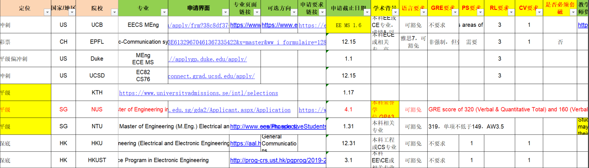

# 留学计划表

本表将使用时间线作为顺序，以大二下为起始点，使用年份加月份进行章节分类。

## 前置信息了解

美国学期时间：

- 秋季学期(Fall Semester)：通常从8月中旬或9月初开始持续到12月中旬或下旬，约4个月

- 春季学期(Spring Semester)：通常从1月中旬或2月初开始持续到5月中旬或下旬，约4个月

加拿大学期时间：

- 秋季学期(Fall Term)：通常从9月初开始至12月中旬结束，约4个月

- 冬季学期(Winter Term)：通常从1月初开始至4月中旬结束，约4个月

- 夏季学期(Summer Term)，通常从5月初开始至8月中旬结束，约3-4个月

  > 注：此学期是学生自己可选择的，大多数加拿大本科生一般会在秋季学期(9月-12月)和冬季学期(1月-4月)各修读12-15学分的课程。很多学生会利用夏季学期来参加实习、旅行或休息。只有少数学生会选择在夏季学期也修读课程,以尽快完成学业。但这种情况并不普遍。

计划项目：4+N

秋季学期也是第一学期，春季学期是第二学期。高校一般秋季学期(第一学期)为8.28-1.13，约4月半。春季学期(第二学期)为：2.26-7.13，约4月半。

## DIY

### 为什么修改项目

因为选择3+1可承受的代价已经大于它的好处，选择3+1唯一的好处就是少在国内一年，但是代价则是风险。风险包括转学分问题导致可能会变成3+n，多一年学费，因为时间紧迫造成的不充分的准备（英语成绩，大三上满课，DIY）等等。

而如果换成4+n，那么这多在国内的一年时间就十分充裕，在这一年可以充分准备英语和DIY，并且可以准备其他附加项如GRE和实习，推荐信等等。所以权衡之下，选择走4+n

### 为什么不申请中介

没必要原因如下：

1. 收费昂贵五位数的钱（据我所知美国留学好像五万起步）拿去多投几十个学校一点问题都没有
2. 不负责中介才不会全心全意帮你一个人弄申请个别中介甚至连申请人的个人信息都能填错（比如这几天就有中介把本科学校名都填错了的案例……）
3. 2019年了现在网络上到处都可以找到留学申请的资源已经不是20年前消息闭塞的年代了信息不对称正在逐渐被打破中介的重要性也不断降低
4. 你总要适应自立出了国以后万事都得靠自己diy的过程就是最好的培养自身搜索信息并做出相应判断然后解决问题的能力
5. 沟通麻烦而且服务不透明中介一般都是签合同前笑嘻嘻签完合同换一张脸甚至你也不知道你的文书和申请到底是业内资深留学顾问完成的还是中介雇的一小时40块的兼职大学生弄的（这两天看到的真实兼职广告）

### 为什么选CS而不是DS

1. 就业：CS比DS的岗位更多，更好就业
2. 个人原因：本人CS本科，相当于专业直申，比那些转码过来的更有优势
3. CS好靠DS：DS是跨专业较多的学科，CS是专业学科，一个是深度一个是广度，个人而言广度学习我更轻松，我完全可以在拥有CS的学位上往DS的知识上靠

### 知识科普

#### 申请学位

##### PHD

学术研究型的博士，全称为：Philosophic Doctor：源自拉丁语Philosophic Doctor，原指哲学博士学位，现泛指学术研究型博士学位。与“专业学位”博士相对的学术型博士，高级学衔之一，是全世界公认的学历架构中最高级的学衔。

> 美国PHD可以本科申请，跳过硕士（Master），也就是所谓的直博，但是博士录取条件高，并且需要更多的时间去读（5~6年）

##### Mphil

学术研究型硕士学位。研究硕士（英文：Master of Philosophy ，简称MPhil，又译哲学硕士、副博士）是一种学术研究型硕士学位。一般来说，课程要求学生完成研究、论文和答辩才可以颁授相关学位，是一个仅次于哲学博士(PhD)的学位。MPhil所进行的是为期二至三年的专业研究。

> 硕士时间为1~2年

##### MPS

Master of Professional Studies，意为专业研究硕士学位。在美国多为一年制硕士学位，与其他传统两年制硕士项目相比，可以节约一些学费和生活费。

MPS主要是针对某个行业或应用学科进行的交叉学科研究。MPS学位也比其他硕士学位更注重“实践”，并通常会要求完成某种形式的实习或课余工作实践，可以说是就业导向型的学位。 

MPS主要针对以下两种人群：

渴望职业晋升者：在某个行业有一定的经验，但是遇到了就业瓶颈，想要获得更多技能，选择修读MPS项目来提升自己的竞争力，获得更好职业发展的机会。

意图跨界发展者：在职人士想要通过修读MPS项目来获取其他领域所需的实践性学习和培训。

多数MPS项目不要求申请者具备工作经验，也对申请者的本科背景卡得不严，因此应届生也是可以申请MPS项目的。

美国硕士特点

美式教育比较注重实践能力，这一点也体现在硕士教育上。

美国硕士重在培养各行各业的高级应用型人才，所以只要充分掌握了实践能力，那毕业并不是什么难事。美国大多高校虽然都有关于硕士学制的规定，但有些能力优秀的同学，完全可以用1年修完1年半的项目，当然也有同学不是那么努力，所以用2年时间修完1年或1年半的项目。总之在美国读硕士，要求比较灵活，很重视培养实践能力，对于学生的个人能力有很多考验，如果是主动性比较强，也很有实践精神的同学，应该能很快适应。

##### MA

文学硕士，全称为：Master of Arts：也就是国内的文科类的专业。包括翻译，传媒，艺术，经济，管理等。文学硕士学位注重文学领域、比较文学等相关学科的交叉研究。

##### MS

理学硕士，全称为：Master of Science：也就是国内的理工科学硕。包括物理，化学，电子工程，计算机等。MS侧重于培养学生的专业水平和科研能力，对实务方面要求会低一些。学制通常是2年，其中商科MS多为1年制。

MS课程设计很有可能会有很多博士Ph.D的课程或者先修课。基本上这种项目都是Ph.D的过渡项目，因此，学生在毕业的时候很有可能需要写毕业论文。是一个非常适合过渡到Ph.D的学位。

但是有的学校提供的MS学位也是就业型导向的Professional Degree。比如说卡内基梅隆大学CMU的CS硕士项目，学生在申请前应该仔细查看学校的课程设置和培养方向，并且多和申请老师沟通。

##### MEng

全称是Master of Engineering。该学位主要是针对美国理工科专业。一般学制在1年或者2年之间。一般MEng是一个以课程为主（coursework）的学位。课程设计会偏向于业界技术和实际运用，会侧重于培养学生的实践能力。也就是说，MEng学位也是一个面向就业的学位。实际上，很多MEng的学位更是学校为了迎合某些大型企业的要求而设立的，学校会安排学生去学校合作企业进行实习，甚至有些大学会把实习放入必修学分。

拿CS专业举例，MS偏重算法，MEng偏重写码。比如UC Berkeley的EECS就开设了MS和MEng两个项目，MS可以成为博士的入门项目，而MEng则是一个强就业相关的1年项目。

##### MBA

工商行政管理硕士，Master of Business Administration：培养能够胜任工商企业和经济管理部门高层管理工作需要的务实型、复合型和应用型高层次管理人才，兼具理论与实践相结合。MBA学位由美国哈佛大学商学院（HBS）创立，并逐步被全球各大商学院认可，开设相关课程，设立相关学位。

##### LLM

法学硕士，Master of Laws：一个一年制（部分地区为两年制）的法学进阶课程，类似于中国的法学硕士学位但又有所区别，主要在英、美等普通法系国家和地区开设，属于普通法系法学教育体系中的硕士阶段。

##### MEd

教育硕士，Master of Education：具有特定教育职业背景的专业性学位，主要培养面向基础教育教学和管理工作需要的高层次人才。

##### MFA

艺术硕士Master of Fine Arts (MFA)MFA为艺术领域的硕士学位，与MA相比，更偏向于专业探索和艺术实践。课程多以艺术创作、进阶运用，专攻一个常见的艺术类型为主修。申请人一般需要递交作品集。

##### MPH

Master of Public Health，公共卫生硕士， 被称为“公共卫生行业的 MBA ”。MPH 是国际上普遍认可的公共卫生管理领域学位。 MPH 是为公共卫生部门，包括政府有关部门、疾病控制中心、医院、社区卫生机构等培养高素质、复合型、应用型的高层次公共卫生专门人才，特别是培养卫生项目管理、卫生防疫管理和医院管理等方面高级人才。

MPH 属于一种**职业学位**，本身不强调科研能力的培养，而更**注重训练学生的管理和实践能力，培养分析和解决实际公共卫生问题的方法**。

##### JD

Juris Doctor（以下简称JD）是广泛存在于美国、加拿大、澳大利亚等国 [1] 的一种法律职业类文凭证书。

攻读一般需要三年时间，申请人通常为物理、化学、生物、会计、管理、新闻、社会学等基础学科背景的学生。美国本国非法学背景学生基本上以读职业法律博士JD（Juris Doctor）为主。这也就意味着“JD”在美国是第一法学位。

任何专业任何背景的学生都要获得学士学位都可以申请JD。美国前总统克林顿和前任总统奥巴马分别为耶鲁和哈佛的JD，前总统克林顿的妻子希拉里·克林顿也拥有耶鲁的JD学位。法律博士（JD）和医学博士（MD）也被认为是美国学费较为昂贵和工资待遇较高的两个学位。

##### BS

BS是Bachelor of Science的缩写，即理学学士。理学士学位使学生更专注于专业方向内的某一领域，因此总体来说比文学士学位要求学分更多。理学士学位对学生在特定领域研究深度要求更高，学生少有选择非本专业课程的机会，往往是诸如工程学、科技、数学、计算机科学、护理学及生物化学等学科，尽管如此，许多学校也提供其他特定领域的理学士学位，诸如东北大学就提供音乐方向的音乐产业理学士学位。

> 学士是学位，对应本科学历

##### BA

BA是Bachelor of Arts的缩写，即文学学士。文学士学位要求学生在专业方向内涉猎更广，要求学生选择诸如人文、文学、历史、社会科学、传播学或外语等文科课程。学生可在各种学科的课程中选择以使教育更贴近学生兴趣。BA 在某个专业方向内提供范围更广的教育，因此学分要求低于理学士学位。例如，华盛顿大学（UW）提供的心理学文理学士学位中，BA所要求的数学及统计学课程比BS少。

#### 申请专业

- CS：计算机科学/软件工程
- MIS：信息系统
- EE：电子工程
- BME：生物医学工程
- ME：机械工程
- IEOR：工业工程/运筹

#### 申请目标

**AD与Offer**

offer与admission的关系是包含与被包含的关系，即offer是包含了admission的，offer是指双方达成协议，offer既可以是offer of admission, 也可以是offer scholarship。所谓admission就是录取，仅仅是录取，学校不提供给你钱, 要承担全部费用；而offer等于录取+全额奖学金(Tuition waiver/monthly stipend /in-state tuition) ，offer是在拥有admission的基础上得到的系里面提供的奖学金。

offer录取的奖学金，其实这不能算严格意义上的奖学金( scholorship)而是助学金( assistantship),它的数目往往非常巨大，能够完全覆盖全部的费用；而admission就是录取是没有奖学金的。

奖学金的形式一是非服务性奖学金(Non-service Scholarship),包括 Fellowship,eaching Assistantship)和助硏( ResearchAssistarη ship),通过帮助老师做研究,给老师做助手而获得的,这一种形式对研究生来说比较常见。

### 申请流程

#### 制定选校方案

多方参考胜过相信权威

难度一直变化；经验总会失效

难度讲总体；结果讲个例

申请是多元函数；录取与否难预知

申请到再多；只能去一个

适合自己胜过难度更高

读研只是方法；读研并非目的

##### 制作院校基本表

将所有满足条件的院校制表列出基本数据，为后面过滤条件做基础

列表顺序：

1. QS专业排名：列出包含最高级别为冲一冲及以下的院校的所有录取条件
2. 地区排名：列出满足下例条件的所有院校录取条件
   - 直接根据QS地区配合专业级别来排序选出第一波
   - 再根据毕业就业和计算机发展等指数来选出第二波
3. 关于成绩要求：
   - 如果官方明确说明本专业留学申请要求，以官方说明为第一标准
   - 如果找不到说明，那么通过一亩三分地offer来找到对应的要求

##### 初识申请

美国作为过滤条件，专业、地区排名来判断是否选择该院校。定下倒三角式（5-6所冲刺，2-3所平级，1-2所保底）申请，申请 10 所左右比较合理。因此需要补习美国地理，熟悉每个州和重要市，判断地理条件是否合适，看计算机专业实力等其他条件。

这里都市区梯队排名是依照计算机发展来排名的。

- 都市区T1：旧金山湾区（奥克兰市、旧金山市、圣何塞市(硅谷)，高新实力强）、纽约大都市区（综合实力强）、大波士顿都市区（学术能力强）
- 都市区T2（离T1城市近且较强）：大洛杉矶都市区、华盛顿-巴尔的摩都市区、
- 都市区T3（离T1较近）：大费城都市区
- 都市区T4（较强）：大西雅图都市区、大亚特兰大都市区
- 都市区T5（仅是都市区）：大芝加哥都市区、达拉斯-沃斯堡都市区、大休斯顿都市区、大迈阿密都市区、底特律都会区、菲尼克斯、明尼阿波利斯、圣迭戈等

> 这里假设最终GPA能达到3.4，托福取90(对应雅思6.5)。

- 彩票（1个）：中位数绩点3.7以上(3.7+)，综合录取率高于0.5
- 冲一冲（5个）中位数绩点高于实际绩点0.1以上（3.5~3.7）,3.7以上不考虑
- 评级平级：中位数绩点高于实际绩点0.1（3.4~3.5）
- 保底（1个）：中位数绩点低于实际绩点（3.4-）

| 类型 | 地理位置 | 专业QS  | 综合QS | 校名                                                         | 绩点 | 英语(最低) | 录取率 | 评价              |
| ---- | -------- | ------- | ------ | ------------------------------------------------------------ | ---- | ---------- | ------ | ----------------- |
| 1    |          |         |        |                                                              |      |            |        |                   |
| 彩   | 纽约     | 23      | 43     | New York University (NYU)纽约大学 （NYU）                    | 3.74 | 90         | 0.8    | 海本极优          |
| 冲   | 波士顿   | 113     | 108    | Boston University波士顿大学                                  | 3.6  | 84         | 0.83   | 双非低GPA录取可观 |
| 冲   | 波士顿   | 175     | 396    | Northeastern University东北大学                              | 3.7  | 100        | 0.7    | 双非低GPA录取可观 |
| 冲   | 纽约     | 187     | 328    | Rutgers University–New Brunswick罗格斯大学新不伦瑞克分校     | 3.62 | 92         | 0.65   | 双非拒绝偏高      |
| 冲   | 纽约     | 251-300 | 460    | Stony Brook University, State University of New York纽约石溪大学、纽约州立大学 | 3.6  | 102/       | 0.5    | 拒率偏高          |
|      | 纽约     | 401-450 | 661    | City University of New York纽约市立大学                      |      |            |        |                   |
| 冲   | 波士顿   | 651-700 | 344    | Tufts University塔夫茨大学                                   | 3.59 | 90         | 0.84   | 双非低GPA录取可观 |
| 保   | 纽约     | 701-720 | 791    | New Jersey Institute of Technology  (NJIT)新泽西理工大学     | 3.04 | 79         | 0.81   | 数据不足不好评价  |
| 2    |          |         |        |                                                              |      |            |        |                   |
| 稳   | 华盛顿   | 351-400 | 371    | George Washington University乔治华盛顿大学                   | 3.41 | 80         | 0.94   | 很稳              |
|      | 华盛顿   | 401-450 | 1001   | George Mason University乔治梅森大学                          | /3   | 80         |        | 无数据            |
| 冲   | 华盛顿   | 451-500 | 301    | Georgetown University乔治城大学                              | 3.68 | 90         | 0.8    | 数据不足不好评价  |
|      | 华盛顿   | 551-600 | 771    | University of Maryland, Baltimore  County马里兰大学巴尔的摩郡分校 | /3   | 80         |        | 无数据            |
|      | 华盛顿   | 551-600 | 641    | University of Missouri, Columbia密苏里哥伦比亚大学           | /3   | 80         |        | 无数据            |
|      | 华盛顿   | 551-600 | 601    | University of South Carolina南卡罗来纳大学                   |      | 80         |        | 无数据            |
| 3    |          |         |        |                                                              |      |            |        |                   |
|      | 费城     | 451-500 | 721    | Drexel University德雷塞尔大学                                | /3   | 90         |        | 无数据            |
|      | 费城     | 451-500 | 681    | Temple University天普大学                                    | /3   | 79         |        | 无数据            |
| 4    |          |         |        |                                                              |      |            |        |                   |
| 冲   | 波士顿近 | 130     | 275    | University of Massachusetts Amherst马萨诸塞大学阿默斯特分校  | 3.65 | 80         | 0.58   | 拒率偏高          |
| 彩   | 旧金山近 | 201-250 | 130    | University of California, Davis加州大学戴维斯分校            | 3.72 | 80         | 0.63   | 拒率偏高          |

##### 选校

点击列表中各个项目进入详情页，查看可能的录取偏好和项目特点。根据自己软硬背景，读研目的，未来规划（留美找工/回国就业/移民海外/零基础转码等）综合进行考虑，选择对于自己最 match 的项目。也就是仔细查看选出的每个院校。搞清楚每个院校截至时间和条件以及设施等等。

因为没有中介提醒，所以所有申请项目的时间截止点都需要自己上心。我个人建议是专门找个 excel 表格然后像下图一样记录下所有信息，全程跟踪即可。

项目对申请人来讲是否是好项目，主要看项目的特点和申请人目的是否匹配。考虑因素可能包括地理位置，气候情况，治安状况，项目花销，带奖机会，生活成本，梦校情结，国外名气，回国名气，是否考公目标校，回国落户，项目口碑，项目长度，实习情况，Co-op，scheduled break，就业支持，科研机会，科研口碑，faculty 规模，转博机会，往届出路，校友资源，CS title，课程质量，选课难度，workload，class size，peer pressure，项目氛围，国人占比，移民政策，家庭因素。多数申请人在申请初期会非常热衷于选择有梦校情结，国内外名气高的项目，但事实上这只是需要考虑因素的一小部分。在如此多的考虑因素中，申请人更应当根据自己读研的目的，或者说初心，来根据自己重视的因素，加权出对于自己最好的项目

##### 补申

如遇补申阶段，可以快速在自己保底档及难度更低的档位进行再一轮选校。

##### 其他

我自己本科是国内的中等 985，每年都会有往届的留学飞跃手册，可以看到很多往届学长学姐的背景和最后去向，参考价值特别大。

#### 准备条件

除了GPA，TOFEL，GRE，推荐信，暑校等等要有明确计划来取得。

#### 文书写作

你自己的文书和 CV 我个人建议还是要花钱去找人帮你构思或者润色，一般像某红书，某与，fiverr等平台都会有这样的服务。
**不过这些文书工作室呢也是良莠不齐，也需要大家多花点时间货比三家。** 最好的是咨询的时候问问对方的文书样例，然后再去了解了解一篇好的文书应该是什么样的，做到自己心里有个评判标准。
这样整体的花销应该不会超过 5000 元，算得上性价比特别高的了。

#### 网申

### 时间线

#### 大二暑假(2024/7/1)

1. 完成院校基本表和初识申请
3. 完成补考学科消去
4. 去做事物表的有兴趣的事情，你最后的闲暇时光

#### 大三上(2024/8/28)

> 如果大二一年是提升绩点，那么大三一年就是提升英语，你能行吗？

1. 有时间就学英语，且考英语六级（不要刻意备考，随缘能过就行），主要备战TOEFL和GRE，指定学习计划
2. 绩点继续提升，不能落下，提升0.1就是胜利
3. 选校方案完成，对残缺信息进行补全
4. 留意其他附加条件的信息和获取，并制定获取计划（如**GRE，推荐信**，寒暑校，实习，项目，奖项等）

#### 大三寒假(2025/1/13)

1. 完成部分附加条件，或是短期交流
2. 正式冲刺提升英语开始（之后假期尽量留越久越好，因为家里没法学习）

#### 大三下(2025/2/26)

1. 最后一次进行重考提升绩点
2. 英语冲刺，并进行第一次托福考试
3. GRE开搞，并进行第一次GRE考试
4. 完成部分附加条件

#### 大三暑假(2025/7/1)

1. 留校学习冲刺，进行第二次托福和GRE考试（也是最后一次），考完后回家
2. 准备文书资料，WES绩点认证信息等，开始联系老师写推荐信等

#### 大四上(2025/8/28)

1. 文书最后修改、润色，要最终确定下来了
2. 正式开始申请工作，积极与学校联系
3. 开始收到Offer，积极准备相关面试和其他学校的申请及沟通工作
4. 继续进行套磁沟通交流，完成所有申请工作

#### 大四寒假(2026/1/13)

#### 大四下(2026/2/26)

1. 积极沟通，争取最后的录取，或者是WL转正
2. 决定最终学校，接受学校的录取
3. 准备申请签证材料，申请签证
4. 拿到签证，准备行李，预订机票

#### 开学(2026/8/28)

1. 和朋友道别，找结伴同去的伙伴

2. 开学
