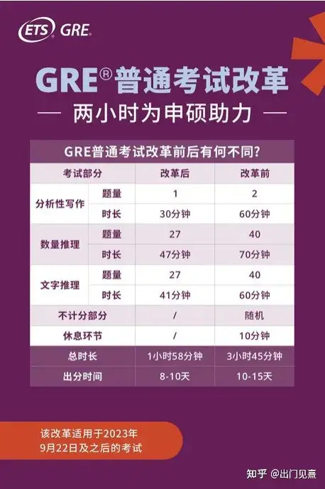

# GRE

## 说明

GRE的全称是Graduate Record Examination，由美国教育考试服务处（Educational Testing Service，简称ETS)主办，中文名称为美国研究生入学考试。

GRE考试是基于完全英语能力者的考试，既考试已经假定你的英语水平达到Native Speaker的水平了。在这个基础之上再考察考生的学术逻辑思维能力。简单来说，GRE考试是建立在语言基础上考察学术逻辑思维能力的测试。

GRE考试分为两种，一种是一般能力或称倾向性测验(General Test或Aptitude Test)--GRE。内容为测量考生的文字推理、数量推理、逻辑思维及分析性写作的能力。这些衡量标准并不针对某一特定的研究领域，而是旨在考察考生是否有能力在研究生和商学院继续深造。

另外一种是专业测验或称高级测验(Subject Test或Advanced Test)--GRE SUB。内容为测量考生在某一学科领域或专业领域内所获得的知识和技能以及能力水平的高低，从而帮助院校更好地了解申请人在某一学科领域的能力情况。一般申请人考的都是General Test，之后统称为GRE。

GRE考试有分机考和笔试。在包括中国大陆在内的世界上绝大多数国家和地区，GRE采用计算机考试的形式。在无法提供机考的地区，新GRE采用纸笔考试的形式。

不像雅思托福，GRE考试一般没有总分一说。V就是V，Q就是Q，AW就是AW。对于申请的大学而言，看中的是GRE的三科分数，以及percentile；且某些学校或专业会对申请者的GRE成绩有着小分要求。

### 新版GRE区别

ETS已经发布GRE改革的所有细节，**从2023年9月22日开始正式实行新版GRE考试。**

1. 考试总时长减少。从将近4小时的考试时间缩短到1小时58分钟。并且成为用时最短的研究生院、商学院及法学院入学考试（比GMAT和LSAT时间都短）。

2. 取消写作中的Argument，保留1篇Issue，考试时间由1小时降为30分钟。

3. VQ题型无变化，分数区间和算分机制不变，题量由40道减至27道，各2个section，V 41分钟完成，Q 47分钟完成。

4. 取消加试和10分钟的中场休息。

5. 缩短出分时间：从10-15天缩短至8-10天。

6. 新旧考试成绩参考性和认可度一致。

7. 提供一次免费的转考服务：已报名9月22日及以后线下考试的考生若想在9月22日之前完成考试，可于6月5日起登录[教育部教育考试院](https://www.zhihu.com/search?q=教育部教育考试院&search_source=Entity&hybrid_search_source=Entity&hybrid_search_extra={"sourceType"%3A"answer"%2C"sourceId"%3A3062621750})GRE报名网站进行一次免费转考。

8. 考试仍然是section-level adaptive（自适应）模式。

### 报名

[教育部教育考试院GRE考试报名网 (neea.edu.cn)](https://gre.neea.edu.cn/information.do?page=process)

成功完成GRE考试报名，须按顺序完成下列步骤：

1. 注册报名账户
2. 预付考试费
3. 注册考试

RE考试相关费用如下：

| **GRE考试费**     | **人民币 1665.00元** |
| ----------------- | -------------------- |
| **GRE考试转考费** | **人民币 388.00元**  |

考生完成费用支付后，在“我的主页”中点击“注册考试”，即可进行考试注册，每场考试的注册截止日期为考试日（不含考试当日）3天前。

- 查询并选择考位

  考生选择指定城市和考试日期，可查询不同考点的考位情况，系统只显示可预订的考场，座位暂满的考场会根据转考和取消考试的情况释放考位，建议您每周三、周五上午10时登录系统查询考位情况。

- 填写背景调查

  确认注册信息前，考生需完成背景调查，填报本人国籍、教育背景等信息。此外，考生可以选择是否注册免费的GRE搜索服务（[GRE Search Service](https://www.ets.org/gre/stusearch)），选择注册GRE搜索服务后，考生的个人信息、教育背景、联系信息等将会由ETS提供给相关院校，考生将会收到相关研究生课程、录取要求、财务资助、奖学金和其他研究生教育机会等信息。考生可前往ETS官方网站，了解更多关于[GRE搜索服务](https://www.ets.org/gre/stusearch)的信息。

- 确认注册信息并确认付费

  提交背景信息后，考生需再次确认考试注册信息，包括考试日期、考试时间、考场名称以及所报考考点的入校/入场要求，考生确认无误后点击“确认并提交”，系统将从考生账户余额中扣除考试费。

  注册成功后，考生可在报名账户“我的主页”，点击“查看已注册考试”来查看报名状态。

  ！重要提示：

  如需使用优惠券报名考试，请先绑定优惠券，并在确认付费时勾选符合使用条件的优惠券。在您使用代金券/促销代码注册考试后，ETS将会对您是否符合使用规则进行验证，如经验证不符合使用规则，您注册的考试将被取消，已支付考试费将会直接退回您的账户余额。

### 考生须知

[教育部教育考试院GRE考试报名网 (neea.edu.cn)](https://gre.neea.edu.cn/information.do?page=notice)

**证件要求**

中国大陆考生必须使用有效期内的居民身份证报名，这是唯一接受的身份证件。

**到达考场时间**

考试日考生到达考场检录处的时间不得晚于考试确认信中标明的最晚到达考场时间，如考点有特殊要求，请以[各考点入校/入场要求](https://news.neea.cn/GRE/1/news77_AllInfo.htm)为准，迟到者将被拒绝进入考场并不予退还考试费或免费转考。

**考生个人物品**

除与报名一致的身份证件原件之外，考试期间，任何个人物品禁止带入考试区域，考试区域包括等候室、考场、考试过程中使用的卫生间、楼道等区域。个人物品须存放在考点指定的地点，确保手机等通讯设备已关闭或调至静音状态。考试和休息过程中不得接触这些物品。教育部教育考试院、ETS和考点均不对丢失物品负责。

**考试注意事项**

考试期间，允许考生使用考务人员分发的铅笔和专用草稿纸作笔记，草稿纸只能在计时部分使用，非计时部分使用草稿纸视为考生违规行为。解锁前，考务人员将向考生提供2支铅笔和 3张专用草稿纸。每次更换草稿纸时，需3张同时更换。完成考试后，需将铅笔和3张草稿纸完整交还给考务人员。草稿纸必须保持完整，有缺损、撕毁等情况视为考生违规行为。

考试过程中考生仅可使用键盘和鼠标进行考试，不得擅自触摸和拔插计算机其他部件。因考生非正常使用导致退出考试系统或关机的，视为考生违规行为，如造成计算机或其他设备损坏的，由考生承担赔偿责任。

**考试成绩**

考生完成考试时，将在本人电脑屏幕上看到文字推理（Verbal Reasoning）和数量推理（Quantitative Reasoning）部分的非官方成绩，每部分的分数量表将使用130－170分1分进制的量表。因作文成绩需要额外的评分过程，考试结束时无法查看分析性写作（Analytical Writing）部分的成绩。考点不能提供考试成绩的打印件。

考试结束时，考生可以选择填写4个免费成绩单收件人（研究生院或提供奖学金方），如果未当场填报免费成绩单收件人信息，考生后续需登录本人[ETS账户](https://www.ets.org/r/gre/2022/gre_ereg.html)，付费申请增送成绩单服务。

考生可在考试结束8-10天后登录本人[ETS账户](https://www.ets.org/r/gre/2022/gre_ereg.html)查询官方成绩，考试成绩单将会在同一时间由ETS邮寄给您指定的成绩单收件人（研究生院或提供奖学金方）。考生如对本人成绩有任何异议，可联系ETS进行咨询或反馈（咨询邮箱：gre-info@ets.org）。

考生如需申请其他考试成绩相关服务，包括增送成绩、恢复已取消成绩、复议分析性写作部分的成绩等（详见[GRE考生手册](https://www.ets.org/pdfs/gre/gre-info-bulletin.pdf)），可登录本人[ETS账户](https://www.ets.org/r/gre/2022/gre_ereg.html)进行申请。

### 分数评价

新GRE属于自适应考试，分为easy,medium,hard 3个模式，第一section的做题情况会决定后面部分的难度及分数段。如果第一个section答题情况好（35%以上的正确率），那么很有可能会进入medium模式。正确率达到大概65%的时候，会进入hard模式。难度越高，得分也就越高。语文和数学各自的第一部分为**中等难度**，而各自第二部分的难度**取决于考生在第一部分中的表现**。（语文和数学两个科目之间在难度上互不影响。）

在GRE机考中，考生的语言推理和数量推理成绩取决于每个单项 **做对的题目数量**以及 **题目所在部分的难度**。越难的部分题目分值越高，而同一部分内每道题目分值相同。因此，考生只要第一部分做得足够好，接下来难度较高的第二部分即使正确率较低，最后成绩也不会差；反过来，如果第一部分做得足够糟糕导致第二部分进入低难度，则第二部分哪怕做得再好成绩也不会高。

## 组成

机考内容主要有三个组成部分：

- 分析性写作（Article Writing，简称AW）
- 文字推理（Verbal Reasoning，简称V）
- 数量推理（Quantitative Reasoning，简称Q）部分，1个Q包含选择题和填空题（填入数据），一共20题，要求35分钟完成。

| 类别     | 分数区间    | 分数段/分数级 | 总题数 | 用时        | 备注             |
| -------- | ----------- | ------------- | ------ | ----------- | ---------------- |
| **GRE**  | **260-340** |               |        | **1h58min** | **总分不含写作** |
| **写作** | **0-6**     |               |        | **30min**   |                  |
| **语文** | **130-170** |               | **27** | **41min**   |                  |
| S1       |             |               | 12     | 18min       |                  |
| S2       |             |               | 15     | 23min       |                  |
| **数学** | **130-170** |               | **27** | **47min**   |                  |
| S1       |             |               | 12     | 21min       |                  |
| S2       |             |               | 15     | 26min       |                  |

## 题型

### Analytical Writing

[GRE 一般测试分析Writing概述 (ets.org)](https://www.cn.ets.org/gre/test-takers/general-test/prepare/content/analytical-writing.html)

分析写作措施包括 30 分钟的“逻辑立论（Analyze an Issue）”任务。此任务对问题提出意见，并说明如何应对。您需要评估问题，考虑其复杂性，并提出理由和示例来支持您的观点。

你将使用ETS开发的基本文字处理器来输入你的论文回复。文字处理器包含以下功能：插入文本、删除文本、剪切并粘贴并撤消之前的操作。拼写检查器和语法检查器等工具不可用。

为了帮助您准备分析Writing措施，GRE 计划发布了将选择您的测试任务的整个任务池。您可能会发现查看问题和论点池很有帮助：[问题主题池 （PDF）](https://www.ets.org/content/dam/ets-org/pdfs/gre/issue-pool.pdf?_gl=1*2297ci*_gcl_au*MTM2NTA4ODc3NS4xNzIxNTMxMzU1LjE1NjcwMjI0NjIuMTcyMTc0MzI4NC4xNzIxNzQ0NjU2*_ga*MTkzMTUxMTgxMS4xNzIxNTMzMzgx*_ga_LSPK6N3LCN*MTcyMTg5NTMzOC4xNy4xLjE3MjE4OTc1MTcuMzcuMC4w&_ga=2.207745426.1675282448.1721729489-1931511811.1721533381)

### Verbal

[GRE 一般测试口头推理概述 (ets.org)](https://www.cn.ets.org/gre/test-takers/general-test/prepare/content/verbal-reasoning.html#accordion-9f58105fc6-item-d0162f9786)

主要题型为以下三种：

- Reading Comprehension 阅读理解 (单选题，多选题，选句)
- Text Completion 段落完形填空(三选一，五选一，每空独立选择，没有连带关系)
- Sentence Equivalence 句子对等/同义句填空 (六选二)

#### 阅读理解

阅读理解部分的题型主要包括三种：

- 单项选择题(选择五个选项中唯一正确的答案)
- 不定项选择题(选择三个选项中所有正确的答案)：每个问题有三个答案选项，一个到三个正确答案。选择所有正确答案以获得这些问题的分，您必须选择所有正确答案；部分正确答案没有分。
- 从段落中选择句子(Select-in-Passage，在文章中选择符合题目要求的句子)：在这些问题中，您将在段落中选择符合特定描述的句子。要做到这一点，请单击句子中的任何单词或使用键盘选择句子。在较长的段落中，这个问题通常只适用于一两个指定的段落；您将无法在段落的其他地方选择句子。（类似CET4的段落匹配？）

#### 填空

填空的题型：每个段落由一到五个句子组成，每个句子有一到三个空白。如果有两个或三个空白，每个空白有三个答案选择；如果只有一个空白，则有五个答案选项。

每个空白都有一个正确答案。不同空白的答案选项独立发挥作用，即一个空白选择一个答案选项不会影响另一个空白选择的答案选项。部分正确答案不计分。

#### 句子对等（6选2）

每个问题由一句话组成，其中有一个空白和六个答案选项。选择两个答案选项。部分正确答案不计分。

### Quantitative

[GRE 一般测试定量推理概述 (ets.org)](https://www.cn.ets.org/gre/test-takers/general-test/prepare/content/quantitative-reasoning.html#accordion-eb7b696bc8-item-a0c181a566)

GRE数学部分主要考察以下四个主要领域：

- 算术：数字属性、素数、奇数和偶数整数、算术运算、指数和根、绝对值、数字行、百分比、比率和数字序列。
- 代数：代数表达式、线性和二次方程、联立方程、不等式、函数、基于现实世界问题的方程。
- 几何：线条、三角形、圆形、矩形、正方形、四边形、多边形、3D图形 – 圆柱体、圆锥体、球体和长方体、面积、周长、体积、坐标几何。
- 数据分析：统计 ，排列和组合，概率，数据解释 。

题型包括：

- 数量比较题
- 单项选择题
- 多项选择题
- 数字填空题

每个问题都单独显示为离散问题，或作为一组称为数据解释集的问题的一部分。数据解释集中的所有问题均基于表格、图表或其他数据显示中呈现的相同数据。问题被分组在一起，并参考相同的表格、图表或其他数据显示。这些问题要求您解释或分析给定的数据。问题类型可以是多项选择（两种类型）或数字输入。

#### 数量比较题

这些问题要求您比较两个数量 - 数量 A 和数量 B - 然后确定以下哪项陈述描述了比较。

- 数量 A 更大。
- 数量 B 更大。
- 两个数量相等。
- 无法根据提供的信息确定关系。

#### 单项选择题

从五个选项的列表中选择一个答案选项

#### 多项选择题

从选项列表中选择一个或多个答案选项。该问题可能会或可能不会指定要选择的选项数量

#### 数字填空题

这些问题要求您在单个答案框中以整数或小数形式输入答案，或在两个单独的框中以分数形式输入答案 - 一个用于分子，一个用于分母。您将使用计算机鼠标和键盘输入您的答案。

## 练习

模拟测试：[GRE小测验 --- GRE Mini Quiz (ets.org)](https://www.cn.ets.org/gre/gre-mini-quiz.html)

一些测试程序：[考试准备电子书和服务 --- Test Preparation Ebooks and Services (ets.org)](https://ereg.ets.org/ereg/testPrep/viewEbooksSerives)