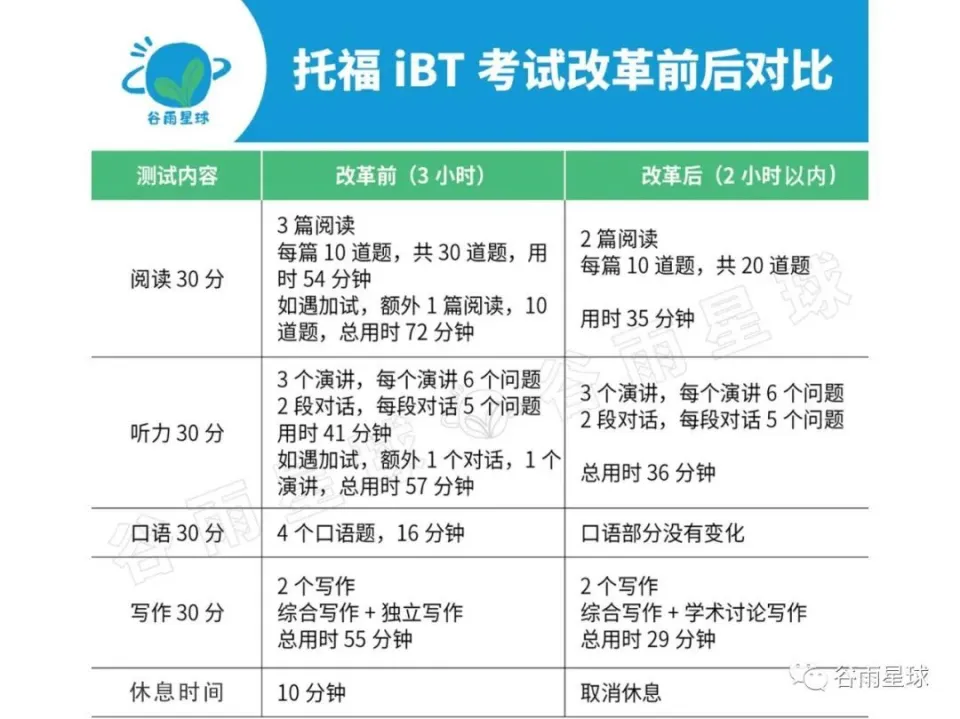
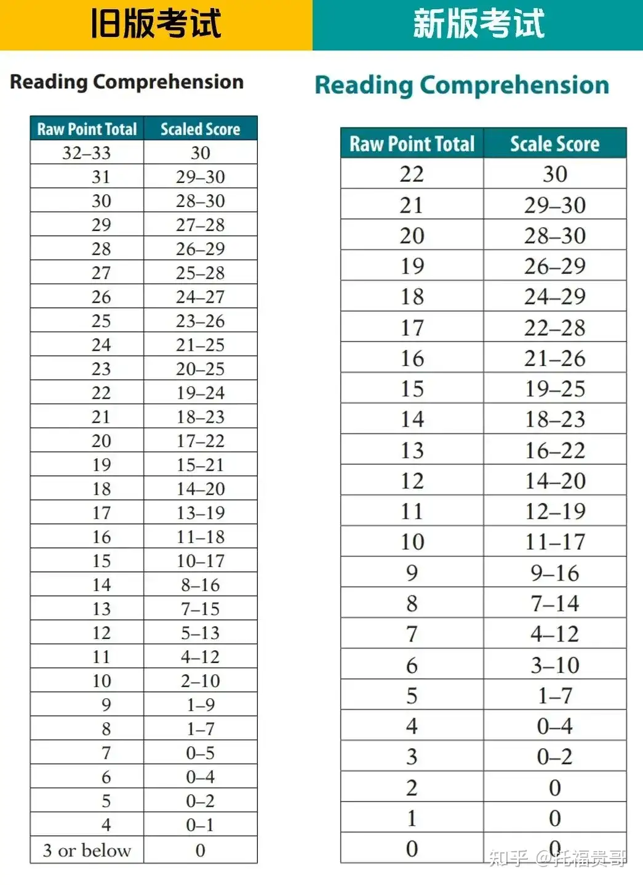
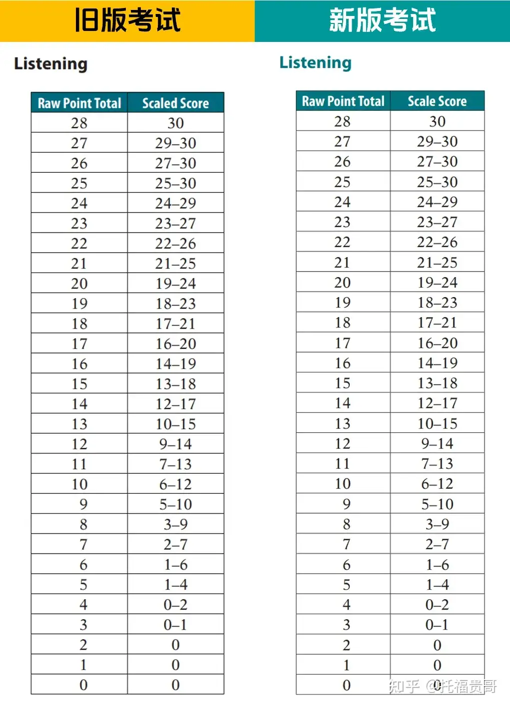

# TOEFL

## 说明

托福考试（Test of English as a Foreign Language，简称TOEFL）是由[美国教育考试服务中心](https://www.zhihu.com/search?q=美国教育考试服务中心&search_source=Entity&hybrid_search_source=Entity&hybrid_search_extra={"sourceType"%3A"answer"%2C"sourceId"%3A902895605})（Educational Testing Service，简称[ETS](https://link.zhihu.com/?target=https%3A//www.ets.org/toefl)）举办的[英语能力考试](https://www.zhihu.com/search?q=英语能力考试&search_source=Entity&hybrid_search_source=Entity&hybrid_search_extra={"sourceType"%3A"answer"%2C"sourceId"%3A902895605})。托福考试采用的是TOEFL iBT(Internet Based Test)形式，即网络版托福考试，这种形式自2006年引入中国以来，已经在140余个考点开考。考试总分为120分，各单项满分为30分。考试顺序为阅读、听力、口语、写作，全程约2小时。

为了准备托福考试，考生通常需要通过大量的练习来熟悉考试格式和题型，包括使用官方提供的备考材料如TPO(Test of English as a Foreign Language Practice Online)，以及参考高分经验分享等方式来提高自己的英语水平。此外，考生还需要注意扩充词汇量和提高阅读、听力、口语和写作各方面的技能。

一般考试（比如雅思）采用的都是面对面的考试，面对考官会很紧张，但托福考生口语考试只需对着面前的麦克风回答问题，更容易发挥出良好的水平。与雅思口语一个人打分不同，托福考生的成绩由三到六位 ETS 评分员综合意见产生，而不是一位，减少了因为一个人主观偏见导致的得分偏差，最大限度地确保了成绩的公正、客观。

数据统计[中国学生](https://www.zhihu.com/search?q=中国学生&search_source=Entity&hybrid_search_source=Entity&hybrid_search_extra={"sourceType"%3A"answer"%2C"sourceId"%3A902895605})平均托福考试次数为4.19次，续航教育的顾问老师建议申请者在[正式申请](https://www.zhihu.com/search?q=正式申请&search_source=Entity&hybrid_search_source=Entity&hybrid_search_extra={"sourceType"%3A"answer"%2C"sourceId"%3A902895605})前至少有半年时间准备准备托福考试，并在每两个月准备后参加一次托福考试。若考试成绩理想，可将时间及精力放在备战其他考试或文书撰写等方面；若考试成绩不理想，也可有充足时间准备第二次甚至是第三次考试，直至达到理想的分数。托福考试报考没有次数限制，但是两次考试时间间隔不得低于12天。部分学校会审核学生考试次数，考试太频繁会给学校留下不好印象，所以还是建议托福考生全力以赴努力准备考试，从而减少考试次数。

考生在完成所有考试离开考位前，即可在考试电脑上立即查看阅读和听力部分的非正式成绩，并获知正式成绩报告的发布日期。考生可根据情况选择提交答案或取消成绩。托福网考®成绩自考试日起两年内有效。在考试日结束约4至8个工作日后（可能有少许例外），考生可通过教育部教育考试院托福网考®报名系统查询正式成绩。除了正式成绩，考生还将免费得到一份“*MyBest*® Scores”成绩。*MyBest*®Scores 将从考生过去两年内全部有效成绩中，选取阅读、听力、口语、写作四个单项的最高得分，组合为个人最佳成绩。考生参加托福网考®的次数不受限制，但两次考试之间的时间间隔不得小于3个自然日。

### 新版TOEFL对比

2023年7月26日实行新版

### 报名

在中国大陆地区参加托福网考®的考生，请登录教育部教育考试院托福网考®报名网站进行注册，网址为[https://toefl.neea.cn](https://toefl.neea.cn/)或[https://toefl.neea.edu.cn](https://toefl.neea.edu.cn/)

| 项目                                       | 费用   |
| ------------------------------------------ | ------ |
| **托福网考® 考试费**                       | 2100元 |
| **逾期报名附加费**                         | 310元  |
| **转考费**                                 | 620元  |
| **恢复已取消的成绩**                       | 154元  |
| **成绩增送费（每份）**                     | 146元  |
| **口语或写作单项复议**                     | 615元  |
| **口语和写作双项复议**                     | 1229元 |
| **托福网考® 复习套餐Prem（不包含考试费）** | 1086元 |
| **托福网考® 复习套餐Prep**                 | 395元  |
| **托福网考® 复习套餐TPO**                  | 226元  |
| **折扣后报名费**                           | 1831元 |

当**“我的托福网考®主页”**显示的帐户余额已够支付托福网考服务项目时，点击**“注册考试”**，即可注册托福网考®考试。

距考试日7天前（不含考试日）为常规报名日；距考试日前第7天至考试日第2天（不含考试日）前为逾期报名日，报名要支付逾期报名附加费，考前2天停止报名。

例如：考试日为8月8日，则此次考试的常规报名将在8月1日零时截止。8月1日零时至8月6日零时为逾期报名阶段，在此阶段报名须支付逾期报名附加费。8月6日零时起停止报名。

注册考试，填写报名表并确认付费分为4个步骤：**考位查询-预定考位-填写报名表-确认付费**，完成以上步骤则成功注册了一场考试。 您可以在“注册考试”页面选择所在城市和一个考试日期然后点击**“考位查询”**，系统会列举出符合条件的考场。 选择某个考场点击**“立即预定”**按钮即可，当该考场没有安排考试或者座位已全被注册完，**“立即预定”**按钮就无法点击。 注册完后，屏幕会显示您注册考试的详细信息，包括考试名称、考试日期和时间、考场名称和考场地址。 如您确认以上信息都正确无误，可以点击**“提交”**按钮，网站会引导您前往“填写报名表”的页面。 请您按照实际情况如实填写报名表信息及背景调查信息， 确认无误后点击**“提交报名表”**。 网站会提示您即将扣除考试费，如您确认所有报考信息均准确无误后，请点击**“确认支付考费”**，在二次确认后，系统将扣除您托福账户余额中的考试费。 您可以在**“我的托福网考®主页”-“查看已注册信息”**中查询到注册成功的考试。 确认注册考试后，您可以在“查看已注册信息”页面中点击“成绩单收件人”项后面的**“添加/修改”**按钮输入四个免费送分学校的信息，如您还没有这方面的信息，可暂时不填。但请注意，如您想参加考试以后再给学校送分，那么每送给一个学校您就要支付人民币146元。

### 考生须知

[考生须知 (neea.edu.cn)](https://toefl.neea.edu.cn/information_cn.html)

**托福网考报名分为以下三个步骤**

1、注册成为网上报名系统用户，创建个人账户

2、支付考试费

3、注册考试，填写报名表并确认付费

**证件要求**

中国大陆考生必须使用有效期内的居民身份证报名，这是唯一接受的身份证件。

**考生到达考场时间**

考试日考生到达考场检录处的时间不得晚于考试确认信中标明的最晚到达考场时间，如考点有特殊要求， 请以[各考点入校/入场要求](https://news.neea.cn/TOEFL/1/news20200827AllInfo.html)为准，迟到者将被拒绝进入考场并不予退还考试费或免费转考。

**关于个人物品**

除与报名一致的身份证件原件之外，考试期间，任何个人物品禁止带入考试区域，考试区域包括等候室、考场、考试过程中使用的卫生间、楼道等区域。个人物品须存放在考点指定的地点，考试和休息过程中不得接触这些物品。教育部教育考试院、ETS和考点均不对丢失物品负责。

违禁物品包括但不限于：

- 电子及通讯设备
- 计时器
- 自带文具
- 自带键盘
- 自带纸张
- 背包、钱包和钱夹
- 参考资料
- 食品、饮料和药物
- 外套（如：棉服、风衣、夹克、披肩等）、帽子、围巾、手套、饰品
- 监考人员认为违规的其他物品

**考试注意事项**

1. 考生应按考试确认信所要求的时间到达考点检录处，迟到将被拒考，不予退费或免费转考。
2. 考生考前必须阅读并签署《保密协议》。如考生拒绝签署《保密协议》，考点将做拒考处理，不予退费或免费转考。
3. 除与报名信息一致的有效证件原件外，其他所有个人物品请存放在储物柜中，将食物、饮料和药物放在指定储存处。关手机闹铃后关闭手机。口袋清空，考生只能携带有效证件原件和储物柜钥匙进入考场。
4. 考生每次进入考场前，均须接受身份验证和金属探测仪安检（扫描范围包括头部、躯体全部、鞋子），如衣物有口袋的，还需将所有口袋外翻。
5. 考生入场后将证件放在桌面上，显示个人信息的页面向上，每次出入考场均需随身携带身份证件。
6. 解锁前，考生不得触碰键盘、鼠标和耳机。
7. 解锁前，考务人员向每个考生提供2支铅笔和 3 张专用草稿纸。更换草稿纸时，需3张同时更换。草稿纸必须保持完整，有缺损、撕毁等情况视为考生违规行为。草稿纸只能在计时部分使用，非计时部分使用草稿纸，属于违规行为，考务人员将提交报告给 ETS。完成考试后，需要将铅笔和3张草稿纸完整交还给考务人员。
8. 考试期间如有违规、作弊、违反考试纪律等行为，考务人员将按照有关规定处理，并向ETS提交报告。违规、舞弊、违反考试纪律的行为将会影响考生的考试成绩甚至考试资格。因此被取消考试成绩或考试资格的考生不得申请免费转考或退费。情节严重者将在一段时间内被禁止参加ETS主办的多项考试。
违规、作弊、违反考试纪律的行为包括但不限于：
（1）考生在考场内被发现携带禁止带入考场的物品。
（2）考生使用假证件或发现枪手替考。
（3）考试过程中发现考生作弊（包括但不限于：违规使用电子设备、夹带纸质资料、偷看他人电脑、擅自调换座位等）。
（4）考试过程中发现考生故意关机或有其他损毁考试设备的行为。
（5）考生在非计时部分使用草稿纸。
（6）考生在非计时部分延误时间过长。
（7）托福网考®口语考试过程中故意不让系统录制口语作答内容。
（8）考生擅自离开考试区域。
（9）考生存在其他严重扰乱考场秩序或造成严重后果的行为。
（10）主考认定的其他违规违纪行为。
9. 进入考场后至最早离场时间前不得离开考点。
最早离场时间：上午场——10:00；下午场——15:00。
10. 考生在考试过程中有任何问题或需要，包括但不限于：更换草稿纸或铅笔，电脑死机或黑屏等，请立即举手示意。
11. 考试一旦开始，因个人原因未完成考试，不予退还考试费或免费转考。

**考试成绩**

通常情况下，考生可在考试结束约4至8天后（可能有少许例外）登录本网站查询成绩。ETS官方纸质成绩单于考试日后8周左右通过快递寄送到考生报名时提交的中文地址。快递单号将显示在考生个人账户中。托福网考®成绩的有效期为考试日后2年。请注意，ETS仅提供一份纸质成绩单，如因考生个人原因丢失，不予补办。

### 分数评价

每项技能都有四到五个熟练程度级别，因此您的分数在该范围内会告诉您对该技能的熟练程度。

| 技能      | 水平                                                         |
| :-------- | ------------------------------------------------------------ |
| Reading   | 高级 (24–30) 中上级 (18–23) 中下级 (4–17) 下级 (0–3)         |
| Listening | 高级 (22–30) 中上级 (17–21) 中下级 (9–16) 下级 (0–8)         |
| Speaking  | 高级 (25–30) 中上级 (20–24) 中下级 (16–19) 初级 (10–15) 下级 (0–9) |
| Writing   | 高级 (24–30) 中上级 (17–23) 中下级 (13–16) 初级 (7–12) 下级 (0–6) |

有关更多信息，请参阅 [*TOEFL iBT®测试的性能描述符*（PDF）](https://www.ets.org/content/dam/ets-org/pdfs/toefl/toefl-ibt-performance-descriptors.pdf?_gl=1*s60ejz*_gcl_au*MTM2NTA4ODc3NS4xNzIxNTMxMzU1LjE1NjcwMjI0NjIuMTcyMTc0MzI4NC4xNzIxNzQ0NjU2*_ga*MTkzMTUxMTgxMS4xNzIxNTMzMzgx*_ga_T2TH8KSGFZ*MTcyMTg3OTcyNy45LjEuMTcyMTg4MTA3MC4wLjAuMA..&_ga=2.268696049.1675282448.1721729489-1931511811.1721533381)。

#### 阅读

**评分标准，容错率更低：**阅读部分的原始分满分为22分，因为其中包含一个6选3的小结题，每题2分，共20题。

**答对所有题目，可获得22分的原始分，即满分成绩30分的Scaled Score。**相较于改革前的[满分容错率](https://www.zhihu.com/search?q=满分容错率&search_source=Entity&hybrid_search_source=Entity&hybrid_search_extra={"sourceType"%3A"answer"%2C"sourceId"%3A3479493046})，**现在阅读考试满分难度大幅上升。**

而且，不同类型的题目有不同的分值占比。例如，小结题（6选3）每题2分，而其他题型每题1分。假如，你的小结题正确率很低，那剩下错题数量要控制在2道以内才行。

**另外，官方算分还会考虑到题目的难度和类型！**

每一次托福考试都会**根据考试难度进行分数调整（也就是我们说的[curve分数](https://www.zhihu.com/search?q=curve分数&search_source=Entity&hybrid_search_source=Entity&hybrid_search_extra={"sourceType"%3A"answer"%2C"sourceId"%3A3479493046})），**但不会差太多，0-2分区间内的调分。

所以，总的来说，**不同场次的题目的分值可能并非等同，考场上看到的即时分数≠[最终分数](https://www.zhihu.com/search?q=最终分数&search_source=Entity&hybrid_search_source=Entity&hybrid_search_extra={"sourceType"%3A"answer"%2C"sourceId"%3A3479493046})。**

#### 听力

**7月26日后，[托福听力](https://www.zhihu.com/search?q=托福听力&search_source=Entity&hybrid_search_source=Entity&hybrid_search_extra={"sourceType"%3A"answer"%2C"sourceId"%3A3479493046})的题型为：3段讲座，每段6个问题；2段对话，每段5个问题，考试时长36分钟。**

两个题型中，Lecture部分通常涉及学术内容，而Conversation部分则更侧重于日常交流。

**在本次最新版OG中，Lecture部分的话题内容进行了微调，**新增了如艺术类别中的“Painters and Painting（画家和绘画）”等子话题，并对[生命科学](https://www.zhihu.com/search?q=生命科学&search_source=Entity&hybrid_search_source=Entity&hybrid_search_extra={"sourceType"%3A"answer"%2C"sourceId"%3A3479493046})中的“Virus（病毒）”进行了分类调整。

**评分标准如下：**去年的改革中，听力除了取消“confirm（确认）”按键外，题型和数量均未有变化，**所以评分标准也和改革前一致，错3题之内都有可能得到满分。**

值得一提的是，**听力的题型多变、评分标准也都不同：**

**单选题：**每个1分，选对得分，选错不得分；

**双选题：**每个1分，选对2个得分，选错了1个或者都选错了得0分；

**[五选三](https://www.zhihu.com/search?q=五选三&search_source=Entity&hybrid_search_source=Entity&hybrid_search_extra={"sourceType"%3A"answer"%2C"sourceId"%3A3479493046})：**每个2分，选对3个得2分，选对2个得1分，选对1个（至少会选对一个，因为5个选项里面只有2个错误答案，所以怎样都会有一个是对的）不得分；

**表格题、[排序题](https://www.zhihu.com/search?q=排序题&search_source=Entity&hybrid_search_source=Entity&hybrid_search_extra={"sourceType"%3A"answer"%2C"sourceId"%3A3479493046})（不常见题型）：**一般是2~3分，每出现一个错误扣1分，直到扣到0分为止。

和阅读相比，**听力的评分比较"随意"了。**

特别是在25分到30分之间，即便几个人都拿了30分，但他们的[原始分](https://www.zhihu.com/search?q=原始分&search_source=Entity&hybrid_search_source=Entity&hybrid_search_extra={"sourceType"%3A"answer"%2C"sourceId"%3A3479493046})，可能会相差1-3分，这也说明，更有可能拿高分了~

使用NEEA用户号（NEEA ID）可在网上多次报考托福网考®考试。

[我的托福网考主页 - 教育部教育考试院托福网上报名 (neea.edu.cn)](https://toefl.neea.edu.cn/myHome/21699032/index#!/homepage)

## 组成

[考试介绍 - 中国教育考试网 (neea.cn)](https://toefl-main.neea.cn/html1/folder/1507/1026-1.htm)

| 类别  | 分数 | 题数 | 用时  | 备注                 |
| ----- | ---- | ---- | ----- | -------------------- |
| TOEFL | 120  |      | 2h    |                      |
| 阅读  | 30   | 20   | 35min | 2篇文章*10题         |
| 听力  | 30   | 28   | 36min | 3个讲座*6+2段对话\*5 |
| 口语  | 30   | 4    | 16min | 1+3                  |
| 写作  | 30   | 2    | 29min | 1+1                  |

- 阅读（考试时长：35分钟）：2篇学术文章，每篇文章约700字，每篇文章设10道题
- 听力（考试时长：36分钟）：
  - 3个讲座，每个讲座时长3-5分钟，每个讲座设6道题。
  - 2段对话，每段对话时长3分钟，每段对话设5道题
  - 注意：在整个测试过程中，您可以对任何音频项目做笔记，以帮助您回答问题。
- 口语（考试时长：16分钟）：
  - 1道独立试题：要求考生依据自己的想法、观点和个人经历作答
  - 3道综合试题：要求考生综合利用口语、听力和阅读语言技能答题
  - 注意： 在每次回答之前，您将获得 15–30 秒的准备时间，您的回答将持续 45 或 60 秒。要回复，您将对着麦克风讲话，您的回复将被记录下来。
- 写作（考试时长：29分钟）
  - 1道综合试题（20分钟）：阅读一段简短的段落并听一段简短的演讲，然后根据您所读和听的内容写作。
  - 1道学术讨论试题（作答时间：10分钟）：模拟线上课堂讨论，要求考生针对指定话题阐述观点并提供论据
  - 注意： 您将在电脑键盘上输入答案。

## 练习

官方练习题：[TOEFL iBT 测试的无障碍格式测试准备 (ets.org)](https://www.cn.ets.org/toefl/test-takers/ibt/prepare/accessible.html)

40分钟的托福iBT样本测试体验：[TOEFL iBT考生表格 --- TOEFL iBT Test Takers Form (ets.org)](https://www.cn.ets.org/forms/toefl-sampler-forms/test-taker.html)

官方评分测试网站：[测试准备库 --- Test Prep Library (ets.org)](https://testready.ets.org/test-prep-library)